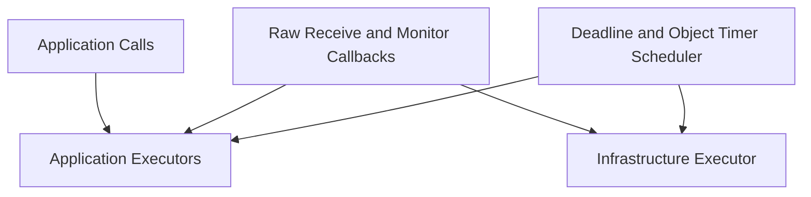
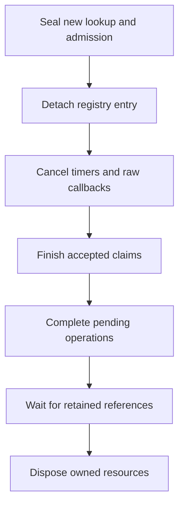

# Concurrency and resource ownership

[Mailbox and dispatch](03-mailbox-dispatch.ko.md) ·
[Liveness and monitoring](07-liveness-monitoring.ko.md)

## 1. Concurrency model

언어별 runtime은 thread 이름과 scheduler 구현이 달라도 같은 execution domain을 분리한다.

Raw callback은 record를 복사하거나 retain하고 mailbox에 전달한 뒤 즉시 반환한다. Application handler를 raw I/O
thread에서 실행하지 않는다. Infrastructure executor는 application callback이 await 중이어도 reply, lease,
recovery와 shutdown을 진행한다.

## 2. Resource tree

| owner | 직접 소유하는 resource |
|---|---|
| host aggregate | raw context, topology registry, provider, executor, scheduler, termination operation |
| topology runtime | raw socket, peer registry, selection snapshot, topology monitor state |
| object aggregate | mailbox, handler scope, timer set, child Actor·session reference |
| operation entry | correlation route, deadline task, completion and retained request metadata |
| transfer aggregate | reservation, authority snapshot, checkpoint reference, participant and journal |
| session aggregate | raw connection route, decoder, outbound FIFO, binding and reply capability |
| observer | bounded queue, sequence cursor and cancellation registration |

Resource를 만든 owner가 close한다. Child가 parent resource를 사용하는 동안 strong reference 또는 language-native
lifetime token을 보유한다. Public handle은 raw pointer가 아니라 disposed와 generation을 검증하는 runtime reference다.

## 3. Synchronization scope

한 거대한 host lock으로 handler와 I/O를 직렬화하지 않는다. 각 aggregate는 자신의 state와 queue를 보호하고,
cross-aggregate transition은 immutable snapshot과 authority CAS로 연결한다.

Lock이 필요한 구현은 다음 순서를 유지한다.

1. host lifecycle와 barrier state
2. topology·peer registry
3. object 또는 session state
4. operation·transfer entry
5. mailbox queue
6. monitoring reducer

Raw send serialization lock은 위 state lock을 잡지 않은 상태에서 획득한다. Store, Checkpoint provider, application
callback, observer callback, scheduler cancel과 raw blocking call을 lock 안에서 호출하지 않는다. 언어 runtime이
actor loop나 serial executor를 사용하면 같은 순서를 message ownership 규칙으로 보존한다.

## 4. Lifetime와 close

Registry lookup은 aggregate strong reference와 expected generation을 함께 반환한다. Close는 먼저 registry에서 새
lookup과 admission을 막고, active reference가 release될 때까지 bounded하게 기다린 뒤 resource를 dispose한다.
늦은 callback은 captured generation과 terminal flag를 확인하고 state를 변경하지 않는다.

Deadline 안에 반환하지 않은 application·observer callback reference는 host aggregate에서 분리한 tombstone
aggregate로 옮긴다. Tombstone은 immutable callback input, generation fence, 지연 release reference만 가지며
provider, socket, timer, executor admission과 authority를 소유하지 않는다. 따라서 host는 raw resource를 유한하게
정리해 `ForceStopped`를 완료할 수 있고, 늦게 반환한 callback은 terminal host를 다시 사용하지 않고 reference만
해제한다.

Dispose는 idempotent하다. 같은 resource의 concurrent close는 첫 close operation에 합류한다. Forced teardown도
waiter와 blocking receive를 깨우고 terminal state를 한 번만 publish한다.

## 5. Operation와 timer ownership

Operation entry는 자신의 deadline task를 소유한다. Reply, timeout, cancellation과 shutdown 중 terminal owner가
정해지면 table과 scheduler에서 entry를 detach한다. Scheduler cancel과 caller continuation 실행은 table lock 밖에서
수행한다. 128-bit operation ID는 lifecycle 안에서 재사용하지 않아 늦은 timeout과 새 operation의 ABA를 막는다.
Ordinary request의 64-bit correlation은
[Wire protocol §6](02-wire-protocol.ko.md#6-maintenance-identity와-frozen-record)에 따라 connection lifetime과
함께 operation ID를 찾는 wire-local key로만 사용한다.

Object timer handle은 owner aggregate가 소유한다. Timer scheduler는 callback을 직접 실행하지 않고 generation이
포함된 mailbox record를 만든다. Close 또는 transfer가 timer를 detach한 뒤 발생한 tick은 fence 검사에서
폐기한다.

## 6. Bounded resources

다음 resource는 명시적인 count와 byte limit을 가진다.

- application·infrastructure mailbox
- pending one-way admission과 request operation table
- Instance activation follower queue
- transfer journal과 participant window
- STREAM inbound decode buffer와 outbound FIFO
- observer event queue
- protocol frame, metadata와 checkpoint envelope

Runtime snapshot과 metric은 current usage, limit, rejection과 high-water를 제공한다. Limit을 넘기기 전에 allocation을
예약하고 실패하면 public backpressure, target rejection 또는 infrastructure error로 변환한다. Unbounded retry,
polling loop와 observer별 별도 thread를 만들지 않는다.

## 7. Shutdown order

Host coordinator는 다음 순서로 resource를 닫는다.

1. 신규 application admission과 public operation 시작을 막는다.
2. accepted owner claim과 request completion을 deadline까지 처리한다.
3. transfer, Location lease와 STREAM barrier를 terminal 상태로 만든다.
4. object timer, session binding과 일반 observer producer admission을 막고 reserved terminal lane은 유지한다.
5. peer connector, listener와 raw socket callback을 중지한다.
6. scheduler와 executor queue를 drain하거나 bounded cancel한다.
7. provider와 raw context를 닫는다.
8. Reserved observer lane으로 final snapshot과 terminal event를 게시하고 queue를 닫은 뒤 waiter result를 완료한다.

Terminal result 뒤에는 callback, timer, completion과 monitor event를 새로 시작하지 않는다. Deadline을 넘은
resource는 ForceStopped reason에 포함하고 같은 close 순서를 bounded cleanup으로 수행한다.

## 8. Concurrency invariants

- 같은 Spot 또는 Actor의 application turn은 동시에 하나만 실행한다.
- Application handler 대기는 infrastructure progress를 막지 않는다.
- 한 request와 한 host termination은 terminal completion 하나만 가진다.
- Successor connection과 authority를 늦은 disconnect·lease completion이 되돌리지 않는다.
- Mailbox admission과 ready state는 같은 queue transition을 나타낸다.
- Store·raw I/O·callback을 state lock 안에서 기다리지 않는다.
- Close 반환 뒤 해당 handle에서 새 callback을 시작하지 않는다.
- Host-owned resource count가 baseline으로 돌아오기 전 host dispose를 완료하지 않는다. Tombstone의 지연 callback
  reference는 별도 count로 관측하며 terminal host의 재사용과 `ForceStopped` 완료를 막지 않는다.
