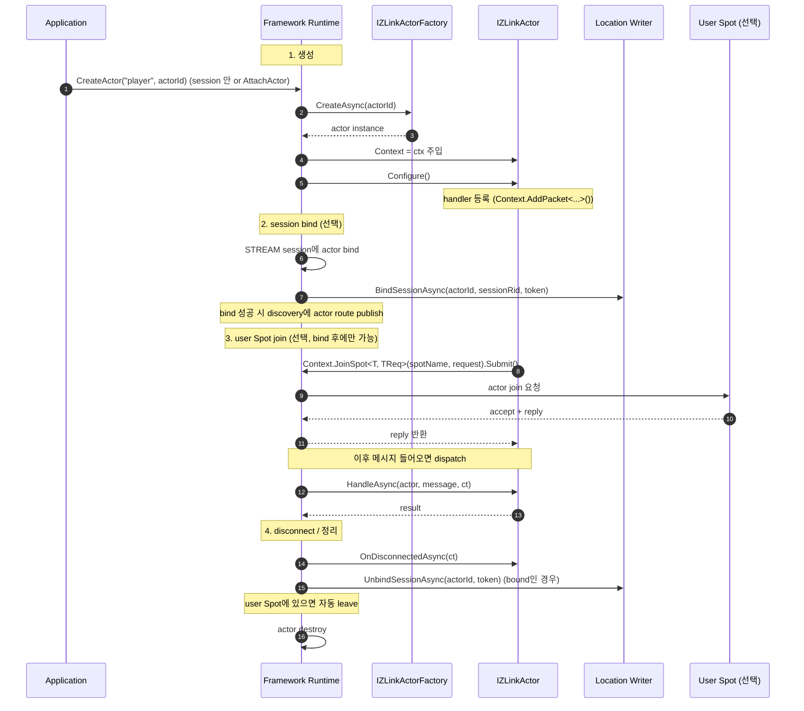
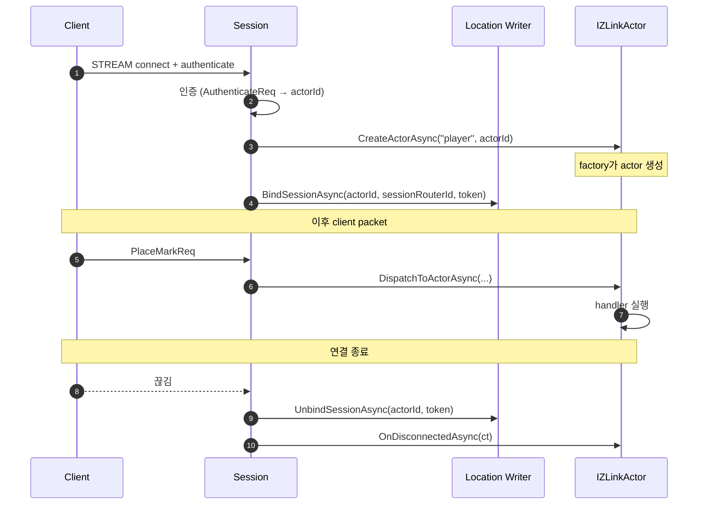
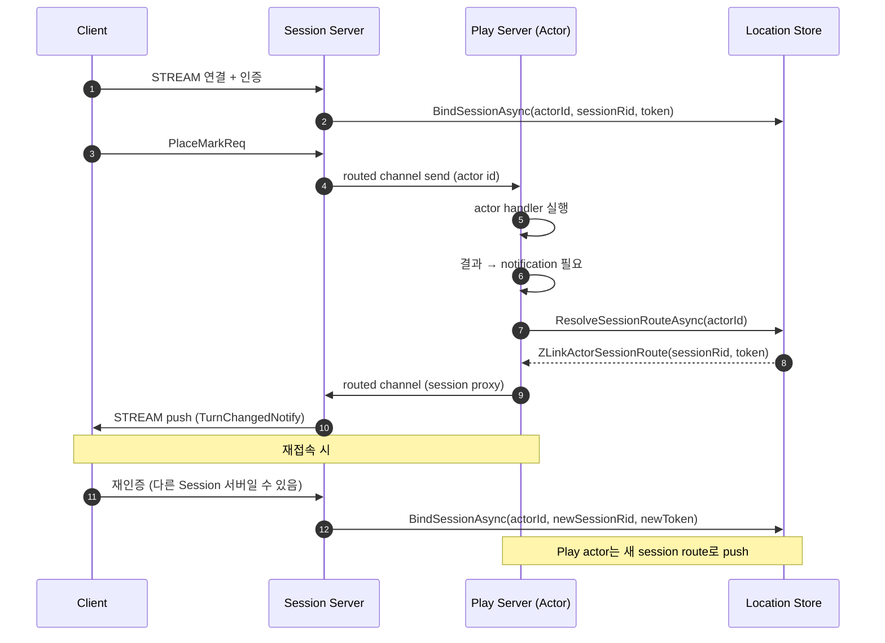

[스펙 목차](../../../README.ko.md)

[.NET 묶음](./README.ko.md) | [인터페이스](./handler-interfaces.ko.md) | [channel](./aspnet-core-channel-messaging.ko.md) | [SPOT](./aspnet-core-spot.ko.md) | [STREAM](./aspnet-core-stream.ko.md) | [Registry](./aspnet-core-registry.ko.md)

# Draft -- ZLink Framework ASP.NET Core Actor

> 이 문서는 **구현 전 초안**이다.
> 현재 공개 계약이 아니며, framework에서 actor[^actor] 개념을 어떻게 노출할지 정리
> 한다.

## 1. 목적

zlink core가 정의한 **actor**[^actor] 개념을 `ASP.NET Core` 앱에서 .NET-idiomatic
하게 노출하는 것이 목표다.

zlink core 모델에서 actor는 다음 속성을 가진다 (자세한 내용은 zlink core의
[SPOT Actor Guide](../../../../../../doc/guide/07-4-actor.md) 참고).

- **`SpotNode`에 소속된다.** 생성 직후 actor는 그 node의 `Entry Spot`[^entryspot]에
  속한다.
- 선택적으로 **STREAM session에 binding**할 수 있다. 1개 session에는 여러 actor가
  bind될 수 있지만, 1개 actor는 한 번에 최대 1개 session에만 bind된다. session
  bind가 성공해야 actor route가 discovery에 publish된다.
- 선택적으로 **user Spot에 join**할 수 있다. Entry Spot에서 user Spot으로 이동한
  다. user Spot join은 actor가 **이미 STREAM session에 bind된 경우에만 허용된다**.
- user Spot에서 다시 Entry Spot으로 돌아가려면 **leave**, 완전히 제거하려면
  **destroy**한다. destroy는 actor가 Entry Spot에 있을 때만 허용된다.

framework는 위 모델 위에 .NET 라이프사이클(constructor injection, `OnDisconnectedAsync`,
DI scope)과 fluent 호출(`IZLinkActorContext`, `IZLinkActorClient`, `IZLinkSessionProxy`)
을 얹어서 노출한다. 다음 두 가지는 구분해서 본다.

- **framework가 자동으로 관리하는 것**: Entry Spot 자체의 생성과 소멸, user Spot
  에서 Entry Spot으로의 leave, actor destroy. 즉 application은 `zlink_spot_node_entry_spot()`
  / `zlink_spot_node_actor_leave_spot()` / `zlink_spot_node_actor_destroy()` 같은
  raw API를 직접 호출하지 않는다.
- **application이 구현하는 Entry Spot 로직**: actor가 Entry Spot에 있는 동안 받는
  packet의 handler는 application이 정한다. actor 클래스의 `Configure()`에서
  `Context.AddPacket<...>()`로 등록한 handler들이 그 actor가 Entry Spot에 있는
  동안 packet을 처리한다. 인증 결과로 target user Spot을 선택해서 `JoinSpot(...)`
  을 호출하는 것 같은 entry-stage application 로직이 여기 들어간다.

호출하는 쪽에서는 actor가 어느 노드 어느 spot에 있는지 알 필요 없이 **`actorId`**
하나로 부르고, 라우팅은 framework가 application이 등록한 resolver에 위임한다.

본 문서가 다루는 범위:

- actor 라이프사이클 (Entry Spot 머무름 → session bind → user Spot join → disconnect)
- handler 모델 (typed actor handler / 일반 actor handler)
- Entry Spot에서의 application 로직 (인증, target Spot 선택)
- STREAM session binding
- user Spot join (framework가 노출하는 표면)
- session actor dispatch (gateway) 패턴
- outbound `IZLinkActorClient` / `IZLinkSessionProxy` 표면
- 등록 API 정리

본 문서가 다루지 않는 범위:

- channel messaging 자체 ([aspnet-core-channel-messaging.ko.md](./aspnet-core-channel-messaging.ko.md))
- SPOT 자체 ([aspnet-core-spot.ko.md](./aspnet-core-spot.ko.md))
- STREAM session 자체 ([aspnet-core-stream.ko.md](./aspnet-core-stream.ko.md))
- C API의 raw actor 표면 (`zlink_spot_node_actor_recv_part`,
  `zlink_spot_node_actor_send_bound_session_msg`, admission handler 등은 core 가이드 참고)

## 2. Actor 개념

framework에서 **actor**는 zlink core가 정의한 actor 모델을 그대로 따른다 -- ID로
식별되는 stateful object이고, SpotNode에 속하며, 선택적으로 session에 bind된다.
프레임워크는 그 위에 application 코드가 다루기 쉬운 .NET 표면을 얹는다.

actor가 일반 handler 클래스와 다른 점:

| 일반 handler | actor |
| --- | --- |
| stateless가 기본 | **stateful** -- 객체 자체가 상태를 가진다 |
| 메시지마다 새 scope에서 resolve | 같은 actor id로 들어오는 메시지는 **같은 instance**가 받는다 |
| packet 등록은 채널 매핑이 담당 | packet 등록은 actor 자신의 `Configure()`에서 한다 |
| identity가 없음 | `ActorId`가 1급 identity (core의 `zlink_actor_ref_t`에 대응) |
| 라이프사이클이 메시지 한 번 | `Configure` → 여러 메시지 처리 → `OnDisconnectedAsync` |

### 두 가지 직교 축

actor의 상태는 두 축으로 본다.

| 축 | 값 |
| --- | --- |
| **위치** (어느 Spot에 있나) | Entry Spot (생성 직후 default) ↔ user Spot (join 후) |
| **binding** (어느 client에 묶였나) | unbound ↔ bound to STREAM session |

application 입장에서 자주 보는 조합은 두 가지다.

- **standalone actor** -- session bind 없이 다른 노드에서 routed[^routed] 호출만 받는다.
  Entry Spot에 머무른다. 단순 background worker / scheduler 패턴.
- **session-bound actor** -- 인증된 client stream에 묶여 있고, 보통 user Spot에
  join해서 game room / stage 같은 도메인 객체로 동작한다. 이 형태가 대부분의
  `ASP.NET Core` gateway 시나리오의 기본형이다.

actor 인스턴스는 framework가 application이 등록한 **factory**[^factory]를 통해
만들어 낸다.

## 3. Actor 라이프사이클

### 3.1 `IZLinkActor`

모든 actor 클래스가 구현하는 기본 인터페이스다.

```csharp
public interface IZLinkActor
{
    string ActorId { get; }

    IZLinkActorContext Context { get; set; }

    void Configure()
    {
    }

    ValueTask OnDisconnectedAsync(CancellationToken cancellationToken);
}
```

- **`ActorId`** -- actor 고유 식별자. 보통 인증 단계에서 결정되어 factory에
  생성자 인자로 들어온다.
- **`Context`** -- framework가 attach 직후 주입한다. actor가 메시지 dispatch나
  outbound 호출을 하려면 이 context를 통한다. application 코드는 set 대상이
  아니지만, framework가 set 해야 하므로 set accessor를 둔다.
- **`Configure()`** -- actor가 처리할 packet handler를 등록한다. attach 직후 한
  번 호출된다 (자세한 흐름은 §4 참고).
- **`OnDisconnectedAsync(...)`** -- actor가 더 이상 dispatch를 받지 않게 될 때
  framework가 호출하는 cleanup 훅이다. 트리거 조건: bound STREAM session 종료,
  명시적 unbind, 또는 actor destroy 직전. framework는 이 호출 이후에 (필요하면)
  user Spot에서 Entry Spot으로 leave하고 destroy까지 자동으로 처리한다. 즉
  application은 leave / destroy 표면을 직접 호출하지 않는다.

### 3.2 `IZLinkActorFactory`

actor 인스턴스를 만들어 내는 application 객체다. DI에 등록한 뒤
`options.AddActorFactory<...>(actorType)`로 framework에 매핑한다.

```csharp
public interface IZLinkActorFactory
{
    ValueTask<IZLinkActor> CreateAsync(
        string actorId,
        CancellationToken cancellationToken = default);
}
```

`actorType`은 사용자가 정의하는 짧은 문자열 키다 (예: `"player"`). 같은 앱에서
여러 actor 종류를 등록할 수 있고, 각 종류마다 다른 factory를 둔다. session
actor dispatch처럼 actor 종류를 메시지로 받는 경우, framework는 그 actorType
키로 factory를 찾는다.

```csharp
public sealed class PlayerActorFactory : IZLinkActorFactory
{
    public ValueTask<IZLinkActor> CreateAsync(
        string actorId,
        CancellationToken cancellationToken = default)
    {
        cancellationToken.ThrowIfCancellationRequested();
        return ValueTask.FromResult<IZLinkActor>(new PlayerActor(actorId));
    }
}
```

등록:

```csharp
builder.Services.AddScoped<PlayerActorFactory>();
builder.Services.AddZLinkFramework(options =>
{
    options.AddActorFactory<PlayerActorFactory>("player");
});
```

### 3.3 라이프사이클 단계

core actor의 상태 전이:

```text
없음
  └─(factory.CreateAsync)→ 생성됨 (Entry Spot 소속, unbound)
        ├─(bind session)→ Entry Spot + bound to session
        │     └─(JoinSpot)→ user Spot + bound to session
        │           └─(leave: framework 자동)→ Entry Spot + bound
        └─(disconnect / unbind: framework 자동)→ destroy → 없음
```

framework가 처리하는 시퀀스:



핵심 제약 (core 모델에서 옴):

- **user Spot join은 bound session이 있어야 한다.** Entry Spot에 머무르는 단계
  에서는 user Spot으로 join할 수 없다 (zlink core 가이드 §2 참조).
- **destroy는 actor가 Entry Spot에 있을 때만 가능.** framework는 disconnect
  시점에 자동으로 user Spot에서 leave한 뒤 destroy한다.
- **discovery actor route publish는 session bind 성공 후에만.** unbound actor는
  다른 노드에서 `actorId`로 찾을 수 없다 -- factory에서 만들기만 한 단계에서는
  외부에서 호출 불가능.

### 3.4 Entry Spot에서의 application 로직

actor가 Entry Spot에 있는 동안 받는 packet은 actor 자신이 `Configure()`에서
등록한 handler들이 처리한다. 즉 framework는 Entry Spot dispatch handler를 별도
표면으로 노출하지 않고, **actor 객체 자체를 Entry Spot의 application 핸들러로
사용**한다.

이 단계에서 자주 구현하는 로직:

- **인증 / 권한 확인** -- 인증 packet이 도착하면 actor가 검증한 뒤 결과를 reply
  하거나 fail 응답 후 disconnect.
- **target Spot 선택** -- 클라이언트의 요청 packet에서 어느 game room / stage에
  들어갈지 결정한 뒤 `Context.JoinSpot<TReply, TReq>(targetSpotName, request).Submit(...)`
  호출. `targetSpotName`은 `gameId`, `matchId`, `roomId` 같은 domain spot 이름이다.
- **session 초기 상태 설정** -- session metadata, profile lookup 등.

```csharp
public sealed class PlayerActor(string actorId, IAuthService auth) : IZLinkActor
{
    public string ActorId { get; } = actorId;
    public IZLinkActorContext Context { get; set; } = default!;

    public void Configure()
    {
        // Entry Spot에 있는 동안에도, user Spot으로 join한 뒤에도
        // 같은 handler 묶음이 packet kind / name으로 dispatch된다.
        Context.AddPacket<AuthenticateRequestHandler>();   // Entry 단계에서 자주 쓰는 것
        Context.AddPacket<JoinMatchRequestHandler>();      // Entry에서 user Spot 선택
        Context.AddPacket<PlaceMarkRequestHandler>();      // user Spot join 후에 의미 있는 것
    }

    public ValueTask OnDisconnectedAsync(CancellationToken cancellationToken)
        => ValueTask.CompletedTask;
}
```

즉 "Entry Spot 전용 handler" 라는 별도 등록 표면은 두지 않는다. actor가 처리하는
packet 묶음은 `Configure()`에서 한 번 등록하고, 각 packet이 Entry 단계에서 의미가
있는지 / user Spot 단계에서 의미가 있는지는 application 로직 안에서
`Context.IsJoined` 또는 `Context.SpotName` 으로 판별한다. `RoutingId` 같은 transport
위치값은 actor handler 표면에 노출하지 않는다.

## 4. Handler 모델

actor가 처리할 packet handler는 **actor 객체 자신이 등록한다**. 일반 channel
handler처럼 attribute scan + 그룹 매핑으로 노출되는 모델이 아니다. 그 대신 actor의
`Configure()` 안에서 `Context.AddPacket<THandler>()`로 명시적으로 묶는다.

```csharp
public sealed class PlayerActor(string actorId) : IZLinkActor
{
    public string ActorId { get; } = actorId;

    public IZLinkActorContext Context { get; set; } = default!;

    public void Configure()
    {
        Context.AddPacket<JoinMatchHandler>();
        Context.AddPacket<PlaceMarkHandler>();
    }

    public ValueTask OnDisconnectedAsync(CancellationToken cancellationToken)
    {
        _ = cancellationToken;
        return ValueTask.CompletedTask;
    }
}
```

이 모델의 의도:

- actor마다 자기가 받을 packet 묶음을 자기 코드에서 정한다 (외부 attribute scan에
  맡기지 않는다).
- actor type이 다르면 packet 매핑이 다를 수 있다.
- 같은 handler 클래스를 여러 actor type이 공유해도 된다.

### 4.1 Typed actor handler (`IZLinkActorPacketHandler<TActor, TMessage>`)

handler가 actor 자신에게 접근해야 하는 경우 — 예: 상태를 바꾸거나 actor에 묶인
service를 부르는 경우 — typed actor handler를 쓴다. 첫 인자가 actor 인스턴스다.

```csharp
public interface IZLinkActorPacketHandler<in TActor, in TMessage>
    where TActor : IZLinkActor
{
    ValueTask HandleAsync(
        TActor actor,
        TMessage message,
        CancellationToken cancellationToken);
}

public interface IZLinkActorRequestHandler<in TActor, in TRequest, TReply>
    where TActor : IZLinkActor
{
    ValueTask<TReply> HandleAsync(
        TActor actor,
        TRequest request,
        CancellationToken cancellationToken);
}
```

샘플:

```csharp
internal sealed class JoinMatchHandler(
    RegistryPlayRoutePublisher routes,
    GameNotificationPublisher notifications)
    : IZLinkActorRequestHandler<PlayerActor, JoinMatchReq, JoinMatchRes>
{
    public async ValueTask<JoinMatchRes> HandleAsync(
        PlayerActor actor,
        JoinMatchReq request,
        CancellationToken cancellationToken)
    {
        // request.MatchId는 application domain spot 이름이다.
        // RoutingId 변환은 framework 내부 spot route resolver가 푼다.
        var result = await actor.Context
            .JoinSpot<JoinMatchSpotResult, JoinMatchReq>(request.MatchId, request)
            .WithTimeout(TimeSpan.FromSeconds(2))
            .Submit(cancellationToken)
            .ConfigureAwait(false);

        await routes.BindActorPlayAsync(actor.ActorId, cancellationToken);
        await notifications.PublishAsync(result.Events, cancellationToken);

        return new JoinMatchRes(result.MatchId, result.ActorId, ...);
    }
}
```

### 4.2 일반 actor handler (`IZLinkActorSendHandler<TMessage>` / `IZLinkActorRequestHandler<TRequest, TReply>`)

actor 인스턴스를 직접 받을 필요 없이 routing 사실 자체만 알면 충분한 경우 일반
변종을 쓴다. context의 `ActorId`로 actor를 식별하고, 필요하면 그 안의 service를
DI로 받아서 처리한다.

```csharp
public interface IZLinkActorSendHandler<in TMessage>
{
    ValueTask HandleAsync(
        TMessage message,
        ZLinkActorSendContext context,
        CancellationToken cancellationToken);
}

public interface IZLinkActorRequestHandler<in TRequest, TReply>
{
    ValueTask<TReply> HandleAsync(
        TRequest request,
        ZLinkActorRequestContext context,
        CancellationToken cancellationToken);
}
```

`ZLinkActorSendContext` / `ZLinkActorRequestContext`는 actor handler context로
다음을 노출한다.

- `ActorId` -- 이 dispatch가 어느 actor 앞으로 온 것인지
- `RouterChannelId` -- 통과한 routed channel id
- `Metadata` -- caller가 붙인 metadata
- `SessionProxy` -- 같은 actor가 묶인 client session으로 메시지를 보낼 때 쓰는 표면
  (자세한 내용은 §9 참고)

### 4.3 등록 순서

handler 클래스는 DI에 등록되어야 한다. 가장 간단한 방법:

```csharp
builder.Services.AddScoped<JoinMatchHandler>();
builder.Services.AddScoped<PlaceMarkHandler>();
builder.Services.AddZLinkHandlersFromAssemblyContaining<JoinMatchHandler>();
```

`AddZLinkHandlersFromAssemblyContaining`은 attribute scan과 함께 typed actor
handler 후보도 같이 모은다. 단 실제 actor 매핑은 actor 자신의 `Configure()`에서
일어난다는 점은 동일하다.

## 5. Actor context

actor 안에서 outbound 호출, packet 등록, spot join을 하려면 framework가 attach한
`IZLinkActorContext`를 통한다.

```csharp
public interface IZLinkActorContext
{
    string ActorId { get; }
    string? SessionId { get; }
    string? SpotName { get; }
    bool IsJoined { get; }

    void AddPacket<THandler>() where THandler : class;
    void AddPacket<THandler>(string messageName) where THandler : class;

    IZLinkSpot GetSpot();
    TSpot GetSpot<TSpot>() where TSpot : IZLinkSpot;

    // 사용자에게 보이는 표면은 domain spot 이름(string). RoutingId는 framework 내부에서만.
    IZLinkActorJoinSpotCall<TReply> JoinSpot<TReply, TRequest>(
        string spotName,
        TRequest request);

    IZLinkRequestCall RequestChannel<TRequest>(string channelName, TRequest request);
    IZLinkSendCall SendChannel<TMessage>(string channelName, TMessage message);

    IZLinkActorSendCall Send<TMessage>(TMessage message);
    IZLinkActorReplyCall Reply<TMessage>(TMessage message);
}
```

표면별 의미:

| 표면 | 의미 |
| --- | --- |
| `ActorId` / `SessionId` | identity. session bind된 actor만 `SessionId`가 채워진다 |
| `SpotName` / `IsJoined` | user Spot join된 경우 그 spot의 domain 이름과 join 상태 (Entry Spot에 있을 때는 `IsJoined`가 false). `RoutingId`는 framework 내부 표면이며 actor handler에 노출하지 않는다 |
| `AddPacket<...>()` | 이 actor가 받을 packet handler 등록. `Configure()`에서만 호출 |
| `GetSpot()` / `GetSpot<TSpot>()` | 자기가 join한 user Spot 객체에 접근 |
| `JoinSpot(spotName, request).Submit(...)` | user Spot에 join 요청 (Entry → user Spot으로 이동). bound session 필요. `spotName`은 application domain spot 이름(`string`) |
| `RequestChannel` / `SendChannel` | 일반 channel을 향한 outbound 호출 (actor 안에서) |
| `Send<TMessage>(...)` | bound client stream으로 데이터 push (session-bound actor 전용) |
| `Reply<TMessage>(...)` | client request의 응답을 send (session-bound actor 전용) |

## 6. Outbound: 다른 곳에서 actor 호출

### 6.1 `IZLinkActorClient`

application 다른 코드에서 특정 actor를 부를 때 쓰는 outbound client다. actor의
물리적 위치(어느 노드의 어느 spot 또는 session에 사는지)는 호출자가 몰라도 된다.
**`actorId`** 만 넘기면 된다.

```csharp
public interface IZLinkActorClient
{
    IZLinkActorClientSendCall Send<TMessage>(string actorId, TMessage message);
    IZLinkActorClientRequestCall Request<TRequest>(string actorId, TRequest request);
}

public interface IZLinkActorClientSendCall
{
    IZLinkActorClientSendCall WithPacketName(string packetName);
    IZLinkActorClientSendCall WithMetadata(string key, string value);
    ValueTask Submit(CancellationToken cancellationToken = default);
}

public interface IZLinkActorClientRequestCall
{
    IZLinkActorClientRequestCall WithPacketName(string packetName);
    IZLinkActorClientRequestCall WithMetadata(string key, string value);
    IZLinkActorClientRequestCall WithTimeout(TimeSpan timeout);
    ValueTask<TReply> Submit<TReply>(CancellationToken cancellationToken = default);
}
```

`IZLinkActorClient`는 내부적으로 actor id → routed channel + 대상 노드
`RoutingId`로 풀기 위해 application이 등록한 **play route resolver**[^playroute]를
부른다 (§6.2 참고).

```csharp
public sealed class GameDispatcher(IZLinkActorClient actors)
{
    public ValueTask SendPlaceMarkAsync(
        string playerActorId,
        PlaceMarkCommand command,
        CancellationToken ct)
    {
        return actors
            .Send(playerActorId, command)
            .Submit(ct);
    }
}
```

`IZLinkActorClient`를 쓰려면 `AddActorPlayRouteResolver<>()`가 같이 등록되어
있어야 한다. 등록 없이 호출하면 startup validation에서 오류로 막는다.

### 6.2 `IZLinkActorPlayRouteResolver`

application이 "이 actor id는 지금 어느 routed channel의 어느 노드에 있다"는
정보를 돌려주는 resolver다. framework는 이 정보로 routed 채널 send/request를
구성한다.

```csharp
public interface IZLinkActorPlayRouteResolver
{
    ValueTask<ZLinkActorRoute> ResolvePlayRouteAsync(
        string actorId,
        CancellationToken cancellationToken);
}

public readonly record struct ZLinkActorRoute(
    string RouterChannelId,
    RoutingId TargetNodeRid);
```

application은 이 resolver를 어디서든 채울 수 있다 -- in-memory 캐시, Redis,
Registry 기반 lookup 등. framework는 그 저장소를 소유하지 않는다.

등록:

```csharp
builder.Services.AddSingleton<RegistryPlayRouteStore>();
builder.Services.AddZLinkFramework(options =>
{
    options.AddActorPlayRouteResolver<RegistryPlayRouteStore>();
});
```

## 7. SPOT에 actor 붙이기

SPOT 안의 객체로 actor를 쓰고 싶을 때다. room의 player, stage의 character, zone
의 entity 같은 패턴이 여기 해당한다.

### 7.1 spot 안에서 actor join handler 등록

SPOT spec ([aspnet-core-spot.ko.md](./aspnet-core-spot.ko.md))의 `IZLinkSpotContext`
에 `AddActorJoin<...>()` 표면이 있다. 이걸로 "spot에 합류 요청이 오면 어느
handler를 부르고, 합류 성공 시 어떤 actor type을 생성할지"를 매핑한다.

```csharp
public sealed class TicTacToeGameSpot(IZLinkSpotContext context) : IZLinkSpot
{
    public IZLinkSpotContext Context { get; } = context;

    // packet/subscribe/timer/actor-join 등록은 Configure()에서 한다.
    public void Configure()
    {
        Context.AddActorJoin<TicTacToeGameJoinHandler, PlayerActor, JoinMatchReq, JoinMatchSpotResult>();
        // ...
    }

    // 비동기 초기화가 필요하면 OnInitializeAsync를 쓴다.
    // context는 생성자 주입 또는 framework가 Configure() 단계에서 attach한 값을 쓴다.
    public ValueTask OnInitializeAsync(CancellationToken cancellationToken)
        => ValueTask.CompletedTask;
}
```

join handler는 별도 핸들러 인터페이스를 구현한다 (자세한 시그니처는
[handler-interfaces.ko.md](./handler-interfaces.ko.md) §5.7 참고).

### 7.2 actor가 spot에 합류하기

다른 곳에 사는 actor(예: session-attached actor)가 특정 spot에 합류하려면 자기
context의 `JoinSpot(spotName, request)`를 부른다. `spotName`은 application domain
spot 이름(`string`)이고, `RoutingId` 변환은 framework 내부 spot route resolver가
푼다.

```csharp
var result = await actor.Context
    .JoinSpot<JoinMatchSpotResult, JoinMatchReq>(matchId, new JoinMatchReq(...))
    .WithTimeout(TimeSpan.FromSeconds(2))
    .Submit(cancellationToken);
```

이 호출은 spot 쪽의 join handler에서 결과를 돌려준다. 성공하면 actor 측
`Context.IsJoined`가 `true`가 되고 `Context.SpotName`이 채워진다. 이후 spot은
actor 객체에 직접 접근할 수 있다 (spot handler에서 `actor` 인자로 받음).

### 7.3 actor stream client

spot에 합류한 actor 사이에서 데이터 send / reply를 보낼 때 쓰는 stream-side
표면이다. actor handler 안에서는 보통 `actor.Context.Send(...)` / `Reply(...)`
호출이 이 client 위로 매핑된다.

```csharp
public interface IZLinkActorStreamClient
{
    IZLinkActorSendCall Send<TMessage>(TMessage message);
    IZLinkActorReplyCall Reply<TMessage>(TMessage message);
}

public interface IZLinkActorSendCall
{
    IZLinkActorSendCall WithMetadata(string key, string value);
    IZLinkActorSendCall WithPacketName(string messageName);
    IZLinkActorSendCall Compress();
    ValueTask Submit(CancellationToken cancellationToken = default);
}

public interface IZLinkActorReplyCall
{
    IZLinkActorReplyCall WithMetadata(string key, string value);
    IZLinkActorReplyCall Compress();
    ValueTask Submit(CancellationToken cancellationToken = default);
}
```

## 8. STREAM session에 actor 붙이기

session-attached actor는 client stream 연결과 함께 산다. client가 인증하고
session이 열리면 그 session 안에 actor가 생기고, session이 닫히면 actor도
`OnDisconnectedAsync`로 정리된다.

이 패턴은 보통 **gateway / playhouse** 같은 server에서 쓴다. client는 stream으로
들어오고, server는 그 client를 actor로 다루어 모든 routing을 actor id로 통일한다.

### 8.1 session-actor attach 표면

```csharp
public interface IZLinkSessionActorAttachmentContext
{
    ValueTask AttachActorAsync(
        IZLinkActor actor,
        CancellationToken cancellationToken = default);

    ValueTask DisconnectActorAsync(
        CancellationToken cancellationToken = default);
}

public interface IZLinkSessionActorDispatchContext
{
    ValueTask<IZLinkActorRef> CreateActorAsync(
        string actorId,
        string actorType,
        CancellationToken cancellationToken = default);

    ValueTask<IZLinkActorRef> CreateRemoteActorAsync(
        RoutingId actorNodeId,
        string actorId,
        string actorType,
        CancellationToken cancellationToken = default);

    IZLinkSessionRequestCall Request<TRequest>(TRequest request);

    ValueTask DispatchToActorAsync(...);
}
```

- `AttachActorAsync(...)` -- 이미 만든 actor 인스턴스를 현재 session에 attach
  한다. session이 끊어지면 자동으로 `OnDisconnectedAsync`가 호출된다.
- `CreateActorAsync(actorId, actorType, ...)` -- factory를 호출해서 새 actor를
  만들고 이 session에 attach까지 **한 호출 안에서 atomic하게** 처리한다 (생성과
  session bind를 분리해서 노출하지 않는다).
- `CreateRemoteActorAsync(actorNodeId, ...)` -- 지정 actor node에 actor 생성을
  요청하면서, 현재 session에 attach까지 한 호출 안에서 atomic하게 묶는다. actor
  자체는 그 node에 살고, 현재 session은 dispatch reference만 들고 있다.

session callback에서 unbound standalone actor를 만드는 표면은 두지 않는다.
standalone actor가 필요하면 actor node 측 별도 등록 표면(예: actor factory + actor
node가 직접 호출하는 create helper)을 사용한다. 정책 기준은
[policy/actor-model.ko.md](../../policy/actor-model.ko.md) §4 lifecycle 표 참고.
- `DispatchToActorAsync(...)` -- 들어온 packet을 actor에게 dispatch한다 (보통
  framework가 자동으로 처리).

### 8.2 session 안에서의 흐름



## 9. Session actor dispatch (gateway 패턴)

가장 큰 use case다. 여러 server를 두는 구조에서, **Session 서버**는 client 연결만
받고, 실제 gameplay 로직은 **Play 서버**의 actor가 처리한다. 그러면서도 client는
하나의 stream만 유지하고, Play 서버가 client에게 message를 보낼 때도 그 stream으로
push되어야 한다.

이 구조의 핵심 표면:

- **`IZLinkActorPlayRouteResolver`** (§6.2) -- "actor id → play node routing id"
- **`IZLinkActorSessionRouteResolver`** -- "actor id → 현재 client가 묶인 session
  node routing id"
- **`IZLinkActorSessionLocationWriter`** -- session bind / unbind 시 application
  저장소에 위치를 기록
- **`IZLinkSessionProxy`** -- Play 서버 actor가 client에게 push를 보낼 때 쓰는
  표면. 내부적으로 session resolver로 풀어서 routed channel을 통해 Session 서버에
  전달

### 9.1 전체 흐름



핵심: Play 서버의 actor는 stream을 직접 들고 있지 않다. **`IZLinkSessionProxy`**
한 표면으로 "actor id 앞으로 message 보내라"고만 하면, framework가 location store
에서 현재 session 노드를 찾아 routed channel을 거쳐 Session 서버까지 보낸다.
Session 서버는 actor binding 정보로 어떤 client stream에 push할지 정한다.

### 9.2 `IZLinkSessionProxy`

```csharp
public interface IZLinkSessionProxy
{
    IZLinkSessionProxySendCall Send<TMessage>(string actorId, TMessage message);
    IZLinkSessionProxyRequestCall Request<TRequest>(string actorId, TRequest request);
}
```

actor handler가 받아 쓰기:

```csharp
public sealed class JoinMatchHandler(IZLinkSessionProxy clientPush)
    : IZLinkActorRequestHandler<PlayerActor, JoinMatchReq, JoinMatchRes>
{
    public async ValueTask<JoinMatchRes> HandleAsync(
        PlayerActor actor,
        JoinMatchReq request,
        CancellationToken cancellationToken)
    {
        await clientPush
            .Send(actor.ActorId, new OpponentJoinedNotify(...))
            .Submit(cancellationToken);

        return new JoinMatchRes(...);
    }
}
```

또는 actor handler context에서도 접근 가능 -- `ZLinkActorRequestContext.SessionProxy`
가 같은 instance를 노출한다.

### 9.3 라우팅 record

handler-interfaces.ko.md §5.7과 동일한 필드 구성을 사용한다. session route는
`RouterChannelId`까지 함께 들고 다닌다.

```csharp
public readonly record struct ZLinkActorRoute(
    string RouterChannelId,
    RoutingId TargetNodeRid);

public readonly record struct ZLinkActorSessionRoute(
    string RouterChannelId,
    RoutingId SessionRouterId,
    string SessionId,
    string BindingToken);

public readonly record struct ZLinkActorSessionBinding(
    string ActorId,
    string RouterChannelId,
    RoutingId SessionRouterId,
    string SessionId,
    string BindingToken);

public readonly record struct ZLinkActorSessionUnbind(
    string ActorId,
    string SessionId,
    string BindingToken);
```

- **`ZLinkActorRoute`** -- "actor가 사는 Play 서버 위치". `IZLinkActorPlayRouteResolver`
  결과로 돌려준다.
- **`ZLinkActorSessionRoute`** -- "actor의 client가 현재 묶인 Session 서버 위치".
  `IZLinkActorSessionRouteResolver` 결과로 돌려준다. `RouterChannelId`는 framework가
  어느 routed mesh로 session 서버에 닿을지 정하는 채널이고, `SessionId`는 target
  session 서버 안의 stream 식별값, `BindingToken`은 동일 actor가 여러 번 재접속해도
  어느 binding이 유효한지 확인하는 nonce다.
- **`ZLinkActorSessionBinding`** -- `IZLinkActorSessionLocationWriter.BindSessionAsync(...)`
  가 받는 인자. session attach 시점에 framework가 actor의 현재 session 위치(`RouterChannelId`,
  `SessionRouterId`, `SessionId`, `BindingToken`)를 함께 넘긴다.
- **`ZLinkActorSessionUnbind`** -- `UnbindSessionAsync(...)`가 받는 인자.
  conditional delete를 위해 `SessionId`와 `BindingToken`만 받는다. 이전 stream의
  늦은 unbind가 새 binding token을 가진 session route를 지우지 못하게 하기 위함이다.

### 9.4 등록 패턴

Session 서버:

```csharp
builder.Services.AddSingleton<RegistryPlayRouteStore>();
builder.Services.AddSingleton<RegistryActorSessionLocationStore>();
builder.Services.AddZLinkFramework(options =>
{
    options.AddActorPlayRouteResolver<RegistryPlayRouteStore>();
    options.AddActorSessionLocationWriter<RegistryActorSessionLocationStore>();
    // STREAM session 등록 + routed channel 등록 (별도 문서 참고)
});
```

Play 서버:

```csharp
builder.Services.AddScoped<PlayerActorFactory>();
builder.Services.AddSingleton<RegistryPlayRouteStore>();
builder.Services.AddSingleton<RegistryActorSessionLocationStore>();
builder.Services.AddZLinkFramework(options =>
{
    options.AddActorFactory<PlayerActorFactory>("player");
    options.AddActorPlayRouteResolver<RegistryPlayRouteStore>();
    options.AddActorSessionRouteResolver<RegistryActorSessionLocationStore>();
    // routed channel 등록 + spot mesh 등록 (별도 문서 참고)
});
```

`AddActorPlayRouteResolver`는 **양쪽**에 등록한다. session 서버는 client packet을
어느 play 노드로 보낼지 알아야 하고, play 서버도 actor migration 같은 경우 다른
play 노드로 forwarding할 수 있어야 하기 때문이다.

`AddActorSessionLocationWriter`는 Session 서버에만 필요하다 (session attach /
detach가 거기서 일어남). `AddActorSessionRouteResolver`는 Play 서버에 필요하다
(actor가 client에게 push할 때 현재 session 위치를 알아야 함).

## 10. 등록 표면 종합

`IZLinkFrameworkOptions`가 노출하는 actor 관련 등록 메서드:

```csharp
public interface IZLinkFrameworkOptions
{
    // ... (channel / spot / stream 등록 등 다른 메서드 생략)

    void AddActorFactory<TFactory>(string actorType)
        where TFactory : class, IZLinkActorFactory;

    void AddActorPlayRouteResolver<TResolver>()
        where TResolver : class, IZLinkActorPlayRouteResolver;

    void AddActorSessionRouteResolver<TResolver>()
        where TResolver : class, IZLinkActorSessionRouteResolver;

    void AddActorSessionLocationWriter<TWriter>()
        where TWriter : class, IZLinkActorSessionLocationWriter;
}
```

용도 요약:

| 메서드 | 누가 필요한가 | 무엇을 한다 |
| --- | --- | --- |
| `AddActorFactory<>(type)` | actor를 만들어 attach하는 서버 (Play 서버 / SPOT 호스트) | actorType 키로 factory 매핑 |
| `AddActorPlayRouteResolver<>()` | actor를 외부에서 부르는 모든 서버 | actor id → play node routing |
| `AddActorSessionRouteResolver<>()` | actor가 client에 push할 수 있는 서버 (보통 Play) | actor id → session node routing |
| `AddActorSessionLocationWriter<>()` | session을 받는 서버 (보통 Session) | session attach / detach 시 location 기록 |

## 11. 다른 문서와의 관계

- 인터페이스 전체 정의: [handler-interfaces.ko.md](./handler-interfaces.ko.md) §5
  (`IZLinkActor`, `IZLinkActorContext`, `IZLinkActorFactory`, actor handler
  인터페이스, routing record 등)
- SPOT에 actor 합류하는 표면 ( `AddActorJoin<...>` ):
  [aspnet-core-spot.ko.md](./aspnet-core-spot.ko.md)
- STREAM session 라이프사이클과 `IZLinkSession` 표면:
  [aspnet-core-stream.ko.md](./aspnet-core-stream.ko.md)
- session actor dispatch 정책 문서 (구현 전 초안):
  [session-gateway-usability.ko.md](../../policy/session-gateway-usability.ko.md)
- TicTacToe sample에서 모든 표면이 함께 쓰이는 예시:
  [tictactoe-game-sample.ko.md](./tictactoe-game-sample.ko.md)

## 12. 결정된 기준

- actor의 packet handler는 actor 자신이 `Configure()`에서 등록한다. attribute scan
  과 그룹 매핑은 일반 channel handler 전용이다.
- actor의 위치는 application의 resolver가 정한다. framework는 그 정보 저장소를
  소유하지 않는다.
- actor id는 application identity다 (보통 인증 단계에서 정해진다). framework는
  actor id 발급에 관여하지 않는다.
- Play 서버 actor가 client에 push할 때는 **반드시 `IZLinkSessionProxy`** 를 통한
  다. actor가 stream socket을 직접 들고 있지 않다.

---

### 각주 모음

[^actor]: **actor**는 ID로 식별되는 stateful application 객체다. 같은 actor id로
    들어오는 메시지는 같은 인스턴스가 받는다. framework가 라이프사이클 관리, 메시지
    dispatch, 라우팅 식별의 단위로 본다.

[^routed]: **routed channel**은 `AddRouteChannel(...)` / `AddRouteMeshChannel(...)`
    로 선언하는 양방향 채널이다. 일반 client-server 채널과 달리 호출 시점에 목적지
    노드의 `RoutingId`를 직접 지정한다. 자세한 내용은
    [aspnet-core-channel-messaging.ko.md](./aspnet-core-channel-messaging.ko.md)
    §5.4 참고.

[^factory]: **factory**는 `IZLinkActorFactory`를 구현한 application 클래스다.
    actorType 키와 함께 등록하면 framework가 그 type의 actor를 만들 때 호출한다.
