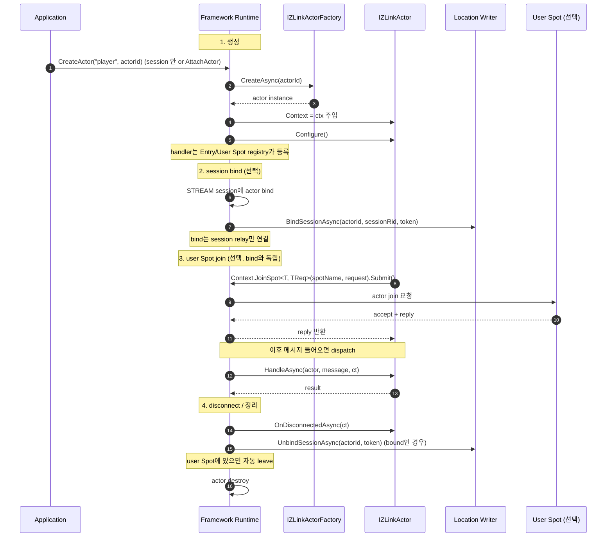
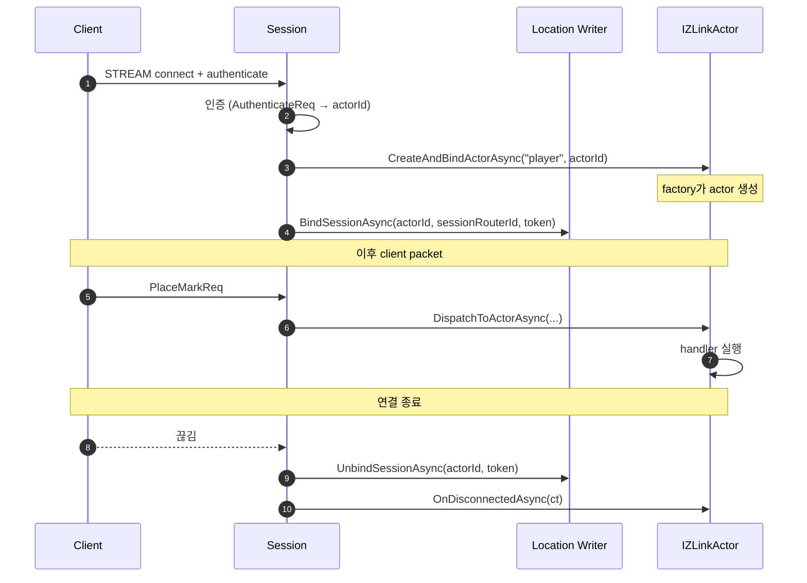
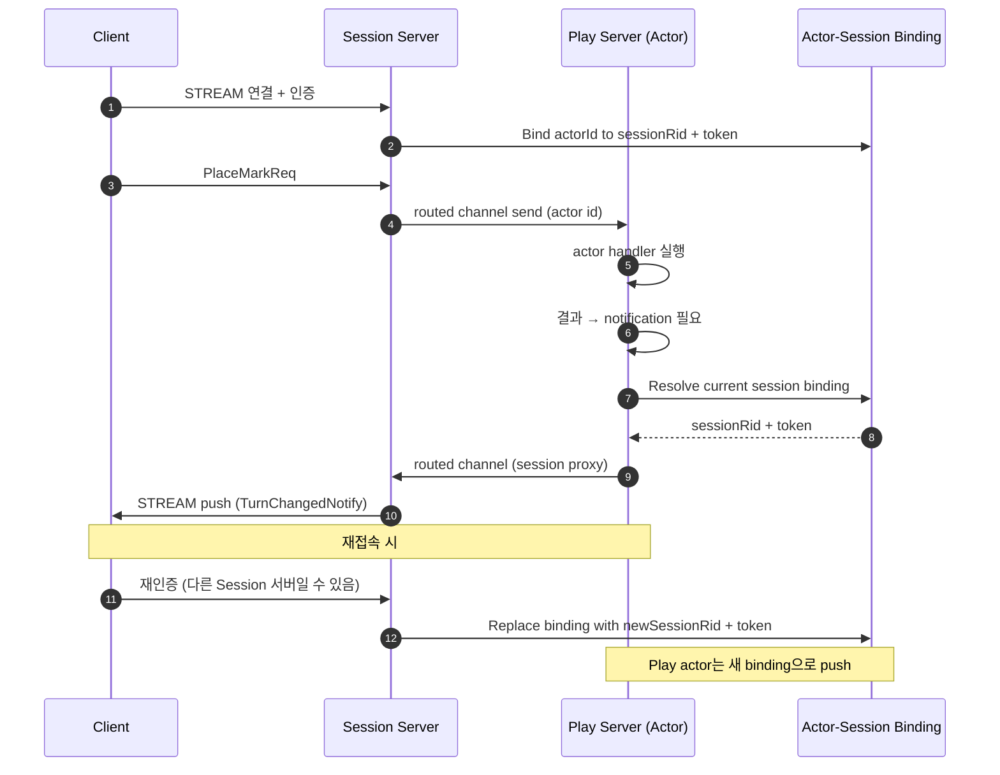

<!-- framework-adapter-nav:start -->
[문서 목록](../../README.ko.md) | [이전: ZLink Framework ASP.NET Core STREAM Integration](aspnet-core-stream.ko.md) | [다음: ZLink Framework .NET Session Actor Dispatch](session-actor-dispatch.ko.md)
<!-- framework-adapter-nav:end -->

[스펙 목차](../../../README.ko.md)

[.NET 묶음](./README.ko.md) | [인터페이스](./handler-interfaces.ko.md) | [channel](./aspnet-core-channel-messaging.ko.md) | [SPOT](./aspnet-core-spot.ko.md) | [STREAM](./aspnet-core-stream.ko.md) | [Registry](./aspnet-core-registry.ko.md)

# Draft -- ZLink Framework ASP.NET Core Actor

> 이 문서는 **구현 전 초안**이다.
> 즉 아직 공개된 계약[^public-contract]이 아니며, framework가 actor[^actor] 개념을
> 어떻게 노출할지 정리하기 위한 문서다.

## 1. 목적

이 절은 framework 가 actor 개념을 어떤 방향으로 노출하려고 하는지, 그 목표와
범위를 한 자리에 정리한다.

이 문서의 목표는 zlink core 가 정의한 **actor**[^actor] 개념을 `ASP.NET Core`
애플리케이션 위에서 `.NET` 다운 모양으로 노출하는 것이다.

zlink core 모델에서 actor 는 다음 성질을 가진다. 더 자세한 정의는 zlink core 의
[SPOT Actor Guide](../../../../../../../doc/guide/07-4-actor.md) 에서 다룬다.

- **`SpotNode`에 소속된다.** actor는 생성 직후 그 node의
  `Entry Spot`[^entryspot]에 위치한다.
- 선택적으로 **STREAM session에 binding**[^session-bind]할 수 있다. 한 session
  에는 여러 actor가 bind될 수 있지만, 하나의 actor는 한 번에 최대 한 session
  에만 bind된다. session binding은 client relay 경로일 뿐이고, actor가 실제로
  어디에 위치하는지를 결정하지는 않는다.
- 선택적으로 **user Spot에 join**[^user-spot-join]할 수 있다. 이 경우 Entry
  Spot에서 user Spot으로 이동한다. user Spot join은 STREAM session binding
  없이도 수행할 수 있다.
- user Spot에서 다시 Entry Spot으로 돌아오려면 **leave**, actor 자체를 완전히
  제거하려면 **destroy**를 수행한다. destroy는 actor가 Entry Spot에 있을 때만
  허용된다.

framework 는 위 모델 위에 `.NET` 다운 모양을 한 겹 더 얹어서 사용자에게
노출한다. 그 한 겹은 두 종류의 요소로 이루어진다.

- lifecycle 요소 -- constructor injection, `OnDisconnectedAsync`, DI
  scope[^di-scope]
- fluent 호출 표면 -- `IZLinkActorContext`, `IZLinkActorClient`,
  `IZLinkSessionProxy`

책임은 두 갈래로 나눠서 본다.

- **framework가 자동으로 관리하는 영역**: Entry Spot 자체의 생성과 소멸, user
  Spot에서 Entry Spot으로 돌아오는 leave, actor destroy가 여기에 해당한다.
  즉 application 코드는 `zlink_spot_node_entry_spot()` /
  `zlink_spot_node_actor_leave_spot()` / `zlink_spot_node_actor_destroy()`
  같은 raw API[^raw-api]를 직접 호출하지 않는다.
- **application이 구현하는 Entry Spot 로직**: actor가 Entry Spot에 머무는 동안
  받는 packet의 handler는 application이 정한다. 이 handler는 actor 클래스에
  붙이는 것이 아니라 Entry Spot 전용 registry에 등록한다. 예를 들어 인증
  결과를 보고 target user Spot을 골라 `JoinSpot(...)`을 호출하는 entry 단계
  로직이 여기에 들어간다. Entry Spot의 `on_join` / `on_leave` lifecycle
  callback handler 역시 일반 user Spot과 별도로 등록할 수 있어야 한다.

호출하는 쪽에서는 actor 가 어느 노드의 어느 spot 에 있는지 알 필요가 없다.
**`actorId`** 하나만 들고 부르면 된다. 실제 라우팅은 framework 가
application 이 등록한 resolver[^resolver] 에 위임한다.

이 문서가 다루는 범위는 다음과 같다.

- actor lifecycle (Entry Spot 머무름 → session bind → user Spot join → disconnect)
- handler 모델 (typed actor handler / 일반 actor handler)
- Entry Spot에서의 application 로직 (인증, target Spot 선택)
- STREAM session binding
- user Spot join (framework가 노출하는 표면)
- session actor dispatch[^session-actor-dispatch] (gateway[^gateway]) 패턴
- outbound `IZLinkActorClient` / `IZLinkSessionProxy` 표면
- 등록 API 정리

다음 항목은 이 문서가 다루지 않으므로 별도 문서에서 본다.

- channel messaging[^channel-messaging] 자체는
  [aspnet-core-channel-messaging.ko.md](./aspnet-core-channel-messaging.ko.md)
  에서 다룬다.
- SPOT 자체는 [aspnet-core-spot.ko.md](./aspnet-core-spot.ko.md)에서 다룬다.
- STREAM session 자체는 [aspnet-core-stream.ko.md](./aspnet-core-stream.ko.md)
  에서 다룬다.
- C API의 raw actor 표면(`zlink_spot_node_actor_recv_part`,
  `zlink_spot_node_actor_send_bound_session_msg` 등)은 core 가이드에서 다룬다.

## 2. Actor 개념

이 절은 framework 의 actor 가 core 의 actor 모델을 어떻게 그대로 가져오는지,
그리고 그것이 일반 handler 클래스와 어떻게 다른지를 비교해서 정리한다.

framework 의 **actor** 는 zlink core 가 정의한 actor 모델을 그대로 따른다. 즉
ID 로 식별되는 stateful object 이며, SpotNode 에 소속되고, 선택적으로 session
에 bind 할 수 있다. 그 위에 framework 가 application 코드에서 쓰기 편한
`.NET` 표면을 한 겹 더 얹는다.

일반 handler 클래스와 비교해 보면 actor 의 특징은 다음과 같다.

| 일반 handler | actor |
| --- | --- |
| 기본적으로 stateless | **stateful** -- 객체 자체가 상태를 보관한다 |
| 메시지마다 새 scope에서 resolve | 같은 actor id로 들어오는 메시지는 항상 **같은 인스턴스**가 받는다 |
| packet 등록은 채널 매핑이 담당 | actor packet 등록은 Entry Spot 또는 user Spot registry가 담당한다 |
| identity 없음 | `ActorId`가 1급 identity (core의 `zlink_actor_ref_t`에 대응) |
| 메시지 한 건짜리 lifecycle | `Configure` → 여러 메시지 처리 → `OnDisconnectedAsync` 로 이어지는 lifecycle |

### 두 가지 직교 축

actor 의 상태는 서로 독립된 두 축으로 본다. 즉 위치 축과 binding 축은 서로
영향을 주지 않는다.

| 축 | 값 |
| --- | --- |
| **위치** (어느 Spot에 있는가) | Entry Spot (생성 직후의 default) ↔ user Spot (join 이후) |
| **binding** (어느 client에 묶였는가) | unbound ↔ bound to STREAM session |

application 입장에서 자주 마주치는 조합은 두 가지다.

- **standalone actor** -- session bind 없이, 다른 노드에서 routed[^routed]
  호출만 받는 형태다. Entry Spot 에 그대로 머문다. 단순 background worker 나
  scheduler 같은 패턴이 여기에 해당한다.
- **session-bound actor** -- 인증된 client stream 에 묶여 있는 형태다. 보통
  user Spot 에 join 해서 game room 이나 stage 같은 도메인 객체로 동작한다.
  대부분의 `ASP.NET Core` gateway 시나리오에서 기본형으로 쓰는 모양이다.

actor 인스턴스는 framework 가 직접 만들지 않는다. application 이 등록한
**factory**[^factory] 를 통해 생성한다.

## 3. Actor 라이프사이클

이 절은 actor 가 어떤 인터페이스를 구현하고, 어떻게 만들어지며, 어떤 단계로
이어지는지를 차례대로 정리한다.

### 3.1 `IZLinkActor`

모든 actor 클래스가 구현해야 하는 기본 인터페이스다.

```csharp
public interface IZLinkActor
{
    string ActorId { get; }

    IZLinkActorContext Context { get; set; }

    void Configure()
    {
    }

    ValueTask OnDisconnectedAsync(CancellationToken cancellationToken);
}
```

각 멤버의 의미는 다음과 같다.

- **`ActorId`** -- actor 를 식별하는 고유 ID 다. 보통 인증 단계에서 결정되어,
  factory 의 생성자 인자로 전달된다.
- **`Context`** -- framework 가 attach 직후에 주입하는 값이다. actor 가
  메시지 dispatch 나 outbound 호출을 하려면 이 context 를 거친다. application
  코드가 직접 set 하지는 않는다. 다만 framework 가 set 할 수 있어야 하므로
  set accessor 를 둔다.
- **`Configure()`** -- actor 가 처리할 packet handler 를 등록하는 자리다.
  attach 직후 한 번 호출된다 (자세한 흐름은 §4 에서 다룬다).
- **`OnDisconnectedAsync(...)`** -- actor 가 더 이상 dispatch 를 받지 않게
  되는 시점에 framework 가 호출하는 cleanup 훅이다. 호출 트리거는 세 가지 중
  하나다. bound STREAM session 종료, 명시적 unbind, actor destroy 직전. 이
  호출 이후 framework 는 필요한 경우 user Spot 에서 Entry Spot 으로 leave 한
  뒤 destroy 까지 자동으로 처리한다. 따라서 application 은 leave / destroy
  표면을 직접 호출하지 않는다.

### 3.2 `IZLinkActorFactory`

actor 인스턴스를 만들어 내는 application 객체다. 사용 흐름은 두 단계다. 먼저
DI 에 등록한다. 그 다음
`options.AddActorFactory<...>(actorType)` 로 framework 에 매핑한다.

```csharp
public interface IZLinkActorFactory
{
    ValueTask<IZLinkActor> CreateAsync(
        string actorId,
        CancellationToken cancellationToken = default);
}
```

`actorType` 은 사용자가 직접 정의하는 짧은 문자열 키다 (예: `"player"`). 한
앱에서 여러 종류의 actor 를 등록할 수 있고, 종류마다 별도 factory 를 둔다.
session actor dispatch 처럼 actor 종류를 메시지로 받아 처리하는 경우, framework
는 이 actorType 키로 어떤 factory 를 부를지 결정한다.

```csharp
public sealed class PlayerActorFactory : IZLinkActorFactory
{
    public ValueTask<IZLinkActor> CreateAsync(
        string actorId,
        CancellationToken cancellationToken = default)
    {
        cancellationToken.ThrowIfCancellationRequested();
        return ValueTask.FromResult<IZLinkActor>(new PlayerActor(actorId));
    }
}
```

등록 코드는 다음과 같다.

```csharp
builder.Services.AddScoped<PlayerActorFactory>();
builder.Services.AddZLinkFramework(options =>
{
    options.AddActorFactory<PlayerActorFactory>("player");
});
```

### 3.3 라이프사이클 단계

이 소절은 core actor 가 어떤 상태들을 거쳐 가는지, 그리고 그 전이를 framework
가 어느 시점에 손대는지 정리한다.

core actor 의 상태 전이는 다음과 같이 이어진다.

```text
None
  +--(factory.CreateAsync)-> Created (Entry Spot, unbound)
        +--(bind session)-> Entry Spot + bound to session
        |     +--(JoinSpot)-> user Spot + bound to session
        |           +--(leave: framework)-> Entry Spot + bound
        +--(disconnect / unbind: framework)-> destroy -> None
```

framework가 처리하는 시퀀스는 다음과 같다.



core 모델에서 비롯된 핵심 제약은 다음과 같다.

- **user Spot join 은 bound session 을 요구하지 않는다.** actor 의 위치 이동과
  STREAM session binding 은 서로 독립된 상태 전이로 본다.
- **destroy 는 actor 가 Entry Spot 에 있을 때만 가능하다.** 따라서 framework
  는 disconnect 시점에 user Spot 에서 자동으로 leave 한 뒤 destroy 까지 묶어
  처리한다.
- **discovery[^discovery] actor route publish 는 user Spot join 성공 뒤에
  갱신된다.** actor 를 생성하기만 해서는 active route 가 공개되지 않는다.
  session bind / unbind 도 active route 를 새로 만들거나 지우지 않는다.

### 3.4 Entry Spot에서의 application 로직

이 소절은 Entry Spot 에서 어떤 로직이 흔히 실행되는지, 그리고 그 로직의 packet
실행 순서가 user Spot 과 어떻게 다른지를 정리한다.

actor 가 Entry Spot 에 머무는 동안 받는 packet 은 Entry Spot 전용 handler
registry 가 처리한다. framework 는 Entry Spot 자체의 생성과 소멸은 자동으로
관리한다. 다만 Entry Spot 의 message handler 와 `on_join` / `on_leave`
lifecycle callback handler 는 application 이 따로 등록할 수 있어야 한다.

Entry 단계와 user Spot 단계는 같은 actor 객체를 보더라도 의미가 다르다. 그래서
동일한 handler 묶음으로 합치지 않는다.

이 단계에서 자주 구현하는 로직은 다음과 같다.

- **인증 / 권한 확인** -- 인증 packet이 도착하면 actor가 검증한 뒤 결과를
  reply하거나, 실패한 경우 fail 응답을 보내고 disconnect한다.
- **target Spot 선택** -- 클라이언트의 요청 packet에서 어느 game room이나
  stage로 들어갈지 결정한 뒤
  `Context.JoinSpot<TReply, TReq>(targetSpotName, request).Submit(...)`을
  호출한다. `targetSpotName`은 `gameId`, `matchId`, `roomId` 같은 domain
  spot 이름이다.
- **session 초기 상태 설정** -- session metadata, profile lookup 같은 초기
  작업이 여기 들어간다.

Entry Spot 의 actor packet 은 Entry Spot 전체 실행 줄에 세우지 않는다. 이렇게
둔 이유는 다음과 같다. Entry Spot 은 모든 actor 가 처음 거치는 공용 입구다.
여기서 actor packet 을 전역으로 직렬화하면, 서로 관계없는 actor 까지 같이
기다리게 된다. 따라서 Entry Spot actor packet 은 대상 actor 의
mailbox[^mailbox] 로 들어간다. 같은 actor 의 packet 끼리만 순서가 보장된다.

반면 Entry Spot 자체의 registry 나 lifecycle 상태를 다루는 작업은 Entry Spot
실행 문맥에서 직렬화해도 된다. 예를 들어 `OnInitializeAsync(...)`,
`OnClosingAsync(...)`, actor joined / left lifecycle callback 같은 작업이
여기에 해당한다.

즉 Entry Spot 은 lifecycle 을 보호하고, actor packet 의 처리 순서는 actor
mailbox 가 보호하는 구도다.

```csharp
public sealed class PlayerActor(string actorId, IAuthService auth) : IZLinkActor
{
    public string ActorId { get; } = actorId;
    public IZLinkActorContext Context { get; set; } = default!;

    public ValueTask OnDisconnectedAsync(CancellationToken cancellationToken)
        => ValueTask.CompletedTask;
}

public sealed class PlayerEntrySpot(IZLinkEntrySpotContext context) : IZLinkEntrySpot
{
    public IZLinkEntrySpotContext Context { get; } = context;

    public void Configure()
    {
        Context.AddActorPacket<AuthenticateRequestHandler, PlayerActor>();
        Context.AddActorPacket<JoinMatchRequestHandler, PlayerActor>();
        Context.AddActorJoined<PlayerEntryJoinedHandler, PlayerActor>();
        Context.AddActorLeft<PlayerEntryLeftHandler, PlayerActor>();
    }
}

public sealed class MatchSpot(IZLinkSpotContext context) : IZLinkSpot
{
    public IZLinkSpotContext Context { get; } = context;

    public void Configure()
    {
        Context.AddActorPacket<PlaceMarkRequestHandler, PlayerActor>();
        Context.AddActorJoined<PlayerMatchJoinedHandler, PlayerActor>();
        Context.AddActorLeft<PlayerMatchLeftHandler, PlayerActor>();
    }
}
```

즉 Entry Spot 전용 handler 등록 표면을 별도로 둔다. actor 객체는 상태를
보관하는 자리고, message 와 lifecycle callback 은 현재 actor 가 어느 실행
문맥에 있는지에 따라 Entry Spot registry 또는 user Spot registry 가 처리한다.

이 표면의 목적은 application handler 가 `Context.IsJoined` 같은 상태값으로
entry / user 단계를 직접 분기하지 않도록 막는 것이다. `RoutingId` 같은
transport 위치값도 handler 표면에 노출하지 않는다.

## 4. Handler 모델

이 절은 actor 의 packet handler 를 어디에 어떻게 등록하는지, 그리고 Entry Spot
과 user Spot 의 등록 표면을 어떻게 나누는지 정리한다.

actor 가 처리할 packet handler 는 **현재 실행 문맥의 registry 에 등록한다.**
즉 Entry Spot 은 Entry Spot 전용 registry 를 갖고, user Spot 은 각 Spot
타입마다 별도의 registry 를 갖는다.

일반 channel handler 처럼 attribute scan[^attribute-scan] 과 그룹 매핑으로
노출하는 모델이 아니다. 대신 각 Spot 의 `Configure()` 안에서
`Context.AddActorPacket<THandler, TActor>()` 로 명시적으로 묶는다.

```csharp
public sealed class PlayerActor(string actorId) : IZLinkActor
{
    public string ActorId { get; } = actorId;

    public IZLinkActorContext Context { get; set; } = default!;

    public ValueTask OnDisconnectedAsync(CancellationToken cancellationToken)
    {
        _ = cancellationToken;
        return ValueTask.CompletedTask;
    }
}
```

이 모델의 의도는 다음과 같다.

- actor 가 자기가 받을 packet 묶음을 자기 코드에서 정한다. 즉 외부 attribute
  scan 에 위임하지 않는다.
- actor type 과 실행 문맥이 달라지면 packet 매핑도 다르게 가져갈 수 있다.
- 같은 handler 클래스를 여러 actor type 이 공유해도 된다.

### 4.1 Entry Spot actor handler

Entry Spot 에 있는 actor message 는 Entry Spot registry 에 등록한 handler 가
처리한다. 이 handler 의 첫 인자는 actor 인스턴스다. Entry Spot 은 별도의 user
Spot 객체를 갖지 않으므로, handler 는 actor 와 payload 만 받는다.

```csharp
public interface IZLinkEntrySpotActorSendHandler<TActor, in TMessage>
    where TActor : IZLinkActor
{
    ValueTask HandleAsync(
        TActor actor,
        TMessage message,
        CancellationToken cancellationToken);
}

public interface IZLinkEntrySpotActorRequestHandler<TActor, in TRequest, TReply>
    where TActor : IZLinkActor
{
    ValueTask<TReply> HandleAsync(
        TActor actor,
        TRequest request,
        CancellationToken cancellationToken);
}
```

샘플은 다음과 같다.

```csharp
internal sealed class JoinMatchHandler(
    RegistryPlayRoutePublisher routes,
    GameNotificationPublisher notifications)
    : IZLinkEntrySpotActorRequestHandler<PlayerActor, JoinMatchReq, JoinMatchRes>
{
    public async ValueTask<JoinMatchRes> HandleAsync(
        PlayerActor actor,
        JoinMatchReq request,
        CancellationToken cancellationToken)
    {
        // request.MatchId는 application domain spot 이름이다.
        // RoutingId 변환은 framework 내부 spot route resolver가 푼다.
        var result = await actor.Context
            .JoinSpot<JoinMatchSpotResult, JoinMatchReq>(request.MatchId, request)
            .Timeout(TimeSpan.FromSeconds(2))
            .Submit(cancellationToken)
            .ConfigureAwait(false);

        await routes.BindActorPlayAsync(actor.ActorId, cancellationToken);
        await notifications.PublishAsync(result.Events, cancellationToken);

        return new JoinMatchRes(result.MatchId, result.ActorId, ...);
    }
}
```

### 4.2 user Spot actor handler

user Spot 에 join 된 actor 의 message 는 해당 Spot 타입의 registry 에 등록한
handler 가 처리한다. 이 handler 는 spot 객체와 actor 객체를 함께 받는다. 즉
room 이나 stage 의 상태는 spot 에서 읽고, player 나 entity 의 상태는 actor
에서 읽는 구도다.

```csharp
public interface IZLinkSpotActorSendHandler<TSpot, TActor, in TMessage>
    where TSpot : IZLinkSpot
    where TActor : IZLinkActor
{
    ValueTask HandleAsync(
        TSpot spot,
        TActor actor,
        TMessage message,
        CancellationToken cancellationToken);
}

public interface IZLinkSpotActorRequestHandler<TSpot, TActor, in TRequest, TReply>
    where TSpot : IZLinkSpot
    where TActor : IZLinkActor
{
    ValueTask<TReply> HandleAsync(
        TSpot spot,
        TActor actor,
        TRequest request,
        CancellationToken cancellationToken);
}
```

Entry Spot 과 user Spot 어느 쪽이든 `AddActorJoined(...)` /
`AddActorLeft(...)` 로 lifecycle callback handler 를 따로 등록한다. 이
callback 은 join / leave 가 commit 된 직후 같은 실행 문맥에서 호출된다.

### 4.3 등록 순서

handler 클래스는 반드시 DI 에 등록해야 한다. 가장 간단한 방법은 다음과 같다.

```csharp
builder.Services.AddScoped<JoinMatchHandler>();
builder.Services.AddScoped<PlaceMarkHandler>();
builder.Services.AddZLinkFramework(options =>
{
    options.AddHandlersFromAssemblyOf<JoinMatchHandler>();
});
```

`AddHandlersFromAssemblyOf` 는 attribute scan 과 함께 typed actor handler
후보까지 한꺼번에 모은다. 다만 실제 actor 매핑은 Entry Spot 이나 user Spot 의
`Configure()` 에서 일어난다는 점은 그대로 유지된다.

## 5. Actor context

이 절은 actor 안에서 어떤 표면을 통해 outbound 호출과 spot join 을 하는지,
그리고 그 표면이 가진 멤버들이 무엇을 의미하는지 정리한다.

actor 안에서 outbound 호출이나 spot join 을 하려면 framework 가 attach 한
`IZLinkActorContext` 를 거쳐야 한다. packet handler 와 lifecycle callback
handler 의 등록 자체는 Entry Spot 또는 user Spot 의 context 에서 수행한다.

```csharp
public interface IZLinkActorContext
{
    string ActorId { get; }
    string? SessionId { get; }
    string? SpotName { get; }
    bool IsJoined { get; }

    IZLinkSpot GetSpot();
    TSpot GetSpot<TSpot>() where TSpot : IZLinkSpot;

    // 사용자에게 보이는 표면은 domain spot 이름(string). RoutingId는 framework 내부에서만.
    IZLinkActorJoinSpotCall<TReply> JoinSpot<TReply, TRequest>(
        string spotName,
        TRequest request);

    IZLinkRequestCall RequestChannel<TRequest>(string channelName, TRequest request);
    IZLinkSendCall SendChannel<TMessage>(string channelName, TMessage message);

    IZLinkActorSendCall Send<TMessage>(TMessage message);
    IZLinkActorReplyCall Reply<TMessage>(TMessage message);
}
```

각 표면의 의미는 다음과 같다.

| 표면 | 의미 |
| --- | --- |
| `ActorId` / `SessionId` | identity. session bind된 actor만 `SessionId`가 채워진다 |
| `SpotName` / `IsJoined` | user Spot에 join한 경우 그 spot의 domain 이름과 join 상태. Entry Spot에 있을 때는 `IsJoined`가 false다. `RoutingId`는 framework 내부 표면으로만 두고 actor handler에는 노출하지 않는다 |
| `GetSpot()` / `GetSpot<TSpot>()` | 자기가 join한 user Spot 객체에 접근 |
| `JoinSpot(spotName, request).Submit(...)` | user Spot에 join 요청 (Entry → user Spot으로 이동). STREAM session binding을 전제로 하지 않는다. `spotName`은 application domain spot 이름(`string`) |
| `RequestChannel` / `SendChannel` | actor 안에서 일반 channel을 향한 outbound 호출 |
| `Send<TMessage>(...)` | bound client stream으로 데이터를 push (session-bound actor 전용) |
| `Reply<TMessage>(...)` | client request의 응답을 send (session-bound actor 전용) |

## 6. Outbound: 다른 곳에서 actor 호출하기

이 절은 actor 인스턴스 바깥에서 actor 를 어떻게 부르는지, 그리고 그 호출이
어떤 resolver 위에서 동작하는지를 정리한다.

### 6.1 `IZLinkActorClient`

application 의 다른 코드에서 특정 actor 를 부르고 싶을 때 쓰는 outbound
client 다. 호출하는 쪽은 actor 의 물리적 위치를 몰라도 된다. 즉 어느 노드의
어느 spot 이나 session 에 사는지 알 필요 없이, **`actorId`** 만 넘기면
충분하다.

```csharp
public interface IZLinkActorClient
{
    IZLinkActorClientSendCall Send<TMessage>(string actorId, TMessage message);
    IZLinkActorClientRequestCall Request<TRequest>(string actorId, TRequest request);
}

public interface IZLinkActorClientSendCall
{
    IZLinkActorClientSendCall PacketName(string packetName);
    IZLinkActorClientSendCall Metadata(string key, string value);
    ValueTask Submit(CancellationToken cancellationToken = default);
}

public interface IZLinkActorClientRequestCall
{
    IZLinkActorClientRequestCall PacketName(string packetName);
    IZLinkActorClientRequestCall Metadata(string key, string value);
    IZLinkActorClientRequestCall Timeout(TimeSpan timeout);
    ValueTask<TReply> Submit<TReply>(CancellationToken cancellationToken = default);
}
```

`IZLinkActorClient` 는 actor id 를 routed channel 과 대상 노드의 `RoutingId`
로 풀어 내야 한다. 이 변환을 위해 내부적으로 application 이 등록한 **play
route resolver**[^playroute] 를 호출한다 (§6.2 참고).

```csharp
public sealed class GameDispatcher(IZLinkActorClient actors)
{
    public ValueTask SendPlaceMarkAsync(
        string playerActorId,
        PlaceMarkCommand command,
        CancellationToken ct)
    {
        return actors
            .Send(playerActorId, command)
            .Submit(ct);
    }
}
```

`IZLinkActorClient` 를 쓰려면 반드시 `AddActorPlayRouteResolver<>()` 를 함께
등록해야 한다. resolver 등록 없이 호출하면 startup
validation[^startup-validation] 단계에서 오류로 막힌다.

### 6.2 `IZLinkActorPlayRouteResolver`

"이 actor id 는 지금 어느 routed channel 의 어느 노드에 있다" 는 정보를
application 이 돌려주기 위한 resolver 다. framework 는 이 정보를 가지고 routed
채널 send / request 를 구성한다.

```csharp
public interface IZLinkActorPlayRouteResolver
{
    ValueTask<ZLinkActorRoute> ResolvePlayRouteAsync(
        string actorId,
        CancellationToken cancellationToken);
}

public readonly record struct ZLinkActorRoute(
    string RouterChannelId,
    RoutingId TargetNodeRid);
```

resolver 의 실제 저장소는 application 이 원하는 곳 어디든 채울 수 있다. 예를
들어 in-memory 캐시, Redis, Registry 기반 lookup 등이 모두 가능하다. framework
는 그 저장소를 소유하지 않는다.

등록 예시는 다음과 같다.

```csharp
builder.Services.AddSingleton<RegistryPlayRouteStore>();
builder.Services.AddZLinkFramework(options =>
{
    options.AddActorPlayRouteResolver<RegistryPlayRouteStore>();
});
```

## 7. SPOT에 actor 붙이기

이 절은 SPOT 안의 객체로 actor 를 쓰는 패턴을 정리한다. 즉 어떤 spot 에
누가 들어올 수 있는지, 그리고 들어온 actor 가 다른 actor 와 어떻게 send /
reply 를 주고받는지를 차례로 본다.

SPOT 안의 객체로 actor 를 쓰고 싶을 때 적용하는 패턴이다. room 의 player,
stage 의 character, zone 의 entity 같은 경우가 여기에 해당한다.

### 7.1 spot 안에서 actor join handler 등록

SPOT spec ([aspnet-core-spot.ko.md](./aspnet-core-spot.ko.md)) 의
`IZLinkSpotContext` 에는 `AddActorJoin<...>()` 표면이 있다. 이 표면을 써서
다음 두 가지를 매핑한다.

- spot 에 합류 요청이 들어오면 어느 handler 를 부를지
- 합류에 성공하면 어떤 actor type 을 생성할지

```csharp
public sealed class TicTacToeGameSpot(IZLinkSpotContext context) : IZLinkSpot
{
    public IZLinkSpotContext Context { get; } = context;

    // packet/subscribe/timer/actor-join 등록은 Configure()에서 한다.
    public void Configure()
    {
        Context.AddActorJoin<TicTacToeGameJoinHandler, PlayerActor, JoinMatchReq, JoinMatchSpotResult>();
        // ...
    }

    // 비동기 초기화가 필요하면 OnInitializeAsync를 쓴다.
    // context는 생성자 주입 또는 framework가 Configure() 단계에서 attach한 값을 쓴다.
    public ValueTask OnInitializeAsync(CancellationToken cancellationToken)
        => ValueTask.CompletedTask;
}
```

join handler 는 별도의 핸들러 인터페이스를 구현한다. 자세한 시그니처는
[handler-interfaces.ko.md](./handler-interfaces.ko.md) §5.7 에서 다룬다.

### 7.2 actor가 spot에 합류하기

다른 곳에 사는 actor (예: session-attached actor) 가 어떤 spot 에 합류하려면
자기 context 의 `JoinSpot(spotName, request)` 를 호출한다. 여기서 `spotName`
은 application domain spot 이름(`string`) 이다. `RoutingId` 로의 변환은
framework 내부 spot route resolver 가 처리한다.

```csharp
var result = await actor.Context
    .JoinSpot<JoinMatchSpotResult, JoinMatchReq>(matchId, new JoinMatchReq(...))
    .Timeout(TimeSpan.FromSeconds(2))
    .Submit(cancellationToken);
```

이 호출은 spot 쪽 join handler 의 결과를 그대로 돌려준다. 성공 시 actor 쪽
상태가 다음과 같이 갱신된다.

- `Context.IsJoined` 가 `true` 가 된다.
- `Context.SpotName` 이 채워진다.

이후부터 spot 은 actor 객체에 직접 접근할 수 있다 (spot handler 에서 `actor`
인자로 받게 된다).

### 7.3 actor stream client

spot 에 합류한 actor 사이에서 데이터를 send / reply 할 때 쓰는 stream-side
표면이다. actor handler 안에서 호출하는 `actor.Context.Send(...)` /
`Reply(...)` 는 보통 이 client 위로 매핑된다.

```csharp
public interface IZLinkActorStreamClient
{
    IZLinkActorSendCall Send<TMessage>(TMessage message);
    IZLinkActorReplyCall Reply<TMessage>(TMessage message);
}

public interface IZLinkActorSendCall
{
    IZLinkActorSendCall Metadata(string key, string value);
    IZLinkActorSendCall PacketName(string messageName);
    IZLinkActorSendCall Compress();
    ValueTask Submit(CancellationToken cancellationToken = default);
}

public interface IZLinkActorReplyCall
{
    IZLinkActorReplyCall Metadata(string key, string value);
    IZLinkActorReplyCall Compress();
    ValueTask Submit(CancellationToken cancellationToken = default);
}
```

## 8. STREAM session에 actor 붙이기

이 절은 STREAM session 위에서 actor 를 어떻게 만들고 attach 하는지, 그리고
그 흐름이 client 연결과 어떻게 함께 움직이는지를 정리한다.

session-attached actor 는 client stream 연결과 lifecycle 을 함께한다. client
가 인증을 마치고 session 이 열리면 그 session 안에서 actor 가 생성된다.
session 이 닫히면 framework 가 attach 된 actor 의 `OnDisconnectedAsync` 를
호출해 정리한다.

이 패턴은 보통 **gateway / playhouse[^playhouse]** 같은 서버에서 사용한다.
즉 client 는 stream 으로 들어오고, server 는 그 client 를 actor 로 다룬다.
모든 routing 을 actor id 기준으로 통일하는 모양이다.

### 8.1 session-actor attach 표면

```csharp
public interface IZLinkSessionActorAttachmentContext
{
    ValueTask AttachActorAsync(
        IZLinkActor actor,
        CancellationToken cancellationToken = default);
}

public interface IZLinkSessionActorDispatchContext
{
    ValueTask<IZLinkActorRef> CreateAndBindActorAsync(
        string actorId,
        string actorType,
        CancellationToken cancellationToken = default);

    ValueTask<IZLinkActorRef> BindActorHandleAsync(
        string actorId,
        string actorType,
        CancellationToken cancellationToken = default);

    IZLinkSessionRequestCall Request<TRequest>(TRequest request);

    ValueTask DispatchToActorAsync(...);
}

public interface IZLinkActorRef
{
    string ActorId { get; }
    string ActorType { get; }

    ValueTask NotifyDisconnectedAsync(
        CancellationToken cancellationToken = default);
}
```

- `AttachActorAsync(...)` -- 이미 만든 actor 인스턴스를 현재 session 에
  attach 한다. session 이 끊어지면 framework 가 자동으로
  `OnDisconnectedAsync` 를 호출한다.
- `CreateAndBindActorAsync(actorId, actorType, ...)` -- factory 를 불러 새
  actor 를 만들고, 그 actor 를 현재 session 에 attach 한다. 이 두 동작을
  **한 호출 안에서 atomic 하게** 처리하는 것이 특징이다. 즉 생성과 session
  bind 를 별도로 노출하지 않는다.
- `BindActorHandleAsync(actorId, actorType, ...)` -- 현재 session host 의
  local `SpotNode` actor runtime 에서 actor handle 을 얻고, 현재
  actor-session binding 을 기록한다. actor 는 기본적으로 `SpotNode` 에서
  생성한다. 따라서 framework session 표면은 remote node 를 직접 지정하는
  create / handle API 를 제공하지 않는다.
- `DispatchToActorAsync(...)` -- 들어온 packet 을 actor 에게 dispatch 한다.
  보통 framework 가 자동으로 처리한다.
- `IZLinkActorRef.NotifyDisconnectedAsync(...)` -- session 이 연결 종료를
  application actor 에 알려야 할 때 호출한다. 이 호출은 actor-session binding
  정리 API 가 아니라 actor callback 전달 API 이며, local actor 와 remote actor
  handle 에 같은 방식으로 동작한다.

session callback 에서 unbound standalone actor 를 만드는 표면은 두지 않는다.
standalone actor 가 필요하다면 actor node 측에서 별도의 등록 표면을 쓴다 (예:
actor factory 와 actor node 가 직접 호출하는 create helper). 정책 기준은
[policy/actor-model.ko.md](../../policy/actor-model.ko.md) §4 lifecycle 표를
참고한다.

### 8.2 session 안에서의 흐름



## 9. Session actor dispatch (gateway 패턴)

이 절은 이 문서에서 다루는 가장 큰 use case 를 정리한다. 서버 역할을 두 종류로
나누고, 각 역할이 어떤 resolver / proxy 위에서 동작하는지 본다.

서버를 여러 대 두는 구성을 가정해 보자. 이 구성에서 **Session 서버** 는
client 연결만 받는다. 실제 gameplay 로직은 **Play 서버** 의 actor 가 처리한다.

그러면서 client 입장에서는 stream 을 하나만 유지한다. Play 서버가 client 에게
message 를 보낼 때도, 그 stream 을 그대로 타고 push 되어야 한다.

이 구조의 핵심 표면은 다음과 같다.

- **`IZLinkActorPlayRouteResolver`** (§6.2) -- "actor id → play node routing
  id" 를 푼다.
- **`IZLinkSpotRouteResolver`** -- "spot name / id → user Spot routing id" 를
  푼다. actor 가 `JoinSpot(spotName, ...)` 로 node 경계를 넘을 수 있다면 이
  resolver 를 등록한다.
- **`IZLinkSessionProxy`** -- Play 서버 actor 가 client 에게 push 를 보낼 때
  쓰는 표면이다. 내부적으로 framework / core actor-session binding 을 읽어
  routed channel 을 거쳐 Session 서버까지 전달한다.

### 9.1 전체 흐름



핵심은 다음과 같다. Play 서버의 actor 는 stream 을 직접 들고 있지 않다. 대신
**`IZLinkSessionProxy`** 라는 표면 하나에 "이 actor id 앞으로 message
보내라" 고만 부탁한다.

이 부탁을 받은 framework 는 다음 순서로 일을 처리한다.

1. actor-session binding 에서 현재 session 노드를 찾는다.
2. routed channel 을 통해 Session 서버까지 보낸다.
3. Session 서버는 actor binding 정보를 보고, 어떤 client stream 에 push 할지
   결정한다.

이 routed channel 내부 메시지는
[message-model.ko.md](../../policy/message-model.ko.md) 의 multipart 계약을
따른다. Session 서버와 Play 서버 사이에서는 route header, actor / session
metadata, stream header, payload 를 각각 별도의 part 로 나누어 전송한다.

client 와 Session 서버 사이의 STREAM packet 은 그대로 단일 stream packet
frame 으로 처리한다. 따라서 actor dispatch payload 를 내부 DTO[^dto] 의 `byte[]`
필드에 담아 다시 JSON envelope[^json-envelope] 로 감싸 보내는 방식은 이
초안의 목표가 아니다.

### 9.2 `IZLinkSessionProxy`

```csharp
public interface IZLinkSessionProxy
{
    IZLinkSessionProxySendCall Send<TMessage>(string actorId, TMessage message);
    IZLinkSessionProxyRequestCall Request<TRequest>(string actorId, TRequest request);
}
```

actor handler에서 받아 쓰는 모습은 다음과 같다.

```csharp
public sealed class JoinMatchHandler(IZLinkSessionProxy clientPush)
    : IZLinkEntrySpotActorRequestHandler<PlayerActor, JoinMatchReq, JoinMatchRes>
{
    public async ValueTask<JoinMatchRes> HandleAsync(
        PlayerActor actor,
        JoinMatchReq request,
        CancellationToken cancellationToken)
    {
        await clientPush
            .Send(actor.ActorId, new OpponentJoinedNotify(...))
            .Submit(cancellationToken);

        return new JoinMatchRes(...);
    }
}
```

같은 user Spot 안에서 client push 가 필요하면, user Spot actor handler 의
생성자에 `IZLinkSessionProxy` 를 주입해서 같은 방식으로 사용한다. actor
message handler 는 transport raw header 나 session router id 를 직접 받지
않는다.

### 9.3 라우팅 record

handler-interfaces.ko.md §5.7 과 동일한 actor route 필드 구성을 그대로
사용한다. session binding 에 필요한 session rid, session id, binding token 은
framework / core runtime 내부 metadata 로 관리한다. 즉 public resolver record
로는 노출하지 않는다.

```csharp
public readonly record struct ZLinkActorRoute(
    string RouterChannelId,
    RoutingId TargetNodeRid);
```

- **`ZLinkActorRoute`** -- "이 actor 가 사는 Play 서버의 위치" 를 나타낸다.
  `IZLinkActorPlayRouteResolver` 의 결과로 돌려준다.
- actor-session binding 은 public route resolver 결과가 아니다. 이전 stream
  의 뒤늦은 close 가 새 binding 을 지우지 못하도록, 내부에서 binding token
  으로 조건부 갱신을 수행한다.

### 9.4 등록 패턴

Session 서버는 다음과 같이 등록한다.

```csharp
builder.Services.AddSingleton<RegistryPlayRouteStore>();
builder.Services.AddSingleton<RegistrySpotRouteStore>();
builder.Services.AddZLinkFramework(options =>
{
    options.AddActorPlayRouteResolver<RegistryPlayRouteStore>();
    options.AddSpotRouteResolver<RegistrySpotRouteStore>();
    // STREAM session 등록 + routed channel 등록 (별도 문서 참고)
});
```

Play 서버는 다음과 같이 등록한다.

```csharp
builder.Services.AddScoped<PlayerActorFactory>();
builder.Services.AddScoped<PlayerEntrySpot>();
builder.Services.AddScoped<MatchSpot>();
builder.Services.AddSingleton<RegistryPlayRouteStore>();
builder.Services.AddSingleton<RegistrySpotRouteStore>();
builder.Services.AddZLinkFramework(options =>
{
    options.AddActorFactory<PlayerActorFactory>("player");
    options.AddActorPlayRouteResolver<RegistryPlayRouteStore>();
    options.AddSpotRouteResolver<RegistrySpotRouteStore>();

    options.AddSpotMesh("game.stage", mesh =>
    {
        mesh.UseDiscovery(discovery =>
        {
            discovery.Add("tcp://registry1:5551");
        });

        mesh.AddNode("play-node", node =>
        {
            node.Bind("tcp://0.0.0.0:9000");
            node.AddEntrySpot<PlayerEntrySpot>();
            node.AddSpotFactory<MatchSpot>("match");
        });
    });

    // routed channel 등록은 별도 문서 참고
});
```

`AddActorPlayRouteResolver` 는 **양쪽 모두** 에 등록해야 한다. 이유는 다음과
같다.

- session 서버는 client packet 을 어느 play 노드로 보낼지 알아야 한다.
- play 서버도 actor migration[^actor-migration] 처럼 다른 play 노드로
  forwarding 해야 하는 경우가 있다.

actor-session binding 은 framework / core runtime 내부에서 관리한다. 각 서버의
역할을 나누어 보면 다음과 같다.

- Session 서버는 인증과 `CreateAndBindActorAsync(...)` 또는
  `BindActorHandleAsync(...)` 흐름에서 binding 을 갱신한다.
- Play 서버는 `IZLinkSessionProxy` 를 통해 현재 binding 을 사용한다.

이 동작을 위해 별도의 public session route API 나 기록 API 를 등록할 필요는
없다.

## 10. 등록 표면 종합

이 절은 앞서 본 표면들을 `IZLinkFrameworkOptions` 한 자리에 모아 다시 본다.

`IZLinkFrameworkOptions` 가 노출하는 actor 관련 등록 메서드는 다음과 같다.

```csharp
public interface IZLinkFrameworkOptions
{
    // ... (channel / spot / stream 등록 등 다른 메서드 생략)

    void AddActorFactory<TFactory>(string actorType)
        where TFactory : class, IZLinkActorFactory;

    void AddActorPlayRouteResolver<TResolver>()
        where TResolver : class, IZLinkActorPlayRouteResolver;

    void AddSpotRouteResolver<TResolver>()
        where TResolver : class, IZLinkSpotRouteResolver;

    void AddActorSessionBindingStore<TStore>()
        where TStore : class, IZLinkActorSessionBindingStore;

    void AddSpotMesh(
        string channelName,
        Action<IZLinkSpotMeshBuilder> configure);
}

public interface IZLinkSpotMeshBuilder
{
    void AddNode(
        string spotNodeName,
        Action<IZLinkSpotMeshNodeBuilder> configure);
}

public interface IZLinkSpotMeshNodeBuilder
{
    void AddEntrySpot<TEntrySpot>()
        where TEntrySpot : IZLinkEntrySpot;

    void AddSpotFactory<TSpot>(string spotName)
        where TSpot : IZLinkSpot;
}
```

각 메서드의 용도를 정리하면 다음과 같다.

| 메서드 | 누가 필요한가 | 무엇을 하는가 |
| --- | --- | --- |
| `AddActorFactory<>(type)` | actor를 만들어 attach하는 서버 (Play 서버 / SPOT 호스트) | actorType 키로 factory를 매핑 |
| `AddActorPlayRouteResolver<>()` | actor를 외부에서 부르는 모든 서버 | actor id → play node routing |
| `AddSpotRouteResolver<>()` | actor가 spot name/id로 user Spot에 join하거나 spot client를 쓰는 서버 | spot name/id → spot routing |
| `AddSpotMesh(...).AddNode(...).AddEntrySpot<>()` | actor runtime을 가진 SPOT host | 자동 Entry Spot에 붙일 actor packet/lifecycle registry 등록 |
| `AddSpotMesh(...).AddNode(...).AddSpotFactory<>()` | user Spot을 만드는 SPOT host | spotName 키로 user Spot factory 매핑 |

## 11. 다른 문서와의 관계

- 인터페이스 전체 정의:
  [handler-interfaces.ko.md](./handler-interfaces.ko.md) §5 (`IZLinkActor`,
  `IZLinkActorContext`, `IZLinkActorFactory`, actor handler 인터페이스,
  routing record 등)
- SPOT에 actor가 합류하는 표면(`AddActorJoin<...>`):
  [aspnet-core-spot.ko.md](./aspnet-core-spot.ko.md)
- STREAM session lifecycle과 `IZLinkSession` 표면:
  [aspnet-core-stream.ko.md](./aspnet-core-stream.ko.md)
- session actor dispatch 정책 문서 (구현 전 초안):
  [session-gateway-usability.ko.md](../../policy/session-gateway-usability.ko.md)
- TicTacToe sample에서 모든 표면이 함께 쓰이는 예시:
  [tictactoe-game-sample.ko.md](./tictactoe-game-sample.ko.md)

## 12. 결정된 기준

- actor 의 packet handler 와 lifecycle callback handler 는 Entry Spot 또는
  user Spot registry 에서 등록한다. attribute scan 과 그룹 매핑은 일반
  channel handler 전용이다.
- actor 의 위치는 application 의 resolver 가 결정한다. framework 는 그
  정보의 저장소를 소유하지 않는다.
- actor id 는 application identity[^identity] 다. 보통 인증 단계에서
  결정된다. framework 는 actor id 발급에 관여하지 않는다.
- Play 서버의 actor 가 client 에 push 를 보낼 때는 **반드시
  `IZLinkSessionProxy`** 를 거친다. actor 가 stream socket 을 직접 들고 있는
  구조가 아니다.

## 13. 회귀 테스트

이 절은 actor 문서가 다룬 항목들을 어떤 테스트로 검증하는지 한 자리에 모아
본다.

Actor 문서의 회귀 테스트 항목은 다음 흐름이 같은 public 표면 위에서 일관되게
이어지는지를 확인한다.

- actor factory
- Entry Spot
- user Spot join
- session bind
- session actor dispatch

이때 actor 가 어느 spot 에 붙어 있는지는 framework 가 관리한다. 사용자는 현재
context 만 다룬다는 원칙을 함께 검증한다.

| 테스트 케이스 | 확인 기준 |
| --- | --- |
| `RegistrationValidationTests.AddZLinkFramework_Throws_WhenActorFactoryNameIsDuplicated` | actor factory 이름이 중복되면 startup validation에서 예외로 막는다. |
| `SpotIntegrationTests.EntrySpot_And_UserSpot_ActorPacketRegistries_Dispatch_ActorPackets` | Entry Spot과 user Spot에 등록한 actor packet/lifecycle handler가 정상적으로 dispatch된다. |
| `SpotIntegrationTests.EntrySpot_ActorPackets_Are_Serialized_Per_Actor_And_Parallel_Across_Actors` | Entry Spot에서 같은 actor의 packet은 순서대로 실행되고, 서로 다른 actor의 packet은 병렬로 진행된다. |
| `SpotIntegrationTests.EntrySpot_NativeActorReadableBatch_Dispatches_Actors_In_Parallel` | native Entry Spot dispatch batch가 actor별 순서를 보존하면서도 다른 actor를 전역으로 막지 않는다. |
| `SpotIntegrationTests.SpotActorJoin_Move_And_Submit_Run_Through_SpotExecutionContext` | actor가 spot을 옮긴 뒤 stale spot 문맥으로 dispatch되지 않는다. |
| `SpotIntegrationTests.ActorContext_RequestChannel_Uses_Global_Client_Before_Join_And_Spot_Client_After_Join` | join 전과 후에 channel request 경로가 public context 의미에 맞게 전환된다. |
| `StreamIntegrationTests.SessionActorDispatch_Relays_Stream_Request_And_Routes_Request_To_Bound_Actor_By_Sequence` | stream session에서 bound actor로 request가 전달되고, sequence별 reply 순서가 맞는다. |

---

### 각주 모음

[^public-contract]: public contract는 외부 사용자에게 공개되어 변경 시 호환성을 책임져야 하는 API 표면을 뜻한다.

[^actor]: **actor**는 ID로 식별되는 stateful application 객체다. 같은 actor id
    로 들어오는 메시지는 같은 인스턴스가 받는다. framework는 actor를
    라이프사이클 관리, 메시지 dispatch, 라우팅 식별의 단위로 본다.

[^entryspot]: **Entry Spot**은 SpotNode가 자동으로 갖는 입구 spot이다. actor는
    생성 직후 항상 Entry Spot에 위치하며, user Spot으로 옮기기 전까지의 인증
    이나 분기 같은 초기 로직을 여기서 처리한다.

[^session-bind]: **session bind**는 actor를 특정 STREAM session에 연결해서,
    그 session으로 들어오고 나가는 client relay 경로를 actor와 묶는 동작이다.
    actor의 물리적 위치를 결정하지는 않는다.

[^user-spot-join]: **user Spot join**은 actor를 Entry Spot에서 application
    정의 user Spot(room, stage 등)으로 이동시키는 동작이다. session binding과는
    독립적으로 일어난다.

[^di-scope]: DI scope는 `.NET` 의존성 주입 컨테이너에서 객체의 lifetime을
    묶는 단위(singleton, scoped, transient)를 가리킨다. handler 인스턴스 생성과
    소멸은 보통 이 scope를 기준으로 결정된다.

[^raw-api]: raw API는 framework 추상화를 거치지 않고 C 바인딩이 노출하는
    저수준 함수를 직접 부르는 호출을 뜻한다.

[^resolver]: resolver는 식별자(예: actor id, spot name)를 받아 그 식별자가
    가리키는 실제 위치(routing id 등)를 돌려주는 application 컴포넌트다.
    framework는 위치 정보를 직접 소유하지 않고 resolver에게 위임한다.

[^session-actor-dispatch]: session actor dispatch는 클라이언트 session에서 들어
    온 요청을 그 session과 묶여 있는 actor 쪽으로 자동 전달하는 패턴이다.

[^gateway]: gateway는 외부 client 연결을 받아 인증한 뒤 내부 서비스로 라우팅
    하는 입구 서버를 가리킨다. 이 문서에서는 STREAM session을 받아 actor 호출
    로 변환하는 Session 서버 역할을 가리킨다.

[^channel-messaging]: channel messaging은 채널 이름을 키로 삼아 메시지를
    주고받는 방식이다. request / send는 요청-응답과 단방향 전달을, event
    messaging은 publish / subscribe 형태의 이벤트 전달을 가리킨다.

[^routed]: **routed channel**은 `AddRouteChannel(...)` /
    `AddRouteMeshChannel(...)`로 선언하는 양방향 채널이다. 일반 client-server
    채널과 달리 호출 시점에 목적지 노드의 `RoutingId`를 직접 지정한다. 자세한
    내용은
    [aspnet-core-channel-messaging.ko.md](./aspnet-core-channel-messaging.ko.md)
    §5.4 참고.

[^factory]: **factory**는 `IZLinkActorFactory`를 구현한 application 클래스다.
    actorType 키와 함께 등록해 두면, framework가 해당 type의 actor를 만들 때
    이 factory를 호출한다.

[^discovery]: discovery는 등록된 노드(channel, spot 등)의 위치 정보를 Registry
    같은 외부 저장소에서 자동으로 조회하고 갱신해 주는 메커니즘이다. application
    이 IP/port를 직접 박지 않아도 노드 위치를 찾을 수 있다.

[^mailbox]: mailbox는 같은 actor에게 들어오는 메시지를 한 줄로 세워 순차
    처리하는 큐다. actor 단위로 순서를 보장하면서도 서로 다른 actor 사이의
    병렬성은 유지한다.

[^attribute-scan]: attribute scan은 어셈블리 안의 타입과 메서드를 훑으면서
    특정 attribute가 붙은 항목을 찾아 자동으로 등록하는 방식이다.

[^playroute]: **play route resolver**는 actor id를 받아 그 actor가 지금 어느
    routed channel의 어느 노드에 사는지를 돌려주는 resolver다.
    `IZLinkActorClient`가 outbound 호출 시 내부적으로 사용한다.

[^startup-validation]: startup validation은 framework가 호스트 시작 시점에
    등록 상태를 점검해서, 누락된 의존성이나 잘못된 조합을 즉시 예외로 보고하는
    단계다. 잘못된 설정이 런타임으로 흘러가는 것을 막는다.

[^playhouse]: playhouse는 게임 서비스에서 STREAM client를 받아 actor / room /
    stage 위에서 처리하는 서버를 가리키는 사내 용어다. 여기서는 session 서버 +
    play 서버 조합의 한 형태로 본다.

[^dto]: DTO(Data Transfer Object)는 시스템 사이에서 데이터를 옮기기 위한
    데이터 전용 클래스/record를 가리킨다.

[^json-envelope]: JSON envelope는 실제 payload를 또 다른 JSON 객체 안의 필드로
    감싸 보내는 방식을 가리킨다. 보통 metadata를 함께 싣기 위해 쓰지만, 본문이
    이미 multipart로 나뉘는 경우에는 불필요한 wrapping이 된다.

[^actor-migration]: actor migration은 같은 actor를 다른 play 노드로 옮기는
    동작이다. 라우팅 정보가 갱신되어 외부 호출자가 새 위치로 forwarding된다.

[^identity]: identity는 객체가 누구인지를 식별하는 1급 값이다. actor의 경우
    `ActorId`가 identity로, application이 정한 도메인 단위를 그대로 따라간다.
