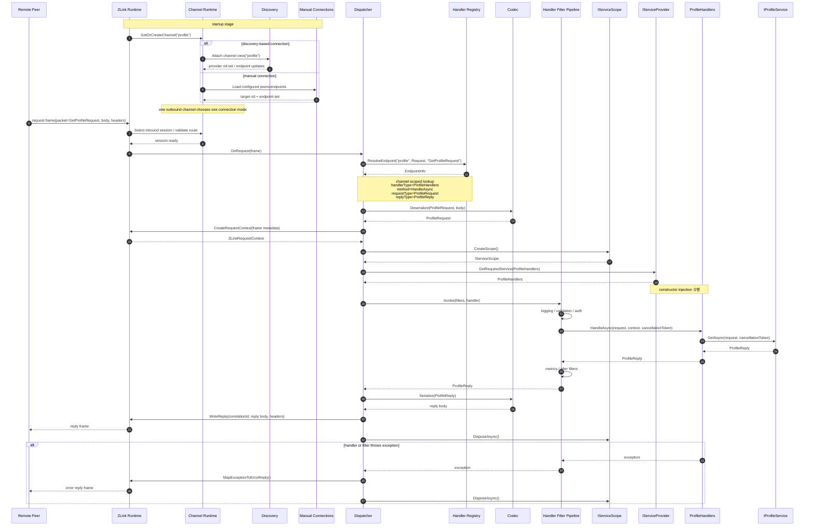

<!-- framework-adapter-nav:start -->
[문서 목록](../../README.ko.md) | [이전: ZLink Framework .NET Interface Catalog](handler-interfaces.ko.md) | [다음: ZLink Framework ASP.NET Core SPOT Integration](aspnet-core-spot.ko.md)
<!-- framework-adapter-nav:end -->

[스펙 목차](../../../README.ko.md)

[.NET 묶음](./README.ko.md) | [인터페이스](./handler-interfaces.ko.md) | [channel 샘플](./channel-messaging-samples.ko.md) | [SPOT](./aspnet-core-spot.ko.md) | [STREAM](./aspnet-core-stream.ko.md) | [Registry](./aspnet-core-registry.ko.md)

# Draft -- ZLink Framework ASP.NET Core Channel Messaging

> 이 문서는 **구현 전 초안**이다.
> 아직 공개 계약[^public-contract]이 아니며, `ASP.NET Core`에서 channel 직접 호출과
> event messaging[^event-messaging]을 어떤 API 모양으로 노출할지 방향을 정리한다.

## 1. 목표

이 절에서는 사용자가 channel messaging 표면에서 어떤 경험을 갖길 바라는지, 그리고 그
경험을 어떤 식으로 단순하게 만들지를 짧게 정리한다.

`ASP.NET Core` 앱이 다음과 같은 경험을 갖도록 만드는 것이 이 문서의 목표다.

- **channel 이름**[^channel]만 알면 다른 서비스를 호출할 수 있어야 한다.
- 공용 outbound client[^outbound]를 DI[^di]로 받아서 그대로 쓸 수 있어야 한다.
- event를 publish[^pubsub]할 수 있어야 한다.
- channel 단위로 Discovery[^discovery] 기반 자동 연결을 켤 수 있어야 한다.
- handler[^handler]를 등록하면 DI 컨테이너와 자연스럽게 맞물려야 한다.

여기서 outbound client 는 두 곳에서 같은 모양으로 쓸 수 있어야 한다.

- ZLink 메시지 handler 안.
- 기존 `ASP.NET Core` HTTP handler 또는 controller 안.

즉 사용자가 `DealerSocket`[^dealer], `RouterSocket`[^router], `Discovery` 를 직접 조립할
필요는 없다. 한 단계 위에 있는 표면만 다루도록 만들겠다는 뜻이다. 구체적으로는
`AddZLinkFramework(...)`, `IZLinkClient`, handler 등록 정도가 그 표면이다.

등록부터 handler, HTTP endpoint, outbound 호출까지 흐름을 한 번에 보고 싶다면,
[channel-messaging-samples.ko.md](./channel-messaging-samples.ko.md) 를 참고한다.

## 2. 기반이 되는 .NET binding

이 절에서는 channel messaging 표면이 어떤 `.NET` binding 기능 위에 올라가는지 정리한다.

이 초안은 아래 `.NET` binding 기능을 토대로 본다.

- `Discovery`
- `DealerSocket`
- `RouterSocket`
- request-reply helper
- `PubSocket` / `SubSocket`

`ZLink Framework` 는 위 표면을 감추지 않는다. 그 위에 통합 API 한 층을 얹을 뿐이다.
그 통합 층의 역할은 한 줄로 다음과 같다.

> "channel 별로 outbound 경로를 미리 만들어 두고, 호출자가 channel 이름만으로 부르도록
> 돕는다."

## 3. ASP.NET Core에서 기대하는 등록 방식

이 절에서는 channel 과 handler 를 startup 단계에서 어떻게 선언하는지, 그리고 자동 연결과
수동 연결을 어떻게 골라 두는지를 정리한다.

### 3.1 channel 등록

먼저 각 channel 이 어떤 역할을 열지 선언한다. client 역할은 자동 연결과 수동 연결을 둘
다 지원한다. 다만 한 가지 규칙이 있다.

> **같은 channel 의 같은 client capability 안에서 두 방식을 섞지는 않는다.** 둘 중
> 하나만 고른다.

여기서 "channel 을 등록한다" 는 말이 곧 "소켓 한 쌍을 만든다" 는 뜻은 아니다. 사용자
입장에서는 capability[^capability], 즉 역할 단위로 읽는 편이 자연스럽다.

- `EnableServer()` -- 이 channel 로 들어오는 request / send 를 local handler 가 받게
  한다. 서버 역할이므로 `server.Bind(...)` 로 자기 endpoint 를 함께 정한다.
- `EnableClient()` -- 이 channel 쪽으로 request / send 호출을 내보낸다.
- `EnablePublisher()` -- 이 channel 로 event 를 publish 한다. 마찬가지로
  `publisher.Bind(...)` 로 자기 endpoint 를 정한다.
- `EnableSubscriber()` -- 이 channel 의 event 를 받는다.

따라서 inbound handler 없이 outbound 호출만 하는 앱이라면 어떨까. server 역할은 두지
않고, `EnableClient()` 만 선언한 channel 만 두고 시작해도 된다.

#### 자동 연결 예시

```csharp
builder.Services.AddZLinkFramework(options =>
{
    options.AddClientServerChannel("api", channel =>
    {
        channel.EnableServer(server =>
        {
            server.Bind("tcp://0.0.0.0:7101");
        });
        channel.MapHandlerGroup("api");
    });

    options.AddClientServerChannel("profile", channel =>
    {
        channel.EnableClient();
    });

    options.AddClientServerChannel("account", channel =>
    {
        channel.EnableClient();
    });

    options.UseDiscovery(registry =>
    {
        registry.Add("tcp://registry1:5551");
        registry.Add("tcp://registry2:5551");
    });
});
```

이 한 번의 호출이 다음 세 가지를 한꺼번에 셋업한다.

- framework 전역 runtime
- channel 별 runtime
- codec[^codec] 레지스트리

`AddClientServerChannel("profile", channel => channel.EnableClient())` 한 줄을 풀어
읽으면 다음과 같다.

> "이 앱은 `profile` channel 의 client 로 동작한다. 그쪽으로 보내는 outbound 경로와
> DEALER 소켓은 framework 가 알아서 만들어 관리한다."

이 예시는 다음과 같은 앱을 가정한다.

- `api` channel 에서는 서버 역할을 한다.
- `profile` 과 `account` channel 에서는 client 역할만 한다.

##### 자동 연결을 켜는 방법

자동 연결은 `options.UseDiscovery(...)` 를 **한 번** 부르면 켜진다. 그 뒤에 등록되는
모든 client / subscriber capability 는, 별도 신호 없이도 이 전역 Discovery 를 기본
연결 방식으로 쓴다. 즉 `channel.EnableClient()` 만 호출해도, 그 channel 은 자동으로
Discovery 기반 연결로 동작한다.

> 현재 단계에서는 Discovery registry endpoint 를 channel 별로 다르게 두는 표면을
> 두지 않는다. registry 목록은 앱 전체에서 한 벌만 관리한다.

#### 수동 연결 예시

```csharp
builder.Services.AddZLinkFramework(options =>
{
    options.AddClientServerChannel("api", channel =>
    {
        channel.EnableServer(server =>
        {
            server.Bind("tcp://0.0.0.0:7101");
        });
    });

    options.AddClientServerChannel("profile", channel =>
    {
        channel.EnableClient(client =>
        {
            client.UseManualConnections(peers =>
            {
                peers.Connect("tcp://10.0.10.15:7101");
            });
        });
    });
});
```

이 경우 framework 는 해당 channel 에 Discovery 를 강제하지 않는다. 그 channel 의
client capability 는 사용자가 직접 적어 준 peer 목록만 보고 연결을 관리한다.

지금 초안에서 수동 연결은 remote `RoutingId`[^rid] 를 받지 않는다. 이유는 다음과 같다.
binding 하부 모델이 "이미 connect 된 DEALER 를 attach 한다" 는 방식이라, framework
표면도 endpoint 집합만 다루는 편이 자연스럽기 때문이다.

#### 두 방식을 한 앱에서 섞기

한 앱 안에 두 방식을 함께 둘 수도 있다. 다만 그 의미를 정확히 짚어 두어야 한다.

- "같은 channel 의 같은 client 에서 두 방식을 섞는다" 는 말이 **아니다**.
- **서로 다른 channel 끼리**, 다른 방식을 골라 쓸 수 있다는 뜻이다.

예를 들면 `profile` channel 은 Discovery 자동 연결로 두고, `account` channel 은 수동
연결로 둘 수 있다.

channel 별 연결 방식은, capability 빌더가 `UseManualConnections(...)` 를 불렀는지
여부로 정해진다.

| 전역 `UseDiscovery(...)` | capability `UseManualConnections(...)` | 그 capability의 연결 방식 |
| --- | --- | --- |
| 있음 | 없음 | Discovery 자동 연결 |
| 있음 | 있음 | 수동 연결 (수동 우선) |
| 없음 | 있음 | 수동 연결 |
| 없음 | 없음 | startup validation[^startupvalidation] 오류 |

정리하면 다음과 같다.

- `options.UseDiscovery(...)` 는 모든 client / subscriber capability 의 **기본값**이다.
- 특정 channel 만 수동으로 바꾸고 싶을 때는, 그 channel 안에서
  `EnableClient(client => client.UseManualConnections(...))` 또는
  `EnableSubscriber(subscriber => subscriber.UseManualConnections(...))` 를 명시한다.
- 이때 명시한 capability 만 수동으로 분류되고, 나머지는 그대로 전역 Discovery 를 쓴다.

이렇게 나눠 두는 이유는 zlink core 의 동작 때문이다. Discovery 가 붙은 DEALER 는,
수동 `connect`, `disconnect`, `unbind`, `close` 를 받지 않는다. 따라서 framework 역시
같은 channel runtime 안에서 두 방식을 섞는 모델로 설명할 수 없다.

> route channel (`AddRouteChannel(...)`) 은 일반 channel 과 정책이 다르다. 같은 routed
> channel 안에서 전역 Discovery 와 수동 연결이 동시에 있으면, startup validation
> 단계에서 차단된다. 일반 client / subscriber 는 "수동이 있으면 수동 우선" 정책으로
> 둘이 공존해도 받아들인다.

#### 수동 연결은 channel이 아니라 capability 단위다

또 하나 짚어 둘 점이 있다. 수동 연결은 **channel 전체 설정이 아니라 capability 별
설정** 이라는 점이다. 같은 `profile` channel 이라도, 다음 두 가지는 서로 다른 연결
집합으로 관리된다.

- `profile.client`
- `profile.subscriber`

그래서 수동 연결 API 도 channel 전체에 두지 않는다. `channel.UseManualConnections(...)`
같은 형태는 사용하지 않고, 대신 역할별 빌더 안에 둔다. 즉
`EnableClient(client => ...)`, `EnableSubscriber(subscriber => ...)` 안쪽이다.

또한 수동 연결을 쓰는 capability 에 대해서는, 런타임에서 다음 동작을 호출할 수 있는
manager 표면을 따로 둔다.

- `Connect`
- `Disconnect`
- `ListConnections`

자세한 표면은 [handler-interfaces.ko.md](./handler-interfaces.ko.md) §6.2 를 참고한다.

### 3.1.1 outbound-only 앱 예시

local handler 없이 `IZLinkClient` 만 쓰는 앱도 똑같이 가능하다. 이 경우 framework 의
동작은 다음과 같다.

- server 역할은 열지 않는다.
- client 역할을 선언한 remote channel 에 대해서만, outbound DEALER 를 만든다.

```csharp
builder.Services.AddZLinkFramework(options =>
{
    // 예제용 짧은 값. options.DefaultTimeout의 실제 기본은 30초다.
    options.DefaultTimeout = TimeSpan.FromSeconds(1);
    options.Codecs.AddProtobuf();
    options.AddClientServerChannel("profile", channel =>
    {
        channel.EnableClient();
    });

    options.UseDiscovery(registry =>
    {
        registry.Add("tcp://registry1:5551");
        registry.Add("tcp://registry2:5551");
    });
});
```

### 3.2 outbound client 등록

```csharp
builder.Services.AddZLinkFramework(options =>
{
    // 예제용 짧은 값. options.DefaultTimeout의 실제 기본은 30초다.
    options.DefaultTimeout = TimeSpan.FromSeconds(1);
    options.Codecs.AddProtobuf();
});
```

핵심은 네 가지로 정리된다.

- `IZLinkClient` 는 DI 로 주입받는다.
- 호출 대상은 gateway 주소가 아니라 **channel 이름**이다.
- runtime 은 등록된 channel capability 를 보고, 필요한 만큼만 runtime 을 만든다.
- client capability 가 있는 channel 은, 그 channel 전용 Discovery 뷰와 outbound DEALER
  를 하나씩 가진다.

여기서 outbound DEALER 는 framework 입장에서 주로 한 가지 역할을 맡는다. 바로
"request 의 reply 를 받아 오는 경로" 다. 일반 request / send handler dispatch[^dispatch]
는 local ROUTER (server) 가 받은 메시지를 기준으로 동작한다.

### 3.3 handler 등록

```csharp
builder.Services.AddZLinkFramework(options =>
{
    options.AddHandlersFromAssemblyOf<Program>();
});
```

이 호출이 두 가지 일을 한꺼번에 한다.

1. handler 타입들을 `.NET` DI 컨테이너에 등록한다.
2. attribute scan[^attribute-scan] 으로 request / send / event handler 후보를 찾아 둔다.

여기서 발견된 handler 가 곧장 **모든** channel 에 노출되는 것은 아니다. 실제로 어느
channel 에서 동작할지는, 별도로 묶어서 알려 주어야 한다.

#### handler group[^handlergroup]으로 묶기

먼저 handler 클래스에 `[ZLinkHandlerGroup("...")]` attribute 를 달아, **논리 그룹
이름** 을 붙인다. 이 그룹 이름의 성격은 다음과 같다.

- 사용자가 임의로 정하는 문자열이다.
- 실제 channel 이름과는 완전히 분리된 namespace 다.

```csharp
[ZLinkHandlerGroup("api")]
public sealed class AuthenticatePlayerHandler
{
    [ZLinkRequest]
    public AuthenticatePlayerRes Authenticate(
        AuthenticatePlayerReq request,
        ZLinkRequestContext context,
        CancellationToken cancellationToken)
    {
        // ...
    }
}

[ZLinkHandlerGroup("admin")]
public sealed class AdminCommandHandler
{
    [ZLinkSend]
    public ValueTask HandleAsync(
        RebootCommand command,
        ZLinkSendContext context,
        CancellationToken cancellationToken)
    {
        // ...
    }
}
```

그리고 channel 등록 쪽에서, 그 그룹을 **channel 에 끌어다 붙인다**. 이때 두 축이 서로
분리된다.

- channel 이름은 `tictactoe.api` 처럼 실제 배포 식별자다.
- 그룹 이름은 `api` 처럼 코드 안의 논리 묶음 이름이다.

```csharp
builder.Services.AddZLinkFramework(options =>
{
    options.AddClientServerChannel("tictactoe.api", channel =>
    {
        channel.EnableServer(server => server.Bind("tcp://0.0.0.0:7101"));
        channel.MapHandlerGroup("api");
    });

    options.AddClientServerChannel("tictactoe.admin", channel =>
    {
        channel.EnableServer(server => server.Bind("tcp://0.0.0.0:7102"));
        channel.MapHandlerGroup("admin");
    });
});
```

`channel.MapHandlerGroup("api")` 를 풀어 읽으면 다음과 같다.

> "이 channel 로 들어온 메시지는, `[ZLinkHandlerGroup("api")]` 가 붙은 모든 handler
> 클래스의 메서드 중에서, packet kind / packet name 이 맞는 것을 호출한다."

이렇게 두면 다음 장점이 생긴다.

- 그룹 이름은 **논리 묶음**이고, channel 이름은 **실제 배포 식별자**다. 둘이 분리되어
  있다. 그래서 같은 `api` 그룹을, `tictactoe.api` 와 `chess.api` 두 channel 에 동시에
  매핑할 수 있다.
- 한 channel 에 여러 그룹을 함께 매핑할 수도 있다.
  예: `channel.MapHandlerGroup("api"); channel.MapHandlerGroup("debug");`.
- handler 코드는 어느 물리 channel 로 매핑될지 신경 쓸 필요가 없다. 그룹 이름만 알면
  된다. 배포 시점에 channel topology 가 바뀌어도, handler 코드는 그대로 유지된다.

event handler 도 같은 규칙을 따른다. fanout channel 이라면, subscriber capability 쪽에서
같은 방식으로 그룹을 끌어 붙인다.

```csharp
builder.Services.AddZLinkFramework(options =>
{
    options.AddFanoutChannel("api.events", channel =>
    {
        channel.EnableSubscriber();
        channel.MapHandlerGroup("api.events");
    });
});
```

같은 channel 안에서 같은 `kind + packet name`[^packetname] 조합이 둘 이상으로 매핑되면,
이는 startup validation 오류로 처리한다. 충돌의 두 가지 형태를 모두 포함한다.

- 같은 그룹 안에서의 충돌
- 서로 다른 그룹의 충돌이 한 channel 에 같이 붙은 경우

> 그룹 attribute 를 안 달면 어떻게 되는가. 그 handler 클래스는 어느 channel 에도 자동
> 매핑되지 않는다. 즉 `[ZLinkHandlerGroup("...")]` 은 channel 에 노출하겠다는 의도를
> 명시하는 opt-in 표식이다.

#### attribute 표면 정리

attribute 표면은 다음과 같이 둔다.

```csharp
[ZLinkHandlerGroup("api")]            // 클래스 attribute. 논리 그룹 이름
public sealed class ProfileHandler
{
    [ZLinkRequest]                     // 메서드 attribute. request handler
    public ProfileRes Get(...) { ... }

    [ZLinkSend]                        // 메서드 attribute. one-way send handler
    public void Notify(...) { ... }

    [ZLinkPublish(PacketName = "profile.cache-invalidated")]  // 메서드 attribute. publish 수신
    public ValueTask OnCacheInvalidated(...) { ... }
}
```

기본 packet key 는 payload 타입 이름이다. 꼭 필요할 때만 `PacketName` 으로 override
한다.

handler 인스턴스 생성도 framework 가 직접 `new` 하지 않는다. 대신 `.NET` DI 에 맡긴다.
구체적으로는 다음과 같이 동작한다.

- framework 는 그룹 매핑만 잡아 둔다.
- 실제 handler 객체는 `IServiceProvider` 로 resolve 한다.
- 따라서 일반 `ASP.NET Core` 서비스와 마찬가지로, constructor injection 이 그대로
  동작한다.

한 가지 더 짚자면, handler 가 매핑되는 channel 은 단순한 라우트 prefix 같은 것이
아니다. "이 앱이 그 channel 에서 서버 역할을 한다" 는 의미다.

그래서 attribute 의 책임도 다음과 같이 명확히 갈라 둔다.

- 메서드 attribute 는 packet kind 와 packet name override 만 담당한다.
- 클래스 attribute (`[ZLinkHandlerGroup]`) 는 논리 그룹 소속만 담당한다.
- "어느 channel 에 그 그룹을 노출할지" 는 channel 등록 쪽이 정한다.

따라서 channel 이름은 메서드 attribute 의 기본 속성으로 두지 않는다. 반대로
outbound-only 앱이라면, server capability 가 있는 channel 자체를 두지 않을 수도 있어야
한다.

### 3.3.1 handler scope와 dispatch key

이 절에서는 같은 packet 이라도 어느 channel 로 들어왔는지에 따라 다른 handler 에 도착할
수 있다는 점, 그리고 dispatch key 가 어떻게 구성되는지를 정리한다.

일반 channel messaging 의 handler 레지스트리는 **전역 packet table 이 아니다**. 각
channel 은 자기에게 매핑된 handler group 안에서만 packet 을 찾는다.

request / command dispatch key 는 다음 조합이다.

- inbound channel 이름
- message kind (`request`, `command`, `event` 중 하나). 단 response 는 client 측 reply
  correlation 전용이므로, dispatch key 어휘에 두지 않는다.
- packet name

내부 매핑 단계는 다음 순서로 진행된다.

1. channel 등록 시점에 `channel.MapHandlerGroup("api")`로 그 channel의 후보 그룹
   집합을 고정한다.
2. 그 그룹에 속한 handler 클래스의 메서드들을 packet kind / packet name 기준으로
   collect 한다.
3. 메시지가 들어오면 그 channel의 후보 메서드 중 packet kind + packet name이 맞는
   하나를 골라 dispatch 한다.

event dispatch 도 같은 원칙을 쓴다. 다만 subscriber channel 에서는 약간 다르다.

- subscriber channel 에서는 `event + packet name` 조합으로 handler 를 찾는다.
- topic 은 publish fan-out[^fanout] 라우팅에 쓰는 값이다.
- 즉 typed event handler 를 고를 때 쓰는 기본 키는, topic 이 아니라 packet name 이다.

이렇게 두면 channel 별로 서로 다른 매핑이 가능해진다.

- 예 1. `tictactoe.api` channel 과 `chess.api` channel 이 같은 `api` 그룹을 공유한다면,
  둘 다 `AuthenticateReq` 를 같은 handler 로 받는다.
- 예 2. 반면 `tictactoe.api` 에 `api` 그룹을 붙이고, `tictactoe.admin` 에 `admin`
  그룹을 붙이면, 같은 `AuthenticateReq` packet 이라도 서로 다른 handler 가 받게 된다.

핵심은 중복 검사의 범위다. 중복 검사 범위는 channel 안으로 제한된다. 즉 다음 규칙이
나온다.

- 같은 channel 안에서 같은 `kind + packet name` 이 둘 이상이면, 이는 startup
  validation 오류다.
- 그러나 다른 channel 에서 같은 packet name 을 다시 쓰는 것은 허용한다.

## 4. 서버 쪽 프로그래밍 모델 초안

이 절에서는 inbound handler 가 어떤 모양으로 생기는지, 그리고 일반 channel messaging 의
성능 문맥이 SPOT hot path 와 어떻게 다른지를 정리한다.

handler 인터페이스 정의는 [handler-interfaces.ko.md](./handler-interfaces.ko.md) 를
기준으로 한다. 여기서는 그 인터페이스가 `ASP.NET Core` 위에서 어떻게 쓰이는지에 초점을
맞춘다.

이 계층의 handler 는 SPOT room hot path[^hotpath] 와 똑같은 성능 문맥을 전제하지 않는다.
그렇다고 성능을 포기해도 된다는 뜻은 아니다.

성능 정책은 다음과 같다.

- 일반 channel messaging 도, reflection 과 할당을 가능한 한 줄이는 방향을 기본으로 잡는다.
- 다만 SPOT packet 처리처럼 "FPS room hot path" 를 전제로 한, 가장 강한 최적화를
  우선하지는 않는다.
- 그래서 일반 channel 쪽은, 편의 기능을 조금 더 허용할 여지가 있는 정도의 위치다.

### 4.1 request handler

```csharp
[ZLinkHandlerGroup("user")]
public sealed class UserHandlers
{
    private readonly IZLinkClient _client;

    public UserHandlers(IZLinkClient client)
    {
        _client = client;
    }

    [ZLinkRequest]
    public async ValueTask<UserReply> GetUserAsync(
        UserRequest request,
        ZLinkRequestContext context,
        CancellationToken cancellationToken)
    {
        var account = await _client
            .Request(
                "account",
                new GetAccountRequest { AccountId = request.AccountId })
            .Submit<GetAccountReply>(cancellationToken);

        return new UserReply
        {
            AccountId = request.AccountId,
            Nickname = account.Nickname
        };
    }
}
```

이 모델에서 기대하는 동작은 다음과 같다.

- body 는 typed 객체로 역직렬화된다.
- `ZLinkRequestContext` 에서 header, correlation id[^correlationid], deadline, 호출자
  메타데이터를 읽는다.
- `CancellationToken` 으로 timeout / cancel 을 그대로 이어 준다.
- handler 클래스는 `UserHandlers`, `ItemHandlers` 처럼 주제별로 묶어도 된다.
- 반대로 packet 하나당 클래스 하나로 쪼개도 된다.
- 기본 dispatch key 는 request payload 타입 이름이다. 예를 들어 `UserRequest` 클래스는
  기본적으로 `UserRequest` packet 으로 매핑된다.
- 이름 충돌이 있거나, 외부 계약 때문에 다른 키가 필요한 경우에만 `PacketName` 을
  명시적으로 override 한다.
- dispatch lookup 은 전역이 아니라, **수신한 channel 의 namespace 안에서만** 수행된다.

### 4.2 event handler

```csharp
[ZLinkHandlerGroup("cache.events")]
public sealed class CacheEventHandlers
{
    [ZLinkPublish(PacketName = "cache.invalidate")]
    public ValueTask HandleAsync(
        CacheInvalidateEvent message,
        ZLinkPublishContext context,
        CancellationToken cancellationToken)
    {
        return ValueTask.CompletedTask;
    }
}
```

request-response 와 event 는, 서로 별도 표면으로 보이는 편이 자연스럽다.

### 4.3 inbound dispatch 시퀀스

이 절에서는 들어온 packet 한 개가, handler 가 응답을 돌려줄 때까지 어떤 단계를 거치는지를
시퀀스 다이어그램으로 정리한다.

아래 시퀀스는 `GetProfileRequest` packet 이 local ROUTER 로 들어왔을 때의 흐름을
보여 준다. runtime 이 handler 를 찾고, DI 로 객체를 만들고, 응답을 돌려보내는 과정이다.

한 가지 주의할 점이 있다. outbound channel runtime 은 startup 시점에, Discovery 자동
연결과 수동 연결 중 **하나만** 골라 둔다.



이 흐름에서 짚어 둘 부분은 다음과 같다.

- outbound channel runtime 은, Discovery 자동 연결과 수동 연결 중 **하나만** 고른다.
- 한 앱 안에서 channel 마다 서로 다른 방식을 골라도 된다. 예를 들어 `profile` 은 자동
  연결로, `account` 는 수동 연결로 운영할 수 있다.
- 일반 request / send handler dispatch 는 local ROUTER (server) ingress 를 기준으로
  설명한다.
- handler lookup 은 수신한 channel 의 namespace 안에서,
  `channel name + kind + packet name` 조합으로 찾는다.
- outbound DEALER (client) 가 받는 메시지는, 일단 reply correlation 경로로만 본다.
  `ROUTER -> DEALER` 로 가는 임의 push 는, 현재 channel messaging 공용 계약에 넣지
  않는다.
- framework 는 handler 객체를 직접 `new` 하지 않는다. `.NET` DI 로 resolve 한다.
- filter pipeline 이 있으면, handler 호출 전후를 감싼다.
- 예외는 framework 가 표준 오류 응답으로 매핑해, reply 로 돌려준다.

위 흐름에 등장하는 handler, client, filter 인터페이스 정의는,
[handler-interfaces.ko.md](./handler-interfaces.ko.md) 에 모여 있다. 주요 인터페이스만
추리면 다음과 같다.

- `IZLinkRequestHandler<TRequest, TResponse>` -- request-response handler
- `IZLinkSendHandler<TMessage>` -- 단방향 send handler
- `IZLinkClient` -- outbound client (호출 단위는 `channelName`)
- `IZLinkHandlerFilter` -- handler 전후 공통 처리

`.NET` 표면의 기본 방향은 다음과 같이 정리된다.

> "인터페이스와 attribute 모두 가능하지만, 일반 사용자는 attribute 매핑과
> `IZLinkClient` 를 함께 쓴다."

## 5. 클라이언트 쪽 프로그래밍 모델 초안

이 절에서는 channel 호출을 보내는 쪽 표면이 어떻게 생겼는지, 그리고 ZLink handler 와
HTTP handler 가 같은 표면을 어떻게 공유하는지 정리한다.

### 5.1 outbound client 표면 개요

channel 타입별로 별도의 client 인터페이스를 둔다. 한 앱에서 여러 종류의 channel 을 함께
쓰는 경우, 필요한 인터페이스를 각각 DI 로 받아서 쓰면 된다.

| 인터페이스 | 대응 channel 타입 | 호출 키 | 용도 |
| --- | --- | --- | --- |
| `IZLinkClient` | `AddClientServerChannel` | `channelName` | 1:1 request / send (DEALER 측) |
| `IZLinkEventPublisher` | `AddFanoutChannel` | `channelName + topic` | event publish (PUB 측) |

두 client 모두 `IZLinkClient` 와 같은 fluent builder 결을 따른다. 사용 패턴은 다음과
같다.

- 호출 chain 의 끝에서, `.Submit(...)` 또는 `.Submit<TReply>(...)` 로 마무리한다.
- `PacketName`, `Timeout` 같은 변형은, 그 사이에 이어 붙인다.

두 인터페이스의 전체 정의는, [handler-interfaces.ko.md](./handler-interfaces.ko.md) 의
§5 에 모여 있다.

### 5.2 IZLinkClient

`AddClientServerChannel(...)` 로 선언한 client-server channel 에 1:1 호출을 보낼 때
쓴다. Discovery 가 대상 노드를 골라 주므로, 호출자는 **channel 이름** 만 넘기면 된다.

- 기본 packet key 는 request / message 타입 이름이다.
- 특정 channel 의 ROUTER (server) 를 `rid` 로 직접 지정해서 호출하는 표면은 두지
  않는다. `rid` 로 곧장 보내는 경로는, framework backend 나 별도 adapter package 의
  internal route transport helper 에서만 다룬다.
- `IZLinkClient` 를 쓴다고 해서, local ROUTER (server) 가 반드시 있어야 하는 것은
  아니다. local handler 를 등록하지 않은 앱은, dealer-only outbound runtime 만으로도
  충분히 동작한다.
- 다만 그 경우에도 한 가지는 필요하다. **어떤** remote channel 에 접근할지를, startup
  단계에서 미리 한 번 선언해 두어야 한다.

### 5.3 IZLinkEventPublisher

`AddFanoutChannel(...)` 로 선언한 fanout channel 에 event 를 publish 할 때 쓴다. 호출
키는 **`channelName + topic`** 두 축으로 구성된다.

규칙은 다음과 같다.

- 같은 channel 안에서도, topic 으로 fan-out scope 를 좁힐 수 있다.
- 기본 packet key 는 publish 인자 타입 이름이다. attribute 나 fluent 호출로 override
  할 수 있다.
- subscriber 쪽 dispatch 는 packet name 을 기준으로 한다.
- topic 은 publisher 가 어느 fan-out 그룹으로 뿌릴지 결정하는 라우팅 값일 뿐이다.
  subscriber 는 그 channel 을 구독한 뒤, packet name 이 맞는 `[ZLinkPublish]` handler
  를 호출한다.

```csharp
app.MapPost("/profiles/refresh", async (
    RefreshProfileHttpRequest request,
    IZLinkEventPublisher publisher,
    CancellationToken cancellationToken) =>
{
    await publisher
        .Publish(
            "api.events",
            "profile.cache-refreshed",
            new ProfileCacheRefreshedEvent(request.AccountId))
        .Submit(cancellationToken);

    return Results.Accepted();
});
```

### 5.4 routed channel transport helper

`AddRouteChannel(...)` 와 `AddRouteMeshChannel(...)` 로 선언한 routed channel 의 위치는
다르다. 이쪽은 actor, spot, session actor dispatch[^session-actor-dispatch] 같은
framework 기능이 내부 transport 로 쓴다.

이 경로는 `routerChannelId + targetNodeRid` 를 알아야 동작한다. 따라서 application 의
public client 로 노출하지 않는다. application code 는 다른 표면을 통해 위치값을 안에서
숨긴다. 즉 다음과 같은 표면을 사용한다.

- `IZLinkActorClient`
- `IZLinkSpotClient`
- `IZLinkSessionProxy`

이들은 resolver 나 actor-session binding 이 위치값을 안에서 숨겨 주는 표면이다.

handler 쪽에서 source `RoutingId` 가 필요한 backend adapter 는, 다음 값을 직접 읽을 수
있다.

- `ZLinkRouteSendContext.SourceNodeRid`
- `ZLinkRouteRequestContext.SourceNodeRid`

다만 일반 application handler 의 기본 모델은, channel name, actor id, spot key 를
중심으로 둔다.

### 5.5 HTTP handler에서의 사용

§5.2 – 5.3 의 두 client 는, ZLink handler 안에서만 쓰는 것이 아니다. 기존 `ASP.NET Core`
HTTP handler 에서도 그대로 DI 로 주입받아 쓸 수 있어야 한다.

아래 예시는 `IZLinkClient` 를 기준으로 한다. `IZLinkEventPublisher` 도 같은 방식으로
주입한다.

```csharp
app.MapPost("/profiles/get", async (
    GetProfileHttpRequest request,
    IZLinkClient client,
    CancellationToken cancellationToken) =>
{
    var reply = await client
        .Request(
            "profile",
            new GetProfileRequest { AccountId = request.AccountId })
        .Submit<GetProfileReply>(cancellationToken);

    return Results.Ok(reply);
});
```

이 표면은 다음과 같은 상황에서 쓸모가 있다.

- 기존 웹 요청을 처리하다가 내부의 다른 서비스를 호출해야 할 때.
- ZLink handler와 HTTP handler가 같은 outbound 호출 방식을 공유하고 싶을 때.
- framework 내부 공통 helper에서 호출해야 할 때.
- 특정 요청에만 별도 timeout이나 packet name override가 필요할 때.

이 정도 수준의 표면이 자연스럽다.

```csharp
var reply = await client
    .Request("profile", new GetProfileRequest { AccountId = accountId })
    .Timeout(TimeSpan.FromMilliseconds(200))
    .Submit<GetProfileReply>(cancellationToken);

await client
    .Send("profile", new RefreshProfileCacheCommand { AccountId = accountId })
    .PacketName("profile.refresh-cache")
    .Submit(cancellationToken);
```

## 6. ASP.NET Core middleware, 서비스 AOP, handler pipeline

이 절에서는 ZLink handler 가 HTTP middleware, 서비스 AOP, handler filter 세 가지 횡단
관심사와 어떻게 맞물리는지를 정리한다.

### 6.1 HTTP middleware와의 관계

기존 `ASP.NET Core` 의 `app.Use(...)` middleware[^middleware] 는 HTTP 파이프라인 전용이다.
따라서 ZLink 메시지 handler 에는 자동으로 적용되지 않는다.

```csharp
app.UseAuthentication();
app.UseAuthorization();
app.Use(async (context, next) =>
{
    await next();
});
```

이 코드는 HTTP endpoint 에는 적용된다. 그러나 `[ZLinkRequest]` handler 에는 직접 연결되지
않는다.

### 6.2 서비스 레이어 AOP

서비스 레이어 AOP[^aop] 는 지금 쓰고 있는 라이브러리 방식을 그대로 가져다 쓰면 된다.
중요한 점은 적용 위치다. AOP 는 **handler 메서드 자체가 아니라, handler 가 주입받는
서비스 계층에서** 동작한다.

```csharp
[ZLinkHandlerGroup("user")]
public sealed class UserHandlers
{
    private readonly IUserService _service;

    public UserHandlers(IUserService service)
    {
        _service = service;
    }

    [ZLinkRequest]
    public Task<UserReply> GetUserAsync(
        UserRequest request,
        ZLinkRequestContext context,
        CancellationToken cancellationToken)
    {
        return _service.GetAsync(request, cancellationToken);
    }
}
```

`IUserService` 가 decorator, proxy, interceptor 같은 방식으로 감싸져 있다면, 그 AOP 가
그대로 적용된다. 어떤 방식을 쓸지는, 사용 중인 라이브러리의 규칙을 따른다.

### 6.3 ZLink handler filter

handler 단에서 공통 처리가 필요한 경우가 있다. logging, validation, authorization,
metrics, exception mapping 같은 항목이다. 이런 처리는 HTTP middleware 와는 별개로,
ZLink handler filter[^filter] 로 둔다.

`IZLinkHandlerFilter` 인터페이스 정의와 등록 방법은,
[handler-interfaces.ko.md](./handler-interfaces.ko.md) §8 을 참고한다.

## 7. Discovery와 channel runtime

이 절에서는 호출자가 channel 이름만 알아도 동작하도록 만드는 핵심 모델과, 그 모델이
왜 필요한지를 짧게 정리한다.

### 7.1 기본 방향

- 호출자는 **channel 이름** 만 지정한다.
- `IZLinkClient` 는, 등록된 channel 이름마다 별도의 channel runtime 을 가진다.
- 각 channel 은 그 channel view 에 묶인 Discovery 와 outbound DEALER 소켓을 가진다.
- Discovery 가, 그 channel view 의 provider 목록을 유지한다.
- framework 는, 그 channel 의 rid 집합과 연결 상태를 보고 요청을 보낸다.
- 필요하면 운영 점검용으로, 별도 서비스가 `Registry`[^registry] 의 snapshot / query
  결과를 읽어 현재 topology[^topology] 를 노출할 수 있다.

### 7.2 왜 중요한가

이 모델의 핵심은 한 줄로 다음과 같다.

> **내부 서비스 호출에서 별도 gateway 나 load balancer 를 강제하지 않으면서도**, zlink
> core 의 fixed channel view 철학을 그대로 이어 간다는 점이다.

그래서 다음 방향을 기본으로 둔다.

- `IZLinkClient` 는 gateway 주소가 아니라, channel 이름으로 요청한다.
- `ZLink Framework` 는, 그 channel 전용 outbound 경로로 직접 요청을 보낸다.
- 같은 channel 안의 여러 provider 는, 그 channel 안에서만 관리한다.

## 8. codec과 메시지 모델

이 절에서는 wire 위로 흐르는 메시지의 구성과, codec 을 어떻게 등록하는지를 정리한다.

현재 초안은 다음 구성을 가정한다.

- 메시지 = `header + body`
- body codec = `protobuf` 또는 `json`

서버 간 channel message 는 공통
[message-model.ko.md](../../policy/message-model.ko.md) 의 multipart 계약을 따른다. 즉
framework runtime 이 `DEALER/ROUTER` 또는 `PUB/SUB` 로 보내는 wire message 의 형태는
다음과 같다.

- `parts[0] = framework header`
- `parts[1] = body payload`

이때 header 와 body 를 하나의 JSON envelope 로 합쳐서, 단일 `Message` 로 보내지는
않는다.

이 규칙은 handler 표면을 복잡하게 만들기 위한 것이 아니다. application handler 는 여전히
typed request body 와 context 를 받는다. multipart 구조는 adapter 내부의 transport
계약일 뿐이다. 이 계약의 목적은 route 와 dispatch 가 header 만 먼저 읽고, body decode
는 handler 선택 이후로 늦출 수 있게 하는 것이다.

`.NET` 표면에서는 codec 등록과 serializer 선택을 다음과 같이 노출할 수 있다.

여기서 한 가지 짚어 둘 점이 있다. `options.Codecs.*` 는 binding core 에 codec 구현을
직접 끼워 넣는다는 뜻이 아니다. 별도의 codec extension / provider 를 framework
registry 에 등록하는 흐름이라는 점에 유의한다.

```csharp
builder.Services.AddZLinkFramework(options =>
{
    options.Codecs.AddProtobuf();
    options.Codecs.AddJson();
    options.Codecs.AddMessagePack();
});
```

## 9. lifecycle 초안

이 절에서는 channel runtime 이 host 의 어떤 lifecycle 단계와 맞물려야 하는지를 정리한다.

`ASP.NET Core` 에서는 다음 lifecycle[^lifecycle] 단계가 중요하다.

- 앱 시작 시, runtime 부팅
- Discovery 연결 수립
- handler dispatcher 시작
- 앱 종료 시, graceful shutdown

따라서 내부 구현은 `IHostedService`[^ihostedservice] 또는 그와 비슷한 hosted lifecycle
모델에, 자연스럽게 맞물려야 한다.

## 10. 결정된 기준

이 절에서는 설계상의 결정 사항을 짧게 정리해 둔다. 다른 절의 세부 내용은 모두 이 기준에
부합해야 한다.

- framework core 는, channel 별 typed wrapper 를 기본 표면으로 제공하지 않는다. 공용
  outbound 표면은 `IZLinkClient` 하나로 유지한다.
- channel runtime 은 host startup 단계에서 등록된 capability 를 보고 만든다. host
  shutdown 단계에서 정리한다. lazy first-call 생성으로 숨기지 않는다. 즉 설정 오류는,
  startup 단계에서 미리 드러나도록 한다.
- topology query 는 운영용 HTTP endpoint 전용의 숨은 API 로 두지 않는다. 앱 내부에서도
  쓸 수 있는 일반 DI 서비스로 열고, 운영 API 는 그 서비스를 얇게 감싸는 형태를 기본으로
  본다.

## 11. 회귀 테스트

이 절에서는 channel 문서가 다루는 항목이 함께 깨지지 않도록, 어떤 시나리오를 회귀
테스트로 묶어 두는지를 정리한다.

channel 문서의 항목은 다음 흐름이 함께 깨지지 않아야 한다.

- 등록 검증
- 수동 / Discovery 연결
- handler group
- HTTP handler 사용

특히 다음 두 동작은 startup 에서 실패하거나, 독립 dispatch 로 동작해야 한다.

- capability 별 peer 획득 방식
- handler 매핑

그래서 아래 테스트를 유지한다.

| 테스트 케이스 | 확인 기준 |
|---------------|-----------|
| `RegistrationValidationTests.AddZLinkFramework_Throws_WhenChannelNameIsDuplicated` | 같은 channel 이름을 중복 등록하면 startup validation 예외가 난다. |
| `RegistrationValidationTests.AddZLinkFramework_Throws_WhenClientHasNoPeerAcquisitionPath` | client capability에 Discovery나 수동 연결이 없으면 시작 전에 실패한다. |
| `ChannelMessagingIntegrationTests.ManualClient_Request_And_Send_Work_Across_Hosts` | 수동 연결 client가 request와 send를 모두 처리한다. |
| `ChannelMessagingIntegrationTests.DiscoveryClient_Request_And_Send_Work_Across_Hosts` | Discovery 기반 client가 request와 send를 모두 처리한다. |
| `ChannelMessagingIntegrationTests.HttpHandler_Uses_SameServiceProvider_ToResolve_IZLinkClient` | HTTP handler가 같은 DI container에서 `IZLinkClient`를 받아 호출한다. |
| `ZLinkAsyncSubmitterTests.SubmitAsync_DrainsPendingItemFromReadyCallback` | async submitter가 ready callback에서 pending item을 비우고 중복 전송하지 않는다. |

---

### 각주 모음

[^public-contract]: **public contract** 는 외부 사용자에게 공개되어, 변경 시 호환성을 책임져야 하는 API 표면을 뜻한다.

[^event-messaging]: **event messaging** 은 publish / subscribe 형태로 이벤트를 주고받는 메시징 패턴을 가리킨다.

[^channel]: **channel** 은 zlink core의 논리적 통신 경로 단위다. 같은 channel 이름을 쓰는
    노드끼리만 메시지를 주고받는다. 물리 endpoint(IP:port)와는 분리된 개념이다.

[^outbound]: **outbound** 는 "내가 보내는 쪽" 방향을 뜻한다. 반대 방향은 inbound
    (받는 쪽). client 는 outbound, server 는 inbound 역할을 맡는다.

[^di]: **DI** = Dependency Injection. `ASP.NET Core` 가 기본으로 제공하는 의존성 주입
    컨테이너다. `builder.Services.Add...()` 로 등록하고 생성자 매개변수로 받아 쓴다.

[^pubsub]: **publish / subscribe** 는 1:N 이벤트 fan-out 패턴이다. publisher 가 토픽에
    이벤트를 보내면 그 토픽을 구독한 모든 subscriber 가 함께 받는다.

[^discovery]: **Discovery** 는 zlink core 의 자동 peer 발견 메커니즘이다. registry
    노드에 channel 의 provider 목록이 등록되어 있고, client 는 그 목록을 받아 자동으로
    연결한다. 수동 endpoint 관리가 필요 없다.

[^handler]: **handler** 는 들어온 메시지를 처리하는 사용자 코드다. request handler 는
    응답을 돌려주고, send handler 는 단방향으로 받기만 하며, event handler 는 publish 된
    이벤트를 받는다.

[^dealer]: **DEALER** 소켓은 ZeroMQ 계열의 비동기 양방향 소켓이다. 여기서는
    "outbound client 쪽 소켓" 정도로 이해하면 된다.

[^router]: **ROUTER** 소켓은 들어오는 요청에 routing id 를 붙여 식별해 주는 서버 쪽
    소켓이다. 응답은 그 routing id 를 보고 원래 발신자에게 다시 돌려보낸다.

[^capability]: **capability** 는 한 channel 안에서 이 앱이 맡는 역할이다. server,
    client, publisher, subscriber 네 가지가 있다. 한 channel 이 둘 이상의 capability 를
    동시에 가질 수도 있다(channel 타입에 따라).

[^codec]: **codec** 은 body 를 바이트 배열과 객체 사이로 변환하는 직렬화기다. JSON,
    Protobuf, MessagePack 등이 여기에 해당한다.

[^rid]: **RoutingId** (rid) 는 zlink core 가 각 peer 에게 부여하는 식별자다. channel
    안의 특정 노드를 가리킬 때 쓴다.

[^startupvalidation]: **startup validation** 은 앱이 뜨는 순간 설정을 검사해 오류가
    있으면 즉시 실패시키는 단계다. 런타임에서 늦게 드러나는 실패를 막는다.

[^packetname]: **packet name** 은 메시지 종류를 가리키는 문자열 키다. 기본값은 payload
    타입 이름이고, `[ZLinkRequest(PacketName = "...")]` 로 override 할 수 있다.

[^handlergroup]: **handler group** 은 handler 클래스에 `[ZLinkHandlerGroup("...")]` 로
    붙이는 논리적 묶음 이름이다. 실제 channel 이름과는 분리된 별도 namespace 이며, channel
    등록 쪽에서 `channel.MapHandlerGroup("...")` 로 끌어다 붙여 어느 channel 에 노출할지
    결정한다.

[^dispatch]: **dispatch** 는 들어온 메시지를 packet kind 와 packet name 같은 키로 보고,
    실행할 handler 메서드를 골라 호출하는 단계를 가리킨다.

[^attribute-scan]: **attribute scan** 은 어셈블리에 정의된 타입과 메서드를 훑어 보면서
    특정 attribute 가 붙은 항목을 찾아 등록하는 방식이다.

[^fanout]: **fan-out** 은 하나의 publish 가 여러 구독자에게 동시에 퍼져 나가는 흐름을
    가리킨다.

[^correlationid]: **correlation id** 는 request 와 그 reply 를 짝지어 주는 식별자다.
    여러 요청이 동시에 떠 있을 때 어느 응답이 어느 요청에 해당하는지 가린다.

[^hotpath]: **hot path** 는 가장 자주, 가장 빠르게 도는 코드 경로다. SPOT 의 room
    hot path 는 게임 FPS 한 프레임 안에서 도는 코드라 가장 강한 최적화 대상이 된다.

[^session-actor-dispatch]: **session actor dispatch** 는 클라이언트 세션에서 들어온
    요청을, 그 세션과 묶인 actor 로 자동 전달하는 패턴이다.

[^middleware]: **middleware** 는 `ASP.NET Core` 의 HTTP 파이프라인에서 요청 전후를
    체인 형태로 가로채는 컴포넌트다. `app.Use(...)` 로 등록한다.

[^aop]: **AOP** = Aspect-Oriented Programming. logging, transaction, security 같은
    공통 관심사를 메서드 호출 앞뒤에 끼워 넣는 패러다임이다. .NET 에서는 decorator,
    interceptor, proxy 같은 방식으로 구현한다.

[^filter]: **filter** 는 handler 호출 앞뒤를 둘러싸는 공통 처리 컴포넌트다. logging,
    validation, exception mapping 같은 cross-cutting 처리를 한 곳에 모을 때 쓴다.

[^registry]: **Registry** 는 zlink core 가 제공하는 topology 정보 저장소다. 어떤 channel
    에 어떤 provider 가 떠 있는지 같은 정보를 보관한다.

[^topology]: **topology** 는 어떤 노드(channel, spot, registry 등)가 어디에 있는지, 그리고
    서로 어떻게 연결되어 있는지를 나타내는 구성 정보다.

[^lifecycle]: **lifecycle** 은 컴포넌트가 시작·실행·종료를 거치는 단계 흐름을 가리킨다.
    `IHostedService` 같은 모델로 시작·종료 시점을 잡아 둔다.

[^ihostedservice]: **IHostedService** 는 `ASP.NET Core` 호스트의 시작 / 종료 시점에
    돌릴 백그라운드 서비스 인터페이스다. `StartAsync` / `StopAsync` 두 메서드로
    lifecycle 을 잡는다.
