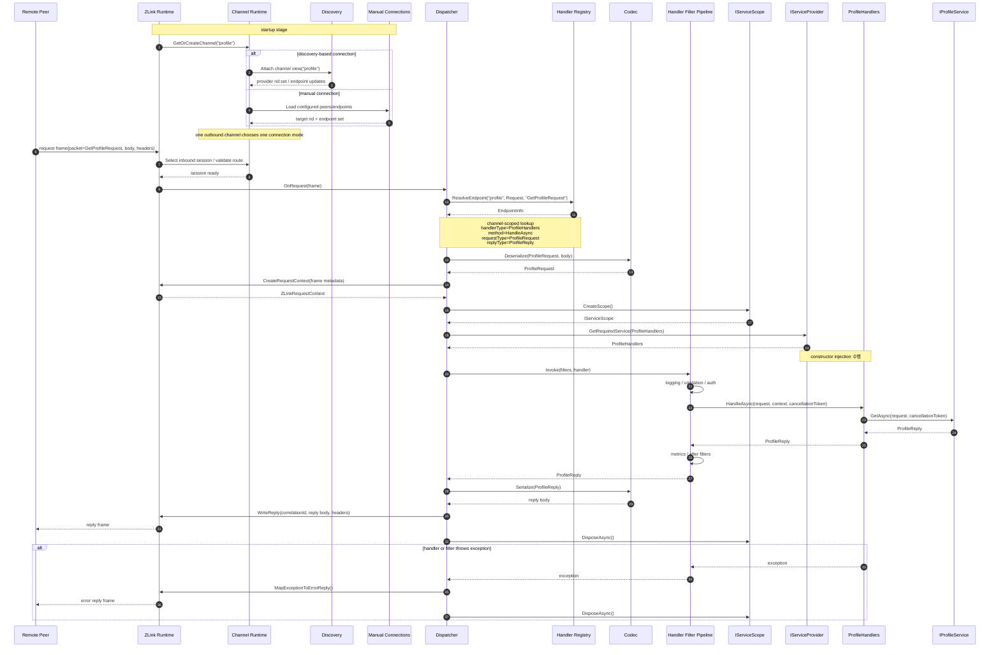

[스펙 목차](../../../README.ko.md)

[.NET 묶음](./README.ko.md) | [인터페이스](./handler-interfaces.ko.md) | [channel 샘플](./channel-messaging-samples.ko.md) | [SPOT](./aspnet-core-spot.ko.md) | [STREAM](./aspnet-core-stream.ko.md) | [Registry](./aspnet-core-registry.ko.md)

# Draft -- ZLink Framework ASP.NET Core Channel Messaging

> 이 문서는 **구현 전 초안**이다.
> 현재 공개 계약이 아니며, `ASP.NET Core`에서 채널 직접 호출과 이벤트 메시징을
> 어떤 API 모양으로 노출할지 방향을 정리한다.

## 1. 목표

`ASP.NET Core` 앱에서 다음 경험을 제공하는 것이 목표다.

- **채널 이름**[^channel]만 알면 다른 서비스를 호출할 수 있다.
- 공용 outbound client[^outbound]를 DI[^di]로 받아 쓴다.
- 이벤트를 publish[^pubsub]한다.
- 채널별로 Discovery[^discovery] 기반 자동 연결을 쓸 수 있다.
- handler[^handler]를 등록하고 DI와 자연스럽게 어울리게 한다.

이때 outbound client는 ZLink 메시지 handler 안에서 쓸 수도 있고, 기존 `ASP.NET Core`
HTTP handler / controller 안에서 쓸 수도 있어야 한다. 즉 사용자는 `DealerSocket`[^dealer],
`RouterSocket`[^router], `Discovery`를 직접 조립하는 대신 `AddZLinkFramework(...)`,
`IZLinkClient`, handler 등록 같은 한 단계 위 표면만 다룬다.

등록부터 handler, HTTP endpoint, outbound 호출까지 이어서 보고 싶다면
[channel-messaging-samples.ko.md](./channel-messaging-samples.ko.md)를 보면 된다.

## 2. 기반이 되는 .NET binding

현재 초안은 아래 `.NET` binding 기능을 토대로 본다.

- `Discovery`
- `DealerSocket`
- `RouterSocket`
- request-reply helper
- `PubSocket` / `SubSocket`

`ZLink Framework`는 위 표면을 감추지 않는다. 그 위에 "채널별로 outbound 경로를
미리 만들어 두고, 호출자가 채널 이름으로만 부르도록" 도와주는 통합 API를 한 층
얹는다.

## 3. ASP.NET Core에서 기대하는 등록 방식

### 3.1 채널 등록

각 채널마다 어떤 역할을 열지 먼저 선언한다. 그리고 client 역할에 대해서는
자동 연결과 수동 연결 둘 다 지원한다. 단, **같은 채널의 같은 client capability
안에서 두 방식을 동시에 섞지는 않는다** -- 둘 중 하나만 고른다.

여기서 "채널을 등록한다"는 말이 곧 "소켓 한 쌍을 만든다"는 뜻은 아니다. 사용자는
역할(capability[^capability])로 읽는 편이 자연스럽다.

- `EnableServer()` -- 그 채널로 들어오는 request / send를 local handler가 받는다.
  서버 역할이므로 `server.Bind(...)`로 자기 endpoint를 함께 정한다.
- `EnableClient()` -- 그 채널로 request / send 호출을 내보낸다.
- `EnablePublisher()` -- 그 채널에 이벤트를 publish한다. 역시 `publisher.Bind(...)`로
  자기 endpoint를 정한다.
- `EnableSubscriber()` -- 그 채널의 이벤트를 받는다.

따라서 inbound handler 없이 outbound 호출만 하는 앱이라면, server 역할 없이
`EnableClient()`만 선언한 채널만 두고 시작해도 된다.

#### 자동 연결 예시

```csharp
builder.Services.AddZLinkFramework(options =>
{
    options.AddClientServerChannel("api", channel =>
    {
        channel.EnableServer(server =>
        {
            server.Bind("tcp://0.0.0.0:7101");
        });
        channel.MapHandlerGroup("api");
    });

    options.AddClientServerChannel("profile", channel =>
    {
        channel.EnableClient();
    });

    options.AddClientServerChannel("account", channel =>
    {
        channel.EnableClient();
    });

    options.UseDiscovery(registry =>
    {
        registry.Add("tcp://registry1:5551");
        registry.Add("tcp://registry2:5551");
    });
});
```

이 코드 한 번이 framework 전역 runtime, 채널별 runtime, codec[^codec] 레지스트리를
모두 셋업한다. `AddClientServerChannel("profile", channel => channel.EnableClient())`
한 줄은 "이 앱은 `profile` 채널의 client로 동작한다. 그쪽으로 보내는 outbound 경로와
DEALER 소켓은 framework가 알아서 만들어 관리한다"라는 뜻이다.

위 예시는 `api` 채널에서는 서버 역할을, `profile`과 `account` 채널에서는 client
역할만 하는 앱을 가정한다.

##### 자동 연결을 켜는 방법

자동 연결은 `options.UseDiscovery(...)` **한 번**으로 켜진다. 그 뒤에 등록되는 모든
client / subscriber capability는 별도로 신호를 보내지 않아도 이 전역 Discovery를
기본 연결 방식으로 쓴다. 즉 `channel.EnableClient()`만 호출해도 그 채널은 자동으로
Discovery 기반 연결로 동작한다.

> 현재 단계에서는 Discovery registry endpoint를 채널별로 다르게 두는 표면을 두지
> 않는다. registry 목록은 앱 전체에서 한 벌만 관리한다.

#### 수동 연결 예시

```csharp
builder.Services.AddZLinkFramework(options =>
{
    options.AddClientServerChannel("api", channel =>
    {
        channel.EnableServer(server =>
        {
            server.Bind("tcp://0.0.0.0:7101");
        });
    });

    options.AddClientServerChannel("profile", channel =>
    {
        channel.EnableClient(client =>
        {
            client.UseManualConnections(peers =>
            {
                peers.Connect("tcp://10.0.10.15:7101");
            });
        });
    });
});
```

이 경우 framework는 그 채널에 대해 Discovery를 강제하지 않는다. 해당 채널의 client
capability는 사용자가 직접 적어 준 peer 목록만 보고 연결을 관리한다.

지금 초안에서 수동 연결은 remote `RoutingId`[^rid]를 받지 않는다. binding 하부 모델이
"이미 connect 된 DEALER를 attach 한다" 방식이라, framework 표면도 endpoint 집합만
다루는 편이 맞다.

#### 두 방식을 한 앱에서 섞기

한 앱 안에서 두 방식을 함께 둘 수 있다. 단 그 뜻은 "같은 채널의 같은 client에서
두 방식을 섞는다"가 아니라, **다른 채널끼리** 다른 방식을 골라 둘 수 있다는 뜻이다.
예를 들어 `profile` 채널은 Discovery 자동 연결로 두고, `account` 채널은 수동 연결로
둘 수 있다.

채널별 연결 방식은 capability 빌더가 `UseManualConnections(...)`를 불렀느냐로 정해
진다.

| 전역 `UseDiscovery(...)` | capability `UseManualConnections(...)` | 그 capability의 연결 방식 |
| --- | --- | --- |
| 있음 | 없음 | Discovery 자동 연결 |
| 있음 | 있음 | 수동 연결 (수동 우선) |
| 없음 | 있음 | 수동 연결 |
| 없음 | 없음 | startup validation[^startupvalidation] 오류 |

요약하면 `options.UseDiscovery(...)`는 모든 client / subscriber capability의 **기본값**
이다. 특정 채널만 수동으로 바꾸고 싶으면 그 채널 안에서
`EnableClient(client => client.UseManualConnections(...))` 또는
`EnableSubscriber(subscriber => subscriber.UseManualConnections(...))`를 명시한다. 이때
명시한 capability만 수동으로 분류되고, 나머지는 전역 Discovery를 그대로 쓴다.

이렇게 갈라 두는 이유는 zlink core 쪽 동작 때문이다. Discovery가 붙은 DEALER는
수동 `connect`, `disconnect`, `unbind`, `close`를 허용하지 않는다. 따라서 framework
도 같은 채널 runtime 안에서 두 방식을 섞는 모델로 설명할 수 없다.

> Route channel(`AddRouteChannel(...)`)은 일반 채널과 다르게, 같은 routed channel
> 안에서 전역 Discovery와 수동 연결이 함께 있으면 startup validation 단계에서 막는
> 다. 일반 client / subscriber는 "수동이 있으면 수동 우선" 정책으로 둘이 공존해도
> 받아 준다.

#### 수동 연결은 채널이 아니라 capability 단위다

또 하나 중요한 점은 수동 연결이 **채널 전체 설정이 아니라 capability별 설정**이
라는 점이다. 예를 들어 같은 `profile` 채널이라도 아래 둘은 서로 다른 연결 집합으로
관리된다.

- `profile.client`
- `profile.subscriber`

그래서 수동 연결 API도 `channel.UseManualConnections(...)`처럼 채널 전체에 두지
않고, `EnableClient(client => ...)`, `EnableSubscriber(subscriber => ...)`처럼 역할별
빌더 안에 둔다.

또한 수동 연결을 쓰는 capability에 대해서는 런타임에 `Connect`, `Disconnect`,
`ListConnections`를 호출할 수 있는 manager 표면을 별도로 둔다 (자세한 표면은
[handler-interfaces.ko.md](./handler-interfaces.ko.md) §6.2 참고).

### 3.1.1 outbound-only 앱 예시

local handler 없이 `IZLinkClient`만 쓰는 앱도 똑같이 가능하다. 이 경우 framework는
server 역할을 열지 않고, client 역할을 선언한 remote 채널에 대해서만 outbound
DEALER를 만든다.

```csharp
builder.Services.AddZLinkFramework(options =>
{
    // 예제용 짧은 값. options.DefaultTimeout의 실제 기본은 30초다.
    options.DefaultTimeout = TimeSpan.FromSeconds(1);
    options.Codecs.AddProtobuf();
    options.AddClientServerChannel("profile", channel =>
    {
        channel.EnableClient();
    });

    options.UseDiscovery(registry =>
    {
        registry.Add("tcp://registry1:5551");
        registry.Add("tcp://registry2:5551");
    });
});
```

### 3.2 outbound client 등록

```csharp
builder.Services.AddZLinkFramework(options =>
{
    // 예제용 짧은 값. options.DefaultTimeout의 실제 기본은 30초다.
    options.DefaultTimeout = TimeSpan.FromSeconds(1);
    options.Codecs.AddProtobuf();
});
```

핵심은 네 가지다.

- `IZLinkClient`는 DI로 주입된다.
- 호출 대상은 gateway 주소가 아니라 **채널 이름**이다.
- runtime은 등록한 채널 capability마다 필요한 만큼 runtime을 만든다.
- client capability가 있는 채널은 그 채널 전용 Discovery 뷰와 outbound DEALER를
  하나씩 가진다.

여기서 outbound DEALER는 framework 입장에서 주로 "request의 reply를 받아 오는
경로"다. 일반 request / send handler dispatch는 local ROUTER(server)가 받은 메시지를
기준으로 한다.

### 3.3 handler 등록

```csharp
builder.Services.AddZLinkHandlersFromAssemblyContaining<Program>();
```

이 호출은 두 가지 일을 한다.

1. handler 타입들을 `.NET` DI 컨테이너에 등록한다.
2. attribute scan으로 request / send / event handler 후보를 찾아 둔다.

여기서 발견된 handler가 곧바로 **모든** 채널에 노출된다는 뜻은 아니다. 실제로
어느 채널에서 동작할지는 별도로 묶어 준다.

#### handler group[^handlergroup]으로 묶기

handler 클래스에 `[ZLinkHandlerGroup("...")]` attribute를 달아 **논리적 그룹 이름**을
붙인다. 그룹 이름은 사용자가 정하는 그냥 문자열이고, 실제 채널 이름과는 분리된다.

```csharp
[ZLinkHandlerGroup("api")]
public sealed class AuthenticatePlayerHandler
{
    [ZLinkRequest]
    public AuthenticatePlayerRes Authenticate(
        AuthenticatePlayerReq request,
        ZLinkRequestContext context,
        CancellationToken cancellationToken)
    {
        // ...
    }
}

[ZLinkHandlerGroup("admin")]
public sealed class AdminCommandHandler
{
    [ZLinkSend]
    public ValueTask HandleAsync(
        RebootCommand command,
        ZLinkSendContext context,
        CancellationToken cancellationToken)
    {
        // ...
    }
}
```

그리고 채널 등록 쪽에서 그 그룹을 **채널에 끌어다 붙인다**. 이때 채널 이름은
`tictactoe.api`처럼 실제 배포 식별자, 그룹 이름은 `api`처럼 코드 안의 논리 묶음
이름이라는 두 축이 분리된다.

```csharp
builder.Services.AddZLinkFramework(options =>
{
    options.AddClientServerChannel("tictactoe.api", channel =>
    {
        channel.EnableServer(server => server.Bind("tcp://0.0.0.0:7101"));
        channel.MapHandlerGroup("api");
    });

    options.AddClientServerChannel("tictactoe.admin", channel =>
    {
        channel.EnableServer(server => server.Bind("tcp://0.0.0.0:7102"));
        channel.MapHandlerGroup("admin");
    });
});
```

`channel.MapHandlerGroup("api")`는 "이 채널에서 들어온 메시지는 `[ZLinkHandlerGroup("api")]`
가 붙은 모든 handler 클래스의 메서드 중 packet kind / packet name이 맞는 것을 호출
한다"는 뜻이다.

이 방식의 장점은 다음과 같다.

- 그룹 이름이 **논리 묶음**이고, 채널 이름이 **실제 배포 식별자**라 둘이 분리된다.
  같은 `api` 그룹을 `tictactoe.api`와 `chess.api` 두 채널에 동시에 매핑할 수 있다.
- 한 채널에 여러 그룹을 매핑할 수도 있다 (`channel.MapHandlerGroup("api"); channel.MapHandlerGroup("debug");`).
- handler 코드는 어느 물리 채널에 매핑될지 모르고 그룹 이름만 알면 된다. 배포
  시점에 채널 토폴로지가 바뀌어도 handler 코드는 그대로다.

event handler도 같은 규칙이다. fanout 채널이라면 subscriber capability에서 같은 식
으로 그룹을 끌어 붙인다.

```csharp
builder.Services.AddZLinkFramework(options =>
{
    options.AddFanoutChannel("api.events", channel =>
    {
        channel.EnableSubscriber();
        channel.MapHandlerGroup("api.events");
    });
});
```

같은 채널 안에서 같은 `kind + packet name`[^packetname] 조합이 둘 이상 매핑되면
(같은 그룹에 충돌이 있거나, 다른 그룹의 충돌이 한 채널에 같이 붙거나) startup
validation 오류로 만든다.

> 그룹 attribute를 안 달면 어떻게 되는가 -- 그 handler 클래스는 어느 채널에도 자동
> 매핑되지 않는다. 즉 `[ZLinkHandlerGroup("...")]`은 채널에 노출할 의도를 명시하는
> opt-in 표식이다.

#### attribute 표면 정리

attribute 표면은 다음과 같이 둔다.

```csharp
[ZLinkHandlerGroup("api")]            // 클래스 attribute. 논리 그룹 이름
public sealed class ProfileHandler
{
    [ZLinkRequest]                     // 메서드 attribute. request handler
    public ProfileRes Get(...) { ... }

    [ZLinkSend]                        // 메서드 attribute. one-way send handler
    public void Notify(...) { ... }

    [ZLinkPublish(PacketName = "profile.cache-invalidated")]  // 메서드 attribute. publish 수신
    public ValueTask OnCacheInvalidated(...) { ... }
}
```

기본 packet key는 payload 타입 이름이다. 정말 필요할 때만 `PacketName`으로
override 한다.

handler 인스턴스 생성도 framework가 직접 `new` 하지 않고 `.NET` DI에 맡긴다.
framework는 그룹 매핑만 잡고, 실제 handler 객체는 `IServiceProvider`로 resolve
한다. 따라서 일반 `ASP.NET Core` 서비스와 똑같이 constructor injection이 동작한다.

또 한 가지 -- handler가 매핑되는 채널은 단순히 라우트 prefix 같은 것이 아니라
"이 앱이 그 채널에서 서버 역할을 한다"는 뜻이다. 그래서 채널 이름은 메서드
attribute의 기본 속성으로 두지 않는다. 메서드 attribute는 packet kind와 packet name
override만 담당하고, 클래스 attribute(`[ZLinkHandlerGroup]`)는 논리 그룹 소속만
담당한다. "어느 채널에 그 그룹을 노출할지"는 채널 등록 쪽이 정한다. 반대로
outbound-only 앱이라면 server capability가 있는 채널 자체를 두지 않을 수 있어야
한다.

### 3.3.1 handler scope와 dispatch key

일반 채널 메시징의 handler 레지스트리는 **전역 packet table이 아니다**. 각 채널은
자기에게 매핑된 handler group 안에서만 packet을 찾는다.

request / command dispatch key는 다음 조합이다.

- inbound 채널 이름
- message kind (`request`, `command`, `event` 중 하나). response는 client측 reply correlation 전용이라 dispatch key 어휘에 두지 않는다.
- packet name

내부 매핑 단계는 다음과 같다.

1. 채널 등록 시점에 `channel.MapHandlerGroup("api")`로 그 채널의 후보 그룹 집합을
   고정한다.
2. 그룹에 속한 handler 클래스들의 메서드를 packet kind / packet name 기준으로
   collect 한다.
3. 들어온 메시지는 (그 채널의 후보 메서드 중) packet kind + packet name이 맞는
   하나를 찾아 dispatch 한다.

event dispatch도 같은 원칙이다. 단 subscriber 채널에서는 `event + packet name`으로
handler를 찾는다. topic은 publish fan-out[^fanout] 라우팅에 쓰는 값이고, typed event
handler를 고를 때 쓰는 기본 키는 packet name이다.

예를 들어 `tictactoe.api` 채널과 `chess.api` 채널이 같은 `api` 그룹을 공유하면, 둘
다 `AuthenticateReq`를 같은 handler로 받는다. 반면 `tictactoe.api`에 `api` 그룹을
붙이고 `tictactoe.admin`에 `admin` 그룹을 붙이면, 같은 `AuthenticateReq` packet이라도
서로 다른 handler가 받는다. 중복 검사 범위가 채널 안으로 제한된다는 점이 핵심이다.
같은 채널 안에서 같은 `kind + packet name`이 둘 이상이면 startup validation 오류
지만, 다른 채널에서 같은 packet name을 다시 쓰는 것은 허용한다.

## 4. 서버 쪽 프로그래밍 모델 초안

handler 인터페이스 정의는 [handler-interfaces.ko.md](./handler-interfaces.ko.md)를
기준으로 한다. 여기서는 그 인터페이스가 `ASP.NET Core` 위에서 어떻게 쓰이는지에 집중
한다.

이 계층의 handler는 SPOT room의 핫패스[^hotpath]와 똑같은 성능 문맥을 전제하지 않
는다. 그렇다고 성능을 포기해도 된다는 뜻은 아니다. 일반 채널 메시징도 reflection
과 할당을 가능한 한 줄이는 방향을 기본으로 한다. 다만 SPOT packet 처리처럼 "FPS
room 핫패스"를 전제로 한 가장 강한 최적화를 우선하기보다는, 일반 채널 쪽은 편의
기능을 조금 더 허용할 여지가 있다는 정도로 본다.

### 4.1 request handler

```csharp
[ZLinkHandlerGroup("user")]
public sealed class UserHandlers
{
    private readonly IZLinkClient _client;

    public UserHandlers(IZLinkClient client)
    {
        _client = client;
    }

    [ZLinkRequest]
    public async ValueTask<UserReply> GetUserAsync(
        UserRequest request,
        ZLinkRequestContext context,
        CancellationToken cancellationToken)
    {
        var account = await _client
            .Request(
                "account",
                new GetAccountRequest { AccountId = request.AccountId })
            .Submit<GetAccountReply>(cancellationToken);

        return new UserReply
        {
            AccountId = request.AccountId,
            Nickname = account.Nickname
        };
    }
}
```

이 모델에서 기대하는 동작은 다음과 같다.

- body는 typed 객체로 역직렬화된다.
- `ZLinkRequestContext`에서 header, correlation id[^correlationid], deadline, 호출자
  메타데이터를 읽는다.
- `CancellationToken`으로 timeout / cancel을 이어 준다.
- handler 클래스는 `UserHandlers`, `ItemHandlers`처럼 주제별로 묶어도 된다.
- packet 하나당 클래스 하나로 쪼개도 된다.
- 기본 dispatch key는 request payload 타입 이름이다. 예: `UserRequest` 클래스는
  기본적으로 `UserRequest` packet으로 매핑된다.
- 이름 충돌이 있거나 외부 계약 때문에 다른 키가 필요할 때만 `PacketName`을 명시
  적으로 override 한다.
- dispatch lookup은 전역이 아니라 **수신한 채널의 namespace 안에서** 수행된다.

### 4.2 event handler

```csharp
[ZLinkHandlerGroup("cache.events")]
public sealed class CacheEventHandlers
{
    [ZLinkPublish(PacketName = "cache.invalidate")]
    public ValueTask HandleAsync(
        CacheInvalidateEvent message,
        ZLinkPublishContext context,
        CancellationToken cancellationToken)
    {
        return ValueTask.CompletedTask;
    }
}
```

request-response와 event는 서로 별도 표면으로 보이는 편이 자연스럽다.

### 4.3 inbound dispatch 시퀀스

아래 시퀀스는 `GetProfileRequest` packet이 local ROUTER로 들어왔을 때 runtime이
handler를 찾고, DI로 객체를 만들고, 응답을 돌려주는 흐름이다. outbound 채널 runtime
은 startup 시점에 Discovery 자동 연결 또는 수동 연결 중 **하나만** 골라 둔다는 점에
주의한다.



이 흐름에서 짚을 점은 다음과 같다.

- outbound 채널 runtime은 Discovery 자동 연결과 수동 연결 중 **하나만** 고른다.
- 한 앱에서 채널마다 다른 방식을 골라도 된다. 예: `profile`은 자동 연결, `account`
  는 수동 연결.
- 일반 request / send handler dispatch는 local ROUTER(server) ingress를 기준으로
  설명한다.
- handler lookup은 수신한 채널의 namespace 안에서
  `channel name + kind + packet name`으로 한다.
- outbound DEALER(client)가 받는 메시지는 일단 reply correlation 경로로만 본다.
  `ROUTER -> DEALER` 임의 push는 현재 채널 메시징 공용 계약에 넣지 않는다.
- framework는 handler 객체를 직접 `new` 하지 않고 `.NET` DI로 resolve 한다.
- filter pipeline이 있으면 handler 호출 전후를 감싼다.
- 예외는 framework가 표준 오류 응답으로 매핑해서 reply로 돌려준다.

위 흐름에 등장하는 handler, client, filter 인터페이스 정의는
[handler-interfaces.ko.md](./handler-interfaces.ko.md)에 모여 있다. 주요 인터페이스는
다음과 같다.

- `IZLinkRequestHandler<TRequest, TResponse>` -- request-response handler
- `IZLinkSendHandler<TMessage>` -- 단방향 send handler
- `IZLinkClient` -- outbound client (호출 단위는 `channelName`)
- `IZLinkHandlerFilter` -- handler 전후 공통 처리

`.NET` 표면은 "인터페이스 / attribute 둘 다 가능하지만, 일반 사용자는 attribute
매핑 + `IZLinkClient`를 함께 쓴다"를 기본 방향으로 한다.

## 5. 클라이언트 쪽 프로그래밍 모델 초안

### 5.1 outbound client 표면 개요

채널 타입별로 별도 client 인터페이스를 둔다. 하나의 앱에서 여러 종류의 채널을
함께 쓰면, 필요한 인터페이스를 각각 DI로 받아 쓴다.

| 인터페이스 | 대응 채널 타입 | 호출 키 | 용도 |
| --- | --- | --- | --- |
| `IZLinkClient` | `AddClientServerChannel` | `channelName` | 1:1 request / send (DEALER 측) |
| `IZLinkEventPublisher` | `AddFanoutChannel` | `channelName + topic` | 이벤트 publish (PUB 측) |
| `IZLinkRouteClient` | `AddRouteChannel` / `AddRouteMeshChannel` | `routerChannelId + targetNodeRid` | 명시적 노드 라우팅 (DEALER↔ROUTER) |

세 client 모두 `IZLinkClient`와 같은 fluent builder 결을 따른다 -- 호출 chain
끝의 `.Submit(...)` 또는 `.Submit<TReply>(...)`로 마무리한다. `PacketName`,
`Timeout` 같은 변형은 그 사이에 이어 붙인다.

세 인터페이스의 전체 정의는
[handler-interfaces.ko.md](./handler-interfaces.ko.md)의 §5에 모여 있다.

### 5.2 IZLinkClient

`AddClientServerChannel(...)`로 선언한 client-server 채널에 1:1 호출을 보낼 때
쓴다. Discovery가 대상 노드를 골라 주므로 호출자는 **채널 이름**만 넘기면 된다.

- 기본 packet key는 request / message 타입 이름이다.
- 특정 채널의 ROUTER(server)를 `rid`로 직접 지정해 호출하는 표면은 두지 않는다.
  `rid`로 직접 보내는 경로는 routed 채널(`IZLinkRouteClient`)이나 SPOT의
  spot-to-spot 호출에서만 다룬다.
- `IZLinkClient`를 쓴다고 해서 local ROUTER(server)가 반드시 필요한 것은 아니다.
  local handler를 등록하지 않은 앱은 dealer-only outbound runtime만으로 충분히
  동작한다. 다만 그 경우에도 **어떤** remote 채널에 접근할지는 startup 단계에서
  한 번 선언해 둔다.

### 5.3 IZLinkEventPublisher

`AddFanoutChannel(...)`로 선언한 fanout 채널에 이벤트를 publish할 때 쓴다.
호출 키는 **`channelName + topic`** 두 축이다.

- 같은 채널 안에서도 topic으로 fan-out scope를 좁힐 수 있다.
- 기본 packet key는 publish 인자 타입 이름이고, attribute / fluent로 override
  가능하다.
- subscriber 쪽 dispatch는 packet name을 기준으로 한다. topic은 publisher가 어느
  fan-out 그룹으로 뿌릴지 결정하는 라우팅 값이고, subscriber는 그 채널을 구독한
  뒤 packet name이 맞는 `[ZLinkPublish]` handler를 부른다.

```csharp
app.MapPost("/profiles/refresh", async (
    RefreshProfileHttpRequest request,
    IZLinkEventPublisher publisher,
    CancellationToken cancellationToken) =>
{
    await publisher
        .Publish(
            "api.events",
            "profile.cache-refreshed",
            new ProfileCacheRefreshedEvent(request.AccountId))
        .Submit(cancellationToken);

    return Results.Accepted();
});
```

### 5.4 IZLinkRouteClient

`AddRouteChannel(...)` / `AddRouteMeshChannel(...)`로 선언한 routed 채널에서 쓴다.
일반 채널과 달리 호출 시점에 **목적지 노드의 `RoutingId`를 직접 지정**한다.
호출 키는 **`routerChannelId + targetNodeRid`** 두 축이다.

- routed 채널은 같은 routerChannelId를 공유하는 노드 집합 안에서 서로 임의 방향
  으로 send / request를 보낼 수 있다. 어느 노드를 지정할지는 호출자가 application
  로직으로 정한다 (예: `IZLinkActorPlayRouteResolver` 같은 resolver를 통해 actor
  id → `RoutingId`로 풀어 옴).
- 일반 채널(`IZLinkClient`)과 달리 같은 routed 채널 안에서 자동 + 수동 연결을
  섞으면 startup validation 오류다 (§3.1 표 끝의 인용 참고).
- handler 쪽에서는 들어온 메시지의 source `RoutingId`를
  `ZLinkRouteSendContext.SourceNodeRid` / `ZLinkRouteRequestContext.SourceNodeRid`
  에서 읽는다.

```csharp
public sealed class PlayDispatchHandlers
{
    private readonly IZLinkRouteClient _route;
    private readonly IZLinkActorPlayRouteResolver _resolver;

    public PlayDispatchHandlers(
        IZLinkRouteClient route,
        IZLinkActorPlayRouteResolver resolver)
    {
        _route = route;
        _resolver = resolver;
    }

    public async ValueTask SendToActorAsync(
        string actorId,
        PlaceMarkCommand command,
        CancellationToken cancellationToken)
    {
        var route = await _resolver.ResolvePlayRouteAsync(actorId, cancellationToken);

        await _route
            .SendTo(route.RouterChannelId, route.TargetNodeRid, command)
            .Submit(cancellationToken);
    }
}
```

### 5.5 HTTP handler에서의 사용

§5.2–5.4의 세 client는 ZLink handler 안에서만 쓰는 것이 아니다. 기존
`ASP.NET Core` HTTP handler에서도 그대로 DI로 주입받아 쓸 수 있어야 한다.
아래는 `IZLinkClient` 예시지만, `IZLinkEventPublisher`와 `IZLinkRouteClient`도
같은 방식으로 주입한다.

```csharp
app.MapPost("/profiles/get", async (
    GetProfileHttpRequest request,
    IZLinkClient client,
    CancellationToken cancellationToken) =>
{
    var reply = await client
        .Request(
            "profile",
            new GetProfileRequest { AccountId = request.AccountId })
        .Submit<GetProfileReply>(cancellationToken);

    return Results.Ok(reply);
});
```

이 표면은 다음 상황에 유용하다.

- 기존 웹 요청을 처리하다가 내부의 다른 서비스를 호출해야 할 때.
- ZLink handler와 HTTP handler가 같은 outbound 호출 방식을 공유하고 싶을 때.
- framework 내부 공통 helper에서 호출할 때.
- 특정 요청만 별도 timeout이나 packet name override가 필요할 때.

다음 정도의 표면이 자연스럽다.

```csharp
var reply = await client
    .Request("profile", new GetProfileRequest { AccountId = accountId })
    .WithTimeout(TimeSpan.FromMilliseconds(200))
    .Submit<GetProfileReply>(cancellationToken);

await client
    .Send("profile", new RefreshProfileCacheCommand { AccountId = accountId })
    .WithPacketName("profile.refresh-cache")
    .Submit(cancellationToken);
```

## 6. ASP.NET Core middleware, 서비스 AOP, handler pipeline

### 6.1 HTTP middleware와의 관계

기존 `ASP.NET Core`의 `app.Use(...)` middleware는 HTTP 파이프라인 전용이다. 따라서
ZLink 메시지 handler에는 자동으로 적용되지 않는다.

```csharp
app.UseAuthentication();
app.UseAuthorization();
app.Use(async (context, next) =>
{
    await next();
});
```

이 코드는 HTTP endpoint에는 적용되지만 `[ZLinkRequest]` handler에는 직접 연결되지
않는다.

### 6.2 서비스 레이어 AOP

서비스 레이어 AOP[^aop]는 사용 중인 라이브러리 방식을 그대로 쓰면 된다. 핵심은
**handler 메서드 자체가 아니라, handler가 주입받는 서비스 계층에서** AOP가 동작
한다는 점이다.

```csharp
[ZLinkHandlerGroup("user")]
public sealed class UserHandlers
{
    private readonly IUserService _service;

    public UserHandlers(IUserService service)
    {
        _service = service;
    }

    [ZLinkRequest]
    public Task<UserReply> GetUserAsync(
        UserRequest request,
        ZLinkRequestContext context,
        CancellationToken cancellationToken)
    {
        return _service.GetAsync(request, cancellationToken);
    }
}
```

`IUserService`가 decorator, proxy, interceptor 같은 방식으로 감싸져 있다면 그 AOP가
그대로 적용된다. 어떤 방식을 쓸지는 사용 중인 라이브러리의 규칙을 따른다.

### 6.3 ZLink handler filter

logging, validation, authorization, metrics, exception mapping 같은 공통 처리가
필요하면 HTTP middleware와는 별개로 ZLink handler filter를 둔다. `IZLinkHandlerFilter`
인터페이스 정의와 등록 방법은 [handler-interfaces.ko.md](./handler-interfaces.ko.md)
§8을 본다.

## 7. Discovery와 채널 runtime

### 7.1 기본 방향

- 호출자는 **채널 이름**만 지정한다.
- `IZLinkClient`는 등록된 채널 이름마다 별도 채널 runtime을 가진다.
- 각 채널은 그 채널의 view에 묶인 Discovery와 outbound DEALER 소켓을 가진다.
- Discovery가 그 채널 view의 provider 목록을 유지한다.
- framework는 채널의 rid 집합과 연결 상태를 보고 요청을 보낸다.
- 필요하면 운영 점검용으로 별도 서비스가 `Registry`[^registry] snapshot / query 결과를
  읽어 현재 topology를 노출할 수 있다.

### 7.2 왜 중요한가

이 모델의 핵심은 **내부 서비스 호출에서 별도 gateway나 load balancer를 강제하지
않으면서도** zlink core의 fixed channel view 철학을 그대로 이어 간다는 점이다.

따라서 다음 방향을 기본으로 한다.

- `IZLinkClient`는 gateway 주소가 아니라 채널 이름으로 요청한다.
- `ZLink Framework`는 그 채널 전용 outbound 경로로 직접 요청을 보낸다.
- 같은 채널 안의 여러 provider는 그 채널 안에서만 관리한다.

## 8. codec과 메시지 모델

현재 초안은 다음 구성을 가정한다.

- 메시지 = `header + body`
- body codec = `protobuf` 또는 `json`

`.NET` 표면에서는 codec 등록과 serializer 선택을 다음처럼 노출할 수 있다. 여기서
`options.Codecs.*`는 binding core에 codec 구현을 직접 끼워 넣는다는 뜻이 아니라,
별도 codec extension / provider를 framework registry에 등록하는 흐름이라는 점에
주의한다.

```csharp
builder.Services.AddZLinkFramework(options =>
{
    options.Codecs.AddProtobuf();
    options.Codecs.AddJson();
    options.Codecs.AddMessagePack();
});
```

## 9. lifecycle 초안

`ASP.NET Core`에서는 다음 lifecycle이 중요하다.

- 앱 시작 시 runtime 부팅
- Discovery 연결 수립
- handler dispatcher 시작
- 앱 종료 시 graceful shutdown

따라서 내부 구현은 `IHostedService`[^ihostedservice] 또는 그와 비슷한 hosted
lifecycle 모델에 자연스럽게 맞물려야 한다.

## 10. 결정된 기준

- framework core는 채널별 typed wrapper를 기본 표면으로 제공하지 않는다. 공용
  outbound 표면은 `IZLinkClient` 하나로 유지한다.
- 채널 runtime은 host startup 단계에서 등록된 capability를 보고 만들고, host
  shutdown 단계에서 정리한다. lazy first-call 생성으로 숨기지 않는다 -- 설정 오류
  는 startup 단계에서 미리 드러낸다.
- topology query는 운영용 HTTP endpoint 전용 숨은 API로 두지 않는다. 앱 내부에서도
  쓸 수 있는 일반 DI 서비스로 열고, 운영 API는 그 서비스를 얇게 감싸는 형태를
  기본으로 한다.

---

### 각주 모음

[^channel]: **channel**은 zlink core의 논리적 통신 경로 단위다. 같은 채널 이름을 쓰는
    노드들끼리만 메시지를 주고받는다. 물리 endpoint(IP:port)와는 분리된 개념이다.

[^outbound]: **outbound**는 "내가 보내는 쪽" 방향을 말한다. 반대 방향은 inbound
    (받는 쪽). client는 outbound, server는 inbound 역할이다.

[^di]: **DI** = Dependency Injection. `ASP.NET Core`가 기본 제공하는 의존성 주입
    컨테이너. `builder.Services.Add...()`로 등록하고 생성자 매개변수로 받아 쓴다.

[^pubsub]: **publish / subscribe**는 1:N 이벤트 fan-out 패턴이다. publisher가 토픽에
    이벤트를 보내면 그 토픽을 구독(subscribe)한 모든 subscriber가 같이 받는다.

[^discovery]: **Discovery**는 zlink core의 자동 peer 발견 메커니즘이다. registry
    노드에 채널의 provider 목록이 등록되어 있고, client는 그 목록을 받아 자동으로
    연결한다. 수동 endpoint 관리가 필요 없다.

[^handler]: **handler**는 들어온 메시지를 처리하는 사용자 코드다. request handler는
    응답을 돌려주고, send handler는 단방향으로 받기만 하며, event handler는 publish된
    이벤트를 받는다.

[^dealer]: **DEALER** 소켓은 ZeroMQ 계열의 비동기 양방향 소켓이다. 여기서는
    "outbound client 쪽 소켓"으로 이해하면 된다.

[^router]: **ROUTER** 소켓은 들어오는 요청에 routing id를 붙여 식별해 주는 서버
    쪽 소켓이다. 응답은 그 routing id를 보고 원래 발신자에게 다시 보낸다.

[^capability]: **capability**는 한 채널 안에서 이 앱이 맡는 역할이다. server,
    client, publisher, subscriber 네 가지가 있다. 한 채널이 둘 이상의 capability를
    동시에 가질 수도 있다(채널 타입에 따라).

[^codec]: **codec**은 body를 바이트 배열과 객체 사이로 변환하는 직렬화기다. JSON,
    Protobuf, MessagePack 등이 있다.

[^rid]: **RoutingId** (rid)는 zlink core가 각 peer에게 부여하는 식별자다. 채널 안의
    특정 노드를 가리킬 때 쓴다.

[^startupvalidation]: **startup validation**은 앱이 뜨는 순간 설정을 검사해 오류가
    있으면 즉시 실패시키는 단계다. 런타임에서 늦게 드러나는 실패를 막는다.

[^packetname]: **packet name**은 메시지 종류를 가리키는 문자열 키다. 기본은 payload
    타입 이름이고, `[ZLinkRequest(PacketName = "...")]`로 override 할 수 있다.

[^handlergroup]: **handler group**은 handler 클래스에 `[ZLinkHandlerGroup("...")]`로
    붙이는 논리적 묶음 이름이다. 실제 채널 이름과는 분리된 별도 namespace이며, 채널
    등록 쪽에서 `channel.MapHandlerGroup("...")`로 끌어다 붙여 어느 채널에 노출할지
    정한다.

[^fanout]: **fan-out**은 하나의 publish가 여러 구독자에게 동시에 퍼져 나가는 것을
    말한다.

[^correlationid]: **correlation id**는 request와 그 reply를 짝지어 주는 식별자다.
    여러 요청이 동시에 떠 있을 때 어느 응답이 어느 요청에 해당하는지 가린다.

[^hotpath]: **hot path**는 가장 자주, 가장 빠르게 도는 코드 경로다. SPOT의 room
    핫패스는 게임 FPS 한 프레임 안에서 도는 코드라 가장 강한 최적화 대상이다.

[^aop]: **AOP** = Aspect-Oriented Programming. logging, transaction, security 같은
    공통 관심사를 메서드 호출 앞뒤에 끼워 넣는 패러다임. .NET에서는 decorator,
    interceptor, proxy 같은 방식으로 구현한다.

[^registry]: **Registry**는 zlink core가 제공하는 topology 정보 저장소다. 어떤 채널
    에 어떤 provider가 떠 있는지 같은 정보를 보관한다.

[^ihostedservice]: **IHostedService**는 `ASP.NET Core` 호스트의 시작 / 종료 시점에
    돌릴 백그라운드 서비스 인터페이스다. `StartAsync` / `StopAsync` 두 메서드로
    lifecycle을 잡는다.
