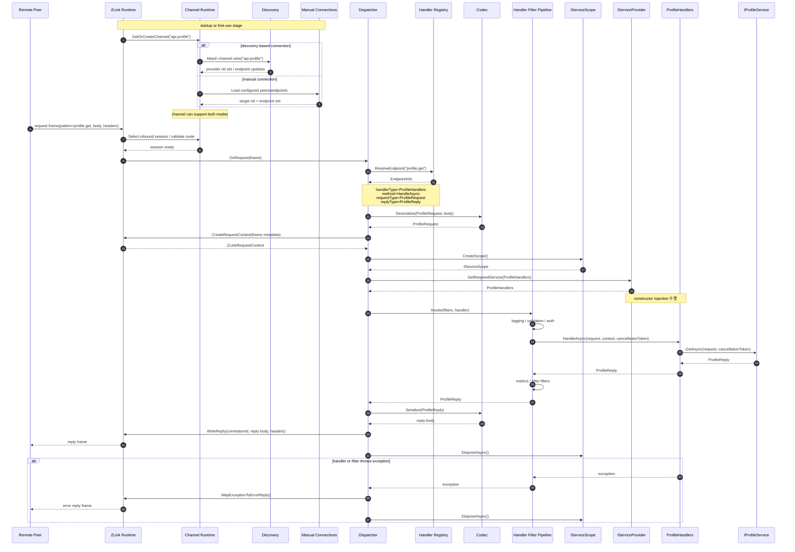

[스펙 목차](../../../README.ko.md)

# Draft -- ZLink Framework ASP.NET Core Channel Messaging

> 이 문서는 **구현 전 초안**이다.
> 현재 공개 계약이 아니며, `ASP.NET Core`에서 direct channel call과 event
> messaging을 어떤 API로 드러낼지 방향을 정리한다.

## 1. 목표

`ASP.NET Core` 애플리케이션에서 아래 경험을 제공하는 것이 목표다.

- `channel_name` 기준 direct call
- DI로 주입되는 공용 outbound client
- event publish
- channel별 `Discovery` 기반 요청
- handler 등록과 DI 통합

여기서 outbound client는 ZLink 메시지 handler 안에서도, 기존 ASP.NET Core HTTP
handler/controller 안에서도 똑같이 쓸 수 있어야 한다.

즉 사용자는 `DealerSocket`, `RouterSocket`, `Discovery`를 직접 조합하기보다,
`AddZLinkFramework(...)`, `IZLinkClient`, handler registration 같은 표면으로
작업하게 한다.

등록부터 handler, HTTP endpoint, outbound 호출까지 이어서 보는 샘플은
[channel-messaging-samples.ko.md](./channel-messaging-samples.ko.md)를
참고한다.

## 2. 기반이 되는 .NET binding

현재 초안은 아래 `.NET` binding 기능을 하부 토대로 본다.

- `Discovery`
- `DealerSocket`
- `RouterSocket`
- request-reply helper
- `PubSocket` / `SubSocket`

`ZLink Framework`는 이 표면을 감추기보다, 그 위에 channel별 outbound runtime을 관리하는
더 높은 수준의 프레임워크 통합 API를 얹는 방향으로 본다.

## 3. ASP.NET Core에서 기대하는 등록 방식

### 3.1 channel 등록

현재 초안은 자동 연결과 수동 연결을 둘 다 열어 두는 편을 우선 가정한다.

자동 연결 예시는 아래와 같다.

```csharp
builder.Services.AddZLinkFramework(options =>
{
    options.ChannelId = "api";
    options.NodeName = "api-1";
    options.UseDiscovery(registry =>
    {
        registry.Add("tcp://registry1:5551");
        registry.Add("tcp://registry2:5551");
    });
});
```

이 등록은 framework 전역 runtime, channel runtime factory, codec registry의 기본
구성을 맡는다.

수동 연결 예시는 아래와 같이 둘 수 있다.

```csharp
builder.Services.AddZLinkFramework(options =>
{
    options.ChannelId = "api";
    options.NodeName = "api-1";

    options.ConfigureManualConnections(connections =>
    {
        connections.Add("api.profile", peers =>
        {
            peers.Connect(
                targetRid: RoutingId.Parse("01HZX..."),
                endpoint: "tcp://10.0.10.15:7101");
        });
    });
});
```

이 경우 framework는 `Discovery`를 강제하지 않는다. channel별 outbound runtime이 수동으로
주어진 peer 목록만 기준으로 연결을 관리한다.

필요하면 두 방식을 함께 둘 수도 있다. 즉 자동 연결과 수동 연결은 서로 배타적
기능이라기보다, channel runtime이 함께 가질 수 있는 두 종류의 연결 소스에 가깝다.

### 3.2 outbound client 등록

```csharp
builder.Services.AddZLinkFramework(options =>
{
    options.DefaultTimeout = TimeSpan.FromSeconds(1);
    options.Codecs.AddProtobuf();
});
```

핵심은 아래 네 점이다.

- `IZLinkClient`는 DI로 주입된다.
- 호출 대상은 gateway 주소가 아니라 `channel_name`
- runtime은 접근한 `channel_name`마다 별도 outbound channel을 만든다.
- 각 channel은 그 channel 전용 `Discovery`와 outbound socket을 가진다.

### 3.3 handler 등록

```csharp
builder.Services.AddZLinkHandlersFromAssemblyContaining<Program>();
```

또는 endpoint-style registration도 가능하지만, 1차 초안은 DI와 attribute 기반을
우선 검토한다.

현재 1차 attribute 후보는 아래처럼 둔다.

```csharp
[ZLinkRequest("profile.get")]
[ZLinkSend("profile.refresh-cache")]
```

이 등록 모델에서 중요한 점은 handler 인스턴스 생성도 `.NET DI`가 맡는다는 것이다.
즉 framework는 매핑만 잡고, 실제 handler 객체는 `IServiceProvider`를 통해 resolve
한다. 따라서 constructor injection은 일반 `ASP.NET Core` 서비스와 같은 방식으로
동작해야 한다.

여기서 `channelId`는 route prefix가 아니라 앱이 속한 channel 묶음 식별자이므로,
handler class attribute보다 등록 옵션에 두는 편을 현재 방향으로 본다.

## 4. 서버 쪽 프로그래밍 모델 초안

실제 handler 인터페이스 초안은 [handler-interfaces.ko.md](./handler-interfaces.ko.md)를
기준으로 본다. 이 문서는 그중 `ASP.NET Core` 매핑 경험을 설명하는 쪽에 집중한다.

여기서 channel messaging handler는 `SPOT` room 핫패스와 완전히 같은 성능 문맥을
기본 전제로 두지는 않는다. 그렇다고 성능이 낮아도 된다는 뜻은 아니다. 이 계층도
불필요한 reflection과 할당은 줄여야 한다. 다만 `SPOT` packet 처리처럼 "FPS room
핫패스"를 전제로 가장 강한 최적화를 우선하는 대신, 일반 channel messaging 쪽은
조금 더 많은 편의 기능을 허용할 여지가 있다는 뜻에 가깝다.

### 4.1 request handler

```csharp
public sealed class UserHandlers
{
    private readonly IZLinkClient _client;

    public UserHandlers(IZLinkClient client)
    {
        _client = client;
    }

    [ZLinkRequest("user.get")]
    public async ValueTask<UserReply> GetUserAsync(
        UserRequest request,
        ZLinkRequestContext context,
        CancellationToken cancellationToken)
    {
        var account = await _client.RequestAsync(
            "api.account",
            new GetAccountRequest { AccountId = request.AccountId },
            cancellationToken);

        return new UserReply
        {
            AccountId = request.AccountId,
            Nickname = account.Nickname
        };
    }
}
```

이 모델에서 기대하는 점은 아래와 같다.

- body는 typed object로 역직렬화된다.
- `ZLinkContext`에서 header, correlation, deadline, caller metadata를 읽는다.
- `CancellationToken`으로 timeout/cancel을 연결한다.
- handler class는 `UserHandlers`, `ItemHandlers`처럼 주제별로 묶어도 된다.
- 패킷 하나당 class 하나로 쪼개도 된다.
- 실제 dispatch key는 class 이름이 아니라 `user.get` 같은 메시지 이름이다.

### 4.2 event handler

```csharp
public sealed class CacheEventHandlers
{
    [ZLinkEvent("cache.invalidate")]
    public ValueTask HandleAsync(
        CacheInvalidateEvent message,
        ZLinkEventContext context,
        CancellationToken cancellationToken)
    {
        return ValueTask.CompletedTask;
    }
}
```

request-response와 event는 분리된 표면으로 보이는 편이 좋다.

### 4.3 inbound dispatch 시퀀스

아래 시퀀스는 `"profile.get"` 요청이 들어왔을 때 runtime이 handler를 찾고,
DI로 handler를 resolve해서 응답을 돌려주는 흐름을 보여 준다. 이때 channel
runtime은 `Discovery` 기반 자동 연결과 수동 연결 구성을 둘 다 가질 수 있다.



이 흐름에서 중요한 점은 아래와 같다.

- channel runtime은 `Discovery` 기반 자동 연결과 수동 연결 구성을 둘 다 가질 수 있다.
- framework는 handler 객체를 직접 `new` 하지 않고 `.NET DI`로 resolve한다.
- filter pipeline이 있으면 handler 호출 전후를 감싼다.
- 예외는 framework가 표준 오류 응답으로 매핑해서 reply로 돌려준다.

위 dispatch 흐름에서 사용하는 handler, client, filter 인터페이스 정의는
[handler-interfaces.ko.md](./handler-interfaces.ko.md)에 모아 두었다.
주요 인터페이스는 아래와 같다.

- `IZLinkRequestHandler<TRequest, TResponse>` -- request-response handler
- `IZLinkSendHandler<TMessage>` -- one-way send handler
- `IZLinkClient` -- outbound client (`channelName` 기준 호출이 기본)
- `IZLinkHandlerFilter` -- handler 전후 공통 처리

`.NET` 앞면은 "인터페이스 + attribute 둘 다 가능하지만, 일반 사용자는
attribute 매핑과 `IZLinkClient`를 함께 쓴다"를 기본으로 본다.

## 5. 클라이언트 쪽 프로그래밍 모델 초안

### 5.1 outbound client 개요

`IZLinkClient` 인터페이스 전체 정의는
[handler-interfaces.ko.md](./handler-interfaces.ko.md)의 section 5.1을
참고한다.

구현체는 `ZLink Framework`가 DI로 제공한다. 일반 channel messaging에서는 아래
한 축을 기본으로 둔다.

- `channelName` 기준 호출 -- Discovery가 대상을 선택

즉 특정 channel의 `ROUTER(server)`를 `rid`로 직접 지정해 호출하는 표면은 두지
않는다. `rid`를 넣는 routed 호출은 SPOT spot-to-spot 경로에서만 다룬다.

### 5.2 HTTP handler에서의 사용

이 client는 ZLink handler 안에서만 쓰는 것이 아니다. 기존 ASP.NET Core HTTP
handler에서도 그대로 주입받아 쓸 수 있어야 한다.

```csharp
app.MapPost("/profiles/get", async (
    GetProfileHttpRequest request,
    IZLinkClient client,
    CancellationToken cancellationToken) =>
{
    var reply = await client.RequestAsync(
        "api.profile",
        new GetProfileRequest { AccountId = request.AccountId },
        cancellationToken);

    return Results.Ok(reply);
});
```

이 표면은 아래 상황에 유용하다.

- 기존 웹 요청 처리 중 다른 내부 서버 호출
- ZLink handler와 HTTP handler가 같은 outbound 호출 방식을 공유
- framework 내부 공통 helper
- 특정 요청만 별도 timeout으로 보내기

## 6. ASP.NET Core middleware, 서비스 AOP, handler pipeline

### 6.1 HTTP middleware와의 관계

기존 `ASP.NET Core`의 `app.Use(...)` middleware는 HTTP pipeline 전용이다.
따라서 ZLink 메시지 handler에 자동으로 그대로 적용되지는 않는다.

```csharp
app.UseAuthentication();
app.UseAuthorization();
app.Use(async (context, next) =>
{
    await next();
});
```

즉 위 같은 middleware는 HTTP endpoint에는 적용되지만, `ZLinkRequest(...)`
handler에는 바로 연결되지 않는다.

### 6.2 서비스 레이어 AOP

서비스 레이어 AOP는 기존 라이브러리 방식에 맞춰 그대로 사용할 수 있다.
핵심은 handler 메서드 자체보다, handler가 주입받는 서비스 계층에서 AOP가
동작한다는 점이다.

```csharp
public sealed class UserHandlers
{
    private readonly IUserService _service;

    public UserHandlers(IUserService service)
    {
        _service = service;
    }

    [ZLinkRequest("user.get")]
    public Task<UserReply> GetUserAsync(
        UserRequest request,
        ZLinkRequestContext context,
        CancellationToken cancellationToken)
    {
        return _service.GetAsync(request, cancellationToken);
    }
}
```

여기서 `IUserService`가 decorator, proxy, interceptor 같은 방식으로 감싸져 있다면
그 AOP는 그대로 적용된다. 어떤 방식으로 적용할지는 사용 중인 라이브러리 규칙을
따르면 된다.

### 6.3 ZLink handler filter

logging, validation, authorization, metrics, exception mapping 같은 공통 처리가
필요하면, HTTP middleware와는 별도의 ZLink handler filter가 필요하다.
`IZLinkHandlerFilter` 인터페이스 정의와 등록 방법은
[handler-interfaces.ko.md](./handler-interfaces.ko.md)의 section 8을 참고한다.

## 7. Discovery와 channel runtime

### 7.1 기본 방향

- 호출자는 `channel_name`만 지정한다.
- `IZLinkClient`는 접근한 `channel_name`마다 별도 channel을 lazy하게 만든다.
- 각 channel은 그 channel view에 묶인 `Discovery`와 outbound socket을 가진다.
- Discovery가 현재 channel view의 provider 목록을 유지한다.
- framework는 그 channel의 `rid` 집합과 연결 상태를 보고 요청을 보낸다.
- 필요하면 운영 점검용 별도 서비스가 `Registry` snapshot/query 결과를 읽어 현재
  topology를 노출할 수 있다.

### 7.2 왜 중요한가

이 모델의 핵심은 내부 서비스 호출에서 별도 gateway나 전용 load balancer를
강제하지 않으면서도, core의 fixed channel view 철학을 그대로 따른다는 점이다.

즉 아래 방향을 기본으로 본다.

- `IZLinkClient`는 gateway 주소가 아니라 `channel_name`으로 요청한다.
- `ZLink Framework`는 그 channel 전용 outbound 경로로 직접 요청을 보낸다.
- 같은 channel 안의 여러 provider는 그 channel 안에서만 관리한다.

## 8. codec과 message model

현재 초안은 아래 구성을 가정한다.

- message = `header + body`
- body codec = `protobuf` 또는 `json`

`.NET` 표면에서는 codec 등록과 serializer 선택을 아래처럼 보이게 할 수 있다.

```csharp
builder.Services.AddZLinkFramework(options =>
{
    options.Codecs.AddProtobuf();
    options.Codecs.AddJson();
});
```

## 9. lifecycle 초안

`ASP.NET Core`에서는 아래 lifecycle이 중요하다.

- 앱 시작 시 runtime 부팅
- discovery 연결 수립
- handler dispatcher 시작
- 앱 종료 시 graceful shutdown

따라서 내부 구현은 `IHostedService` 또는 그와 비슷한 hosted lifecycle 모델과
잘 맞아야 한다.

## 10. 아직 확정하지 않는 것

- attribute model과 endpoint model 중 어느 쪽을 우선할지
- channel별 typed wrapper를 공식 제공할지
- 일반 서버간 쪽에서 `IZLinkClient`와 event publisher를 어떤 이름으로 확정할지
- channel runtime을 언제 만들고 언제 정리할지
- topology query surface를 운영 API로만 둘지, 일반 DI 서비스로도 열지
