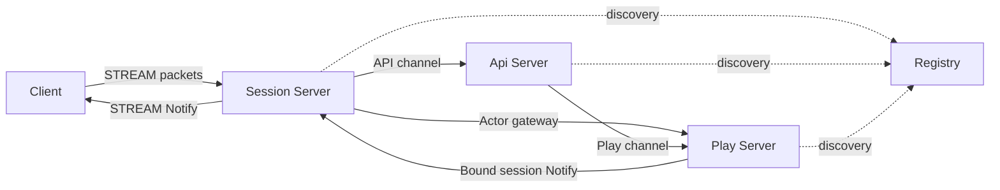
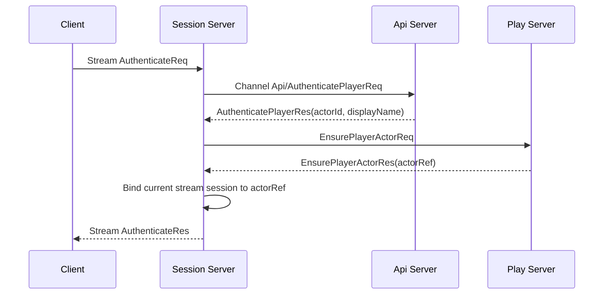
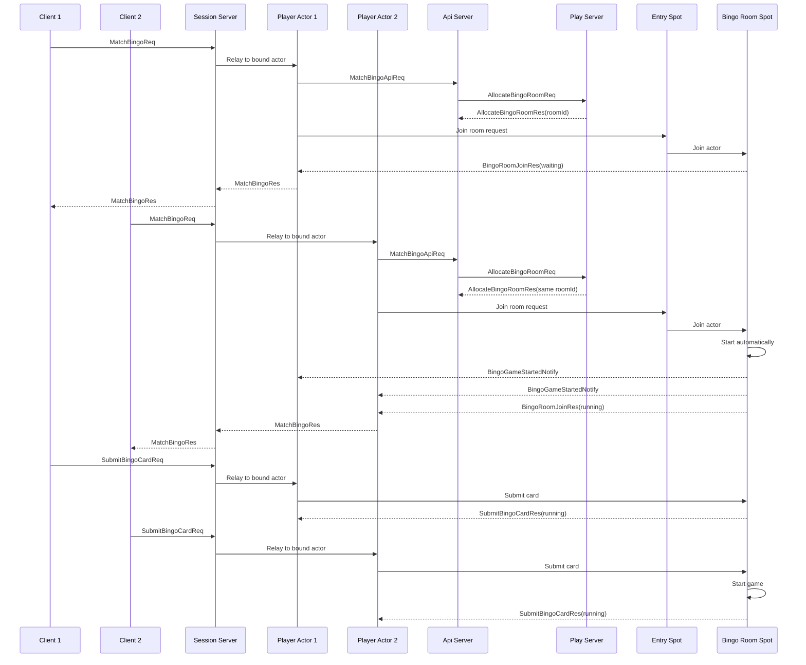
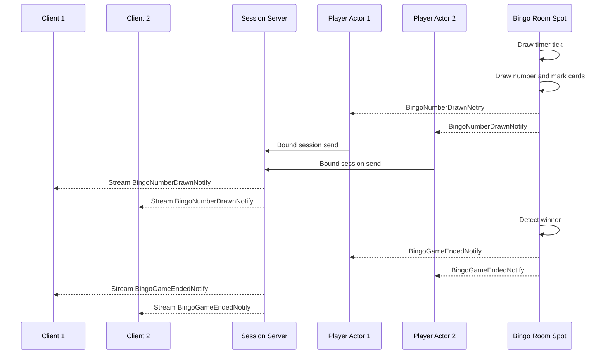

# Bingo Sample Scenario

[샘플 목록](../README.ko.md)

> 이 문서는 모든 framework 언어가 공유하는 Bingo 샘플 시나리오를 정의한다.
> 언어별 샘플은 이 문서를 기준으로 서버 역할, 메시지 흐름, smoke 검증 기준을 맞춘다.

## 1. 목적

Bingo 샘플은 client가 하나의 Session 서버 stream 연결만 유지해도 인증, 매칭,
게임 진행, server push를 모두 처리할 수 있음을 보여 준다. Session 서버는 client
연결과 actor binding을 맡고, Play 서버는 player actor와 room Spot을 소유한다.
API 서버는 인증과 매칭 요청을 처리하며, Registry는 서버 간 endpoint 발견을 맡는다.

이 샘플에서 확인해야 하는 핵심은 아래와 같다.

- client는 Session 서버 stream endpoint 하나만 알고 연결한다.
- Session 서버는 인증 후 현재 stream session을 Play 서버의 player actor에 bind한다.
- client packet은 bound actor로 relay된다.
- API 서버는 매칭 요청을 받고 Play 서버에 room 배정을 요청한다.
- Play 서버는 Entry Spot에서 room Spot으로 actor를 join시킨다.
- client는 자기 bingo card를 입력해 room Spot에 제출한다.
- room Spot은 제출된 카드, 번호 추첨, mark, 승리 판정을 소유한다.
- client가 draw 요청을 보내면 room Spot이 다음 번호를 뽑고, Play 서버는
  번호와 state를 bound session으로 Notify한다.
- Registry/Discovery를 사용해 서버 간 endpoint를 자동으로 발견하고 연결한다.
- handler는 interface 구현체를 framework에 명시 등록하는 방식을 사용한다.

## 2. 서버 구성



client가 직접 연결하는 서버는 Session 서버뿐이다. API 서버와 Play 서버는
client-facing stream endpoint를 열지 않는다. Session 서버는 인증과 session lifecycle을
소유하지만, 게임 규칙을 해석하지 않는다. 게임 packet은 현재 session에 bind된 actor로
전달되고, actor와 room Spot이 domain state를 처리한다.

## 3. 자동 연결 방식

Bingo는 Registry/Discovery 기반 자동 연결을 사용한다. 각 서버는 자신이 제공하는
channel, stream, Spot node endpoint를 Registry에 등록하고, 다른 서버는 service 이름으로
상대 endpoint를 찾는다.

| 연결 | 연결 방식 | 이유 |
|------|-----------|------|
| Session -> API channel | Discovery 자동 연결 | Session 서버가 API 서버 주소를 직접 들고 있지 않게 한다. |
| API -> Play channel | Discovery 자동 연결 | matching API가 현재 Play 서버 endpoint를 Registry에서 찾는다. |
| Session -> Play actor gateway | Registry 기반 actor locator | Session 서버가 Play 서버 actor의 위치를 직접 관리하지 않게 한다. |
| Play -> Session bound push | Registry 기반 session route | Play 서버가 현재 client session 위치를 framework route로 찾는다. |

이 샘플이 자동 연결을 쓰는 이유는 운영형 gateway 구조에서 서버 증설과 endpoint
변경을 application 코드 밖으로 밀어내는 흐름을 보여 주기 위해서다. 수동 endpoint
연결은 TicTacToe 샘플이 맡는다.

## 4. 프로세스와 책임

| 프로세스 | 구성 요소 | 책임 |
|----------|-----------|------|
| `Bingo.Registry` | registry host | Session, API, Play 서버 endpoint를 발견 가능하게 한다. |
| `Bingo.Api` | `Api` channel server | access token 인증과 matching API 요청을 처리한다. |
| `Bingo.Api` | `Play` channel client | Play 서버에 room 배정을 요청한다. |
| `Bingo.Session` | stream server | client 연결, 인증 packet, actor binding, actor relay를 처리한다. |
| `Bingo.Session` | session Spot node | ActorGateway attach와 bound session push 수신을 담당한다. |
| `Bingo.Play` | actor runtime | player actor를 만들고 Entry Spot에 join시킨다. |
| `Bingo.Play` | `BingoEntrySpot` | actor가 특정 room에 들어가기 전의 admission 지점을 맡는다. |
| `Bingo.Play` | `BingoRoomSpot` | room 참가자, 제출된 카드, draw deck, 승리 판정, Notify 생성을 소유한다. |
| `Bingo.Play` | `Play` channel server | API 서버의 room 배정 요청을 받는다. |

## 5. Handler 등록 방식

Bingo 샘플은 typed handler 계약을 명시 등록하는 방식을 사용한다. 각 handler는
framework가 정의한 handler 계약을 구현하고, 서버 구성 코드에서 scan 또는 명시
등록으로 framework에 알려진다.

이 방식의 목적은 아래와 같다.

- handler가 어떤 request/response 계약을 처리하는지 타입 선언으로 드러난다.
- Session, channel, Entry Spot, room Spot handler가 같은 등록 원칙을 공유한다.
- attribute, annotation, decorator가 없는 언어에서도 같은 구조를 옮기기 쉽다.

언어별 framework가 선언형 등록 기능을 제공하더라도 Bingo에서는 handler 계약을
구성 코드에서 명시 등록하는 방식을 우선 사용한다. `.NET`이나 Java처럼 interface를
자연스럽게 쓸 수 있는 언어는 interface로 표현하고, TypeScript처럼 runtime interface가
사라지는 언어는 handler class와 명시 등록으로 같은 의미를 표현한다. 선언형 등록
방식은 TicTacToe 샘플이 맡는다.

## 6. 게임 규칙

Bingo는 샘플 흐름을 짧게 유지하기 위해 2인 자동 시작 규칙을 사용한다.

| 항목 | 규칙 |
|------|------|
| 플레이어 수 | 정확히 2명 |
| 보드 | 3 x 3 |
| 번호 범위 | 1부터 15까지 |
| 가운데 칸 | free cell로 시작부터 mark 처리 |
| 카드 입력 | 각 client가 3 x 3 bingo card를 제출한다. |
| 시작 조건 | 두 번째 player가 join하면 room이 자동으로 시작한다. |
| 번호 추첨 | client가 draw 요청을 보내면 room Spot이 다음 번호를 하나 뽑는다. |
| mark 방식 | 서버 자동 mark. client는 card만 제출하고 mark나 bingo claim은 보내지 않는다. |
| 승리 조건 | complete line이 1개 이상 생기면 승리 |
| 종료 조건 | 첫 승리 draw sequence가 나오면 종료 |

방장, ready 버튼, 수동 mark, 여러 라운드, 랭킹은 공통 샘플 범위에서 제외한다.
이 기능들은 게임 샘플을 크게 만들지만 framework 흐름을 이해하는 데 꼭 필요하지 않다.

## 7. 메시지 계약

아래 계약은 언어 중립 schema다. 언어별 샘플은 같은 이름과 필드를 자기 언어의
record, class, struct, type alias 등으로 구현한다.

client stream 인증 메시지:

```text
AuthenticateReq {
  AccessToken: string
}

AuthenticateRes {
  ActorId: string
  DisplayName: string
}
```

API 인증과 actor 준비 메시지:

```text
AuthenticatePlayerReq {
  AccessToken: string
}

AuthenticatePlayerRes {
  Accepted: bool
  ActorId: string?
  DisplayName: string?
  Reason: string?
}

EnsurePlayerActorReq {
  ActorId: string
  DisplayName: string
}

ActorRefSnapshot {
  NodeRid: bytes
  ActorId: string
  Generation: uint64
}

EnsurePlayerActorRes {
  ActorId: string
  ActorType: string
  Actor: ActorRefSnapshot
}
```

matching과 room join 메시지:

```text
MatchBingoReq {
  Mode: string
}

MatchBingoRes {
  RoomId: string
  State: BingoRoomState
}

MatchBingoApiReq {
  ActorId: string
  DisplayName: string
  Mode: string
}

MatchBingoApiRes {
  RoomId: string
}

AllocateBingoRoomReq {
  Mode: string
  ActorId: string
}

AllocateBingoRoomRes {
  RoomId: string
}

BingoRoomJoinReq {
  RoomId: string
  ActorId: string
  DisplayName: string
}

BingoRoomJoinRes {
  State: BingoRoomState
}

SubmitBingoCardReq {
  RoomId: string
  Card: int[]
}

SubmitBingoCardRes {
  State: BingoRoomState
}
```

server push 메시지:

```text
PlayerJoinedNotify {
  RoomId: string
  ActorId: string
  DisplayName: string
  Seat: int
  IsHost: bool
  State: BingoRoomState
}

BingoGameStartedNotify {
  State: BingoRoomState
}

BingoNumberDrawnNotify {
  RoomId: string
  DrawSeq: int
  Number: int
  State: BingoRoomState
}

BingoGameEndedNotify {
  State: BingoRoomState
}
```

공통 state 모델:

```text
BingoRoomState {
  RoomId: string
  Status: string
  HostActorId: string
  CanStart: bool
  DrawSeq: int
  LastDrawnNumber: int?
  DrawnNumbers: int[]
  Players: BingoPlayerState[]
  Winners: string[]
}

BingoPlayerState {
  ActorId: string
  DisplayName: string
  Seat: int
  IsHost: bool
  Card: int[]
  Marks: bool[]
  CompletedLines: int
}
```

`HostActorId`, `CanStart`, `IsHost` 필드는 기존 언어별 구현과 호환을 위해 유지할 수
있다. 2인 자동 시작 공통 시나리오에서는 별도 시작 요청을 보내지 않으므로 client
검증 기준으로 사용하지 않는다.

## 8. 인증과 Actor Binding 흐름



Session 서버는 인증 성공 후 actor reference를 얻고 현재 stream session을 그 actor에
bind한다. 이후 client gameplay packet은 Session 서버가 직접 처리하지 않고 bound actor로
relay한다.

## 9. Matching과 카드 제출 흐름



첫 player가 들어오면 room은 대기 상태가 된다. 두 번째 player가 같은 room에 들어오면
room은 별도 `StartBingoGameReq` 없이 자동으로 `Running` 상태가 되고 양쪽 client에
`BingoGameStartedNotify`를 보낸다. client는 game start를 확인한 뒤 3 x 3 card를
제출한다. 두 client의 card가 모두 제출되면 room Spot이 draw timer를 시작하고,
일정 간격으로 번호를 뽑아 양쪽 client에 `BingoNumberDrawnNotify`를 보낸다.

## 10. Server Draw Timer와 Bound Push 흐름



room Spot은 제출된 card, draw deck, mark, winner 판정을 한 모듈 안에 숨긴다.
client는 자기 card를 제출한 뒤 번호 추첨을 요청하지 않는다. 어떤 번호가 나오는지,
card가 어떻게 mark되는지, 승자가 누구인지는 서버 timer가 보낸 Notify와 state로
확인한다.

## 11. 완료 기준

- client 두 개가 각각 Session 서버에 하나의 stream 연결만 연다.
- Session, API, Play 서버는 Registry/Discovery로 서로를 자동 발견한다.
- 두 client가 서로 다른 actor로 인증된다.
- Session 서버가 인증된 stream session을 Play 서버 actor에 bind한다.
- 첫 `MatchBingoReq`는 room을 만들고 waiting state를 반환한다.
- 두 번째 `MatchBingoReq`는 같은 room에 join하고 room을 자동 시작시킨다.
- 두 client는 game start를 확인한 뒤 `SubmitBingoCardReq`로 card를 제출한다.
- 두 card가 모두 제출되면 room Spot timer가 번호를 뽑고 각 player card mark를
  서버에서 갱신한다.
- 승자가 나오면 room state가 `Finished`가 되고 `Winners`가 채워진다.
- `BingoNumberDrawnNotify`와 `BingoGameEndedNotify`가 bound session을 통해 두 client에 전달된다.
- client는 API 서버나 Play 서버 endpoint를 직접 사용하지 않는다.
- handler 등록은 typed handler 계약을 구성 코드에서 명시 등록하는 방식을 사용한다.
