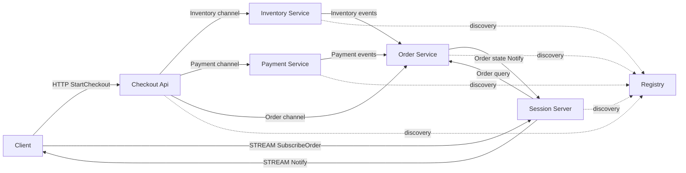
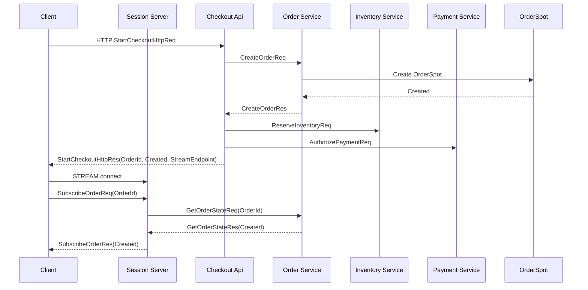
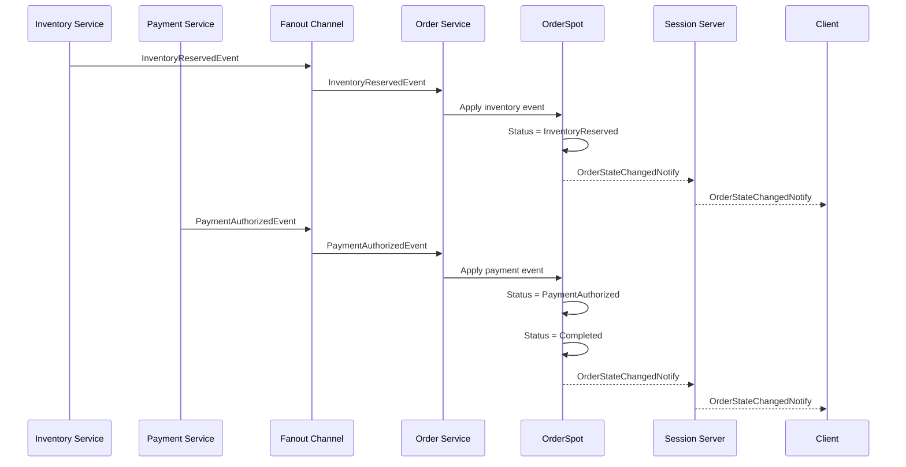
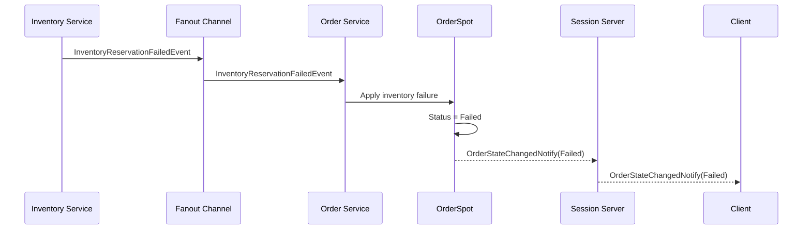

# CheckoutFlow Sample Scenario

[샘플 목록](../README.ko.md)

## 1. 목적

CheckoutFlow는 일반 웹서비스 backend에서 gRPC, load balancer, event broker, WebSocket
gateway로 나누어 구현하던 내부 service call, microservice event 전파, workflow 상태,
client notify를 ZLink channel, Registry/Discovery, fanout, Spot, STREAM으로 한 흐름에
묶어 보여 주는 샘플이다.

이 샘플에서 확인해야 하는 핵심은 아래와 같다.

- client는 Checkout API HTTP endpoint로 checkout을 시작하고, Session stream endpoint로 주문 상태 notify를 받는다.
- API 서버는 Inventory, Payment, Order 서버의 물리 endpoint를 직접 알지 않는다.
- 내부 command/query는 ZLink channel request/response로 처리한다.
- microservice domain event는 ZLink fanout publish/subscribe로 전파한다.
- 주문 단위 long-running state는 `OrderSpot`이 소유한다.
- `OrderSpot`은 inventory/payment event를 받아 상태를 전이한다.
- client는 polling 대신 stream notify로 주문 상태 변경을 받는다.
- Registry/Discovery를 사용해 API, Inventory, Payment, Order 서버가 endpoint를 자동으로 찾는다.

이 샘플은 게임이나 채팅이 아니라 일반 backend service orchestration을 보여 준다.
목표는 "gRPC를 금지한다"가 아니라, 여러 내부 서비스 호출과 event 전파를 framework의
기본 통신 모델로 더 적은 배선 코드로 표현할 수 있음을 보여 주는 것이다.

## 2. 기존 구조와 ZLink 구조 비교

기존 웹서비스에서 흔히 쓰는 구조는 아래와 같다.

```text
Web API
  -> gRPC client + LB -> Inventory service
  -> gRPC client + LB -> Payment service
  -> event broker topic
  -> workflow worker
  -> order state store
  -> WebSocket gateway
  -> Client notify
```

CheckoutFlow가 보여 줄 ZLink 구조는 아래와 같다.

```text
Checkout API
  -> ZLink channel + discovery -> Inventory service
  -> ZLink channel + discovery -> Payment service
  -> ZLink fanout event -> Order service
  -> OrderSpot owns order state
  -> STREAM notify -> Client
```

비교의 핵심은 service call, event 전파, workflow state, client push를 따로따로
직접 배선하지 않고 ZLink framework 구성 요소로 같은 흐름 안에서 표현한다는 점이다.

## 3. 서버 구성



client는 checkout 시작 요청을 Checkout API HTTP endpoint로 보낸다. 이후 같은
`OrderId`를 사용해 Session 서버 stream endpoint에 주문 상태 notify를 구독한다.
Inventory, Payment, Order 서버는 client-facing endpoint를 열지 않는다. Session 서버는
client 상태 notify 연결을 맡고, 주문 상태는 Order 서버의 `OrderSpot`이 소유한다.

## 4. 통신 역할 분리

CheckoutFlow는 command/query, event, workflow state, client notify를 분리한다.

| 구분 | ZLink 기능 | 예시 |
|------|------------|------|
| 외부 API 진입 | HTTP endpoint | `StartCheckoutHttpReq`, `StartCheckoutHttpRes` |
| command/query | channel request/response | `ReserveInventoryReq`, `AuthorizePaymentReq`, `CreateOrderReq` |
| domain event | fanout publish/subscribe | `InventoryReservedEvent`, `PaymentAuthorizedEvent` |
| workflow state | Spot | `OrderSpot` |
| client update | STREAM subscribe와 notify | `SubscribeOrderReq`, `OrderStateChangedNotify` |
| endpoint discovery | Registry/Discovery | API -> Inventory/Payment/Order 자동 연결 |

API 서버는 workflow 상태를 들고 있지 않는다. API 서버는 checkout 시작 요청을 받아 필요한
command를 보내고, Order 서버에 주문 Spot 생성을 요청한다. 이후 상태 전이는 event를
받은 `OrderSpot`이 수행한다.

## 5. 프로세스와 책임

| 프로세스 | 구성 요소 | 책임 |
|----------|-----------|------|
| `CheckoutFlow.Registry` | registry host | API, Inventory, Payment, Order, Session endpoint를 발견 가능하게 한다. |
| `CheckoutFlow.Session` | stream server | client 연결, order subscribe, order state notify 전달을 맡는다. |
| `CheckoutFlow.Api` | HTTP endpoint | client checkout 시작 요청을 처리한다. |
| `CheckoutFlow.Api` | service channel clients | Inventory, Payment, Order 서버에 command request를 보낸다. |
| `CheckoutFlow.Inventory` | `Inventory` channel server | 재고 예약 command를 처리한다. |
| `CheckoutFlow.Inventory` | fanout publisher | 재고 예약 성공/실패 event를 publish한다. |
| `CheckoutFlow.Payment` | `Payment` channel server | 결제 승인 command를 처리한다. |
| `CheckoutFlow.Payment` | fanout publisher | 결제 승인 성공/실패 event를 publish한다. |
| `CheckoutFlow.Order` | `Order` channel server | 주문 Spot 생성과 조회 request를 처리한다. |
| `CheckoutFlow.Order` | fanout subscriber | inventory/payment event를 구독한다. |
| `CheckoutFlow.Order` | `OrderSpot` | 주문 상태 전이, event correlation, client notify 생성을 소유한다. |

## 6. Order 서버 디렉토리 구조

Order 서버는 domain logic과 framework adapter를 분리한다. 샘플로 구현할 때는
아래 책임 분리를 유지한다.

```text
Server/Order/
  Domain/
    CheckoutFlow/
      OrderWorkflow
      OrderState
      OrderLine
      OrderEvents
      OrderPolicy
  Application/
    OrderWorkflow/
      OrderWorkflowService
      OrderEventDispatcher
      OrderSubscriptionDirectory
  Adapters/
    ZLink/
      Handlers/
        CreateOrderHandler
        GetOrderStateHandler
      Events/
        InventoryEventSubscriber
        PaymentEventSubscriber
        OrderEventMapper
      Notifications/
        OrderNotificationPublisher
      Spots/
        OrderSpot
        Handlers/
          ApplyInventoryEventHandler
          ApplyPaymentEventHandler
          GetOrderStateSpotHandler
          OrderTimeoutTimerHandler
```

역할은 아래처럼 나눈다.

| 위치 | 책임 |
|------|------|
| `Domain/CheckoutFlow/OrderWorkflow` | 주문 상태 전이, 실패 사유, 완료 조건을 소유한다. |
| `Domain/CheckoutFlow/OrderEvents` | inventory/payment/order event를 정의한다. |
| `Domain/CheckoutFlow/OrderPolicy` | timeout, 실패 처리, 중복 event 처리 규칙을 소유한다. |
| `Application/OrderWorkflow/OrderWorkflowService` | 주문 Spot 생성, 조회, event 적용 use case를 제공한다. |
| `Application/OrderWorkflow/OrderSubscriptionDirectory` | `OrderId`별 client session 또는 notify target을 관리한다. |
| `Adapters/ZLink/Events/*` | fanout event를 받아 Order use case로 연결한다. |
| `Adapters/ZLink/Spots/OrderSpot` | ZLink Spot lifecycle, domain 호출, timer 등록, notification publish 연결을 맡는다. |
| `Adapters/ZLink/Notifications/*` | order state change event를 client notify message로 바꾸고 전송한다. |
| `Adapters/ZLink/Handlers/*` | channel request를 application use case로 연결한다. |

Domain 객체는 ZLink framework 타입을 직접 참조하지 않는다. `OrderSpot`은 framework
callback을 받아 domain method를 호출하고, domain이 반환한 state change를 adapter가
message로 바꾼다. inventory/payment event 중복 처리, timeout, 실패 상태 전이가 handler나
event subscriber에 흩어지면 안 된다.

## 7. Handler와 Event 등록 방식

CheckoutFlow는 typed handler와 fanout event subscriber를 함께 사용한다.

- channel handler는 service command request/response를 처리한다.
- fanout publisher는 service domain event를 publish한다.
- fanout subscriber는 event를 받아 `OrderSpot`에 route한다.
- `OrderSpot` handler는 order state 조회나 event 적용 request를 처리한다.
- notification publisher는 order state change를 client stream notify로 보낸다.

언어별 framework가 선언형 등록을 제공하더라도 CheckoutFlow에서는 handler가 어떤
경계를 처리하는지 보이도록 typed handler 또는 명시 등록을 우선 사용한다. event 이름은
문자열을 호출 지점에 흩어 놓지 않고 shared contract 위치에 둔다.

## 8. 도메인 규칙

CheckoutFlow는 샘플 흐름을 짧게 유지하기 위해 단일 주문, 단일 재고 예약, 단일 결제
승인 규칙을 사용한다.

| 항목 | 규칙 |
|------|------|
| checkout 시작 | client가 checkout 시작 요청을 보내면 API 서버가 `OrderId`를 발급한다. |
| order id | `OrderId`는 client와 server가 함께 쓰는 명시적인 식별자다. Spot routing id는 `OrderId` 문자열에서 만든다. |
| command 처리 | API 서버는 Inventory, Payment, Order 서버에 channel request를 보낸다. |
| event 전파 | Inventory와 Payment 서버는 command 처리 결과를 fanout event로 publish한다. |
| 상태 소유 | `OrderSpot`만 주문 상태를 전이한다. API 서버와 service 서버는 workflow state를 들고 있지 않는다. |
| event correlation | 모든 command response와 event는 `OrderId`를 포함한다. |
| 중복 event | 같은 event id가 두 번 도착하면 `OrderSpot`은 두 번째 event를 무시한다. |
| timeout | 일정 시간 안에 필요한 event가 모두 오지 않으면 `Failed`로 전이한다. |

재고 수량 관리, 결제 취소, 배송 생성, 쿠폰, 부분 실패 보상 transaction은 공통 샘플
범위에서 제외한다. 이 기능들은 실제 서비스에는 중요하지만 framework 핵심 흐름을
보여 주기에는 샘플을 크게 만든다.

## 9. 메시지 계약

아래 schema는 공통 샘플 계약이다. 각 언어 구현은 같은 필드와 같은 의미를 유지한다.

client HTTP 메시지:

```text
StartCheckoutHttpReq {
  Sku: string
  Quantity: int
  PaymentToken: string
}

StartCheckoutHttpRes {
  OrderId: string
  Status: string
  StreamEndpoint: string
}
```

client stream 메시지:

```text
SubscribeOrderReq {
  OrderId: string
}

SubscribeOrderRes {
  State: OrderState
}

GetOrderStateReq {
  OrderId: string
}

GetOrderStateRes {
  State: OrderState
}
```

service command 메시지:

```text
CreateOrderReq {
  OrderId: string
  Sku: string
  Quantity: int
}

CreateOrderRes {
  OrderId: string
  Status: string
}

ReserveInventoryReq {
  OrderId: string
  Sku: string
  Quantity: int
}

ReserveInventoryRes {
  OrderId: string
  Accepted: bool
  ReservationId: string?
  Reason: string?
}

AuthorizePaymentReq {
  OrderId: string
  PaymentToken: string
  Amount: decimal
}

AuthorizePaymentRes {
  OrderId: string
  Accepted: bool
  PaymentId: string?
  Reason: string?
}
```

fanout event 메시지:

```text
InventoryReservedEvent {
  EventId: string
  OrderId: string
  ReservationId: string
}

InventoryReservationFailedEvent {
  EventId: string
  OrderId: string
  Reason: string
}

PaymentAuthorizedEvent {
  EventId: string
  OrderId: string
  PaymentId: string
}

PaymentFailedEvent {
  EventId: string
  OrderId: string
  Reason: string
}
```

client notify 메시지:

```text
OrderStateChangedNotify {
  OrderId: string
  State: OrderState
}
```

상태 모델:

```text
OrderState {
  OrderId: string
  Status: string
  ReservationId: string?
  PaymentId: string?
  Reason: string?
  UpdatedAtUnixMs: int64
}
```

`Status` 값은 `Created`, `InventoryReserved`, `PaymentAuthorized`, `Completed`,
`Failed`를 사용한다. 언어별 샘플에서 enum으로 표현할 수 있지만 wire field 값은 위
문자열을 유지한다.

`OrderId`는 도메인 식별자이며 core routing id 문자열이 아니다. Order 서버가 `OrderSpot`을
만들 때 각 언어의 routing id 생성 API로 `OrderId` 문자열에서 Spot routing id를 만든다.
client DTO에는 routing id hex 문자열을 노출하지 않는다.

상태 전이는 아래처럼 고정한다.

| 현재 상태 | 입력 | 다음 상태 |
|-----------|------|-----------|
| 없음 | `CreateOrderReq` | `Created` |
| `Created` | `InventoryReservedEvent` | `InventoryReserved` |
| `Created` | `InventoryReservationFailedEvent` | `Failed` |
| `InventoryReserved` | `PaymentAuthorizedEvent` | `PaymentAuthorized` |
| `InventoryReserved` | `PaymentFailedEvent` | `Failed` |
| `PaymentAuthorized` | completion check | `Completed` |
| `Created`, `InventoryReserved` | workflow timeout | `Failed` |
| `Completed`, `Failed` | 추가 inventory/payment event | 상태 유지 |

workflow timeout은 샘플 실행 시간을 줄이기 위해 기본 5초로 둔다. 언어별 샘플이
설정값을 바꾸더라도 smoke test에서는 같은 의미를 검증해야 한다.

잘못된 요청은 정상 response payload 대신 오류 response를 반환한다. 아래 경우는 반드시
오류로 검증한다.

- `OrderId`가 비어 있는 command를 보낸 경우
- 존재하지 않는 `OrderId`로 `GetOrderStateReq`를 보낸 경우
- terminal 상태인 `Completed` 또는 `Failed` 주문에 새 command를 적용하려 한 경우

## 10. Checkout 시작 흐름



API 서버는 command를 시작하지만 workflow 상태를 소유하지 않는다. `OrderSpot`이 만들어진
뒤 client는 `OrderId`를 받고, 이후 상태 변화는 event와 notify로 확인한다.

## 11. Microservice Event 전파 흐름



Inventory와 Payment 서버는 서로를 직접 호출하지 않는다. 각 서비스는 자기 command 처리
결과를 fanout event로 publish한다. Order 서버는 event를 구독하고, `OrderId`로 해당
`OrderSpot`에 event를 적용한다.

## 12. 실패 Event 흐름



실패도 event로 전파된다. 실패 상태로 들어간 주문은 terminal 상태가 되며, 이후 도착한
payment success event나 중복 inventory event는 상태를 되돌리지 않는다.

## 13. Client 시나리오 작성 기준

client 샘플을 작성할 때는 서버 기능을 숨기는 helper 중심 구조를 피한다. 실행 진입부에서
client를 만들고, 시나리오 함수에서는 아래 순서가 그대로 읽히는 구조를 따른다.

```text
1. StartCheckoutHttpReq / StartCheckoutHttpRes 검증
2. StreamEndpoint와 OrderId가 비어 있지 않은지 검증
3. Session stream connect
4. SubscribeOrderReq / SubscribeOrderRes 검증
5. waits OrderStateChangedNotify(InventoryReserved)
6. waits OrderStateChangedNotify(PaymentAuthorized or Completed)
7. waits OrderStateChangedNotify(Completed)
8. GetOrderStateReq / GetOrderStateRes로 final state 검증
9. failure scenario에서 InventoryReservationFailedEvent를 유도
10. waits OrderStateChangedNotify(Failed)
11. terminal state 이후 잘못된 command가 오류 response를 반환하는지 검증
```

응답 검증은 마지막에 모아서 하지 않고 request 직후에 수행한다. notify는 순서가 명확한
경우 바로 기다리고, event 도착 순서가 service 실행 타이밍에 따라 달라질 수 있는 경우에는
받아야 하는 status 집합을 먼저 정하고 waiter를 함께 기다린다.

client는 외부 API 진입점인 Checkout API HTTP endpoint와 상태 push용 Session stream
endpoint만 사용한다. Inventory, Payment, Order 서버 endpoint를 client 코드에서 직접
사용하면 이 샘플의 핵심인 service discovery와 workflow state owner 구조가 흐려진다.

## 14. 구현 완료 기준

아래 항목은 언어별 샘플 구현과 smoke test로 확인해야 하는 기준이다.

- client는 Checkout API HTTP endpoint로 checkout을 시작하고 Session 서버 stream endpoint로 상태를 구독한다.
- API, Inventory, Payment, Order, Session 서버는 Registry/Discovery로 서로를 자동 발견한다.
- API 서버는 Inventory/Payment/Order 서버의 물리 endpoint를 직접 알지 않는다.
- Inventory와 Payment command는 channel request/response로 처리된다.
- Inventory와 Payment 결과는 fanout event로 publish된다.
- Order 서버는 fanout event를 subscribe하고 `OrderSpot`에 route한다.
- `OrderSpot`만 주문 상태를 전이한다.
- `OrderId`는 명시적인 domain id이며 routing id hex 문자열을 client에 노출하지 않는다.
- success scenario는 `Created`, `InventoryReserved`, `PaymentAuthorized`, `Completed` 흐름을 검증한다.
- failure scenario는 inventory 또는 payment 실패 event가 `Failed` 상태로 전이되는지 검증한다.
- 중복 event는 두 번째 적용 시 상태를 바꾸지 않는다.
- workflow timeout은 `Failed` 상태로 전이된다.
- client는 `OrderStateChangedNotify`로 상태 변화를 받는다.
- Domain / Application / Adapters 책임 분리가 유지된다.
