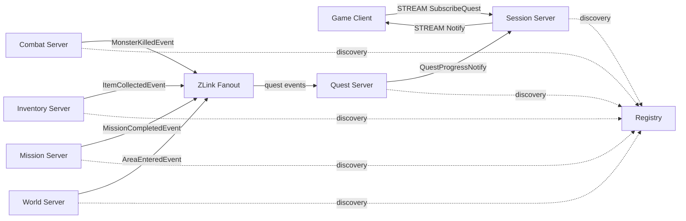
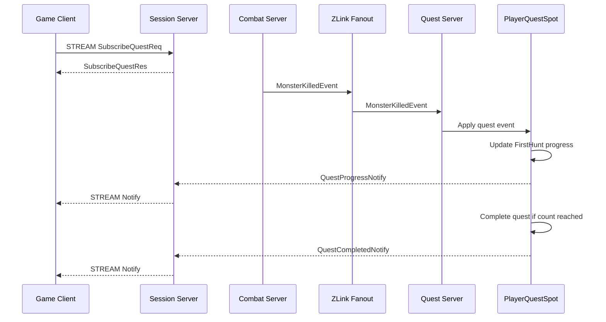
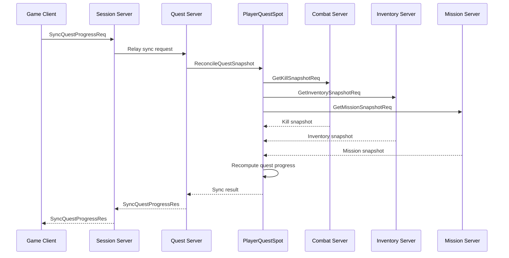

# GameQuest Sample Scenario

[Event 샘플 목록](./README.ko.md)

## 1. 목적

GameQuest는 ZLink fanout이 자연스럽게 쓰이는 gameplay event 샘플이다. combat, inventory,
mission, world, feature unlock 같은 여러 subsystem에서 발생한 event를 Quest 서버가
구독하고, `PlayerQuestSpot`이 quest 진행과 완료 여부를 갱신한다.

quest event는 유실되면 안 되는 성격을 가질 수 있다. 이 샘플은 durable broker 대신
간단한 저장과 재동기화로 보정하는 구조를 보여 준다. 즉 realtime event propagation은
ZLink fanout으로 처리하고, 영속성이 필요한 진행 상태는 Quest state store와 subsystem
snapshot 조회로 보완한다.

이 샘플에서 확인해야 하는 핵심은 아래와 같다.

- Combat, Inventory, Mission, World 서버는 자기 domain event를 ZLink fanout으로 publish한다.
- Quest 서버는 여러 event type을 구독하고 player별 `PlayerQuestSpot`에 route한다.
- `PlayerQuestSpot`은 quest 조건 평가, progress update, completion 판정을 소유한다.
- Quest 진행 상태는 저장소에 기록한다.
- event 누락 가능성은 snapshot 재동기화로 보정한다.
- client는 Session stream으로 quest progress notify를 받는다.

## 2. 서버 구성



다이어그램의 subsystem event 화살표는 ZLink fanout publish/subscribe를 뜻한다. Quest
서버는 event publisher들의 물리 endpoint를 직접 알지 않는다.

## 3. 책임 분리

| 구분 | 담당 | 책임 |
|------|------|------|
| gameplay event 전파 | ZLink fanout | 여러 subsystem event를 Quest 서버로 전파한다. |
| quest state owner | `PlayerQuestSpot` | player별 quest progress와 완료 판정을 소유한다. |
| progress 저장 | Quest state store | 완료된 step, count, reward 지급 여부를 저장한다. |
| 보정 조회 | subsystem snapshot query | kill count, inventory, mission state를 다시 조회한다. |
| client push | Session stream | quest progress notify를 client에게 보낸다. |
| endpoint discovery | Registry/Discovery | Quest 서버가 subsystem endpoint를 직접 들고 있지 않게 한다. |

ZLink fanout은 "여러 영역에서 발생한 event를 Quest 시스템으로 빠르게 모으는 경로"다.
Quest 진행의 최종 기준은 `PlayerQuestSpot`과 Quest state store이며, 필요한 경우 subsystem
snapshot으로 다시 계산한다.

## 4. Quest 서버 디렉토리 구조

```text
Server/Quest/
  Domain/
    GameQuest/
      QuestDefinition
      QuestCondition
      QuestProgress
      QuestEvents
      QuestPolicy
  Application/
    QuestProgress/
      QuestProgressService
      QuestSnapshotReconciler
      QuestStateStore
  Adapters/
    ZLink/
      Events/
        CombatEventSubscriber
        InventoryEventSubscriber
        MissionEventSubscriber
        WorldEventSubscriber
        QuestEventMapper
      Handlers/
        GetQuestProgressHandler
        SyncQuestProgressHandler
      Notifications/
        QuestNotificationPublisher
      Spots/
        PlayerQuestSpot
        Handlers/
          ApplyQuestEventHandler
          ReconcileQuestSnapshotHandler
          GetQuestProgressSpotHandler
```

`Domain`은 framework 타입을 참조하지 않는다. event subscriber는 외부 event를 domain
event로 변환하고, `PlayerQuestSpot`은 domain method를 호출해 progress를 갱신한다.

## 5. Quest 조건 예시

| Quest | 조건 | 입력 event |
|-------|------|------------|
| `FirstHunt` | monster 3마리 처치 | `MonsterKilledEvent` |
| `GatherHerbs` | herb item 5개 획득 | `ItemCollectedEvent` |
| `ClearTutorial` | tutorial mission 완료 | `MissionCompletedEvent` |
| `OpenAuction` | auction 기능 unlock | `FeatureUnlockedEvent` |
| `VisitRuins` | ruins area 진입 | `AreaEnteredEvent` |

quest 조건은 여러 subsystem event를 동시에 사용할 수 있다. 예를 들어 `ExploreAndHunt`는
특정 area에 들어간 뒤 해당 area의 monster를 처치해야 완료될 수 있다.

## 6. 메시지 계약

fanout event 메시지:

```text
MonsterKilledEvent {
  EventId: string
  PlayerId: string
  MonsterId: string
  AreaId: string
  KilledAtUnixMs: int64
}

ItemCollectedEvent {
  EventId: string
  PlayerId: string
  ItemId: string
  Count: int
  CollectedAtUnixMs: int64
}

MissionCompletedEvent {
  EventId: string
  PlayerId: string
  MissionId: string
  CompletedAtUnixMs: int64
}

FeatureUnlockedEvent {
  EventId: string
  PlayerId: string
  FeatureId: string
  UnlockedAtUnixMs: int64
}

AreaEnteredEvent {
  EventId: string
  PlayerId: string
  AreaId: string
  EnteredAtUnixMs: int64
}
```

client stream 메시지:

```text
SubscribeQuestReq {
  PlayerId: string
}

SubscribeQuestRes {
  ActiveQuests: QuestProgress[]
}

GetQuestProgressReq {
  PlayerId: string
}

GetQuestProgressRes {
  ActiveQuests: QuestProgress[]
}

SyncQuestProgressReq {
  PlayerId: string
}

SyncQuestProgressRes {
  UpdatedQuests: QuestProgress[]
}
```

server push 메시지:

```text
QuestProgressNotify {
  PlayerId: string
  Progress: QuestProgress
}

QuestCompletedNotify {
  PlayerId: string
  Progress: QuestProgress
  RewardGranted: bool
}
```

상태 모델:

```text
QuestProgress {
  PlayerId: string
  QuestId: string
  Status: string
  CurrentCount: int
  RequiredCount: int
  LastEventId: string?
  UpdatedAtUnixMs: int64
}
```

`Status` 값은 `Active`, `Completed`, `RewardGranted`를 사용한다.

## 7. Realtime Quest Event 흐름



Combat 서버는 Quest 서버를 직접 호출하지 않는다. Combat 서버는 domain event를 publish하고,
Quest 서버는 관심 있는 event를 구독한다. `PlayerQuestSpot`이 quest definition과 현재
progress를 기준으로 완료 여부를 판단한다.

## 8. Snapshot 보정 흐름



event가 누락되었거나 client가 오래 disconnect된 경우에도 quest 진행은 snapshot으로 보정할
수 있어야 한다. snapshot 조회는 realtime fanout을 대체하는 기준 경로가 아니라 보정 경로다.

## 9. 중복과 보정 규칙

- 모든 event는 `EventId`를 가진다.
- `PlayerQuestSpot`은 처리한 `EventId`를 기록하고 중복 event를 무시한다.
- quest progress와 reward 지급 여부는 Quest state store에 저장한다.
- event가 누락되면 `SyncQuestProgressReq` 또는 주기적 reconcile로 subsystem snapshot을 조회한다.
- snapshot 결과가 현재 progress보다 앞서 있으면 progress를 보정하고 notify를 보낸다.
- snapshot은 현재 inventory 같은 순간 상태만 뜻하지 않는다. monster kill count, mission completion,
  feature unlock history처럼 quest 조건을 재계산할 수 있는 누적 fact를 subsystem이 제공해야 한다.
- reward 지급은 idempotent해야 한다. 같은 quest completion이 두 번 처리되어도 reward는 한 번만 지급한다.

## 10. Client 시나리오 작성 기준

```text
1. SubscribeQuestReq / SubscribeQuestRes 검증
2. Combat 서버가 MonsterKilledEvent publish
3. waits QuestProgressNotify(CurrentCount = 1)
4. 여러 MonsterKilledEvent 후 waits QuestCompletedNotify(FirstHunt)
5. Inventory 서버가 ItemCollectedEvent publish
6. waits QuestProgressNotify(GatherHerbs)
7. 같은 EventId를 다시 publish해 progress가 중복 증가하지 않는지 검증
8. event 누락 상황을 만든 뒤 SyncQuestProgressReq / SyncQuestProgressRes 검증
9. snapshot 보정 뒤 QuestProgressNotify 또는 QuestCompletedNotify 수신 검증
```

## 11. 구현 완료 기준

- Combat, Inventory, Mission, World 서버는 Quest 서버를 직접 호출하지 않고 ZLink fanout으로 event를 publish한다.
- Quest 서버는 여러 event type을 구독하고 player별 `PlayerQuestSpot`에 route한다.
- `PlayerQuestSpot`만 quest progress를 변경한다.
- quest progress와 reward 지급 여부는 저장소에 남긴다.
- duplicate event는 progress를 중복 증가시키지 않는다.
- snapshot 보정은 누락된 progress를 복구한다.
- client는 stream notify로 progress와 completion을 받는다.
- `PlayerId`, `QuestId`, `EventId`는 명시적인 domain id이며 routing id hex 문자열을 client에 노출하지 않는다.
