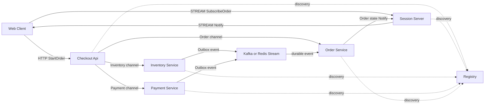
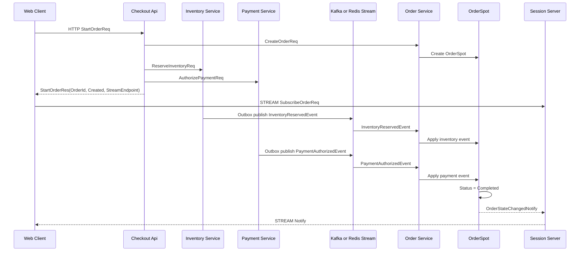

# ShoppingMallCheckout Sample Scenario

[Event 샘플 목록](./README.ko.md)

## 1. 목적

ShoppingMallCheckout은 주문, 재고, 결제처럼 event 유실을 허용할 수 없는 웹서비스에서
ZLink를 어떻게 함께 사용하는지 보여 주는 샘플이다. 주문 workflow event의 기준 경로는
Redis Stream 또는 Kafka가 맡는다. ZLink는 내부 service command/query, Registry/Discovery,
`OrderSpot` 상태 소유, stream notify를 맡는다.

이 샘플에서 확인해야 하는 핵심은 아래와 같다.

- web client는 Checkout API HTTP endpoint로 주문을 시작한다.
- web client는 Session 서버 stream endpoint로 주문 상태 notify를 구독한다.
- API 서버는 Inventory, Payment, Order 서버의 물리 endpoint를 직접 알지 않는다.
- 내부 command/query는 ZLink channel request/response로 처리한다.
- 재고 예약, 결제 승인, 주문 완료 event는 Outbox를 거쳐 Redis Stream 또는 Kafka로 전파한다.
- Order 서버 consumer는 durable event를 읽고 `OrderSpot`에 적용한다.
- `OrderSpot`은 event idempotency, terminal state, timeout을 처리한다.
- 주문 상태는 durable state store에 저장하고, client는 reconnect 뒤 상태를 다시 조회할 수 있다.

## 2. 서버 구성



client-facing endpoint는 Checkout API와 Session stream뿐이다. Inventory, Payment,
Order 서버는 내부 service endpoint만 가진다. Redis Stream 또는 Kafka는 주문 상태를 바꾸는
domain event의 기준 경로이며, ZLink fanout으로 같은 event를 중복 전파하지 않는다.

## 3. 책임 분리

| 구분 | 담당 | 책임 |
|------|------|------|
| 외부 API 진입 | Checkout API HTTP | 주문 시작 요청을 받고 `OrderId`를 발급한다. |
| 내부 service call | ZLink channel | Inventory, Payment, Order command를 호출한다. |
| endpoint discovery | ZLink Registry/Discovery | service endpoint를 자동 발견한다. |
| durable event 전파 | Redis Stream 또는 Kafka | 재고 예약, 결제 승인, 실패 event를 저장하고 전파한다. |
| workflow state owner | `OrderSpot` | 주문 상태 전이, 중복 event 무시, timeout 처리를 맡는다. |
| client push | Session stream | 주문 상태 변경 notify를 web client에게 보낸다. |
| 복구 조회 | Order state store | reconnect 뒤 현재 주문 상태를 다시 조회한다. |

ZLink는 durable event broker를 대체하지 않는다. durable log, replay, consumer offset이
필요한 event는 Redis Stream 또는 Kafka를 기준 경로로 둔다. ZLink는 그 주변의 service
호출, 상태 소유, client push를 단순하게 연결하는 역할을 맡는다.

## 4. Order 서버 디렉토리 구조

```text
Server/Order/
  Domain/
    ShoppingMallCheckout/
      OrderWorkflow
      OrderState
      OrderEvents
      OrderPolicy
  Application/
    OrderWorkflow/
      OrderWorkflowService
      OrderEventDispatcher
      OrderStateStore
  Adapters/
    ZLink/
      Handlers/
        CreateOrderHandler
        GetOrderStateHandler
      Notifications/
        OrderNotificationPublisher
      Spots/
        OrderSpot
        Handlers/
          ApplyOrderEventHandler
          GetOrderStateSpotHandler
          OrderTimeoutTimerHandler
    DurableEvents/
      OrderEventConsumer
      OrderEventMapper
```

`Domain`은 ZLink framework 타입, Redis, Kafka, DB client를 직접 참조하지 않는다.
`OrderSpot`은 framework lifecycle과 domain 호출을 연결하고, durable event consumer는
Redis/Kafka record를 domain event로 변환해 application use case로 전달한다.

## 5. 메시지 계약

client HTTP 메시지:

```text
StartOrderReq {
  Sku: string
  Quantity: int
  PaymentToken: string
}

StartOrderRes {
  OrderId: string
  Status: string
  StreamEndpoint: string
}
```

client stream 메시지:

```text
SubscribeOrderReq {
  OrderId: string
}

SubscribeOrderRes {
  State: OrderState
}

GetOrderStateReq {
  OrderId: string
}

GetOrderStateRes {
  State: OrderState
}
```

service command 메시지:

```text
CreateOrderReq {
  OrderId: string
  Sku: string
  Quantity: int
}

CreateOrderRes {
  OrderId: string
  Status: string
}

ReserveInventoryReq {
  OrderId: string
  Sku: string
  Quantity: int
}

ReserveInventoryRes {
  OrderId: string
  Accepted: bool
  Reason: string?
}

AuthorizePaymentReq {
  OrderId: string
  PaymentToken: string
}

AuthorizePaymentRes {
  OrderId: string
  Accepted: bool
  Reason: string?
}
```

durable event 메시지:

```text
InventoryReservedEvent {
  EventId: string
  OrderId: string
  ReservationId: string
}

InventoryReservationFailedEvent {
  EventId: string
  OrderId: string
  Reason: string
}

PaymentAuthorizedEvent {
  EventId: string
  OrderId: string
  PaymentId: string
}

PaymentFailedEvent {
  EventId: string
  OrderId: string
  Reason: string
}
```

server push 메시지:

```text
OrderStateChangedNotify {
  OrderId: string
  State: OrderState
}
```

상태 모델:

```text
OrderState {
  OrderId: string
  Status: string
  ReservationId: string?
  PaymentId: string?
  Reason: string?
  UpdatedAtUnixMs: int64
}
```

`Status` 값은 `Created`, `InventoryReserved`, `PaymentAuthorized`, `Completed`,
`Failed`를 사용한다.

## 6. Durable Event 흐름



Inventory와 Payment 서버는 자기 DB transaction 안에서 상태 변경과 Outbox event 기록을
함께 처리한다. publisher는 Outbox event를 Redis Stream 또는 Kafka로 보낸다. Order 서버는
consumer로 event를 읽고 `OrderSpot`에 적용한다.

## 7. 보정과 중복 처리

- `OrderSpot`은 `EventId`를 기록해 같은 event가 두 번 도착하면 두 번째 event를 무시한다.
- durable event는 재시도와 partition 처리 때문에 중복되거나 예상과 다른 순서로 도착할 수 있다.
- `OrderSpot`은 `InventoryReservedEvent`와 `PaymentAuthorizedEvent`가 모두 적용된 뒤에만 `Completed`로 전이한다.
- `Completed` 또는 `Failed` 상태의 주문은 terminal 상태이며, 이후 event가 상태를 되돌리지 않는다.
- Order 서버는 상태 전이 후 `OrderState`를 durable state store에 저장한다.
- client stream notify가 유실되면 reconnect 뒤 `GetOrderStateReq`로 현재 상태를 다시 조회한다.
- ZLink fanout은 주문 상태를 바꾸는 기준 event 경로로 사용하지 않는다. 필요하면 유실되어도 되는 진행률 hint에만 사용한다.

## 8. Client 시나리오 작성 기준

```text
1. StartOrderReq / StartOrderRes 검증
2. OrderId와 StreamEndpoint가 비어 있지 않은지 검증
3. Session stream connect
4. SubscribeOrderReq / SubscribeOrderRes 검증
5. InventoryReserved와 PaymentAuthorized 관련 notify를 순서에 기대지 않고 수신 검증
6. waits OrderStateChangedNotify(Completed)
7. GetOrderStateReq / GetOrderStateRes로 final state 검증
8. failure scenario에서 InventoryReservationFailedEvent를 유도
9. waits OrderStateChangedNotify(Failed)
10. reconnect 뒤 GetOrderStateReq로 상태가 보정되는지 검증
11. 중복 durable event가 상태를 다시 바꾸지 않는지 검증
```

## 9. 구현 완료 기준

- client는 Checkout API HTTP endpoint와 Session stream endpoint만 사용한다.
- API, Inventory, Payment, Order, Session 서버는 Registry/Discovery로 서로를 자동 발견한다.
- Inventory와 Payment command는 ZLink channel request/response로 처리된다.
- 주문 상태를 바꾸는 event는 Redis Stream 또는 Kafka를 기준 경로로 사용한다.
- Order 서버는 durable event consumer를 통해 event를 읽고 `OrderSpot`에 route한다.
- `OrderSpot`만 주문 상태를 전이한다.
- `OrderId`는 명시적인 domain id이며 routing id hex 문자열을 client에 노출하지 않는다.
- duplicate event, failure event, reconnect state query를 smoke test로 검증한다.
