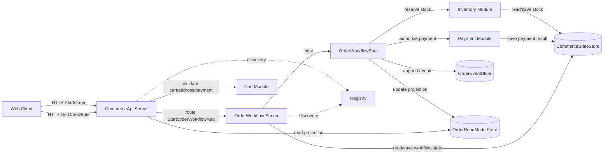
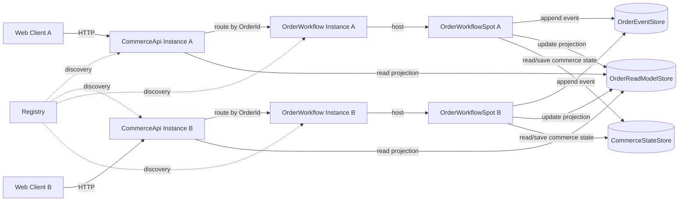
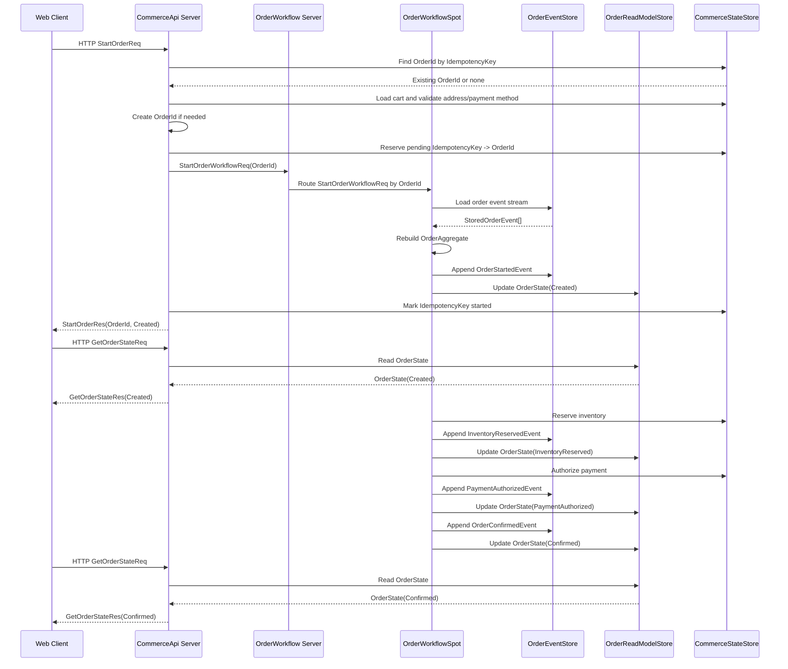

# ShoppingMallCheckout Sample Scenario

[Event 샘플 목록](./README.ko.md)

## 1. 목적

ShoppingMallCheckout은 작은 규모에서 시작해 중간 규모까지 확장할 수 있는 견고한 주문
workflow를 ZLink와 event sourcing으로 구성하는 샘플이다. 이 샘플의 의도는 Kafka나
Redis Stream 같은 대규모 event broker를 대체한다고 말하는 것이 아니다. 주문, 재고, 결제처럼
실패와 중복 요청이 자연스럽게 발생하는 도메인에서, 외부 HTTP API와 stateful workflow owner를
분리해도 상태 전이, 복구, audit, 조회 projection을 명확하게 만들 수 있음을 보여 주는 것이다.

커머스 주문은 이 목적에 적합하다. 주문은 상태 전이가 분명하고, 재고 예약 뒤 결제 실패 같은
보상 흐름이 자연스럽다. 사용자가 결제 버튼을 다시 누르거나 네트워크 재시도로 같은 요청이
반복되는 일도 흔하다. event sourcing은 이런 문제를 단순히 큰 시스템으로 확장하기 위한 기술이
아니라, 왜 상태가 바뀌었는지 남기고, projection이 깨졌을 때 다시 만들고, 실패 뒤 재처리 기준을
명확히 하기 위한 선택지로 사용한다.

이 샘플에서 확인해야 하는 핵심은 아래와 같다.

- `CommerceApi` 서버는 HTTP API와 client-facing 조회를 맡고, 주문 상태를 직접 바꾸지 않는다.
- `OrderWorkflow` 서버는 `OrderWorkflowSpot`을 호스팅하고, 주문 상태 전이와 projection 갱신을 맡는다.
- 어느 `CommerceApi` instance가 주문 요청을 받아도 `OrderId` 기준 `OrderWorkflowSpot` owner로 route한다.
- `OrderWorkflowSpot`만 주문 domain event를 `OrderEventStore`에 append한다.
- 현재 주문 조회는 `OrderReadModelStore` projection을 사용한다.
- projection은 `OrderEventStore` replay로 다시 만들 수 있어야 한다.
- 결제 실패, 재고 부족, 중복 요청, projection rebuild, scale-out routing을 self-check에서 검증한다.
- 규모가 커지면 Inventory, Payment, Shipping, Analytics를 별도 service나 Kafka/Redis Stream으로 확장할 수 있지만, 기본 샘플은 먼저 `CommerceApi`와 `OrderWorkflow`의 경계를 분명히 보여 준다.

## 2. 서버 구성



client-facing endpoint는 `CommerceApi` 하나뿐이다. client는 Inventory, Payment,
`OrderWorkflow` 서버를 직접 알지 않는다. `CommerceApi`는 요청 검증, idempotency lookup,
상태 조회를 맡고, 주문 상태 전이는 `OrderWorkflow` 서버의 `OrderWorkflowSpot`이 소유한다.
`OrderEventStore`는 주문 상태의 기준 event stream이고, `OrderReadModelStore`는 조회를 위한
projection이다.

서버 프로세스는 아래처럼 둔다.

| 서버 | 책임 |
|------|------|
| `ShoppingMall.Registry` | `CommerceApi`와 `OrderWorkflow` instance discovery를 제공한다. |
| `ShoppingMall.CommerceApi` | HTTP API, cart/address/payment 입력 검증, idempotency lookup, projection 조회를 맡는다. |
| `ShoppingMall.OrderWorkflow` | `OrderWorkflowSpot` hosting, 주문 event append, projection 갱신, inventory/payment module port 호출을 맡는다. |

저장소는 별도 ZLink 서버가 아니라 `CommerceApi`와 `OrderWorkflow` instance들이 공유하는
dependency로 둔다.

| 저장소 | 책임 |
|--------|------|
| `OrderEventStore` | `OrderId`별 주문 event stream을 저장한다. |
| `OrderReadModelStore` | client 조회에 사용할 주문 projection을 저장한다. |
| `CommerceStateStore` | cart snapshot, stock reservation, payment result, idempotency mapping 같은 commerce 업무 상태를 저장한다. |

샘플 실행은 stateless API scale-out과 stateful order owner routing을 함께 보여 주기 위해
`CommerceApi`와 `OrderWorkflow`를 각각 2 instance로 실행한다.

| 구성 요소 | 샘플 instance 수 | 이유 |
|-----------|------------------|------|
| `ShoppingMall.Registry` | 1 | 샘플 구성을 단순하게 유지한다. |
| `ShoppingMall.CommerceApi` | 2 | 같은 API 서버 타입 여러 대에서 stateless HTTP 처리를 보여 준다. |
| `ShoppingMall.OrderWorkflow` | 2 | `OrderId` 기준 `OrderWorkflowSpot` owner routing과 projection update를 보여 준다. |
| stores | 1 logical set | 여러 서버 instance가 공유하는 dependency로 둔다. |



scale-out 검증은 아래를 확인한다.

- 어느 `CommerceApi` instance가 `StartOrderReq`를 받아도 같은 계약으로 처리한다.
- 같은 `OrderId`의 event는 항상 같은 `OrderWorkflowSpot` owner 흐름에서 append와 projection update가 처리된다.
- 서로 다른 주문은 서로 다른 `OrderWorkflow` instance에서 동시에 처리될 수 있다.
- 특정 `OrderWorkflow` instance를 재시작해도 `OrderEventStore` replay로 주문 projection을 복구한다.

## 3. 책임 분리

| 구분 | 담당 | 책임 |
|------|------|------|
| 외부 API 진입 | Commerce API HTTP | 주문 시작, 주문 상태 조회, self-check command를 받는다. |
| workflow relay | `CommerceApi` -> `OrderWorkflow` | 검증된 주문 시작 command를 `OrderId` owner로 전달한다. |
| 주문 owner | `OrderWorkflowSpot` | `OrderId` 기준 event stream replay, 주문 상태 전이, domain event append를 소유한다. |
| event source | `OrderEventStore` | 주문별 domain event stream을 저장한다. |
| read model | `OrderReadModelStore` | client 조회에 사용할 현재 주문 projection을 저장한다. |
| commerce state | `CommerceStateStore` | cart, stock reservation, payment result 같은 업무 상태를 저장한다. |
| endpoint discovery | Registry/Discovery | `CommerceApi`와 `OrderWorkflow` instance endpoint를 자동 발견한다. |

이 샘플은 Kafka를 그대로 다시 만들지 않는다. 기본 샘플은 HTTP API와 stateful workflow owner를
분리하고, event-sourced workflow로 견고한 주문 처리를 구성한다. 다수 consumer, 큰 backlog, 장기 replay, 운영 지표가
필요한 규모가 되면 Kafka나 Redis Stream을 확장 경로로 붙일 수 있다. 그 경우에도 주문 상태
소유, workflow, projection 갱신은 ZLink가 맡고, durable broker는 외부 downstream event 전파를
맡게 할 수 있다.

## 4. Routing과 소유권 규칙

| 대상 | 기준 id | 규칙 |
|------|---------|------|
| API 요청 처리 | HTTP endpoint | 어떤 `CommerceApi` instance가 받아도 된다. |
| workflow relay | `OrderId` | `CommerceApi`가 `OrderWorkflow` service group으로 workflow command 메시지를 전달한다. |
| 주문 owner | `OrderId` | 같은 `OrderId`는 항상 같은 logical `OrderWorkflowSpot` owner로 route한다. |
| event append | `OrderId`, stream `Version` | `OrderWorkflowSpot`만 append하고 expected version check로 중복 append를 막는다. |
| projection update | `OrderId`, stream `Version` | append된 order domain event만 projection에 반영한다. |
| idempotent start | `IdempotencyKey` | 같은 주문 시작 요청은 같은 `OrderId`로 모이며, started mapping은 같은 projection을 반환한다. |

`CommerceApi`는 HTTP 요청을 stateless하게 받을 수 있다. 주문 시작 요청은 어느 instance가
받아도 `OrderWorkflow` 서버의 `OrderId` owner로 전달되고, 상태 조회 요청은
`OrderReadModelStore` projection을 읽어 반환한다. client는 진행 중 상태가 필요하면
`GetOrderStateReq`를 반복 조회한다.

`OrderId`는 `StartOrderReq`를 처음 처리할 때 생성한다. `CommerceStateStore`는
`IdempotencyKey -> OrderId` mapping과 그 mapping의 처리 상태를 저장한다. 새 주문을 시작할 때는
먼저 pending mapping을 예약해서 같은 `IdempotencyKey` 재시도가 같은 `OrderId`로 route되게 한다.
`OrderStartedEvent` append와 `Created` projection update가 끝난 뒤에만 mapping을 started로
확정한다. 같은 `IdempotencyKey`가 다시 들어오면 새 주문을 만들지 않고 기존 `OrderId`의
projection을 반환한다. mapping이 pending이면 기존 `OrderId` owner로 다시 전달해
`OrderStartedEvent`와 `Created` projection을 완료한 뒤 반환한다.
`OrderStartedEvent.SourceCommandId`는 `IdempotencyKey` 값을 사용한다.

### 필수 구현 경계

아래 경계는 샘플 구현에서 반드시 지켜야 한다. 이 경계를 어기면 `CommerceApi`와
`OrderWorkflowSpot`의 책임이 섞여서 scale-out routing과 owner 검증이 의미를 잃는다.

- `CommerceApi`는 `OrderWorkflowSpot`을 호스팅하지 않는다.
- `CommerceApi`는 `OrderAggregate`, `OrderEventStore` append, projection rebuild 로직을 직접 호출하지 않는다.
- `CommerceApi`는 `StartOrderReq`를 검증한 뒤 `StartOrderWorkflowReq`를 `OrderWorkflow` server group으로 보낸다.
- 주문 시작, workflow 재개, projection rebuild는 `OrderWorkflowSpot`으로 전달되는 명시적인 workflow command 메시지로 처리한다.
- `GetOrCreate`의 create payload를 주문 시작 command처럼 사용하지 않는다. create payload가 필요하면 spot identity나 초기화 metadata만 담는다.
- `OrderWorkflowSpot.OnCreate`는 업무 상태 전이를 실행하지 않는다. 상태 전이는 `StartOrderWorkflowReq`, `ContinueOrderWorkflowReq`, `RebuildOrderProjectionReq` 같은 handler에서 시작한다.
- `GetOrderStateReq`는 `OrderReadModelStore` projection만 읽는다. 조회 요청이 workflow를 진행시키거나 event를 append하면 안 된다.
- projection rebuild 요청은 `CommerceApi`에서 직접 store를 고치지 않고 `OrderWorkflow` 서버로 relay한 뒤, `OrderWorkflowSpot` owner가 event stream replay로 처리한다.

## 5. DDD와 Hexagonal 구조

이 샘플은 DDD 기반의 domain model과 hexagonal architecture를 기준으로 구현한다. 주문 상태
전이, 결제 실패 보상, terminal state, event 생성은 domain 안에 둔다. HTTP handler,
ZLink Spot handler, repository는 adapter로 둔다.

의존 방향은 아래 규칙을 따른다.

| 레이어 | 책임 | 의존 |
|--------|------|------|
| `Domain` | 주문 상태 전이, 재고/결제 결과 적용, 보상 규칙, domain event 생성 | 외부 framework와 저장소 구현을 모른다. |
| `Application` | 주문 시작, workflow 실행, projection rebuild, 조회 use case | domain과 port interface에 의존한다. |
| `Ports` | event store, read model, commerce state를 interface로 정의 | 구현체를 모른다. |
| `Adapters` | HTTP handler, ZLink Spot, repository 구현 | application port를 호출하거나 구현한다. |

`CommerceApi` 서버는 아래 구조를 기준으로 둔다.

```text
Server/CommerceApi/
  Application/
      StartOrderUseCase
      GetOrderStateUseCase
  Ports/
    Outbound/
      OrderReadModelPort
      CommerceStateStorePort
      OrderWorkflowCommandPort
  Adapters/
    Http/
      StartOrderHandler
      GetOrderStateHandler
    ZLink/
      Clients/
        OrderWorkflowClient
    Store/
      OrderReadModelRepository
      CommerceStateStoreRepository
```

`OrderWorkflow` 서버는 아래 구조를 기준으로 둔다.

```text
Server/OrderWorkflow/
  Domain/
    ShoppingMallCheckout/
      OrderAggregate
      OrderState
      OrderEvents
      OrderPolicy
    Inventory/
    Payment/
  Application/
    CheckoutWorkflow/
      StartOrderWorkflowUseCase
      ApplyOrderEventUseCase
      RebuildOrderProjectionUseCase
      OrderCompensationUseCase
  Ports/
    Inbound/
      StartOrderWorkflowPort
      ContinueOrderWorkflowPort
      RebuildOrderProjectionPort
    Outbound/
      OrderEventStorePort
      OrderReadModelPort
      CommerceStateStorePort
  Adapters/
    ZLink/
      Spots/
        OrderWorkflowSpot
      Handlers/
        StartOrderWorkflowHandler
        ContinueOrderWorkflowHandler
        RebuildOrderProjectionHandler
    Store/
      OrderEventStoreRepository
      OrderReadModelRepository
      CommerceStateStoreRepository
```

`Domain`은 ZLink framework 타입, DB client, Redis, Kafka를 직접 참조하지 않는다.
`CommerceApi`는 domain event를 append하지 않는다. 요청을 검증하고 `OrderWorkflowCommandPort`를
통해 workflow command를 보낸 뒤, 현재 상태 조회는 projection에서 읽는다.
`OrderWorkflowSpot`은 adapter에 속하며, `OrderEventStorePort`로 event stream을 읽어
`OrderAggregate`를 복원하고, domain method가 반환한 event를 다시 `OrderEventStorePort`에
append한다. `OrderReadModelRepository`는 projection adapter이며, projection을 삭제해도
event stream replay로 다시 만들 수 있어야 한다.

## 6. 메시지 계약

client HTTP 메시지:

```text
StartOrderReq {
  CartId: string
  ShippingAddressId: string
  PaymentMethodId: string
  IdempotencyKey: string
}

StartOrderRes {
  OrderId: string
  Status: string
}

GetOrderStateReq {
  OrderId: string
}

GetOrderStateRes {
  State: OrderState
}
```

workflow command 메시지:

```text
StartOrderWorkflowReq {
  OrderId: string
  CartId: string
  ShippingAddressId: string
  PaymentMethodId: string
  IdempotencyKey: string
  Lines: OrderLineInput[]
  Amount: decimal
  Currency: string
}

StartOrderWorkflowRes {
  State: OrderState
}

ContinueOrderWorkflowReq {
  OrderId: string
}

ContinueOrderWorkflowRes {
  State: OrderState
}

RebuildOrderProjectionReq {
  OrderId: string
}

RebuildOrderProjectionRes {
  State: OrderState
}
```

이 메시지는 `CommerceApi`에서 `OrderWorkflow` 서버로 보내는 내부 ZLink 계약이다.
`OrderWorkflow` 서버는 `OrderId`로 `OrderWorkflowSpot` owner를 찾고, 해당 spot handler에
메시지를 전달한다. `StartOrderWorkflowReq`는 spot 생성 payload가 아니라 명시적인 업무
command다. `ContinueOrderWorkflowReq`는 pending idempotency 복구나 재시도처럼 이미 있는
주문 workflow를 다시 진행해야 할 때 사용한다. `RebuildOrderProjectionReq`는 projection 삭제
또는 self-check에서 event stream replay를 검증할 때 사용한다.

module port 메시지:

```text
ReserveInventoryCommand {
  OrderId: string
  Lines: OrderLineInput[]
}

ReserveInventoryResult {
  Accepted: bool
  ReservationId: string?
  Reason: string?
}

ReleaseInventoryCommand {
  OrderId: string
  ReservationId: string
  Reason: string
}

ReleaseInventoryResult {
  Released: bool
}

AuthorizePaymentCommand {
  OrderId: string
  PaymentMethodId: string
  Amount: decimal
  Currency: string
}

AuthorizePaymentResult {
  Accepted: bool
  PaymentId: string?
  Reason: string?
}
```

이 command는 외부 client 계약이 아니라 `OrderWorkflowSpot`이 `OrderWorkflow` 서버의 inventory,
payment module port를 호출할 때 사용하는 언어 중립 계약이다. 샘플 구현에서는 실제 결제 gateway를 붙이지 않고,
`CommerceStateStore`의 test data로 성공, 재고 실패, 결제 실패를 결정한다.

order event stream 메시지:

```text
StoredOrderEvent {
  EventId: string
  SourceCommandId: string?
  OrderId: string
  EventType: string
  Payload: bytes
  Version: int64
  CreatedAtUnixMs: int64
}

OrderStartedEvent {
  EventId: string
  OrderId: string
  CartId: string
  ShippingAddressId: string
  Lines: OrderLineInput[]
  Amount: decimal
  Currency: string
  SourceCommandId: string
}

InventoryReservedEvent {
  EventId: string
  OrderId: string
  ReservationId: string
}

InventoryReservationFailedEvent {
  EventId: string
  OrderId: string
  Reason: string
}

PaymentAuthorizedEvent {
  EventId: string
  OrderId: string
  PaymentId: string
}

PaymentFailedEvent {
  EventId: string
  OrderId: string
  Reason: string
}

InventoryReleasedEvent {
  EventId: string
  OrderId: string
  ReservationId: string
  Reason: string
}

OrderConfirmedEvent {
  EventId: string
  OrderId: string
  ConfirmedAtUnixMs: int64
}

OrderFailedEvent {
  EventId: string
  OrderId: string
  Reason: string
  FailedAtUnixMs: int64
}

OrderLineInput {
  Sku: string
  Quantity: int
}
```

상태 모델:

```text
OrderState {
  OrderId: string
  Status: string
  ShippingAddressId: string?
  ReservationId: string?
  PaymentId: string?
  Reason: string?
  Amount: decimal?
  Currency: string?
  UpdatedAtUnixMs: int64
}
```

`Status` 값은 `Created`, `InventoryReserved`, `PaymentAuthorized`, `Confirmed`,
`Failed`를 사용한다.

self-check test data:

```text
CartSeed {
  CartId: string
  Lines: OrderLineInput[]
  Amount: decimal
  Currency: string
}

InventorySeed {
  Sku: string
  AvailableQuantity: int
}

PaymentMethodSeed {
  PaymentMethodId: string
  ShouldAuthorize: bool
  FailureReason: string?
}
```

샘플 runner는 self-check 시작 전에 위 test data를 `CommerceStateStore`에 넣는다. 재고 실패
시나리오는 `AvailableQuantity`가 부족한 cart를 사용한다. 결제 실패 시나리오는
`ShouldAuthorize = false`인 payment method를 사용한다. 이 test data는 외부 API 계약이 아니라
샘플 검증을 안정적으로 만들기 위한 seed 데이터다.

## 7. Event Sourced Checkout 흐름



`CommerceApi`는 먼저 `IdempotencyKey`로 기존 `OrderId`가 있는지 확인한다. 기존 `OrderId`가
있고 mapping이 started이면 새 주문을 만들지 않고 기존 projection을 반환한다. mapping이 pending이면
기존 `OrderId` owner로 다시 전달해서 시작 처리를 끝낸다. 새 주문이면 cart, 배송 주소, 결제
수단을 검증하고 주문 line, 배송 주소, 금액을 snapshot으로 고정한 뒤 `OrderId`를 생성한다.
그 다음 `CommerceApi`는 `OrderWorkflow` 서버로 `StartOrderWorkflowReq`를 보낸다. 주문 상태 전이는
`OrderWorkflowSpot`이 event stream에서 aggregate를 복원한 뒤 수행한다. 재고 예약과 결제 승인은
샘플에서는 `OrderWorkflow` 서버가 `CommerceStateStore`와 module port로 처리한다.
`StartOrderRes`는 `OrderStartedEvent`와 `Created` projection이 만들어진 뒤 반환한다. 그 뒤
workflow가 재고 예약과 결제를 진행하고, 상태가 바뀔 때마다 projection을 갱신한다. client는
`GetOrderStateReq`로 현재 projection을 조회한다. 성공하면 `OrderConfirmedEvent`까지
append한다. 실패하면 실패 원인에 맞는 event를 append하고 필요한 보상 event를 append한다.

## 8. 보정과 중복 처리

- `StartOrderReq.IdempotencyKey`는 같은 주문 시작 요청이 중복 전송되었을 때 같은 `OrderId`로 모으고, started mapping에서는 같은 projection을 돌려주는 데 사용한다.
- `OrderWorkflowSpot`은 event stream에서 이미 처리한 `SourceCommandId`를 확인해 중복 command를 무시한다.
- `OrderEventStore` append는 expected `Version`을 받아 optimistic version check를 수행한다.
- `OrderStartedEvent`, `InventoryReservedEvent`, `PaymentAuthorizedEvent`, `OrderConfirmedEvent`는 같은 의미로 중복 append되지 않아야 한다.
- idempotency mapping은 pending 상태일 수 있다. pending mapping은 성공 응답으로 보지 않고 같은 `OrderId` owner에서 시작 처리를 재개한다.
- 결제 실패가 재고 예약 이후 발생하면 `InventoryReleasedEvent`를 append하고 `OrderFailedEvent`로 terminal 상태를 만든다.
- `Confirmed` 또는 `Failed` 상태의 주문은 terminal 상태이며, 이후 event가 상태를 되돌리지 않는다.
- client가 중간 상태를 놓쳤더라도 `GetOrderStateReq`로 현재 projection을 다시 조회한다.
- projection이 깨지면 `OrderEventStore` replay로 `OrderReadModelStore`를 재생성한다.

`OrderEventStore`는 샘플에서 아래 동작을 제공해야 한다.

- stream key는 `OrderId`로 둔다.
- append는 expected `Version`을 받아 optimistic version check를 수행한다.
- 같은 `SourceCommandId`에서 만들어진 `OrderStartedEvent`는 한 번만 append한다.
- `OrderStartedEvent`는 `ShippingAddressId`를 포함해 검증된 배송 주소 snapshot을 replay할 수 있게 한다.
- 같은 `ReservationId` 또는 `PaymentId`를 가진 event는 중복 적용하지 않는다.
- read는 stream event를 `Version` 오름차순으로 반환한다.
- projection rebuild는 `OrderEventStore`만 읽어서 `OrderReadModelStore`를 다시 만든다.

`OrderReadModelStore` projection은 아래 상태 전이를 반영해야 한다.

- `OrderStartedEvent`를 적용하면 `Created`가 되고 `ShippingAddressId`를 저장한다.
- `InventoryReservedEvent`를 적용하면 `InventoryReserved`가 되고 `ReservationId`를 저장한다.
- `PaymentAuthorizedEvent`를 적용하면 `PaymentAuthorized`가 되고 `PaymentId`를 저장한다.
- `OrderConfirmedEvent`를 적용하면 `Confirmed`가 된다.
- `InventoryReservationFailedEvent`, `PaymentFailedEvent`, `OrderFailedEvent`를 적용하면 `Failed`가 되고 `Reason`을 저장한다.
- `InventoryReleasedEvent`는 결제 실패 보상 결과로 projection에 남기되 terminal status를 되돌리지 않는다.

workflow branch별 event sequence는 아래를 따른다.

| branch | event sequence |
|--------|----------------|
| 성공 | `OrderStartedEvent -> InventoryReservedEvent -> PaymentAuthorizedEvent -> OrderConfirmedEvent` |
| 재고 실패 | `OrderStartedEvent -> InventoryReservationFailedEvent -> OrderFailedEvent` |
| 결제 실패 | `OrderStartedEvent -> InventoryReservedEvent -> PaymentFailedEvent -> InventoryReleasedEvent -> OrderFailedEvent` |

각 branch는 terminal event인 `OrderConfirmedEvent` 또는 `OrderFailedEvent`에서 끝난다. terminal
event 이후 같은 `OrderId`에 대한 workflow command가 다시 들어오면 새 event를 append하지 않고
현재 projection을 반환한다. expected `Version` 충돌이 발생하면 `OrderWorkflowSpot`은 event
stream을 다시 읽고 aggregate를 재구성한 뒤 중복 여부와 terminal 상태를 다시 판단한다.

`CommerceStateStore`는 샘플에서 아래 동작을 제공해야 한다.

- `IdempotencyKey`로 기존 `OrderId`를 조회하고, 없으면 pending mapping을 예약한다.
- `OrderStartedEvent` append와 `Created` projection update가 성공한 뒤 mapping을 started로 확정한다.
- pending mapping을 다시 조회하면 같은 `OrderId` owner로 route해서 시작 처리를 재개한다.
- `CartId`로 cart line, 금액, 통화를 조회한다.
- `ShippingAddressId`로 배송 주소가 존재하는지 검증한다.
- inventory module이 `Sku`별 재고를 예약하고 `ReservationId`를 저장한다.
- payment module이 `PaymentMethodId`별 승인 성공/실패를 결정하고 `PaymentId`를 저장한다.
- self-check seed data로 성공 cart, 재고 부족 cart, 결제 실패 payment method를 제공한다.

## 9. Kafka/Redis Stream 확장 기준

기본 샘플은 `CommerceApi`, `OrderWorkflow`, ZLink owner routing, `OrderEventStore`,
projection만으로 견고한 주문 workflow를 보여 준다. 아래 요구가 커지면 Kafka나 Redis Stream을
확장 경로로 붙인다.

- 주문 event를 Email, Shipping, Analytics, Fraud detection 같은 여러 consumer가 독립적으로 읽어야 한다.
- consumer가 느려져도 큰 backlog를 안정적으로 흡수해야 한다.
- 여러 팀이 독립 consumer를 운영하고 lag, offset, partition 같은 운영 지표가 필요하다.
- 장기 replay와 외부 시스템 연동이 주문 workflow 자체보다 더 커진다.

이 경우에도 ZLink의 역할은 남는다. `OrderWorkflowSpot` 상태 소유, `OrderId` routing,
projection update는 `OrderWorkflow` 서버 안에서 그대로 ZLink가 맡고, Kafka나 Redis Stream은 외부
downstream event 전파와 replay를 맡는다.

## 10. Client 시나리오 작성 기준

client 시나리오는 Bingo client처럼 시나리오 테스트로 읽혀야 한다. 실제 사용자가 주문을
시작하고 상태를 확인하는 흐름을 helper 뒤에 숨기면 안 된다. 실행 진입부에서 client를
만들고, 시나리오 함수에서는 HTTP 요청, response 검증, 상태 조회, projection 검증이
순서대로 보여야 한다. 각 response는 request 직후 검증한다.

공통 client 전제:

- client는 `CommerceApi` HTTP endpoint만 사용한다.
- client는 inventory, payment, order 내부 module이나 storage endpoint를 직접 사용하지 않는다.
- response 검증은 request 직후 수행한다.
- workflow가 비동기로 진행되는 구간은 `GetOrderStateReq`를 반복 조회해 terminal status를 확인한다.
- `OrderEventStore`, `OrderReadModelStore`, `CommerceStateStore` 검증은 client가 storage
  endpoint를 호출하는 방식이 아니라 sample runner의 server-side assertion으로 수행한다.

성공 주문 시나리오:

```text
1. CommerceApi instance A로 StartOrderReq를 전송한다.
2. StartOrderRes.OrderId와 Status=Created를 즉시 검증한다.
3. GetOrderStateReq / GetOrderStateRes로 Created projection과 ShippingAddressId를 검증한다.
4. GetOrderStateReq를 반복 조회해 Status=Confirmed가 될 때까지 기다린다.
5. Confirmed state에 ReservationId, PaymentId, Amount, Currency가 채워졌는지 검증한다.
6. server-side assertion으로 OrderStartedEvent, InventoryReservedEvent, PaymentAuthorizedEvent, OrderConfirmedEvent append를 검증한다.
7. final GetOrderStateReq / GetOrderStateRes가 Confirmed projection을 반환하는지 검증한다.
```

중복 주문 시작 시나리오:

```text
1. 같은 IdempotencyKey로 StartOrderReq를 다시 전송
2. StartOrderRes.OrderId가 이전 response와 같은지 검증
3. server-side assertion으로 OrderStartedEvent가 중복 append되지 않았는지 검증
4. server-side assertion으로 OrderReadModelStore state가 중복 변경되지 않았는지 검증
```

pending idempotency 복구 시나리오:

```text
1. test hook으로 IdempotencyKey pending mapping을 만든 뒤 Created projection 생성을 중단한다.
2. 같은 IdempotencyKey로 StartOrderReq를 다시 전송한다.
3. 새 OrderId가 생성되지 않고 pending mapping의 OrderId owner로 route되는지 검증한다.
4. server-side assertion으로 OrderStartedEvent와 Created projection이 완료된 뒤 mapping이 started로 확정되는지 검증한다.
```

재고 실패 시나리오:

```text
1. 재고 부족 cart로 StartOrderReq 전송
2. GetOrderStateReq를 반복 조회해 Status=Failed가 될 때까지 기다린다.
3. Failed state Reason이 inventory failure를 설명하는지 검증
4. server-side assertion으로 Payment authorization이 실행되지 않았는지 검증
5. GetOrderStateReq / GetOrderStateRes로 Failed projection 재조회 검증
```

결제 실패와 보상 시나리오:

```text
1. 결제 실패 payment method로 StartOrderReq 전송
2. GetOrderStateReq를 반복 조회해 InventoryReserved 또는 Failed 상태를 확인한다.
3. 최종 Status=Failed가 될 때까지 조회한다.
4. server-side assertion으로 InventoryReleasedEvent와 OrderFailedEvent가 append되었는지 검증
5. Failed state Reason이 payment failure를 설명하는지 검증
6. GetOrderStateReq / GetOrderStateRes로 Failed projection 재조회 검증
```

projection rebuild 시나리오:

```text
1. OrderReadModelStore에서 대상 OrderId projection을 삭제한다.
2. CommerceApi self-check endpoint가 RebuildOrderProjectionReq를 OrderWorkflow 서버로 보낸다.
3. server-side assertion으로 OrderEventStore replay만으로 OrderReadModelStore가 다시 생성되는지 검증한다.
4. GetOrderStateReq / GetOrderStateRes가 rebuild된 projection을 반환하는지 검증한다.
```

조회 지연 시나리오:

```text
1. 주문을 시작한 뒤 즉시 상태를 조회하지 않는다.
2. workflow가 Confirmed 또는 Failed까지 진행될 시간을 둔다.
3. 이후 GetOrderStateReq를 전송해 최종 projection을 조회한다.
4. 같은 GetOrderStateReq를 반복해도 같은 최종 상태를 반환하는지 검증한다.
5. server-side assertion으로 조회 지연 때문에 추가 event가 append되지 않았는지 검증한다.
```

scale-out 시나리오:

```text
1. CommerceApi와 OrderWorkflow를 각각 2 instance로 실행한다.
2. OrderA는 CommerceApi instance A로, OrderB는 CommerceApi instance B로 시작한다.
3. 같은 OrderId의 event는 항상 같은 OrderWorkflowSpot owner 흐름에서 처리되는지 검증한다.
4. 서로 다른 주문은 서로 다른 OrderWorkflow instance에서 동시에 처리될 수 있는지 검증한다.
5. 두 instance 어디에서 조회해도 같은 OrderReadModelStore projection을 반환하는지 검증한다.
```

## 11. 구현 완료 기준

- client는 `CommerceApi` HTTP endpoint만 사용한다.
- `CommerceApi`는 HTTP API, 입력 검증, idempotency lookup, projection 조회를 맡고 주문 domain event를 append하지 않는다.
- `OrderWorkflow` 서버는 `OrderWorkflowSpot`을 호스팅하고 주문 상태 전이를 소유한다.
- `OrderWorkflowSpot` 업무 처리는 `StartOrderWorkflowReq`, `ContinueOrderWorkflowReq`, `RebuildOrderProjectionReq` 같은 명시적 메시지 handler로 진입한다.
- `GetOrCreate` create payload나 `OrderWorkflowSpot.OnCreate`에서 주문 시작 workflow를 실행하지 않는다.
- `GetOrderStateReq`는 projection 조회만 수행하고 workflow 진행이나 event append를 유발하지 않는다.
- 같은 `OrderId`의 event는 같은 `OrderWorkflowSpot` owner 흐름에서 append된다.
- `OrderEventStore` append는 expected version check와 `SourceCommandId` dedupe를 수행한다.
- 주문 현재 상태는 `OrderReadModelStore` projection으로 조회한다.
- projection은 삭제 후 `OrderEventStore` replay로 재생성할 수 있어야 한다.
- `OrderStartedEvent`와 `OrderState`는 검증된 `ShippingAddressId`를 포함한다.
- idempotency mapping은 pending과 started 상태를 구분하고 pending 재시도는 같은 `OrderId`에서 복구한다.
- duplicate request는 주문 event를 중복 append하지 않는다.
- 결제 실패 후 재고 예약 해제 보상 event가 append된다.
- client는 `GetOrderStateReq`로 진행 중 상태와 최종 상태를 확인한다.
- scale-out self-check는 `CommerceApi x2`, `OrderWorkflow x2` 구성을 검증한다.
- `OrderId`, `EventId`, `SourceCommandId`는 명시적인 domain id이며 routing id hex 문자열을 client에 노출하지 않는다.
