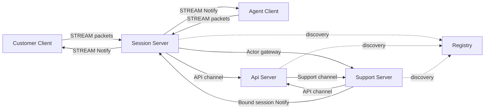
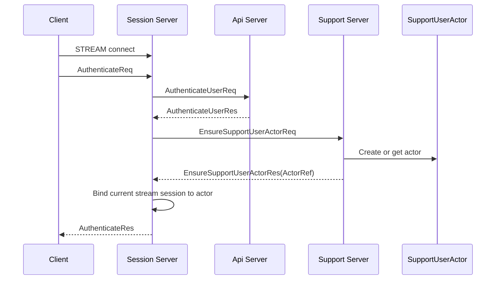
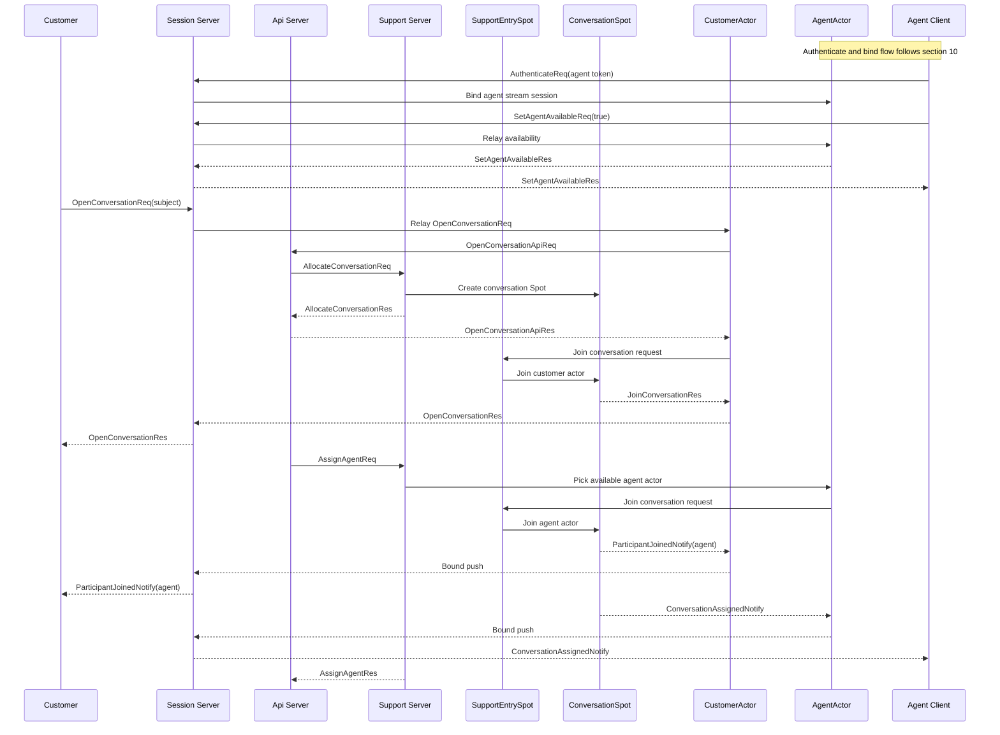
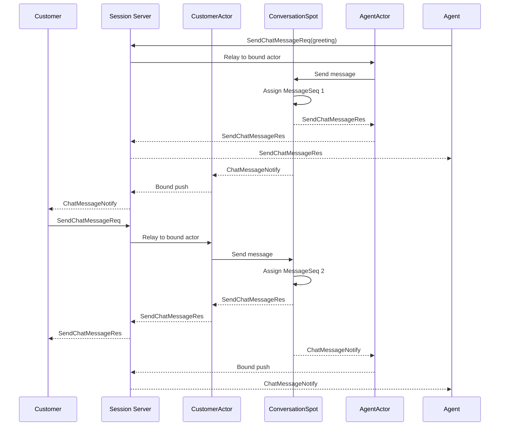
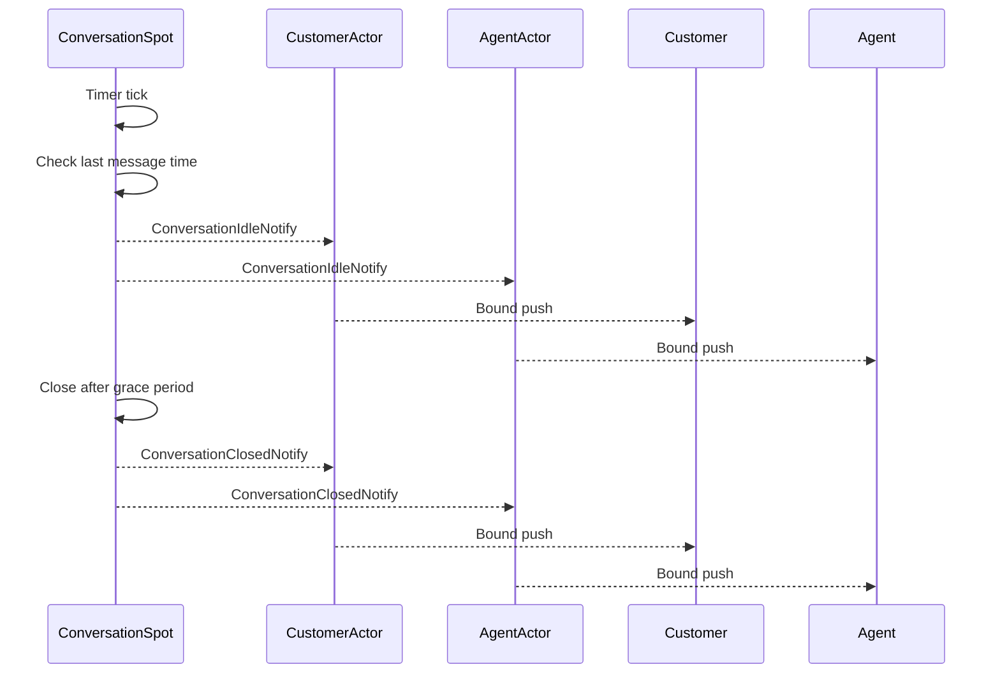
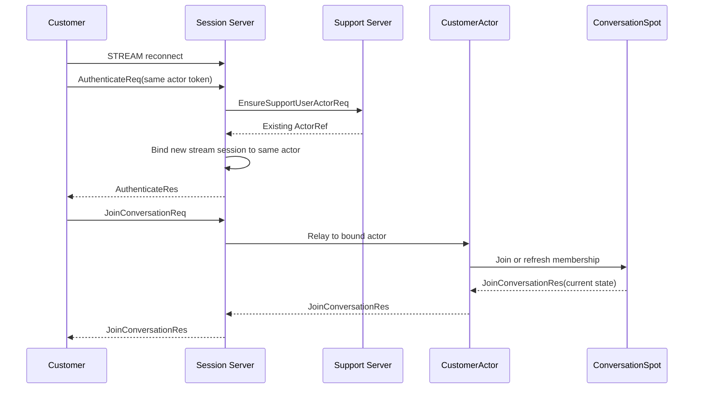

# SupportChat Sample Scenario

[샘플 목록](../README.ko.md)

## 1. 목적

SupportChat은 고객 상담 채팅 흐름으로 framework가 실제 서비스의 지속 연결과
상태 소유 문제를 어떻게 줄이는지 보여 주기 위한 샘플이다. 고객과 상담원은 모두
자기 client로 Session 서버 stream endpoint에 연결한다. Support 서버는 customer actor,
agent actor, conversation Spot을 소유하고, API 서버는 상담 티켓 생성과 상담원 배정을
맡고, Registry는 서버 간 endpoint 발견을 맡는다.

샘플로 구현할 때 확인할 핵심은 아래와 같다.

- client는 Session 서버 stream endpoint 하나만 알고 연결한다.
- Session 서버는 인증 후 현재 stream session을 Support 서버의 user actor에 bind한다.
- 상담원 client도 Session 서버에 접속해 인증하고, 자기 agent actor에 stream session을 bind한다.
- API 서버는 token 검증과 상담 생성 orchestration을 처리한다.
- Support 서버는 conversation Spot을 만들고 customer actor와 agent actor를 join시킨다.
- conversation Spot은 참여자, 메시지 순서, typing 상태, idle timeout, close 상태를 소유한다.
- customer와 agent가 보낸 채팅 메시지는 conversation Spot에서 순서를 부여받고 상대방에게 push된다.
- reconnect가 발생하면 같은 actor에 새 stream session이 bind되고 conversation 상태는 유지된다.
- idle timer가 일정 시간 동안 새 메시지가 없는 conversation을 `WaitingForClose` 또는 `Closed`로 전환한다.
- Registry/Discovery를 사용해 Session, API, Support 서버가 서로의 endpoint를 자동으로 찾는다.

SupportChat은 Bingo와 같은 session gateway 구조를 사용하되, 게임 규칙 대신 업무형
대화 상태, 재접속, 상담 종료 흐름을 보여 준다. TicTacToe처럼 작은
직접 연결 샘플이 아니라 운영형 multi-server 샘플이다.

## 2. 서버 구성



customer client와 agent client가 직접 연결하는 서버는 Session 서버뿐이다. API 서버와
Support 서버는 client-facing stream endpoint를 열지 않는다. Session 서버는 인증과
session lifecycle을 소유하지만 상담 규칙을 해석하지 않는다. 상담 packet은 현재
session에 bind된 actor로 전달되고, customer actor와 agent actor가 같은
conversation Spot에 join한 뒤 domain state를 처리한다.

## 3. 자동 연결 방식

SupportChat은 Registry/Discovery 기반 자동 연결을 사용한다.

| 연결 | 연결 방식 | 이유 |
|------|-----------|------|
| Session -> API channel | Discovery 자동 연결 | Session 서버가 인증 요청을 처리할 때 API 서버 주소를 직접 들고 있지 않게 한다. |
| Support -> API channel | Discovery 자동 연결 | Support actor가 상담 시작 orchestration을 API 서버에 요청한다. |
| API -> Support channel | Discovery 자동 연결 | API 서버가 conversation 생성과 agent 배정 요청을 Support 서버로 보낸다. |
| Session -> Support actor gateway | Registry 기반 actor locator | Session 서버가 Support 서버 actor의 위치를 직접 관리하지 않게 한다. |
| Support -> Session bound push | Registry 기반 session route | Support 서버가 현재 client session 위치를 framework route로 찾는다. |

이 샘플은 자동 연결, actor binding, bound session push를 함께 보여 주는 역할을 맡는다.
수동 endpoint 연결은 기존 TicTacToe 샘플이 맡는다.

## 4. Bingo 기준과 대응

SupportChat은 `.NET` Bingo 샘플의 gateway 구조를 기준으로 삼는다. 도메인은 다르지만
Session, API, Support 서버가 나누는 책임은 Bingo의 Session, API, Play 서버 책임과 같은
방향을 따른다.

| Bingo 기준 | SupportChat |
|------------|------------------|
| Session handler는 `AuthenticateReq`를 처리하고, 인증 이후 packet은 bound actor로 relay한다. | Session handler는 `AuthenticateReq`만 session lifecycle packet으로 처리하고, conversation packet은 Support actor로 relay한다. |
| `MatchBingoReq`는 player actor에서 처리되고, actor가 API 서버에 `MatchBingoApiReq`를 보낸다. | `OpenConversationReq`는 customer actor에서 처리되고, actor가 API 서버에 `OpenConversationApiReq`를 보낸다. |
| API 서버는 `AllocateBingoRoomReq`로 Play 서버에 room allocation을 요청한다. | API 서버는 `AllocateConversationReq`로 Support 서버에 conversation allocation을 요청한다. |
| Play Entry Spot은 actor admission 지점이고, room Spot은 game state와 timer를 소유한다. | Support Entry Spot은 actor admission 지점이고, Conversation Spot은 대화 상태와 idle timer를 소유한다. |
| domain event는 notification mapper/publisher를 거쳐 bound session push로 나간다. | conversation event는 notification mapper/publisher를 거쳐 customer와 agent bound session으로 나간다. |

## 5. 프로세스와 책임

| 프로세스 | 구성 요소 | 책임 |
|----------|-----------|------|
| `SupportChat.Registry` | registry host | Session, API, Support 서버 endpoint를 발견 가능하게 한다. |
| `SupportChat.Api` | `Api` channel server | Session 서버의 token 검증과 Support actor의 상담 시작 orchestration 요청을 처리한다. |
| `SupportChat.Api` | `Support` channel client | Support 서버에 conversation 생성과 agent 자동 배정을 요청한다. |
| `SupportChat.Session` | stream server | client 연결, 인증 packet, actor binding, actor relay를 처리한다. |
| `SupportChat.Session` | session Spot node | ActorGateway attach와 bound session push 수신을 담당한다. |
| `SupportChat.Support` | actor runtime | customer actor와 agent actor를 만들고 Entry Spot에 join시킨다. |
| `SupportChat.Support` | `SupportEntrySpot` | actor가 conversation에 들어가기 전 admission 지점을 맡는다. |
| `SupportChat.Support` | `ConversationSpot` | 참여자, 메시지 순서, typing 상태, idle timer, close 상태를 소유한다. |
| `SupportChat.Support` | `Support` channel server | API 서버의 conversation 생성과 agent 배정 요청을 받는다. |

## 6. Support 서버 디렉토리 구조

Support 서버는 domain logic과 framework adapter를 분리한다. 샘플로 구현할 때는
아래 책임 분리를 유지한다.

```text
Server/Support/
  Domain/
    SupportChat/
      Conversation
      ConversationMessage
      ConversationParticipant
      ConversationPolicy
      ConversationEvents
  Application/
    ConversationAssignment/
      ConversationAllocator
      AgentAssignmentService
      AgentAvailabilityDirectory
  Adapters/
    ZLink/
      Actors/
        SupportUserActor
        SupportUserActorFactory
      Handlers/
        AllocateConversationHandler
        AssignAgentHandler
        EnsureSupportUserActorHandler
      Notifications/
        SupportNotificationPublisher
        ConversationEventMapper
      Spots/
        SupportEntrySpot
        ConversationSpot
        Handlers/
          OpenConversationActorHandler
          JoinConversationActorHandler
          SetAgentAvailableHandler
          SendChatMessageHandler
          SetTypingHandler
          CloseConversationHandler
          ConversationIdleTimerHandler
```

역할은 아래처럼 나눈다.

| 위치 | 책임 |
|------|------|
| `Domain/SupportChat/Conversation` | 참여자, 메시지 sequence, status, typing, close 상태 전이를 소유한다. |
| `Domain/SupportChat/ConversationPolicy` | 최대 참여자 수, idle timeout, close 가능 조건 같은 규칙을 소유한다. |
| `Domain/SupportChat/ConversationEvents` | message received, participant joined, typing changed, idle timeout, closed event를 정의한다. |
| `Application/ConversationAssignment/ConversationAllocator` | 새 상담 티켓에 conversation id를 만들고 conversation Spot 생성을 요청한다. |
| `Application/ConversationAssignment/AgentAvailabilityDirectory` | 상담 가능 상태로 등록된 agent actor id를 관리한다. |
| `Application/ConversationAssignment/AgentAssignmentService` | 대기 중인 agent actor를 선택해 conversation에 배정한다. |
| `Adapters/ZLink/Spots/ConversationSpot` | ZLink Spot lifecycle, actor join callback, timer 등록, domain 호출, notification publish 연결을 맡는다. |
| `Adapters/ZLink/Notifications/*` | domain event를 bound session push message로 바꾸고 전송한다. |
| `Adapters/ZLink/Handlers/*` | channel request와 Spot actor request를 application/domain adapter로 연결한다. |

Domain 객체는 ZLink framework 타입을 직접 참조하지 않는다.
`ConversationSpot`은 framework callback을 받아 domain method를 호출하고, domain이
반환한 event를 adapter가 message로 바꾼다. message sequence, typing 상태, idle
timeout, close 판정은 handler나 Spot handler에 흩어지지 않게 한다.

## 7. Handler 등록 방식

SupportChat은 typed handler와 domain event publisher를 함께 사용한다.

- Session packet handler는 `AuthenticateReq`처럼 session lifecycle에 속한 packet만
  처리한다. 인증 이후 conversation packet은 bound actor로 relay한다.
- channel handler는 API 서버와 Support 서버 사이의 request/response schema를 처리한다.
- Entry Spot actor handler는 `OpenConversationReq`처럼 actor가 아직 conversation
  Spot에 들어가기 전에 보내는 request를 처리한다.
- Spot actor handler는 conversation 안에서 actor가 보낸 request를 처리한다.
- `SetAgentAvailableHandler`는 agent actor의 상담 가능 상태를
  `AgentAvailabilityDirectory`에 반영한다. customer actor가 이 request를 보내면 오류를
  반환한다.
- notification publisher는 domain event를 server push message로 바꾸어 bound session으로 보낸다.

언어별 framework가 선언형 등록을 제공하더라도 SupportChat에서는 handler가 어떤
경계를 처리하는지 보이도록 typed handler 또는 명시 등록을 우선 사용한다. notification은
handler 안에서 직접 여러 client에게 보내지 않고 domain event publisher 경로로 모은다.

## 8. 도메인 규칙

SupportChat은 샘플 흐름을 짧게 유지하기 위해 1:1 상담 규칙을 사용한다.

| 항목 | 규칙 |
|------|------|
| 참여자 | customer 1명, agent 1명 |
| conversation 생성 | customer가 상담 시작을 요청하면 API 서버가 요청을 받고 Support 서버가 conversation Spot을 생성한다. |
| conversation id | `ConversationId`는 client와 server가 함께 쓰는 명시적인 식별자다. Spot routing id는 `ConversationId` 문자열에서 만든다. |
| agent 대기 | agent client가 인증 후 상담 가능 상태를 등록한다. |
| agent 배정 | API 서버가 Support 서버에 배정 요청을 보내고 Support 서버가 대기 중인 agent actor를 join시킨다. |
| agent 없음 | 배정 가능한 agent actor가 없으면 conversation은 `WaitingForAgent` 상태로 남고 오류가 아니라 대기 상태를 반환한다. |
| agent availability 해제 | agent가 conversation에 배정되거나 stream disconnect가 발생하면 상담 가능 상태에서 제거한다. |
| 메시지 순서 | conversation Spot이 단조 증가하는 `MessageSeq`를 부여한다. |
| typing | typing 상태는 마지막 변경 시각과 함께 저장하고 상대방에게 notify한다. |
| reconnect | 같은 `ActorId`가 다시 인증하면 기존 actor에 새 session을 bind한다. |
| idle timeout | 마지막 메시지 이후 일정 시간이 지나면 idle event를 보낸다. |
| 종료 | customer 또는 agent가 close를 요청하거나 idle timeout 후 close된다. |

여러 상담원, 상담 이관, 파일 첨부, 읽음 확인, 메시지 저장소, 검색, 봇 응답은 공통 샘플
범위에서 제외한다. 이 기능들은 실제 서비스에는 중요하지만 framework 핵심 흐름을
보여 주기에는 샘플을 크게 만든다.

## 9. 메시지 계약

아래 schema는 공통 샘플 계약이다. 각 언어 구현은 같은 필드와 같은 의미를 유지한다.

client stream 인증 메시지:

```text
AuthenticateReq {
  AccessToken: string
}

AuthenticateRes {
  ActorId: string
  DisplayName: string
  Role: string
}
```

API 인증과 actor 준비 메시지:

```text
AuthenticateUserReq {
  AccessToken: string
}

AuthenticateUserRes {
  Accepted: bool
  ActorId: string?
  DisplayName: string?
  Role: string?
  Reason: string?
}

EnsureSupportUserActorReq {
  ActorId: string
  DisplayName: string
  Role: string
}

EnsureSupportUserActorRes {
  Actor: ActorRefSnapshot
}

ActorRefSnapshot {
  NodeRid: bytes
  ActorId: string
  Generation: uint64
}
```

API orchestration과 Support allocation 메시지:

```text
OpenConversationApiReq {
  CustomerActorId: string
  CustomerDisplayName: string
  Subject: string
}

OpenConversationApiRes {
  ConversationId: string
  Status: string
}

AllocateConversationReq {
  CustomerActorId: string
  CustomerDisplayName: string
  Subject: string
}

AllocateConversationRes {
  ConversationId: string
  Status: string
}

AssignAgentReq {
  ConversationId: string
  RequestedAgentActorId: string?
}

AssignAgentRes {
  ConversationId: string
  Status: string
  AgentActorId: string?
}
```

client stream request/response:

```text
OpenConversationReq {
  Subject: string
}

OpenConversationRes {
  ConversationId: string
  State: ConversationState
}

SetAgentAvailableReq {
  IsAvailable: bool
}

SetAgentAvailableRes {
  IsAvailable: bool
}

JoinConversationReq {
  ConversationId: string
}

JoinConversationRes {
  State: ConversationState
}

SendChatMessageReq {
  ConversationId: string
  Text: string
}

SendChatMessageRes {
  Message: ChatMessage
  State: ConversationState
}

SetTypingReq {
  ConversationId: string
  IsTyping: bool
}

SetTypingRes {
  State: ConversationState
}

CloseConversationReq {
  ConversationId: string
  Reason: string?
}

CloseConversationRes {
  State: ConversationState
}
```

server push 메시지:

```text
ParticipantJoinedNotify {
  ConversationId: string
  ActorId: string
  Role: string
  State: ConversationState
}

ConversationAssignedNotify {
  ConversationId: string
  State: ConversationState
}

ChatMessageNotify {
  ConversationId: string
  Message: ChatMessage
  State: ConversationState
}

TypingChangedNotify {
  ConversationId: string
  ActorId: string
  IsTyping: bool
  State: ConversationState
}

ConversationIdleNotify {
  ConversationId: string
  State: ConversationState
}

ConversationClosedNotify {
  ConversationId: string
  State: ConversationState
}
```

상태 모델:

```text
ConversationState {
  ConversationId: string
  Status: string
  CustomerActorId: string
  AgentActorId: string?
  LastMessageSeq: uint64
  LastMessageAtUnixMs: int64?
  IdleDeadlineUnixMs: int64?
}

ChatMessage {
  ConversationId: string
  MessageSeq: uint64
  SenderActorId: string
  Text: string
  SentAtUnixMs: int64
}
```

`Role` 값은 `Customer`, `Agent`를 사용한다. `Status` 값은 `WaitingForAgent`,
`Active`, `WaitingForClose`, `Closed`를 사용한다. 언어별 샘플에서 enum으로 표현할 수
있지만 wire field 값은 위 문자열을 유지한다.

`ConversationId`는 도메인 식별자이며 core routing id 문자열이 아니다. Support 서버가
conversation Spot을 만들 때 각 언어의 routing id 생성 API로 `ConversationId` 문자열에서
Spot routing id를 만든다. client DTO에는 routing id hex 문자열을 노출하지 않는다.

상태 전이는 아래처럼 고정한다.

| 현재 상태 | 입력 | 다음 상태 |
|-----------|------|-----------|
| 없음 | customer가 `OpenConversationReq` 전송 | `WaitingForAgent` |
| `WaitingForAgent` | agent actor join | `Active` |
| `Active` | idle timeout 도달 | `WaitingForClose` |
| `Active` | customer 또는 agent가 `CloseConversationReq` 전송 | `Closed` |
| `WaitingForClose` | 새 `SendChatMessageReq` 수신 | `Active` |
| `WaitingForClose` | close grace timeout 도달 | `Closed` |
| `Closed` | `SendChatMessageReq`, `SetTypingReq`, `CloseConversationReq` 수신 | 오류 response |

idle timeout은 샘플 실행 시간을 줄이기 위해 기본 3초, close grace timeout은 기본 2초로
둔다. 언어별 샘플이 설정값을 바꾸더라도 smoke test에서는 같은 의미를 검증해야 한다.

잘못된 요청은 정상 response payload 대신 오류 response를 반환한다.
아래 경우는 반드시 오류로 검증한다.

- 인증 전에 `OpenConversationReq`, `SendChatMessageReq`, `SetTypingReq`를 보낸 경우
- customer가 아닌 actor가 `OpenConversationReq`를 보낸 경우
- conversation participant가 아닌 actor가 `SendChatMessageReq`를 보낸 경우
- `Closed` 상태의 conversation에 메시지, typing, close 요청을 보낸 경우

## 10. 인증과 Actor Binding 흐름



인증 성공 후 Session 서버는 현재 stream session을 Support 서버 actor에 bind한다.
customer token은 customer actor에, agent token은 agent actor에 bind된다. 이후 client가
보낸 conversation packet은 Session 서버가 직접 처리하지 않고 bound actor로 relay한다.

agent client는 인증 직후 `SetAgentAvailableReq(true)`를 보내 상담 가능 상태를 등록한다.
이 request도 bound agent actor로 relay되며, Support 서버는 agent actor를 배정 가능한
목록에 넣는다.

## 11. 상담 시작과 Agent 배정 흐름



customer가 상담을 시작하면 conversation은 `WaitingForAgent` 상태로 만들어진다.
agent client는 미리 Session 서버에 접속해 agent actor에 bind되어 있어야 한다.
agent가 join하면 conversation은 `Active` 상태가 되고 customer에게
`ParticipantJoinedNotify`가 전달된다. agent client는 요청 response가 아니라
`ConversationAssignedNotify` push로 배정된 conversation을 확인한다. 이후 customer와
agent는 같은 `ConversationSpot`에 들어간 actor를 통해 메시지를 주고받는다.

## 12. 메시지와 Typing 흐름



상담원이 conversation에 배정되면 먼저 인사 메시지를 보낸다. 상담원 client는
`SendChatMessageRes`로 `MessageSeq = 1`인 자기 메시지와 state를 받고, customer client는
`ChatMessageNotify`로 같은 메시지를 받는다. customer가 답변하면 같은 흐름으로
`MessageSeq = 2`가 부여되고 agent client가 `ChatMessageNotify`를 받는다.
`SetTypingReq`도 같은 방식으로 요청자는 response를 받고 상대방은 `TypingChangedNotify`를 받는다.

## 13. Idle Timer와 Close 흐름



conversation Spot은 마지막 메시지 시각과 idle deadline을 domain state로 유지한다.
timer handler는 시간 신호만 전달하고, idle/close 판정은 domain method가 수행한다.
close가 끝난 conversation은 추가 `SendChatMessageReq`와 `SetTypingReq`를 오류 response로
거부한다.

## 14. Reconnect 흐름



reconnect는 새 actor를 만들지 않는다. 같은 `ActorId`는 기존 actor와 conversation
membership을 유지하고, Session 서버는 새 stream session binding token만 갱신한다.
customer와 agent 모두 같은 규칙을 사용한다. client는 reconnect 뒤 `JoinConversationReq`로
현재 conversation state를 다시 확인한다.

## 15. Client 시나리오 작성 기준

client 샘플을 작성할 때는 서버 기능을 숨기는 helper 중심 구조를 피한다. 실행 진입부에서
customer client와 agent client를 만들고, 시나리오 함수에서는 아래 순서가 그대로 읽히는
구조를 따른다.

```text
1. agent client connect
2. agent AuthenticateReq / AuthenticateRes 검증
3. agent SetAgentAvailableReq(true) / SetAgentAvailableRes 검증
4. customer client connect
5. customer AuthenticateReq / AuthenticateRes 검증
6. customer OpenConversationReq / OpenConversationRes 검증
7. customer waits ParticipantJoinedNotify
8. agent waits ConversationAssignedNotify
9. agent SendChatMessageReq(greeting) / SendChatMessageRes 검증
10. customer waits ChatMessageNotify(MessageSeq = 1)
11. customer SendChatMessageReq(reply) / SendChatMessageRes 검증
12. agent waits ChatMessageNotify(MessageSeq = 2)
13. customer or agent SetTypingReq / SetTypingRes 검증
14. opposite client waits TypingChangedNotify
15. reconnect one client with the same token
16. JoinConversationReq / JoinConversationRes로 current state 검증
17. idle/close notify를 양쪽 client가 수신하는지 검증
18. closed conversation에 SendChatMessageReq를 보내 오류 response 검증
```

응답 검증은 마지막에 모아서 하지 않고 request 직후에 수행한다. notify는 순서가 명확한
경우 바로 기다리고, 순서가 불확실한 경우에는 각 client가 받아야 하는 notify waiter를
먼저 걸어 둔 뒤 함께 기다린다.

customer와 agent client는 모두 Session 서버 stream endpoint에만 연결한다.
API 서버와 Support 서버 endpoint를 client 코드에서 직접 사용하면 이 샘플의 핵심인
session gateway 구조가 흐려진다.

## 16. 구현 완료 기준

아래 항목은 언어별 샘플 구현과 smoke test로 확인해야 하는 기준이다.

- client 두 종류(customer, agent)가 각각 Session 서버에 하나의 stream 연결만 연다.
- Session, API, Support 서버는 Registry/Discovery로 서로를 자동 발견한다.
- 인증 후 Session 서버는 current stream session을 Support 서버 actor에 bind한다.
- agent client는 인증 후 `SetAgentAvailableReq(true)`로 상담 가능 상태를 등록한다.
- customer가 `OpenConversationReq`를 보내면 conversation이 생성되고 customer actor가 join한다.
- agent 배정 후 customer는 `ParticipantJoinedNotify`, agent는 `ConversationAssignedNotify`를 받는다.
- customer actor와 agent actor는 같은 `ConversationSpot`에 join되어 있어야 한다.
- agent가 먼저 greeting 메시지를 보내고, customer는 `ChatMessageNotify`로 `MessageSeq = 1`을 받는다.
- customer가 답변 메시지를 보내고, agent는 `ChatMessageNotify`로 `MessageSeq = 2`를 받는다.
- typing 변경은 요청자 response와 상대방 notify로 검증한다.
- idle timer는 conversation state를 변경하고 양쪽 client에 idle/close notify를 보낸다.
- reconnect 시 같은 actor와 conversation state가 유지된다.
- close된 conversation에 대한 메시지 요청은 오류 response를 반환한다.
- Domain / Application / Adapters 책임 분리가 유지된다.
- smoke test는 customer 인증, agent 인증, 상담 시작, agent join, agent greeting, customer reply,
  typing, reconnect, idle close까지 검증한다.
