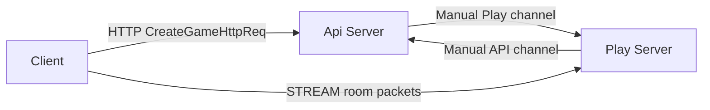
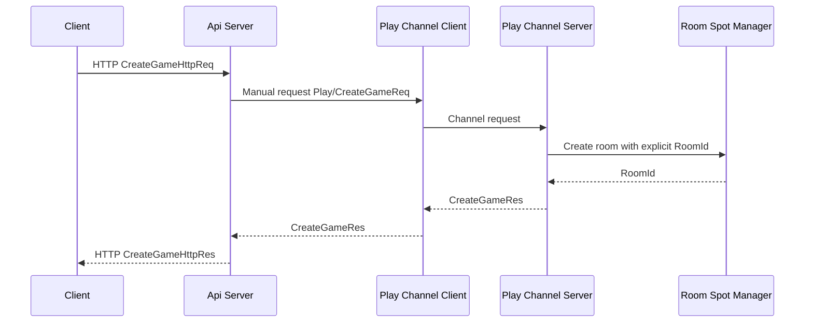
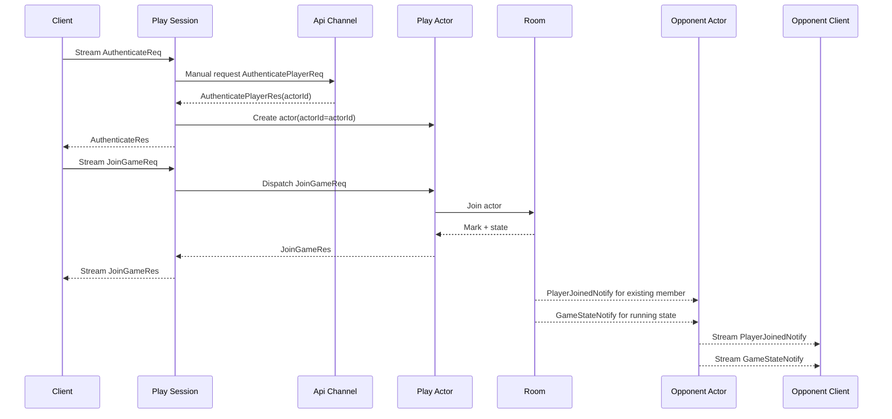
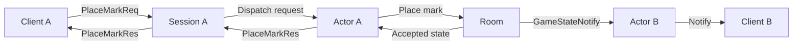

# TicTacToe Sample Scenario

[샘플 목록](../README.ko.md)

> 이 문서는 모든 framework 언어가 공유하는 TicTacToe 샘플 시나리오를 정의한다.
> TicTacToe는 API 역할과 Play 역할만으로 가장 작은 실시간 게임 흐름을 보여 준다.

## 1. 목적

TicTacToe는 직접 play 연결 구조를 보여 주는 기본 샘플이다. API 역할은 room 생성과
인증 발급을 맡고, Play 역할은 client stream session, actor, room Spot을 모두
소유한다. 별도 Session 서버가 없기 때문에 framework의 stream, actor, Spot 흐름이
짧게 드러난다. 언어별 샘플은 API와 Play를 별도 프로세스로 실행하거나, 하나의 server
프로젝트 안에서 두 실행 모드로 나눌 수 있다. 중요한 기준은 역할과 연결 흐름이다.

이 샘플에서 확인해야 하는 핵심은 아래와 같다.

- API 서버가 client-facing API endpoint를 제공한다.
- API 서버가 Play 서버에 channel request로 room 생성을 요청한다.
- Play 서버는 stream session, actor runtime, room Spot을 함께 호스팅한다.
- client는 API 서버에서 받은 Play endpoint로 직접 stream 연결을 만든다.
- Play session은 인증 후 actor를 만들고 현재 stream session에 bind한다.
- room Spot은 board, turn, 승패 판정을 소유한다.
- 연결은 Registry/Discovery 없이 수동 endpoint 설정으로 구성한다.
- handler 등록은 attribute, annotation, decorator 같은 선언형 방식을 우선 사용한다.

## 2. 서버 구성



다이어그램의 흐름은 아래와 같다.

- client는 `CreateGameHttpReq`를 API 서버 HTTP endpoint로 보낸다.
- API 서버는 수동 설정된 Play 서버 channel endpoint로 `CreateGameReq`를 보낸다.
- Play 서버는 room을 만들고 stream endpoint와 room id를 반환한다.
- client는 반환받은 stream endpoint로 Play 서버에 연결한다.
- Play 서버는 stream 인증 시 수동 설정된 API 서버 channel endpoint로 인증을 확인한다.

## 3. 프로세스와 책임

| 프로세스 | 구성 요소 | 책임 |
|----------|-----------|------|
| `TicTacToe.Api` | HTTP endpoint | room 생성 요청을 받고 client에 접속 정보를 반환한다. |
| `TicTacToe.Api` | `Api` channel server | Play 서버의 인증 요청을 처리한다. |
| `TicTacToe.Api` | `Play` channel client | 수동 endpoint로 Play 서버에 room 생성을 요청한다. |
| `TicTacToe.Play` | `Play` channel server | room을 만들고 stream endpoint를 반환한다. |
| `TicTacToe.Play` | `Api` channel client | 수동 endpoint로 API 서버에 인증을 요청한다. |
| `TicTacToe.Play` | stream server | client 연결과 session dispatch를 처리한다. |
| `TicTacToe.Play` | actor runtime | 인증된 actor를 생성하고 room에 join한다. |
| `TicTacToe.Play` | spot/room | board, turn, 승패 판정을 소유한다. |

Play 서버 안에서 stream session과 actor, room이 함께 움직인다. 이 구조는
Bingo처럼 Session 서버를 분리한 gateway 샘플보다 작고, 처음 framework를 읽는 사람이
핵심 흐름을 따라가기 쉽다.

## 4. 수동 연결 방식

TicTacToe는 Registry/Discovery 자동 연결을 사용하지 않는다. API 서버와 Play 서버는
샘플 설정에 적힌 endpoint를 직접 사용한다.

| 연결 | 설정 주체 | 예시 의미 |
|------|-----------|-----------|
| client -> API HTTP | client 설정 | room 생성 API endpoint |
| API -> Play channel | API 서버 설정 | Play 서버의 room 생성 channel endpoint |
| Play -> API channel | Play 서버 설정 | API 서버의 인증 channel endpoint |
| client -> Play stream | API 응답 | 생성된 room이 사용할 Play stream endpoint |

이 샘플이 수동 연결을 쓰는 이유는 자동 발견이 없는 기본 배선도 framework로 표현할 수
있음을 보여 주기 위해서다. Registry/Discovery 자동 연결은 Bingo 샘플이 맡는다.

## 5. Handler 등록 방식

TicTacToe는 선언형 handler 등록 방식을 우선 사용한다. 언어별 표현은 다를 수 있다.

| 언어 계열 | 권장 표현 |
|-----------|-----------|
| .NET | attribute |
| Java/Kotlin | annotation |
| TypeScript/Node | decorator |
| C++ 또는 선언형 metadata가 약한 언어 | 명시 등록으로 대체 |

명시 등록으로 대체하는 언어도 handler 역할은 같아야 한다. 예를 들어 room 생성,
인증, join, move 처리 handler는 같은 메시지 이름과 같은 책임을 유지한다.

## 6. Play 서버 디렉토리 구조

TicTacToe Play 서버는 작은 샘플이지만 domain logic과 framework adapter를 분리해야
한다. 다른 언어 framework로 구현할 때도 아래 구조와 책임 분리를 유지한다.

```text
Server/Play/
  Domain/
    TicTacToe/
      TicTacToeBoard
      TicTacToeMatch
  Application/
    GameCreation/
      TicTacToeGameCreator
  Adapters/
    ZLink/
      Actors/
        PlayActor
        PlayActorFactory
      Handlers/
        CreateGameHandler
      Sessions/
        PlaySession
      Spots/
        PlayEntrySpot
        TicTacToeGame
        Handlers/
          PlayActorJoinGameHandler
          PlayActorPlaceMarkHandler
          TicTacToeGameTimerHandler
```

역할은 아래처럼 나눈다.

| 위치 | 책임 |
|------|------|
| `Domain/TicTacToe/TicTacToeBoard` | 9칸 board, cell 범위 검증, 이미 사용한 cell 검증, 승리 라인 판정을 소유한다. |
| `Domain/TicTacToe/TicTacToeMatch` | player join, X/O 배정, turn, timeout, win/draw 상태 전이, snapshot 생성을 소유한다. |
| `Application/GameCreation/TicTacToeGameCreator` | 명시적인 `RoomId`를 만들고, 그 `RoomId` 문자열에서 room Spot routing id를 만든 뒤 room을 생성한다. |
| `Adapters/ZLink/Sessions/PlaySession` | stream 연결, 첫 packet 인증, actor 생성, session binding, client packet dispatch를 맡는다. |
| `Adapters/ZLink/Spots/TicTacToeGame` | ZLink Spot lifecycle, actor join callback, timer 등록, domain 호출, push 전송을 맡는다. |
| `Adapters/ZLink/Spots/Handlers/*` | actor request를 받아 entry Spot에서 room Spot으로 join시키거나 room domain operation을 호출한다. |
| `Adapters/ZLink/Handlers/CreateGameHandler` | Play channel의 room 생성 request를 application use case로 연결한다. |

Domain 객체는 ZLink framework 타입, stream session, actor context, logger를 알면 안 된다.
`TicTacToeGame` Spot은 actor와 session을 알고 있어도 board cell 검증, turn 검증,
승리 판정을 직접 구현하지 않는다. 이 규칙들이 handler나 Spot adapter에 들어가면
다른 언어 샘플에서 구조가 쉽게 달라지므로 공통 샘플 기준을 만족하지 못한다.

## 7. 게임 규칙

TicTacToe는 같은 규칙을 모든 언어 샘플에서 사용한다.

- 한 room에는 두 actor가 참가한다.
- 첫 actor는 `X`, 두 번째 actor는 `O`를 받는다.
- board는 0부터 8까지의 cell index로 표현한다.
- 같은 cell에는 두 번 둘 수 없다.
- 현재 turn의 actor만 `PlaceMarkReq`를 보낼 수 있다.
- 가로, 세로, 대각선 중 한 줄을 먼저 완성한 actor가 이긴다.
- 모든 cell이 찼고 승자가 없으면 draw다.

## 8. 메시지 계약

아래 계약은 언어 중립 schema다. 언어별 샘플은 같은 이름과 필드를 자기 언어의
record, class, struct, type alias 등으로 구현한다.

HTTP와 server channel에서 사용하는 메시지:

```text
CreateGameHttpReq {
  GameName: string?
}

CreateGameHttpRes {
  RoomId: string
  PlayEndpoint: string
  GameName: string
}

CreateGameReq {
  GameName: string
}

CreateGameRes {
  RoomId: string
  PlayEndpoint: string
  GameName: string
}

AuthenticatePlayerReq {
  AccessToken: string
}

AuthenticatePlayerRes {
  ActorId: string
}
```

client stream에서 사용하는 request/response:

```text
AuthenticateReq {
  AccessToken: string
}

AuthenticateRes {
  ActorId: string
}

JoinGameReq {
  RoomId: string
}

JoinGameRes {
  State: GameState
}

PlaceMarkReq {
  Cell: int
}

PlaceMarkRes {
  State: GameState
}
```

Play actor가 room SPOT에 join할 때 사용하는 내부 request/response:

```text
TicTacToeGameJoinReq {
  RoomId: string
  ActorId: string
}

TicTacToeGameJoinRes {
  State: GameState
}
```

server push 메시지:

```text
PlayerJoinedNotify {
  RoomId: string
  ActorId: string
  Mark: string
  State: GameState
}

GameStateNotify {
  State: GameState
}
```

공통 state 모델:

```text
GameState {
  RoomId: string
  Board: string
  Status: string
  Winner: string?
  NextTurn: string
  XActorId: string?
  OActorId: string?
  LastMoveActorId: string?
  LastMoveCell: int?
}
```

`Board`는 9글자 문자열이다. 빈 칸은 `.`, `X` actor의 mark는 `X`, `O` actor의
mark는 `O`로 표현한다. 예를 들어 `"X.O...X.."`는 0번과 6번 cell에 `X`, 2번 cell에
`O`가 놓인 상태다.

## 9. Room 생성 흐름



API 서버는 HTTP 요청을 받아 Play 서버에 room 생성을 요청한다. Play 서버는 room과
stream endpoint를 반환하고, API 서버는 이 값을 client가 사용할 HTTP 응답으로 바꾼다.
`RoomId`는 client와 server가 함께 쓰는 명시적인 room 식별자다. Spot routing id는
`RoomId` 문자열에서 만든다. 예를 들어 .NET 구현은 `RoutingId.From(roomId)`로 room
Spot을 만들고, `JoinGameReq.RoomId`를 같은 방식으로 routing id로 바꾸어 join한다.
`RoomId`를 core routing id의 hex 문자열로 노출하지 않는다.

## 10. 인증과 입장 흐름



첫 packet은 반드시 `AuthenticateReq`여야 한다. 인증이 끝나기 전에
`JoinGameReq`나 `PlaceMarkReq`를 받으면 session은 오류 response를 반환하고 actor를
생성하지 않는다.

첫 actor가 join할 때는 self-join notify를 보내지 않는다. 두 번째 actor가 join하면
기존 room member에게 새 actor 정보를 담은 `PlayerJoinedNotify`와 `Running` state를
담은 `GameStateNotify`를 보낸다. 두 번째 actor는 자기 join 결과를 `JoinGameRes`로
확인한다.

## 11. 수 두기와 Notify 흐름



승리 또는 draw가 만들어지면 `GameState.Status`와 `GameState.Winner`에 결과를 담은
최종 state가 양쪽 client에게 전달되어야 한다. 요청을 보낸 client는 `PlaceMarkRes`에서
최종 state를 받고, 상대 client는 `GameStateNotify`에서 같은 최종 state를 받는다.
잘못된 turn, 이미 사용한 cell, 끝난 room에
대한 요청은 `PlaceMarkRes` 대신 오류 response를 반환한다.

## 12. Bingo와의 차이

| 항목 | TicTacToe | Bingo |
|------|-----------|-------|
| 연결 방식 | 수동 endpoint 설정 | Registry/Discovery 자동 연결 |
| client API 요청 | API 서버로 직접 보낸다. | Session stream 하나로 보낸다. |
| 게임 stream 연결 | Play 서버에 직접 연결한다. | Session 서버 연결 하나만 유지한다. |
| Session 서버 | 별도 프로세스 없음. Play 서버가 session과 room을 함께 소유한다. | 별도 Session 서버가 client stream과 actor binding을 소유한다. |
| Play 서버 | stream session, actor, room을 함께 호스팅한다. | actor, Entry Spot, room Spot을 호스팅한다. |
| 주요 목적 | 작은 직접 play 연결 구조 | 분리된 session gateway 구조 |
| Handler 등록 | 선언형 등록 우선 | typed handler 계약 명시 등록 |

## 13. 완료 기준

- API 역할과 Play 역할이 별도 실행 모드 또는 별도 프로세스로 구분되어 있다.
- 별도 Session 서버 프로세스는 없다.
- Registry/Discovery 자동 연결을 사용하지 않고 수동 endpoint로 channel을 연결한다.
- client는 room 생성 같은 API 요청만 API 서버로 보낸다.
- client는 API 응답으로 받은 Play 서버 stream endpoint에 직접 연결한다.
- Play session은 `AuthenticateReq`에서 API 서버로 인증 request를 보낸다.
- 인증 응답의 `actorId`를 actor의 `ActorId`로 사용한다.
- `JoinGameReq` 이후 actor가 room에 join한다.
- 두 번째 actor가 join하면 기존 room member에게 `PlayerJoinedNotify`가 전달된다.
- join한 actor 자신에게 self-join notify를 보내지 않는다.
- 정상 move마다 요청한 client에는 `PlaceMarkRes`가, 상대 client에는 `GameStateNotify`가 전달된다.
- 게임 종료 시 `GameState.Status`와 `GameState.Winner`가 양쪽 client에 전달된다.
- request/reply는 message name이 아니라 stream request sequence로 매칭된다.
- handler 등록은 가능한 언어에서 선언형 방식을 사용한다.
- smoke test는 room 생성, 두 client 인증, join, 최소 한 판 종료까지 검증한다.
