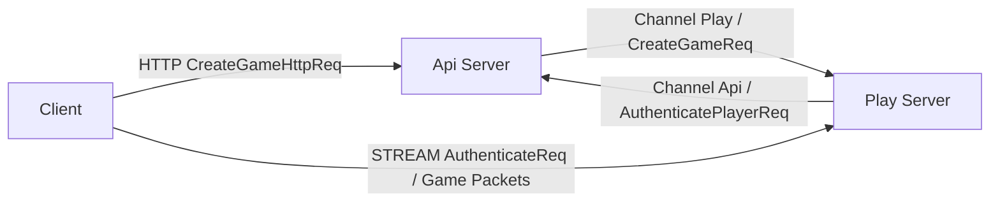
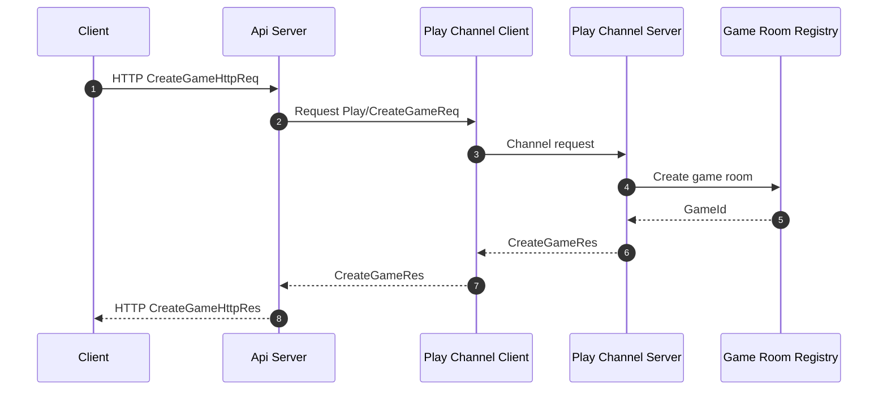
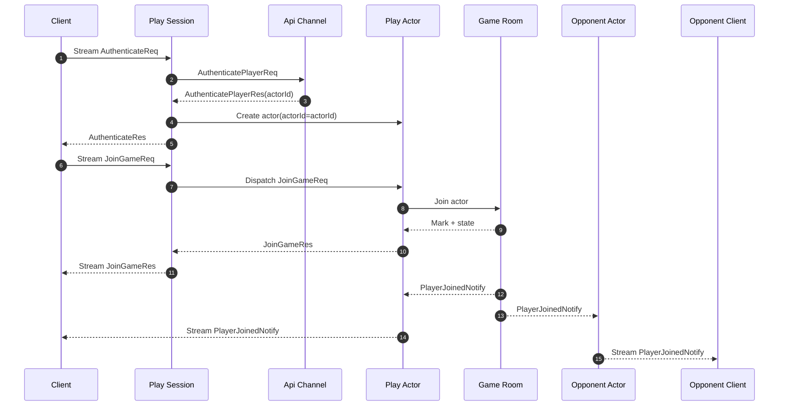
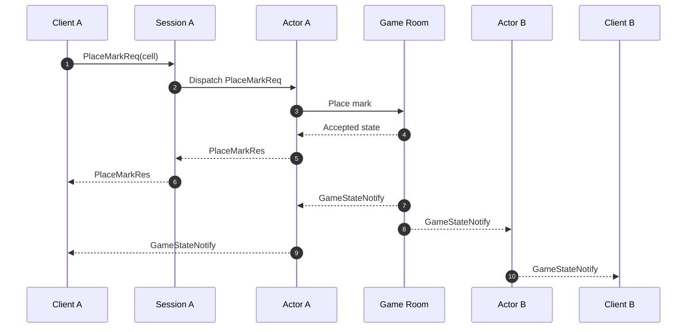

[TicTacToe Sample](./README.ko.md) | [Session Actor Dispatch 버전](./session-gateway.ko.md)

# TicTacToe Direct Sample

> 이 문서는 일반 TicTacToe 샘플의 구현 기준을 정한다.
> client는 API 서버에서 game 정보를 받은 뒤 Play 서버의 stream endpoint에 직접
> 연결한다.

## 1. 목적

일반 버전은 가장 작은 실시간 게임 샘플이다. API 서버는 game 생성과 인증
발급을 맡고, Play 서버는 client stream, actor, game room을 모두 소유한다. 이 구조는
client와 gameplay 서버가 직접 연결되는 모델을 보여 준다.

이 샘플에서 확인해야 하는 핵심은 아래와 같다.

- API 서버가 Play 서버에 channel request로 game 생성을 요청한다.
- client가 Play 서버 stream에 직접 연결한다.
- Play session이 API 서버에 인증 request를 보내고 `actorId`를 얻는다.
- Play actor의 `ActorId`는 인증 결과의 `actorId`와 같다.
- game room은 틱택토 board와 turn을 authoritative state로 관리한다.
- 상대 입장, 턴 변경, 게임 종료는 `Notify` 메시지로 client에게 push한다.

## 2. 서버 구성



다이어그램의 흐름은 아래와 같다.

- client는 `CreateGameHttpReq`를 API 서버 HTTP endpoint로 보낸다.
- API 서버는 `Play` channel client로 Play 서버에 `CreateGameReq`를 보낸다.
- Play 서버는 game room을 만들고 stream endpoint와 game id를 반환한다.
- client는 반환받은 stream endpoint로 Play 서버에 연결한다.
- Play 서버는 stream 인증 시 API 서버의 `Api` channel로 인증을 확인한다.

## 3. 프로세스와 책임

| 프로세스 | 구성 요소 | 책임 |
|----------|-----------|------|
| `TicTacToe.Api` | HTTP endpoint | game 생성 요청을 받고 client에 접속 정보를 반환한다. |
| `TicTacToe.Api` | `Api` channel server | Play 서버의 인증 요청을 처리한다. |
| `TicTacToe.Api` | `Play` channel client | Play 서버에 game 생성을 요청한다. |
| `TicTacToe.Play` | `Play` channel server | game room을 만들고 stream endpoint를 반환한다. |
| `TicTacToe.Play` | stream server | client 연결과 session dispatch를 처리한다. |
| `TicTacToe.Play` | actor runtime | 인증된 actor를 생성하고 room에 join한다. |
| `TicTacToe.Play` | spot/game room | board, turn, 승패 판정을 소유한다. |

## 4. Endpoint와 Channel

| 이름 | 소유 프로세스 | 방향 | 용도 |
|------|---------------|------|------|
| `http://api/games` | API | client -> API | game 생성 |
| `Play` channel | Play server | API -> Play | game room 생성 |
| `Api` channel | API server | Play -> API | access token 인증 |
| `client-stream` | Play server | client -> Play | 게임 메시지 |
| `play-spot` | Play server | 내부 | game room 실행 context |

`Play` channel과 `Api` channel은 일반 channel messaging을 사용한다. 특정 node로 직접
보내는 routed channel은 이 버전에서 사용하지 않는다.

## 5. 메시지 계약

HTTP와 server channel에서 사용하는 메시지:

```csharp
public sealed record CreateGameHttpReq(string? GameName);

public sealed record CreateGameHttpRes(
    string GameId,
    string PlayEndpoint,
    string GameName);

public sealed record CreateGameReq(string GameName);

public sealed record CreateGameRes(
    string GameId,
    string PlayEndpoint,
    string GameName);

public sealed record AuthenticatePlayerReq(string AccessToken);

public sealed record AuthenticatePlayerRes(string ActorId);
```

client stream에서 사용하는 request/response:

```csharp
public sealed record AuthenticateReq(string AccessToken);

public sealed record AuthenticateRes(string ActorId);

public sealed record JoinGameReq(string GameId);

public sealed record JoinGameRes(GameState State);

public sealed record PlaceMarkReq(int Cell);

public sealed record PlaceMarkRes(
    GameState State);
```

Play actor가 game room SPOT에 join할 때 사용하는 내부 request/response:

```csharp
public sealed record TicTacToeGameJoinReq(
    string GameId,
    string ActorId);

public sealed record TicTacToeGameJoinRes(GameState State);
```

server push 메시지:

```csharp
public sealed record PlayerJoinedNotify(
    string GameId,
    string ActorId,
    string Mark,
    GameState State);

public sealed record GameStateNotify(GameState State);
```

공통 state 모델:

```csharp
public sealed record GameState(
    string GameId,
    string Board,
    string Status,
    string? Winner,
    string NextTurn,
    string? XActorId,
    string? OActorId,
    string? LastMoveActorId,
    int? LastMoveCell);
```

`Board`는 9글자 문자열이다. 빈 칸은 `-`, `X` actor의 mark는 `X`, `O` actor의
mark는 `O`로 표현한다. 예를 들어 `"X-O---X--"`는 0번과 6번 cell에 `X`, 2번 cell에
`O`가 놓인 상태다.

## 6. Game 생성 흐름



API 서버는 HTTP 요청을 받아 Play 서버에 game 생성을 요청한다. Play 서버는 game room과
stream endpoint를 반환하고, API 서버는 이 값을 client가 사용할 HTTP 응답으로 바꾼다.

## 7. 인증과 입장 흐름



첫 packet은 반드시 `AuthenticateReq`여야 한다. 인증이 끝나기 전에
`JoinGameReq`나 `PlaceMarkReq`를 받으면 session은 오류 response를 반환하고 actor를
생성하지 않는다.

## 8. 수 두기와 Notify 흐름



승리 또는 draw가 만들어지면 `GameState.Status`와 `GameState.Winner`에 결과를 담은
`GameStateNotify`를 양쪽 client에게 보낸다. 잘못된 turn, 이미 사용한 cell, 끝난 game에 대한 요청은
`PlaceMarkRes` 대신 오류 response를 반환한다.

## 9. 완료 기준

- API 서버와 Play 서버가 별도 프로젝트로 분리되어 있다.
- client는 Play 서버 stream endpoint에 직접 연결한다.
- Play session은 `AuthenticateReq`에서 API 서버로 인증 request를 보낸다.
- 인증 응답의 `actorId`를 actor의 `ActorId`로 사용한다.
- `JoinGameReq` 이후 actor가 game room에 join한다.
- 두 actor가 모두 join하면 `PlayerJoinedNotify`가 전달된다.
- 정상 move마다 `PlaceMarkRes`와 `GameStateNotify`가 전달된다.
- 게임 종료 시 `GameState.Status`와 `GameState.Winner`가 양쪽 client에 전달된다.
- request/reply는 message name이 아니라 stream request sequence로 매칭된다.
- smoke test는 game 생성, 두 client 인증, join, 최소 한 판 종료까지 검증한다.
