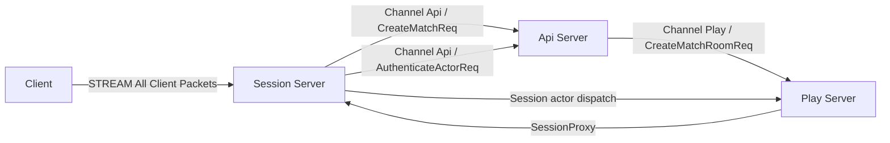
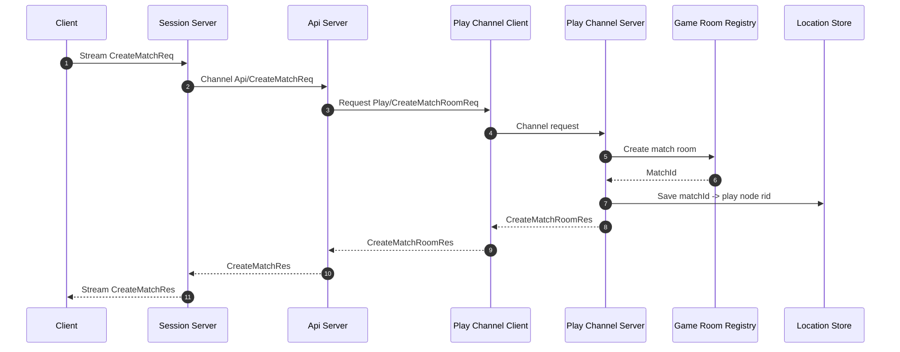
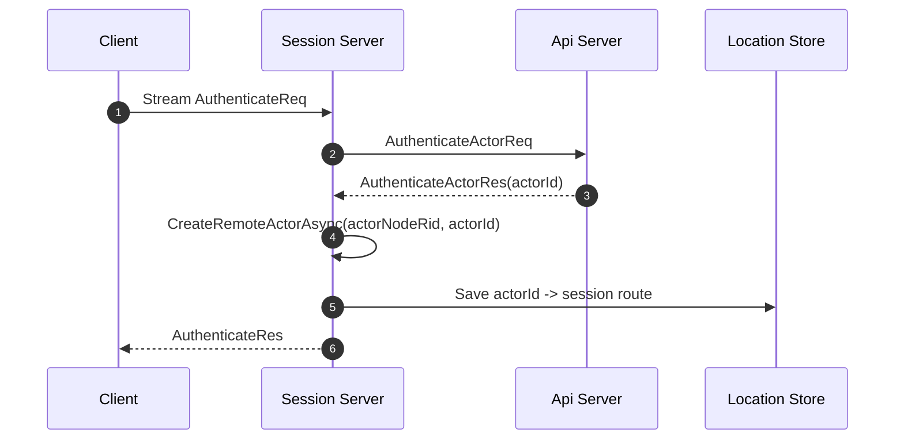
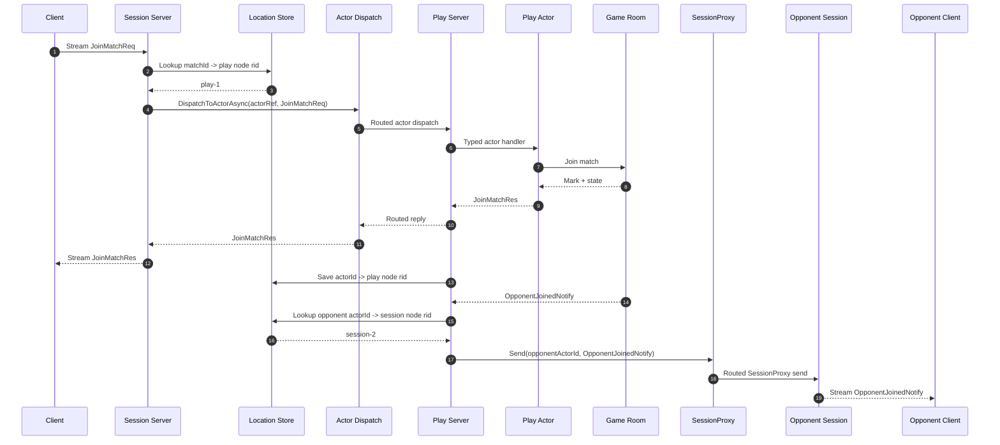
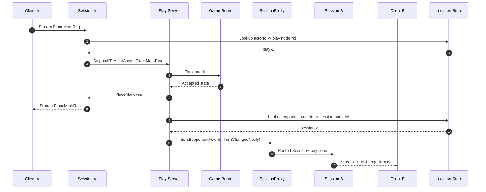
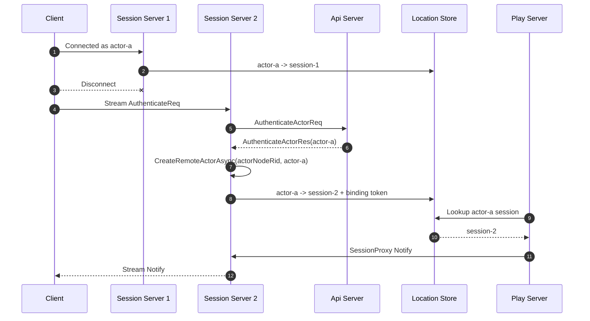
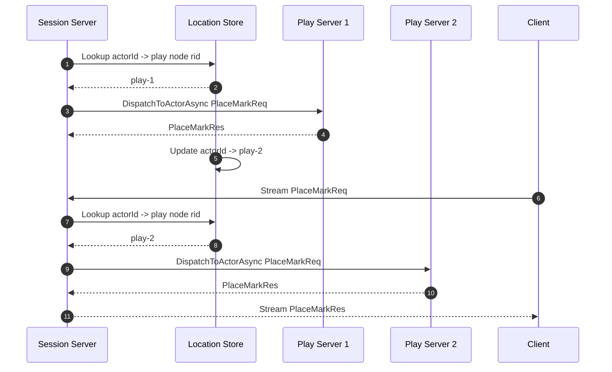

[TicTacToe Sample](./README.ko.md) | [일반 버전](./direct.ko.md) | [Session Actor Dispatch Draft](../../draft/framework-adapter/policy/session-gateway-usability.ko.md)

# TicTacToe Session Actor Dispatch Sample

> 이 문서는 Session actor dispatch TicTacToe 샘플의 구현 기준을 정한다.
> client는 Session 서버와 하나의 stream 연결만 유지한다.
> match 생성 같은 API 성격의 request도 Session 서버가 API 서버로 relay하고,
> gameplay packet은 Session 서버가 Play 서버로 relay한다.

## 1. 목적

Session actor dispatch 버전은 client 연결 관리와 gameplay 실행을 분리한 서버 구성을 보여
준다. Session 서버는 stream 연결과 인증 상태를 소유하고, Play 서버는 actor와 game
room을 소유한다. Play 서버가 client에게 메시지를 보낼 때는 `SessionProxy`를 통해
현재 actor가 binding된 Session 서버로 보낸다.

이 샘플에서 확인해야 하는 핵심은 아래와 같다.

- client는 Play 서버와 API 서버 주소를 알 필요가 없다.
- client의 모든 request는 Session 서버 stream 연결 하나로 들어온다.
- 인증 결과의 `actorId`를 `actorId`로 사용한다.
- Session 서버는 `actorId -> client stream` binding을 관리한다.
- application은 `actorId -> play node RoutingId` 위치를 관리한다.
- Play 서버는 `SessionProxy`와 session route resolver를 사용해 client에게 Notify를 보낸다.
- Session 서버와 Play 서버 사이의 request/reply는 sequence 기준으로 이어진다.
- 같은 `actorId`가 다른 Session 서버에 다시 연결되어도 Play 서버는 새 Session 서버로 Notify를 보낼 수 있다.

## 2. 서버 구성



이 버전에서 client가 직접 연결하는 서버는 Session 서버뿐이다. API 서버와 Play
서버는 client-facing endpoint를 열지 않는다. Session 서버는 API 성격의 packet은
API 서버로 channel request를 보내고, gameplay packet은 actor dispatch helper로 Play 서버에
전달한다. Play 서버는 `SessionProxy`로 client-facing 메시지를 Session 서버에
전달한다.

## 3. 프로세스와 책임

| 프로세스 | 구성 요소 | 책임 |
|----------|-----------|------|
| `TicTacToeGateway.Api` | `Api` channel server | Session 서버의 인증과 match 생성 요청을 처리한다. |
| `TicTacToeGateway.Api` | `Play` channel client | Play 서버에 match room 생성을 요청한다. |
| `TicTacToeGateway.Session` | stream server | client 연결, 인증, match 생성 relay, `actorId` binding을 처리한다. |
| `TicTacToeGateway.Session` | routed channel node | Play 서버와 session actor dispatch/`SessionProxy` 메시지를 주고받는다. |
| `TicTacToeGateway.Play` | `Play` channel server | match room을 만들고 `matchId -> play node RoutingId` 위치를 기록한다. |
| `TicTacToeGateway.Play` | routed channel node | Session 서버에서 relay된 actor packet을 받는다. |
| `TicTacToeGateway.Play` | actor runtime | `actorId` 기준 actor를 만들고 packet handler를 실행한다. |
| `TicTacToeGateway.Play` | game room service | board, turn, 승패 판정을 소유한다. |
| application store | location registry | `actorId -> play node RoutingId`, `actorId -> session node RoutingId`를 저장한다. |

## 4. Endpoint와 Channel

| 이름 | 소유 프로세스 | 방향 | 용도 |
|------|---------------|------|------|
| `client-stream` | Session server | client -> Session | client 연결과 모든 client request |
| `Api` channel | API server | Session -> API | access token 인증, match 생성 |
| `Play` channel | Play server | API -> Play | match room 생성 |
| `backend` routed channel | Session, Play | Session <-> Play | session actor dispatch와 `SessionProxy` |

`Api`와 `Play` service channel client도 `UseDiscovery(...)` 기반 자동 연결을 사용한다.
각 server의 bind endpoint는 registry에 올라가고 client는 endpoint를 직접 알지 않는다.
`backend`는 handler group 이름이 아니라 router 연결망 ID다. Session 서버와 Play 서버는
같은 `backend` routed channel에 참여하고, 실제 대상은 `RoutingId`로 지정한다.

예시 node id:

| node | RoutingId |
|------|-----------|
| Session 서버 1 | `session-1` |
| Session 서버 2 | `session-2` |
| Play 서버 1 | `play-1` |

## 5. 메시지 계약

client stream과 server channel에서 사용하는 match 생성 메시지:

```csharp
public sealed record CreateMatchReq(string? OwnerActorId = null);

public sealed record CreateMatchRes(
    string MatchId,
    string OwnerActorId);

public sealed record CreateMatchRoomReq();

public sealed record CreateMatchRoomRes(string MatchId);
```

> client는 match id/room name을 직접 지정하지 않는다. 서버가 생성한 `MatchId`만
> 응답으로 돌려준다.

API 인증 메시지:

```csharp
public sealed record AuthenticateActorReq(string ActorId);

public sealed record AuthenticateActorRes(
    bool Accepted,
    string? ActorId,
    string? Reason);
```

client stream request/response:

```csharp
public sealed record AuthenticateReq(string ActorId);

public sealed record AuthenticateRes(string ActorId);

public sealed record JoinMatchReq(string MatchId);

public sealed record JoinMatchRes(
    string MatchId,
    string ActorId,
    string Mark,
    TicTacToeState State);

public sealed record PlaceMarkReq(
    string MatchId,
    int Cell);

public sealed record PlaceMarkRes(
    TicTacToeState State);
```

server push 메시지:

```csharp
public sealed record OpponentJoinedNotify(
    string MatchId,
    string OpponentActorId,
    string Mark,
    TicTacToeState State);

public sealed record TurnChangedNotify(
    string MatchId,
    string TurnActorId,
    TicTacToeState State);

public sealed record GameEndedNotify(
    string MatchId,
    string? WinnerActorId,
    bool Draw,
    TicTacToeState State);
```

공통 state 모델:

```csharp
public sealed record TicTacToeState(
    string MatchId,
    string Board,
    string Status,
    string TurnActorId,
    string? WinnerActorId,
    bool Draw,
    string? XActorId,
    string? OActorId,
    string? LastMoveActorId,
    int? LastMoveCell);
```

framework 내부 routed envelope는 public sample message로 노출하지 않는다. sample
코드에서는 session actor dispatch helper와 `SessionProxy` 표면을 사용한다.

## 6. Location Store

Session actor dispatch 샘플에는 application 위치 저장소가 필요하다.

| key | value | 갱신 시점 |
|-----|-------|-----------|
| `actorId` | `play node RoutingId` | match join 또는 actor migration |
| `actorId` | `session node RoutingId` | 인증 성공 후 session bind, 재접속 |
| `matchId` | `play node RoutingId` | match 생성 |

framework는 이 저장소를 대신 소유하지 않는다. 샘플 구현은 in-memory store로 시작할 수
있지만, 문서와 코드에서는 이 저장소가 application 책임임을 분명히 드러내야 한다.

## 7. Match 생성 흐름



`CreateMatchReq`는 client가 이미 열어 둔 Session stream으로 보낸다. Session 서버는
이 request를 직접 처리하지 않고 API 서버의 `Api` channel로 전달한다.
`CreateMatchRoomRes`는 Play 서버가 만든 match id만 반환한다. API 서버는 이 값을
받은 뒤 match owner 정보를 붙여 `CreateMatchRes`를 Session 서버에 돌려주고, Session
서버는 원래 stream request sequence로 client에게 reply한다. API 서버와 Play 서버
endpoint는 client에게 노출하지 않는다.

`CreateMatchReq`는 인증된 session에서만 허용한다. Session 서버는 현재 binding의
`actorId`를 API 서버 요청 context에 함께 전달하거나, API 서버가 확인할 수 있는
인증 metadata를 붙여야 한다. API 서버는 이 값을 match owner로 사용한다.

## 8. 인증과 Actor Create 흐름



인증이 성공하면 Session 서버는 `actorId`를 `actorId`로 사용한다. 이 시점에
application placement가 actor node를 고르고 `CreateRemoteActorAsync(...)`를 호출한다.
framework는 현재 stream의 session binding metadata를 만들고 writer를 통해 전역 session
route에 반영한다. 같은 actor가 다시 인증되면 새 binding token을 가진 route가 이전 route를
대체한다.

## 9. Join Relay 흐름



Session 서버는 `JoinMatchReq`의 내용을 해석해서 게임 규칙을 처리하지 않는다.
Session 서버가 하는 일은 인증된 `actorId`의 `IZLinkActorRef`를 찾은 뒤 원본 packet을
`DispatchToActorAsync(...)`로 전달하는 것이다.

## 10. Move와 Notify 흐름



Play 서버가 client에게 push할 때는 client stream을 직접 알지 않는다.
`SessionProxy`가 actor session route resolver로 대상 Session 서버와 binding token을
조회한 뒤 Session 서버에 전달한다. Session 서버는 자기 binding table에서
`sessionId + bindingToken`을 검증하고 client에게 Notify를 보낸다.

## 11. 재접속 흐름



이 흐름이 session actor dispatch 버전의 핵심 장점이다. client가 다른 Session 서버에
연결되어도 논리 키인 `actorId`는 유지된다. Play 서버는 최신 location store 값을
기준으로 Notify를 새 Session 서버에 보낸다.

## 12. Play 서버 이동 흐름



샘플에서 실제 migration을 구현하지 않더라도, 구조상 client 연결을 유지한 채 다음
request가 다른 Play 서버로 갈 수 있음을 보여 줄 수 있어야 한다. 이 기능은 location
store 갱신과 actor 복구 정책이 있어야 완성된다.

## 13. 오류 처리 기준

| 상황 | 처리 |
|------|------|
| 인증 실패 | `AuthenticateReq`에 오류 response를 반환하고 binding을 만들지 않는다. |
| 인증 전 `CreateMatchReq` | 오류 response를 반환하고 API 서버로 relay하지 않는다. |
| 인증 전 게임 packet | 오류 response를 반환하고 relay하지 않는다. |
| `matchId -> play node RoutingId` 없음 | `JoinMatchReq` 또는 `PlaceMarkReq`에 오류 response를 반환한다. |
| Play 서버 relay timeout | 원본 stream request sequence로 timeout 오류 response를 반환한다. |
| `SessionProxy` target binding 없음 | request는 `ActorSessionNotBound` 오류를 반환하고, one-way Notify는 runtime event와 log를 남긴다. |
| 이미 끝난 match에 move | Play 서버가 오류 response를 반환한다. |

오류 response도 원본 stream request sequence로 돌아가야 한다. message name으로
request/reply를 맞추면 같은 메시지의 동시 요청에서 잘못된 client에게 응답할 수 있다.

## 14. 완료 기준

- API, Session, Play 서버 host 구성이 역할별로 분리되어 있다.
- client는 Session 서버 stream endpoint에만 연결한다.
- Session 서버는 `AuthenticateReq`에서 API 서버로 인증 request를 보낸다.
- 인증 응답의 `ActorId`를 actor identity로 사용하고 `CreateRemoteActorAsync(...)`를 호출한다.
- client는 인증 후 같은 Session stream으로 `CreateMatchReq`를 보내고, Session 서버는
  API 서버에 channel request로 relay한다.
- Session 서버는 `actorId -> stream` binding을 소유한다.
- application store는 `matchId -> play node RoutingId`, `actorId -> play node RoutingId`,
  `actorId -> session node RoutingId`를 소유한다.
- `JoinMatchReq`와 `PlaceMarkReq`는 Session 서버에서 Play 서버로 actor dispatch된다.
- Play 서버는 actor와 game room service를 소유한다.
- `OpponentJoinedNotify`, `TurnChangedNotify`, `GameEndedNotify`는 `SessionProxy`로 client에게 전달된다.
- client request의 원본 sequence가 relay 응답과 오류 응답에 보존된다.
- smoke test는 match 생성, 인증, join, move, Notify, 재접속 후 Notify 수신을 검증한다.
