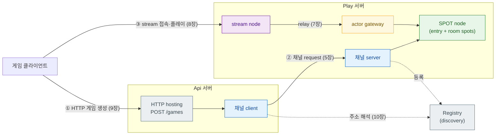

[← 목차](./README.ko.md)

# 1. 개요

## 1. 이 프레임워크가 하는 일

`zlink::framework`는 zlink 메시징 라이브러리를 **애플리케이션 프레임워크**로
만든 것이다. zlink core가 소켓·채널·메시지 같은 빌딩 블록을 주는 라이브러리라면,
프레임워크는 그 위에 서버 한 대를 완성하는 데 필요한 나머지를 더한다.

- **application host** — `app_t` 하나로 구성 → 실행 → 종료 수명주기를 관리
- **선언적 토폴로지 구성** — 채널/노드/HTTP를 fluent builder로 선언하면
  연결·바인딩·디스패치는 런타임이 처리
- **핸들러 모델** — 메시지 타입과 `handle` 메서드만 가진 클래스를 등록하면
  디코딩·라우팅·인코딩이 자동
- **DI 컨테이너, configuration, logging, monitoring/health** — 서버 운영에
  필요한 부속을 내장

사용자는 zlink core API(소켓 생성, poll 루프, 메시지 프레이밍)를 직접 만지지
않는다. 이 가이드만 읽으면 시스템을 작성할 수 있도록 쓰였다.

## 2. 코어 개념 1분 요약

프레임워크 기능 이름들은 zlink core의 개념에서 온다. 이 요약이면 이 가이드를
읽는 데 충분하다.

| 개념 | 무엇인가 |
|------|----------|
| **채널 (channel)** | 이름을 가진 메시징 경로. 서버 역할(요청 받기)과 클라이언트 역할(요청 보내기)을 endpoint로 연결한다. request-reply, fanout(pub/sub), dealer mesh 패턴이 있다. |
| **SPOT** | room·stage·zone처럼 "장소" 단위로 상태와 구독자를 묶는 실행 단위. 토픽 publish/subscribe와 timer를 가진다. |
| **actor / session** | 사용자(연결) 하나를 대표하는 actor. session과 결합해 게이트웨이 너머의 클라이언트와 메시지를 주고받는다. |
| **stream** | 게임 클라이언트 같은 외부 접속자를 받는 양방향 연결. stream connector(클라이언트측)와 짝을 이룬다. |
| **registry / discovery** | 노드들이 서로의 주소를 찾는 이름 서비스. registry를 켜면 endpoint를 하드코딩하지 않아도 된다. |
| **message / packet** | 채널로 오가는 typed DTO. `packet_name`으로 식별되고 codec(JSON/MessagePack/Protobuf)으로 직렬화된다. |

## 3. 기능 지도

서버 하나는 보통 아래 조합으로 구성된다. 각 기능은 전용 장에서 다룬다.

```text
┌─────────────────────────── app_t ───────────────────────────┐
│  config · logging · DI services · monitoring/health          │
│                                                               │
│  ┌─ 채널 메시징 (5장) ──┐  ┌─ SPOT (6장) ────────────────┐  │
│  │ request-reply/fanout  │  │ room·stage·zone, pub/sub     │  │
│  └───────────────────────┘  └──────────────────────────────┘  │
│  ┌─ Actor·Session (7장) ─┐  ┌─ Stream (8장) ──────────────┐  │
│  │ gateway relay          │  │ 외부 클라이언트 양방향 연결 │  │
│  └───────────────────────┘  └──────────────────────────────┘  │
│  ┌─ HTTP Hosting (9장) ──┐  ┌─ Registry (10장) ───────────┐  │
│  │ REST endpoint          │  │ discovery, 주소 해석        │  │
│  └───────────────────────┘  └──────────────────────────────┘  │
└───────────────────────────────────────────────────────────────┘
```

전형적인 게임 서버 예(샘플의 실제 구성) — 이 지도를 각 장에서 확대해 들어간다.



- **Api 서버** — HTTP로 게임 생성을 받고, 채널 클라이언트로 Play 서버에 위임
- **Play 서버** — 채널 서버 + SPOT(게임 룸) + actor + stream
- **Registry 서버** — discovery 제공 (점선 = registry로 해석되는 연결)
- **클라이언트** — stream connector로 Play에 접속

## 4. 산출물

| 항목 | 값 |
|------|-----|
| CMake target | `zlink::framework` |
| facade header | `#include <zlink/framework.hpp>` |
| public 계약 | `zlink/framework/contracts/*` (Boost 등 구현 의존성 비노출) |
| 네임스페이스 | `zlink::framework` |

HTTP **요청을 보내는** 쪽은 별도 산출물 `zlink::http_client`다 —
[http-client 가이드](../../http-client/doc/README.ko.md).

[다음: 시작하기 →](./02-getting-started.ko.md)
