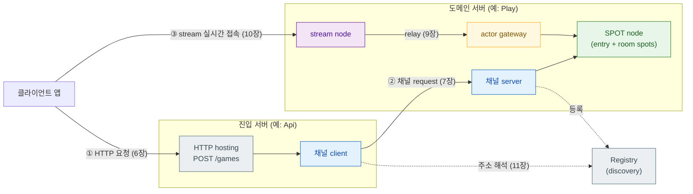

[← 목차](./README.ko.md)

# 1. 개요

## 1. 이 프레임워크가 하는 일

**실시간 메시징이 중요한 서버 시스템**을 여러 프로세스로 나눠 만드는 프레임워크다.
서버 간 실시간 통신, 상태 변화의 즉각적인 클라이언트 전달, 동시 접속 관리가 핵심인
시스템에 맞게 설계됐다.

| 도메인 | 핵심 시나리오 |
|--------|--------------|
| 실시간 게임 | 룸 생성 → 플레이어 입장 → 게임 상태 갱신 → 클라이언트 push |
| 고객 지원 채팅 | 대화 개설 → 상담원 배정 → 메시지 중계 → 대화 상태 push |
| 주문 워크플로 | 주문 접수 → 단계별 처리 → 상태 변경 → 클라이언트 알림 |
| 배송·배차 | 배차 요청 → 수행자 배정·수락 → 상태 추적 → 실시간 push |

공통된 구조가 있다 — 역할별 서버 프로세스들이 typed 메시지로 통신하고, 클라이언트는
실시간 연결로 상태 변화를 받는다.

서버 하나를 만들 때 직접 작성해야 했던 것들을 프레임워크가 처리한다.

| 직접 만들어야 했던 것 | 프레임워크가 처리하는 방식 |
|-----------------------|---------------------------|
| 소켓 생성·바인딩·연결 관리 | 채널/stream 이름으로 선언하면 런타임이 연결 |
| 메시지 직렬화·역직렬화 | codec 등록 한 번으로 struct를 그대로 주고받음 |
| 요청 라우팅·디스패치 | 핸들러 클래스 등록하면 메시지가 자동으로 찾아옴 |
| 동시 요청의 상태 보호 | SPOT의 직렬 실행으로 락 없이 상태 관리 |
| 서비스 생성·의존성 관리 | DI 컨테이너 — `dependency_types` 선언만으로 생성자 주입 |
| 외부 HTTP API 서버 별도 운영 | HTTP hosting 내장 — 같은 프로세스에 endpoint 선언 |
| 서버 주소 관리·연결 해석 | Registry / discovery로 endpoint 자동 연결 |
| 설정·로그·모니터링 | 내장 config·logging·health·metrics |

## 2. 개념 요약

이 프레임워크의 기능 단위들이다. 각각 전용 장에서 상세히 다룬다.

### DI 컨테이너 — 서비스 의존성을 한 곳에서 관리

ASP.NET Core 스타일의 DI 컨테이너가 내장돼 있다. `service_collection_t`에
서비스를 등록하면 핸들러 생성자에 **자동으로 주입**된다.

```cpp
// 등록 — topology는 singleton, 핸들러는 dependency_types로 자동 transient 등록
options.services ()
    .add_singleton<sample_topology_t> (std::make_unique<sample_topology_t> (config))
    .add_singleton<season_store_t> ();
```

```cpp
// 핸들러가 필요한 것을 선언하면 컨테이너가 생성자에 주입
class open_conversation_handler_t {
    using dependency_types =
        dependency_list_t<sample_topology_t, channel_client_t, logger_t<open_conversation_handler_t>>;
    open_conversation_handler_t (sample_topology_t &t, channel_client_t &c, logger_t<...> &l);
};
```

수명은 singleton / scoped / transient 세 가지다. `channel_client_t`, `logger_t<T>` 같은
프레임워크 서비스도 같은 방식으로 받는다.

[4장 →](./04-di-container.ko.md)

### Configuration — 설정 소스 통합

CLI 인자, 환경 변수, JSON 파일을 우선순위 순서로 합성한다. `bind<T>()` 한 번으로
설정 섹션을 struct에 매핑해 DI 컨테이너에 올린다.

```cpp
struct server_config_t {
    std::string host;
    uint16_t    port;
    static server_config_t bind (const configuration_section_t &s) {
        return {s["host"].as<std::string>(), s["port"].as<uint16_t>()};
    }
};
// app.config().get_section("server").bind<server_config_t>() → singleton 등록
```

[5장 →](./05-configuration.ko.md)

### HTTP Hosting — 프로세스 안에 REST API 내장

별도 웹 서버 없이 같은 프로세스 안에 HTTP endpoint를 올린다. 경로 파라미터,
TLS, readiness/liveness endpoint를 fluent builder로 선언한다.

```cpp
options.http ()
    .listen ("https://0.0.0.0:8443")
    .configure_tls ([] (auto &tls) { tls.certificate_file (cert_path).private_key_file (key_path); })
    .map_post<open_conversation_http_handler_t> ("/conversations")
    .map_get<get_conversation_http_handler_t> ("/conversations/{id}")
    .map_readiness ("/ready");
```

HTTP 핸들러는 채널 핸들러와 동일한 `request_type`/`reply_type`/`handle()` 계약을
쓴다. 핸들러 안에서 `channel_client_t`로 도메인 서버에 요청을 위임하는 것이
일반적인 패턴이다. DI를 통해 topology, logger 등을 생성자에서 받는다.

[6장 →](./06-http-hosting.ko.md)

### 채널 (Channel) — 서버 간 메시징, 기본 빌딩 블록

채널은 서버 사이의 통신 경로에 이름을 붙인 것이다. 보내는 쪽이 이름으로
채널을 찾아 typed 요청을 보내고, 받는 쪽의 핸들러가 처리해 응답한다.
직렬화·연결·재시도는 런타임이 처리한다.

**채널 핸들러 서버는 SPOT·actor 없이도 완전한 서비스다.** 요청을 받고, DB나
외부 API를 호출하고, 응답하는 일반 마이크로서비스를 채널 핸들러만으로 구현한다.
SPOT·actor는 실시간 상태가 필요할 때 선택적으로 추가하는 기능이다.

```cpp
// "inventory.service" 채널 하나와 핸들러 두 개 — SPOT/actor 없음
options.add_client_server_channel ("inventory.service")
    .enable_server ("tcp://0.0.0.0:5580")
    .use_handler_group ("inventory");
// check_stock_handler_t, reserve_item_handler_t 가 DB를 조회하고 응답
```

채널 패턴은 네 가지다.

- **client/server** — 1:1 request-reply 또는 단방향 send.
- **fanout (pub/sub)** — publisher가 보내면 모든 subscriber에게 전달.
  상태 변화를 여러 서버에 알리는 데 쓴다.
- **dealer mesh** — **별도 로드밸런서 없이 수평 확장.** 같은 채널에 서버 N개를
  연결하면 클라이언트 요청이 자동으로 분산된다.

  ```
  클라이언트 ──→ dealer mesh ──→ inventory-server-A
                             └──→ inventory-server-B   ← 요청 자동 분산
  ```

  서버를 추가하면 분산 비율이 늘어난다. nginx 같은 외부 LB 없이 처리량을 선형으로 늘릴 수 있다.

- **route mesh** — routing ID로 특정 서버에 고정 라우팅. 주문 ID → 주문 담당
  서버처럼 엔티티 친화성(affinity)이 필요한 패턴.

[7장 →](./07-channel-messaging.ko.md)

### SPOT — 상태 단위를 락 없이 관리

SPOT은 게임 룸, 지원 대화, 주문 처리 단위처럼 **"하나의 상태 영역"** 과 그
참여자를 묶는 실행 단위다. SPOT 인스턴스 하나가 상태 단위(룸·대화·주문) 하나다.

핵심은 **직렬 실행**이다. 같은 SPOT에 들어오는 모든 것 — 채널 패킷,
타이머 tick, 입퇴장 — 은 큐를 통해 한 번에 하나씩 처리된다. 이 덕분에
SPOT이 소유한 상태에 std::mutex 없이 접근할 수 있다.

**SPOT은 actor·session 없이 독립적으로 사용할 수 있다.** 클라이언트 실시간
연결이 없는 서버 사이드 상태 머신에도 쓴다. 채널 핸들러가 SPOT을 생성하고
요청을 전달하는 것이 전형적인 패턴이다.

```
예 (ShoppingMall 샘플):
  CommerceApi 서버 ──채널 요청──→ OrderWorkflow 서버
                                        │
                                 route handler가
                                 OrderWorkflowSpot 생성/조회
                                        │
                                 SPOT이 주문 단계를 직렬 처리
                                 (재고 예약 → 결제 → 확정)
                                        │
                                 actor/session 없음 — 서버 간 채널만 사용
```

- **entry spot**: 배정·할당 담당(매칭, 상담원 배정, 주문 접수), 노드당 1개
- **room spot**: 상태 단위 하나를 직접 소유하고 처리, 단위마다 1개

actor·session을 함께 쓰면 클라이언트 실시간 연결을 SPOT에 참여시킬 수 있다 —
이 경우에도 SPOT 자체는 그대로고, actor가 외부 연결의 대리인 역할을 한다.

[8장 →](./08-spot.ko.md)

### Actor · Session — 클라이언트 세션

Actor는 연결 하나(사용자 하나)를 대표하는 서버 쪽 객체다. 클라이언트가
stream으로 접속하면 session이 actor를 생성하고, actor는 SPOT에 입장해 상태
처리에 참여한다. 클라이언트가 끊어질 때 actor 바인딩 해제와 SPOT 퇴장은
프레임워크가 자동으로 처리하지 않는다 — `on_disconnected`에서 애플리케이션이
직접 결정한다(재접속 허용 설계라면 actor를 유지할 수도 있다).

서버 간에도 actor를 relay할 수 있다 — Session 서버가 인증·연결을 전담하고,
도메인 서버의 SPOT이 상태를 담당하는 분리 구조에 쓴다.

[9장 →](./09-actor-session.ko.md)

### Stream — 클라이언트 실시간 연결

게임 클라이언트, 채팅 앱, 배송원 앱처럼 외부에서 접속하는 양방향 연결이다.
stream node가 접속을 받고, 연결마다 session 인스턴스를 생성한다. session이
`on_packet`으로 클라이언트 패킷을 받아 actor를 통해 SPOT으로 전달한다.

클라이언트 쪽 접속은 별도 산출물인 stream connector가 담당한다.

[10장 →](./10-stream.ko.md)

### Registry / Discovery — 주소 자동 연결

서버가 여러 인스턴스로 확장될 때 어느 주소로 연결할지를 코드에 하드코딩하지
않는다. Registry 서버가 등록된 서버 목록을 관리하고, 클라이언트 역할의 서버가
`use_discovery()`로 현재 살아 있는 서버를 동적으로 찾는다.

[11장 →](./11-registry.ko.md)

## 3. 전체 토폴로지

각 기능이 어떻게 맞물리는지 보여주는 예시다(TicTacToe 샘플 기준). 이 지도를
각 기능 장이 확대해 들어간다.



- **진입 서버** — HTTP로 외부 요청을 받아 도메인 서버에 위임. 게임이면 Api 서버,
  채팅이면 ApiServer, 쇼핑이면 CommerceApi 등 도메인에 따라 이름이 달라진다.
- **도메인 서버** — 채널 서버 + SPOT(상태 단위) + actor gateway + stream node.
  게임 룸, 지원 대화, 주문 단위를 SPOT이 담당한다.
- **Registry 서버** — 서버 주소를 관리. 점선 = discovery로 해석되는 연결.
- **클라이언트 앱** — HTTP로 요청 생성, stream으로 실시간 상태 수신.

## 4. 산출물

| 항목 | 값 |
|------|-----|
| CMake target | `zlink::framework` |
| facade header | `#include <zlink/framework.hpp>` |
| public 계약 | `zlink/framework/contracts/*` (Boost 등 구현 의존성 비노출) |
| 네임스페이스 | `zlink::framework` |

HTTP **요청을 보내는** 쪽은 별도 산출물 `zlink::http_client`다 —
[http-client 가이드](../../http-client/doc/README.ko.md).

[다음: 시작하기 →](./02-getting-started.ko.md)
