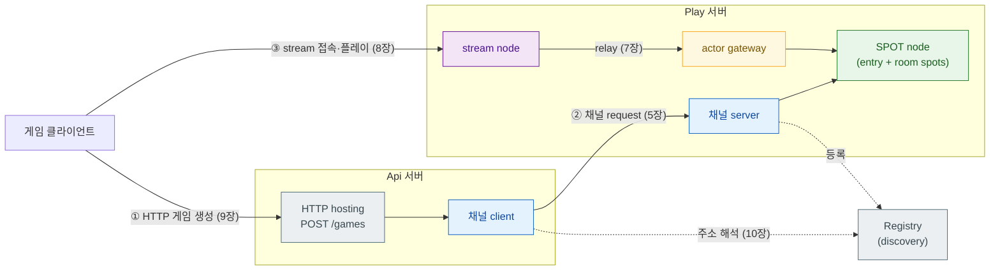

[← 목차](./README.ko.md)

# 1. 개요

## 1. 이 프레임워크가 하는 일

이 프레임워크는 **여러 서버 프로세스가 역할을 나눠 협력하는 C++ 서버 시스템**을
만들기 위한 것이다. 게임 서버, 이벤트 기반 분산 시스템처럼 서버 간 실시간 통신과
상태 관리가 중심인 시스템에 맞게 설계됐다.

서버 하나를 만들 때 직접 작성해야 했던 것들을 프레임워크가 처리한다.

| 직접 만들어야 했던 것 | 프레임워크가 처리하는 방식 |
|-----------------------|---------------------------|
| 소켓 생성·바인딩·연결 관리 | 채널/stream 이름으로 선언하면 런타임이 연결 |
| 메시지 직렬화·역직렬화 | codec 등록 한 번으로 struct를 그대로 주고받음 |
| 요청 라우팅·디스패치 | 핸들러 클래스 등록하면 메시지가 자동으로 찾아옴 |
| 동시 요청의 상태 보호 | SPOT의 직렬 실행으로 락 없이 상태 관리 |
| 서버 주소 관리·연결 해석 | Registry / discovery로 endpoint 자동 연결 |
| 설정·로그·모니터링 | 내장 config·logging·health·metrics |

## 2. 개념 요약

이 프레임워크의 기능 단위들이다. 각각 전용 장에서 상세히 다룬다.

### 채널 (Channel) — 서버 간 메시징

채널은 서버 사이의 통신 경로에 이름을 붙인 것이다. 보내는 쪽(클라이언트)이
이름으로 채널을 찾아 typed 요청을 보내고, 받는 쪽(서버)의 핸들러가 처리해
응답한다. 직렬화·연결·재시도는 런타임이 처리한다. 패턴은 세 가지다.

- **request-reply** — 요청 하나에 응답 하나. 코루틴으로 `co_await`하거나
  `.result()`로 블로킹해서 받는다.
- **fanout (pub/sub)** — publisher가 보내면 모든 subscriber에게 전달된다.
  게임 상태 변화를 여러 클라이언트에 알리는 데 쓴다.
- **dealer mesh** — 복수의 서버 인스턴스에 요청을 분산시키는 load-balancing 경로.

[5장 →](./05-channel-messaging.ko.md)

### SPOT — 게임 룸·상태 영역

SPOT은 game room, stage, zone처럼 "장소" 하나를 표현하는 실행 단위다.
SPOT 인스턴스 하나가 게임 룸 하나다.

핵심은 **직렬 실행**이다. 같은 SPOT에 들어오는 모든 것 — 플레이어 패킷,
타이머 tick, 입퇴장 — 은 큐를 통해 한 번에 하나씩 처리된다. 이 덕분에
룸 상태(게임 진행 데이터)에 std::mutex 없이 접근할 수 있고, 코루틴으로
비동기 처리를 써도 같은 룸에 두 핸들러가 겹치지 않는다.

- **entry spot**: 매칭·룸 배정 담당, 노드당 1개
- **room spot**: 게임 룸 하나의 상태를 직접 소유, 룸마다 1개

[6장 →](./06-spot.ko.md)

### Actor · Session — 클라이언트 세션

Actor는 연결 하나(플레이어 하나)를 대표하는 서버 쪽 객체다. 클라이언트가
stream으로 접속하면 session이 actor를 생성하고, actor는 SPOT에 입장해 게임에
참여한다. 클라이언트가 끊어지면 actor가 SPOT에서 퇴장한다.

서버 간에도 actor를 relay할 수 있다 — Session 서버가 인증·연결을 전담하고,
Play 서버의 SPOT이 게임 상태를 담당하는 분리 구조에 쓴다.

[7장 →](./07-actor-session.ko.md)

### Stream — 클라이언트 연결

게임 클라이언트처럼 외부에서 접속하는 양방향 연결이다. stream node가 접속을
받고, 연결마다 session 인스턴스를 생성한다. session이 `on_packet`으로 클라이언트
패킷을 받아 actor를 통해 SPOT으로 전달한다.

클라이언트 쪽 접속은 별도 산출물인 stream connector가 담당한다.

[8장 →](./08-stream.ko.md)

### HTTP Hosting — 내장 REST API

별도 웹 서버 없이 같은 프로세스 안에 HTTP endpoint를 올린다. 경로 파라미터,
TLS, health/readiness endpoint를 fluent builder로 선언한다.

HTTP 핸들러는 채널 핸들러와 같은 `request_type`/`reply_type`/`handle()` 계약을
쓴다. 핸들러 안에서 채널로 다른 서버에 요청을 위임하는 것이 일반적인 패턴이다.

[9장 →](./09-http-hosting.ko.md)

### Registry / Discovery — 주소 자동 연결

Play 서버가 여러 인스턴스로 확장될 때 어느 주소로 연결할지를 코드에
하드코딩하지 않는다. Registry 서버가 등록된 서버 목록을 관리하고, 클라이언트
역할의 서버가 `use_discovery()`로 현재 살아 있는 서버를 동적으로 찾는다.

[10장 →](./10-registry.ko.md)

## 3. 전체 토폴로지

각 기능이 실제 게임 서버에서 어떻게 맞물리는지 보여주는 예다. 이 지도를 각
기능 장이 확대해 들어간다.

- **Api 서버** — HTTP로 클라이언트 요청을 받아 채널 클라이언트로 Play 서버에 위임
- **Play 서버** — 채널 서버 + SPOT(게임 룸) + actor gateway + stream node를 한 프로세스에
- **Registry 서버** — 서버 주소를 관리, 점선 화살표 = discovery로 해석되는 연결
- **게임 클라이언트** — HTTP로 게임 생성, stream으로 실시간 플레이

## 4. 산출물

| 항목 | 값 |
|------|-----|
| CMake target | `zlink::framework` |
| facade header | `#include <zlink/framework.hpp>` |
| public 계약 | `zlink/framework/contracts/*` (Boost 등 구현 의존성 비노출) |
| 네임스페이스 | `zlink::framework` |

HTTP **요청을 보내는** 쪽은 별도 산출물 `zlink::http_client`다 —
[http-client 가이드](../../http-client/doc/README.ko.md).

[다음: 시작하기 →](./02-getting-started.ko.md)
