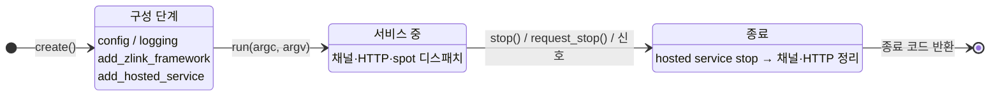
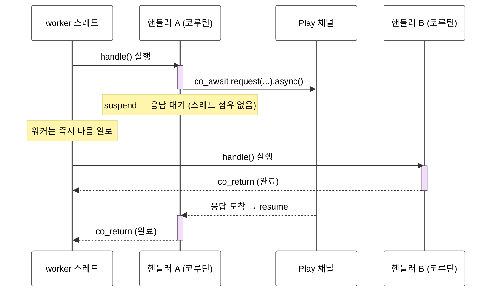

[← 목차](./README.ko.md)

# 3. 핵심 개념

프레임워크 전반에서 반복되는 다섯 가지 — app 수명주기, 구성 표면, DI, 핸들러
모델, 실행 모델 — 을 정리한다.

## 1. app_t 수명주기



```cpp
auto app = zlink::framework::app_t::create ();
// ... 구성 ...
return app.run (argc, argv);
```

- **구성 단계** — `run` 전에 모든 선언을 끝낸다. 잘못된 구성(중복 라우트,
  빈 endpoint 등)은 구성 시점이나 `run` 시작에서 예외로 거부된다.
- **`run`** — 블로킹. 채널 바인딩, HTTP listener, hosted service 시작을 끝낸 뒤
  종료 요청까지 서비스한다. 반환값이 종료 코드다.
- **종료** — `request_stop()`은 비동기 요청(신호 핸들러 등에서 호출),
  `stop()`은 동기 정지다. 종료 시 hosted service `stop()` → 채널/HTTP 정리
  순서로 내려간다.

백그라운드 작업은 `hosted_service_t`로 수명주기에 편입시킨다.

```cpp
class season_scheduler_t : public zlink::framework::hosted_service_t
{
  public:
    void start (zlink::framework::service_provider_t &services) override
    {
        _store = &services.get_required<season_store_t> ();
        _worker = std::thread ([this] { run_schedule (); });
    }
    void stop () noexcept override
    {
        _running = false;
        if (_worker.joinable ()) _worker.join ();
    }
    // ...
};

app.add_hosted_service (std::make_unique<season_scheduler_t> ());
```

## 2. 구성 표면 지도

`app_t`에는 역할별 진입점이 나뉘어 있다.

| 진입점 | 역할 | 다루는 장 |
|--------|------|-----------|
| `app.config()` | 설정 소스 로딩과 조회 | [5장](./05-configuration.ko.md) |
| `app.logging()` | 로그 출력 대상 (`use_file(...)` 등) | 12장 |
| `app.monitoring()` / `app.metrics()` / `app.health()` | 관측·상태 | 12장 |
| `app.add_zlink_framework(람다)` | **zlink 토폴로지 선언** — 채널/SPOT/stream/HTTP/registry | 6~11장 |
| `app.add_module(...)` / `add_zlink_framework<TModule>()` | 구성 패키징 (아래 §6) | — |
| `app.advanced()` | services/handlers/zlink builder 직접 접근 (탈출구) | — |

`add_zlink_framework` 람다가 받는 `zlink_framework_options_t`가 기능 선언의
중심이다.

```cpp
app.add_zlink_framework ([&] (zlink::framework::zlink_framework_options_t &options) {
    options.services ()...;     // DI 등록
    options.handlers ()...;     // 핸들러 그룹 등록
    options.codecs ()...;       // 직렬화 codec 등록
    options.add_client_server_channel (...);   // 채널
    options.add_spot_mesh (...).add_node (...); // SPOT
    options.add_stream_node (...);             // stream
    options.http ()...;                        // HTTP hosting
    options.use_discovery ()...;               // registry 연동
});
```

## 3. 서비스(DI) 컨테이너

`service_collection_t`에 등록하고 `service_provider_t`로 꺼낸다.

```cpp
options.services ().add_singleton<sample_topology_t> (
  std::make_unique<sample_topology_t> (topology));
```

| 등록 | 수명 |
|------|------|
| `add_singleton<T>()` / `add_singleton<T>(instance)` | 앱 전체에서 1개 |
| `add_scoped<T>()` | scope(`service_scope_t`) 안에서 1개, scope마다 새로 |
| `add_transient<T>()` | resolve할 때마다 새 인스턴스 |

소비 측은 `get_required<T>()`로 받는다. 핸들러는 **`dependency_types` 선언 +
생성자 주입**이 표준 패턴이다.

```cpp
class create_game_http_handler_t
{
  public:
    using request_type = create_game_http_req_t;
    using reply_type = create_game_http_res_t;
    using dependency_types =
      zlink::framework::dependency_list_t<zlink::framework::channel_client_t,
                                          sample_topology_t,
                                          zlink::framework::logger_t<create_game_http_handler_t>>;
    static constexpr const char *topic_name = "CreateGame";

    explicit create_game_http_handler_t (zlink::framework::channel_client_t &client,
                                         sample_topology_t &topology,
                                         zlink::framework::logger_t<create_game_http_handler_t> &logger);
    // ...
};
```

`dependency_list_t`에 적은 순서대로 컨테이너가 resolve해 생성자에 넣어 준다.
`channel_client_t`, `logger_t<T>` 같은 프레임워크 서비스도 같은 방식으로 받는다.

DI 컨테이너 전체 API(등록 방법 3종, 팩토리 람다, scope 종류, captive dependency 주의사항)는
[4장 DI 컨테이너](./04-di-container.ko.md)에서 다룬다.

## 4. 핸들러 모델

핸들러는 실행 컨텍스트에 따라 두 종류로 나뉜다. 구조와 수명이 완전히 다르므로
혼동하지 않는 것이 중요하다.

### 4.1 노드 핸들러 (채널·HTTP)

채널과 HTTP 경로의 핸들러는 독립된 클래스로 세 가지 멤버가 계약이다.

```cpp
class authenticate_player_handler_t
{
  public:
    using request_type  = authenticate_player_req_t;
    using reply_type    = authenticate_player_res_t;
    static constexpr const char *topic_name = "AuthenticatePlayer";

    // 동기 핸들러
    authenticate_player_res_t handle (const authenticate_player_req_t &request);

    // 또는 코루틴 핸들러 (내부에서 co_await 가능)
    // zlink::framework::task_t<authenticate_player_res_t>
    // handle (const authenticate_player_req_t &request);
};
```

- **수명은 transient** — 인스턴스는 요청마다 새로 만들어진다.
- **실행은 동시** — 서로 다른 요청의 핸들러가 worker 풀에서 **동시에** 실행된다.
- **핸들러 자체를 싱글톤으로 등록하는 것은 금지 패턴** — 동시 실행 중인 인스턴스들이
  하나의 객체를 공유하면 멤버 변수가 경쟁 상태에 빠진다.
- **핸들러 그룹** — `options.handlers().add<T>("api")`로 등록하고, 채널이
  `use_handler_group("api")`로 가져다 쓴다.
- DI — `dependency_types` + 생성자 주입 ([§3](#3-서비스di-컨테이너) 참고).

상태를 둘 곳은 성격에 따라 결정한다.

| 상태 성격 | 둘 곳 |
|-----------|-------|
| 가변 도메인 상태 (게임 룸, 매치 진행) | **SPOT** — 직렬 실행이 보장되어 락이 필요 없다 ([8장](./08-spot.ko.md)) |
| 불변 구성 (topology, 설정) | 싱글톤 서비스 — 읽기 전용이라 안전 |
| 공유 인프라 (캐시, 카운터) | 싱글톤 서비스 + **자체 동기화 필수** (mutex/atomic) |

메시지 디코딩 → 핸들러 호출 → 응답 인코딩은 런타임이 처리한다. 핸들러는 타입
있는 DTO만 본다.

### 4.2 SPOT 핸들러 (entry spot · room spot)

SPOT 핸들러는 독립된 핸들러 클래스가 아니라 **spot 클래스 자체의 메서드**다.
`spot_t` 또는 `entry_spot_t`를 상속하고, `configure()`에서
`add_actor_packet<&T::method>()`로 메서드를 등록한다.

```cpp
// room spot — 게임 룸 하나를 담당, spot_t 상속
class tictactoe_game_spot_t : public zlink::framework::spot_t,
                               public tictactoe_match_t          // 도메인 상태 직접 소유
{
  public:
    void configure (zlink::framework::spot_context_t &context)
    {
        // 메서드를 actor 패킷 핸들러로 등록 — request_type/reply_type/topic_name 불필요
        context.handlers ().add_actor_packet<&tictactoe_game_spot_t::place_mark> ();
    }

    // 시그니처: (const TActor&, const spot_actor_request_context_t&, const TReq&) → TRes
    place_mark_res_t place_mark (const player_actor_t &actor,
                                 const zlink::framework::spot_actor_request_context_t &context,
                                 const place_mark_req_t &request)
    {
        return place (actor.actor_id, request);   // tictactoe_match_t 멤버 — 락 없이 안전
    }

    // 수명주기 훅 (선택 구현)
    zlink::framework::spot_actor_join_response_t
    on_actor_join (const player_actor_t &actor, const zlink::message_t &msg);
    void onJoinActor (const player_actor_t &actor);
    void onLeaveActor (const player_actor_t &actor);
};
```

```cpp
// entry spot — 매칭·룸 배정 전담, entry_spot_t 상속, 노드당 1개
class entry_spot_t : public zlink::framework::entry_spot_t
{
  public:
    void configure (zlink::framework::spot_context_t &context)
    {
        context.handlers ().add_actor_packet<&entry_spot_t::join_game> ();
    }

    join_game_res_t join_game (const player_actor_t &actor,
                               zlink::framework::spot_actor_request_context_t &,
                               const join_game_req_t &request)
    {
        return room.join (actor.actor_id, request);   // 배정 로직 — 직렬 실행
    }

    tictactoe_match_t room{"entry-match"};   // 배정·매칭 상태를 멤버로 직접 보유
};
```

노드 핸들러와의 핵심 차이:

| | 노드 핸들러 (채널·HTTP) | entry spot | room spot |
|---|---|---|---|
| 기반 | 독립 클래스 | `entry_spot_t` 상속 | `spot_t` 상속 |
| 수명 | transient (요청마다) | 노드와 동일 (영속) | 상태 단위와 동일 (영속) |
| 개수 | 요청마다 새 인스턴스 | 노드당 1개 | 상태 단위마다 1개 |
| 실행 | 동시 (worker 풀) | **전체 직렬** — Entry Spot 단일 큐, 모든 callback 순서 보장 | **전체 직렬** — 단일 큐, 모든 요청 순서 보장 |
| 공유 상태 | 핸들러에 두지 않음 | Entry Spot 큐 안에서 안전 | 락 없이 안전 |
| 역할 | 요청 처리·위임 | 배정·매칭·할당 | 도메인 상태 소유·처리 |
| 계약 | `request_type`/`reply_type`/`topic_name` | `configure()` + `add_actor_packet` | `configure()` + `add_actor_packet` |
| DI | `dependency_types` + 생성자 주입 | 없음 — `attach_channel_client`로 채널 연결 | 없음 — `attach_channel_client`로 채널 연결 |

직렬 실행이 보장되는 이유와 `co_await` 중에도 안전한 이유는 [8장 §1](./08-spot.ko.md)에서 다룬다.

## 5. 실행 모델: task_t와 result_t

프레임워크 전반의 비동기 값은 `task_t<T>`, 성공/실패는 `result_t<T>`로
표현된다. [http_client 가이드의 실행 모델](../../http-client/doc/07-async-coroutines.ko.md)과
동일한 모델이다.

```cpp
// 코루틴 핸들러에서 다른 서버 호출을 기다리기
zlink::framework::task_t<create_game_http_res_t>
handle (const create_game_http_req_t &request)
{
    auto room = co_await _client
                  .request<create_game_res_t> ("tictactoe.play",
                                               create_game_req_t{request.game_name})
                  .async ();
    co_return create_game_http_res_t{room.room_id, room.game_name};
}
```

규칙은 하나다 — **런타임(핸들러) 스레드에서는 `co_await`, blocking
(`.result()`)은 테스트·클라이언트 시나리오에서만.** 실패는 `co_await` 경로에서
`framework_exception_t`(`kind()`/`is_retriable()`)로 던져지고, `result_t`
경로에서는 `error()`로 조회한다.

### 왜 co_await인가 — 스레드는 기다리지 않는다

채널·HTTP 핸들러는 **worker 풀**(기본 = CPU 코어 수,
`options.handler_coroutine_workers(n)`으로 조정)에서 실행된다. Spot과 Entry Spot
application callback은 각 Spot의 직렬 실행 큐에서 시작한다. 핸들러가 `co_await`에
도달하면 코루틴만 멈추고(suspend), 실행 스레드는 다른 큐 항목을 처리할 수 있다. 다만
같은 Spot 큐는 그 handler 완료 전까지 다음 callback을 시작하지 않는다.



그래서 비동기 호출을 콜백 없이 **동기식 코드처럼 위에서 아래로** 쓰면서도,
worker 몇 개로 수많은 동시 요청을 처리할 수 있다. 같은 코드를 `.result()`로
쓰면 응답이 올 때까지 스레드 하나가 통째로 잠든다 — 핸들러 안에서 금지하는
이유다.

## 6. 구성 패키징: module_t

기능 단위 구성을 재사용하려면 `module_t`를 구현해 묶는다. 서비스·zlink
토폴로지·핸들러·모니터링 구성을 한 단위로 배포할 수 있다.

```cpp
class matchmaking_module_t : public zlink::framework::module_t
{
  public:
    void configure_services (zlink::framework::service_collection_t &services) override;
    void configure_zlink (zlink::framework::zlink_builder_t &zlink) override;
    void configure_handlers (zlink::framework::handler_registry_t &handlers) override;
};

app.add_zlink_framework<matchmaking_module_t> ();   // 또는 app.add_module (module);
```

[다음: DI 컨테이너 →](./04-di-container.ko.md)
