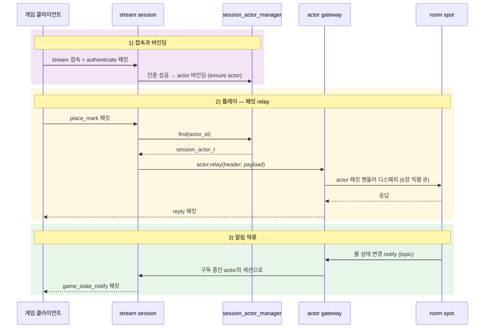

[← 목차](./README.ko.md)

# 7. Actor · Session

## 1. actor가 하는 일

actor는 **접속한 사용자 한 명을 대표하는 객체**다. 클라이언트는
stream([8장](./08-stream.ko.md))으로 게이트웨이 서버에 붙고, 인증을 거쳐 자신의
actor와 바인딩된다. 이후 클라이언트의 패킷은 actor를 통해 spot으로 relay되고,
spot의 알림은 역방향으로 클라이언트까지 흘러간다.



## 2. actor 타입과 factory

actor는 평범한 struct다. factory가 `create(actor_id)`로 만들어 준다.

```cpp
struct player_actor_t
{
    actor_ref_snapshot_t actor;     // 프레임워크가 채우는 식별 정보
    std::string display_name;
};

struct player_actor_factory_t
{
    player_actor_t create (std::string actor_id) const { return {{}, std::move (actor_id)}; }
};
```

spot 노드에 factory를 등록한다.

```cpp
options.add_spot_mesh ("tictactoe.game.discovery")
  .add_node ("tictactoe.spot.node")
  // ...
  .add_actor_factory<player_actor_factory_t> ("player");   // actor type 이름
```

spot의 actor 패킷 핸들러([6장 §3](./06-spot.ko.md))가 받는 첫 인자가 바로 이
actor 타입이다.

## 3. actor 보장(ensure) 핸들러

"이 actor_id의 actor를 준비해 달라"는 요청을 처리하는 핸들러를 둔다. 인증 후
세션이 actor와 바인딩될 때 호출되는 고리다.

```cpp
class ensure_player_actor_handler_t
{
  public:
    using request_type = ensure_player_actor_req_t;
    using reply_type = ensure_player_actor_res_t;
    static constexpr const char *topic_name = "EnsurePlayerActor";

    ensure_player_actor_res_t handle (const ensure_player_actor_req_t &request)
    {
        return {request.actor_id,
                "player",                                  // actor type
                {{}, request.actor_id, ++_generation}};    // actor ref snapshot
    }

  private:
    unsigned long long _generation = 0;
};
```

`_generation`은 재접속 시 이전 세대의 actor 참조를 무효화하는 데 쓰인다.

## 4. session ↔ actor 바인딩

stream session([8장](./08-stream.ko.md)) 쪽에서 `session_actor_manager_t`로
바인딩을 관리한다. 인증 성공 시 bind, 연결 종료 시 unbind.

**중요**: 클라이언트가 끊겼을 때 actor 바인딩 해제와 spot 퇴장 처리는
**프레임워크가 자동으로 하지 않는다.** `on_disconnected` 안에서 애플리케이션
코드가 직접 `unbind_session()`을 호출해야 한다. SPOT에서의 퇴장 역시 마찬가지로
개발자가 결정하는 로직이다 — 예를 들어 재접속을 허용하는 설계라면 disconnection
시 spot에서 퇴장시키지 않고 actor를 유지할 수 있다.

```cpp
class play_session_t final : public zlink::framework::packet_stream_session_t
{
  public:
    using dependency_types =
      zlink::framework::dependency_list_t<zlink::framework::session_actor_manager_t,
                                          authenticate_play_session_handler_t>;
    // ...

    zlink::framework::task_t<void> on_packet (zlink::framework::stream_t &stream,
                                              const zlink::framework::stream_header_t &header,
                                              const zlink::message_t &payload) override
    {
        if (_authenticate.can_handle (header)) {
            auto authenticated = co_await _authenticate.handle (_actors, stream, header, payload);
            _bound_actor_id = std::string (authenticated.actor_id ());
            co_return;
        }

        auto actor = _actors.find (*_bound_actor_id);
        co_await actor.value ().relay (header, payload).async ();   // spot으로 전달
    }

    zlink::framework::task_t<void> on_disconnected (zlink::framework::stream_t &) override
    {
        if (_bound_actor_id) {
            // 자동 처리 아님 — 앱이 직접 호출해야 한다
            _actors.unbind_session (*_bound_actor_id);
        }
        // spot 퇴장(leave) 처리도 여기서 결정 — 재접속 허용 설계라면 생략 가능
    }
};
```

핵심 표면:

| API | 의미 |
|-----|------|
| `session_actor_manager_t::find(actor_id)` | 바인딩된 actor 핸들 조회 (`std::optional<session_actor_t>`) |
| `session_actor_manager_t::unbind_session(actor_id)` | 세션-액터 바인딩 해제 |
| `session_actor_t::relay(header, payload).async()` | 클라이언트 패킷을 actor가 입장한 spot으로 relay |

## 5. actor gateway

게이트웨이는 stream 노드와 spot 노드를 잇는 다리다. 양쪽에 한 줄씩 선언한다.

```cpp
// spot 노드 쪽 — actor 입장을 게이트웨이 경유로 받는다
options.add_spot_mesh (...).add_node ("bingo.room.node")
  .enable_actor_gateway ();

// stream 노드 쪽 — 이 stream의 세션 actor를 해당 spot 노드로 보낸다
options.add_stream_node ("tictactoe.stream")
  .bind (topology.stream_endpoint)
  .register_session<play_session_t> ()
  .attach_actor_gateway ("tictactoe.spot.node");
```

게이트웨이가 켜지면: 클라이언트 패킷 → session relay → gateway → spot의 actor
패킷 핸들러 순으로 흐르고, spot이 보낸 알림은 역경로로 클라이언트에 닿는다.
relay 계약의 세부(메타데이터 전파 정책 등)는 spec
[actor-gateway-session-relay](../spec/actor-gateway-session-relay.ko.md)가 정본이다.

[다음: Stream →](./08-stream.ko.md)
