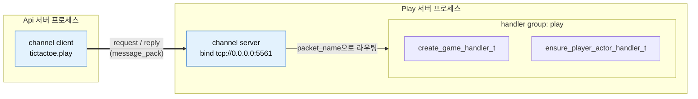
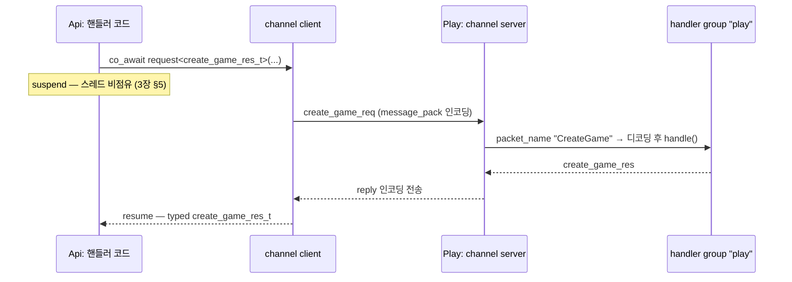
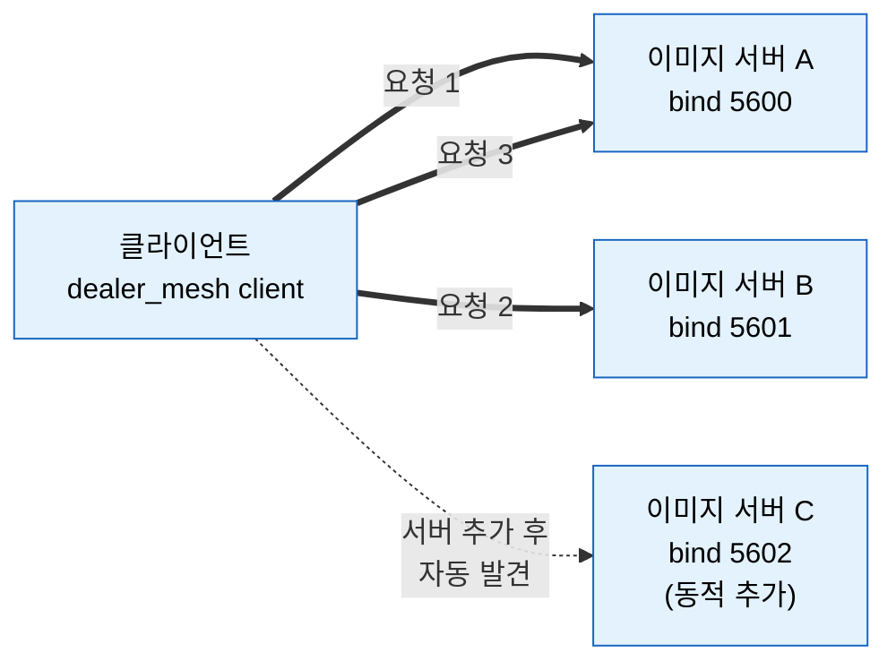
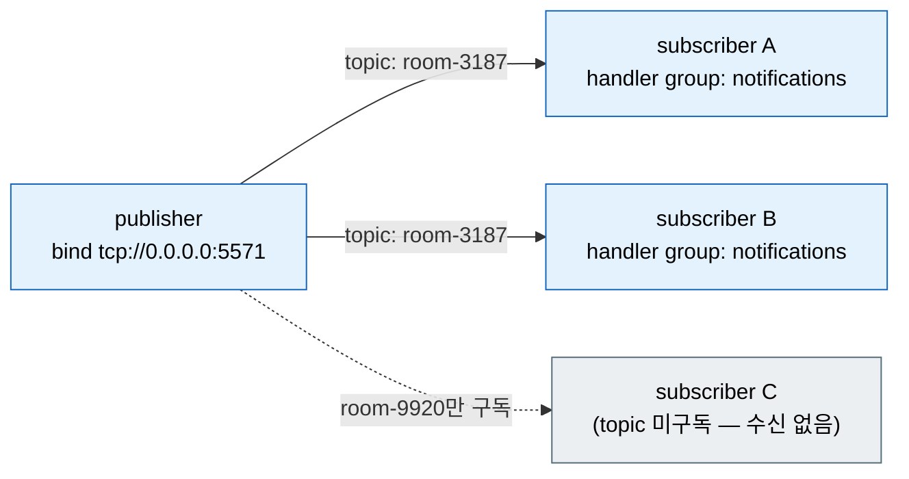

[← 목차](./README.ko.md)

# 7. 채널 메시징

## 1. 채널이 하는 일

채널은 이름을 가진 메시징 경로다. 서버 프로세스끼리 typed 메시지를 주고받는
기본 수단이며, endpoint 연결·재접속·직렬화·디스패치는 런타임이 처리한다.

| 종류 | 선언 | 패턴 |
|------|------|------|
| client/server | `add_client_server_channel(name)` | request-reply, 단방향 send |
| fanout | `add_fanout_channel(name)` | publisher → 다수 subscriber (topic) |
| dealer mesh | `add_dealer_mesh_channel(name)` | 동격 노드 간 분산 |
| route mesh | `add_route_mesh_channel(name)` | SPOT 라우팅 백본 ([8장](./08-spot.ko.md)) |

## 2. 서버 쪽: 핸들러 그룹과 채널

핸들러([3장 §4](./03-concepts.ko.md))를 그룹에 등록하고, 채널이 그룹을 가져다
쓴다.

```cpp
app.add_zlink_framework ([&] (zlink::framework::zlink_framework_options_t &options) {
    options.handlers ()
      .add<create_game_handler_t> ("play")
      .add<ensure_player_actor_handler_t> ("play");

    options.codecs ()
      .add_message_pack ()
      .add_message_pack<create_game_req_t> ()
      .add_message_pack<create_game_res_t> ();

    options.add_client_server_channel ("tictactoe.play")
      .enable_server ("tcp://0.0.0.0:5561")
      .use_handler_group ("play");
});
```

- **codec** — 채널 메시지의 직렬화 형식. `add_json()` / `add_message_pack()` /
  `add_protobuf()` 중 선택하고, message_pack은 DTO별 typed 등록
  (`add_message_pack<T>()`)을 함께 한다.
- 같은 그룹을 여러 채널이 공유할 수 있고, 한 채널에 그룹 하나를 연결한다.

위 선언이 만들어 내는 것:



채널 이름(`tictactoe.play`)이 양쪽을 잇는 키다. 서버는 endpoint에 bind하고
그룹의 핸들러로 디스패치하며, 클라이언트는 같은 이름으로 연결해 typed 요청을
보낸다.

## 3. 클라이언트 쪽: channel_client_t

요청을 보내는 프로세스는 채널을 client로 연결하고, `channel_client_t`를
주입받아 호출한다.

```cpp
options.add_client_server_channel ("tictactoe.play")
  .enable_client ("tcp://10.30.1.15:5561");   // endpoint 직접 지정
// 또는 registry discovery로 endpoint를 찾게 한다 (11장)
options.add_client_server_channel ("tictactoe.play").enable_client ();
```

`channel_client_t`는 DI 서비스다 — 핸들러의 `dependency_types`로 받는다.

```cpp
class create_game_http_handler_t
{
  public:
    using dependency_types =
      zlink::framework::dependency_list_t<zlink::framework::channel_client_t>;
    explicit create_game_http_handler_t (zlink::framework::channel_client_t &client) :
        _client (client) {}

    zlink::framework::task_t<create_game_http_res_t>
    handle (const create_game_http_req_t &request)
    {
        auto room = co_await _client
                      .request<create_game_res_t> ("tictactoe.play",
                                                   create_game_req_t{request.game_name})
                      .async ();
        co_return create_game_http_res_t{room.room_id, room.game_name};
    }
    // ...
};
```

### call 표면

| facade | 호출 | 의미 |
|--------|------|------|
| `channel_client_t` | `request<TReply>(channel, req)` | request-reply. `co_await ....async()`로 typed 응답 |
| `publisher_t` | `publish(channel, topic, event)` | fanout 채널로 topic publish (§4) |
| `message_bus_t` | `send(channel, msg)` | 응답 없는 단방향 전송 (advanced — `app.advanced().use_zlink`의 builder에서 `message_bus()`로 획득) |

`channel_client_t`는 DI로 주입받고, `publisher_t`/`message_bus_t`는
`zlink_builder_t`(`publisher()`/`message_bus()`)에서 얻는다.

call 객체에는 전송 전에 옵션을 얹을 수 있다.

```cpp
auto reply = co_await _client
               .request<create_game_res_t> ("tictactoe.play", create_game_req_t{name})
               .timeout (std::chrono::seconds (2))
               .metadata ("trace-id", trace_id)
               .async ();
```

request 한 번의 전체 흐름 — 디코딩/인코딩과 핸들러 호출은 런타임이 처리하고,
양쪽 application 코드는 typed DTO만 본다.



실패는 `co_await`에서 `framework_exception_t`로 던져진다 —
에러 처리는 [3장 §5](./03-concepts.ko.md)와 동일 모델이다.

## 4. dealer mesh: 외부 로드밸런서 없이 수평 확장

처리량을 늘리고 싶을 때 같은 채널에 서버 인스턴스를 추가하면 된다. 별도 nginx·HAProxy 없이 클라이언트 요청이 자동으로 분산된다.

```cpp
// 이미지 처리 서버 A
options.add_dealer_mesh_channel ("image.resize")
    .enable_server ("tcp://0.0.0.0:5600")
    .use_handler_group ("resize");

// 이미지 처리 서버 B — 동일 채널, 다른 프로세스
options.add_dealer_mesh_channel ("image.resize")
    .enable_server ("tcp://0.0.0.0:5601")
    .use_handler_group ("resize");
```

```cpp
// 클라이언트: 두 서버에 연결. 요청은 라운드로빈으로 분산됨
options.add_dealer_mesh_channel ("image.resize")
    .enable_client ()
    .connect ("tcp://10.30.1.10:5600")
    .connect ("tcp://10.30.1.10:5601");

// 또는 discovery로 자동 발견 — 서버가 추가될 때 클라이언트 재시작 불필요
options.add_dealer_mesh_channel ("image.resize")
    .enable_client ()
    .use_discovery ();   // registry에서 같은 채널의 서버 목록을 받아 자동 연결
```



핸들러는 client/server 채널과 동일한 구조다 — `request_type`/`reply_type`/`topic_name` + `handle()`. 채널 선언만 `add_dealer_mesh_channel`로 바꾸면 된다.

> **route mesh와 차이**: dealer mesh는 어느 서버에나 요청을 보낼 수 있는 stateless 서비스에 적합하다. 특정 엔티티(주문 ID, 사용자 ID 등)가 항상 같은 서버로 가야 한다면 route mesh([§6](#6-route-mesh-고급))를 쓴다.

## 5. fanout: publish/subscribe

알림처럼 한 곳에서 여러 구독자로 흘리는 메시지는 fanout 채널을 쓴다.

```cpp
// publisher 쪽 채널 선언
options.add_fanout_channel ("bingo.notifications")
  .enable_publisher ("tcp://0.0.0.0:5571");

// 보내기 — publisher_t로 topic 단위 publish
co_await publisher.publish ("bingo.notifications", "room-3187",
                            number_drawn_notify_t{state}).async ();

// subscriber 쪽 — 핸들러 그룹으로 받는다
options.handlers ().add<number_drawn_handler_t> ("notifications");
options.add_fanout_channel ("bingo.notifications")
  .use_handler_group ("notifications");
```

`publisher_t`를 얻는 경로는 두 가지다 — spot 코드라면 노드에
`attach_publisher(channel)`를 걸고 spot 쪽에서 주입받는 패턴([8장 §6](./08-spot.ko.md)),
일반 코드라면 `app.advanced().use_zlink([&](auto &z){ auto pub = z.publisher(); ... })`.



## 6. route mesh (고급)

SPOT 노드 간 라우팅 백본이 필요할 때만 쓴다. TicTacToe Play 서버의 실제 선언:

```cpp
options.add_route_mesh_channel ("tictactoe.router")
  .bind (topology.play_router_endpoint)
  .set_routing_id (topology.play_rid)
  .connect (topology.play_router_endpoint)
  .enable_spot_route_egress ("tictactoe.game.discovery");
```

SPOT과의 결합은 [8장](./08-spot.ko.md)의 `accept_routes_from_channel`에서
이어진다.

[다음: SPOT →](./08-spot.ko.md)
