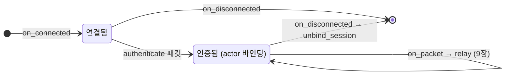

[← 목차](./README.ko.md)

# 10. Stream

## 1. stream이 하는 일

stream은 **게임 클라이언트 같은 외부 접속자를 받는 양방향 연결**이다. 채널이
서버 간 메시징이라면, stream은 서버-클라이언트 경계다. 서버 쪽은 stream
node + session으로 받고, 클라이언트 쪽은 별도 산출물인 **stream connector**로
접속한다.

```text
게임 클라이언트 ──(stream connector)──▶ stream node ──▶ session ──▶ actor/spot
```

## 2. 서버: stream node 선언

```cpp
options.add_stream_node ("tictactoe.stream")
  .bind (topology.stream_endpoint)            // 예: tcp://0.0.0.0:5581
  .register_session<play_session_t> ()
  .attach_actor_gateway ("tictactoe.spot.node");   // actor 경로 연결 (9장)
```

| 빌더 | 의미 |
|------|------|
| `bind(endpoint)` | 클라이언트 접속을 받을 endpoint |
| `register_session<T>()` | 연결당 생성될 session 타입 |
| `attach_actor_gateway(spot_node)` | 세션 actor를 spot 노드로 잇기 |

## 3. session 작성

연결 하나마다 session 인스턴스가 하나 만들어진다.
`packet_stream_session_t`를 상속하고 4개 훅을 구현한다. DI는 핸들러와 같은
`dependency_types` 방식이다.

```cpp
class play_session_t final : public zlink::framework::packet_stream_session_t
{
  public:
    using dependency_types =
      zlink::framework::dependency_list_t<zlink::framework::session_actor_manager_t,
                                          authenticate_play_session_handler_t>;

    play_session_t (zlink::framework::session_actor_manager_t &actors,
                    authenticate_play_session_handler_t &authenticate);

    zlink::framework::task_t<void> on_connected (zlink::framework::stream_t &) override;
    zlink::framework::task_t<void> on_disconnected (zlink::framework::stream_t &) override;
    zlink::framework::task_t<void> on_error (zlink::framework::stream_t &,
                                             const zlink::framework::stream_error_t &) override;
    zlink::framework::task_t<void> on_packet (zlink::framework::stream_t &stream,
                                              const zlink::framework::stream_header_t &header,
                                              const zlink::message_t &payload) override;
};
```

| 훅 | 시점 |
|----|------|
| `on_connected(stream)` | 연결 수립 |
| `on_packet(stream, header, payload)` | 패킷 수신 — `header.packet_name()`으로 분기 |
| `on_error(stream, error)` | 전송 오류 |
| `on_disconnected(stream)` | 연결 종료 — actor unbind 등 정리 |



전형적인 `on_packet` 패턴은 [9장 §4](./09-actor-session.ko.md)에 있다:
인증 패킷이면 인증 → actor 바인딩, 그 외에는 바인딩된 actor로
`relay(header, payload)`.

동기 완료만 필요한 훅은 완료된 task를 바로 돌려준다.

```cpp
zlink::framework::task_t<void> on_connected (zlink::framework::stream_t &) override
{
    return zlink::framework::task_t<void> (zlink::framework::result_t<void>::success ());
}
```

서버에서 클라이언트로 직접 쓰기는 `stream_t`의 write call을 쓴다.

```cpp
co_await stream.write_packet (header, payload).async ();          // 새 패킷 전송
co_await stream.reply_packet (request_header, payload).async ();  // 요청에 대한 응답
```

## 4. 클라이언트: stream connector

클라이언트 쪽 접속은 `zlink::stream_connector` 산출물이 담당한다 — 프레임워크
서버 가이드 범위 밖이므로 여기서는 접점만 짚는다.

```cpp
// TicTacToe 클라이언트 시나리오의 실제 흐름 (요약)
auto client = /* stream connector 생성, room.play_endpoint로 접속 */;
auto auth = co_await client.request<authenticate_res_t> (authenticate_req_t{token});
client.wait_for<game_state_notify_t> (...);   // 서버 알림 수신
```

connector의 계약과 사용법은
[stream connector 문서](../../connector/doc/draft/cpp-stream-connector.ko.md)를
본다. 동작 예제는 `samples/TicTacToe/Client`가 정본이다.

## 5. 패킷 계약

stream 패킷도 채널 메시지와 같은 typed DTO(`packet_name`)다. 서버 session은
`header.packet_name()`으로 어떤 DTO인지 식별하고, payload를 해당 타입으로
디코딩한다. spot까지 relay되는 패킷은 spot의
`add_actor_packet<&T::method>()` 등록과 만나 typed 핸들러로 디스패치된다
([8장 §3](./08-spot.ko.md)).

[다음: Registry →](./11-registry.ko.md)
