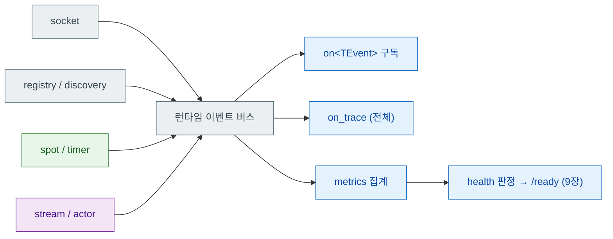

[← 목차](./README.ko.md)

# 11. Monitoring

관측은 네 갈래다 — 로그, 런타임 이벤트, 메트릭, health. 각각 `app.logging()`,
`app.monitoring()`, `app.metrics()`, `app.health()`로 구성한다.

## 1. 로깅

```cpp
app.logging ().use_file ("match-api.log");
```

코드에서 로그를 남길 때는 `logger_t<TOwner>`를 DI로 받는다. 소유 타입이 로그
소스 이름이 된다.

```cpp
class create_game_http_handler_t
{
  public:
    using dependency_types =
      zlink::framework::dependency_list_t<
        zlink::framework::logger_t<create_game_http_handler_t>>;

    explicit create_game_http_handler_t (
      zlink::framework::logger_t<create_game_http_handler_t> &logger) : _logger (logger) {}

    reply_type handle (const request_type &request)
    {
        _logger.info ("http POST /games");
        // ...
    }
};
```

## 2. 런타임 이벤트

런타임 내부에서 일어나는 일(소켓 연결, discovery 변화, spot 입퇴장, timer
지연 등)은 이벤트로 노출된다. 소스별로 켜고, typed 핸들러로 받는다.

```cpp
app.monitoring ()
  .add_socket_events ("match-api")
  .add_registry_events ("match-api", std::chrono::seconds (5))   // 수집 주기
  .add_spot_events ("match-api", std::chrono::seconds (5))
  .add_spot_timer_events ("match-api")
  .add_stream_events ("match-api")
  .add_actor_events ("match-api");

// typed 구독
app.monitoring ().on<zlink::framework::timer_failure_event_t> (
  [] (const zlink::framework::timer_failure_event_t &event) {
      alert ("spot timer failed: " + event.timer_name + " — " + event.message);
  });

// 전체 trace (디버깅용)
app.monitoring ().on_trace ([] (const zlink::framework::runtime_event_base_t &event) {
    /* 모든 런타임 이벤트 */
});
```

| 소스 등록 | 내용 |
|-----------|------|
| `add_socket_events(name)` | 연결/해제/재시도 |
| `add_discovery_events(name)` | discovery 변화 |
| `add_registry_events(name, interval)` | registry 등록/해제/질의 (interval = 수집 주기) |
| `add_spot_events(name, interval)` | spot 생성/입장/퇴장 |
| `add_spot_timer_events(name)` | timer tick 지연/실패 (`timer_tick_t`, `timer_failure_event_t`) |
| `add_stream_events(name)` | stream 연결 수명 |
| `add_actor_events(name)` | actor 바인딩/해제 |



## 3. health

health check를 등록하고, HTTP로 노출한다([9장 §3](./09-http-hosting.ko.md)).

```cpp
app.health ()
  .add_zlink_runtime_check ()                 // 기본 이름 "zlink.runtime"
  .add_channel_check ("bingo.play")
  .add_registry_check ("bingo.registry");

app.add_zlink_framework ([&] (zlink::framework::zlink_framework_options_t &options) {
    options.http ()
      .listen ("http://0.0.0.0:8080")
      .map_health ("/healthz")
      .map_readiness ("/ready")
      .map_liveness ("/live");
});
```

```bash
$ curl -s http://127.0.0.1:8080/ready
{"status":"healthy","readiness":"healthy","liveness":"healthy"}
```

readiness가 unhealthy면 로드밸런서/오케스트레이터가 트래픽을 빼도록 연결하는
것이 운영 관례다.

## 4. 메트릭

```cpp
app.metrics ().add_runtime_metrics ();                      // 런타임 기본 메트릭
app.metrics ().record_runtime_metric ("games.active", 42.0,
                                      {{"region", "kr"}});  // (name, value, tags)
```

런타임 메트릭은 이벤트 버스 위에 집계되며, 외부 수집기 연동은 `on<TEvent>`
구독으로 내보낸다.

[다음: 인터페이스 카탈로그 →](./12-interface-catalog.ko.md)
