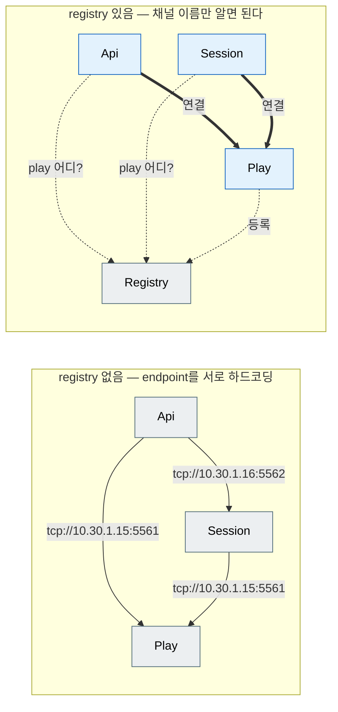
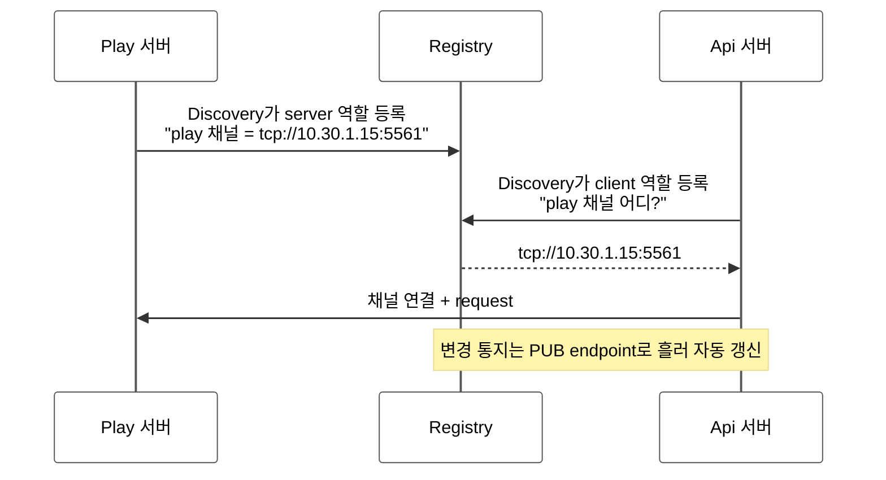

[← 목차](./README.ko.md)

# 11. Registry

## 1. registry가 하는 일

registry는 **노드들이 서로의 주소를 찾는 이름 서비스**다. registry가 없으면
모든 채널 client에 상대 endpoint를 직접 적어야 한다. registry를 두면 서버는
자기 endpoint를 등록(publish)하고, 클라이언트는 채널 이름만으로 상대를 찾는다.

registry가 없을 때와 있을 때 — 토폴로지가 그물에서 별형으로 바뀐다.





## 2. registry 서버 띄우기

registry는 전용 프로세스로 띄울 수도 있고, 서비스 프로세스에 함께 넣을 수도 있다.
`enable_registry(pub, router)`는 현재 프로세스 안에 registry runtime을 켠다. 아래처럼
registry만 가진 앱을 따로 띄우면 standalone registry 서버가 된다.

```cpp
app.add_zlink_framework ([&] (zlink::framework::zlink_framework_options_t &options) {
    options.enable_registry (topology.registry_pub_endpoint,       // 변경 통지(pub)
                             topology.registry_router_endpoint);   // 질의/등록(router)
});
```

저수준 `registry_builder_t`를 직접 쓰면 `registry_id`, `bind(pub, router)`,
`heartbeat_interval`, `heartbeat_timeout`, `broadcast_interval`, `add_peer(pub)`를
설정한다. 기본 heartbeat는 1초 간격, 3초 timeout, 1초 broadcast다. C++ framework에는
별도 clustering API가 없으므로 registry끼리 묶을 때도 `add_peer(pub_endpoint)`만 쓴다.

## 3. 소비자: discovery 연동

registry를 쓰는 모든 프로세스는 discovery에 registry endpoint를 알려 준다.

```cpp
options.use_discovery ().add_registry_endpoint (topology.registry_router_endpoint);
```

이 편의 API는 내부적으로 `discovery_builder_t::connect_registry(endpoint)`에 연결된다.
그 다음부터 endpoint 생략 형태가 동작한다.

```cpp
// 서버 쪽 — enable_server는 그대로. 등록은 discovery가 처리
options.add_client_server_channel ("bingo.play")
  .enable_server (topology.play_channel_endpoint)
  .use_handler_group ("play");

// 클라이언트 쪽 — endpoint 없이 채널 이름만으로 연결
options.add_client_server_channel ("bingo.api").enable_client ();
```

`enable_client()`(무인자)가 discovery 모드다. endpoint를 직접 주는
`enable_client("tcp://...")`와 같은 채널에서 혼용하지 않는다.

## 4. SPOT과 discovery

spot mesh는 discovery 채널 이름으로 노드들을 발견한다([8장 §2](./08-spot.ko.md)).

```cpp
options.add_spot_mesh ("bingo.room.discovery")    // 이 이름이 discovery 채널
  .add_node ("bingo.room.node")
  .enable_router (topology.play_spot_router_endpoint, topology.play_rid)
  .enable_pub_sub (topology.play_spot_endpoint)
  // ...
```

spot의 원격 주소를 registry에서 받도록 하려면:

```cpp
options.use_registry_spot_remote_addresses ();
// 또는 라우트 채널 지정
options.use_registry_spot_remote_addresses ("bingo.room.routes");
```

## 5. 점검

- 같은 프로세스 안에서 registry 상태를 확인할 때는 `registry_query_t`를 쓴다.
  `status()`, `service_summary([filter])`, `topology([filter])`,
  `member_peers(channel)`, `resolve_spot_remote_address(spot_rid)`가 공개 표면이다.
  `member_peers(channel)`의 결과 타입은 `member_peer_t{channel_name, node_name, endpoint}`다.
- 별도 프로세스에서 registry topology만 조회할 때는 `registry_query_client_t`를 쓴다.
  `connect(options|endpoint)`, `topology([filter])`, `close()`만 제공한다.
- topology 항목의 출처는 `topology_source_t::embedded` 또는 `topology_source_t::remote`로
  나타난다. 역할 값은 `service_role_t::{server, client, publisher, subscriber,
  spot_node, stream_endpoint}`다.
- registry 상태 check를 health에 올릴 수 있다 —
  [12장 §3](./12-monitoring.ko.md)의 `add_registry_check`.
- registry 이벤트(등록/해제/조회) 관측은 `add_registry_events` —
  [12장 §2](./12-monitoring.ko.md).
- 동작 예제: `samples/Bingo`는 registry 프로세스와 `use_discovery()`를 포함한
  4-서버 토폴로지의 기준이다. 일부 channel client는 endpoint를 직접 넘기므로,
  자동 endpoint 생략 예와 구분해서 본다([14장](./14-samples-map.ko.md)).

[다음: Monitoring →](./12-monitoring.ko.md)
