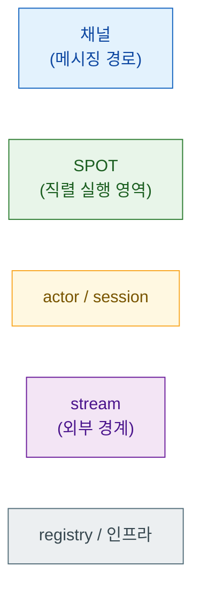

# ZLink Framework C++ — 사용자 가이드

이 가이드는 `zlink::framework`로 서버 시스템을 작성하는 데 필요한 내용을
**이 문서 묶음 안에서** 모두 다루는 것을 목표로 한다. zlink core 라이브러리
문서를 먼저 읽지 않아도 된다 — 필요한 코어 개념은 각 장이 직접 설명한다.

```cpp
#include <zlink/framework.hpp>

int main (int argc, char **argv)
{
    auto app = zlink::framework::app_t::create ();
    app.add_zlink_framework ([] (zlink::framework::zlink_framework_options_t &options) {
        options.http ()
          .listen ("http://0.0.0.0:8080")
          .map_post<create_game_http_handler_t> ("/games");
    });
    return app.run (argc, argv);
}
```

## 목차

| 장 | 문서 | 내용 |
|----|------|------|
| 1 | [개요](./01-overview.ko.md) | 프레임워크의 정체성, 코어 개념 요약, 기능 지도 |
| 2 | [시작하기](./02-getting-started.ko.md) | CMake 연동, 첫 앱, 핸들러 작성, 실행과 확인 |
| 3 | [핵심 개념](./03-concepts.ko.md) | app 수명주기, DI, 핸들러 모델, 실행 모델 |
| 4 | [Configuration](./04-configuration.ko.md) | 설정 소스(cli/env/json), 우선순위, section/bind |
| 5 | [채널 메시징](./05-channel-messaging.ko.md) | request-reply, fanout, dealer mesh, channel client |
| 6 | [SPOT](./06-spot.ko.md) | room/stage/zone, publish/subscribe, timer |
| 7 | [Actor · Session](./07-actor-session.ko.md) | actor manager, session actor, gateway relay |
| 8 | [Stream](./08-stream.ko.md) | stream session, stream connector |
| 9 | [HTTP Hosting](./09-http-hosting.ko.md) | embedded HTTP server, route handler |
| 10 | [Registry](./10-registry.ko.md) | registry runtime, discovery |
| 11 | [Monitoring](./11-monitoring.ko.md) | events, metrics, health |
| 12 | [인터페이스 카탈로그](./12-interface-catalog.ko.md) | 핸들러/옵션 표면 레퍼런스 |
| 13 | [샘플 지도](./13-samples-map.ko.md) | TicTacToe · Bingo 샘플과 기능 매핑 |

## 다이어그램 읽는 법

이 가이드의 모든 다이어그램은 같은 시각 언어를 쓴다 — 색이 곧 개념이다.



여러 장이 같은 TicTacToe/Bingo 토폴로지를 그리며, 장마다 확대 위치만 바뀐다 —
1장에서 전체 지도를 보고, 각 기능 장에서 그 일부를 확대해 들어간다.

## 관련 문서

- HTTP **client**(요청을 보내는 쪽)는 별도 산출물이다 —
  [zlink::http_client 사용자 가이드](../../http-client/doc/README.ko.md)
- 공식 계약 문서는 [doc/spec/](../README.ko.md)에 있다.
  계약과 가이드가 다르면 코드와 spec이 정답이다.
