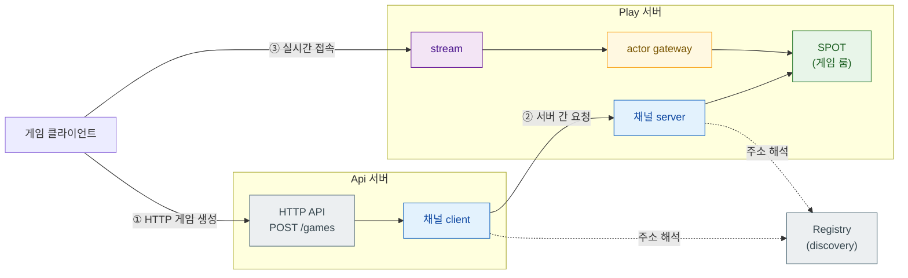
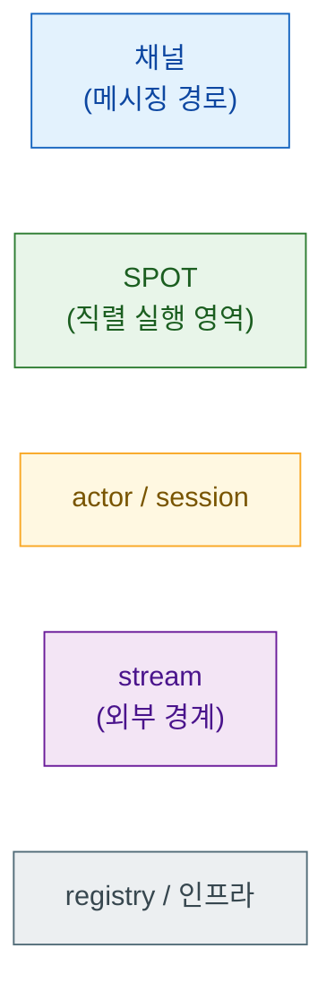

# ZLink Framework C++ — 사용자 가이드

실시간 멀티플레이어 게임 서버, 이벤트 기반 분산 서버 시스템처럼 **여러 서버
프로세스가 협력하는 시스템**을 만드는 C++ 애플리케이션 프레임워크다.

```cpp
#include <zlink/framework.hpp>

int main (int argc, char **argv)
{
    auto app = zlink::framework::app_t::create ();
    app.add_zlink_framework ([] (zlink::framework::zlink_framework_options_t &options) {
        options.http ()
          .listen ("http://0.0.0.0:8080")
          .map_post<create_game_http_handler_t> ("/games");
    });
    return app.run (argc, argv);
}
```

핸들러 클래스 하나를 등록하면 메시지 디코딩·라우팅·인코딩은 프레임워크가 처리한다.
실제 서버는 여기에 서버 간 메시징, 게임 룸 관리, 클라이언트 연결, 서비스
디스커버리가 더해진 구성이다.

---

## 이 프레임워크로 무엇을 만드는가

전형적인 배치는 복수의 서버 프로세스가 역할을 나눠 협력하는 구조다.



각 서버 프로세스는 독립 실행 파일이고, 서로 TCP로 연결된다. 하나의 서버 안에
HTTP 입구, 다른 서버와의 통신 경로, 클라이언트 연결, 게임 룸 상태 관리가
모두 동거한다. `samples/TicTacToe`(2개 서버)와 `samples/Bingo`(4개 서버)가
이 구조의 동작하는 완전한 예제다.

---

## 핵심 기능

### 채널 메시징 — 서버 간 typed 요청-응답

채널은 서버 사이의 통신 경로에 이름을 붙인 것이다. 한쪽이 채널 이름으로 요청을
보내면 반대편이 처리해 응답한다. struct를 그대로 주고받으며 직렬화(JSON /
MessagePack / Protobuf)는 프레임워크가 처리한다.

```cpp
// 보내는 쪽 (채널 클라이언트)
auto result = co_await _client
    .request<create_game_res_t> ("tictactoe.play",
                                  create_game_req_t{request.game_name})
    .async ();

// 받는 쪽 (채널 서버의 핸들러)
class create_game_handler_t {
  public:
    using request_type = create_game_req_t;
    using reply_type   = create_game_res_t;
    static constexpr const char *topic_name = "CreateGame";
    create_game_res_t handle (const create_game_req_t &req) { ... }
};
```

request-reply 외에 fanout(pub/sub)과 dealer mesh(부하 분산) 패턴도 제공한다.
[5장 →](./05-channel-messaging.ko.md)

---

### SPOT — 게임 룸·스테이지 상태를 락 없이 관리

SPOT은 게임 룸, 스테이지, 구역처럼 "장소" 하나의 상태와 참가자를 묶는 실행
단위다. 한 SPOT 안에서 일어나는 모든 것 — 플레이어 패킷, 타이머, 입퇴장 —
은 **직렬로** 처리된다. 락 없이 룸 상태에 접근할 수 있고, 코루틴으로 비동기
처리를 써도 같은 룸에 두 요청이 겹치지 않는다.

```cpp
class tictactoe_game_spot_t : public zlink::framework::spot_t,
                               public tictactoe_match_t   // 게임 상태 직접 소유
{
  public:
    void configure (zlink::framework::spot_context_t &context)
    {
        context.handlers ().add_actor_packet<&tictactoe_game_spot_t::place_mark> ();
    }

    place_mark_res_t place_mark (const player_actor_t &actor,
                                 const zlink::framework::spot_actor_request_context_t &,
                                 const place_mark_req_t &request)
    {
        return place (actor.actor_id, request);   // std::mutex 없이 안전
    }
};
```

매칭·룸 배정을 담당하는 entry spot(노드당 1개)과 게임 룸 본체인 room spot(룸마다
1개)으로 나뉜다. 주기 작업은 timer로 등록한다. [6장 →](./06-spot.ko.md)

---

### Stream + Actor — 클라이언트 실시간 연결

게임 클라이언트가 서버에 접속하는 양방향 연결을 **stream**이라 하고, 연결 하나를
대표하는 서버 쪽 객체가 **actor**다. 클라이언트가 접속하면 session이 actor를
생성하고, actor는 SPOT에 입장해 게임에 참여한다.

```cpp
class play_session_t : public zlink::framework::packet_stream_session_t {
  public:
    task_t<void> on_packet (stream_t &stream,
                            const stream_header_t &header,
                            const message_t &payload) override
    {
        co_await _actors.relay (header, payload);   // actor → SPOT으로 전달
    }
};
```

클라이언트 쪽 접속은 별도 산출물인 stream connector가 담당한다.
[7장 →](./07-actor-session.ko.md) · [8장 →](./08-stream.ko.md)

---

### HTTP Hosting — 서버 프로세스 안에 REST API 내장

별도 웹 서버 없이 같은 프로세스 안에 REST endpoint를 올린다. 경로 파라미터,
인증, TLS를 지원하며 readiness / liveness / health check endpoint도 한 줄로
등록한다.

```cpp
options.http ()
  .listen ("https://0.0.0.0:8443")
  .configure_tls (tls_cert, tls_key)
  .map_post<create_game_http_handler_t> ("/games")
  .map_get<get_room_http_handler_t> ("/rooms/{room_id}")
  .map_readiness ("/ready");
```

[9장 →](./09-http-hosting.ko.md)

---

### Configuration · DI · Logging · Monitoring

운영 서버에 필요한 부속을 내장한다.

- **Configuration** — CLI 인자, 환경 변수, JSON 파일을 우선순위 순서로 합성.
  `bind<T>()` 한 번으로 설정 섹션을 struct에 매핑한다.
- **DI 컨테이너** — `dependency_types` 선언만으로 핸들러 생성자에 서비스가
  자동 주입된다. singleton / scoped / transient 수명을 지원한다.
- **Logging** — `logger_t<TOwner>` DI로 받아 소스 이름이 자동 태그된 로그를
  남긴다.
- **Monitoring / Health** — 소켓·discovery·spot·타이머 이벤트를 typed 구독으로
  받는다. `/ready`, `/healthz` endpoint에 health check를 연결한다.

[3장 →](./03-concepts.ko.md) · [4장 →](./04-configuration.ko.md) · [11장 →](./11-monitoring.ko.md)

---

### Registry / Discovery — 서버 주소 자동 연결

여러 Play 서버 인스턴스가 뜰 때 어느 서버로 연결할지, endpoint를 코드에
하드코딩하지 않는다. Registry 서버가 주소를 관리하고, 각 서버는
`use_discovery()`로 동적으로 찾는다.

```cpp
options.add_spot_mesh ("bingo.room.discovery")
  .use_discovery ()           // registry에서 노드 주소를 자동으로 받아온다
  .add_entry_spot<bingo_entry_spot_t> ()
  .add_spot<bingo_room_spot_t> ("bingo.room");
```

[10장 →](./10-registry.ko.md)

---

## 목차

| 장 | 문서 | 내용 |
|----|------|------|
| 1 | [개요](./01-overview.ko.md) | 전체 기능 지도, 산출물 정보 |
| 2 | [시작하기](./02-getting-started.ko.md) | CMake 연동, 첫 앱, 핸들러 작성, 실행과 확인 |
| 3 | [핵심 개념](./03-concepts.ko.md) | app 수명주기, DI, 핸들러 모델, 실행 모델 |
| 4 | [Configuration](./04-configuration.ko.md) | 설정 소스(cli/env/json), 우선순위, section/bind |
| 5 | [채널 메시징](./05-channel-messaging.ko.md) | request-reply, fanout, dealer mesh, channel client |
| 6 | [SPOT](./06-spot.ko.md) | room/stage/zone, 직렬 실행, timer |
| 7 | [Actor · Session](./07-actor-session.ko.md) | actor manager, session actor, gateway relay |
| 8 | [Stream](./08-stream.ko.md) | stream session, stream connector |
| 9 | [HTTP Hosting](./09-http-hosting.ko.md) | embedded HTTP server, route handler |
| 10 | [Registry](./10-registry.ko.md) | registry runtime, discovery |
| 11 | [Monitoring](./11-monitoring.ko.md) | events, metrics, health |
| 12 | [인터페이스 카탈로그](./12-interface-catalog.ko.md) | 핸들러/옵션 표면 레퍼런스 |
| 13 | [샘플 지도](./13-samples-map.ko.md) | TicTacToe · Bingo 샘플과 기능 매핑 |

---

## 다이어그램 읽는 법

이 가이드의 모든 다이어그램은 같은 시각 언어를 쓴다 — 색이 곧 개념이다.



여러 장이 같은 TicTacToe/Bingo 토폴로지를 그리며, 장마다 확대 위치만 바뀐다.

## 관련 문서

- HTTP **client**(요청을 보내는 쪽)는 별도 산출물이다 —
  [zlink::http_client 사용자 가이드](../../http-client/doc/README.ko.md)
- 공식 계약 문서는 [doc/spec/](../README.ko.md)에 있다.
  계약과 가이드가 다르면 코드와 spec이 정답이다.
