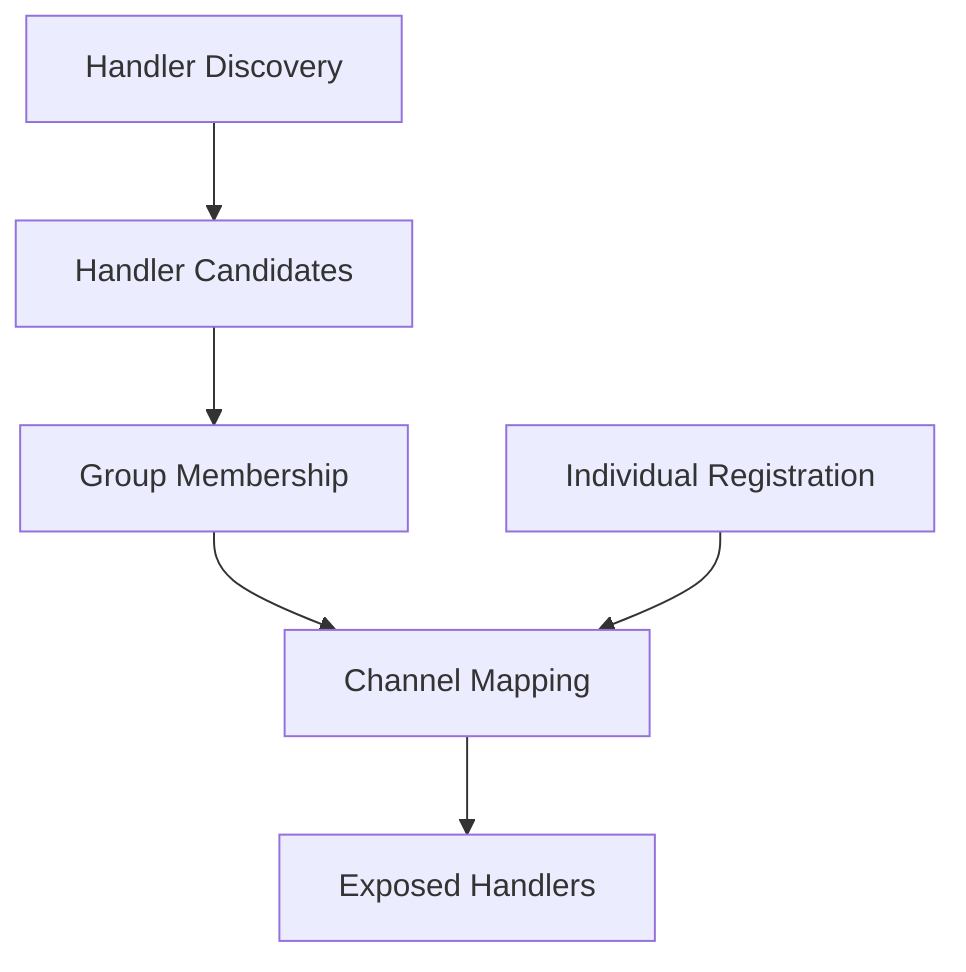

<!-- framework-adapter-nav:start -->
[문서 목록](../README.ko.md) | [이전: Draft -- ZLink Framework .NET Session-Attached Actor Route](./session-attached-actor-route.ko.md)
<!-- framework-adapter-nav:end -->

[.NET 묶음](../README.ko.md) | [channel](../spec/aspnet-core-channel-messaging.ko.md) | [SPOT](../spec/aspnet-core-spot.ko.md) | [인터페이스](../spec/handler-interfaces.ko.md) | [Behavior Matrix](../internals/behavior-matrix.ko.md) | [Regression Matrix](../internals/regression-test-matrix.ko.md)

# Draft -- ZLink Framework .NET Channel Handler Exposure And SPOT Route Transport

> 이 문서는 **구현 전 초안**이다.
> 아직 공개 계약[^public-contract]이 아니며, channel handler 노출 정책과
> `AcceptSpotRoutesFromChannel(...)`의 transport 의미를 분리해서 정리한다.

## 1. 목적

`.NET` framework 에는 channel 을 구성할 때 서로 다른 두 축이 함께 보인다.

1. 어느 application handler 를 어느 channel 에 노출할지 정하는 축
2. 어떤 router-capable channel 을 SpotNode router 와 연결할지 정하는 축

두 축은 사용자가 보는 코드에서 가까운 위치에 나타난다. 하지만 의미는 다르다.
`channel.MapHandlerGroup("api")`와 `channel.Add...Handler(...)`는 handler 노출 범위를
정한다.
`node.AcceptSpotRoutesFromChannel("play.route")`는 해당 channel 로 들어온 routed Spot
message 를 SpotNode router 로 전달할 수 있게 ingress transport 연결을 만든다.

현재 구현은 두 축을 충분히 분리하지 못한다. 특히 channel 에 handler group 이 하나도
매핑되지 않았을 때 application handler 후보가 전부 열린 것처럼 dispatch 될 수 있다.
이 동작은 사용자가 기대하는 opt-in 모델과 반대다.

이 초안의 목표는 다음 다섯 가지다.

1. handler discovery 와 handler exposure 를 분리한다.
2. handler exposure 설정이 없는 channel 은 application handler 를 하나도 노출하지 않도록
   정한다.
3. `AcceptSpotRoutesFromChannel(...)`을 handler mapping 과 무관한 router transport
   ingress 연결로 고정한다.
4. routed Spot send/request 는 caller 가 사용할 local egress channel 을 명시하는 outbound
   표면으로 정한다.
5. messaging client interface 를 channel, fanout, routed Spot 용도로 나누어 정한다.

## 2. 용어

### 2.1 handler discovery

handler discovery 는 assembly scan 으로 handler 후보를 찾는 단계다.

```csharp
builder.Services.AddZLinkFramework(options =>
{
    options.AddHandlersFromAssemblyOf<Program>();
});
```

이 호출은 handler type 과 endpoint descriptor 후보를 framework registration 에
올린다. 하지만 이 단계만으로 특정 channel 에 handler 가 공개되면 안 된다.
discovery 는 "찾았다"는 뜻이지 "열었다"는 뜻이 아니다.

### 2.2 handler group

handler group 은 handler class 에 붙는 논리 묶음 이름이다.

```csharp
[ZLinkHandlerGroup("api")]
public sealed class AuthenticatePlayerHandler
{
    [ZLinkRequest]
    public ValueTask<AuthenticatePlayerRes> HandleAsync(
        AuthenticatePlayerReq request,
        ZLinkRequestContext context,
        CancellationToken cancellationToken)
    {
        // ...
    }
}
```

group 이름은 channel 이름이 아니다. `api`, `session.relay`, `admin` 같은 코드
안의 노출 묶음이다. 같은 group 을 여러 channel 에 붙일 수 있고, 한 channel 에 여러
group 을 붙일 수도 있다.

### 2.3 handler exposure

handler exposure 는 channel registration 에서 handler 를 실제 수신 대상에 붙이는 단계다.
두 경로가 있다.

1. `MapHandlerGroup(...)`으로 discovery 된 handler group 을 붙인다.
2. `Add...Handler(...)`로 개별 typed handler 를 직접 붙인다.

```csharp
options.AddClientServerChannel("tictactoe.api", channel =>
{
    channel.EnableServer(server => server.Bind("tcp://0.0.0.0:7101"));
    channel.MapHandlerGroup("api");
    channel.AddRequestHandler<PingHandler, PingReq, PingRes>();
});
```

`MapHandlerGroup("api")`는 다음 뜻이다.

> 이 channel 로 들어온 application packet 은, `api` group 에 속한 handler 후보 중
> packet kind 와 packet name 이 맞는 handler 로만 dispatch 한다.

`AddRequestHandler<PingHandler, PingReq, PingRes>()`는 다음 뜻이다.

> 이 channel 로 들어온 matching request packet 은 `PingHandler`로 dispatch 할 수 있다.

두 경로 중 하나도 없으면 handler 는 그 channel 에 노출되지 않는다.

### 2.4 Spot route transport

Spot route transport 는 channel handler 노출이 아니다.

```csharp
options.AddClientServerChannel("play.route", channel =>
{
    channel.EnableServer(server => server.Bind("tcp://0.0.0.0:7201"));
});

options.AddSpotNode("play-node", node =>
{
    node.EnableRouter();
    node.AcceptSpotRoutesFromChannel("play.route");
});
```

`AcceptSpotRoutesFromChannel("play.route")`는 `play.route` channel 의 router-capable
socket 과 SpotNode router 사이에 peer 연결을 만든다. 그 결과 이 router channel 로
들어온 routed Spot message 가 target Spot 으로 전달될 수 있다.

이 호출은 handler group 을 추가하지 않는다. 반대로 handler group 이 없어도 이 transport
연결은 유효할 수 있다.

## 3. 현재 문제

### 3.1 group 이 없으면 전부 열리는 fallback

현재 dispatch lookup 은 mapped group 이 비어 있을 때 모든 endpoint 후보를 통과시킬 수
있다. 사용자는 `MapHandlerGroup(...)`을 쓰지 않았으므로 아무 handler 도 노출하지
않았다고 이해하기 쉽다. 하지만 실제 dispatch 는 다른 결과를 낼 수 있다.

이 문제는 보안과 운영 양쪽에서 좋지 않다.

- 새 channel 을 테스트용으로 추가했는데 기존 handler 가 갑자기 수신될 수 있다.
- admin handler 와 user handler 가 같은 assembly 에 있으면 channel 을 잘못 연다.
- fanout subscriber 도 group 없이 publish handler 를 받을 수 있어 topic 설계가 흐려진다.
- handler class 에 group attribute 를 붙이는 것과 channel 에 group 을 매핑하는 것의
  차이가 사라져, 사용자가 어떤 코드가 실제 노출인지 추적하기 어렵다.

### 3.2 `AcceptSpotRoutesFromChannel(...)`와 handler mapping 혼동

`AcceptSpotRoutesFromChannel(...)`는 이름만 보면 channel 에 무엇인가를 "수락"하는
설정처럼 보인다. 하지만 수락 대상은 application handler 가 아니라 Spot route transport
다.

이 호출을 handler group 검증 조건과 섞으면 두 문제가 생긴다.

- Spot route transport 전용 channel 에도 의미 없는 `MapHandlerGroup(...)`을 요구하게 된다.
- application handler 가 열려야 하는 channel 인데 `AcceptSpotRoutesFromChannel(...)`이
  있다는 이유로 group 누락을 놓칠 수 있다.

따라서 두 설정은 같은 channel 이름을 공유할 수 있어도 서로의 대체물이 아니다.

### 3.3 channel 별 handler 등록 표면의 레벨 불일치

`AddRouteMeshChannel(...)`에는 현재 일반 channel 처럼 `MapHandlerGroup(...)`가 보이고,
동시에 routed handler 전용 `AddSendHandler(...)`, `AddRequestHandler(...)`도 보인다.

처음에는 route mesh channel 이 `routerChannelId + targetNodeRid`로 특정 node 를 직접
향하는 transport 라는 이유로 group mapping 을 제거하는 방향을 검토했다. 하지만 그렇게
하면 channel 별 handler exposure 표면의 레벨이 맞지 않는다. inbound application handler 를
받을 수 있는 channel 이라면 다음 두 방식이 같은 레벨에서 제공되어야 한다.

- discovery 된 handler group 을 channel 에 노출하는 `MapHandlerGroup(...)`
- 개별 typed handler 를 channel 에 직접 노출하는 `Add...Handler(...)`

다만 모든 channel 이 모든 handler kind 를 받을 수 있는 것은 아니다. channel builder 는
자기 channel type 이 받을 수 있는 handler 등록 method 만 노출해야 한다. group mapping 도
같은 제약을 따른다. 예를 들어 fanout subscriber channel 에 request handler group 을
매핑하거나, client-only dealer mesh channel 에 request handler 를 등록하면 startup
validation 오류로 처리해야 한다.

### 3.4 messaging client 표면이 약하게 보이는 문제

일반 channel handler 에서 다른 channel 로 send/request 하는 기능은 이미 있다.
`IZLinkClient`가 channel name 을 받아 `Send(...)` / `Request(...)`를 제공한다.
이 표면은 client-server channel 의 client capability 와 dealer mesh channel 의 client
capability 를 함께 다룬다. fanout publish 는 `IZLinkFanoutPublisher`와
`IZLinkEventPublisher`가 맡는다.

하지만 문서가 이 관계를 충분히 강하게 말하지 않으면 사용자는 다음처럼 해석하기 쉽다.

- handler group 은 channel 수신만 정하고, 송신은 어디서 해야 하는지 모른다.
- `IZLinkRoutedSpotClient`만 새로 제안되면 channel-to-channel messaging 도 새 interface 가
  필요한 것처럼 보인다.
- `IZLinkSpotClient.SendChannel(...)`과 `IZLinkClient.Send(...)`가 어떤 차이인지 흐려진다.

따라서 draft 는 messaging client 표면을 먼저 정리한 뒤, routed Spot client 를 그 옆에
추가해야 한다.

### 3.5 channel handler 에서 Spot 으로 가는 public client 부재

Spot callback 내부에서는 `IZLinkSpotClient.SendSpot(...)` /
`RequestSpot(...)` 경로가 있다. 이 경로는 current Spot activation 을 전제로 하므로,
일반 channel handler 나 HTTP handler 에서 바로 쓰기 어렵다.

반면 runtime 내부에는 router channel 을 통해 target Spot 으로 send/request 하는 코드가
이미 있다. 외부 application handler 에서 쓰는 public 표면만 분명하지 않다.

여기서 중요한 제약은 caller 가 target Spot 정보만으로 사용할 egress transport 를 찾을 수
없다는 점이다. source process 가 가진 channel 중 어느 channel 이 target SpotNode 쪽과
연결되어 있는지는 route metadata 만으로 안정적으로 역산할 수 없다. 따라서 routed Spot
client 는 target Spot name 으로 transport 를 고르는 API 가 아니라, caller 가 사용할 local
egress channel 을 먼저 고르고 그 channel 로 target Spot rid 를 보내는 API 여야 한다.

## 4. 결정

### 4.1 discovery 는 노출이 아니다

`AddHandlersFromAssemblyOf(...)`는 handler 후보를 찾고 DI 에 등록할 뿐이다. 이 호출은
어떤 channel 에도 handler 를 열지 않는다.

`[ZLinkHandlerGroup("...")]`도 노출이 아니다. group attribute 는 handler class 의
논리 묶음만 표시한다. 실제 노출은 channel registration 의 `MapHandlerGroup(...)` 또는
`Add...Handler(...)`가 소유한다.

### 4.2 application handler dispatch 는 명시적 exposure 만 따른다

channel 에 `MapHandlerGroup(...)`과 `Add...Handler(...)`가 모두 없으면 application handler
후보는 0개로 본다.



위 흐름에서 오른쪽의 channel mapping 이 비어 있으면 exposed handlers 도 비어 있다.
channel mapping 은 group mapping 만 뜻하지 않는다. `MapHandlerGroup(...)`으로 들어온
group 기반 노출과 `Add...Handler(...)`로 들어온 개별 typed handler 등록을 합친 결과다.
두 경로로 같은 handler/packet 이 들어오면 하나의 노출로 합치고, 서로 다른 handler 가 같은
channel/kind/packet 에 매핑되면 startup validation 에서 충돌로 처리한다.

### 4.3 group 이 없는 inbound channel 의 처리

inbound capability 가 있다고 해서 항상 application handler 가 필요하다는 뜻은 아니다.
Spot route transport 전용 channel 처럼 handler 를 열지 않는 inbound channel 도 있을 수
있다.

따라서 startup validation 은 다음처럼 구분한다.

- `EnableServer(...)`가 있고 handler group mapping 또는 개별 send/request handler 등록이
  있으면 application handler channel 이다.
- `EnableServer(...)`가 있고 handler exposure 설정이 없지만
  `AcceptSpotRoutesFromChannel(...)`에서 참조하면 Spot route transport 전용 channel 로
  허용한다.
- `EnableServer(...)`가 있고 위 둘 다 아니면 startup validation 오류로 처리한다.
- `EnableSubscriber(...)`가 있으면 publish handler 수신 목적이므로
  publish handler group mapping 또는 개별 publish handler 등록을 요구한다.
- `EnableSubscriber(...)`가 있고 publish handler exposure 가 하나도 없으면 빈 수신자로
  허용하지 않고 startup validation 오류로 처리한다.

이 규칙은 handler fallback 을 열기 위한 예외가 아니다. transport 전용 channel 로
허용되더라도 application handler dispatch 대상은 계속 0개다.

### 4.4 `AcceptSpotRoutesFromChannel(...)`는 transport 연결만 만든다

`AcceptSpotRoutesFromChannel(...)`의 계약은 다음으로 제한한다.

- 대상 channel 이 router-capable 인지 확인한다.
- 해당 channel 의 router socket 과 SpotNode router 사이에 peer 연결을 만든다.
- target Spot 으로 들어가는 routed send/request transport 를 가능하게 한다.
- handler group 을 추가하거나, handler group 누락을 보완하지 않는다.
- packet kind/name 기준 application dispatch 에 관여하지 않는다.

이 계약 때문에 같은 channel 이름을 다음 두 목적에 함께 쓸 수는 있다.

```csharp
options.AddClientServerChannel("play.route", channel =>
{
    channel.EnableServer(server => server.Bind("tcp://0.0.0.0:7201"));
    channel.MapHandlerGroup("play-admin");
});

options.AddSpotNode("play-node", node =>
{
    node.EnableRouter();
    node.AcceptSpotRoutesFromChannel("play.route");
});
```

이 경우 `play.route`는 두 기능을 동시에 가진다.

- `play-admin` group application handler 를 수신한다.
- SpotNode router transport peer 도 가진다.

하지만 두 기능은 독립이다. `MapHandlerGroup("play-admin")`을 지워도 Spot route
transport 가 자동으로 사라지는 것은 아니고, `AcceptSpotRoutesFromChannel(...)`을
지워도 `play-admin` handler mapping 이 자동으로 사라지는 것은 아니다.

### 4.5 channel type 별 handler registration surface 를 맞춘다

handler exposure 는 모든 inbound-capable channel 에서 같은 두 축으로 표현한다.

1. `MapHandlerGroup(...)`으로 discovery 된 group 을 노출한다.
2. `Add...Handler(...)`로 개별 typed handler 를 직접 노출한다.

두 방식은 같은 레벨의 exposure edge 다. group mapping 은 편의를 위한 묶음이고, typed
handler 등록은 channel 이 받을 수 있는 handler kind 를 API surface 에서 드러내기 위한
명시 등록이다.

channel type 별 허용 handler interface 는 다음과 같이 정한다.

| channel type | inbound capability | group mapping | 개별 handler registration | 허용 handler interface |
|--------------|--------------------|---------------|----------------------------|------------------------|
| client-server | server | 가능 | `AddSendHandler(...)`, `AddRequestHandler(...)` | `IZLinkSendHandler<TMessage>`, `IZLinkRequestHandler<TRequest, TReply>` |
| fanout | subscriber | 가능 | `AddPublishHandler(...)` | `IZLinkPublishHandler<TMessage>` |
| dealer mesh | 없음 | 불가 | 없음 | 없음 |
| route mesh | router receive | 가능 | `AddSendHandler(...)`, `AddRequestHandler(...)` | `IZLinkRouteSendHandler<TMessage>`, `IZLinkRouteRequestHandler<TRequest, TReply>` |

이 표에서 "가능"은 channel 이 해당 inbound capability 를 켰을 때의 의미다. 예를 들어
client-server channel 이 client capability 만 켜져 있으면 handler registration 은 의미가
없고 validation 오류로 처리한다.

builder API 는 channel type 이 받을 수 없는 handler kind 를 노출하지 않는다. fanout
builder 에는 request/send handler 등록 method 를 두지 않고, dealer mesh builder 에는
handler group mapping 과 개별 handler 등록 method 를 두지 않는다.

`MapHandlerGroup(...)`도 같은 제약을 우회할 수 없다. group 안에 channel type 과 맞지 않는
handler interface 가 포함되어 있으면 조용히 무시하지 않고 startup validation 오류로
처리한다. 예를 들어 fanout subscriber 에 매핑한 group 안에
`IZLinkRequestHandler<,>`가 있으면 오류다. route mesh 에 매핑한 group 안에는
`IZLinkRouteSendHandler<>`와 `IZLinkRouteRequestHandler<,>`만 올 수 있다.

### 4.6 messaging client interface 는 목적별로 나눈다

handler 안에서 outbound messaging 을 할 때 쓰는 public client 는 다음처럼 나눈다.

| 목적 | Interface | 현재 상태 | 호출 위치 |
|------|-----------|-----------|-----------|
| request/send channel messaging | `IZLinkClient` | 이미 있음 | channel handler, HTTP handler, background service |
| client-server 전용 좁은 표면 | `IZLinkClientServerClient` | 이미 있음 | client-server channel 만 쓰는 코드 |
| fanout channel publish | `IZLinkFanoutPublisher` | 이미 있음 | channel handler, HTTP handler, background service |
| framework event publisher 전체 표면 | `IZLinkEventPublisher` | 이미 있음 | `IZLinkFanoutPublisher`와 같은 구현을 공유 |
| route mesh direct node send/request | `IZLinkRouteClient` | 이미 있음 | framework 내부 기능 또는 node rid 를 아는 고급 코드 |
| target Spot send/request | `IZLinkRoutedSpotClient` | 추가 필요 | channel handler, HTTP handler, session gateway handler |
| current Spot callback outbound | `IZLinkSpotClient` | 이미 있음 | active Spot callback 안 |

일반 channel handler 에서 다른 channel 로 request/send 하는 기본 경로는 이미 있는
`IZLinkClient`다. 이 client 는 channel registration 을 보고 client-server channel 과
dealer mesh channel 을 구분한다. caller 는 같은 `Send(...)` / `Request(...)` fluent call
을 쓰고, channel type 에 따른 socket wiring 은 framework runtime 이 처리한다.

전송 시점의 내부 선택 규칙은 다음과 같다.

1. caller 는 `channelName`을 넘긴다.
2. runtime 은 registration 과 runtime state 에서 그 `channelName`에 해당하는 channel
   bundle 을 찾는다.
3. 해당 channel 이 client-server channel 이면, 그 channel 의 client DEALER socket 을
   선택한다.
4. 해당 channel 이 dealer mesh channel 이면, 그 channel 의 mesh DEALER socket 을 선택한다.
5. 선택된 socket 은 그 channel registration 에 속한 discovery 또는 manual connection 으로
   연결된 peer 에만 전송한다.
6. channel 이 없거나 client capability 가 없으면, runtime 은 socket 을 새로 만들지 않고
   configuration error 로 실패한다.

즉 user-facing key 는 `channelName` 하나이고, 내부 기준은
`channelName -> registered runtime bundle -> owned socket` 이다. application code 가
router/dealer socket instance 를 직접 고르거나 보관하지 않는다.

```csharp
[ZLinkHandlerGroup("api")]
public sealed class ProfileHandler(IZLinkClient channels)
{
    [ZLinkRequest]
    public async ValueTask<ProfileRes> HandleAsync(
        ProfileReq request,
        ZLinkRequestContext context,
        CancellationToken cancellationToken)
    {
        var reply = await channels
            .Request("profile.backend", new LoadProfileReq(request.AccountId))
            .Timeout(TimeSpan.FromMilliseconds(300))
            .SubmitAsync<LoadProfileRes>(cancellationToken);

        return new ProfileRes(reply.DisplayName);
    }
}
```

이 client 는 target channel 이 실제로 client capability 를 갖고 있지 않으면 호출 시
configuration error 로 실패한다. 즉 interface 를 주입할 수 있다는 사실이 없는 channel 을
자동으로 만들거나 연결한다는 뜻은 아니다.

dealer mesh 도 이 규칙에 들어간다.

```csharp
builder.Services.AddZLinkFramework(options =>
{
    options.AddDealerMeshChannel("worker.mesh", channel =>
    {
        channel.EnableClient(client =>
        {
            client.Bind("tcp://0.0.0.0:7301");
            client.UseManualConnections(peers =>
            {
                peers.Connect("tcp://10.0.0.21:7301");
            });
        });
    });
});
```

이 channel 로 보내는 application call 도 `IZLinkClient`를 쓴다.

```csharp
await channels
    .Send("worker.mesh", new WorkerCommand(request.JobId))
    .Submit(cancellationToken);
```

dealer mesh 전용 client interface 를 따로 두지 않는 이유는, caller 가 수행하는 작업이
client-server channel 과 같은 request/send 이기 때문이다. 별도 interface 를 만들면
동일한 method set 을 반복하는 얕은 표면이 된다. 차이는 channel registration 과 runtime
socket wiring 이 흡수한다.

route mesh direct call 은 이 규칙과 다르다. route mesh 는 단순히 `channelName`만으로
대상을 고르지 않는다. caller 가 `routerChannelId`와 `targetNodeRid`를 함께 넘기고,
runtime 은 해당 route channel 의 ROUTER socket 으로 지정 node 에 보낸다. 그래서
`IZLinkRouteClient.SendTo(...)` / `RequestTo(...)`는 `IZLinkClient.Send(...)` /
`Request(...)`와 다른 표면으로 둔다.

Spot route call 도 같은 이유로 별도 표면이다. 다만 Spot route call 에서 channel 이름은
`IZLinkClient.Send("channel", ...)`의 target channel 과 같은 뜻이 아니다. 여기서 필요한
channel 은 target Spot 의 channel 이 아니라 source process 가 이미 보유한 routed Spot
egress channel 이다. route mesh channel 이면 local ROUTER transport 를 쓰고, client-server
channel 이면 local client DEALER transport 를 쓸 수 있다. 이 차이를 숨기면 runtime 이
target Spot 정보를 보고 connection 을 역조회하는 구조가 된다. 그 구조는 항상 가능하지
않고, route mesh channel 과 client-server channel 을 둘 다 가진 process 에서 어떤 egress
transport 를 써야 하는지도 모호해진다.

따라서 Spot target 메시징은 `IZLinkClient`가 아니라 `IZLinkRoutedSpotClient`가 맡고,
API 는 `ViaEgressChannel(...)`로 사용할 local egress channel 을 먼저 고르게 한다.
target Spot 은 `RoutingId`만 받는다. string name 이 필요하면 caller 가
`RoutingId.Of(...)`처럼 명시적으로 routing id 로 바꾼 뒤 넘긴다.

fanout publish 는 별도 publisher interface 를 쓴다.

```csharp
public sealed class ProfileUpdatedHandler(IZLinkFanoutPublisher events)
{
    [ZLinkSend]
    public ValueTask HandleAsync(
        ProfileUpdated command,
        ZLinkSendContext context,
        CancellationToken cancellationToken)
    {
        return events
            .Publish("profile.events", "profile.updated", command)
            .Submit(cancellationToken);
    }
}
```

이렇게 나누는 이유는 channel request/send 와 fanout publish 가 서로 다른 capability 를
요구하기 때문이다. 둘을 하나의 큰 interface 로 합치면 사용자는 어떤 channel 등록이
필요한지 호출 전까지 알기 어렵다.

정리하면 일반 request/send messaging 은 새 interface 를 만들지 않는다. 현재 있는
`IZLinkClient` / `IZLinkClientServerClient` / `IZLinkFanoutPublisher` /
`IZLinkEventPublisher`를 기준으로 삼고, 문서와 샘플에서 이 표면을 더 분명하게 보여 준다.
새로 필요한 것은 "channel 이 아니라 Spot 을 target 으로 삼는" routed Spot client 다.

### 4.7 channel handler 에서 Spot 으로 가는 public client 는 별도 표면으로 둔다

일반 channel handler 에서 target Spot 으로 send/request 하는 기능은 current Spot
activation 에 묶이면 안 된다. 따라서 ambient Spot callback 전용 client 와 일반 routed
Spot client 를 분리한다.

제안 표면:

```csharp
public interface IZLinkRoutedSpotClient
{
    IZLinkRoutedSpotChannelClient ViaEgressChannel(
        string localEgressChannelName);
}

public interface IZLinkRoutedSpotChannelClient
{
    IZLinkSendCall SendSpot<TMessage>(
        RoutingId spotRid,
        TMessage message);

    IZLinkRequestCall RequestSpot<TRequest>(
        RoutingId spotRid,
        TRequest request);
}
```

이 표면에서 `localEgressChannelName`은 target Spot 의 이름이나 일반 channel messaging 의
target channel 이 아니다. source process 가 사용할 routed Spot egress channel 이다.
메서드 이름에 `ViaEgressChannel(...)`을 둔 이유는 이 차이를 호출 코드에서 드러내기
위해서다.

이 client 는 다음 조건이 있을 때 DI 에 등록한다.

- source process 에 하나 이상의 routed Spot egress channel 이 등록되어 있다.
- target SpotNode ingress channel 이름을 지정해서 routed Spot egress 를 허용한 channel 만
  `ViaEgressChannel(...)`의 대상으로 쓸 수 있다.

호출 시에는 caller 가 넘긴 `localEgressChannelName`으로 runtime state 의 channel bundle 을
찾는다. runtime 은 target Spot 정보를 보고 channel 을 고르지 않는다. 선택된 channel 이
route mesh router transport 또는 client-server client transport 로 사용할 수 없거나 routed
Spot egress 를 허용하지 않으면 configuration error 로 실패한다. routed Spot egress 설정에는
target SpotNode 가
`AcceptSpotRoutesFromChannel(...)`로 연 ingress channel 이름이 들어 있어야 한다. 선택된
channel 이 그 target SpotNode router peer 와 현재 연결되어 있지 않으면 route metadata 가
올바르더라도 send/request 는 transport failure 로 실패한다.

`RoutingId`만 target 으로 받는 이유는 name resolution 을 transport client 에 섞지 않기
위해서다. application 이 string name 을 쓰고 싶으면 호출 전에 `RoutingId.Of("room-123")`
처럼 routing id 로 바꾼다. 별도 directory 나 resolver 가 필요하면 그 서비스가
`RoutingId`를 돌려주고, routed Spot client 는 이미 정규화된 target rid 만 전송한다.

이 client 는 current Spot activation 을 요구하지 않는다. 그래서 channel handler, HTTP
handler, session gateway handler 에서 같은 방식으로 쓸 수 있다.

`IZLinkSpotClient`는 현재 Spot callback 안에서 channel send/request, publish, routed
Spot call 을 묶어 제공하는 convenience surface 로 유지할 수 있다. 다만 public 문서에서는
다음 차이를 분명히 적는다.

- `IZLinkSpotClient`: active Spot callback 안의 current Spot 기반 client
- `IZLinkRoutedSpotClient`: current Spot 없이 target Spot route 로 가는 client

## 5. 대안 검토

### 5.1 대안 A: 빈 group 은 모든 handler 를 허용한다

이 대안은 현재 fallback 과 비슷하다. 설정을 적게 써도 동작하는 장점이 있다.
하지만 모듈 경계가 얕아진다. `AddHandlersFromAssemblyOf(...)`가 discovery 와 exposure
를 동시에 의미하게 되어, caller 가 실제 노출 범위를 예측하기 어렵다.

이 대안은 폐기한다.

### 5.2 대안 B: 모든 inbound channel 에 group 을 반드시 요구한다

이 대안은 단순하다. server/subscriber 가 있으면 항상 `MapHandlerGroup(...)`이 필요하다.
하지만 Spot route transport 전용 channel 에도 의미 없는 group 을 요구한다. 사용자는
transport 연결을 위해 빈 handler group 을 만들게 되고, 그 group 이 실제로 무엇을
보호하는지 알기 어렵다.

이 대안도 폐기한다.

### 5.3 대안 C: application handler channel 만 handler exposure 를 요구한다

이 대안은 handler 노출과 transport 연결을 분리한다. handler group mapping 또는 개별 typed
handler 등록이 없으면 handler 는 열리지 않고, transport 전용 channel 은 transport 조건만
검증한다.

이 대안을 선택한다.

### 5.4 대안 D: 기존 `IZLinkSpotClient`를 어디서나 동작하게 확장한다

이 대안은 이름이 적고 사용자가 보기 쉬워 보인다. 하지만 `IZLinkSpotClient`에는
`SendChannel(...)`, `RequestChannel(...)`, `Publish(...)`처럼 current Spot 을 전제로 한
메서드가 이미 있다. 같은 interface 안에서 어떤 메서드는 current Spot 이 필요하고 어떤
메서드는 필요하지 않으면 호출자가 규칙을 기억해야 한다.

이 대안은 폐기한다. `IZLinkSpotClient`는 active Spot callback 안의 current Spot 기반
convenience surface 로 유지하고, callback 밖 routed Spot messaging 은 별도
`IZLinkRoutedSpotClient`가 맡는다.

### 5.5 대안 E: routed Spot client 를 별도 표면으로 둔다

이 대안은 interface 가 하나 늘지만 의미가 깊어진다. current Spot 이 필요한 기능과
local egress channel 을 명시해야 하는 outbound Spot transport 를 분리한다. channel handler 에서
Spot 으로 가는 사용 사례도 명확해진다.

이 대안을 선택한다.

### 5.6 대안 F: routed Spot client 가 Spot name 만 받고 router 를 내부에서 찾는다

이 대안은 호출 코드가 짧다. 하지만 target Spot name 또는 `RoutingId`만으로 source process
가 어떤 local egress channel 을 통해 target SpotNode 와 연결되어 있는지 알 수 없다.
route mesh channel 과 client-server channel 이 함께 있을 때는 선택 기준도 모호하다.
runtime 이 target 정보를 보고 connection 을 역조회하게 되면, 연결 설정과 전송 API 의
책임이 뒤섞인다.

이 대안은 폐기한다. routed Spot client 는 `ViaEgressChannel(...)`로 caller 가 사용할
local egress channel 을 명시해야 한다.

### 5.7 대안 G: route mesh 에서 group mapping 을 제거한다

이 대안은 route mesh 의 특수성을 강하게 드러낸다. 하지만 channel 별 handler 등록 표면의
레벨이 맞지 않는다. client-server 와 fanout 은 group mapping 을 쓰고 route mesh 만 개별
handler 등록만 허용하면, 사용자는 channel type 마다 handler exposure 모델을 따로 배워야
한다.

이 대안은 폐기한다. route mesh 도 `MapHandlerGroup(...)`과 개별 typed handler 등록을 둘 다
지원한다. 대신 route mesh 에 맞는 `IZLinkRouteSendHandler<>` /
`IZLinkRouteRequestHandler<,>`만 허용하고, 일반 channel handler interface 가 섞이면
validation 오류로 처리한다.

## 6. 구현 항목

### 6.1 handler dispatch lookup 수정

`ZLinkHandlerRegistry.FilterEndpoints(...)`의 빈 group fallback 을 제거한다. 이 함수가
다루는 것은 discovery/group 기반 endpoint 이다. 개별 typed handler registration 은 별도
registration list 로 합쳐진다.

현재 의도와 맞는 규칙은 다음과 같다.

- group mapping 이 없으면 group 기반 endpoint 는 빈 목록을 반환한다.
- endpoint group 이 비어 있으면 어느 channel 에도 자동 노출하지 않는다.
- endpoint group 이 channel mapped group 과 하나 이상 겹칠 때만 후보로 본다.

이 수정 뒤 group mapping 이 없는 channel 도 개별 typed handler registration 이 있으면 해당
handler 는 노출된다. group mapping 과 개별 registration 이 둘 다 없는 channel 로 application
packet 이 들어오면, request/send 는 "해당 channel 에 매핑된 handler 없음" 오류로 실패해야
한다. publish 는 channel 자체에 publish handler exposure 가 하나 이상 있을 때, 특정
topic/packet 에 맞는 handler 가 없는 event 만 조용히 지나갈 수 있다. publish handler
exposure 가 0개인 subscriber channel 은 startup validation 오류다.

### 6.2 startup validation 추가

validation 은 다음 정보를 함께 본다.

- channel server/subscriber capability
- channel handler group mapping
- channel individual typed handler registration
- SpotNode 의 accepted route channel 목록
- scan 된 handler endpoint 의 group 목록
- channel type 별 허용 handler interface 목록

검증 규칙:

1. client-server server channel 은 send/request handler exposure 가 있거나
   `AcceptSpotRoutesFromChannel(...)`로 명시 참조되어야 한다. 다른 internal runtime transport
   참조를 암묵적 허용 조건으로 보지 않는다.
2. fanout subscriber channel 은 publish handler exposure 가 있어야 한다. 빈 subscriber 는
   startup validation 오류다.
3. `MapHandlerGroup(...)`이 가리키는 group 은 scan 된 handler 중 하나 이상에 있어야 한다.
4. group 이 없는 handler endpoint 는 자동 노출되지 않는다.
5. group mapping 과 개별 typed handler registration 을 합친 뒤 중복은 제거하고,
   channel/kind/packet 충돌은 startup validation 오류로 처리한다.
6. `AcceptSpotRoutesFromChannel(...)`은 handler group 존재 여부를 요구하지 않는다.
7. `IZLinkClient` 호출은 `channelName`으로 등록된 client capability 를 찾아야 하며,
   channel 이 없거나 client capability 가 없으면 즉시 configuration error 로 실패해야 한다.
8. dealer mesh channel 은 `IZLinkClient`가 선택하는 request/send channel 이지만, server
   handler exposure 를 갖지 않는다.
9. `IZLinkRoutedSpotClient.ViaEgressChannel(...)`은
   `EnableSpotRouteEgress(targetSpotNodeChannelName)`로 target SpotNode ingress channel 을
   지정한 routed Spot egress channel 만 대상으로 삼는다.
10. routed Spot egress channel 이 `targetSpotNodeChannelName`으로
    `AcceptSpotRoutesFromChannel(...)`을 연 target SpotNode router peer 와 현재 연결되어
    있지 않으면 startup validation 이 아니라 호출 시점 transport failure 로 처리한다.
11. client-server channel 에 routed Spot egress 를 켜려면 client capability 가 있어야 한다.
    route mesh channel 에 routed Spot egress 를 켜려면 route mesh transport 설정이 있어야
    한다. fanout/dealer mesh channel 에서는 routed Spot egress 를 켤 수 없다.
12. channel type 과 맞지 않는 handler interface 는 group mapping 으로 들어와도 일부만
    제외하거나 경고로 넘기지 않는다. 해당 configuration 전체를 startup validation 오류로
    처리하고 process startup 을 실패시킨다.

### 6.3 handler builder surface 정리

channel builder 는 channel type 별 허용 handler kind 를 method surface 에 반영한다.

필요한 public surface 정리:

| builder | 유지/추가할 handler registration |
|---------|-----------------------------------|
| `IZLinkClientServerChannelBuilder` | `MapHandlerGroup(...)`, `AddSendHandler(...)`, `AddRequestHandler(...)` |
| `IZLinkFanoutChannelBuilder` | `MapHandlerGroup(...)`, `AddPublishHandler(...)` |
| `IZLinkDealerMeshChannelBuilder` | handler registration 없음 |
| `IZLinkRouteMeshChannelBuilder` | `MapHandlerGroup(...)`, route 전용 `AddSendHandler(...)`, `AddRequestHandler(...)` |

route mesh builder 의 `MapHandlerGroup(...)`은 제거하지 않는다. 대신 group mapping 으로
노출되는 handler 가 route 전용 interface 인지 검증한다. client-server builder 의
`AddRequestHandler(...)`와 route mesh builder 의 `AddRequestHandler(...)`는 이름은 같지만
제약 type 이 다르다. 전자는 `IZLinkRequestHandler<,>`를 요구하고, 후자는
`IZLinkRouteRequestHandler<,>`를 요구한다.

client-server 와 fanout 의 개별 typed handler registration 은 route mesh builder 와 같은
generic parameter 형태를 사용한다. handler type 과 message/reply type 을 모두 명시해서,
handler 가 여러 interface 를 구현하더라도 어떤 handler contract 를 channel 에 노출하는지
호출 코드에서 드러나게 한다.

```csharp
public interface IZLinkClientServerChannelBuilder
{
    void AddSendHandler<THandler, TMessage>(string? packetName = null)
        where THandler : class, IZLinkSendHandler<TMessage>;

    void AddRequestHandler<THandler, TRequest, TReply>(string? packetName = null)
        where THandler : class, IZLinkRequestHandler<TRequest, TReply>;
}

public interface IZLinkFanoutChannelBuilder
{
    void AddPublishHandler<THandler, TMessage>(string? packetName = null)
        where THandler : class, IZLinkPublishHandler<TMessage>;
}
```

### 6.4 `IZLinkRoutedSpotClient` 추가

새 public client 는 `Contracts/Spots` 아래에 둔다. 구현은 runtime 의 router-channel
Spot transport 를 재사용한다.

필요한 내부 연결:

- `ZLinkFrameworkRuntime.SendSpotViaEgressChannelAsync(...)`
- `ZLinkFrameworkRuntime.RequestSpotViaEgressChannelAsync(...)`
- `ZLinkClientCallCodec` envelope 생성과 reply decode
- channel registration 에서 routed Spot egress 허용 여부와 target SpotNode ingress channel
  이름을 확인하는 metadata

이 client 는 SpotNode 가 없는 sender process 에서도 등록될 수 있어야 한다. 필요 조건은
SpotNode 존재가 아니라 sender process 가 routed Spot egress 로 사용할 channel 과 target
SpotNode ingress channel 이름을 갖는 것이다.

source 쪽 egress capability 는 client-server channel 과 route mesh channel 에 같은 이름으로
둔다. 두 channel type 모두 "이 local channel 을 target SpotNode 의 특정 accepted channel 로
보내는 routed Spot egress 로 사용한다"는 같은 의미를 갖기 때문이다. 내부 socket 은 channel
type 에 따라 다르다. route mesh 는 local ROUTER transport 를 사용하고, client-server 는
local client DEALER transport 를 사용한다.

| builder | routed Spot egress registration |
|---------|---------------------------------|
| `IZLinkClientServerChannelBuilder` | `EnableSpotRouteEgress(targetSpotNodeChannelName)` |
| `IZLinkRouteMeshChannelBuilder` | `EnableSpotRouteEgress(targetSpotNodeChannelName)` |
| `IZLinkFanoutChannelBuilder` | 없음 |
| `IZLinkDealerMeshChannelBuilder` | 없음 |

```csharp
void EnableSpotRouteEgress(
    string targetSpotNodeChannelName);
```

`targetSpotNodeChannelName`은 local channel name 이 아니다. target SpotNode process 에서
`AcceptSpotRoutesFromChannel(...)`로 연 ingress channel 이름이다. local channel 이름은
호출 시 `ViaEgressChannel(...)`에서 선택하고, target SpotNode ingress channel 이름은
registration 시 `EnableSpotRouteEgress(...)`에 저장한다.

client-server channel 에 이 capability 를 켜려면 `EnableClient(...)`가 필요하다. 이 경우
local DEALER socket 이 target SpotNode ingress channel 을 연 remote router peer 로 보낸다.
route mesh channel 에 이 capability 를 켜면 local ROUTER transport 가 같은 역할을 한다.
ROUTER 전송은 target peer 의 `RoutingId`가 필요하므로, route mesh egress 는 local route
channel 이 실제로 연결한 target peer 로 보낸다. 수동 endpoint 연결만으로는 target peer 의
`RoutingId`를 알 수 없기 때문에, 분산 구성에서는 Registry discovery/query metadata 로
`targetSpotNodeChannelName`과 같은 channel 을 가진 ROUTER peer 의 `RoutingId`를 확인한다.
즉 route mesh egress 는 **transport 연결**과 **target peer RoutingId metadata**가 모두
필요하다. 같은 process 안의 manual topology 테스트는 명시적 routing id 를 가진 target route
channel 등록을 fallback 으로 사용할 수 있다.

전송 흐름은 다음과 같다.

1. caller 가 `ViaEgressChannel("gateway.route")`로 사용할 local egress channel 을 명시한다.
2. runtime 은 `"gateway.route"` channel bundle 이 등록되어 있고 routed Spot egress 가능한
   channel type 인지 확인한다.
3. runtime 은 그 channel 이
   `EnableSpotRouteEgress(targetSpotNodeChannelName: "play.route")`로 target SpotNode
   ingress channel 을 지정했는지 확인한다.
4. caller 가 넘긴 `RoutingId spotRid`와 target SpotNode ingress channel 이름을 envelope 에
   넣는다.
5. runtime 은 선택된 local channel 의 현재 connection 상태 안에서 `"play.route"`를 accept 한
   target SpotNode router peer 로 send/request 를 보낸다. 이때 실제 local socket 은 channel
   type 에 따라 ROUTER 일 수도 있고 DEALER 일 수도 있다. route mesh ROUTER 경로는 connection
   설정으로 실제 peer 에 연결하고, discovery/query metadata 로 target peer `RoutingId`를 찾는다.
   같은 process 안에서 manual topology 를 검증하는 테스트는 명시적 routing id 를 가진 target
   route channel 등록을 fallback 으로 사용할 수 있다.

이 흐름에서 Spot name string overload 는 제공하지 않는다. string name 을 쓰는 application
은 호출 전에 `RoutingId.Of(...)`로 target rid 를 만든다. 별도 route resolver 가 필요하면
그 resolver 는 `RoutingId` 또는 node routing metadata 를 돌려주는 독립 서비스로 둔다.
`IZLinkRoutedSpotClient`는 resolver 를 통해 channel 을 찾지 않는다.

### 6.5 문서 적용 계획

구현 뒤에는 공통 문서와 `.NET` 문서를 나누어 반영한다. 공통 문서는 socket, Discovery,
SpotNode, routed Spot transport 처럼 language binding 전체에 적용되는 계약만 다룬다.
`.NET` 문서는 ASP.NET Core registration, DI client, handler group 노출 정책을 다룬다.

#### 6.5.1 공통 문서

공통 문서에는 `.NET` handler group 모델을 넣지 않는다. 공통 계층은 handler group 을
알지 못한다. 대신 다음 내용을 반영한다.

| 문서 | 적용 내용 |
|------|-----------|
| `doc/spec/draft/auto-connect-channel-types.ko.md` | concrete channel type 네 가지(client-server, fanout, dealer mesh, route mesh)의 의미와 router-capable channel 기준을 최신화한다. `DEALER mesh`는 request/send channel 이지만 Spot route ingress anchor 가 아니라는 점을 명시한다. |
| `doc/draft/spotnode-router-channel-attach.ko.md` | `SpotNode`가 router-capable channel 과 peer 연결을 맺는 계약을 유지한다. `AcceptSpotRoutesFromChannel(...)`에 대응하는 공통 의미는 handler mapping 이 아니라 router channel peer acceptance 임을 명시한다. |
| `doc/spec/draft/actor-spot-route-messaging.ko.md` | Actor/Spot route messaging 설명에서 source 쪽은 명시된 local egress channel 과 target SpotNode ingress channel 을 사용하고 target 은 `SpotRid`로 지정한다는 흐름을 맞춘다. Actor direct transport 를 추가하지 않는 원칙과 충돌하지 않게 한다. |
| `doc/spec/core/service/spot.ko.md` | 구현 완료 후 public C/core 계약에 존재하는 router channel peer, routed Spot send/request, 오류 의미만 반영한다. framework 전용 `IZLinkRoutedSpotClient`나 handler group 은 넣지 않는다. |
| `doc/internals/spot-internals.ko.md` | router channel peer 가 SpotNode routed router 와 어떻게 연결되는지, inbound routed frame 이 target Spot 으로 전달되는 내부 흐름을 갱신한다. 다이어그램 안 텍스트는 영문만 사용한다. |
| `doc/guide/07-3-spot.ko.md` | 사용자 관점에서 Spot route transport 를 설명한다. 내부 socket 배선은 넣지 않고, router-capable channel 을 통해 target Spot 으로 보낼 수 있다는 사용 의미만 다룬다. |

공통 문서에 넣지 않을 내용:

- `MapHandlerGroup(...)`
- `[ZLinkHandlerGroup(...)]`
- `IZLinkClient`, `IZLinkFanoutPublisher`, `IZLinkRoutedSpotClient`
- ASP.NET Core DI 등록 조건

위 항목은 `.NET` framework 문서가 소유한다.

#### 6.5.2 `.NET` 문서

`.NET` 문서는 사용자가 실제로 등록하고 주입하는 표면을 기준으로 반영한다.
guide 문서는 샘플 목록만 보강하지 않는다. 처음 읽는 사용자가 "어떤 client 를 언제
써야 하는지"와 "channel 이름이 어떤 의미로 쓰이는지"를 먼저 이해할 수 있도록 본문
guide 에도 별도 설명을 넣는다. 샘플 문서는 그 뒤에 실제 코드 흐름을 보여 주는 역할로
둔다.

| 문서 | 적용 내용 |
|------|-----------|
| `framework/languages/dotnet/doc/spec/handler-interfaces.ko.md` | `IZLinkClient`, `IZLinkClientServerClient`, `IZLinkFanoutPublisher`, `IZLinkEventPublisher`, `IZLinkRouteClient`, 새 `IZLinkRoutedSpotClient`의 역할을 한 표로 정리한다. channel type 별 허용 handler interface 와 `MapHandlerGroup(...)` / 개별 typed handler registration 규칙도 여기에 반영한다. |
| `framework/languages/dotnet/doc/spec/aspnet-core-channel-messaging.ko.md` | handler discovery 와 handler exposure 를 분리한다. `MapHandlerGroup(...)`과 개별 typed handler registration 이 모두 없는 inbound channel 은 application handler 를 열지 않는다고 명시한다. `IZLinkClient`가 `channelName -> runtime bundle -> owned socket`으로 client-server/dealer mesh outbound socket 을 선택하는 모델을 설명한다. |
| `framework/languages/dotnet/doc/spec/aspnet-core-spot.ko.md` | `AcceptSpotRoutesFromChannel(...)`은 handler mapping 과 무관한 Spot route ingress 연결이라고 명시한다. `IZLinkRoutedSpotClient`가 `ViaEgressChannel(...)`로 caller 가 고른 local egress channel 을 사용하고, `EnableSpotRouteEgress(targetSpotNodeChannelName)`에 저장된 target SpotNode ingress channel 과 `RoutingId spotRid`로 보내는 모델을 추가한다. client-server egress 는 local DEALER, route mesh egress 는 local ROUTER 를 사용할 수 있다는 차이도 같이 정리한다. |
| `framework/languages/dotnet/doc/internals/behavior-matrix.ko.md` | group 없는 server/subscriber channel, Spot route transport 전용 channel, dealer mesh channel 의 허용/비허용 조합을 표로 고정한다. |
| `framework/languages/dotnet/doc/internals/di-capability-exposure-policy.ko.md` | `IZLinkClient`는 항상 주입 가능하지만 없는 channel 을 만들지 않는다는 규칙, `IZLinkRoutedSpotClient`가 명시된 local egress channel 만 사용하는 규칙, `IZLinkSpotClient`의 active Spot callback 전제를 정리한다. |
| `framework/languages/dotnet/doc/internals/regression-test-matrix.ko.md` | handler exposure 없는 fallback 제거, dealer mesh `IZLinkClient` 전송, channel handler 에서 다른 channel request, channel handler 에서 Spot route request 테스트를 추가한다. |
| `framework/languages/dotnet/doc/guide/01-overview.ko.md` | channel handler exposure 와 Spot route transport 가 서로 다른 축이라는 큰 그림을 넣는다. framework 가 자동으로 모든 handler 를 열어 주는 모델이 아니라 channel registration 에서 노출을 선택하는 모델임을 소개한다. |
| `framework/languages/dotnet/doc/guide/02-getting-started.ko.md` | 최소 channel 예제에서 `AddHandlersFromAssemblyOf(...)`만으로는 handler 가 열리지 않고 `MapHandlerGroup(...)` 또는 개별 typed handler registration 이 필요하다는 흐름을 보여 준다. routed Spot 은 별도 고급 단계로 링크한다. |
| `framework/languages/dotnet/doc/guide/03-concepts.ko.md` | `channelName`의 세 가지 의미를 분리한다. `IZLinkClient`의 target channel, `IZLinkRoutedSpotClient.ViaEgressChannel(...)`의 local egress channel, `EnableSpotRouteEgress(targetSpotNodeChannelName)`의 target SpotNode ingress channel 을 한 장에서 비교한다. |
| `framework/languages/dotnet/doc/guide/10-feature-map.ko.md` | 사용 사례별로 어떤 표면을 고르는지 정리한다. channel-to-channel request/send 는 `IZLinkClient`, fanout publish 는 `IZLinkFanoutPublisher`, current Spot 내부 outbound 는 `IZLinkSpotClient`, 일반 handler 에서 target Spot 으로 가는 호출은 `IZLinkRoutedSpotClient`로 안내한다. |
| `framework/languages/dotnet/doc/guide/samples/channel-messaging-samples.ko.md` | channel handler 가 `IZLinkClient`로 client-server/dealer mesh channel 에 send/request 하는 예와 `IZLinkFanoutPublisher`로 publish 하는 예를 추가한다. |
| `framework/languages/dotnet/doc/guide/samples/spot-samples.ko.md` | current Spot callback 에서는 `IZLinkSpotClient`, 일반 handler/HTTP/session gateway 에서는 `IZLinkRoutedSpotClient`를 쓰는 예를 분리한다. |
| `framework/languages/dotnet/doc/guide/samples/bingo-game-sample.ko.md` | API/Session handler 가 Play Spot 으로 가는 경로를 `IZLinkClient`와 `IZLinkRoutedSpotClient` 중 어떤 표면으로 쓰는지 샘플 구조에 맞게 고정한다. |
| `framework/languages/dotnet/doc/guide/samples/tictactoe-game-sample.ko.md` | session gateway 예시에서 channel-to-channel request 와 routed Spot request 의 차이를 샘플 흐름에 맞게 정리한다. |
| `framework/languages/dotnet/samples/**` | 실제 sample 프로젝트에도 같은 변경을 적용한다. channel 등록에는 `MapHandlerGroup(...)` 또는 개별 typed handler registration 을 명시하고, 일반 channel-to-channel 호출은 `IZLinkClient`, target Spot 호출은 `IZLinkRoutedSpotClient.ViaEgressChannel(...)`로 나누어 사용한다. routed Spot egress channel 은 `EnableSpotRouteEgress(targetSpotNodeChannelName)`로 target SpotNode ingress channel 을 명시한다. |
| `framework/languages/dotnet/doc/README.ko.md` | 새 정식 문서 반영 뒤 draft 링크와 주제 문서 설명을 최신 상태로 맞춘다. |

#### 6.5.3 반영 순서

문서 반영은 다음 순서로 진행한다.

1. 공통 draft/spec 에서 channel type 과 Spot route transport 의미를 먼저 고정한다.
2. `.NET` `handler-interfaces.ko.md`에서 public interface 표면을 확정한다.
3. `.NET` `aspnet-core-channel-messaging.ko.md`와 `aspnet-core-spot.ko.md`에 사용 모델을
   나누어 반영한다.
4. `.NET` internals matrix 문서에 validation, DI 노출, 회귀 테스트 항목을 반영한다.
5. `.NET` guide 본문 문서에 사용자 관점의 선택 기준과 용어 구분을 반영한다.
6. guide sample 문서를 마지막에 갱신한다. 샘플은 정식 spec 과 guide 본문에서 확정한
   이름과 호출 흐름만 사용한다.
7. 실제 sample 프로젝트 코드를 갱신한다. 문서의 예시와 실행 sample 이 서로 다른 API
   이름이나 channel 의미를 쓰지 않도록, sample build/run 검증까지 같은 단계에 묶는다.

이 순서를 지키는 이유는 guide 가 계약을 새로 만들지 않게 하기 위해서다. 먼저 spec 에서
계약을 닫고, internals 에서 runtime/validation 의미를 닫은 뒤, guide 는 사용법만 보여 준다.

## 7. 예시

### 7.1 일반 channel handler 노출

```csharp
builder.Services.AddZLinkFramework(options =>
{
    options.AddHandlersFromAssemblyOf<Program>();

    options.AddClientServerChannel("api.public", channel =>
    {
        channel.EnableServer(server => server.Bind("tcp://0.0.0.0:7101"));
        channel.MapHandlerGroup("public-api");
    });

    options.AddClientServerChannel("api.admin", channel =>
    {
        channel.EnableServer(server => server.Bind("tcp://0.0.0.0:7102"));
        channel.MapHandlerGroup("admin-api");
    });
});
```

`public-api` group handler 는 `api.public`에서만 보인다. `admin-api` group handler 는
`api.admin`에서만 보인다. group mapping 이 없는 다른 server channel 에서는 둘 다 보이지
않는다.

### 7.2 개별 typed handler 등록

```csharp
builder.Services.AddZLinkFramework(options =>
{
    options.AddClientServerChannel("api.public", channel =>
    {
        channel.EnableServer(server => server.Bind("tcp://0.0.0.0:7101"));
        channel.AddRequestHandler<GetProfileHandler, GetProfileReq, GetProfileRes>();
        channel.AddSendHandler<RefreshProfileHandler, RefreshProfileCommand>();
    });

    options.AddFanoutChannel("profile.events", channel =>
    {
        channel.EnableSubscriber(subscriber =>
        {
            subscriber.UseManualConnections(peers =>
            {
                peers.Connect("tcp://127.0.0.1:7103");
            });
        });

        channel.AddPublishHandler<ProfileUpdatedHandler, ProfileUpdated>();
    });

    options.AddRouteMeshChannel("play.route", channel =>
    {
        channel.Bind("tcp://0.0.0.0:7201");
        channel.AddRequestHandler<RouteRoomHandler, RouteRoomReq, RouteRoomRes>();
    });
});
```

개별 handler 등록은 channel type 별 제약을 API surface 로 드러낸다. client-server channel
에는 send/request handler 를 등록할 수 있고, fanout subscriber channel 에는 publish handler
만 등록할 수 있다. route mesh channel 의 `AddRequestHandler(...)`는 이름은 같아도
`IZLinkRouteRequestHandler<,>` 구현만 받는다. dealer mesh channel 은 inbound handler 를
받지 않으므로 이런 registration method 를 갖지 않는다.

### 7.3 Spot route transport 전용 channel

target SpotNode process:

```csharp
builder.Services.AddZLinkFramework(options =>
{
    options.UseRegistrySpotRoutes("play");

    options.AddClientServerChannel("play.route", channel =>
    {
        channel.EnableServer(server => server.Bind("tcp://0.0.0.0:7201"));
    });

    options.AddSpotNode("play-node", node =>
    {
        node.EnableRouter();
        node.AcceptSpotRoutesFromChannel("play.route");
        node.AddSpotFactory<RoomSpot>("room");
    });
});
```

이 channel 에는 handler group 이 없다. 그래도 Spot route transport 로는 유효하다.
대신 `play.route`로 일반 application request/send packet 을 보내면 application handler
dispatch 는 일어나지 않는다.

source process 에서는 local channel 을 routed Spot egress 로 사용할 수 있게
등록하고, target SpotNode 가 accept 한 channel 이름을 함께 지정한다. local channel 이름과
target SpotNode ingress channel 이름은 같을 필요가 없다.

```csharp
builder.Services.AddZLinkFramework(options =>
{
    options.AddRouteMeshChannel("gateway.route", channel =>
    {
        channel.Bind("tcp://0.0.0.0:7301");
        channel.UseManualConnections(peers =>
        {
            peers.Connect("tcp://play-node-1:7201");
        });
        channel.EnableSpotRouteEgress(
            targetSpotNodeChannelName: "play.route");
    });
});
```

`gateway.route`는 source process 가 실제 전송에 사용할 local egress channel 이다.
`play.route`는 target SpotNode process 에서 `AcceptSpotRoutesFromChannel("play.route")`로
연 ingress channel 이다. `EnableSpotRouteEgress(...)`는 이 둘을 암묵적으로 같다고 보지
않고, target SpotNode ingress channel 이름을 명시적으로 저장한다.
이 route mesh egress 예시는 source 가 `play.route` ROUTER endpoint 에 실제로 연결하고,
source 와 target 이 같은 Registry discovery 에 붙어 있어 `play.route` ROUTER peer 의
`RoutingId`를 registry metadata 로 확인할 수 있다는 전제를 둔다. discovery 없이 endpoint만
수동으로 연결한 source process 는 target ROUTER의 `RoutingId`를 안정적으로 알 수 없으므로
route mesh egress 전송 대상 선택에 충분하지 않다.

client-server channel 을 egress 로 쓰는 source process 는 local client DEALER transport 를
사용한다.

```csharp
builder.Services.AddZLinkFramework(options =>
{
    options.AddClientServerChannel("gateway.client", channel =>
    {
        channel.EnableClient(client =>
        {
            client.UseManualConnections(peers =>
            {
                peers.Connect("tcp://play-node-1:7201");
            });
        });

        channel.EnableSpotRouteEgress(
            targetSpotNodeChannelName: "play.route");
    });
});
```

이 경우 application code 는 `ViaEgressChannel("gateway.client")`로 local egress channel 을
선택한다. target SpotNode ingress channel 은 여전히 `play.route`다.

### 7.4 channel handler 에서 Spot 으로 request

```csharp
[ZLinkHandlerGroup("api")]
public sealed class MatchHandler(IZLinkRoutedSpotClient spots)
{
    [ZLinkRequest]
    public async ValueTask<MatchRes> HandleAsync(
        MatchReq request,
        ZLinkRequestContext context,
        CancellationToken cancellationToken)
    {
        var roomSpotRid = RoutingId.Of("matching-room");

        var reply = await spots
            .ViaEgressChannel("gateway.route")
            .RequestSpot(roomSpotRid, new AllocateRoomReq(request.PlayerId))
            .Timeout(TimeSpan.FromMilliseconds(500))
            .SubmitAsync<AllocateRoomRes>(cancellationToken);

        return new MatchRes(reply.RoomId);
    }
}
```

이 handler 는 current Spot callback 안에 있지 않다. 따라서 `IZLinkSpotClient`의 ambient
Spot 전제를 쓰지 않고 `IZLinkRoutedSpotClient`를 쓴다. 사용할 local egress channel 은
`ViaEgressChannel("gateway.route")`에서 명시한다. `"matching-room"` 같은 string name 은
`RequestSpot(...)`에 직접 넘기지 않고 `RoutingId.Of(...)`로 target rid 를 만든 뒤 넘긴다.

### 7.5 channel handler 에서 다른 channel 로 request

```csharp
[ZLinkHandlerGroup("api")]
public sealed class CreateMatchHandler(IZLinkClient channels)
{
    [ZLinkRequest]
    public async ValueTask<CreateMatchRes> HandleAsync(
        CreateMatchReq request,
        ZLinkRequestContext context,
        CancellationToken cancellationToken)
    {
        var reply = await channels
            .Request("match.backend", new AllocateMatchReq(request.PlayerId))
            .Timeout(TimeSpan.FromMilliseconds(500))
            .SubmitAsync<AllocateMatchRes>(cancellationToken);

        return new CreateMatchRes(reply.MatchId);
    }
}
```

이 예시는 이미 현재 framework 표면으로 가능한 모양이다. 필요한 것은 `match.backend`
channel 이 client capability 를 갖고 있고, discovery 또는 manual connection 으로 peer 를
얻을 수 있어야 한다는 점을 문서와 validation 에서 분명히 하는 것이다.

### 7.6 dealer mesh 로 send

dealer mesh 는 request/send channel 이지만 server handler group 을 갖지 않는다.
`AddDealerMeshChannel(...)`은 client capability 만 갖고, peer 들과 mesh 로 연결된 DEALER
socket 을 만든다.

```csharp
public sealed class DispatchJobHandler(IZLinkClient channels)
{
    [ZLinkSend]
    public ValueTask HandleAsync(
        DispatchJob command,
        ZLinkSendContext context,
        CancellationToken cancellationToken)
    {
        return channels
            .Send("worker.mesh", new WorkerCommand(command.JobId))
            .Submit(cancellationToken);
    }
}
```

이 예시는 client-server channel 로 보내는 코드와 같은 interface 를 쓴다. 차이는
`worker.mesh`가 `AddDealerMeshChannel(...)`로 등록되어 있다는 점뿐이다.

## 8. 구현 순서

1. `ZLinkHandlerRegistry`의 빈 group fallback 을 제거한다.
2. group 없는 channel, unknown group, transport 전용 channel 을 구분하는 validation 을
   추가한다.
3. channel type 별 개별 typed handler registration surface 를 정리하고, group mapping
   compatibility validation 을 추가한다.
4. `IZLinkRoutedSpotClient.ViaEgressChannel(...)`을 추가하고, 명시된 local egress channel 과
   `EnableSpotRouteEgress(targetSpotNodeChannelName)`의 target ingress channel 로만 existing
   routed Spot transport 를 연결한다.
5. 정식 spec, internals matrix, sample guide 를 구현 결과에 맞춘다.
6. focused test 를 추가한 뒤 `Zlink.Framework.sln` 기준으로 빌드와 테스트를 확인한다.

## 9. 회귀 테스트

이 draft 자체는 구현 전 초안이므로 아래 표는 현재 이미 존재하는 보호막과 연결한다.
구현 단계에서는 다음 절의 추가 테스트를 더해야 한다.

| 테스트 케이스 | 확인 기준 |
|---------------|-----------|
| `DocumentationRegressionTests.DotNetDraftDocuments_AllExposeRegressionTestSection` | 이 draft 가 회귀 테스트 단락을 가진다. |
| `DocumentationRegressionTests.DotNetRegressionMatrix_References_AllDraftDocuments` | central regression matrix 가 이 draft 파일명을 참조한다. |
| `DocumentationRegressionTests.DotNetDraftRegressionTestReferences_Resolve_ToActiveTestMethods` | 이 표의 테스트 이름이 실제 활성 테스트에 존재한다. |
| `DocumentationRegressionTests.DotNetDocs_SpotRouteChannelAcceptance_RulesStayDocumented` | `AcceptSpotRoutesFromChannel(...)`이 channel/Spot 문서에 계속 드러난다. |
| `RegistrationValidationTests.AcceptSpotRoutesFromChannel_RejectsFanoutChannel` | Spot route transport 는 fanout channel 을 router-capable 대상으로 보지 않는다. |
| `RegistrationValidationTests.AcceptSpotRoutesFromChannel_RequiresEnableRouter` | SpotNode router 없이 route channel acceptance 를 켤 수 없다. |
| `RegistrationValidationTests.AcceptSpotRoutesFromChannel_RequiresDiscoveryOrManualConnections` | Spot route transport peer 를 얻을 discovery 또는 manual 경로가 필요하다. |
| `SpotIntegrationTests.AddSpotNode_AcceptSpotRoutesFromChannel_ClientServer_AllowsRouterSendToSpot` | client-server router channel 이 target Spot 으로 routed send 를 전달한다. |
| `SpotIntegrationTests.AddSpotNode_AcceptSpotRoutesFromChannel_RouteMesh_AllowsRouterSendToSpot` | route mesh router channel 이 target Spot 으로 routed send 를 전달한다. |
| `SpotIntegrationTests.SendSpot_UsesRouterChannelIdTransport` | 현재 routed Spot send 가 기존 router channel id transport 를 타는지 확인한다. 새 API 구현 뒤에는 explicit egress channel 테스트를 추가한다. |
| `SpotIntegrationTests.RequestSpot_UsesRouterChannelIdTransport` | 현재 routed Spot request 가 기존 router channel id transport 를 타는지 확인한다. 새 API 구현 뒤에는 explicit egress channel 테스트를 추가한다. |
| `RegistrationValidationTests.ChannelClient_Throws_ConfigurationException_When_ClientCapability_Missing` | `IZLinkClient`가 없는 channel 을 자동으로 만들지 않고 설정 오류로 실패한다. |

추가해야 할 테스트:

| 항목 | 확인 기준 |
|------|-----------|
| handler exposure 없는 server channel | scan 된 handler 가 있어도 해당 channel 에 자동 노출되지 않는다. |
| handler exposure 없는 subscriber channel | publish handler 가 자동 노출되지 않고 startup validation 오류다. |
| unknown handler group mapping | `MapHandlerGroup(...)`이 scan 결과에 없는 group 을 가리키면 startup validation 오류다. |
| transport 전용 accepted route channel | `AcceptSpotRoutesFromChannel(...)`만 있는 channel 은 handler group 없이 시작하지만 application handler dispatch 는 열리지 않는다. |
| route mesh group mapping 허용 | route mesh builder 의 `MapHandlerGroup(...)`은 route handler group 을 노출하고, 일반 channel handler 가 섞이면 startup validation 오류다. |
| channel type handler interface matrix | client-server, fanout, dealer mesh, route mesh 가 허용하지 않는 handler registration method 를 노출하지 않거나 validation 오류로 막는다. |
| channel handler channel client | 일반 channel request handler 가 `IZLinkClient.Request(...)`로 다른 channel 에 request 하고 reply 를 받는다. |
| dealer mesh channel client | `IZLinkClient.Send(...)`와 `Request(...)`가 `AddDealerMeshChannel(...)`의 client capability 를 통해 동작한다. |
| channel handler fanout publisher | 일반 channel send/request handler 가 `IZLinkFanoutPublisher.Publish(...)`로 fanout event 를 publish 한다. |
| channel handler routed Spot client | 일반 channel request handler 가 `IZLinkRoutedSpotClient.ViaEgressChannel(...).RequestSpot(...)`으로 target Spot 에 request 하고 reply 를 받는다. |
| routed Spot client without ambient Spot | current Spot activation 이 없어도 `IZLinkRoutedSpotClient`는 동작하고, `IZLinkSpotClient`의 ambient-only 규칙은 유지된다. |
| routed Spot client rejects string target | `IZLinkRoutedSpotClient`는 string Spot name overload 를 제공하지 않고 `RoutingId` target 만 받는다. |
| routed Spot client rejects implicit egress selection | `ViaEgressChannel(...)` 없이 target 정보만으로 local egress channel 을 고르는 API 를 제공하지 않는다. |
| routed Spot client explicit egress channel | routed Spot send/request 가 caller 가 명시한 local egress channel 을 transport 로 사용한다. |
| routed Spot egress target channel | routed Spot egress 설정은 target SpotNode ingress channel 이름을 필수로 받고, local egress channel 이름과 같다고 가정하지 않는다. |

## 10. 열려 있는 질문

현재 남은 열린 질문은 없다. 구현 중 public API 이름이나 runtime 제약이 바뀌면 이 절에
새 항목을 추가한다.

[^public-contract]: public contract 는 외부 사용자에게 공개되어 변경 시 호환성을 책임져야 하는 API 표면을 뜻한다.
