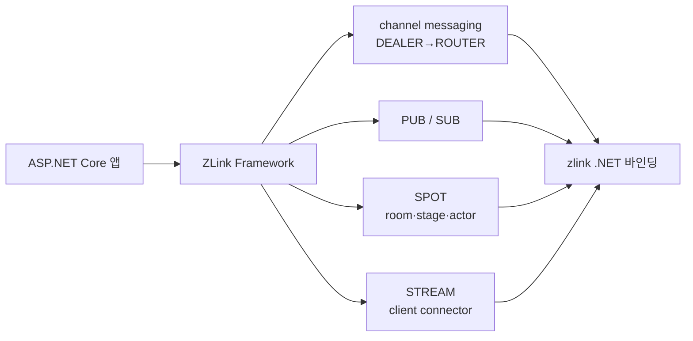

<!-- framework-adapter-nav:start -->
[문서 목록](../../../../doc/README.ko.md) | [이전: ZLink Framework for .NET](../README.ko.md) | [다음: Getting Started](./02-getting-started.ko.md)
<!-- framework-adapter-nav:end -->

# ZLink Framework for .NET — 개요와 시작

> 이 문서는 `.NET` 가이드의 진입점이다. 개념의 **정식 정의**는 언어 중립
> [공통 스펙 개요](../../../../doc/spec/overview.ko.md)가 소유한다. 이 가이드는
> 그 개념을 `.NET`/`ASP.NET Core` 개발자 관점에서 다시 풀어 설명한다.

## 1. 한 줄 정의

`ZLink Framework for .NET`은 zlink `.NET` 바인딩 위에 올라가, 별도 **gateway나
전용 로드밸런서 없이** `channel name` 기준의 서버 간 호출, pub/sub, `SPOT`,
`STREAM`을 `ASP.NET Core`의 DI와 hosted service 모델 안에서 쓰게 해 주는 상위
계층이다.

핵심은 "raw socket과 low-level discovery를 직접 다루지 않는다"는 것이다.
개발자는 HTTP/gRPC를 쓰던 감각으로 handler와 client만 작성하고, 연결·발견·
라우팅은 framework가 처리한다.

## 2. 어떤 문제를 푸는가

기존 ASP.NET Core 서비스가 서로 통신할 때 흔히 겪는 비용은 다음과 같다.

- 서비스마다 주소·포트를 알아야 하고, 앞단에 gateway나 로드밸런서를 둔다.
- 메시징 라이브러리를 쓰면 socket·endpoint·재연결·discovery를 앱이 직접 관리한다.
- 요청/응답, 단방향 전송, 이벤트 fan-out마다 다른 코드 경로가 생긴다.

`ZLink Framework`는 이것을 **논리 `channel name` 하나**로 좁힌다. 응용은
"`order` channel로 요청을 보낸다"만 알면 되고, 그 channel이 어디에 몇 개
떠 있는지는 channel별 `Discovery`가 숨긴다.

## 3. 기존 방식 대비 (체감 난이도)

같은 "서버 간 요청/응답"을 붙이는 코드량 차이다.

**raw 바인딩으로 직접 (개념적):**

```csharp
// discovery 구성, dealer socket 생성, endpoint 연결, 재연결 관리,
// correlation id 매칭, 직렬화, 수신 루프 ... 수십 줄의 배선 코드
```

**ZLink Framework:**

```csharp
// 서버: handler 하나
[ZLinkRequest]
public sealed class GetPriceHandler : IZLinkRequestHandler<PriceReq, PriceRes>
{
    public ValueTask<PriceRes> HandleAsync(
        PriceReq request, ZLinkRequestContext context, CancellationToken ct)
        => ValueTask.FromResult(new PriceRes(request.Symbol, 42));
}

// 등록
builder.Services.AddZLinkFramework(options =>
{
    options.AddClientServerChannel("price", channel => channel.EnableServer());
});

// 클라이언트 측: IZLinkClient 를 주입받아 builder + 종결자로 호출
var res = await client
    .Request("price", new PriceReq("AAPL"))
    .SubmitAsync<PriceRes>(ct);
```

배선 코드가 사라지고 남는 것은 handler와 한 줄짜리 channel 등록이다.

## 4. 통합 4축 한눈에



| 축 | 사용자에게 보이는 것 | 정식 문서 |
|----|----------------------|-----------|
| channel messaging | `[ZLinkRequest]`/`[ZLinkSend]` handler, `IZLinkClient` | [spec/aspnet-core-channel-messaging](../spec/aspnet-core-channel-messaging.ko.md) |
| PUB/SUB | `[ZLinkPublish]`, `EnableSubscriber()` | [spec/aspnet-core-channel-messaging](../spec/aspnet-core-channel-messaging.ko.md) |
| SPOT | named spot factory, publish/subscribe, actor | [spec/aspnet-core-spot](../spec/aspnet-core-spot.ko.md), [spec/aspnet-core-actor](../spec/aspnet-core-actor.ko.md) |
| STREAM | framework session packet, Stream Connector | [spec/aspnet-core-stream](../spec/aspnet-core-stream.ko.md) |

## 5. 누구를 위한 것인가 / 비목표

- **대상:** 서버 간 메시징이 필요한 `ASP.NET Core` 백엔드, 실시간 game/stage
  서버, 외부 client(STREAM)를 받는 게이트 서버.
- **비목표:** 새 transport나 새 socket semantic을 만드는 것이 아니다. 기존
  `.NET` 바인딩(`DealerSocket`, `SpotNode`, `Registry` 등)을 그대로 쓰되
  framework 친화적으로 감싼다. backend 의존 기준은
  [internals/backend-dependency-policy](../internals/backend-dependency-policy.ko.md).

## 6. 이 가이드 읽는 순서

1. [02-getting-started](./02-getting-started.ko.md) — 패키지부터 동작 확인까지
2. [03-concepts](./03-concepts.ko.md) — `.NET` 표면 멘탈 모델
3. [04-feature-map](./04-feature-map.ko.md) — 기능·난이도·언제 쓰나
4. [spec/](../spec/handler-interfaces.ko.md) — 정식 계약(인터페이스 카탈로그부터)
5. [guide/samples/](./samples/channel-messaging-samples.ko.md) — 기능별 실행 예제
