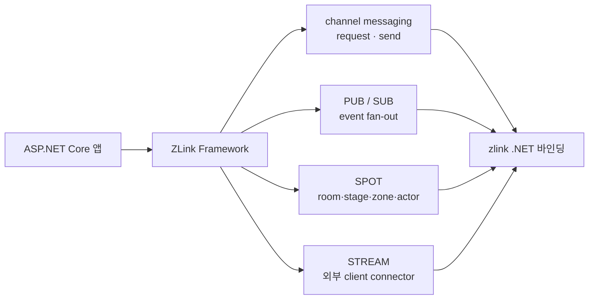

<!-- framework-adapter-nav:start -->
[문서 목록](../../../../doc/README.ko.md) | [이전: ZLink Framework for .NET](../README.ko.md) | [다음: Getting Started](./02-getting-started.ko.md)
<!-- framework-adapter-nav:end -->

# 1. ZLink Framework for .NET — 개요

> 이 문서는 `.NET` 가이드의 진입점이다. 가이드는 `ASP.NET Core` 개발자가
> ZLink Framework 의 기능을 **읽고 바로 따라 쓸 수 있도록** 개념과 사용법을
> 직접 설명한다. 개념의 **언어 중립 정식 정의**는 [공통 스펙
> 개요](../../../../doc/spec/overview.ko.md)가, `.NET` 표면의 **정식 계약**은
> [spec/](../spec/handler-interfaces.ko.md) 문서가 다룬다. 두 표기가 어긋나면
> spec 이 우선이다.

## 1. 한 줄 정의

`ZLink Framework for .NET`은 zlink `.NET` 바인딩 위에 올라가, 별도 **gateway 나
전용 로드밸런서 없이** 논리 `channel name` 기준의 서버 간 호출, pub/sub, `SPOT`,
`STREAM`을 `ASP.NET Core`의 DI 와 hosted service 모델 안에서 쓰게 해 주는 상위
계층이다.

핵심은 "raw socket 과 low-level discovery 를 직접 다루지 않는다"는 것이다.
개발자는 HTTP/gRPC 를 쓰던 감각으로 **handler 와 client 만** 작성하고,
연결·발견·라우팅·재연결·correlation 은 framework 가 처리한다.

> **ZLink 은 다국어 framework 다.** 호출 계약이 언어 중립 wire protocol(ZMP) +
> codec + 논리 channel/packet 이라, 서로 다른 언어로 구현된 서비스가 같은 channel
> 위에서 상호 호출한다(예: room 서버 C++, API 서버 .NET·Java). 이 가이드는 `.NET`
> binding 기준이며, `.NET` 이 reference 구현, **C++/Java/Node 가 1차 개발 중,
> Python/Go/Rust 가 뒤따른다.** 자세한 cross-language 모델은
> [12-grpc-alternative §2.1](./12-grpc-alternative.ko.md)이 다룬다.

## 2. 어떤 문제를 푸는가

ASP.NET Core 서비스가 서로 통신할 때 흔히 드는 비용은 다음과 같다.

- 서비스마다 주소·포트를 알아야 하고, 앞단에 gateway 나 로드밸런서를 둔다.
- 메시징 라이브러리를 쓰면 socket·endpoint·재연결·discovery 를 앱이 직접 관리한다.
- 요청/응답, 단방향 전송, 이벤트 fan-out 마다 다른 코드 경로가 생긴다.
- 게임 room/stage 같은 동적 단위를 다루려면 라우팅과 세션 관리를 또 따로 짠다.

ZLink Framework 는 이 모든 호출의 단위를 **논리 `channel name` 하나**로 좁힌다.
응용은 "`order` channel 로 요청을 보낸다"만 알면 되고, 그 channel 이 어디에 몇 개
떠 있는지는 channel 별 `Discovery`가 숨긴다.

## 3. 기존 방식 대비 (체감 난이도)

같은 "서버 간 요청/응답"을 붙이는 코드량 차이다.

**raw 바인딩으로 직접 (개념적):**

```csharp
// discovery 구성, dealer socket 생성, endpoint 연결, 재연결 관리,
// correlation id 매칭, 직렬화, 수신 루프 ... 수십 줄의 배선 코드
```

**ZLink Framework:**

```csharp
// 서버: handler 하나
public sealed class GetPriceHandler
    : IZLinkRequestHandler<PriceRequest, PriceReply>
{
    public ValueTask<PriceReply> HandleAsync(
        PriceRequest request, ZLinkRequestContext context, CancellationToken ct)
        => ValueTask.FromResult(new PriceReply(request.Symbol, 187.42m));
}

// 등록
builder.Services.AddZLinkFramework(options =>
{
    options.AddClientServerChannel("price", channel =>
    {
        channel.EnableServer(server => server.Bind("tcp://0.0.0.0:7301"));
        channel.AddRequestHandler<GetPriceHandler>();
    });
});

// 클라이언트: IZLinkChannelClient 를 주입받아 builder + 종결자로 호출
var reply = await client
    .RequestToChannel("price", new PriceRequest("AAPL"))
    .Async<PriceReply>(ct);
```

배선 코드가 사라지고 남는 것은 handler 와 한 줄짜리 channel 등록뿐이다.

## 4. 아키텍처 — 어디에 올라가는가

```
+-----------------------------------------------------------+
|  ASP.NET Core app (DI, hosted service, handler)           |
+-----------------------------------------------------------+
|  ZLink Framework for .NET (adapter surface)               |
|   - channel messaging  - SPOT/actor  - STREAM session     |
|   - registry/monitoring integration                       |
+-----------------------------------------------------------+
|  zlink .NET binding (DealerSocket, RouterSocket, Spot,    |
|   SpotNode, Registry, Discovery ...)                      |
+-----------------------------------------------------------+
|  zlink core (C API) - transport, ZMP, I/O threads         |
+-----------------------------------------------------------+
```

Framework 는 새 transport 나 새 socket semantic 을 만들지 않는다. 기존 바인딩
기능을 **DI · hosted service · handler · attribute** 모델로 감싸 노출할 뿐이다.
backend 의존 기준은
[internals/backend-dependency-policy](../internals/backend-dependency-policy.ko.md)
가 소유한다.

### zlink core 와 기본 소켓 패턴

위 레이어 그림처럼 framework 는 직접 소켓을 열지 않는다. zlink core(C API)가 소켓 패턴을
제공하고, .NET 바인딩이 이를 typed 클래스로 노출하며, framework 가 channel·spot 으로
감싼다. 그래서 가이드 곳곳에 `DEALER`·`ROUTER`·`PUB/SUB` 이름이 보이며, **어떤 소켓 위에서
도는지** 알면 channel 종류 선택이 쉬워진다.

| framework 구성 | 하부 소켓 | 쓰임 |
|----------------|-----------|------|
| client-server channel | `DEALER → ROUTER` | 1:1 request/response·단방향 send |
| fanout channel | `PUB → SUB` | 이벤트 fan-out (여러 구독자) |
| mesh channel | `DEALER`/`ROUTER` peer mesh | 로드밸런싱·엔티티 라우팅 |
| STREAM session | `STREAM` | 외부 client(raw TCP/WS) 연동 |

각 소켓의 메시징 패턴·라우팅 전략·호환성 매트릭스·코드 예제는 zlink core 가이드가
자세히 다룬다:
[소켓 패턴 개요](../../../../../doc/guide/03-0-socket-patterns.ko.md) ·
[DEALER](../../../../../doc/guide/03-3-dealer.ko.md) ·
[ROUTER](../../../../../doc/guide/03-4-router.ko.md) ·
[PUB/SUB](../../../../../doc/guide/03-2-pubsub.ko.md) ·
[STREAM](../../../../../doc/guide/03-5-stream.ko.md)

## 5. 통합 4축 한눈에



| 축 | 사용자에게 보이는 것 | 가이드 챕터 |
|----|----------------------|-------------|
| channel messaging | `[ZLinkRequest]`/`[ZLinkSend]` handler, `IZLinkChannelClient` | [04-channel-messaging](./04-channel-messaging.ko.md) |
| PUB/SUB | `[ZLinkPublish]`, `EnableSubscriber()`, `IZLinkFanoutClient` | [04-channel-messaging](./04-channel-messaging.ko.md) |
| SPOT | typed spot factory, Spot context outbound, timer | [05-spot](./05-spot.ko.md) |
| actor / session | actor factory, Entry Spot, `IZLinkBoundSession`, session actor dispatch | [06-actor-session](./06-actor-session.ko.md) |
| STREAM | framework session packet, Stream Connector | [07-stream](./07-stream.ko.md) |
| 인프라 | Registry topology, runtime monitoring | [08-registry](./08-registry.ko.md), [09-monitoring](./09-monitoring.ko.md) |

## 6. 누구를 위한 것인가 / 비목표

- **대상:** 서버 간 메시징이 필요한 `ASP.NET Core` 백엔드, 실시간 game/stage
  서버, 외부 client(STREAM)를 받는 게이트 서버, 클러스터 topology 를 운영에서
  들여다봐야 하는 팀.
- **비목표:** 새 transport 나 새 socket semantic 을 만드는 것이 아니다. 기존
  `.NET` 바인딩(`DealerSocket`, `SpotNode`, `Registry` 등)을 그대로 쓰되
  framework 친화적으로 감싼다.

framework 는 handler 를 자동으로 모든 channel 에 열지 않는다. assembly scan 은
handler 를 **찾는** 단계이고, 실제 노출은 `AddHandlerGroup(...)` 또는 개별 typed
handler registration 이 정한다. 자세한 규칙은
[04-channel-messaging](./04-channel-messaging.ko.md) §3 에서 다룬다.

## 7. 이름 표기 규칙 (혼동 주의)

가이드 전체에서 다음 표기를 일관되게 쓴다.

- **framework adapter 가 노출하는 모든 public 타입**(interface, record, enum,
  attribute, exception, DI 확장 메서드)은 `ZLink` prefix(대문자 `L`)를 쓴다. 예:
  `IZLinkChannelClient`, `ZLinkRequestContext`, `[ZLinkRequest]`, `AddZLinkFramework`,
  `ZLinkFrameworkException`.
- **단, client 측 Stream Connector 패키지**(`Systems.Zlink.Stream.Connector`)의
  타입은 `Zlink` prefix(소문자 `l`)를 쓴다. 예: `IZlinkStreamConnector`,
  `ZlinkStreamConnectorOptions`, `ZlinkStreamMessage`. 이는 connector 가 서버
  framework 패키지에 의존하지 않는 독립 client 라이브러리이기 때문이다.
- **하부 zlink core C API** 는 `zlink_*` snake_case 다.
- NuGet package id 와 namespace 단어는 역순 도메인 규칙을 따라
  `Systems.Zlink.*` 다(예: `Systems.Zlink.Framework`).

> 정리하면: **서버 framework = `ZLink`, client connector = `Zlink`.** 한 코드에
> 두 표기가 같이 보이면 오타가 아니라 위 규칙 때문이다.

## 8. 현재 상태

이 가이드가 설명하는 표면은 [spec/](../spec/handler-interfaces.ko.md) 의 draft
계약을 따른다. 구현이 진행되는 동안에도 인터페이스의 모양과 동사(`Request`,
`Submit`, `Bind`, `AddHandlerGroup` 등)는 고정 방향으로 유지된다. 세부 필드까지
정확한 정식 정의가 필요하면 항상 spec 문서를 교차 참조한다.

## 9. 이 가이드 읽는 순서

1. [02-getting-started](./02-getting-started.ko.md) — 패키지부터 첫 동작 확인까지
2. [03-concepts](./03-concepts.ko.md) — `.NET` 표면 멘탈 모델 (channel, capability, DI)
3. [04-channel-messaging](./04-channel-messaging.ko.md) — request/send/pub-sub 상세
4. [05-spot](./05-spot.ko.md) — room/stage/zone, timer, routed Spot 호출
5. [06-actor-session](./06-actor-session.ko.md) — actor lifecycle, session actor dispatch
6. [07-stream](./07-stream.ko.md) — 외부 client(STREAM) 서버 + Stream Connector
7. [08-registry](./08-registry.ko.md) — Registry 구동과 topology 조회
8. [09-monitoring](./09-monitoring.ko.md) — runtime 이벤트 관찰
9. [10-feature-map](./10-feature-map.ko.md) — 무엇을·얼마나 쉽게·언제 쓰나
10. [11-interface-catalog](./11-interface-catalog.ko.md) — 모든 계약 인터페이스를 코드로(ContractTests 검증)
11. [12-grpc-alternative](./12-grpc-alternative.ko.md) — **ZLink 을 어디에 쓰나**(사용처·문제 신호·경계 + 케이스 허브, 도입 판단 문서)
12. 케이스 스터디 — 도입 판단과 아키텍처 매핑:
    [13 전자상거래](./case-studies/13-case-ecommerce-checkout.ko.md) ·
    [14 mesh+운영](./case-studies/14-case-microservice-mesh.ko.md) ·
    [15 게임](./case-studies/15-case-realtime-game.ko.md) ·
    [16 라이드헤일링](./case-studies/16-case-ride-hailing.ko.md) ·
    [17 채팅](./case-studies/17-case-chat-messaging.ko.md) ·
    [17-1 마켓플레이스 채팅](./case-studies/17-1-case-marketplace-chat.ko.md) ·
    [17-2 라이브 커머스 채팅](./case-studies/17-2-case-live-commerce-chat.ko.md) ·
    [17-3 게임 채팅](./case-studies/17-3-case-game-chat.ko.md) ·
    [18 트레이딩](./case-studies/18-case-trading-system.ko.md)
13. [guide/samples](./samples/channel-messaging-samples.ko.md) — 등록 코드와 실행 흐름을 확인하는 기능별 샘플
14. [spec/](../spec/handler-interfaces.ko.md) — 정식 계약(인터페이스 카탈로그)

---
<!-- framework-adapter-nav:bottom:start -->
[문서 목록](../../../../doc/README.ko.md) | [이전: ZLink Framework for .NET](../README.ko.md) | [다음: Getting Started](./02-getting-started.ko.md)
<!-- framework-adapter-nav:bottom:end -->
