<!-- framework-adapter-nav:start -->
[문서 목록](../../../../doc/README.ko.md) | [이전: Getting Started](./02-getting-started.ko.md) | [다음: Channel Messaging — request · send · pub/sub](./04-channel-messaging.ko.md)
<!-- framework-adapter-nav:end -->

# 3. 핵심 개념

> 개념의 정식 의미는 [공통 스펙 목차](../../../../doc/spec/README.ko.md)가,
> 인터페이스의 정식 정의는 [spec/handler-interfaces](../spec/handler-interfaces.ko.md)가
> 다룬다. 이 문서는 그 의미가 `.NET`에서 어떤 모양으로 보이는지 정리한다.

ZLink framework 는 **다섯 가지 핵심 개념**으로 선다:
**channel · spot · actor · stream · registry/discovery**. 나머지 챕터는 전부 이
다섯의 변주다. 낯선 단어가 나오면 먼저 §0 용어 표에서 한 줄로 잡고, §1~§5 에서 다섯
개념을 차례로 본다. §6 은 이들을 받치는 실행·구성 모델이다.

## 0. 용어 빠르게 잡기

가이드에 자주 나오는 용어를 **한 줄 풀이**로 먼저 잡는다. 다른 챕터에서 낯선 단어가
나오면 이 표로 돌아오면 된다(정식 정의는 위 spec 링크가 다룬다).

| 용어 | 한 줄 풀이 |
|------|-----------|
| **channel(채널)** | 서버 간 호출을 묶는 **논리 이름**. `host:port` 주소 대신 `"orders"` 같은 이름으로 부른다 |
| **역할(capability)** | 한 channel 에서 이 앱이 맡는 일 — 서버로 **받기**(EnableServer) / 클라이언트로 **보내기**(EnableClient) / **발행**(Publisher) / **구독**(Subscriber) |
| **handler(핸들러)** | 들어온 메시지를 처리하는 메서드·클래스. `ASP.NET Core` 의 컨트롤러 액션과 같은 위치 |
| **client(클라이언트)** | 다른 서비스로 호출을 **보내는** 주입 객체(예: `IZLinkChannelClient`) |
| **request / send / publish** | 각각 **응답 받는 호출** / **응답 없는 단방향 통지** / **여러 구독자에게 발행** |
| **pub/sub · fan-out** | 한 번 발행한 이벤트가 **여러 구독자에게 동시에 퍼지는** 것 |
| **packet name(패킷 이름)** | 같은 channel 안에서 **어느 메시지 종류인지** 구분하는 키 |
| **codec(코덱)** | payload(메시지 본문)를 바이트로 **직렬화/역직렬화**하는 방식(json·protobuf·messagepack) |
| **SPOT(스팟)** | room/zone 처럼 **동적으로 생겼다 사라지는 상태 노드**. 한 SPOT 의 콜백은 **한 줄로 직렬** 실행돼 lock 이 필요 없다 |
| **actor(액터)** | **ID 로 식별되는 상태 보유 객체**. 같은 ID 로 온 메시지는 늘 같은 인스턴스가 처리 |
| **Entry Spot** | actor 가 생성 직후 머무는 **기본 실행 위치** |
| **STREAM(스트림)** | 외부 client(모바일·게임)와의 **연결 지향 양방향 채널**. 연결 수명·재연결을 framework 가 관리 |
| **session(세션)** | STREAM 연결 하나에 대응하는 **서버 측 객체** |
| **Registry(레지스트리)** | 어떤 서비스가 어디 떠 있는지 모으는 **중앙 디렉터리 서버** |
| **Discovery(디스커버리)** | client 가 Registry 를 보고 **연결 대상을 자동으로 찾는** 것 |
| **RoutingId** | 노드·스팟의 **논리 주소**(특정 인스턴스를 가리키는 식별자) |
| **correlation(상관)** | 요청과 그 응답을 **짝지어 주는** 식별 정보. framework 가 자동 처리 |
| **deadline / timeout** | 응답을 **얼마나 기다릴지**의 상한 시간 |
| **DI / lifecycle** | `ASP.NET Core` 의존성 주입 + hosted service **시작/종료** 수명 관리 |
| **mesh / sidecar**(비교용) | 서비스 옆에 붙어 라우팅·분배를 대신하는 **별도 프록시**(Envoy/Istio). ZLink 는 이게 없어도 된다 |

## 1. channel — 서버 간 연결

channel 은 **서버↔서버 연결을 묶는 논리 이름**이다. 주소(`host:port`)가 아니라
`"orders"` 같은 이름으로 부르고, 실제 위치는 registry/discovery(§5)가 푼다. 배포
값(주소·topology)은 handler 가 아니라 **channel 등록**이 소유하므로,
`[ZLinkRequest]` 같은 attribute 는 channel 이름을 인자로 받지 않는다.

**channel 종류(kind)** — 서버 간 연결 방식이 다르다:

| 종류 | 등록 | 연결 패턴 |
|------|------|-----------|
| client-server | `AddClientServerChannel` | request-reply · 단방향 send — **ROUTER 서버에 DEALER 클라이언트**가 붙는다 (DEALER 소켓 = client, ROUTER 소켓 = server) |
| fanout | `AddFanoutChannel` | publisher → 다수 subscriber, topic (PUB / SUB) |
| dealer mesh | `AddDealerMeshChannel` | dealer ↔ dealer — round-robin·가중치 기반 분산 (외부 LB 없이 수평 확장) |
| route mesh | `AddRouteMeshChannel` | router ↔ router — routing id 로 특정 주소에 라우팅 (SPOT node 가 이 route mesh 로 구성된다: [05-spot](./05-spot.ko.md)) |

**소켓 구조 한눈에** — 어떤 소켓이 어떻게 붙는지가 네 종류의 차이다.

- **client-server** — ROUTER 서버 **하나**에 DEALER 클라이언트 **여럿**이 붙는 비대칭 구조.

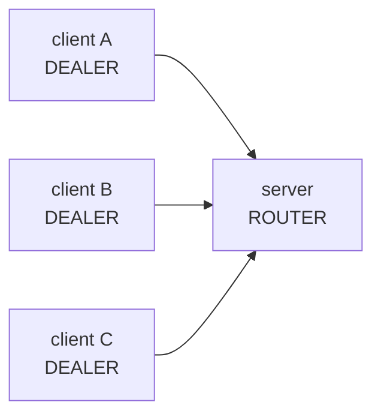

- **fanout** — PUB 하나가 발행하면 같은 메시지가 SUB 여럿에 동시에 퍼진다.

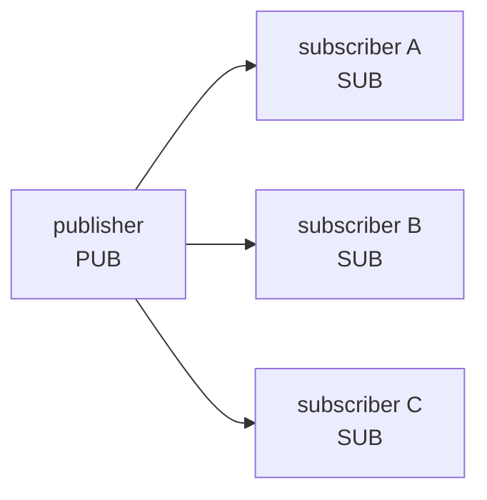

- **dealer mesh** — DEALER 끼리 붙어, 한 요청을 서버들에 **round-robin·가중치로 분산**(아무 서버나).

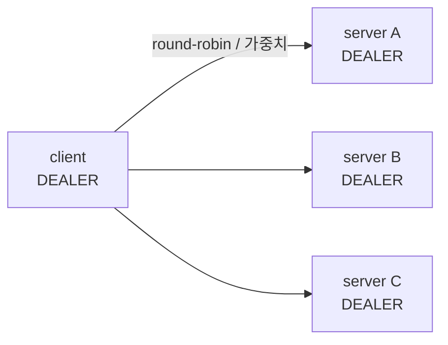

- **route mesh** — ROUTER 끼리 붙어, **routing id 로 지정한 주소에만** 보낸다(분산 아님). SPOT node 가 이 구조로 구성된다.

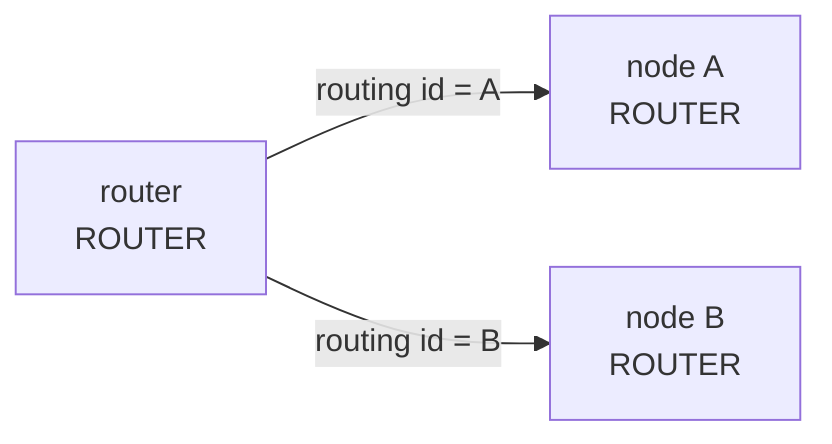

**역할(capability)** — 한 channel 에서 이 앱이 맡는 일:

| 역할 | 의미 | 비고 |
|------|------|------|
| `EnableServer()` | 이 channel 의 request/send 를 local handler 가 받는다 | `Bind(...)` 필수 |
| `EnableClient()` | 이 channel 로 request/send 를 내보낸다 | outbound 전용 앱 가능 |
| `EnablePublisher()` | 이 channel 로 이벤트를 publish 한다 | `Bind(...)` 필수 |
| `EnableSubscriber()` | 이 channel 의 이벤트를 구독한다 | |

한 channel 이 여러 역할을 가질 수 있다(예: 서버이면서 다른 노드의 이벤트를 구독).
server/publisher 는 외부가 접근할 endpoint 가 필요하므로 `Bind(...)`가 필수고,
client/subscriber 는 필요 없다. request/send/pub-sub 사용법과 handler 노출·연결
제어 전체는 [04-channel-messaging](./04-channel-messaging.ko.md)이 다룬다.

> **주의:** channel 이름과 handler **group 이름**은 서로 다른 namespace 다. group 은
> 코드 안 논리 묶음(`"api"`)이고, channel 은 배포 식별자(`"tictactoe.api"`)다.

## 2. spot — 상태 단위

spot 은 room/zone/stage 처럼 **동적으로 생겼다 사라지는 상태 노드**다. 한 spot 에
들어오는 packet · timer · actor 콜백은 **한 줄로 직렬 실행**되므로, spot 이 소유한
상태에 lock 없이 접근한다. "어디서 도는가"가 channel handler 와 다르다(§6).

| | channel handler | SPOT handler |
|---|---|---|
| 위치 | channel server/subscriber 역할 | SPOT node 안의 entry/user Spot |
| 실행 | 서로 다른 요청은 동시에 실행 가능 | 같은 SPOT 안에서는 직렬 실행 |
| 상태 | 공유 상태를 직접 멤버에 두지 않음 | SPOT이 상태를 직접 소유 |

한 SPOT 에 들어오는 모든 일은 **단일 큐**를 통과해 한 줄로 처리된다 — 그래서 상태에
lock 이 없다.

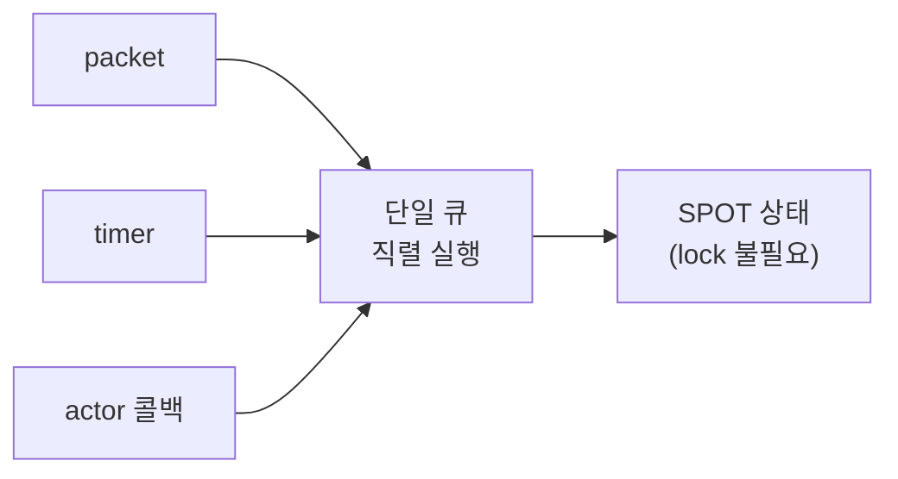

상세(등록·lifecycle·timer·outbound)는 [05-spot](./05-spot.ko.md).

## 3. actor — ID 로 식별되는 상태 객체

actor 는 **ID 로 식별되는 상태 보유 객체**다. 같은 ID 로 온 메시지는 늘 같은
인스턴스가 처리한다. 외부 client session 을 actor 에 바인딩하면 **연결 서버(세션)와
로직 서버(actor)를 분리**할 수 있다 — 연결을 받는 노드와 도메인 로직을 도는 노드를
나누는 패턴이다.

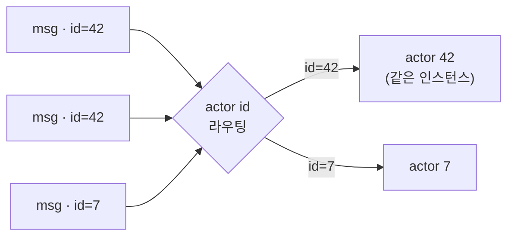

상세는 [06-actor-session](./06-actor-session.ko.md).

## 4. stream — 외부 client 연결

stream 은 모바일·게임 같은 **외부 client 와의 연결 지향 양방향 채널**이다. 서버
간 channel(§1)과 달리 연결 수명·재연결·heartbeat 를 framework 가 관리하고, 연결
하나가 서버 측 **session** 객체에 대응한다.

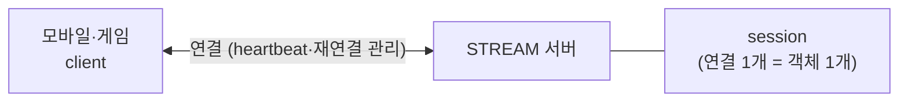

상세는 [07-stream](./07-stream.ko.md).

## 5. registry / discovery — 주소 자동 연결

앱 코드는 **channel 이름만** 안다. 실제 peer 주소(`host:port`)는 **Registry +
Discovery** 가 해결한다.

- **Registry** — 어느 노드가 어떤 channel 을 어디(endpoint)서 제공하는지 모아 두는
  디렉터리 서버. server/publisher 역할이 startup 에 자기 endpoint 를 등록·heartbeat.
- **Discovery** — `options.UseDiscovery(...AddRegistryEndpoint...)` 를 켠 client/subscriber
  가 Registry 의 해당 channel view 를 구독해 provider endpoint 를 받아 **자동 연결**하고,
  provider 집합이 바뀌면 **자동 재연결**한다(앱 재시작 불필요).

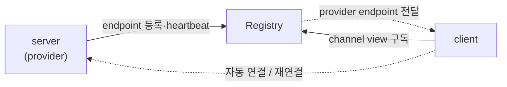

주소 해결 → 자동 연결 sequence 는 [02-getting-started §7](./02-getting-started.ko.md)이
그림으로 보여 주고, 운영·배포 모델은 [08-registry](./08-registry.ko.md)가 다룬다.
Registry 없이 endpoint 를 직접 지정하는 **수동 연결**도 가능하다(역할 단위,
[04-channel-messaging §6](./04-channel-messaging.ko.md)).

## 6. 보조 — 실행·구성 모델

위 다섯 개념을 받치는 공통 동작이다. 여기서 한 번 짚고, 상세는 각 챕터가 소유한다.

### 6.1 핸들러 모델 — 노드 핸들러 vs SPOT 핸들러

핸들러는 실행 컨텍스트에 따라 두 종류로 나뉘고, 구조와 수명이 완전히 다르다.

- **노드 핸들러(채널·HTTP)** — 독립 class. interface 기반
  (`IZLinkRequestHandler<TRequest, TReply>` 등)이나 attribute 기반
  (`[ZLinkHandlerGroup]` + `[ZLinkRequest]`/`[ZLinkSend]`/`[ZLinkPublish]` 메서드)으로
  작성하고, 의존성은 **생성자 주입**으로 받는다. 수명은 **transient**(요청마다 새로),
  실행은 **동시**(worker 풀). 그래서 가변 도메인 상태를 핸들러 멤버에 두지 않는다.
- **SPOT 핸들러** — spot 클래스(`IZLinkSpot`)의 메서드가 아니라, 그 spot 에
  **바인딩된 별도 핸들러 class** 다. `IZLinkSpotRequestHandler<TSpot, TRequest, TReply>`
  / `IZLinkSpotPacketHandler<TSpot, TMessage>` / `IZLinkSpotTimerHandler<TSpot>` 를
  구현하고, spot 의 `Configure()` 에서 `Context.Handlers.AddPacket<THandler>()` ·
  `Context.Handlers.AddActorPacket<THandler, TActor>()` 로 등록한다. 같은 SPOT 안에서는
  **전체 직렬 실행**이라 상태에 lock 이 필요 없다.

| | 노드 핸들러 (채널·HTTP) | entry spot | room spot |
|---|---|---|---|
| 기반 | 독립 class (interface/attribute) | `IZLinkSpot` 구현 | `IZLinkSpot` 구현 |
| 수명 | transient (요청마다) | 노드와 동일 (영속) | 상태 단위와 동일 (영속) |
| 실행 | 동시 (worker 풀) | **전체 직렬** — 단일 큐 | **전체 직렬** — 단일 큐 |
| 공유 상태 | 핸들러에 두지 않음 | 큐 안에서 안전 | 락 없이 안전 |
| 역할 | 요청 처리·위임 | 배정·매칭·할당 | 도메인 상태 소유·처리 |
| 계약 | interface 구현 / attribute 메서드 | `Configure()` + `Context.Handlers` 등록 | `Configure()` + `Context.Handlers` 등록 |
| DI | 생성자 주입 | `IZLinkSpotContext` 로 채널 client 연결 | `IZLinkSpotContext` 로 채널 client 연결 |

**실행 모델 비교** — 같은 3개 요청이 두 핸들러에서 어떻게 도는가:

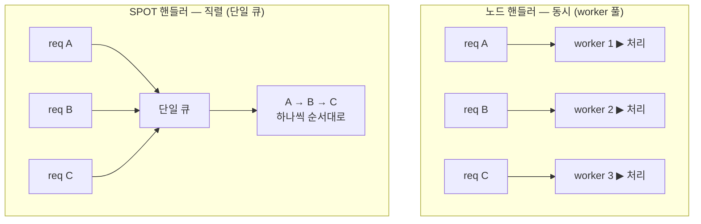

노드 핸들러는 요청마다 다른 worker 가 **동시에** 처리하니 핸들러에 가변 상태를 두면
경합이 난다. SPOT 핸들러는 단일 큐로 **한 번에 하나씩** 처리하니 상태에 lock 이
필요 없다.

가변 도메인 상태(게임 룸 등)는 **SPOT**, 불변 구성(topology)은 싱글톤 서비스, 공유
인프라(캐시·카운터)는 싱글톤 + 자체 동기화에 둔다. SPOT 핸들러 작성과 직렬 실행
보장은 [05-spot](./05-spot.ko.md), 채널 핸들러 노출은 [04-channel-messaging](./04-channel-messaging.ko.md).

**handler 노출은 명시적이다** — `[ZLinkHandlerGroup("api")]` 로 묶고 channel 등록에서
`AddHandlerGroup("api")` 로 붙이거나(방법 A), `AddRequestHandler<T>()` 로 개별
등록한다(방법 B). 다음 구성 오류는 lazy first-call 로 미루지 않고 **host startup 에서
즉시** 예외로 막힌다: channel 이름 중복, 같은 channel 안 `kind + packet name` 중복,
client 역할에 Discovery·수동 연결 둘 다 없음, 허용되지 않는 handler 반환형.

### 6.2 실행 모델 — `async`/`await`, `ValueTask`

프레임워크 전반의 비동기 값은 `ValueTask` / `ValueTask<T>` 로 표현된다. handler 와
outbound 호출은 모두 비동기다 — `Async(...)` / `Async<T>(...)` 의 완료는 **transport 위임까지**만
보장하고(remote handler 완료나 subscriber 수신을 보장하지 않는다),
`Request(...).Timeout(...)` 은 **reply 대기 시간**만 정한다. 규칙은 하나다 —
**런타임(핸들러) 스레드에서는 `await`, blocking(`.Result`/`.GetAwaiter().GetResult()`)은
테스트·클라이언트 시나리오에서만.**

```csharp
public async ValueTask<CreateGameReply> HandleAsync (
    CreateGameRequest request, ZLinkRequestContext context, CancellationToken ct)
{
    var room = await _client
        .RequestToChannel("tictactoe.play", new CreateRoomRequest(request.GameName))
        .Async<CreateRoomReply>(ct);
    return new CreateGameReply (room.RoomId, room.GameName);
}
```

채널·HTTP 핸들러는 **worker 풀**에서 실행된다. 핸들러가 `await` 에 도달하면 async
상태 머신만 멈추고(suspend) 실행 스레드는 풀로 돌아가 다른 큐 항목을 처리한다. 같은
SPOT 큐는 그 handler 완료 전까지 다음 callback 을 시작하지 않는다.

핵심은 **이벤트마다 async task 하나, 스레드는 공유**다 — SPOT 의 event(message·timer)는
각각 task 가 되어 소수의 worker 스레드에 다중화되고, `await` 에 걸린 task 는 스레드를
**놓는다**(blocking 아님). 그래서 스레드 몇 개로 대기 중인 task 수천 개를 떠받친다.

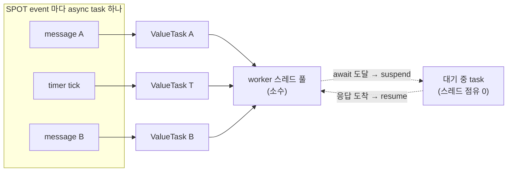

아래 타임라인은 같은 흐름을 시간순으로 본 것이다 — A 가 `await` 로 suspend 되면 같은
스레드가 즉시 B 를 처리하고, A 는 응답이 오면 resume 된다.

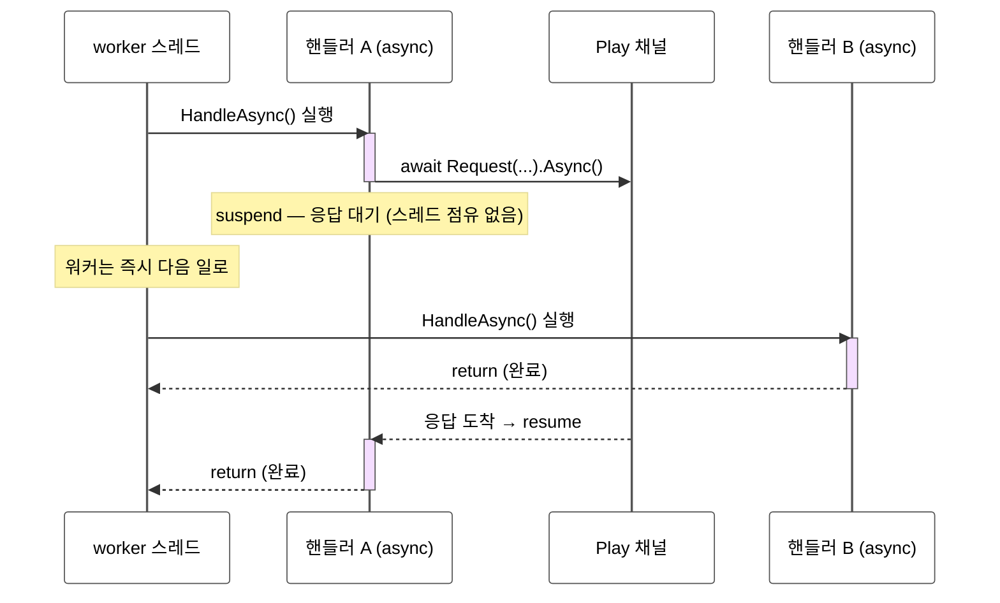

그래서 비동기 호출을 콜백 없이 **동기식 코드처럼 위에서 아래로** 쓰면서도, worker
몇 개로 수많은 동시 요청을 처리한다. 같은 코드를 `.Result` 로 막으면 스레드 하나가
통째로 잠들기 때문에 핸들러 안에서 금지한다. 실패는 `await` 경로에서
예외로 던져진다.

### 6.3 host 수명주기

framework runtime 은 `ASP.NET Core` 의 **hosted service** 로 host 시작/종료에 묶인다.
channel·SPOT·STREAM runtime 은 startup 에서 등록한 역할을 보고 생성되어 shutdown 에서
정리된다.

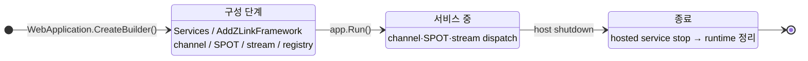

- **구성 단계** — `app.Run()` 전에 모든 선언을 끝낸다. 잘못된 구성은 §6.1 처럼 host
  startup 에서 예외로 거부된다.
- **종료** — host shutdown 신호가 오면 hosted service `stop()` → channel/SPOT/STREAM
  runtime 정리 순으로 내려간다.
- 백그라운드 작업은 표준 `IHostedService` 로 같은 수명주기에 편입시킨다.

### 6.4 구성: DI 컨테이너 · 구성 표면 지도

- **DI 컨테이너** — handler·client·filter 는 모두 `ASP.NET Core` 의 **동일한 DI
  컨테이너**에서 생성자 주입으로 만들어진다. 별도 컨테이너를 두지 않고
  `builder.Services` 에 그대로 등록한다.
- **구성 표면 지도** — 어디서 무엇을 선언하는지:

  | 표면 | 역할 | 다루는 장 |
  |------|------|-----------|
  | `builder.Services.AddZLinkFramework(...)` | channel/SPOT/STREAM/Discovery 선언 | 4~8장 |
  | `options.AddClientServerChannel(...)` / `AddFanoutChannel(...)` | channel 종류·역할 선언 | [4장](./04-channel-messaging.ko.md) |
  | `options.UseDiscovery(...)` | Registry 기반 endpoint 발견 | [8장](./08-registry.ko.md) |
  | `builder.Services.AddZLinkRegistry(...)` | Registry 서버 실행 | [8장](./08-registry.ko.md) |
  | runtime event handler | monitoring event 관찰 | [9장](./09-monitoring.ko.md) |

## 7. 더 깊이

- request/send/pub-sub 전체 사용법: [04-channel-messaging](./04-channel-messaging.ko.md)
- 전체 인터페이스/attribute/context: [spec/handler-interfaces](../spec/handler-interfaces.ko.md)
- 기능 선택 기준: [10-feature-map](./10-feature-map.ko.md)

---
<!-- framework-adapter-nav:bottom:start -->
[문서 목록](../../../../doc/README.ko.md) | [이전: Getting Started](./02-getting-started.ko.md) | [다음: Channel Messaging — request · send · pub/sub](./04-channel-messaging.ko.md)
<!-- framework-adapter-nav:bottom:end -->
