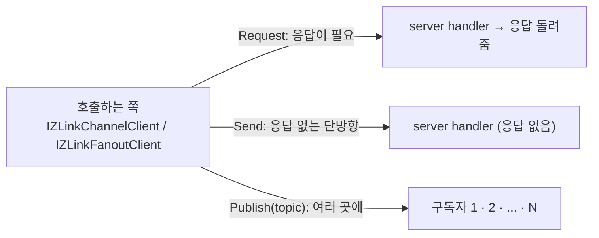
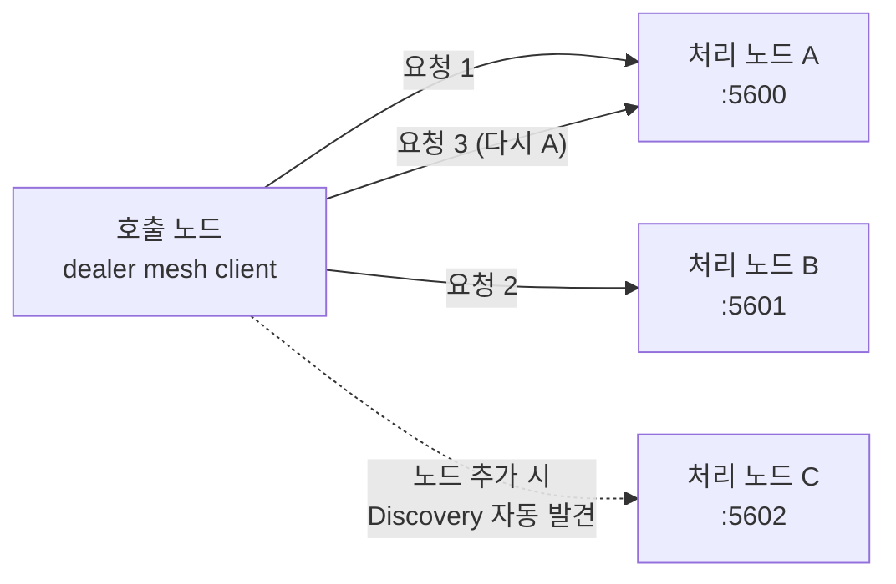
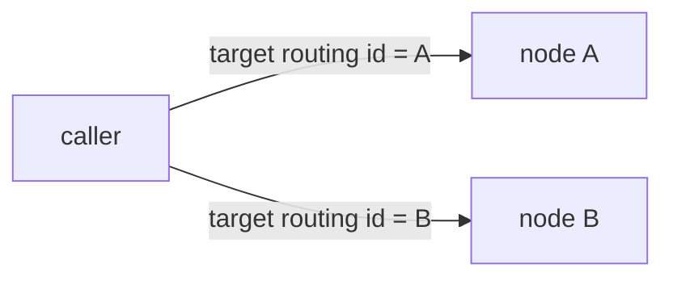

<!-- framework-adapter-nav:start -->
[문서 목록](../../../../doc/README.ko.md) | [이전: 핵심 개념](./03-concepts.ko.md) | [다음: SPOT — room · stage · zone](./05-spot.ko.md)
<!-- framework-adapter-nav:end -->

# 4. Channel Messaging — request · send · pub/sub

> 정식 계약은 [spec/aspnet-core-channel-messaging](../spec/aspnet-core-channel-messaging.ko.md)와
> [spec/handler-interfaces](../spec/handler-interfaces.ko.md)가 다룬다. 이
> 챕터는 그 표면을 실제로 어떻게 등록하고 호출하는지 사용법 중심으로 다룬다.

channel messaging 은 framework 의 가장 기본 축이다. 세 가지 상호작용을 다룬다.

- **request/response** — 응답이 필요한 1:1 호출 (DEALER → ROUTER)
- **one-way send** — 응답이 없는 단방향 명령 (DEALER → ROUTER)
- **publish/subscribe** — 여러 구독자에게 이벤트 fan-out (PUB / SUB)

> 🔰 용어(channel·handler·client·codec 등)가 낯설면
> [03-concepts §0](./03-concepts.ko.md)의 한 줄 풀이를 먼저 본다.
> 괄호 안 `DEALER → ROUTER`·`PUB / SUB` 는 하부 소켓 종류로, **응용이 직접 다루지
> 않는다**(framework 가 channel 종류에 따라 자동 매핑).

세 상호작용을 그림으로 먼저 잡으면 이렇다.



- **request** 는 보낸 뒤 **응답을 기다린다**(예: 가격 조회).
- **send** 는 **던지고 끝**이다(예: 캐시 무효화 통지).
- **publish** 는 한 번 보내면 **구독한 모두**가 받는다(예: 도메인 이벤트 전파).

## 0. gRPC 를 쓰던 웹 서비스라면

channel messaging 은 일반 웹·마이크로서비스 백엔드에서 **서비스 간 gRPC 를
대체**하는 용도로 쓴다. 서비스마다 host:port 를 알리거나 앞단에
gateway/로드밸런서를 둘 필요 없이, 논리 `channel name` + discovery 로 호출을 묶는다.
`.proto` IDL·HTTP/2 전용 인프라·코드 생성 없이 DTO(record)와 typed handler 만으로
gRPC 의 네 가지 호출 형태를 얻는다.

| gRPC 패턴 | ZLink 대체 | 이 가이드 |
|-----------|------------|-----------|
| Unary RPC | request/response | §2·§4 |
| Unary `Empty` / fire-and-forget | one-way send | §2·§4 |
| Server streaming / 이벤트 피드 | pub/sub fan-out | §4 |
| Client/Bidi streaming | STREAM session | [07-stream](./07-stream.ko.md) |
| Service discovery(DNS/xDS) | Registry + Discovery | [08-registry](./08-registry.ko.md) |
| Interceptor | handler filter | §5 |
| Deadline | request timeout | §4 |

예를 들어 주문 서비스라면, gRPC `rpc PlaceOrder(...)` 가 다음과 같이 바뀐다.

```csharp
// 서버: handler 하나 (gRPC service 구현 대신)
public sealed class PlaceOrderHandler
    : IZLinkRequestHandler<PlaceOrder, OrderPlaced>
{
    private readonly IOrderStore _orders;
    public PlaceOrderHandler(IOrderStore orders) => _orders = orders;

    public async ValueTask<OrderPlaced> HandleAsync(
        PlaceOrder request, ZLinkRequestContext context, CancellationToken ct)
    {
        await _orders.SaveAsync(request, ct);
        return new OrderPlaced(request.OrderId);
    }
}

// 클라이언트: gRPC stub 대신 IZLinkChannelClient 주입
var placed = await client
    .RequestToChannel("orders", new PlaceOrder("order-1042", "acct-77", 18742))
    .Async<OrderPlaced>(ct);
```

이 호출 표면(`Request`/`Send`/`Publish` + 종결자)은
[11-interface-catalog](./11-interface-catalog.ko.md) §1.6 의 계약 테스트
`ChannelContracts.Channel_messaging_replaces_grpc_unary_command_and_streaming_for_web_services`
로 검증된다. 아래 본문 예제는 같은 표면을 profile/account/user 등 다른 웹 도메인으로
보여 준다.

> 비슷한 서비스를 새로 만들 때의 케이스 스터디·플래그십 워크스루·솔직한 경계
> (여전히 gRPC 가 맞는 곳)와 도입 판단은
> [12-grpc-alternative](./12-grpc-alternative.ko.md) 가 다룬다.

## 1. channel 종류

| 등록 메서드 | transport(소켓 구조) | 역할 | 용도 |
|-------------|-----------|------------|------|
| `AddClientServerChannel` | ROUTER 서버 ← DEALER 클라이언트 | `EnableServer` / `EnableClient` | request, send |
| `AddFanoutChannel` | PUB → SUB | `EnablePublisher` / `EnableSubscriber` | event fan-out |
| `AddDealerMeshChannel` | DEALER mesh | `EnableServer` / `EnableClient` | round-robin 분산 (§8) |
| `AddRouteMeshChannel` | ROUTER mesh | `EnableServer` / `EnableClient` | routing id 주소 라우팅 (§9) |

이 챕터 §2~§7 은 가장 흔한 **client-server**(request/send)와 **fanout**(pub/sub)을
다룬다. 수평 확장용 **dealer mesh** 는 같은 `IZLinkChannelClient` 호출 표면을 쓰되
채널 선언만 다르다. 주소 라우팅용 **route mesh** 는 대상 `RoutingId` 를 함께 지정해야
하므로 `IZLinkRouteClient` 와 route 전용 handler 를 쓴다.
[§8](#8-dealer-mesh--외부-로드밸런서-없이-수평-확장)·[§9](#9-route-mesh--주소-라우팅)에서 따로 다룬다.
두 mesh channel 은 역할을 `EnableServer`/`EnableClient` 로 나눠 선언하지만, 한 노드가
둘 다 켜면 framework 는 해당 mesh channel 의 같은 하부 transport 설정에 두 역할을
함께 붙인다.
소켓 구조 그림은 [03-concepts §1](./03-concepts.ko.md#1-channel--서버-간-연결).

## 2. handler 작성

handler 는 인터페이스를 구현하고, 결과를 반환값으로 돌려준다.

```csharp
// request-response
public sealed class GetProfileHandler
    : IZLinkRequestHandler<GetProfileRequest, GetProfileReply>
{
    private readonly IProfileStore _store;
    public GetProfileHandler(IProfileStore store) => _store = store;

    public async ValueTask<GetProfileReply> HandleAsync(
        GetProfileRequest request,
        ZLinkRequestContext context,
        CancellationToken cancellationToken)
    {
        var profile = await _store.LoadAsync(request.AccountId, cancellationToken);
        return new GetProfileReply(profile.AccountId, profile.Nickname);
    }
}

// one-way send (응답 없음)
public sealed class RefreshCacheHandler
    : IZLinkSendHandler<RefreshCacheCommand>
{
    public ValueTask HandleAsync(
        RefreshCacheCommand message,
        ZLinkSendContext context,
        CancellationToken cancellationToken)
    {
        // 캐시 무효화 등. 호출자는 결과를 기다리지 않는다.
        return ValueTask.CompletedTask;
    }
}

// publish 수신 (구독자 측)
public sealed class CacheRefreshedEventHandler
    : IZLinkPublishHandler<CacheRefreshedEvent>
{
    public ValueTask HandleAsync(
        CacheRefreshedEvent message,
        ZLinkPublishContext context,
        CancellationToken cancellationToken)
    {
        // context.Topic, context.Source 등을 읽을 수 있다.
        return ValueTask.CompletedTask;
    }
}
```

- handler 의존성은 **생성자 주입**으로 받는다(`IProfileStore` 처럼). context 에서
  service 를 꺼내는 service locator 패턴은 쓰지 않는다.
- handler context(`ZLinkRequestContext`, `ZLinkSendContext`, `ZLinkPublishContext`)
  는 공통적으로 channel 이름·packet 이름·content type·연결 취소 토큰을 제공한다.
  publish context 는 추가로 topic/source 를 제공한다.
- handler class 는 dispatch 키가 아니라 **코드 조직 단위**다. 메서드를 한 class 에
  주제별로 묶어도, packet 마다 class 를 따로 둬도 동작은 같다.
- interface 기반 handler 는 컴파일 타임 타입 체크가 가장 강하다. `HandleAsync(...)`
  의 payload, context, return 타입이 interface 계약과 맞지 않으면 컴파일이 실패한다.

### attribute 기반 메서드 handler

인터페이스 대신 attribute 를 단 메서드로도 같은 handler 를 작성할 수 있다. 한
class 에 여러 handler 메서드를 둘 때 편하다.

```csharp
[ZLinkHandlerGroup("api")]
public sealed class UserHandlers
{
    private readonly IZLinkFanoutClient _publisher;
    public UserHandlers(IZLinkFanoutClient publisher) => _publisher = publisher;

    [ZLinkRequest]
    public ValueTask<GetUserReply> GetUserAsync(
        GetUserRequest request,
        ZLinkRequestContext context,
        CancellationToken cancellationToken)
        => ValueTask.FromResult(new GetUserReply(request.AccountId, "alice"));

    [ZLinkSend]
    public async ValueTask RefreshCacheAsync(
        RefreshUserCacheCommand command,
        ZLinkSendContext context,
        CancellationToken cancellationToken)
    {
        await _publisher
            .Publish("api.events", "user.cache-refreshed",
                new UserCacheRefreshedEvent(command.AccountId))
            .Async(cancellationToken);
    }
}
```

- 메서드 시그니처는 `(payload, context?, CancellationToken?)` 순서이며 context 와
  토큰은 생략할 수 있다.
- attribute 기반 handler 는 한 class 에 여러 request/send/publish 메서드를 묶기
  쉽지만, interface 기반처럼 handler 계약을 컴파일 타임에 강하게 고정하지는 않는다.
  잘못된 context 타입이나 반환 타입은 framework 의 scan/validation 또는 실행 단계에서
  드러날 수 있다.
- `[ZLinkRequest]`/`[ZLinkSend]`/`[ZLinkPublish]` 는 **channel 이름을 받지
  않는다.** channel 매핑은 등록이 소유한다(§3).

handler 작성 방식은 다음 기준으로 고른다.

- handler 하나를 class 하나로 분리하고 타입 안전성을 우선하면 interface 기반을 쓴다.
- 같은 주제의 handler 메서드를 한 class 에 여러 개 담고 싶으면 attribute 기반을 쓴다.
- 샘플은 등록 방식을 게임별로 나눠 보여 준다 — **Bingo** 는 attribute +
  `AddHandlersFromAssemblyOf<...>` + `AddHandlerGroup(...)` **자동 등록**, **TicTacToe** 는
  `AddRequestHandler<T>()` **수동 등록**(§3 방법 A/B).

## 3. handler 를 channel 에 노출하기

framework 는 발견한 handler 를 모든 channel 에 자동으로 열지 않는다. **발견과
노출은 별개 단계**다.

> **등록은 자동이 기본, 수동도 된다.** `[ZLinkHandlerGroup]` +
> `AddHandlersFromAssemblyOf<...>` 로 **자동**(attribute scan) 등록하는 것이 기본이고 가장
> 편하다(방법 A). 어떤 handler 가 붙는지 구성 코드에서 명시적으로 통제하고 싶으면
> `AddRequestHandler<T>()` 등으로 **수동** 등록한다(방법 B). 둘 다 같은 dispatcher 로
> 들어간다.

### 방법 A — group + AddHandlerGroup (여러 handler 묶음)

```csharp
builder.Services.AddZLinkFramework(options =>
{
    {
        var channel =     options.AddClientServerChannel("api");
                channel.EnableServer("tcp://0.0.0.0:7101");
        channel.AddHandlerGroup("api");          // [ZLinkHandlerGroup("api")] 묶음 노출

    }

    options.AddHandlersFromAssemblyOf<Program>(); // handler 후보 발견(노출 아님)
});
```

- `[ZLinkHandlerGroup("api")]` 가 안 붙은 class 는 어느 channel 에도 매핑되지
  않는다(opt-in 표식).
- 같은 group 을 여러 channel 에, 한 channel 에 여러 group 을 매핑할 수 있다.

### 방법 B — typed registration (개별 등록)

```csharp
{
    var channel = options.AddClientServerChannel("price");
        channel.EnableServer("tcp://0.0.0.0:7301");
    channel.AddRequestHandler<GetPriceHandler>();
    channel.AddSendHandler<RefreshCacheHandler>();

}
```

fanout channel 의 publish handler 는 builder 의 `AddPublishHandler<...>()` 또는
group 매핑으로 등록한다.

> **packet 이름 해석 순서:** ① builder 의 `PacketName(...)`/`packetName` 인자 → ②
> payload 타입의 `[ZLinkPacket("...")]` → ③ 둘 다 없으면 타입 이름(`Type.Name`).
> 같은 channel 안에서 `kind + packet 이름` 이 겹치면 **시작 단계에서 예외**다. 다른
> channel 끼리는 같은 packet 이름을 재사용해도 된다.

### 잘못된 등록은 시작 단계에서 막힌다

channel 종류가 handler 종류를 강제한다 — client/server 는 request·send 만, fanout 은
publish 만 받는다. 맞지 않게 등록하거나 같은 channel 이름을 중복으로 등록하면,
런타임에 조용히 무시되거나 잘못 라우팅되지 않고 **`AddZLinkFramework` 시작 단계에서
`ZLinkConfigurationException` 으로 즉시 실패**한다. 즉 잘못된 배선은 빌드가 아니라
**부팅이 깨지므로** 운영에 나가기 전에 드러난다.

| 잘못된 등록 | 시작 단계 예외 메시지 |
|-------------|----------------------|
| client/server channel 에 publish handler 등록 | `client/server channel '{name}' cannot register publish handlers` |
| fanout channel 에 request/send handler 등록 | `fanout channel '{name}' cannot register send or request handlers` |
| 같은 channel 이름을 client/server 와 fanout 으로 등록 | `Duplicate channel name '{name}'` — 두 종류는 같은 channel 이름 공간을 공유한다 |
| 종류가 맞지 않는 handler 그룹 매핑(예: fanout 에 request 그룹) | `maps handler group '{group}' with incompatible handler kind` |
| handler 를 노출했지만 받을 역할이 없음(server/subscriber 미등록) | `exposes handlers but does not enable server/subscriber capability` |
| 같은 channel 에 `kind + packet 이름` 중복 | `Duplicate request/send/publish handler '{channel}:{packet}'` |

## 4. outbound 호출

### request / send — `IZLinkChannelClient`

```csharp
public sealed class PriceService(IZLinkChannelClient client)
{
    public async Task<decimal> GetAsync(string symbol, CancellationToken ct)
    {
        var reply = await client
            .RequestToChannel("price", new PriceRequest(symbol))
            .Async<PriceReply>(ct);
        return reply.Price;
    }

    public ValueTask RefreshAsync(string accountId, CancellationToken ct)
        => client
            .SendToChannel("profile", new RefreshCacheCommand(accountId))
            .Async(ct);
}
```

- reply 타입은 메시지가 아니라 **`.Async<TReply>(...)`** 에서 지정한다.
- **`PacketName(...)` 과 `Timeout(...)` 은 override 종결자다.** packet name 은 기본적으로
  payload 타입 이름으로 정해지고, reply 대기는 전역 `options.DefaultTimeout`(미설정 시
  기본 **30초**)을 따른다. 실제 packet 이름이 기본과 다를 때만 `PacketName(...)` 을, 이
  호출의 reply 대기를 전역값과 다르게 둘 때만 `Timeout(...)` 을 붙인다. 둘 다 기본값으로
  충분하면 붙이지 않는다(샘플 메시징 호출은 모두 기본값을 쓴다). `Send`/`Publish` 는 응답을
  기다리지 않으므로 `Timeout(...)` 이 없다.
- socket 은 호출마다 만드는 게 아니라 **startup 에 선언한 역할만큼만** 미리 만들어
  둔다. 그래서 호출한 channel 에 client 역할이 등록돼 있지 않으면, 그 channel 용
  socket 이 애초에 없으므로 `ZLinkConfigurationException` 으로 실패한다
  (`IZLinkChannelClient` 자체는 항상 DI 에 등록되므로 주입은 되고, 검증은 호출
  시점에 일어난다).

### publish — `IZLinkFanoutClient`

```csharp
public sealed class ProfileService(IZLinkFanoutClient publisher)
{
    public ValueTask AnnounceAsync(string accountId, CancellationToken ct)
        => publisher
            .Publish("api.events", "profile.cache-refreshed",
                new ProfileCacheRefreshedEvent(accountId))
            .Async(ct);
}
```

- `Publish` 는 인자가 **3개**다: `channelName`, `topic`, `message`. topic 은 그
  channel 안에서 어느 구독자 집합이 받을지를 정하는 fan-out 라우팅 값이다.
- publish 한 message 는 **구독자 수와 무관하게 한 번만 인코딩**된다. framework 는 그
  인코딩 결과를 **구독 중인 각 구독자 연결로 한 번씩 전달**할 뿐, 구독자마다 다시
  직렬화하지 않는다(framework 내부 최적화).
- `IZLinkFanoutClient` 는 fanout channel 에 publish 하는 DI client 이다.

> `Async(...)`/`Async<T>(...)` 의 완료는 transport 위임까지만 보장한다.
> remote handler 완료나 구독자 수신을 보장하지 않는다([03-concepts](./03-concepts.ko.md) §6.2).

## 5. filter — 공통 처리

ASP.NET Core HTTP middleware(`app.Use(...)`)는 HTTP 파이프라인 전용이라 ZLink
handler 에는 적용되지 않는다. logging/validation/authorization/metrics 같은 공통
처리는 `IZLinkHandlerFilter` 로 한다.

```csharp
public sealed class LoggingFilter(ILogger<LoggingFilter> logger)
    : IZLinkHandlerFilter
{
    public async ValueTask<object?> InvokeAsync(
        ZLinkHandlerInvocation invocation,
        ZLinkHandlerDelegate next,
        CancellationToken cancellationToken)
    {
        logger.LogInformation("dispatch {Packet}", invocation.PacketName);
        return await next(cancellationToken);   // 호출하지 않으면 handler 미실행
    }
}

// 등록 (등록 순서대로 pipeline 구성)
builder.Services.AddZLinkFramework(options =>
{
    options.UseFilter<LoggingFilter>();
    options.UseFilter<ValidationFilter>();
});
```

filter 도 `new` 가 아니라 .NET DI 에서 resolve 된다.

## 6. 연결 제어

기본은 `UseDiscovery().AddRegistryEndpoint(...)` 자동 연결이다([03-concepts](./03-concepts.ko.md) §5).
수동 연결은 startup builder 에서 역할 단위로 설정한다.

```csharp
// 등록 시점 수동 연결
options.AddClientServerChannel("profile")
    .EnableClient("tcp://10.0.10.15:7101")
    .EnableClient("tcp://10.0.10.16:7101");
```

endpoint 인자는 startup 설정이다. host 시작 뒤 실행 중인 socket 을 직접 제어하는
handle 이 아니다.

Discovery 모드는 peer 소유권이 Discovery 에 있다. 실행 중 endpoint 변경이 필요한
운영 환경에서는 discovery 쪽 등록 정보를 갱신하거나, 애플리케이션을 재시작해
수동 연결 설정을 다시 적용하는 방식으로 처리한다.

## 7. 직렬화 codec

payload 직렬화 codec 은 framework 등록에서 켠다.

```csharp
options.Codecs.AddProtobuf();
options.Codecs.AddJson();
options.Codecs.AddMessagePack();
```

payload 는 codec 이 직렬화할 수 있는 DTO 여야 한다. root/요소 타입이
abstract/interface 면 명시 codec 없이는 설정 오류가 난다.

기본 codec 외의 포맷(Avro·Thrift 등)이 필요하면 `IZLinkMessageSerializer` 를 구현해
content type 으로 등록한다. serializer 는 업무 객체 ↔ `Message`(byte payload) 변환만
맡고, packet name 결정·codec 선택은 framework 가 그대로 처리한다. framework 당 custom
serializer 는 하나만 둔다(둘 이상이면 구성 오류).

```csharp
public sealed class AvroOrderSerializer : IZLinkMessageSerializer
{
    private readonly Avro.Schema _schema = Avro.Schema.Parse(SchemaJson);

    public Message Serialize(object value, Type type)
    {
        using var buffer = new MemoryStream();
        var writer = new Avro.Generic.GenericWriter<object>(_schema);
        writer.Write(value, new Avro.IO.BinaryEncoder(buffer));
        return Message.From(buffer.ToArray());
    }

    public object? Deserialize(Message message, Type type)
    {
        var reader = new Avro.Generic.GenericReader<object>(_schema, _schema);
        return reader.Read(null!, new Avro.IO.BinaryDecoder(new MemoryStream(message.ToArray())));
    }
}

options.Codecs.AddSerializer("application/avro", new AvroOrderSerializer());
```

등록 후 high-level 호출은 그대로 업무 객체를 주고받고 직렬화는 Avro 로 처리된다.
다른 언어의 등록 표면은 [framework-api §2.2](../../../../doc/spec/framework-api.ko.md) 표를 본다.

## 8. dealer mesh — 외부 로드밸런서 없이 수평 확장

처리량을 늘리려면 같은 channel 에 노드를 더 붙인다. nginx·HAProxy 같은 별도 LB 없이
요청이 **round-robin 방식으로 분산**된다. client-server channel 과 똑같이 **받는 노드는
`EnableServer`(bind + handler), 보내는 노드는 `EnableClient`(연결)** 로 역할을 나눈다.
다른 점은 채널 선언이 `AddDealerMeshChannel` 이라는 것뿐이다.

```csharp
// 처리 노드 — server 역할(bind + handler group)
{
    var channel = options.AddDealerMeshChannel("image.resize");
        channel.EnableServer("tcp://0.0.0.0:5600");
    channel.AddHandlerGroup("resize");                 // dealer mesh 는 request/send handler

}
```

```csharp
// 호출 노드 — client 역할. 여러 peer 에 연결하면 요청이 라운드로빈으로 분산
{
    var channel = options.AddDealerMeshChannel("image.resize")
        .EnableClient("tcp://10.30.1.10:5600")
        .EnableClient("tcp://10.30.1.10:5601");
}

// 또는 Discovery 로 자동 발견 — 노드 추가 시 호출자 재시작 불필요
options.UseDiscovery().AddRegistryEndpoint("tcp://10.30.1.5:7000");
options.AddDealerMeshChannel("image.resize").EnableClient();
```

호출 표면은 client-server 와 **같다** — `IZLinkChannelClient.RequestToChannel("image.resize", …)`.
channel 선언만 `AddDealerMeshChannel` 로 바꾸면 된다.



> **route mesh 와 차이**: dealer mesh 는 아무 노드나 받아도 되는 stateless 서비스용
> (분산). 특정 엔티티(주문 ID·사용자 ID)가 늘 같은 노드로 가야 하면 route mesh(§9).
> dealer mesh handler 는 **request/send 만** — publish handler 는 등록할 수 없다.

## 9. route mesh — 주소 라우팅

route mesh 는 `RoutingId` 로 **특정 주소를 지정해서 라우팅**한다(dealer 의 분산과
대비). `EnableServer` 는 이 노드가 받을 endpoint 와 이 노드의 `RoutingId` 를 설정하고,
`EnableClient` 는 다른 route node 로 나가는 연결을 설정한다. 한 노드가 둘 다 켤 수 있다.
SPOT 라우팅 백본이 필요할 때 이 channel 종류를 쓴다([05-spot](./05-spot.ko.md)).

```csharp
{
    var routed = options.AddRouteMeshChannel("tictactoe.router")
        .EnableServer(playRouterEndpoint)  // 이 노드가 받을 endpoint
        .EnableClient(peerRouterEndpoint); // 다른 노드로 나가는 연결
    routed.ConfigureRouting().RoutingId = RoutingId.From(playRouterId);  // 이 노드의 주소
    routed.AddRequestHandler<AllocateRoomRouteHandler, AllocateRoom, RoomAllocated>(
        "room.allocate");
}
```

route mesh 로 직접 호출할 때는 일반 `IZLinkChannelClient` 가 아니라
`IZLinkRouteClient` 를 주입받고, 호출마다 대상 `RoutingId` 를 지정한다.

```csharp
var target = RoutingId.From("play-node-1");

var room = await routeClient
    .Request("tictactoe.router", target, new AllocateRoom("alice"))
    .Async<RoomAllocated>(ct);

public sealed class AllocateRoomRouteHandler
    : IZLinkRouteRequestHandler<AllocateRoom, RoomAllocated>
{
    public ValueTask<RoomAllocated> HandleAsync(
        AllocateRoom request,
        ZLinkRouteRequestContext context,
        CancellationToken cancellationToken)
        => ValueTask.FromResult(new RoomAllocated("room-1"));
}
```



SPOT 과의 결합은 [05-spot](./05-spot.ko.md) 에서 이어진다.

## 10. 통합 예제 — 서버 + outbound + pub/sub

```csharp
var builder = WebApplication.CreateBuilder(args);

builder.Services.AddZLinkFramework(options =>
{
    options.DefaultTimeout = TimeSpan.FromSeconds(1);
    options.Codecs.AddProtobuf();

    // 들어오는 요청을 받는 서버 channel
    {
        var channel =     options.AddClientServerChannel("api");
                channel.EnableServer("tcp://0.0.0.0:7101");
        channel.AddHandlerGroup("api");

    }

    // 이벤트 발행/구독 channel
    {
        var channel =     options.AddFanoutChannel("api.events");
                channel.EnablePublisher("tcp://0.0.0.0:7201");
        channel.EnableSubscriber();
        channel.AddHandlerGroup("api.events");

    }

    // 다른 서비스로 나가는 outbound channel
        options.AddClientServerChannel("account").EnableClient();

        options.UseDiscovery().AddRegistryEndpoint("tcp://registry1:5551");
        options.UseDiscovery().AddRegistryEndpoint("tcp://registry2:5551");
    options.AddHandlersFromAssemblyOf<Program>();
});

var app = builder.Build();

app.MapPost("/users/{id}", async (
    string id, IZLinkChannelClient client, CancellationToken ct) =>
{
    var account = await client
        .RequestToChannel("account", new GetAccountRequest(id))
        .Async<GetAccountReply>(ct);
    return Results.Ok(account);
});

app.Run();

[ZLinkHandlerGroup("api")]
public sealed class UserHandlers(IZLinkFanoutClient publisher)
{
    [ZLinkRequest]
    public ValueTask<GetUserReply> GetUserAsync(
        GetUserRequest request, ZLinkRequestContext context, CancellationToken ct)
        => ValueTask.FromResult(new GetUserReply(request.AccountId, "alice"));

    [ZLinkSend]
    public ValueTask RefreshAsync(
        RefreshUserCacheCommand command, ZLinkSendContext context, CancellationToken ct)
        => publisher
            .Publish("api.events", "user.cache-refreshed",
                new UserCacheRefreshedEvent(command.AccountId))
            .Async(ct);
}

[ZLinkHandlerGroup("api.events")]
public sealed class UserCacheRefreshedEventHandler
    : IZLinkPublishHandler<UserCacheRefreshedEvent>
{
    public ValueTask HandleAsync(
        UserCacheRefreshedEvent message, ZLinkPublishContext context, CancellationToken ct)
        => ValueTask.CompletedTask;
}
```

## 11. 자주 막히는 곳

- **handler 가 안 불린다** → `AddHandlersFromAssemblyOf(...)` 만으로는 노출되지
  않는다. `AddHandlerGroup(...)` 또는 typed registration 이 필요하다(§3).
- **`ZLinkConfigurationException`** → channel 이 없거나 해당 역할이 없는
  경우. 등록을 확인한다.
- **시작 시 예외** → channel 이름 중복, 같은 channel `kind + packet 이름` 중복,
  client 에 연결 경로 없음. fail-fast 다([03-concepts](./03-concepts.ko.md) §4).
- **`ZLink` vs `Zlink`** → 서버 framework 타입은 전부 `ZLink`(대문자 L)다.

## 12. 더 보기

- 이 챕터 계약의 실행 검증 예문(client/handler/filter/codec): [11-interface-catalog](./11-interface-catalog.ko.md) §1 — 검증 클래스 `ChannelContracts`·`HandlerContracts`·`CodecContracts`
- 전체 인터페이스/attribute/context: [spec/handler-interfaces](../spec/handler-interfaces.ko.md)
- dispatch 흐름·lifecycle 정식 계약: [spec/aspnet-core-channel-messaging](../spec/aspnet-core-channel-messaging.ko.md)
- 실행 가능한 전체 예제: [guide/samples/channel-messaging-samples](./samples/channel-messaging-samples.ko.md)
- 다음 축: [05-spot](./05-spot.ko.md)

---
<!-- framework-adapter-nav:bottom:start -->
[문서 목록](../../../../doc/README.ko.md) | [이전: 핵심 개념](./03-concepts.ko.md) | [다음: SPOT — room · stage · zone](./05-spot.ko.md)
<!-- framework-adapter-nav:bottom:end -->
