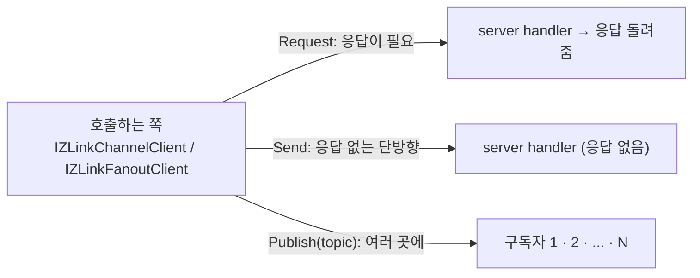

<!-- framework-adapter-nav:start -->
[문서 목록](../../../../doc/README.ko.md) | [이전: 핵심 개념](./03-concepts.ko.md) | [다음: SPOT — room · stage · zone](./05-spot.ko.md)
<!-- framework-adapter-nav:end -->

# 4. Channel Messaging — request · send · pub/sub

> 정식 계약은 [spec/aspnet-core-channel-messaging](../spec/aspnet-core-channel-messaging.ko.md)와
> [spec/handler-interfaces](../spec/handler-interfaces.ko.md)가 소유한다. 이
> 챕터는 그 표면을 실제로 어떻게 등록하고 호출하는지 사용법 중심으로 다룬다.

channel messaging 은 framework 의 가장 기본 축이다. 세 가지 상호작용을 다룬다.

- **request/response** — 응답이 필요한 1:1 호출 (DEALER → ROUTER)
- **one-way send** — 응답이 없는 단방향 명령 (DEALER → ROUTER)
- **publish/subscribe** — 여러 구독자에게 이벤트 fan-out (PUB / SUB)

> 🔰 용어(channel·handler·client·codec 등)가 낯설면
> [03-concepts §0](./03-concepts.ko.md)의 한 줄 풀이를 먼저 본다.
> 괄호 안 `DEALER → ROUTER`·`PUB / SUB` 는 하부 소켓 종류로, **응용이 직접 다루지
> 않는다**(framework 가 channel 종류에 따라 자동 매핑).

세 상호작용을 그림으로 먼저 잡으면 이렇다.



- **request** 는 보낸 뒤 **응답을 기다린다**(예: 가격 조회).
- **send** 는 **던지고 끝**이다(예: 캐시 무효화 통지).
- **publish** 는 한 번 보내면 **구독한 모두**가 받는다(예: 도메인 이벤트 전파).

## 0. gRPC 를 쓰던 웹 서비스라면

이 축은 게임 서버 전용이 아니다. 일반 웹/마이크로서비스 백엔드에서 **서비스 간
gRPC 를 대체**하는 용도로 그대로 쓴다. 서비스마다 host:port 를 알리거나 앞단에
gateway/로드밸런서를 둘 필요 없이, 논리 `channel name` + discovery 로 호출을 묶는다.
`.proto` IDL·HTTP/2 전용 인프라·코드 생성 없이 DTO(record)와 typed handler 만으로
gRPC 의 네 가지 호출 형태를 얻는다.

| gRPC 패턴 | ZLink 대체 | 이 가이드 |
|-----------|------------|-----------|
| Unary RPC | request/response | §2·§4 |
| Unary `Empty` / fire-and-forget | one-way send | §2·§4 |
| Server streaming / 이벤트 피드 | pub/sub fan-out | §4 |
| Client/Bidi streaming | STREAM session | [07-stream](./07-stream.ko.md) |
| Service discovery(DNS/xDS) | Registry + Discovery | [08-registry](./08-registry.ko.md) |
| Interceptor | handler filter | §5 |
| Deadline | request timeout | §4 |

예를 들어 주문 서비스라면, gRPC `rpc PlaceOrder(...)` 가 다음과 같이 바뀐다.

```csharp
// 서버: handler 하나 (gRPC service 구현 대신)
public sealed class PlaceOrderHandler
    : IZLinkRequestHandler<PlaceOrder, OrderPlaced>
{
    private readonly IOrderStore _orders;
    public PlaceOrderHandler(IOrderStore orders) => _orders = orders;

    public async ValueTask<OrderPlaced> HandleAsync(
        PlaceOrder request, ZLinkRequestContext context, CancellationToken ct)
    {
        await _orders.SaveAsync(request, ct);
        return new OrderPlaced(request.OrderId);
    }
}

// 클라이언트: gRPC stub 대신 IZLinkChannelClient 주입
var placed = await client
    .RequestToChannel("orders", new PlaceOrder("order-1042", "acct-77", 18742))
    .Timeout(TimeSpan.FromSeconds(2))    // reply 대기 상한
    .Async<OrderPlaced>(ct);
```

이 호출 표면(`Request`/`Send`/`Publish` + 종결자)은
[11-interface-catalog](./11-interface-catalog.ko.md) §1.6 의 계약 테스트
`ChannelContracts.Channel_messaging_replaces_grpc_unary_command_and_streaming_for_web_services`
로 검증된다. 아래 본문 예제는 같은 표면을 profile/account/user 등 다른 웹 도메인으로
보여 준다.

> 비슷한 서비스를 새로 만들 때의 케이스 스터디·플래그십 워크스루·솔직한 경계
> (여전히 gRPC 가 맞는 곳)와 도입 판단은
> [12-grpc-alternative](./12-grpc-alternative.ko.md) 가 다룬다.

## 1. 두 가지 channel 종류

| 등록 메서드 | transport | capability | 용도 |
|-------------|-----------|------------|------|
| `AddClientServerChannel` | DEALER → ROUTER | `EnableServer` / `EnableClient` | request, send |
| `AddFanoutChannel` | PUB / SUB | `EnablePublisher` / `EnableSubscriber` | event fan-out |

request 와 send 는 같은 client-server channel 을 공유한다. pub/sub 는 별도의
fanout channel 이다.

## 2. handler 작성

handler 는 인터페이스를 구현하고, 결과를 반환값으로 돌려준다.

```csharp
// request-response
public sealed class GetProfileHandler
    : IZLinkRequestHandler<GetProfileRequest, GetProfileReply>
{
    private readonly IProfileStore _store;
    public GetProfileHandler(IProfileStore store) => _store = store;

    public async ValueTask<GetProfileReply> HandleAsync(
        GetProfileRequest request,
        ZLinkRequestContext context,
        CancellationToken cancellationToken)
    {
        var profile = await _store.LoadAsync(request.AccountId, cancellationToken);
        return new GetProfileReply(profile.AccountId, profile.Nickname);
    }
}

// one-way send (응답 없음)
public sealed class RefreshCacheHandler
    : IZLinkSendHandler<RefreshCacheCommand>
{
    public ValueTask HandleAsync(
        RefreshCacheCommand message,
        ZLinkSendContext context,
        CancellationToken cancellationToken)
    {
        // 캐시 무효화 등. 호출자는 결과를 기다리지 않는다.
        return ValueTask.CompletedTask;
    }
}

// publish 수신 (구독자 측)
public sealed class CacheRefreshedEventHandler
    : IZLinkPublishHandler<CacheRefreshedEvent>
{
    public ValueTask HandleAsync(
        CacheRefreshedEvent message,
        ZLinkPublishContext context,
        CancellationToken cancellationToken)
    {
        // context.Topic, context.Source 등을 읽을 수 있다.
        return ValueTask.CompletedTask;
    }
}
```

- handler 의존성은 **생성자 주입**으로 받는다(`IProfileStore` 처럼). context 에서
  service 를 꺼내는 service locator 패턴은 쓰지 않는다.
- handler context(`ZLinkRequestContext`, `ZLinkSendContext`, `ZLinkPublishContext`)
  는 공통적으로 channel 이름·packet 이름·content type·연결 취소 토큰을 제공한다.
  publish context 는 추가로 topic/source 를 제공한다.
- handler class 는 dispatch 키가 아니라 **코드 조직 단위**다. 메서드를 한 class 에
  주제별로 묶어도, packet 마다 class 를 따로 둬도 동작은 같다.
- interface 기반 handler 는 컴파일 타임 타입 체크가 가장 강하다. `HandleAsync(...)`
  의 payload, context, return 타입이 interface 계약과 맞지 않으면 컴파일이 실패한다.

### attribute 기반 메서드 handler

인터페이스 대신 attribute 를 단 메서드로도 같은 handler 를 작성할 수 있다. 한
class 에 여러 handler 메서드를 둘 때 편하다.

```csharp
[ZLinkHandlerGroup("api")]
public sealed class UserHandlers
{
    private readonly IZLinkFanoutClient _publisher;
    public UserHandlers(IZLinkFanoutClient publisher) => _publisher = publisher;

    [ZLinkRequest]
    public ValueTask<GetUserReply> GetUserAsync(
        GetUserRequest request,
        ZLinkRequestContext context,
        CancellationToken cancellationToken)
        => ValueTask.FromResult(new GetUserReply(request.AccountId, "alice"));

    [ZLinkSend]
    public async ValueTask RefreshCacheAsync(
        RefreshUserCacheCommand command,
        ZLinkSendContext context,
        CancellationToken cancellationToken)
    {
        await _publisher
            .Publish("api.events", "user.cache-refreshed",
                new UserCacheRefreshedEvent(command.AccountId))
            .Async(cancellationToken);
    }
}
```

- 메서드 시그니처는 `(payload, context?, CancellationToken?)` 순서이며 context 와
  토큰은 생략할 수 있다.
- attribute 기반 handler 는 한 class 에 여러 request/send/publish 메서드를 묶기
  쉽지만, interface 기반처럼 handler 계약을 컴파일 타임에 강하게 고정하지는 않는다.
  잘못된 context 타입이나 반환 타입은 framework 의 scan/validation 또는 실행 단계에서
  드러날 수 있다.
- `[ZLinkRequest]`/`[ZLinkSend]`/`[ZLinkPublish]` 는 **channel 이름을 받지
  않는다.** channel 매핑은 등록이 소유한다(§3).

handler 작성 방식은 다음 기준으로 고른다.

- handler 하나를 class 하나로 분리하고 타입 안전성을 우선하면 interface 기반을 쓴다.
- 같은 주제의 handler 메서드를 한 class 에 여러 개 담고 싶으면 attribute 기반을 쓴다.
- 샘플 프로젝트는 channel 노출 방식은 `AddHandlerGroup(...)`으로 통일하되, handler
  작성 방식은 위 차이에 따라 선택한다.

## 3. handler 를 channel 에 노출하기

framework 는 발견한 handler 를 모든 channel 에 자동으로 열지 않는다. **발견과
노출은 별개 단계**다.

### 방법 A — group + AddHandlerGroup (여러 handler 묶음)

```csharp
builder.Services.AddZLinkFramework(options =>
{
    options.AddClientServerChannel("api", channel =>
    {
        channel.EnableServer(server => server.Bind("tcp://0.0.0.0:7101"));
        channel.AddHandlerGroup("api");          // [ZLinkHandlerGroup("api")] 묶음 노출
    });

    options.AddHandlersFromAssemblyOf<Program>(); // handler 후보 발견(노출 아님)
});
```

- `[ZLinkHandlerGroup("api")]` 가 안 붙은 class 는 어느 channel 에도 매핑되지
  않는다(opt-in 표식).
- 같은 group 을 여러 channel 에, 한 channel 에 여러 group 을 매핑할 수 있다.

### 방법 B — typed registration (개별 등록)

```csharp
options.AddClientServerChannel("price", channel =>
{
    channel.EnableServer(server => server.Bind("tcp://0.0.0.0:7301"));
    channel.AddRequestHandler<GetPriceHandler>();
    channel.AddSendHandler<RefreshCacheHandler>();
});
```

fanout channel 의 publish handler 는 builder 의 `AddPublishHandler<...>()` 또는
group 매핑으로 등록한다.

> **packet 이름 해석 순서:** ① builder 의 `PacketName(...)`/`packetName` 인자 → ②
> payload 타입의 `[ZLinkPacket("...")]` → ③ 둘 다 없으면 타입 이름(`Type.Name`).
> 같은 channel 안에서 `kind + packet 이름` 이 겹치면 **시작 단계에서 예외**다. 다른
> channel 끼리는 같은 packet 이름을 재사용해도 된다.

## 4. outbound 호출

### request / send — `IZLinkChannelClient`

```csharp
public sealed class PriceService(IZLinkChannelClient client)
{
    public async Task<decimal> GetAsync(string symbol, CancellationToken ct)
    {
        var reply = await client
            .RequestToChannel("price", new PriceRequest(symbol))
            .Timeout(TimeSpan.FromMilliseconds(200))   // reply 대기 시간
            .Async<PriceReply>(ct);
        return reply.Price;
    }

    public ValueTask RefreshAsync(string accountId, CancellationToken ct)
        => client
            .SendToChannel("profile", new RefreshCacheCommand(accountId))
            .PacketName("profile.refresh-cache")        // 선택: packet 이름 override
            .Async(ct);
}
```

- reply 타입은 메시지가 아니라 **`.Async<TReply>(...)`** 에서 지정한다.
- `Request` 에만 `Timeout(...)` 이 있다. `Send` 는 응답을 기다리지 않으므로 없다.
- channel 이나 client capability 가 없으면 socket 을 만들지 않고
  `ZLinkConfigurationException` 으로 실패한다(`IZLinkChannelClient` 자체는 항상 DI 에
  등록되어 있다).

### publish — `IZLinkFanoutClient`

```csharp
public sealed class ProfileService(IZLinkFanoutClient publisher)
{
    public ValueTask AnnounceAsync(string accountId, CancellationToken ct)
        => publisher
            .Publish("api.events", "profile.cache-refreshed",
                new ProfileCacheRefreshedEvent(accountId))
            .Async(ct);
}
```

- `Publish` 는 인자가 **3개**다: `channelName`, `topic`, `message`. topic 은 그
  channel 안에서 어느 구독자 집합이 받을지를 정하는 fan-out 라우팅 값이다.
- publish 는 한 번만 직렬화하고 구독자 수만큼 task 를 만들지 않는다(framework 내부
  최적화).
- `IZLinkFanoutClient` 는 fanout channel 에 publish 하는 DI client 이다.

> `Async(...)`/`Async<T>(...)` 의 완료는 transport 위임까지만 보장한다.
> remote handler 완료나 구독자 수신을 보장하지 않는다([03-concepts](./03-concepts.ko.md) §7).

## 5. filter — 공통 처리

ASP.NET Core HTTP middleware(`app.Use(...)`)는 HTTP 파이프라인 전용이라 ZLink
handler 에는 적용되지 않는다. logging/validation/authorization/metrics 같은 공통
처리는 `IZLinkHandlerFilter` 로 한다.

```csharp
public sealed class LoggingFilter(ILogger<LoggingFilter> logger)
    : IZLinkHandlerFilter
{
    public async ValueTask<object?> InvokeAsync(
        ZLinkHandlerInvocation invocation,
        ZLinkHandlerDelegate next,
        CancellationToken cancellationToken)
    {
        logger.LogInformation("dispatch {Packet}", invocation.PacketName);
        return await next(cancellationToken);   // 호출하지 않으면 handler 미실행
    }
}

// 등록 (등록 순서대로 pipeline 구성)
builder.Services.AddZLinkFramework(options =>
{
    options.UseFilter<LoggingFilter>();
    options.UseFilter<ValidationFilter>();
});
```

filter 도 `new` 가 아니라 .NET DI 에서 resolve 된다.

## 6. 연결 제어

기본은 `UseDiscovery(...AddRegistryEndpoint...)` 자동 연결이다([03-concepts](./03-concepts.ko.md) §5).
수동 연결은 startup builder 에서 capability 단위로 설정한다.

```csharp
// 등록 시점 수동 연결 (capability 단위)
options.AddClientServerChannel("profile", channel =>
{
    channel.EnableClient(client =>
    {
        client.UseManualConnections(peers =>
        {
            peers.Connect("tcp://10.0.10.15:7101");
            peers.Connect("tcp://10.0.10.16:7101");
        });
    });
});
```

`UseManualConnections(...)` 에서 받은 연결 집합은 설정 객체다. `Connect`,
`Disconnect`, `ListConnections` 는 등록 중 endpoint 목록을 편집하기 위한 함수이며,
host 시작 뒤 실행 중인 socket 을 직접 제어하는 handle 이 아니다.

Discovery 모드는 peer 소유권이 Discovery 에 있다. 실행 중 endpoint 변경이 필요한
운영 환경에서는 discovery 쪽 등록 정보를 갱신하거나, 애플리케이션을 재시작해
수동 연결 설정을 다시 적용하는 방식으로 처리한다.

## 7. 직렬화 codec

payload 직렬화 codec 은 framework 등록에서 켠다.

```csharp
options.Codecs.AddProtobuf();
options.Codecs.AddJson();
options.Codecs.AddMessagePack();
```

payload 는 codec 이 직렬화할 수 있는 DTO 여야 한다. root/요소 타입이
abstract/interface 면 명시 codec 없이는 설정 오류가 난다.

## 8. 통합 예제 — 서버 + outbound + pub/sub

```csharp
var builder = WebApplication.CreateBuilder(args);

builder.Services.AddZLinkFramework(options =>
{
    options.DefaultTimeout = TimeSpan.FromSeconds(1);
    options.Codecs.AddProtobuf();

    // 들어오는 요청을 받는 서버 channel
    options.AddClientServerChannel("api", channel =>
    {
        channel.EnableServer(server => server.Bind("tcp://0.0.0.0:7101"));
        channel.AddHandlerGroup("api");
    });

    // 이벤트 발행/구독 channel
    options.AddFanoutChannel("api.events", channel =>
    {
        channel.EnablePublisher(publisher => publisher.Bind("tcp://0.0.0.0:7201"));
        channel.EnableSubscriber();
        channel.AddHandlerGroup("api.events");
    });

    // 다른 서비스로 나가는 outbound channel
    options.AddClientServerChannel("account", channel => channel.EnableClient());

    options.UseDiscovery(discovery => discovery.AddRegistryEndpoint("tcp://registry1:5551"));
    options.UseDiscovery(discovery => discovery.AddRegistryEndpoint("tcp://registry2:5551"));
    options.AddHandlersFromAssemblyOf<Program>();
});

var app = builder.Build();

app.MapPost("/users/{id}", async (
    string id, IZLinkChannelClient client, CancellationToken ct) =>
{
    var account = await client
        .RequestToChannel("account", new GetAccountRequest(id))
        .Async<GetAccountReply>(ct);
    return Results.Ok(account);
});

app.Run();

[ZLinkHandlerGroup("api")]
public sealed class UserHandlers(IZLinkFanoutClient publisher)
{
    [ZLinkRequest]
    public ValueTask<GetUserReply> GetUserAsync(
        GetUserRequest request, ZLinkRequestContext context, CancellationToken ct)
        => ValueTask.FromResult(new GetUserReply(request.AccountId, "alice"));

    [ZLinkSend]
    public ValueTask RefreshAsync(
        RefreshUserCacheCommand command, ZLinkSendContext context, CancellationToken ct)
        => publisher
            .Publish("api.events", "user.cache-refreshed",
                new UserCacheRefreshedEvent(command.AccountId))
            .Async(ct);
}

[ZLinkHandlerGroup("api.events")]
public sealed class UserCacheRefreshedEventHandler
    : IZLinkPublishHandler<UserCacheRefreshedEvent>
{
    public ValueTask HandleAsync(
        UserCacheRefreshedEvent message, ZLinkPublishContext context, CancellationToken ct)
        => ValueTask.CompletedTask;
}
```

## 9. 자주 막히는 곳

- **handler 가 안 불린다** → `AddHandlersFromAssemblyOf(...)` 만으로는 노출되지
  않는다. `AddHandlerGroup(...)` 또는 typed registration 이 필요하다(§3).
- **`ZLinkConfigurationException`** → channel 이 없거나 해당 capability 가 없는
  경우. 등록을 확인한다.
- **시작 시 예외** → channel 이름 중복, 같은 channel `kind + packet 이름` 중복,
  client 에 연결 경로 없음. fail-fast 다([03-concepts](./03-concepts.ko.md) §4).
- **`ZLink` vs `Zlink`** → 서버 framework 타입은 전부 `ZLink`(대문자 L)다.

## 10. 더 보기

- 이 챕터 계약의 실행 검증 예문(client/handler/filter/codec): [11-interface-catalog](./11-interface-catalog.ko.md) §1 — 검증 클래스 `ChannelContracts`·`HandlerContracts`·`CodecContracts`
- 전체 인터페이스/attribute/context: [spec/handler-interfaces](../spec/handler-interfaces.ko.md)
- dispatch 흐름·lifecycle 정식 계약: [spec/aspnet-core-channel-messaging](../spec/aspnet-core-channel-messaging.ko.md)
- 실행 가능한 전체 예제: [guide/samples/channel-messaging-samples](./samples/channel-messaging-samples.ko.md)
- 다음 축: [05-spot](./05-spot.ko.md)
