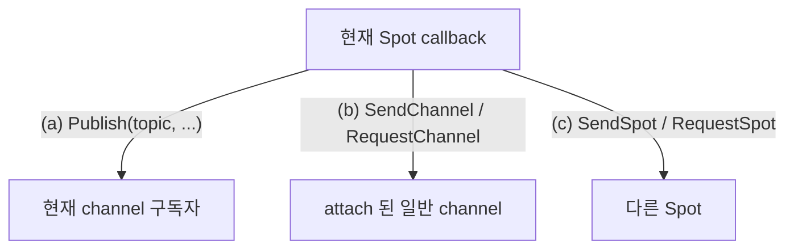

<!-- framework-adapter-nav:start -->
[문서 목록](../../../../doc/README.ko.md) | [이전: Channel Messaging](./04-channel-messaging.ko.md) | [다음: Actor · Session Actor Dispatch](./06-actor-session.ko.md)
<!-- framework-adapter-nav:end -->

# SPOT — room · stage · zone

> 정식 계약은 [spec/aspnet-core-spot](../spec/aspnet-core-spot.ko.md),
> [spec/spot-node](../spec/spot-node.ko.md), [spec/stage-wrapper-on-spot](../spec/stage-wrapper-on-spot.ko.md)가
> 소유한다. 이 챕터는 SPOT 을 등록하고 다루는 사용법 중심이다.
>
> 🔰 SPOT·actor·Entry Spot 등 용어가 낯설면 [03-concepts §0](./03-concepts.ko.md)의
> 한 줄 풀이를 먼저 본다.

## 1. SPOT 이란

`SPOT` 은 동적으로 생성·소멸되는 **주소 가능한 논리 인스턴스**다. 게임 room,
playhouse stage, 채팅 room, MMORPG zone 처럼 "있다가 없어지는 단위"를 메시지
라우팅 대상으로 삼는다.

| 개념 | 뜻 |
|------|------|
| `Spot` | room/stage/zone 같은 논리 인스턴스 하나 |
| `SpotNode` | 여러 spot 인스턴스를 호스팅하는 컨테이너 노드 |
| `TSpot` | 생성할 user Spot 타입. framework 안에서 factory 선택에만 쓰며 public 식별자로 들고 다니지 않는다 |
| `spotRid` (`RoutingId`) | `SpotNode` 가 인스턴스 생성 시 발급하는 **논리 주소**. 특정 room/stage 한 개를 가리킨다 |
| Entry Spot | 노드의 기본 실행 컨텍스트(actor 가 생성 직후 머무는 곳) |

SPOT 은 pub/sub helper 가 아니다. publish/subscribe 는 spot **안에서** 쓰는 한
기능일 뿐이다.

규칙 몇 가지:

- `Spot` 은 특정 service 가 아니라 `SpotNode` 에 종속된다.
- `SpotNode` 의 router 와 pub/sub mesh 는 **같은 channel 의 다른 SpotNode 와만**
  연결된다. 다른 channel 로 나가는 호출은 attach 된 channel client 를 쓴다.
- 한 `SpotNode` 에는 active SPOT channel view 가 정확히 하나다.

## 2. SpotNode 등록

discovery 기반 mesh 로 묶는 형태가 표준이다.

```csharp
builder.Services.AddZLinkFramework(options =>
{
    options.AddSpotMesh("game.stage", mesh =>
    {
        mesh.UseDiscovery(discovery => discovery.Add("tcp://registry1:5551"));

        mesh.AddNode("stage-node", node =>
        {
            node.EnableRouter(router =>
            {
                router.SetRouterBind("tcp://0.0.0.0:9001");
            });                                                // routed packet 수신
            node.EnablePubSub(pubsub =>
            {
                pubsub.SetPubBind("tcp://0.0.0.0:9000");
            });                                                // 현재 channel publish/subscribe
            node.AttachClientServerChannelClient("orders");   // 다른 channel 로 send/request
            node.AddSpotFactory<StageSpot>();          // 이 노드가 만들 타입
        });
    });
});
```

node capability 는 서로 독립이다.

| node 함수 | 의미 |
|-----------|------|
| `Bind(endpoint)` | 노드의 local endpoint |
| `EnableRouter(router => router.SetRouterBind(endpoint))` | 다른 SpotNode/채널에서 오는 routed packet 수신 |
| `EnablePubSub()` | 현재 SPOT channel 의 publish/subscribe (없으면 `Publish` 불가) |
| `AttachClientServerChannelClient(name)` | 일반 channel 로 send/request 하는 client 부착 |
| `AddSpotFactory<TSpot>()` | 이 노드가 만들 spot 타입 등록. 타입 중복은 시작 예외 |
| `AddEntrySpot<TEntrySpot>()` | Entry Spot handler registry 부착(actor 사용 시, [actor spec](../spec/aspnet-core-actor.ko.md)) |

> top-level `UseDiscovery(...)` 를 등록하면 `AddSpotMesh(...)` 는 그 discovery endpoint 를
> 기본으로 상속한다. mesh 단위로 다른 endpoint 를 쓰려는 경우에만 `mesh.UseDiscovery(...)` 를
> 따로 둔다. 단일 노드만 띄우는 local 테스트도 `AddSpotMesh(...)` 안에서 빈
> `UseDiscovery(_ => { })` 와 `AddNode(...)` 로 표현한다.

## 3. Spot 작성 — handler 등록과 lifecycle

spot 클래스는 `IZLinkSpot` 을 구현하고, 주입받은 `Context` 에 handler·subscribe·
timer 를 `Configure()` 에서 등록한다.

```csharp
public sealed class StageSpot(IZLinkSpotContext context) : IZLinkSpot
{
    private IZLinkTimer? _heartbeat;
    public IZLinkSpotContext Context { get; } = context;

    // 같은 Spot 의 callback 은 직렬화되므로 이 상태에 lock 이 필요 없다.
    private int _occupants;

    public void Configure()
    {
        Context.AddPacket<GetStageStateHandler>();              // request/send packet
        Context.AddSubscribe<StageStateUpdatedHandler>("stage.state.updated"); // topic 구독
    }

    public async ValueTask OnInitializeAsync(CancellationToken cancellationToken)
    {
        _heartbeat = await Context.AddTimer<StageHeartbeatHandler>(
            "heartbeat",
            TimeSpan.FromSeconds(1),
            new ZLinkTimerOptions
            {
                OverrunPolicy = ZLinkTimerOverrunPolicy.DelayNextTick
            },
            cancellationToken);
    }

    public async ValueTask OnClosingAsync(CancellationToken cancellationToken)
    {
        if (_heartbeat is not null)
        {
            await _heartbeat.CancelAsync(cancellationToken);
        }
    }
}
```

spot handler 는 첫 인자로 spot 인스턴스를 받는다.

```csharp
public sealed class GetStageStateHandler
    : IZLinkSpotRequestHandler<StageSpot, GetStageStateRequest, GetStageStateReply>
{
    public ValueTask<GetStageStateReply> HandleAsync(
        StageSpot spot,
        GetStageStateRequest request,
        CancellationToken cancellationToken)
        => ValueTask.FromResult(new GetStageStateReply(spot.Context.SpotRid.ToString()));
}

public sealed class StageHeartbeatHandler : IZLinkSpotTimerHandler<StageSpot>
{
    public ValueTask HandleAsync(
        StageSpot spot, ZLinkTimerTick tick, CancellationToken cancellationToken)
        => ValueTask.CompletedTask;
}
```

> **실행 직렬화 — SPOT 의 핵심 보장.** 한 user Spot 의 모든 callback(packet,
> request, subscription, timer, actor packet, channel reply 후속)은 **하나의 Spot
> 실행 큐**에서 직렬로 돈다. 그래서 room board 같은 가변 상태를 lock 없이 만질 수
> 있다. 단 이 보장은 그 Spot 내부 callback 한정이다. 외부에서 `SpotRid` 로 직접
> 접근하는 코드는 별도 동기화가 필요하다.

### timer 사용법

timer 는 spot 안에서 주기적으로 상태를 갱신하거나, 오래된 참가자를 정리하거나,
주기적인 snapshot 을 publish 할 때 사용한다. 일반적인 사용 흐름은 다음과 같다.

1. `Configure()` 에서는 packet, subscribe, actor handler 처럼 동기 등록만 한다.
2. `OnInitializeAsync(...)` 에서 `Context.AddTimer<THandler>(...)` 를 호출한다.
3. 반환된 `IZLinkTimer` 를 spot 필드에 보관한다.
4. `OnClosingAsync(...)` 에서 `CancelAsync(...)` 로 멈춘다.
5. 실제 주기 작업은 `IZLinkSpotTimerHandler<TSpot>` 구현체에 둔다.

`AddTimer<THandler>(name, period, options, cancellationToken)` 의 인자는 다음 의미다.

| 인자 | 의미 |
|------|------|
| `THandler` | tick 이 발생할 때 실행할 handler 타입. DI 로 생성된다 |
| `name` | timer 이름. monitoring 과 tick metadata 에 들어간다 |
| `period` | tick 간격. `TimeSpan.Zero` 나 음수는 설정 오류다 |
| `options` | tick 이 밀릴 때의 정책과 예외 처리 정책 |
| `cancellationToken` | 등록 작업 취소 토큰 |

timer handler 는 매 tick 마다 spot 인스턴스와 `ZLinkTimerTick` 을 받는다.

```csharp
public sealed class StageHeartbeatHandler : IZLinkSpotTimerHandler<StageSpot>
{
    public async ValueTask HandleAsync(
        StageSpot spot,
        ZLinkTimerTick tick,
        CancellationToken cancellationToken)
    {
        if (tick.SkippedTicks > 0)
        {
            // 이전 tick 이 밀렸다는 뜻이다. 무거운 보정 작업은 여기서 줄일 수 있다.
        }

        await spot.Context
            .Publish("stage.heartbeat", new StageHeartbeat(spot.Context.SpotRid, tick.StartedAt))
            .Submit(cancellationToken);
    }
}
```

`ZLinkTimerTick` 은 "이번 callback 이 시간표에서 어떤 위치였고, 실제로 얼마나
늦게 실행됐는지"를 설명하는 값이다. handler 안에서 보정, 로깅, 부하 완화,
publish payload 작성에 사용할 수 있다.

| 값 | 의미 |
|----|------|
| `Name` | 등록한 timer 이름. handler 하나가 여러 timer 에 재사용될 때 분기하거나 monitoring payload 에 넣는다 |
| `DeliveryIndex` | 실제 handler callback 번호. "이 handler 가 몇 번째 실행됐는지"가 필요할 때 쓴다 |
| `ScheduledIndex` | fixed-rate 시간표 기준 tick 번호. 건너뛴 tick 까지 포함한 논리 tick 번호다 |
| `Period` | 등록한 tick 간격. handler 에서 다음 상태 계산의 기본 간격으로 쓴다 |
| `ScheduledAt` | 원래 실행될 예정이던 시각. 외부 이벤트 timestamp 나 timeout 판정 기준으로 쓴다 |
| `StartedAt` | handler 실행이 시작된 실제 시각. publish payload 나 last-seen 갱신에 쓴다 |
| `ScheduledElapsed` | timer 시작 이후 `ScheduledAt` 까지의 논리 경과 시간 |
| `StartedElapsed` | timer 시작 이후 `StartedAt` 까지의 실제 경과 시간 |
| `Delay` | 예정 시각보다 얼마나 늦게 시작했는지. timer 부하 감지와 degrade 판단에 쓴다 |
| `SkippedTicks` | overrun 정책 때문에 건너뛴 tick 수. 무거운 보정 작업을 줄이거나 상태를 빠르게 catch-up 할 때 쓴다 |

`DeliveryIndex` 와 `ScheduledIndex` 는 항상 같은 값이 아니다. tick 이 밀려 일부
tick 을 건너뛰면 `ScheduledIndex` 는 시간표를 따라 앞으로 가고,
`DeliveryIndex` 는 실제 callback 횟수만 증가한다. 그래서 "실제로 몇 번
callback 이 왔는가"는 `DeliveryIndex`, "논리 시간표에서 몇 번째 tick 인가"는
`ScheduledIndex` 를 기준으로 삼는다.

활용 패턴 몇 가지는 다음과 같다.

```csharp
public sealed class StageTickHandler : IZLinkSpotTimerHandler<StageSpot>
{
    public ValueTask HandleAsync(
        StageSpot spot,
        ZLinkTimerTick tick,
        CancellationToken cancellationToken)
    {
        // 1. fixed-rate 논리 시간 기준으로 simulation 을 진행한다.
        spot.AdvanceSimulation(tick.ScheduledIndex, tick.Period);

        // 2. timer 가 많이 늦었으면 비용이 큰 부가 작업은 건너뛴다.
        if (tick.Delay < TimeSpan.FromMilliseconds(250))
        {
            spot.RebuildDerivedView();
        }

        // 3. skip 이 있었다면 최신 상태 기준으로 빠르게 보정한다.
        if (tick.SkippedTicks > 0)
        {
            spot.MarkTimerLagged(tick.SkippedTicks);
        }

        return ValueTask.CompletedTask;
    }
}
```

`ScheduledAt` 과 `StartedAt` 은 목적이 다르다. `ScheduledAt` 은 timer 가 원래
실행됐어야 하는 논리 시각이고, `StartedAt` 은 실제 callback 이 시작된 시각이다.
turn timeout, room TTL, simulation step 처럼 논리 시간이 중요하면 `ScheduledAt`
또는 `ScheduledElapsed` 를 기준으로 삼는다. heartbeat publish, last-seen 갱신,
운영 로그처럼 실제 관측 시각이 중요하면 `StartedAt` 또는 `StartedElapsed` 를
사용한다.

### timer 정책

`ZLinkTimerOptions.OverrunPolicy` 로 tick 이 밀릴 때 동작을 정한다.

| 정책 | 동작 |
|------|------|
| `SkipLateTicks` | 늦은 tick 은 버리고 다음 정시 tick 으로 이동한다 |
| `CatchUpBounded` | `MaxCatchUpTicks` 까지만 밀린 tick 을 연속 보충한다 |
| `DelayNextTick` | handler 완료 후 period 만큼 다시 기다린다 |

정책 선택 기준은 보통 다음과 같다.

| 상황 | 권장 정책 | 이유 |
|------|----------|------|
| heartbeat, presence refresh, stale actor cleanup | `SkipLateTicks` | 최신 상태 한 번이면 충분하다 |
| physics step, turn timeout 보정처럼 빠진 tick 을 일부 반영해야 함 | `CatchUpBounded` | 무한 catch-up 을 막으면서 제한적으로 보충한다 |
| polling, 외부 API 호출, DB cleanup 처럼 handler 완료 뒤 쉬어야 함 | `DelayNextTick` | handler 시간이 길어도 겹쳐 실행하지 않고 부하를 제한한다 |

`CatchUpBounded` 를 쓰면 `MaxCatchUpTicks` 도 함께 정한다.

```csharp
_timer = await Context.AddTimer<StageTickHandler>(
    "stage.tick",
    TimeSpan.FromMilliseconds(100),
    new ZLinkTimerOptions
    {
        OverrunPolicy = ZLinkTimerOverrunPolicy.CatchUpBounded,
        MaxCatchUpTicks = 3
    },
    cancellationToken);
```

기본값은 `SkipLateTicks` 다. `MaxCatchUpTicks` 는 `CatchUpBounded` 에서만 의미가
있고, `CatchUpBounded` 로 설정했는데 `MaxCatchUpTicks <= 0` 이면 설정 오류다.

### 예외와 종료

timer handler 에서 처리하지 않은 예외가 나면 runtime monitoring 에
`TimerHandlerFailed` 이벤트가 발생한다([09-monitoring](./09-monitoring.ko.md)).
기본값에서는 다음 tick 을 계속 시도한다. 같은 예외가 반복될 수 있는 작업이라면
handler 안에서 application 상태를 점검하고 직접 복구하거나, timer 를 중단하도록
설정한다.

```csharp
_timer = await Context.AddTimer<StageHeartbeatHandler>(
    "heartbeat",
    TimeSpan.FromSeconds(1),
    new ZLinkTimerOptions
    {
        StopOnUnhandledException = true
    },
    cancellationToken);
```

`StopOnUnhandledException` 이 `true` 이면 첫 unhandled exception 뒤 timer 를
중단하고 `TimerStoppedAfterUnhandledException` 이벤트를 기록한다.

timer 를 더 이상 쓰지 않으면 `CancelAsync(...)` 를 호출한다. 예를 들어 room 이
닫히거나 spot 이 closing 될 때 멈춘다.

```csharp
public async ValueTask OnClosingAsync(CancellationToken cancellationToken)
{
    if (_heartbeat is not null)
    {
        await _heartbeat.CancelAsync(cancellationToken);
    }
}
```

user Spot timer 는 같은 spot 실행 큐에서 처리된다. 그래서 같은 spot 의 packet
handler 와 timer handler 는 동시에 같은 spot 상태를 변경하지 않는다. 반대로
Entry Spot timer 는 Entry Spot 전체 callback 을 전역으로 막지 않는다. 그래도 같은
timer instance 의 callback 은 겹쳐 실행되지 않는다.

## 4. spot 인스턴스 생성과 조회

spot 인스턴스는 handler 가 아니라 `IZLinkSpotManager` 로 생성·조회한다.

```csharp
public sealed class StageAllocator(IZLinkSpotManager spots, IZLinkSpotClient client)
{
    public async Task<string> OpenAsync(CancellationToken ct)
    {
        ZLinkSpotCreateResult stage = await spots.CreateAsync<StageSpot>(ct);

        await client
            .Publish("stage.state.updated",
                new StageStateUpdatedEvent(stage.SpotRid.ToString()))
            .Submit(ct);

        return stage.SpotRid.ToString();
    }
}
```

- `CreateAsync<TSpot>()` 는 빈 payload 로 생성하고 `OnInitializeAsync` 가 한 번
  실행된다.
- `GetOrCreateAsync<TSpot>(spotRid, ...)` 는 이미 있으면 재사용(`Created =
  false`), 타입이 다르면 `SpotTypeMismatch` 로 실패한다.
- 반환된 `ZLinkSpotCreateResult` 는 long-lived handle 이 아니다. `SpotRid`/
  `Created` 만 들고 다니고, 이후 메시징은 publish 나 attach 된 channel
  client 로 한다.

## 5. SPOT 의 세 가지 outbound 표면

SPOT 에서 밖으로 나가는 호출은 세 축으로 나뉜다.



### (a)(b)(c) current Spot 안에서 — `IZLinkSpotClient`

```csharp
public sealed class StageNoticeHandler(IZLinkSpotClient client)
    : IZLinkSpotRequestHandler<StageSpot, BroadcastRequest, BroadcastReply>
{
    public async ValueTask<BroadcastReply> HandleAsync(
        StageSpot spot, BroadcastRequest request, CancellationToken ct)
    {
        // (a) 현재 channel 의 topic 으로 publish
        await client.Publish("stage.notice", new StageNoticeEvent(request.Text)).Submit(ct);

        // (b) attach 된 일반 channel 로 send/request
        await client.SendChannel("orders", new RoomNoticeMessage(request.Text)).Submit(ct);
        var state = await client
            .RequestChannel("orders", new GetOrderStateRequest())
            .Timeout(TimeSpan.FromMilliseconds(200))
            .SubmitAsync<GetOrderStateReply>(ct);

        // (c) 다른 Spot 으로 (RoutingId)
        await client.SendSpot(spotRid, new StageNoticeEvent(request.Text)).Submit(ct);

        return new BroadcastReply(state.Count);
    }
}
```

### routed Spot 호출 — current Spot 밖에서

HTTP handler, 일반 channel handler, background service 처럼 **current Spot 이
없는** 코드에서 특정 Spot 으로 호출할 때는 `IZLinkRoutedSpotClient` 를 쓰고, 사용할
local egress channel 을 **명시적으로** 고른다.

```csharp
app.MapPost("/stage/{rid}/query", async (
    string rid,
    IZLinkRoutedSpotClient spots,
    CancellationToken cancellationToken) =>
{
    var reply = await spots
        .ViaEgressChannel("gateway.client")             // 내가 쓸 local egress channel
        .RequestSpot(RoutingId.Of(rid), new GetStageStateRequest())  // target Spot
        .SubmitAsync<GetStageStateReply>(cancellationToken);

    return Results.Ok(reply);
});
```

이 경로의 배선은 세 부분으로 구성된다.

1. **local egress channel** — 호출 측 프로세스에 `EnableSpotRouteEgress(...)` 가
   걸린 client-server DEALER channel(또는 route mesh channel).
2. **target SpotNode ingress channel** — 받는 SpotNode 에
   `EnableRouter(router => router.SetRouterBind(endpoint))` +
   `AcceptSpotRoutesFromChannel(name)` 가 걸린 ingress.
3. **target Spot routing id** — `RoutingId`.

```csharp
// 호출 측: local egress channel 등록
options.AddClientServerChannel("gateway.client", channel =>
{
    channel.EnableClient(client =>
        client.UseManualConnections(peers => peers.Connect("tcp://play-node-1:7201")));
    channel.EnableSpotRouteEgress("play.route");   // 값은 target 의 ingress channel 이름
});

// 받는 측(SpotNode): ingress 수용
mesh.AddNode("play-node", node =>
{
    node.EnableRouter(router =>
    {
        router.SetRouterBind("tcp://0.0.0.0:7202");
    });
    node.AcceptSpotRoutesFromChannel("play.route");
});
```

> **혼동 주의:** `EnableSpotRouteEgress("play.route")` 의 값은 local channel 이름이
> 아니라 **target SpotNode 가 `AcceptSpotRoutesFromChannel("play.route")` 로 연
> ingress channel 이름**이다. target Spot 은 문자열이 아니라 `RoutingId` 로 넘긴다.

`AcceptSpotRoutesFromChannel(...)` 은 application handler 매핑이 아니라 **transport
연결**이다. router-capable channel 두 종류(`AddClientServerChannel` 의 server
ROUTER, `AddRouteMeshChannel` 의 route mesh ROUTER)를 ingress 로 받을 수 있다.

### local spot 없는 노드에서 publish — `IZLinkSpotPublisherClient`

로컬 spot 인스턴스가 없는 노드가 SPOT channel 로 이벤트만 쏠 때 쓴다.

```csharp
app.MapPost("/stage/publish", async (
    PublishStageStateHttpRequest request,
    IZLinkSpotPublisherClient spotPublisher,
    CancellationToken ct) =>
{
    await spotPublisher
        .Publish("game.stage", "stage.state.updated",
            new StageStateUpdatedEvent(request.StageRid))
        .Submit(ct);
    return Results.Accepted();
});
```

이 client 를 쓰려면 노드에 `AttachSpotPublisherClient("game.stage")` 가
부착돼 있어야 한다.

## 6. Stage wrapper (playhouse Stage 류)

`playhouse` Stage 같은 상위 실행 모델을 SPOT 위에 올릴 수 있다. SPOT 이 transport
바닥(노드 lifecycle, spotRid 생성/삭제, publish/subscribe, attach client
send/request, timer, 같은 Spot 직렬 실행)을 제공하고, wrapper 는 그 위에
membership 정책, broadcast 정책, 입장/권한, `stageId -> 주소` 조회를 얹는다.

자세한 추가 요건(실행 컨텍스트 계약, 생성 시 초기 메타데이터, directory)은
[spec/stage-wrapper-on-spot](../spec/stage-wrapper-on-spot.ko.md)가 소유한다.

## 7. 자주 막히는 곳

- **`Publish` 가 안 된다** → 노드에 `EnablePubSub()` 가 없다.
- **routed 호출이 안 나간다** → egress(`EnableSpotRouteEgress`)와 ingress
  (`AcceptSpotRoutesFromChannel`) 이름이 짝이 맞는지, target ROUTER 에 실제로
  연결돼 있는지 확인한다.
- **Spot factory 타입 중복** → 같은 `SpotNode` 안에서 같은 타입을 두 번 등록하면 시작 예외.
- **spot 상태에 lock 을 걸어야 하나?** → 같은 user Spot 내부 callback 끼리는 직렬
  실행이라 불필요. 외부 `SpotRid` 직접 접근만 별도 동기화.

## 8. 더 보기

- 이 챕터 계약의 실행 검증 예문(spot/context/client/handler): [11-interface-catalog](./11-interface-catalog.ko.md) §3 — 검증 클래스 `SpotContracts`
- 노드/채널 builder 계약: [11-interface-catalog](./11-interface-catalog.ko.md) §2.3 — 검증 클래스 `BuilderContracts`
- 정식 계약: [spec/aspnet-core-spot](../spec/aspnet-core-spot.ko.md), [spec/spot-node](../spec/spot-node.ko.md)
- 실행 가능한 전체 예제(room/stage/zone): [guide/samples/spot-samples](./samples/spot-samples.ko.md)
- spot 안의 참가자별 상태/세션이 필요하면: [06-actor-session](./06-actor-session.ko.md)
