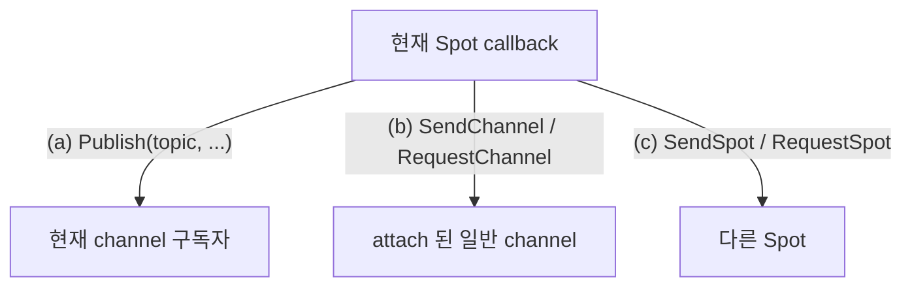

<!-- framework-adapter-nav:start -->
[문서 목록](../../../../doc/README.ko.md) | [이전: Channel Messaging](./04-channel-messaging.ko.md) | [다음: Actor · Session Actor Dispatch](./06-actor-session.ko.md)
<!-- framework-adapter-nav:end -->

# SPOT — room · stage · zone

> 정식 계약은 [spec/aspnet-core-spot](../spec/aspnet-core-spot.ko.md),
> [spec/spot-node](../spec/spot-node.ko.md), [spec/stage-wrapper-on-spot](../spec/stage-wrapper-on-spot.ko.md)가
> 소유한다. 이 챕터는 SPOT 을 등록하고 다루는 사용법 중심이다.

## 1. SPOT 이란

`SPOT` 은 동적으로 생성·소멸되는 **주소 가능한 논리 인스턴스**다. 게임 room,
playhouse stage, 채팅 room, MMORPG zone 처럼 "있다가 없어지는 단위"를 메시지
라우팅 대상으로 삼는다.

| 개념 | 뜻 |
|------|------|
| `Spot` | room/stage/zone 같은 논리 인스턴스 하나 |
| `SpotNode` | 여러 spot 인스턴스를 호스팅하는 컨테이너 노드 |
| `spotName` | 등록된 **factory 키**(예: `"room"`). 어느 타입으로 만들지 선택. wire 위로 흐른다 |
| `spotRid` (`RoutingId`) | `SpotNode` 가 인스턴스 생성 시 발급하는 **논리 주소**. 특정 room/stage 한 개를 가리킨다 |
| Entry Spot | 노드의 기본 실행 컨텍스트(actor 가 생성 직후 머무는 곳) |

SPOT 은 pub/sub helper 가 아니다. publish/subscribe 는 spot **안에서** 쓰는 한
기능일 뿐이다.

규칙 몇 가지:

- `Spot` 은 특정 service 가 아니라 `SpotNode` 에 종속된다.
- `SpotNode` 의 router 와 pub/sub mesh 는 **같은 channel 의 다른 SpotNode 와만**
  연결된다. 다른 channel 로 나가는 호출은 attach 된 channel client 를 쓴다.
- 한 `SpotNode` 에는 active SPOT channel view 가 정확히 하나다.

## 2. SpotNode 등록

discovery 기반 mesh 로 묶는 형태가 표준이다.

```csharp
builder.Services.AddZLinkFramework(options =>
{
    options.AddSpotMesh("game.stage", mesh =>
    {
        mesh.UseDiscovery(discovery => discovery.Add("tcp://registry1:5551"));

        mesh.AddNode("stage-node", node =>
        {
            node.Bind("tcp://0.0.0.0:9000");
            node.EnableRouter();                              // routed packet 수신
            node.EnablePubSub();                              // 현재 channel publish/subscribe
            node.AttachClientServerChannelClient("orders");   // 다른 channel 로 send/request
            node.AddSpotFactory<StageSpot>("stage");          // "stage" 이름으로 만들 타입
        });
    });
});
```

node capability 는 서로 독립이다.

| node 함수 | 의미 |
|-----------|------|
| `Bind(endpoint)` | 노드의 local endpoint |
| `EnableRouter()` | 다른 SpotNode/채널에서 오는 routed packet 수신 |
| `EnablePubSub()` | 현재 SPOT channel 의 publish/subscribe (없으면 `Publish` 불가) |
| `AttachClientServerChannelClient(name)` | 일반 channel 로 send/request 하는 client 부착 |
| `AddSpotFactory<TSpot>(name)` | 이 노드가 만들 spot 타입 등록. 이름 중복은 시작 예외 |
| `AddEntrySpot<TEntrySpot>()` | Entry Spot handler registry 부착(actor 사용 시, [actor spec](../spec/aspnet-core-actor.ko.md)) |

> mesh 기능(discovery/router/channel attach)을 쓰면 반드시 `AddSpotMesh(...)` +
> `mesh.UseDiscovery(...)` 형태여야 하며, discovery 없는 mesh 는 시작 단계에서
> 막힌다. discovery 없이 단일 노드만 띄우는 standalone 형태는 `AddSpotNode(...)`로
> 등록할 수 있지만 mesh 기능과 섞을 수 없다.

## 3. Spot 작성 — handler 등록과 lifecycle

spot 클래스는 `IZLinkSpot` 을 구현하고, 주입받은 `Context` 에 handler·subscribe·
timer 를 `Configure()` 에서 등록한다.

```csharp
public sealed class StageSpot(IZLinkSpotContext context) : IZLinkSpot
{
    private IZLinkTimer? _heartbeat;
    public IZLinkSpotContext Context { get; } = context;

    // 같은 Spot 의 callback 은 직렬화되므로 이 상태에 lock 이 필요 없다.
    private int _occupants;

    public void Configure()
    {
        Context.AddPacket<GetStageStateHandler>();              // request/send packet
        Context.AddSubscribe<StageStateUpdatedHandler>("stage.state.updated"); // topic 구독
    }

    public async ValueTask OnInitializeAsync(CancellationToken cancellationToken)
    {
        _heartbeat = await Context.AddTimer<StageHeartbeatHandler>(
            "heartbeat",
            TimeSpan.FromSeconds(1),
            new ZLinkTimerOptions
            {
                OverrunPolicy = ZLinkTimerOverrunPolicy.DelayNextTick
            },
            cancellationToken);
    }

    public ValueTask OnClosingAsync(CancellationToken cancellationToken)
        => ValueTask.CompletedTask;
}
```

spot handler 는 첫 인자로 spot 인스턴스를 받는다.

```csharp
public sealed class GetStageStateHandler
    : IZLinkSpotRequestHandler<StageSpot, GetStageStateRequest, GetStageStateReply>
{
    public ValueTask<GetStageStateReply> HandleAsync(
        StageSpot spot,
        GetStageStateRequest request,
        CancellationToken cancellationToken)
        => ValueTask.FromResult(new GetStageStateReply(spot.Context.SpotName));
}

public sealed class StageHeartbeatHandler : IZLinkSpotTimerHandler<StageSpot>
{
    public ValueTask HandleAsync(
        StageSpot spot, ZLinkTimerTick tick, CancellationToken cancellationToken)
        => ValueTask.CompletedTask;
}
```

> **실행 직렬화 — SPOT 의 핵심 보장.** 한 user Spot 의 모든 callback(packet,
> request, subscription, timer, actor packet, channel reply 후속)은 **하나의 Spot
> 실행 큐**에서 직렬로 돈다. 그래서 room board 같은 가변 상태를 lock 없이 만질 수
> 있다. 단 이 보장은 그 Spot 내부 callback 한정이다. 외부에서 `SpotRid` 로 직접
> 접근하는 코드는 별도 동기화가 필요하다.

### timer 정책

`ZLinkTimerOptions.OverrunPolicy` 로 tick 이 밀릴 때 동작을 정한다.

| 정책 | 동작 |
|------|------|
| `SkipLateTicks` | 늦은 tick 은 버리고 다음 정시 tick 으로 |
| `CatchUpBounded` | `MaxCatchUpTicks` 까지 밀린 tick 보충 |
| `DelayNextTick` | handler 완료 후 period 만큼 대기(fixed-delay) |

`ZLinkTimerTick` 에는 callback 번호, 예정 시각, 지연, `SkippedTicks` 등이 담긴다.
timer 는 `IZLinkTimer.CancelAsync()` 로 멈춘다. handler 에서 예외가 나면
`TimerHandlerFailed` 이벤트가 발생한다([09-monitoring](./09-monitoring.ko.md)).

## 4. spot 인스턴스 생성과 조회

spot 인스턴스는 handler 가 아니라 `IZLinkSpotManager` 로 생성·조회한다.

```csharp
public sealed class StageAllocator(IZLinkSpotManager spots, IZLinkSpotClient client)
{
    public async Task<string> OpenAsync(CancellationToken ct)
    {
        ZLinkSpotCreateResult stage = await spots.CreateAsync("stage", ct);

        await client
            .Publish("stage.state.updated",
                new StageStateUpdatedEvent(stage.SpotRid.ToString()))
            .Submit(ct);

        return stage.SpotRid.ToString();
    }
}
```

- `CreateAsync(spotName)` 는 빈 payload 로 생성하고 `OnInitializeAsync` 가 한 번
  실행된다.
- `GetOrCreateAsync(spotName, spotRid, ...)` 는 이미 있으면 재사용(`Created =
  false`), 타입이 다르면 `SpotTypeMismatch` 로 실패한다.
- 반환된 `ZLinkSpotCreateResult` 는 long-lived handle 이 아니다. `SpotRid`/
  `SpotName`/`Created` 만 들고 다니고, 이후 메시징은 publish 나 attach 된 channel
  client 로 한다.

## 5. SPOT 의 세 가지 outbound 표면

SPOT 에서 밖으로 나가는 호출은 세 축으로 나뉜다.



### (a)(b)(c) current Spot 안에서 — `IZLinkSpotClient`

```csharp
public sealed class StageNoticeHandler(IZLinkSpotClient client)
    : IZLinkSpotRequestHandler<StageSpot, BroadcastRequest, BroadcastReply>
{
    public async ValueTask<BroadcastReply> HandleAsync(
        StageSpot spot, BroadcastRequest request, CancellationToken ct)
    {
        // (a) 현재 channel 의 topic 으로 publish
        await client.Publish("stage.notice", new StageNoticeEvent(request.Text)).Submit(ct);

        // (b) attach 된 일반 channel 로 send/request
        await client.SendChannel("orders", new RoomNoticeMessage(request.Text)).Submit(ct);
        var state = await client
            .RequestChannel("orders", new GetOrderStateRequest())
            .Timeout(TimeSpan.FromMilliseconds(200))
            .SubmitAsync<GetOrderStateReply>(ct);

        // (c) 다른 Spot 으로 (spotName 또는 RoutingId)
        await client.SendSpot("stage-17", new StageNoticeEvent(request.Text)).Submit(ct);

        return new BroadcastReply(state.Count);
    }
}
```

### routed Spot 호출 — current Spot 밖에서

HTTP handler, 일반 channel handler, background service 처럼 **current Spot 이
없는** 코드에서 특정 Spot 으로 호출할 때는 `IZLinkRoutedSpotClient` 를 쓰고, 사용할
local egress channel 을 **명시적으로** 고른다.

```csharp
app.MapPost("/stage/{rid}/query", async (
    string rid,
    IZLinkRoutedSpotClient spots,
    CancellationToken cancellationToken) =>
{
    var reply = await spots
        .ViaEgressChannel("gateway.client")             // 내가 쓸 local egress channel
        .RequestSpot(RoutingId.Of(rid), new GetStageStateRequest())  // target Spot
        .SubmitAsync<GetStageStateReply>(cancellationToken);

    return Results.Ok(reply);
});
```

이 경로의 배선은 세 부분으로 구성된다.

1. **local egress channel** — 호출 측 프로세스에 `EnableSpotRouteEgress(...)` 가
   걸린 client-server DEALER channel(또는 route mesh channel).
2. **target SpotNode ingress channel** — 받는 SpotNode 에 `EnableRouter()` +
   `AcceptSpotRoutesFromChannel(name)` 가 걸린 ingress.
3. **target Spot routing id** — `RoutingId`.

```csharp
// 호출 측: local egress channel 등록
options.AddClientServerChannel("gateway.client", channel =>
{
    channel.EnableClient(client =>
        client.UseManualConnections(peers => peers.Connect("tcp://play-node-1:7201")));
    channel.EnableSpotRouteEgress("play.route");   // 값은 target 의 ingress channel 이름
});

// 받는 측(SpotNode): ingress 수용
mesh.AddNode("play-node", node =>
{
    node.Bind("tcp://0.0.0.0:7201");
    node.EnableRouter();
    node.AcceptSpotRoutesFromChannel("play.route");
});
```

> **혼동 주의:** `EnableSpotRouteEgress("play.route")` 의 값은 local channel 이름이
> 아니라 **target SpotNode 가 `AcceptSpotRoutesFromChannel("play.route")` 로 연
> ingress channel 이름**이다. target Spot 은 문자열이 아니라 `RoutingId` 로 넘긴다.

`AcceptSpotRoutesFromChannel(...)` 은 application handler 매핑이 아니라 **transport
연결**이다. router-capable channel 두 종류(`AddClientServerChannel` 의 server
ROUTER, `AddRouteMeshChannel` 의 route mesh ROUTER)를 ingress 로 받을 수 있다.

### local spot 없는 노드에서 publish — `IZLinkSpotPublisherClient`

로컬 spot 인스턴스가 없는 노드가 SPOT channel 로 이벤트만 쏠 때 쓴다.

```csharp
app.MapPost("/stage/publish", async (
    PublishStageStateHttpRequest request,
    IZLinkSpotPublisherClient spotPublisher,
    CancellationToken ct) =>
{
    await spotPublisher
        .Publish("game.stage", "stage.state.updated",
            new StageStateUpdatedEvent(request.StageRid))
        .Submit(ct);
    return Results.Accepted();
});
```

이 client 를 쓰려면 노드에 `AttachSpotMeshPublisherClient("game.stage")` 가
부착돼 있어야 한다.

## 6. Stage wrapper (playhouse Stage 류)

`playhouse` Stage 같은 상위 실행 모델을 SPOT 위에 올릴 수 있다. SPOT 이 transport
바닥(노드 lifecycle, spotRid 생성/삭제, publish/subscribe, attach client
send/request, timer, 같은 Spot 직렬 실행)을 제공하고, wrapper 는 그 위에
membership 정책, broadcast 정책, 입장/권한, `stageId -> 주소` 조회를 얹는다.

자세한 추가 요건(실행 컨텍스트 계약, 생성 시 초기 메타데이터, directory)은
[spec/stage-wrapper-on-spot](../spec/stage-wrapper-on-spot.ko.md)가 소유한다.

## 7. 자주 막히는 곳

- **`Publish` 가 안 된다** → 노드에 `EnablePubSub()` 가 없다.
- **routed 호출이 안 나간다** → egress(`EnableSpotRouteEgress`)와 ingress
  (`AcceptSpotRoutesFromChannel`) 이름이 짝이 맞는지, target ROUTER 에 실제로
  연결돼 있는지 확인한다.
- **`spotName` factory 이름 중복** → 노드끼리도 같은 이름이면 시작 예외.
- **spot 상태에 lock 을 걸어야 하나?** → 같은 user Spot 내부 callback 끼리는 직렬
  실행이라 불필요. 외부 `SpotRid` 직접 접근만 별도 동기화.

## 8. 더 보기

- 이 챕터 계약의 실행 검증 예문(spot/context/client/handler): [11-interface-catalog](./11-interface-catalog.ko.md) §3 — 검증 클래스 `SpotContracts`
- 노드/채널 builder 계약: [11-interface-catalog](./11-interface-catalog.ko.md) §2.3 — 검증 클래스 `BuilderContracts`
- 정식 계약: [spec/aspnet-core-spot](../spec/aspnet-core-spot.ko.md), [spec/spot-node](../spec/spot-node.ko.md)
- 실행 가능한 전체 예제(room/stage/zone): [guide/samples/spot-samples](./samples/spot-samples.ko.md)
- spot 안의 참가자별 상태/세션이 필요하면: [06-actor-session](./06-actor-session.ko.md)
