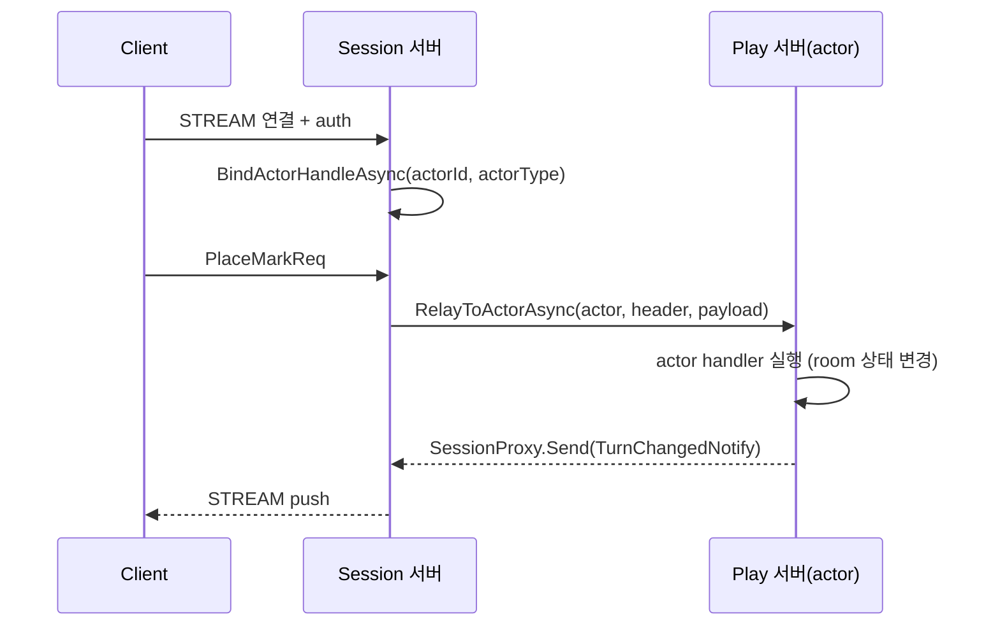

<!-- framework-adapter-nav:start -->
[문서 목록](../../../../doc/README.ko.md) | [이전: SPOT](./05-spot.ko.md) | [다음: STREAM — 외부 client](./07-stream.ko.md)
<!-- framework-adapter-nav:end -->

# Actor · Session Actor Dispatch

> 정식 계약은 [spec/aspnet-core-actor](../spec/aspnet-core-actor.ko.md)와
> [spec/session-actor-dispatch](../spec/session-actor-dispatch.ko.md)가 소유한다.
> 이 챕터는 SPOT([05-spot](./05-spot.ko.md)) 을 먼저 읽었다고 가정한다.

## 1. actor 란

actor 는 **ID 로 식별되는 상태 보유 객체**다. 같은 `ActorId` 로 들어오는 메시지는
항상 **같은 인스턴스**가 처리한다(일반 handler 는 stateless 라 메시지마다 새로
resolve 된다). 게임에서 한 플레이어, 한 세션의 진행 상태를 담기에 맞다.

호출자는 actor 가 어느 노드/Spot 에 있는지 몰라도 된다. `actorId` 만으로 호출하면
라우팅은 framework 가 등록된 resolver 로 푼다.

actor 의 상태는 **서로 독립인 두 축**으로 본다.

| 축 | 값 |
|----|------|
| 위치(location) | Entry Spot(생성 직후 기본) ↔ user Spot(join 후) |
| binding | unbound ↔ STREAM session 에 bound |

위치 이동과 session binding 은 독립이다. user Spot join 에 session bind 가 꼭
필요한 것은 아니다.

```text
None
  └─(factory.CreateAsync)→ Created (Entry Spot, unbound)
        ├─(bind session)→ Entry Spot + bound
        │     └─(JoinSpot)→ user Spot + bound
        │           └─(leave: framework)→ Entry Spot + bound
        └─(disconnect/unbind: framework)→ destroy → None
```

framework 가 자동으로 관리하는 것: Entry Spot 생성/소멸, user Spot 에서 Entry Spot
으로 leave, actor destroy. **disconnect 시 framework 가 user Spot 에서 먼저 leave
시킨 뒤 destroy** 한다(destroy 는 Entry Spot 에서만 허용). 응용은 leave/destroy 를
직접 호출하지 않는다.

## 2. actor 등록과 작성

actor 는 factory 로 만든다. factory 는 `actorType` 짧은 문자열로 등록한다.

```csharp
builder.Services.AddZLinkFramework(options =>
{
    options.AddActorFactory<PlayerActorFactory>("player");
    // Entry Spot / user Spot 등록은 SpotNode 쪽에서 (§3)
});

public sealed class PlayerActorFactory : IZLinkActorFactory
{
    public ValueTask<IZLinkActor> CreateAsync(
        string actorId, IZLinkActorContext context, CancellationToken ct)
        => ValueTask.FromResult<IZLinkActor>(new PlayerActor(actorId, context));
}

public sealed class PlayerActor(string actorId, IZLinkActorContext context)
    : IZLinkActor
{
    public string ActorId { get; } = actorId;
    public IZLinkActorContext Context { get; } = context;

    public ValueTask OnDisconnectedAsync(CancellationToken ct)
        => ValueTask.CompletedTask;   // 이후 leave/destroy 는 framework 가 처리
}
```

actor 안에서의 spot join 과 현재 상태 조회는 주입된 `IZLinkActorContext` 로
한다. channel outbound 는 actor context 의 기능이 아니며, Entry Spot 또는
user Spot handler 에서 받은 spot context 로 호출한다.

| `IZLinkActorContext` 멤버 | 용도 |
|---------------------------|------|
| `ActorId`, `SessionId?`, `SpotName?`, `IsJoined` | 현재 상태 조회 |
| `JoinSpot<TReply,TRequest>(spotName, request)` | user Spot 으로 join (도메인 spot 이름으로) |

`RoutingId` 같은 transport 주소는 handler 표면에 노출되지 않는다. spot 이름 →
`RoutingId` 변환은 framework 내부 spot remote address resolver 가 푼다.

## 3. Entry Spot 과 user Spot 의 actor handler

actor handler 와 lifecycle callback 은 actor 클래스가 아니라 **Entry Spot / user
Spot 의 `Configure()`** 에서 등록한다. Entry Spot 과 user Spot 은 등록 표면이
같지만 실행 정책이 다르다.

```csharp
public sealed class PlayerEntrySpot(IZLinkEntrySpotContext context) : IZLinkEntrySpot
{
    public IZLinkEntrySpotContext Context { get; } = context;

    public void Configure()
    {
        Context.AddHandler<AuthenticateHandler>();
        Context.AddHandler<JoinMatchHandler>();
        Context.AddHandler<EntryJoinedHandler>();
        Context.AddHandler<EntryLeftHandler>();
    }
}

public sealed class MatchSpot(IZLinkSpotContext context) : IZLinkSpot
{
    public IZLinkSpotContext Context { get; } = context;

    public void Configure()
    {
        Context.AddActorJoin<JoinMatchSpotHandler>();
        Context.AddHandler<PlaceMarkHandler>();
        Context.AddHandler<MatchJoinedHandler>();
        Context.AddHandler<MatchLeftHandler>();
    }
}
```

handler 시그니처는 위치에 따라 다르다.

```csharp
// Entry Spot: (entrySpot, actor, payload)
public sealed class JoinMatchHandler
{
    [ZLinkSpotActorRequest]
    public async ValueTask<JoinMatchRes> HandleAsync(
        PlayerEntrySpot entrySpot, PlayerActor actor, JoinMatchReq request, CancellationToken ct)
    {
        _ = entrySpot;
        // request.MatchId 는 도메인이 정한 spot 이름. RoutingId 변환은 framework 가.
        var joined = await actor.Context
            .JoinSpot<JoinMatchSpotResult, JoinMatchReq>(request.MatchId, request)
            .Timeout(TimeSpan.FromSeconds(2))
            .Submit(ct);
        return joined.ToReply();
    }
}

// user Spot: (spot, actor, payload) — room 상태를 함께 만진다
public sealed class PlaceMarkHandler
{
    [ZLinkSpotActorRequest]
    public ValueTask<PlaceMarkRes> HandleAsync(
        MatchSpot spot, PlayerActor actor, PlaceMarkReq request, CancellationToken ct)
        => ValueTask.FromResult(spot.PlaceMark(actor.ActorId, request.Cell));
}
```

이 예시는 attribute 방식을 사용한다. 같은 내용을 interface 상속으로 작성할 수도
있다. attribute 방식은 한 handler 클래스 안에 여러 method를 둘 수 있지만, method
parameter 순서나 반환 타입 오류는 컴파일이 아니라 startup validation에서 드러난다.

> **응답은 반환값으로.** actor request handler 는 절대 `context.Reply(...)` 를
> 쓰지 않는다. 반환한 `TReply` 가 원 요청 sequence 에 응답으로 실린다. request
> packet 이 send handler 로 fallback dispatch 되지도 않는다.

### 실행 순서(중요)

| 대상 | 실행 라인 |
|------|-----------|
| Entry Spot actor packet | actor 별 mailbox(같은 actor 순서 보장, actor 끼리 병렬) |
| user Spot actor packet / packet / timer / subscription | 그 user Spot 의 단일 실행 큐(직렬) |

그래서 user Spot 안의 room board 같은 가변 상태는 lock 없이 만질 수 있다.
join 직후 들어온 packet 이 옛 Entry Spot handler 로 가지 않도록, dispatch 는 actor
의 현재 위치를 다시 읽어 큐를 atomic 하게 고른다.

## 4. session actor dispatch — 연결 서버와 로직 서버 분리

큰 게임 서버는 보통 두 역할로 나눈다.

- **Session 서버** — client STREAM 연결만 받는다(인증, actor binding, client 요청
  relay). 게임 로직은 돌리지 않는다.
- **Play(Actor) 서버** — actor, Entry Spot, user Spot 을 호스팅하고 실제 로직을
  돌린다.

client 는 STREAM 하나만 유지하고, Play 서버가 보내는 메시지도 그 STREAM 으로
되돌아간다. 재접속(다른 Session 서버일 수도 있음) 시 binding 만 새 stream 으로
교체되고 actor 인스턴스와 spot membership 은 그대로 유지된다(actor id 기준 멱등).



### Session 서버: 인증과 relay

session 콜백에서 인증 후 `BindActorHandleAsync(...)` 로 actor handle 을 잡고,
이후 packet 은 `RelayToActorAsync(...)` 로 actor 에 넘긴다.

```csharp
public sealed class TicTacToeSession(IZLinkSessionContext context) : IZLinkSession
{
    public IZLinkSessionContext Context { get; } = context;

    public async ValueTask OnDispatchAsync(
        ZlinkStreamHeader header, Message payload, CancellationToken ct)
    {
        if (header.Name == "auth")
        {
            var request = payload.FromJson<AuthReq>();
            IZLinkActorRef actor = await context.BindActorHandleAsync(
                request.ActorId, request.ActorType, ct);
            _authenticated.Remember(request.ActorId, actor);
            await context.Reply(new AuthRep(ok: true)).Submit(ct);
            return;
        }

        if (_authenticated.TryGet(header, out IZLinkActorRef actor))
        {
            await context.RelayToActorAsync(actor, header, payload, ct);
            return;
        }

        throw new ZLinkFrameworkException(
            ZLinkFrameworkErrorKind.ActorNotAuthenticated,
            "Actor is not bound to this session.");
    }

    public ValueTask OnConnectedAsync(CancellationToken ct) => ValueTask.CompletedTask;
    public ValueTask OnErrorAsync(ZLinkStreamError error, CancellationToken ct)
        => ValueTask.CompletedTask;

    public async ValueTask OnDisconnectedAsync(CancellationToken ct)
    {
        foreach (var actor in _authenticated.Values)
            await actor.NotifyDisconnectedAsync(ct);
        _authenticated.Clear();
    }

    private readonly AuthenticatedActors _authenticated = new();
}
```

> `OnDispatchAsync` 안의 `context.Reply(...)` 는 **session** 표면이다. actor request
> handler 의 응답 방식(반환값)과 다르다는 점에 주의한다. STREAM 세션 작성법은
> [07-stream](./07-stream.ko.md)이 다룬다.

### Play 서버: actor 가 자기 client 로 push

actor handler 는 stream 을 직접 들지 않는다. 자기 client 로 보내려면
`Context.SessionProxy` 를 쓴다.

```csharp
public sealed class JoinMatchActorHandler
    : IZLinkActorRequestHandler<JoinMatchReq, JoinMatchRes>
{
    public async ValueTask<JoinMatchRes> HandleAsync(
        JoinMatchReq request, ZLinkActorRequestContext context, CancellationToken ct)
    {
        // 같은 actor 에 묶인 client 로 push
        await context.SessionProxy
            .Send(new OpponentJoinedNotify(request.MatchId))
            .Submit(ct);

        return new JoinMatchRes(request.MatchId);
    }
}
```

다른 actor 의 client 로 보내야 하면 먼저 그 actor 에게 메시지를 보낸 뒤,
해당 actor 가 자기 `Context.SessionProxy` 로 client 에 push 한다. session 위치를
actor id 로 직접 조회하는 public client 는 제공하지 않는다.

```csharp
public sealed class PlayerNotifyHandler : IZLinkActorPacketHandler<GameStateNotify>
{
    public ValueTask HandleAsync(
        GameStateNotify message,
        ZLinkActorSendContext context,
        CancellationToken ct)
        => context.SessionProxy.Send(message).Submit(ct);
}
```

- `SessionProxy.Send(...).Submit(...)` 는 fire-and-forget 이다(route 위임 완료이지
  client app ack 이 아님). ack 이 필요하면 `Request(...).SubmitAsync<TReply>(...)`.
- `DisconnectAsync(...)` 는 응용이 거는 것이라 session 의 `OnDisconnectedAsync` 를
  다시 일으키지 않는다(stream 만 닫고 binding 정리).

## 5. resolver — actor 와 spot 두 축만 public

framework 가 노출하는 public route resolver 는 **actor 와 spot 두 가지뿐**이다.
session 위치 조회용 public resolver 는 없다(actor↔session binding 은 framework
내부 상태).

| 등록 | 역할 |
|------|------|
| `options.UseRegistryActorRemoteAddresses("game")` | actor id → play node route 기본 resolver |
| `options.UseRegistrySpotRemoteAddresses("game")` | spot owner 조회 + spot 이름 directory |

Redis/DB 같은 별도 저장소가 필요하면 actor remote address 나 spot remote address resolver 만
custom 으로 등록한다: `AddActorRemoteAddressResolver<T>()`,
`AddSpotRemoteAddressResolver<T>()`. actor-session binding 은 session bind 시 actor runtime
state 에 저장되는 framework 내부 상태다.

`IZLinkSpotRemoteAddressResolver` 는 `JoinSpot(spotName, ...)` 가 노드 경계를 넘을 때만
필요하다.

## 6. 오류 처리 — `ZLinkFrameworkException`

framework 가 던지는 actor/spot/session 관련 오류는 `ZLinkFrameworkException` 에
`Kind`(`ZLinkFrameworkErrorKind`) 로 담긴다.

| Kind (일부) | 의미 |
|-------------|------|
| `ActorNotAuthenticated` | 세션에 bound 된 actor 가 아님 |
| `ActorRouteNotFound` | actor remote address 미해결(`ActorGeneration == 0` 포함) |
| `ActorAlreadyExists` / `ActorTypeMismatch` | actor 생성 충돌 |
| `SpotCreateFailed` / `SpotTypeMismatch` | spot 생성 충돌 |
| `ActorSessionNotBound` | push 할 bound session 이 없음 |
| `SessionProxyTimeout` / `ActorDispatchTimeout` | 대기 초과 |

`IsRetriable` 는 분류 힌트일 뿐 framework 가 자동 retry 하지 않는다. retry 루프를
이 값으로 만들지 않는다.

## 7. 등록 골격 (Play 서버)

```csharp
builder.Services.AddZLinkFramework(options =>
{
    options.UseDiscovery(discovery => discovery.Add("tcp://registry1:5551"));

    // Session↔Play routed transport
    options.AddRouteMeshChannel("play", channel => channel.Bind("tcp://0.0.0.0:7201"));

    options.AddActorFactory<PlayerActorFactory>("player");

    options.AddSpotMesh("game.match", mesh =>
    {
        mesh.UseDiscovery(discovery => discovery.Add("tcp://registry1:5551"));
        mesh.AddNode("play-node", node =>
        {
            node.Bind("tcp://0.0.0.0:9000");
            node.EnableRouter();
            node.AddEntrySpot<PlayerEntrySpot>();
            node.AddSpotFactory<MatchSpot>("match");
        });
    });

    options.UseRegistryActorRemoteAddresses("game");
    options.UseRegistrySpotRemoteAddresses("game");
});
```

> 노드 등록은 spec 문서에 따라 `AddSpotMesh(...).AddNode(...)`(mesh 형태)와
> 단일 노드용 표면이 함께 등장한다. 정확한 시그니처는
> [spec/aspnet-core-actor](../spec/aspnet-core-actor.ko.md)와 샘플 코드를
> 기준으로 확인한다.

## 8. 더 보기

- 정식 계약: [spec/aspnet-core-actor](../spec/aspnet-core-actor.ko.md), [spec/session-actor-dispatch](../spec/session-actor-dispatch.ko.md)
- 전체 예제: [tictactoe 샘플](./samples/tictactoe-game-sample.ko.md), [bingo 샘플](./samples/bingo-game-sample.ko.md)
- 외부 client 를 STREAM 으로 받는 법: [07-stream](./07-stream.ko.md)
