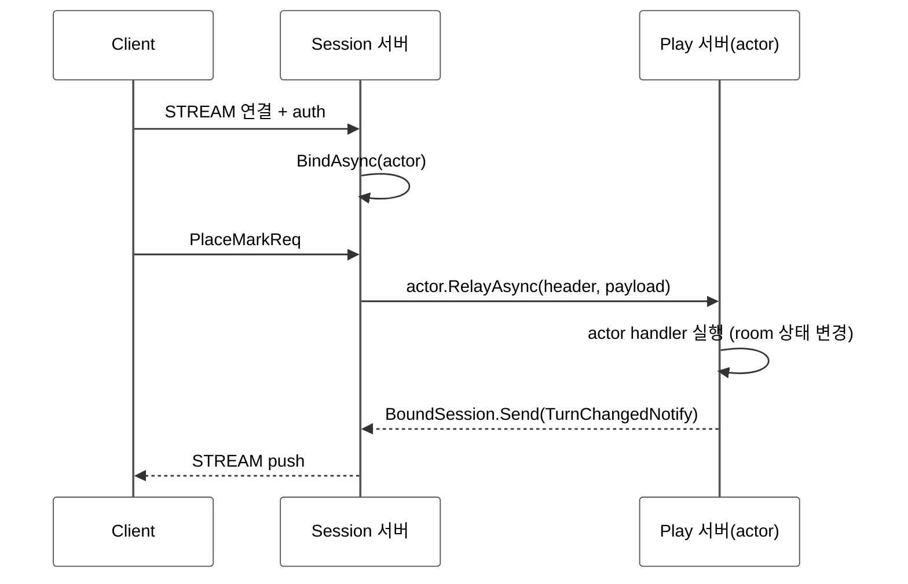

<!-- framework-adapter-nav:start -->
[문서 목록](../../../../doc/README.ko.md) | [이전: SPOT](./05-spot.ko.md) | [다음: STREAM — 외부 client](./07-stream.ko.md)
<!-- framework-adapter-nav:end -->

# 6. Actor · Session Actor Dispatch

> 정식 계약은 [spec/aspnet-core-actor](../spec/aspnet-core-actor.ko.md)와
> [spec/session-actor-dispatch](../spec/session-actor-dispatch.ko.md)가 다룬다.
> 이 챕터는 SPOT([05-spot](./05-spot.ko.md)) 을 먼저 읽었다고 가정한다.
>
> 🔰 actor·session·binding·Entry Spot 용어가 낯설면 [03-concepts §0](./03-concepts.ko.md)
> 한 줄 풀이를 먼저 본다.

## 1. actor 란

actor 는 **ID 로 식별되는 상태 보유 객체**다. 같은 `ActorId` 로 들어오는 메시지는
항상 **같은 인스턴스**가 처리한다(일반 handler 는 stateless 라 메시지마다 새로
resolve 된다). 게임에서 한 플레이어, 한 세션의 진행 상태를 담기에 맞다.

호출자는 actor 가 어느 노드/Spot 에 있는지 몰라도 된다. `actorId` 만으로 호출하면
라우팅은 framework 가 등록된 resolver 로 푼다.

actor 의 상태는 **서로 독립인 두 축**으로 본다.

| 축 | 값 |
|----|------|
| 위치(location) | Entry Spot(생성 직후 기본) ↔ user Spot(join 후) |
| binding | unbound ↔ STREAM session 에 bound |

위치 이동과 session binding 은 독립이다. user Spot join 에 session bind 가 꼭
필요한 것은 아니다.

```text
None
  +-- factory.CreateAsync --> Created (Entry Spot, unbound)
        +-- bind session --> Entry Spot + bound
        |     +-- JoinSpot --> user Spot + bound
        |           +-- leave (framework) --> Entry Spot + bound
        +-- DestroyActorAsync (Entry Spot) --> None
        +-- disconnect/unbind (framework) --> Entry/user Spot 유지
```

framework 가 자동으로 관리하는 것: Entry Spot 생성/소멸, user Spot 에서 Entry Spot
으로 leave. session disconnect 는 actor membership 을 바꾸지 않는다. actor 에게
끊김을 알려야 하면 응용이 대상 actor 를 선택해서
`NotifyDisconnectedAsync(...)` 를 호출한다.

actor 객체를 끝내려면 actor 를 Entry Spot 에 둔 뒤
`IZLinkEntrySpotContext.DestroyActorAsync(actor)` 를 호출한다. 이 호출은 lifecycle callback 을
호출하지 않고 native actor ref, framework registry, bound session mapping 을 정리한다.
user Spot 에 있는 actor 를 직접 destroy 할 수 없으므로 room 안에서는 먼저 leave 를
완료해야 한다.

## 2. actor 등록과 작성

actor 는 factory 로 만든다. factory 는 `actorType` 짧은 문자열로 등록한다.

```csharp
builder.Services.AddZLinkFramework(options =>
{
    options.AddActorFactory<PlayerActorFactory>("player");
    // Entry Spot / user Spot 등록은 SpotNode 쪽에서 (§3)
});

public sealed class PlayerActorFactory : IZLinkActorFactory
{
    public ValueTask<IZLinkActor> CreateAsync(
        string actorId, IZLinkActorContext context, CancellationToken ct)
        => ValueTask.FromResult<IZLinkActor>(new PlayerActor(actorId, context));
}

public sealed class PlayerActor(string actorId, IZLinkActorContext context)
    : IZLinkActor
{
    public string ActorId { get; } = actorId;
    public IZLinkActorContext Context { get; } = context;
}
```

actor 안에서의 spot join 과 현재 상태 조회는 주입된 `IZLinkActorContext` 로
한다. channel outbound 는 actor context 의 기능이 아니며, Entry Spot 또는
user Spot handler 에서 받은 spot context 로 호출한다.

| `IZLinkActorContext` 멤버 | 용도 |
|---------------------------|------|
| `SpotRid?`, `IsJoined` | 현재 Spot join 상태 조회 |
| `BoundSession` | 자기 client 로 push (§4) |
| `JoinSpot(spotRid, requestMessage)` | user Spot 으로 join. `.Async(ct)` 로 종결하며 `Accepted`와 reply `Message`를 받는다 |
| `JoinEntrySpot(spotNodeRid, requestMessage)` | target SpotNode 의 Entry Spot 으로 이동. 빈 요청도 빈 `Message`로 명시하며 `.Async(ct)` 로 종결한다 |

`spotRid`는 user Spot 의 `RoutingId`이고, `spotNodeRid`는 Entry Spot 을 가진
SpotNode 의 `RoutingId`다. `matchId`나 `roomId` 같은 domain 값에서
`RoutingId`를 얻는 규칙은 application registry 가 정한다.

## 3. Entry Spot 과 user Spot 의 actor handler

actor packet handler 는 actor 클래스가 아니라 **Entry Spot / user Spot 의
`Configure()`** 에서 등록한다. lifecycle callback 은 Spot 이 구현하는
`OnCreateActorAsync`/`OnJoinedActorAsync`/`OnLeaveActorAsync`/`OnDisconnectActorAsync` 메서드다.
Entry Spot 과 user Spot 은 handler 등록 표면이 같지만 실행 정책이 다르다.

```csharp
public sealed class PlayerEntrySpot(IZLinkEntrySpotContext context)
    : IZLinkEntrySpot<PlayerActor>
{
    public IZLinkEntrySpotContext Context { get; } = context;

    public void Configure()
    {
        Context.Handlers.AddActorPacket<JoinMatchHandler, PlayerActor>();
    }
}

public sealed class MatchSpot(IZLinkSpotContext context) : IZLinkSpot<PlayerActor>
{
    public IZLinkSpotContext Context { get; } = context;

    public void Configure()
    {
        Context.Handlers.AddActorPacket<PlaceMarkHandler, PlayerActor>();
    }

    public ValueTask<ZLinkSpotActorJoinResult> OnActorJoinAsync(
        PlayerActor actor,
        Message request,
        CancellationToken cancellationToken)
    {
        var join = request.Decode<JoinMatchReq>();
        var reply = new JoinMatchSpotResult(join.MatchId).Encode();
        return ValueTask.FromResult(ZLinkSpotActorJoinResult.Accept(reply));
    }
}
```

handler 시그니처는 위치에 따라 다르다. SPOT handler 는 spot context 자체에 바로
등록하지 않고 `Context.Handlers` 에 등록한다.

```csharp
// Entry Spot: (entrySpot, actor, context, payload)
public sealed class JoinMatchHandler
{
    [ZLinkSpotActorRequest]
    public async ValueTask<JoinMatchRes> HandleAsync(
        PlayerEntrySpot entrySpot,
        PlayerActor actor,
        ZLinkSpotActorRequestContext context,
        JoinMatchReq request,
        CancellationToken ct)
    {
        _ = entrySpot;
        _ = context;
        // request.MatchId 는 도메인이 정한 match id다.
        // application registry가 user Spot RoutingId로 변환하거나 조회한다.
        var matchSpotRid = RoutingId.From(request.MatchId);
        var joined = await actor.Context
            .JoinSpot(matchSpotRid, request.Encode())
            .Timeout(TimeSpan.FromSeconds(2))
            .Async(ct);
        if (!joined.Accepted)
        {
            return joined.Reply.Decode<JoinMatchSpotResult>().ToReply();
        }
        return joined.Reply.Decode<JoinMatchSpotResult>().ToReply();
    }
}

// user Spot: (spot, actor, payload) — room 상태를 함께 만진다
public sealed class PlaceMarkHandler
{
    [ZLinkSpotActorRequest]
    public ValueTask<PlaceMarkRes> HandleAsync(
        MatchSpot spot,
        PlayerActor actor,
        ZLinkSpotActorRequestContext context,
        PlaceMarkReq request,
        CancellationToken ct)
        => ValueTask.FromResult(spot.PlaceMark(actor.ActorId, request.Cell));
}
```

이 예시는 attribute 방식을 사용한다. 같은 내용을 interface 상속으로 작성할 수도
있다. attribute 방식은 한 handler 클래스 안에 여러 method를 둘 수 있지만, method
parameter 순서나 반환 타입 오류는 컴파일이 아니라 startup validation에서 드러난다.

> **응답 body는 반환값으로.** actor request handler 는 응답 body 를 직접 보내지
> 않고 반환한 `TReply` 로 정한다. `context.Reply` 는 metadata/compression 같은
> 응답 frame 옵션만 기록한다. request packet 이 send handler 로 fallback dispatch
> 되지도 않는다.

### 실행 순서(중요)

| 대상 | 실행 라인 |
|------|-----------|
| Entry Spot actor packet | Entry Spot 의 단일 실행 큐(직렬) |
| user Spot actor packet / packet / timer / subscription | 그 user Spot 의 단일 실행 큐(직렬) |

그래서 Entry Spot 의 admission 상태와 user Spot 안의 room board 같은 가변 상태는
각 Spot 실행 큐 안에서 lock 없이 만질 수 있다.
join 직후 들어온 packet 이 옛 Entry Spot handler 로 가지 않도록, dispatch 는 actor
의 현재 위치를 다시 읽어 큐를 atomic 하게 고른다.

## 4. session actor dispatch — 연결 서버와 로직 서버 분리

큰 게임 서버는 보통 두 역할로 나눈다.

- **Session 서버** — client STREAM 연결만 받는다(인증, actor binding, client 요청
  relay). 게임 로직은 돌리지 않는다.
- **Play(Actor) 서버** — actor, Entry Spot, user Spot 을 호스팅하고 실제 로직을
  돌린다.

client 는 STREAM 하나만 유지하고, Play 서버가 보내는 메시지도 그 STREAM 으로
되돌아간다. 재접속(다른 Session 서버일 수도 있음) 시 binding 만 새 stream 으로
교체되고 actor 인스턴스와 spot membership 은 그대로 유지된다(actor id 기준 멱등).



### Session 서버: 인증과 relay

session 콜백에서 인증 후 `BindAsync(...)` 로 actor handle 을 잡고,
이후 packet 은 `IZLinkSessionActor.RelayAsync(...)` 로 actor 에 넘긴다.
이때 `payload` 는 framework runtime 이 callback 동안 빌려준 값이다.
session 은 이 값을 해제하거나 `Move()` 로 소비하지 않는다.
`IZLinkSessionActor.RelayAsync(...)` 는 caller payload 를 소비하지 않으므로 그대로 넘긴다.
callback 뒤에도 payload 를 보관해야 할 때만 별도 `Copy()` 또는 `Move()` 를 쓴다.
인증처럼 session 에서 직접 처리할 packet 이 여러 개라면
`IZLinkSessionPacketDispatcher<TSessionContext>` 를 주입받아 등록된 packet 만
handler 로 보낼 수 있다. dispatcher 가 `false` 를 반환한 뒤 actor 로 relay 할지,
인증 오류를 낼지, 로그만 남길지는 session 이 정한다.

```csharp
public sealed class TicTacToeSession(
    IZLinkSessionContext context,
    IZLinkSessionPacketDispatcher<IZLinkSessionContext> handlers) : IZLinkSession
{
    public IZLinkSessionContext Context { get; } = context;

    public async ValueTask OnDispatchAsync(
        ZlinkStreamHeader header, Message payload, CancellationToken ct)
    {
        if (await handlers.TryHandleAsync(context, header, payload, ct))
        {
            return;
        }

        if (context.Actors.Bound.Count == 1)
        {
            await context.Actors.Bound.Single().RelayAsync(header, payload, ct);
            return;
        }

        throw new ZLinkFrameworkException(
            ZLinkFrameworkErrorKind.ActorRouteNotFound,
            "No actor route is bound to this session packet.");
    }

    public ValueTask OnConnectedAsync(CancellationToken ct) => ValueTask.CompletedTask;
    public ValueTask OnErrorAsync(ZLinkStreamError error, CancellationToken ct)
        => ValueTask.CompletedTask;

    public ValueTask OnDisconnectedAsync(CancellationToken ct)
    {
        // session disconnect 는 bound actor 전체에 자동 전파되지 않는다.
        // 필요한 actor 에게만 actor.NotifyDisconnectedAsync(ct) 를 호출한다.
        return ValueTask.CompletedTask;
    }
}

public sealed class AuthenticateSessionPacketHandler(IZLinkActorManager actors)
    : IZLinkSessionPacketHandler<IZLinkSessionContext>
{
    public string PacketName => "auth";

    public async ValueTask HandleAsync(
        IZLinkSessionContext context,
        ZlinkStreamHeader header,
        Message payload,
        CancellationToken ct)
    {
        _ = header;
        var request = payload.Decode<AuthReq>();
        IZLinkActor actor = await actors.GetOrCreateAsync(
            request.ActorId,
            "player",
            ct);
        await context.Actors.BindAsync(
            actor, ct);
        await context.Client.Reply(new AuthRep(ok: true)).Async();
    }
}
```

> `OnDispatchAsync` 안의 `context.Client.Reply(...)` 는 **session** 표면이다. actor request
> handler 의 응답 방식(반환값)과 다르다는 점에 주의한다. STREAM 세션 작성법은
> [07-stream](./07-stream.ko.md)이 다룬다.

### Play 서버: actor 가 자기 client 로 push

Spot actor handler 는 stream 을 직접 들지 않는다. 자기 client 로 보내려면
handler 가 받은 actor 의 `Context.BoundSession` 를 쓴다. stream packet 이름과
전달 허용된 metadata 는 handler context 에 들어 있다.

```csharp
public sealed class JoinMatchActorHandler
    : IZLinkSpotActorRequestHandler<GameSpot, PlayerActor, JoinMatchReq, JoinMatchRes>
{
    public async ValueTask<JoinMatchRes> HandleAsync(
        GameSpot spot,
        PlayerActor actor,
        ZLinkSpotActorRequestContext context,
        JoinMatchReq request,
        CancellationToken ct)
    {
        // 같은 actor 에 묶인 client 로 push
        await actor.Context.BoundSession
            .Send(new OpponentJoinedNotify(request.MatchId))
            .Async(ct);

        // 응답 frame의 metadata/compression 옵션. 응답 body는 반환값이다.
        context.Reply
            .Metadata("trace-id", "reply-trace")
            .Compress();

        return new JoinMatchRes(request.MatchId);
    }
}
```

다른 actor 의 client 로 보내야 하면 먼저 그 actor 에게 메시지를 보낸 뒤,
해당 actor 가 자기 `Context.BoundSession` 로 client 에 push 한다. session 위치를
actor id 로 직접 조회하는 public client 는 제공하지 않는다.

```csharp
public sealed class PlayerNotifyHandler
    : IZLinkSpotActorSendHandler<GameSpot, PlayerActor, GameStateNotify>
{
    public ValueTask HandleAsync(
        GameSpot spot,
        PlayerActor actor,
        ZLinkSpotActorSendContext context,
        GameStateNotify message,
        CancellationToken ct)
        => actor.Context.BoundSession.Send(message).Async(ct);
}
```

- `IZLinkBoundSession` 의 표면은 **`Send<TMessage>(message)`** 와
  **`DisconnectAsync(...)`** 둘뿐이다. client 로의 push 는 단방향이며 별도의
  `Request` 표면은 없다. `Send(...).Async(...)` 은 fire-and-forget(route 위임
  완료이지 client app ack 이 아님)이다.
- `DisconnectAsync(...)` 는 응용이 거는 것이라 session 의 `OnDisconnectedAsync` 를
  다시 일으키지 않는다(stream 만 닫고 binding 정리).

## 5. resolver — Spot lookup 만 public

session relay 는 actor id/type logical handle 과 core ActorGateway 를 사용한다.
actor 위치 조회용 public resolver 는 없다(actor↔session binding 은 framework 내부 상태).

| 등록 | 역할 |
|------|------|
| `options.UseRegistrySpotRemoteAddresses("game")` | spot owner 조회 + spot 이름 directory |

Redis/DB 같은 별도 저장소가 필요하면 spot remote address resolver 만
custom 으로 등록한다: `AddSpotRemoteAddressResolver<T>()`. actor-session binding 은 session bind
시 actor runtime state 에 저장되는 framework 내부 상태다.

`IZLinkSpotRemoteAddressResolver` 는 `JoinSpot(spotRid, ...)` 가 노드 경계를 넘을 때만
필요하다.

## 6. 오류 처리 — `ZLinkFrameworkException`

framework 가 던지는 actor/spot/session 관련 오류는 `ZLinkFrameworkException` 에
`Kind`(`ZLinkFrameworkErrorKind`) 로 담긴다.

| Kind (일부) | 의미 |
|-------------|------|
| `ActorRouteNotFound` | actor 를 찾을 수 없거나 ActorGateway relay 경로를 열 수 없음 |
| `ActorAlreadyExists` / `ActorTypeMismatch` | actor 생성 충돌 |
| `SpotCreateFailed` / `SpotRouteNotFound` / `SpotTypeMismatch` | spot 생성, route 조회, 타입 충돌 |
| `ActorSessionNotBound` | push 할 bound session 이 없음 |
| `HandlerNotFound` / `ActorDispatchHandlerNotFound` / `PayloadDecodeFailed` | handler dispatch 또는 payload decode 실패 |
| `RouteNotConnected` / `RequestTargetNotFound` / `RequestRejected` / `RequestProtocolError` / `RequestFailed` | request/route 하부 실패 매핑 |

`IsRetriable` 는 분류 힌트일 뿐 framework 가 자동 retry 하지 않는다. retry 루프를
이 값으로 만들지 않는다.

## 7. 등록 골격

session relay 는 application route mesh channel 로 흐르지 않는다. STREAM session 이
쓸 local SpotNode 를 `AttachActorGateway(...)` 로 지정하면, `BindAsync(...)`
가 local actor ref 또는 Play 서버가 발급한 remote actor locator 를 core ActorGateway 경로에
bind 한다. 그래서 session handler 는 route mesh channel 이름이나 router socket 을 알 필요가 없다.

### Session 서버

```csharp
builder.Services.AddZLinkFramework(options =>
{
    // STREAM session 이 사용할 local SpotNode (ActorGateway ingress)
    options.AddSpotMesh("game.session")
        .AddNode("session-node")
        .EnableRouter("tcp://0.0.0.0:9101")
        .SetRouterRoutingId(sessionNodeRid);

    options.AddStreamNode("client-stream")
        .AttachActorGateway("session-node")   // 이 stream 의 relay 대상 SpotNode
        .Bind("tcp://0.0.0.0:9000")
        .RegisterSession<TicTacToeSession>();

    options.UseRegistrySpotRemoteAddresses("game");
});
```

### Play(Actor) 서버

```csharp
builder.Services.AddZLinkFramework(options =>
{
        options.UseDiscovery().AddRegistryEndpoint("tcp://registry1:5551");

    options.AddActorFactory<PlayerActorFactory>("player");

    {
        var mesh =     options.AddSpotMesh("game.match");
                mesh.UseDiscovery().AddRegistryEndpoint("tcp://registry1:5551");
        {
            var node =         mesh.AddNode("play-node");
            node.EnableRouter("tcp://0.0.0.0:9201");
            node.AddEntrySpot<PlayerEntrySpot>();
            node.AddSpotFactory<MatchSpot>();

        }

    }

    options.UseRegistrySpotRemoteAddresses("game");
});
```

> 노드 등록 시그니처는
> [spec/aspnet-core-actor](../spec/aspnet-core-actor.ko.md)와 샘플 코드를 기준으로
> 확인한다.

## 8. 더 보기

- 이 챕터 계약의 실행 검증 예문(actor/context/factory/handler): [11-interface-catalog](./11-interface-catalog.ko.md) §4 — 검증 클래스 `ActorContracts`
- bound session push 계약: [11-interface-catalog](./11-interface-catalog.ko.md) §5.2 — 검증 클래스 `StreamContracts`
- 정식 계약: [spec/aspnet-core-actor](../spec/aspnet-core-actor.ko.md), [spec/session-actor-dispatch](../spec/session-actor-dispatch.ko.md)
- 전체 예제: [tictactoe 샘플](./samples/tictactoe-game-sample.ko.md), [bingo 샘플](./samples/bingo-game-sample.ko.md)
- 외부 client 를 STREAM 으로 받는 법: [07-stream](./07-stream.ko.md)

---
<!-- framework-adapter-nav:bottom:start -->
[문서 목록](../../../../doc/README.ko.md) | [이전: SPOT](./05-spot.ko.md) | [다음: STREAM — 외부 client](./07-stream.ko.md)
<!-- framework-adapter-nav:bottom:end -->
