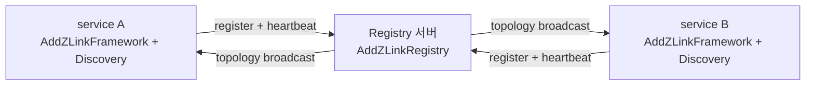

<!-- framework-adapter-nav:start -->
[문서 목록](../../../../doc/README.ko.md) | [이전: STREAM](./07-stream.ko.md) | [다음: Monitoring — runtime 이벤트](./09-monitoring.ko.md)
<!-- framework-adapter-nav:end -->

# Registry — 구동과 topology 조회

> 정식 계약은 [spec/aspnet-core-registry](../spec/aspnet-core-registry.ko.md)가
> 소유한다. 이 챕터는 Registry 를 띄우고 topology 를 조회하는 사용법이다.

## 1. Registry 란

framework 의 channel discovery 는 **Registry 서버**를 중심에 둔다. Registry 는 세
가지를 담당한다: channel 등록, heartbeat 수신, topology broadcast. client 측
`Discovery` 는 이 Registry 에 붙어 자기 channel view 를 자동 갱신한다.

의존 방향에 주의한다: **channel runtime 이 Registry 에 의존한다**(반대가 아님).

- `AddZLinkFramework(...)` 는 `Discovery` 로 Registry 에 **연결하러 가는** 쪽.
- `AddZLinkRegistry(...)` 는 `Discovery` 가 **연결을 맺으러 오는** 쪽.

그래서 두 등록 호출은 분리되어 있다. Registry 는 framework runtime 의 일부가 아닌
독립 infrastructure 컴포넌트다.

그림으로 보면 방향이 분명하다 — **서비스가 Registry 로 붙으러 가고**(등록·heartbeat),
Registry 는 **topology 를 다시 뿌려** 각 서비스의 `Discovery` view 를 갱신한다.



> 🔰 **Registry** = 누가 어디 떠 있는지 모으는 디렉터리 서버, **Discovery** = 그
> Registry 를 보고 연결 대상을 자동으로 찾는 client 기능([03 §0](./03-concepts.ko.md)).

## 2. 두 가지 배포 모델

| 모델 | 설명 | 적합 |
|------|------|------|
| embedded | 앱 프로세스 안에서 Registry 를 함께 구동 | 소규모 배포, 개발 환경 |
| standalone | Registry 만 단독 프로세스로 | 운영에서 Registry 를 로직과 분리 |

두 모델의 차이는 **배포 구성**일 뿐 API 는 같다. 같은 `AddZLinkRegistry(...)` 를
쓰되 서비스 handler 를 함께 등록하느냐로 갈린다.

### embedded — Registry + 서비스 한 프로세스

```csharp
var builder = WebApplication.CreateBuilder(args);

// Registry 서버
builder.Services.AddZLinkRegistry(registry =>
{
    registry.PubEndpoint = "tcp://0.0.0.0:5550";
    registry.RouterEndpoint = "tcp://0.0.0.0:5551";
    registry.RegistryId = 1;
});

// 서비스 런타임 — 같은 프로세스의 Registry 를 명시적으로 가리킨다
builder.Services.AddZLinkFramework(options =>
{
    options.AddClientServerChannel("api", channel =>
        channel.EnableServer(server => server.Bind("tcp://0.0.0.0:7101")));
    options.UseDiscovery(discovery => discovery.Add("tcp://127.0.0.1:5551"));
    options.Codecs.AddProtobuf();
    options.AddHandlersFromAssemblyOf<Program>();
});

var app = builder.Build();
app.Run();
```

> embedded 라도 `UseDiscovery(...)` 가 같은 프로세스의 Registry 를 **자동으로
> 찾아주지 않는다.** Discovery endpoint(`5551`)를 명시해야 한다. framework 는
> Registry 가 먼저 bind 된 뒤 Discovery 가 연결되도록 startup 순서를 자동
> 보장한다.

### standalone — Registry 만

```csharp
var builder = WebApplication.CreateBuilder(args);

builder.Services.AddZLinkRegistry(registry =>
{
    registry.PubEndpoint = "tcp://0.0.0.0:5550";
    registry.RouterEndpoint = "tcp://0.0.0.0:5551";
    registry.RegistryId = 1;
});

builder.Build().Run();
```

`AddZLinkFramework(...)` 가 없으니 handler 없이 Registry 서버만 돈다.

## 3. 설정 옵션

```csharp
builder.Services.AddZLinkRegistry(registry =>
{
    registry.PubEndpoint = "tcp://0.0.0.0:5550";
    registry.RouterEndpoint = "tcp://0.0.0.0:5551";
    registry.RegistryId = 1;
    registry.HeartbeatInterval = TimeSpan.FromSeconds(5);
    registry.HeartbeatTimeout = TimeSpan.FromSeconds(15);
    registry.BroadcastInterval = TimeSpan.FromSeconds(30);
});
```

| 설정 | 기본값 | 의미 |
|------|--------|------|
| `PubEndpoint` | (필수) | topology broadcast 를 내보내는 PUB endpoint |
| `RouterEndpoint` | (필수) | 등록·heartbeat·query 요청을 받는 ROUTER endpoint |
| `RegistryId` | 0 | 클러스터 안 인스턴스 식별 ID |
| `HeartbeatInterval` | 5s | 서비스가 보낼 heartbeat 주기 |
| `HeartbeatTimeout` | 15s | 이 시간 안에 heartbeat 가 없으면 lost 로 봄 |
| `BroadcastInterval` | 30s | 전체 service list 를 PUB 으로 내보내는 주기 |

> 포트 관례: PUB=`5550`, ROUTER=`5551`. peer 는 PUB 을, query client/discovery 는
> ROUTER 를 가리킨다(혼동 주의).

## 4. clustering

Registry 하나면 단일 장애점(SPOF)이다. peer Registry 의 **PUB endpoint** 를 등록해
서로의 broadcast 를 구독하며 topology 를 합산한다.

```csharp
builder.Services.AddZLinkRegistry(registry =>
{
    registry.PubEndpoint = "tcp://0.0.0.0:5550";
    registry.RouterEndpoint = "tcp://0.0.0.0:5551";
    registry.RegistryId = 1;
    registry.AddPeer("tcp://registry-2:5550");   // PUB(5550) 임에 주의
    registry.AddPeer("tcp://registry-3:5550");
});
```

## 5. topology 조회

### in-process — `IZLinkRegistryQuery`

`AddZLinkRegistry(...)` 를 등록하면 `IZLinkRegistryQuery` 가 DI 에 자동 등록된다.
운영 점검, warm-up 확인, 관리 화면에 쓴다.

```csharp
app.MapGet("/admin/topology", async (IZLinkRegistryQuery registry) =>
    Results.Ok(await registry.TopologySnapshotAsync()));

app.MapGet("/admin/services", async (IZLinkRegistryQuery registry) =>
    Results.Ok(await registry.ServiceSummarySnapshotAsync()));

app.MapGet("/health", async (IZLinkRegistryQuery registry) =>
{
    var status = await registry.StatusSnapshotAsync();
    return status.State == ZLinkRegistryState.Active
        ? Results.Ok(status)
        : Results.StatusCode(503);
});
```

제공 메서드: `StatusSnapshotAsync`, `ServiceSummarySnapshotAsync(filter?)`,
`TopologySnapshotAsync`, `TopologyQueryAsync(filter?)`, `MemberPeersAsync(channelName)`.
모두 `ValueTask` 비동기다(framework 가 host lifecycle 경계를 query 표면에서 숨기지
않으려고).

### 원격 — `IZLinkRegistryQueryClient`

다른 프로세스의 Registry 를 조회할 때는 별도 등록한다.

```csharp
builder.Services.AddZLinkRegistryQueryClient(query =>
{
    query.Endpoint = "tcp://registry-1:5551";   // ROUTER endpoint
});

app.MapGet("/admin/topology", async (IZLinkRegistryQueryClient query) =>
    Results.Ok(await query.SnapshotAsync()));
```

| 항목 | `IZLinkRegistryQuery` | `IZLinkRegistryQueryClient` |
|------|----------------------|-----------------------------|
| 대상 | 같은 프로세스 embedded Registry | 다른 프로세스 Registry |
| 등록 | `AddZLinkRegistry` 시 자동 | `AddZLinkRegistryQueryClient` 별도 |
| 제공 | status·service·topology·member peers | topology snapshot 만 |

원격 client 가 좁은 이유는 하부 C API 가 topology snapshot 만 지원하기 때문이다.
연결 실패 시 framework 가 몰래 retry 하지 않으니, retry 는 호출자/monitoring 에서
명시적으로 한다.

## 6. Registry 기반 route 기본 구현

actor/spot 라우팅을 Registry 로 기본 구현하려면 명시적으로 켠다.
`UseDiscovery(...)` 만으로는 자동 등록되지 않는다.

```csharp
builder.Services.AddZLinkFramework(options =>
{
    options.UseDiscovery(discovery => discovery.Add("tcp://127.0.0.1:5551"));

    options.AddRouteMeshChannel("play", channel => channel.Bind("tcp://0.0.0.0:7201"));

    options.UseRegistrySpotRemoteAddresses("game");           // spot owner 조회 + spot 이름 directory
});
```

Registry 를 key-value 저장소로 노출하는 것은 아니다. Redis/DB 가 필요하면 custom
resolver/store 를 등록한다([06-actor-session](./06-actor-session.ko.md) §5).

## 7. lifecycle

- 시작: `Context` 생성 → `Registry` 생성 → 설정 적용 → `Bind(pub, router)`.
- 종료: channel runtime shutdown → Registry shutdown → `Context` 정리. 서비스가
  먼저 내려가야 다른 노드의 Discovery 가 이 서비스 소멸을 정상 감지한다.
- Registry 용 health check 는 자동 등록되지 않는다. 필요하면 `IZLinkRegistryQuery`
  로 직접 노출한다(§5 의 `/health` 예시).

## 8. 더 보기

- 이 챕터 계약의 실행 검증 예문(options/query/query client): [11-interface-catalog](./11-interface-catalog.ko.md) §6 — 검증 클래스 `RegistryContracts`
- 정식 계약: [spec/aspnet-core-registry](../spec/aspnet-core-registry.ko.md)
- runtime 이벤트로 topology 변화 관찰: [09-monitoring](./09-monitoring.ko.md)
