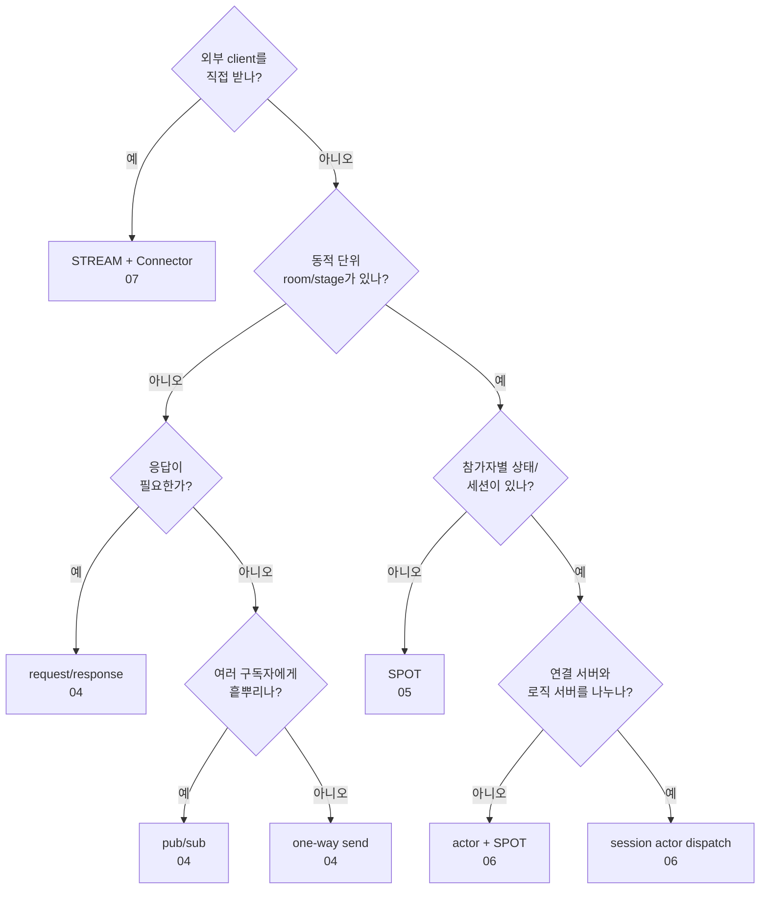

<!-- framework-adapter-nav:start -->
[문서 목록](../../../../doc/README.ko.md) | [이전: Monitoring](./09-monitoring.ko.md) | [다음: 인터페이스 카탈로그](./11-interface-catalog.ko.md)
<!-- framework-adapter-nav:end -->

# 10. 기능 맵 — 무엇을, 얼마나 쉽게, 언제

> 각 기능의 사용법은 앞 챕터(04~09)가, 정식 계약은 spec 문서가 다룬다. 이 문서는
> 기능 선택을 돕는 지도다.

## 1. 난이도 기준

| 등급 | 의미 |
|------|------|
| **낮음** | handler 1개 + channel 등록 수준. 가이드만으로 도입 가능 |
| **중간** | lifecycle/factory/등록 조합을 이해해야 함 |
| **높음** | 분산 토폴로지·세션 라우팅 결정이 필요 |

## 2. 기능 × 난이도 × 언제 쓰나

| 기능 | 난이도 | 언제 쓰나 | 가이드 | 정식 문서 |
|------|:------:|-----------|--------|-----------|
| 서버 간 request/response | 낮음 | 서비스 A가 서비스 B의 결과가 필요할 때 | [4](./04-channel-messaging.ko.md) | [channel-messaging](../spec/aspnet-core-channel-messaging.ko.md) |
| 서버 간 단방향 send | 낮음 | 응답 없는 작업 위임/통지 | [4](./04-channel-messaging.ko.md) | [channel-messaging](../spec/aspnet-core-channel-messaging.ko.md) |
| pub/sub 이벤트 fan-out | 낮음 | domain event 를 여러 구독자에게 전파 | [4](./04-channel-messaging.ko.md) | [channel-messaging](../spec/aspnet-core-channel-messaging.ko.md) |
| SPOT(room/stage/zone) | 중간 | 동적 생성·소멸 논리 노드 단위 라우팅 | [5](./05-spot.ko.md) | [spot](../spec/aspnet-core-spot.ko.md) |
| channel handler 에서 target Spot 호출 | 중간 | HTTP/세션 gateway 가 current Spot 없이 특정 Spot 호출 | [5](./05-spot.ko.md) | [spot](../spec/aspnet-core-spot.ko.md) |
| Spot timer (게임 루프 등) | 중간 | 주기 tick, heartbeat, 정리 작업 | [5](./05-spot.ko.md) | [spot](../spec/aspnet-core-spot.ko.md) |
| Stage wrapper | 중간 | `playhouse` Stage 류를 SPOT 위에 얹을 때 | [5](./05-spot.ko.md) | [stage-wrapper](../spec/stage-wrapper-on-spot.ko.md) |
| actor / Entry Spot | 높음 | session 과 묶인 actor 로 packet 자동 dispatch | [6](./06-actor-session.ko.md) | [actor](../spec/aspnet-core-actor.ko.md) |
| session actor dispatch | 높음 | 연결 서버와 로직 서버를 분리(재접속 이전성) | [6](./06-actor-session.ko.md) | [session-actor-dispatch](../spec/session-actor-dispatch.ko.md) |
| STREAM session(서버) | 중간 | 외부 client(TCP/WS)를 framework 로 받기 | [7](./07-stream.ko.md) | [stream](../spec/aspnet-core-stream.ko.md) |
| Stream Connector(client) | 중간 | client 측에서 STREAM 서버에 접속 | [7](./07-stream.ko.md) | [streaming-client](./samples/streaming-client.ko.md) |
| Registry topology 조회 | 중간 | 클러스터 topology snapshot/query | [8](./08-registry.ko.md) | [registry](../spec/aspnet-core-registry.ko.md) |
| runtime monitoring | 낮음 | socket/registry/spot 이벤트 관찰 | [9](./09-monitoring.ko.md) | [monitoring](../spec/aspnet-core-monitoring.ko.md) |

## 3. 빠른 선택 가이드

- **서비스끼리 호출만** → request/response 또는 send. 난이도 낮음,
  [02-getting-started](./02-getting-started.ko.md)로 충분.
- **이벤트를 흩뿌린다** → pub/sub.
- **방/판/존 같은 동적 단위** → SPOT. 그 안에 참가자별 상태/세션이 있으면 actor.
- **일반 handler 에서 Spot 흐름으로** → actor 생성 또는 Entry Spot join 으로 `ActorRef` 확보.
- **외부 게임/모바일 client** → STREAM(서버) + Stream Connector(client).
- **연결 서버와 로직 서버 분리(재접속 이전성)** → session actor dispatch.

## 4. 기능을 실제로 보여 주는 샘플

각 샘플은 의도가 겹치지 않게 서로 다른 기능 묶음을 맡는다. "이 기능을 실행 코드로
보고 싶다" 면 아래에서 정본 샘플로 이동한다. 도입 판단(언제·왜)은 연결된 케이스
스터디가, 실행은 샘플이 맡는다.

| 샘플 | 핵심 기능 묶음 | codec | 케이스 스터디 | deep-dive 문서 |
|------|----------------|:-----:|---------------|----------------|
| TicTacToe | 수동 endpoint 직접 연결, STREAM auth, actor game join | MessagePack | [15 실시간 게임](./case-studies/15-case-realtime-game.ko.md) | [TicTacToe](./samples/tictactoe-game-sample.ko.md) |
| Bingo | Registry/Discovery 분리 gateway, Entry Spot, room Spot timer, bound push | Protobuf | [15 실시간 게임](./case-studies/15-case-realtime-game.ko.md) | [Bingo](./samples/bingo-game-sample.ko.md) |
| SupportChat | conversation Spot, reconnect 이전성, idle timer→close, bound push | JSON | [17 채팅·메시징](./case-studies/17-case-chat-messaging.ko.md) | [SupportChat](./samples/supportchat-sample.ko.md) |
| DeliveryDispatch | HTTP intake, timeout 재배정, status fanout, delivery Spot, 고객 push | JSON | [16 라이드헤일링](./case-studies/16-case-ride-hailing.ko.md) | [DeliveryDispatch](./samples/deliverydispatch-sample.ko.md) |
| ShoppingMall(Checkout) | event sourcing, OrderId owner routing, projection rebuild, 보상, scale-out | JSON | [13 전자상거래 체크아웃](./case-studies/13-case-ecommerce-checkout.ko.md) | [ShoppingMallCheckout](./samples/shoppingmall-checkout-sample.ko.md) |
| GameQuest | fanout 구독, player owner, quest event sourcing, reward idempotency | JSON | [15 실시간 게임](./case-studies/15-case-realtime-game.ko.md) | [GameQuest](./samples/gamequest-sample.ko.md) |

> 기능별 사용법은 04~09 가, 샘플의 언어 중립 정본 시나리오는
> [spec/sample](../../../../doc/spec/sample/README.ko.md) 가 다룬다.

## 5. 더 보기

- 표면 멘탈 모델: [03-concepts](./03-concepts.ko.md)
- ZLink 을 어디에 쓰나(새 서비스 도입 판단): [12-grpc-alternative](./12-grpc-alternative.ko.md)
- 모든 계약 인터페이스를 코드로(ContractTests 검증): [11-interface-catalog](./11-interface-catalog.ko.md)
- 전체 인터페이스 카탈로그(언어 중립 정식): [spec/handler-interfaces](../spec/handler-interfaces.ko.md)
- 동작/검증 기준: [internals/behavior-matrix](../internals/behavior-matrix.ko.md)

---
<!-- framework-adapter-nav:bottom:start -->
[문서 목록](../../../../doc/README.ko.md) | [이전: Monitoring](./09-monitoring.ko.md) | [다음: 인터페이스 카탈로그](./11-interface-catalog.ko.md)
<!-- framework-adapter-nav:bottom:end -->
