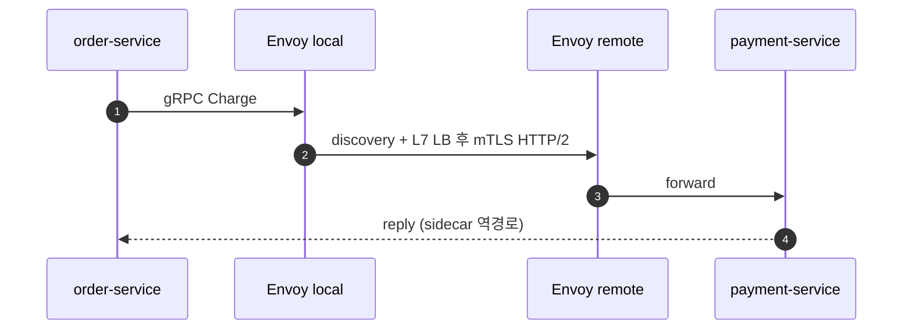
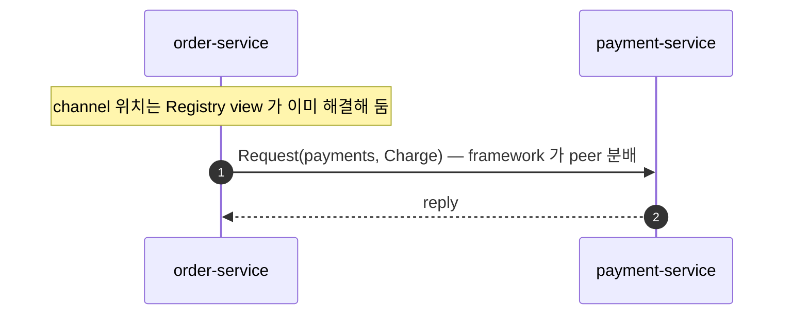
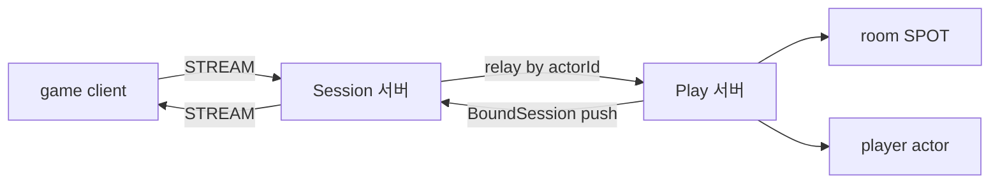
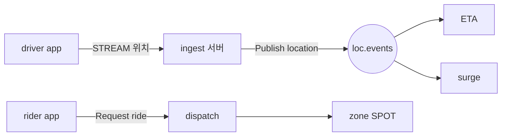
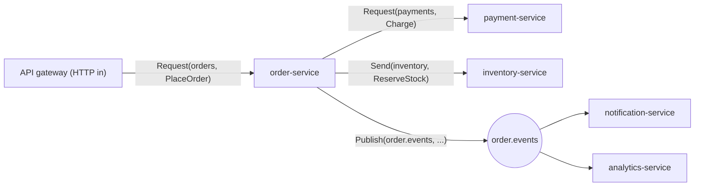

<!-- framework-adapter-nav:start -->
[문서 목록](../../../../doc/README.ko.md) | [이전: 인터페이스 카탈로그](./11-interface-catalog.ko.md) | [다음: ZLink Framework .NET Interface Catalog (spec)](../spec/handler-interfaces.ko.md)
<!-- framework-adapter-nav:end -->

# gRPC 대안으로 ZLink 선택하기 — 비슷한 서비스를 새로 만든다면

> 이 챕터는 **마이그레이션 가이드가 아니다.** 이미 gRPC(또는 내부 REST)로 잘 도는
> 시스템은 굳이 바꿀 이유가 없다. 이 문서는 **그와 비슷한 서버 간 통신 서비스를
> 새로 만들거나 크게 확장·재작성할 때**, 같은 결과를 ZLink Framework 로 얼마나 더
> 단순하게 얻는지 보여 주며 **도입을 권유**한다(그리고 **무엇은 여전히 gRPC 가
> 맞는지**도 솔직히 본다). 표면 매핑은
> [04-channel-messaging](./04-channel-messaging.ko.md) §0 와
> [11-interface-catalog](./11-interface-catalog.ko.md) §1.6 이, 사용법은 04 챕터가
> 소유한다.

## 1. gRPC 는 혼자 끝나지 않는다

gRPC 자체는 빠르고 좋다. 문제는 이런 류의 서비스를 **"프로덕션급"** 으로 만들려면
공식 베스트프랙티스가 곧바로 추가 인프라를 요구한다는 점이다. 새로 설계한다면
아래를 처음부터 다 떠안는다는 뜻이다.

- **channel/stub 재사용 강제.** gRPC 공식 가이드의 첫 권고는 "Always re-use stubs
  and channels when possible" 다. 호출마다 channel 을 만들면 지연이 크게 늘기
  때문에, 보통 channel factory/pool 로 수명 관리를 직접 한다.
  ([grpc.io performance](https://grpc.io/docs/guides/performance/))
- **deadline 을 매 호출에 직접.** "단일 느린 RPC 가 상위 서비스를 무한정 막지
  않도록 모든 RPC 에 deadline 을 건다"가 표준 조언이다.
  ([Microsoft Learn](https://learn.microsoft.com/en-us/aspnet/core/grpc/performance))
- **로드밸런싱이 L4 로 안 된다.** gRPC 는 HTTP/2 의 **단일 long-lived 연결에 모든
  호출을 multiplex** 한다. 그래서 Kubernetes 의 기본 connection-level(L4)
  로드밸런싱은 연결 하나를 한 백엔드에 고정해 버려, 부하가 한쪽으로 쏠린다.
  해결하려면 **request-level(L7) 분배**가 필요하고, 이는 보통 (a) client-side LB +
  name resolver, (b) headless service + DNS, (c) **Envoy/Istio 같은 service mesh
  sidecar** 중 하나를 끌어온다.
  ([Kubernetes 블로그](https://kubernetes.io/blog/2018/11/07/grpc-load-balancing-on-kubernetes-without-tears/))
- **streaming 은 한번 시작하면 LB 가 안 된다.** 공식 가이드도 "streams cannot be
  load balanced once they have started" 라며 streaming 은 이득이 분명할 때만 쓰라고
  경고한다. ([grpc.io performance](https://grpc.io/docs/guides/performance/))
- **그 밖에** service discovery(Eureka/Consul/DNS/xDS), retry·hedging(service
  config), `.proto` 컴파일 파이프라인, mTLS, 그리고 **이벤트 fan-out 은 또 별도
  broker**(Kafka/NATS)로 간다.

대형 사례가 이를 잘 보여 준다. Netflix 는 1,000개 이상의 마이크로서비스를 운영하며
service discovery 를 **Eureka** 로, 호출 분배·관측을 **service mesh** 로 따로
얹는다(Eureka 자체가 단일 장애점이 될 수 있다는 점도 알려져 있다). Uber 역시 1,000개
넘는 서비스로 늘며 의존성 관리가 별도 과제가 됐다. 공통적으로 "통합 로그·메트릭·
트레이싱 없이는 분산 시스템을 디버깅할 수 없다"는 교훈이 반복된다.
([Netflix service mesh 사례](https://vivekbansal.substack.com/p/system-design-study-netflixs-adoption),
[scaling microservices](https://www.netguru.com/blog/scaling-microservices))

즉 "gRPC 를 쓴다"는 실제로는 **gRPC + L7 LB(보통 service mesh) + discovery +
event broker + proto 파이프라인**을 함께 운영한다는 뜻이다.

## 2. ZLink 가 한 겹으로 접는 지점

ZLink Framework 의 핵심은 호출 단위를 **논리 `channel name` 하나**로 좁히고,
위치 해결·연결·request-level 분배·correlation 을 framework 가 소유하는 것이다.
그래서 위 인프라 상당수가 **별도 컴포넌트 없이** framework 안으로 들어온다.

### 2.1 배치 구조 — 기존 스택 vs ZLink

같은 "두 서비스가 서로 호출 + 이벤트 + 외부 client" 토폴로지를 두 방식으로 그리면,
사라지는 박스가 곧 줄어드는 운영 부담이다.

```text
[기존]  gRPC + service mesh + event broker + WS gateway

   order-service (pod)                 payment-service (pod)
  ┌────────────────────┐             ┌────────────────────┐
  │ app + gRPC stub     │             │ app + gRPC server   │
  │        ↕            │             │        ↕            │
  │ Envoy sidecar  ─────┼─── mTLS ───▶│  Envoy sidecar      │
  └─────────┬──────────┘             └─────────┬──────────┘
            └──────────────┬──────────────────┘ xDS
                  ┌─────────▼───────────┐
                  │ mesh control plane   │ discovery + L7 LB + mTLS
                  │ (Istio / Envoy xDS)  │
                  └─────────────────────┘
   ┌──────────────────┐               ┌─────────────────────┐
   │ Kafka  (이벤트)   │               │ WS gateway           │
   │                  │               │ (외부 client 수용)    │
   └──────────────────┘               └─────────────────────┘
```

> mesh 를 안 쓰는 스택이라면 control plane 대신 별도 service discovery
> (Eureka/Consul/DNS)와 client-side LB 가 그 자리에 온다(§1). 어느 쪽이든 호출
> 분배·위치 해결은 **앱 밖의 별도 컴포넌트**다.

```text
[ZLink]  ZLink Framework + Registry 한 겹

   order-service                       payment-service
  ┌────────────────────┐             ┌────────────────────┐
  │ app                 │             │ app                 │
  │ ZLink Framework ────┼── channel ──▶  ZLink Framework    │
  │ (channel client)    │   name      │ (channel server)    │
  └─────────┬──────────┘             └─────────┬──────────┘
            └───────────────┬──────────────────┘
                     ┌───────▼───────┐
                     │   Registry    │  discovery + topology
                     └───────────────┘

  · 이벤트     → 같은 framework 의 fanout channel   (Kafka 불필요)
  · 외부 client → 같은 framework 의 STREAM           (별도 WS gateway 불필요)
  · L7 LB / sidecar / mesh control plane             (없음 — framework 가 흡수)
```

박스로 보면 **Envoy sidecar 2개 + mesh control plane(discovery·L7 LB·mTLS) +
Kafka + WS gateway** 가 빠지고, 그 책임이 framework 와 Registry 한 겹으로 들어온다.

### 2.2 한 번의 호출이 지나는 경로

cross-service 호출 한 번이 거치는 hop 도 줄어든다(시퀀스).





### 2.3 접히는 항목 요약

| gRPC 베스트프랙티스/필요 인프라 | ZLink 에서 | 비고 |
|----------------------------------|------------|------|
| "stub/channel 을 재사용하라" | `IZLinkClient` 가 DI singleton, socket 수명은 framework 가 관리 | 호출마다 만들 일이 없음 |
| 모든 RPC 에 deadline | `Request(...).Timeout(...)` | reply 대기 시간 |
| L7 로드밸런싱(Envoy/Istio sidecar) | channel name + `Discovery` 로 framework 가 peer 분배 | sidecar 불필요 |
| service discovery(Eureka/xDS) | `UseDiscovery(...)` + Registry | [08-registry](./08-registry.ko.md) |
| interceptor | `IZLinkHandlerFilter` | [04](./04-channel-messaging.ko.md) §5 |
| 이벤트 broker(Kafka/NATS) | fanout channel pub/sub | 경계는 §5 참고 |
| 통합 관측(mesh telemetry) | runtime monitoring 이벤트 | [09-monitoring](./09-monitoring.ko.md) |
| 양방향 streaming | STREAM session | [07-stream](./07-stream.ko.md) |

> 한 줄 요약: **channel name + Registry 하나가 discovery + request-level 분배 +
> (상당 부분의) 이벤트 전파를 동시에 가져간다.** gRPC 스택에서 sidecar 와 별도
> discovery 컴포넌트가 빠지는 자리가 여기다.

## 3. 케이스 스터디 — 도메인별로 본 단순화

여러 도메인의 전형적 스택을 "**기존 스택 → ZLink 구성 → 사라지는 인프라**" 로
본다. 등록 코드는 해당 기능 챕터가 소유하므로 여기서는 **아키텍처 매핑**에
집중한다(풀 코드 워크스루는 §4 전자상거래).

### 3.1 실시간 멀티플레이 게임 백엔드

**시나리오.** 클라이언트가 영속 연결을 맺고, room/match 단위로 상태를 공유하며,
재접속해도 진행이 유지돼야 한다.

**기존 스택.** matchmaking·game logic·chat·analytics 서비스를 나누고, **stateless
gateway + sticky session** 으로 같은 세션을 같은 stateful 게임 노드로 고정한다.
entity 는 actor 로 메모리에 깨워 다루고, 재접속·세션 영속은 **Redis/DynamoDB** 로
받친다. 외부 client 는 별도 **WebSocket gateway** 가 수용한다.
([Metaplay](https://docs.metaplay.io/game-server-programming/introduction-to-the-game-server-architecture.html),
[AWS multiplayer hosting](https://aws.amazon.com/solutions/guidance/multiplayer-session-based-game-hosting-on-aws/))

**ZLink 구성.**



- 외부 연결 = **STREAM**([07](./07-stream.ko.md)): framework 가 연결 수명·재연결·
  framing 을 소유. 별도 WS gateway fleet 을 짤 필요 없음.
- room/match = **SPOT**([05](./05-spot.ko.md)): 같은 spot callback 이 **단일 큐로
  직렬** 실행 → board 같은 가변 상태를 lock 없이 만짐.
- player = **actor**([06](./06-actor-session.ko.md)): `actorId` 기준 멱등.
- 연결 서버/로직 서버 분리 = **session actor dispatch**: 재접속(다른 세션 서버여도)
  시 binding 만 새 stream 으로 교체되고 actor·spot membership 은 유지된다.

**사라지는 것.** WS gateway fleet, sticky-session LB 설정, "누가 어디 붙었나"를
추적하는 재접속용 **연결 라우팅 캐시**(actor·spot membership 이전성은 framework 가
보장), 매칭 라우팅용 mesh. 단 **장기 영속 게임 상태**(progression 등)는 여전히
DB 가 맡는다(§5).

**핵심 강점.** "재접속 이전성"과 "방 단위 직렬 상태"가 인프라가 아니라 framework
기본기다.

### 3.2 라이드헤일링 실시간 디스패치

**시나리오.** 운전자 앱이 4–5초마다 위치를 보내고(영속 연결), 다운스트림(ETA·surge·
analytics)이 그 흐름을 구독하며, 호출 요청이 들어오면 가까운 운전자를 매칭한다.
([Uber-scale dispatch](https://dev.to/madhur_banger/architecting-an-uber-scale-real-time-tracking-dispatch-system-3a72))

**기존 스택.** 위치 ingestion 엔드포인트 → **Kafka** topic → 다운스트림 consumer,
**Redis geo-index** 로 근접 질의, dispatch service 가 ride 요청을 큐에서 소비.
연결은 WS/gRPC stream, 서비스 간은 mesh.

**ZLink 구성.**



- 운전자/승객 연결 = **STREAM**.
- 위치 fan-out = **pub/sub**([04](./04-channel-messaging.ko.md)): 다운스트림이 topic
  구독. 라이브 전파에 별도 broker 한 겹이 빠진다.
- 지역 단위 매칭 상태 = **zone SPOT**: H3 셀/구역을 spot 으로 두고 그 안에서 직렬
  처리.
- 호출 매칭 = **request/response**.

**경계(§5).** geo-index(Redis)와 **영속/replay 가 필요한 위치 이력은 Kafka 가 여전히
맞다.** ZLink 가 접는 건 라이브 fan-out transport·연결 수용·discovery/mesh 다.

**핵심 강점.** 대량 위치 fan-out + 지역(zone) 단위 상태를 한 framework 로.

### 3.3 채팅·메시징 플랫폼

**시나리오.** 수백만 동시 연결, room/그룹 fan-out, presence 전파, 메시지 전달.

**기존 스택.** **WebSocket gateway fleet** + **Redis 연결 레지스트리**(누가 어디
붙었나) + 메시지 영속 서비스 + **Redis pub/sub 라우팅** + group/fan-out 서비스 +
presence fan-out(한 사람 상태가 수백 구독자로).
([getstream](https://getstream.io/blog/chat-application-architecture/),
[Ably](https://ably.com/blog/scaling-pub-sub-with-websockets-and-redis))

**ZLink 구성.**

- client 연결 = **STREAM**(연결 레지스트리·재연결을 framework 가).
- room = **SPOT**: membership 과 room 상태를 spot 이 소유(별도 group service 불필요).
- room fan-out·presence = **pub/sub**.
- 연결 서버/로직 분리·재접속 = **session actor dispatch**.

**사라지는 것.** WS gateway fleet, 연결 레지스트리(Registry + spot routing 이 흡수),
group/fan-out 서비스. **메시지 durable 저장은 DB 가 여전히 맞다(§5).**

**핵심 강점.** room 을 **주소 가능한 노드(SPOT)** 로 두어 fan-out·membership 을
인프라 없이 표현.

### 3.4 내부 마이크로서비스 mesh + 운영

**시나리오.** 다수 내부 서비스가 서로 호출(BFF aggregation 포함)하고, 운영에서
클러스터 topology 를 들여다봐야 한다.

| | 기존 스택 | ZLink |
|---|-----------|-------|
| 호출 | gRPC unary + stub(서비스별) | `IZLinkClient.Request/Send`(channel 이름만) |
| 위치 해결 | Eureka/Consul/xDS | `UseDiscovery(...)` + Registry |
| 부하 분배 | Envoy/Istio sidecar(L7) | channel `Discovery` 가 peer 분배 |
| 관측 | mesh telemetry + 별도 수집 | `AddZLinkMonitoring(...)` + `IZLinkRegistryQuery` topology 조회 |

서비스 수가 늘어도 응용은 `Request("pricing", ...)` 처럼 **channel 이름만** 안다.
topology 는 sidecar telemetry 가 아니라 in-process `IZLinkRegistryQuery`
([08](./08-registry.ko.md))로 조회한다.

**핵심 강점.** sidecar/control plane/별도 discovery 없이 channel name + Registry
한 겹으로 mesh 의 호출·분배·관측을 가져간다.

## 4. 새로 만든다면 — 전자상거래 체크아웃 워크스루

비슷한 서비스를 ZLink 로 처음부터 짜면 어떤 모양인지 한 흐름을 끝까지 본다.
HTTP API gateway 가 `order-service` 를 부르고,
`order-service` 가 `payments`·`inventory` 를 호출한 뒤 `order.events` 로 상태를
흘린다. 주문 추적은 외부 client 로의 실시간 push(STREAM)다.



**기존 스택에서 이 그림에 필요한 것:** 각 서비스의 gRPC stub, Envoy/Istio mesh(L7
LB), service discovery, 이벤트용 Kafka, 그리고 주문추적용 별도 WebSocket gateway.

**ZLink 에서 사라지는 것:** sidecar mesh, 별도 discovery 컴포넌트, (이벤트가
broker 영속성을 요구하지 않는다면) Kafka, 별도 WS gateway(STREAM 으로 흡수).

### order-service 등록

```csharp
var builder = WebApplication.CreateBuilder(args);

builder.Services.AddZLinkFramework(options =>
{
    options.Codecs.AddProtobuf();

    // 들어오는 주문 요청을 받는 서버 channel
    options.AddClientServerChannel("orders", channel =>
    {
        channel.EnableServer(server => server.Bind("tcp://0.0.0.0:7401"));
        channel.AddRequestHandler<PlaceOrderHandler>();
    });

    // 나가는 호출용 client channel (gRPC stub 자리)
    options.AddClientServerChannel("payments", channel => channel.EnableClient());
    options.AddClientServerChannel("inventory", channel => channel.EnableClient());

    // 이벤트 fan-out (Kafka producer 자리)
    options.AddFanoutChannel("order.events", channel =>
        channel.EnablePublisher(publisher => publisher.Bind("tcp://0.0.0.0:7402")));

    // discovery 하나로 위 모든 channel 의 위치 해결 (Eureka/xDS + L7 LB 자리)
    options.UseDiscovery(discovery => discovery.Add("tcp://registry1:5551"));
    options.AddHandlersFromAssemblyOf<Program>();
});

builder.Build().Run();
```

### order-service handler

```csharp
public sealed class PlaceOrderHandler(
    IZLinkClient services,
    IZLinkFanoutPublisher events)
    : IZLinkRequestHandler<PlaceOrder, OrderPlaced>
{
    public async ValueTask<OrderPlaced> HandleAsync(
        PlaceOrder request, ZLinkRequestContext context, CancellationToken ct)
    {
        // gRPC unary RPC -> request/response. deadline 은 Timeout 으로.
        var charge = await services
            .Request("payments", new Charge(request.AccountId, request.AmountMinor))
            .Timeout(TimeSpan.FromSeconds(2))
            .SubmitAsync<Charged>(ct);

        // 응답이 필요 없는 명령 -> one-way send
        await services
            .Send("inventory", new ReserveStock(request.OrderId, request.Sku, request.Quantity))
            .Submit(ct);

        // server-streaming/이벤트 피드 -> pub/sub fan-out
        await events
            .Publish("order.events", "order.status",
                new OrderStatusChanged(request.OrderId, "Placed"))
            .Submit(ct);

        return new OrderPlaced(request.OrderId, charge.ReceiptId);
    }
}
```

### gateway 측 — client capability 만

```csharp
// API gateway: orders 를 부르는 client channel 만 열고 HTTP 를 ZLink 로 중계
builder.Services.AddZLinkFramework(options =>
{
    options.Codecs.AddProtobuf();
    options.AddClientServerChannel("orders", channel => channel.EnableClient());
    options.UseDiscovery(discovery => discovery.Add("tcp://registry1:5551"));
});

app.MapPost("/orders", async (PlaceOrderHttp body, IZLinkClient client, CancellationToken ct) =>
{
    var placed = await client
        .Request("orders", new PlaceOrder(body.OrderId, body.AccountId, body.AmountMinor, body.Sku, body.Quantity))
        .Timeout(TimeSpan.FromSeconds(3))
        .SubmitAsync<OrderPlaced>(ct);
    return Results.Ok(placed);
});
```

### 구독자 측 — notification-service (Kafka consumer 자리)

handler 의 `[ZLinkHandlerGroup("order.events")]` 는 그 자체로 구독을 켜지 않는다.
구독 channel 등록에서 같은 group 을 `AddHandlerGroup(...)` 으로 매핑해야 노출된다
([03-concepts](./03-concepts.ko.md) §4).

```csharp
builder.Services.AddZLinkFramework(options =>
{
    options.Codecs.AddProtobuf();
    options.AddFanoutChannel("order.events", channel =>
    {
        channel.EnableSubscriber();
        channel.AddHandlerGroup("order.events");   // 위 group 의 handler 를 이 channel 에 노출
    });
    options.UseDiscovery(discovery => discovery.Add("tcp://registry1:5551"));
    options.AddHandlersFromAssemblyOf<Program>();
});

[ZLinkHandlerGroup("order.events")]
public sealed class OrderStatusNotifier : IZLinkPublishHandler<OrderStatusChanged>
{
    public ValueTask HandleAsync(
        OrderStatusChanged message, ZLinkPublishContext context, CancellationToken ct)
        => /* 푸시/이메일 발송 */ ValueTask.CompletedTask;
}
```

주문 추적을 외부 client(모바일/웹)로 실시간 push 하는 부분은 STREAM 으로
흡수한다([07-stream](./07-stream.ko.md)). 별도 WebSocket gateway 를 두지 않고
framework session 이 연결 수명·재연결·packet framing 을 가져간다.

## 5. 솔직한 경계 — 여전히 gRPC/REST 가 맞는 곳

ZLink 가 모든 server-to-server 통신의 상위 호환은 아니다. 다음은 그대로 두는 게
낫다.

- **외부 공개 API.** 서드파티가 호출하는 공개 계약은 HTTP/gRPC/REST 가 표준이다.
  ZLink 는 **내부 server-to-server** 와 **외부 client(STREAM)** 에 강하다.
- **polyglot proto-first 계약.** `.proto` 를 단일 진실로 여러 언어 stub 을 찍어내는
  워크플로가 핵심이면 gRPC 가 낫다. ZLink 의 codec(protobuf/json/messagepack)은
  payload 직렬화이지 IDL-first 계약 생성 도구가 아니며, framework 표면은 `.NET`
  우선이다.
- **자동 retry/hedging.** framework 는 호출을 몰래 재시도하지 않는다.
  `ZLinkFrameworkException.IsRetriable` 은 분류 힌트일 뿐이고 retry 는 응용
  책임이다([06-actor-session](./06-actor-session.ko.md) §6).
- **broker 의 영속성/replay.** pub/sub 는 transport fan-out 이다. at-least-once
  영속 큐, consumer group offset, 장기 replay 가 필요하면 Kafka/NATS 가 맞다.
  `Submit(...)` 의 완료는 transport 위임까지만 보장한다([03-concepts](./03-concepts.ko.md) §7).
- **데이터 영속·조회.** ZLink 는 transport·dispatch 계층이지 datastore 가 아니다.
  game progression·메시지 이력·geo-index 같은 **영속/조회 상태는 DB·캐시(Redis 등)**
  가 맡는다. SPOT/actor 의 인메모리 상태는 그 lifetime 동안만 유지된다(§3.1·§3.3 의
  "DB 가 맡는다"가 이 줄을 가리킨다).
- **HTTP/2·grpc-web 그 자체.** 브라우저 grpc-web 호환이나 HTTP/2 인프라 자체가
  목적이면 ZLink 가 그 자리를 대신하지 않는다.

## 6. 언제 ZLink 를 고르나 — 도입 판단

이 문서는 교체를 강요하지 않는다. **이미 잘 도는 gRPC 시스템은 그대로 둔다.**
ZLink 는 **새 서비스/바운디드 컨텍스트를 시작**하거나 **큰 확장·재작성** 시점에
후보로 본다.

**적합 신호 (ZLink 가 잘 맞음)**

- `.NET` 백엔드에서 **내부 server-to-server** 통신이 중심이다.
- sidecar/service mesh(Envoy/Istio) 운영 부담을 처음부터 지고 싶지 않다.
- room/stage/zone 같은 **동적 노드**나 외부 game/mobile **client(STREAM)** 수용이
  로드맵에 있다(gRPC + 별도 WebSocket gateway 조합을 피하고 싶다).
- 서비스 위치·연결·재연결·correlation 을 framework 가 가져가길 원한다.

**회피 신호 (gRPC/REST 가 나음)** — 자세한 이유는 §5.

- 서드파티가 부르는 **외부 공개 API**, polyglot **proto-first** 계약,
  broker 의 **영속성/replay** 가 핵심 요건일 때.

**새 서비스라면 시작은 이렇게**

1. [02-getting-started](./02-getting-started.ko.md) 의 두-앱 예제로 channel 하나를
   띄워 동작을 확인한다.
2. request/response·send·pub/sub 를 [04-channel-messaging](./04-channel-messaging.ko.md)
   기준으로 channel 을 늘려 간다.
3. 동적 노드는 [05-spot](./05-spot.ko.md), 외부 client 는
   [07-stream](./07-stream.ko.md) 으로 확장한다.

기존 gRPC 시스템과 **공존**도 가능하다. 새 바운디드 컨텍스트만 ZLink 로 두고
기존 서비스는 그대로 둔 채, 필요할 때 한 경로씩 ZLink channel 로 노출하면 된다
(서로 다른 transport 라 프로세스/네트워크상 충돌하지 않는다).

## 7. 더 보기

- 표면 매핑 한눈에: [04-channel-messaging](./04-channel-messaging.ko.md) §0,
  [11-interface-catalog](./11-interface-catalog.ko.md) §1.6
- 호출/handler 사용법: [04-channel-messaging](./04-channel-messaging.ko.md)
- discovery·Registry: [08-registry](./08-registry.ko.md)
- 외부 client(양방향 streaming) 흡수: [07-stream](./07-stream.ko.md)
- 기능 선택 지도: [10-feature-map](./10-feature-map.ko.md)

### 참고 자료

- gRPC Performance Best Practices — https://grpc.io/docs/guides/performance/
- Performance best practices with gRPC (.NET) — https://learn.microsoft.com/en-us/aspnet/core/grpc/performance
- gRPC Load Balancing on Kubernetes without Tears — https://kubernetes.io/blog/2018/11/07/grpc-load-balancing-on-kubernetes-without-tears/
- System Design Study: Netflix's adoption of Service Mesh — https://vivekbansal.substack.com/p/system-design-study-netflixs-adoption
- Scaling Microservices: Lessons from Netflix, Uber, Amazon, and Spotify — https://www.netguru.com/blog/scaling-microservices
- Metaplay — Game Server Architecture (actor entities, gateway/session) — https://docs.metaplay.io/game-server-programming/introduction-to-the-game-server-architecture.html
- AWS — Multiplayer Session-Based Game Hosting Guidance — https://aws.amazon.com/solutions/guidance/multiplayer-session-based-game-hosting-on-aws/
- Architecting an Uber-scale real-time tracking & dispatch system — https://dev.to/madhur_banger/architecting-an-uber-scale-real-time-tracking-dispatch-system-3a72
- Chat Application Architecture (GetStream) — https://getstream.io/blog/chat-application-architecture/
- Scaling Pub/Sub with WebSockets and Redis (Ably) — https://ably.com/blog/scaling-pub-sub-with-websockets-and-redis
