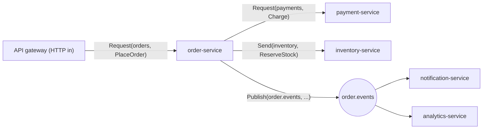

<!-- framework-adapter-nav:start -->
[문서 목록](../../../../doc/README.ko.md) | [이전: gRPC 대안으로 ZLink 선택하기](./12-grpc-alternative.ko.md) | [다음: 케이스 — 내부 마이크로서비스 mesh + 운영](./14-case-microservice-mesh.ko.md)
<!-- framework-adapter-nav:end -->

# 케이스 — 전자상거래 체크아웃

> [12-grpc-alternative](./12-grpc-alternative.ko.md)의 케이스 스터디 중 하나다. 이
> 문서는 **풀 코드 워크스루**다: request/response·one-way send·pub/sub 를 한 흐름에
> 모두 쓰는, 가장 기본적인 channel messaging 사례. 사용법 정식은
> [04-channel-messaging](./04-channel-messaging.ko.md)이 소유한다.

## 1. 시나리오와 기존 스택

HTTP API gateway 가 `order-service` 를 부르고, `order-service` 가
`payments`·`inventory` 를 호출한 뒤 `order.events` 로 상태를 흘린다. 주문 추적은
외부 client 로의 실시간 push 다.



**기존 스택에서 이 그림에 필요한 것:** 각 서비스의 gRPC stub, Envoy/Istio mesh(L7
LB), service discovery, 이벤트용 Kafka, 그리고 주문추적용 별도 WebSocket gateway.

**ZLink 에서 사라지는 것:** sidecar mesh, 별도 discovery 컴포넌트, (이벤트가
broker 영속성을 요구하지 않는다면) Kafka, 별도 WS gateway(STREAM 으로 흡수).

## 2. order-service 등록

```csharp
var builder = WebApplication.CreateBuilder(args);

builder.Services.AddZLinkFramework(options =>
{
    options.Codecs.AddProtobuf();

    // 들어오는 주문 요청을 받는 서버 channel
    options.AddClientServerChannel("orders", channel =>
    {
        channel.EnableServer(server => server.Bind("tcp://0.0.0.0:7401"));
        channel.AddRequestHandler<PlaceOrderHandler>();
    });

    // 나가는 호출용 client channel (gRPC stub 자리)
    options.AddClientServerChannel("payments", channel => channel.EnableClient());
    options.AddClientServerChannel("inventory", channel => channel.EnableClient());

    // 이벤트 fan-out (Kafka producer 자리)
    options.AddFanoutChannel("order.events", channel =>
        channel.EnablePublisher(publisher => publisher.Bind("tcp://0.0.0.0:7402")));

    // discovery 하나로 위 모든 channel 의 위치 해결 (Eureka/xDS + L7 LB 자리)
    options.UseDiscovery(discovery => discovery.Add("tcp://registry1:5551"));
    options.AddHandlersFromAssemblyOf<Program>();
});

builder.Build().Run();
```

## 3. order-service handler

```csharp
public sealed class PlaceOrderHandler(
    IZLinkClient services,
    IZLinkFanoutPublisher events)
    : IZLinkRequestHandler<PlaceOrder, OrderPlaced>
{
    public async ValueTask<OrderPlaced> HandleAsync(
        PlaceOrder request, ZLinkRequestContext context, CancellationToken ct)
    {
        // gRPC unary RPC -> request/response. deadline 은 Timeout 으로.
        var charge = await services
            .Request("payments", new Charge(request.AccountId, request.AmountMinor))
            .Timeout(TimeSpan.FromSeconds(2))
            .SubmitAsync<Charged>(ct);

        // 응답이 필요 없는 명령 -> one-way send
        await services
            .Send("inventory", new ReserveStock(request.OrderId, request.Sku, request.Quantity))
            .Submit(ct);

        // server-streaming/이벤트 피드 -> pub/sub fan-out
        await events
            .Publish("order.events", "order.status",
                new OrderStatusChanged(request.OrderId, "Placed"))
            .Submit(ct);

        return new OrderPlaced(request.OrderId, charge.ReceiptId);
    }
}
```

## 4. gateway 측 — client capability 만

```csharp
// API gateway: orders 를 부르는 client channel 만 열고 HTTP 를 ZLink 로 중계
builder.Services.AddZLinkFramework(options =>
{
    options.Codecs.AddProtobuf();
    options.AddClientServerChannel("orders", channel => channel.EnableClient());
    options.UseDiscovery(discovery => discovery.Add("tcp://registry1:5551"));
});

app.MapPost("/orders", async (PlaceOrderHttp body, IZLinkClient client, CancellationToken ct) =>
{
    var placed = await client
        .Request("orders", new PlaceOrder(body.OrderId, body.AccountId, body.AmountMinor, body.Sku, body.Quantity))
        .Timeout(TimeSpan.FromSeconds(3))
        .SubmitAsync<OrderPlaced>(ct);
    return Results.Ok(placed);
});
```

## 5. 구독자 측 — notification-service (Kafka consumer 자리)

handler 의 `[ZLinkHandlerGroup("order.events")]` 는 그 자체로 구독을 켜지 않는다.
구독 channel 등록에서 같은 group 을 `AddHandlerGroup(...)` 으로 매핑해야 노출된다
([03-concepts](./03-concepts.ko.md) §4).

```csharp
builder.Services.AddZLinkFramework(options =>
{
    options.Codecs.AddProtobuf();
    options.AddFanoutChannel("order.events", channel =>
    {
        channel.EnableSubscriber();
        channel.AddHandlerGroup("order.events");   // 위 group 의 handler 를 이 channel 에 노출
    });
    options.UseDiscovery(discovery => discovery.Add("tcp://registry1:5551"));
    options.AddHandlersFromAssemblyOf<Program>();
});

[ZLinkHandlerGroup("order.events")]
public sealed class OrderStatusNotifier : IZLinkPublishHandler<OrderStatusChanged>
{
    public ValueTask HandleAsync(
        OrderStatusChanged message, ZLinkPublishContext context, CancellationToken ct)
        => /* 푸시/이메일 발송 */ ValueTask.CompletedTask;
}
```

주문 추적을 외부 client(모바일/웹)로 실시간 push 하는 부분은 STREAM 으로
흡수한다([07-stream](./07-stream.ko.md)). 별도 WebSocket gateway 를 두지 않고
framework session 이 연결 수명·재연결·packet framing 을 가져간다.

## 6. 사라지는 인프라 / 경계

- **사라지는 것:** gRPC stub, sidecar mesh, 별도 discovery, (이벤트가 영속성을
  요구 안 하면) Kafka, 주문추적용 WS gateway.
- **경계:** 주문/결제 같은 **영속 데이터는 DB** 가 맡는다. 이벤트에 at-least-once
  영속/replay 가 필요하면 broker 가 여전히 맞다. 공통 경계는
  [12-grpc-alternative](./12-grpc-alternative.ko.md)의 "솔직한 경계" 절 참고.

## 7. 더 보기

- 케이스 허브: [12-grpc-alternative](./12-grpc-alternative.ko.md)
- 사용법 정식: [04-channel-messaging](./04-channel-messaging.ko.md)
- 다음 케이스: [14-case-microservice-mesh](./14-case-microservice-mesh.ko.md)
