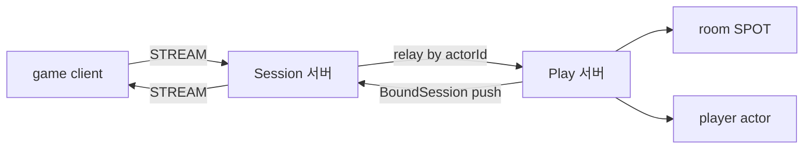

<!-- framework-adapter-nav:start -->
[문서 목록](../../../../doc/README.ko.md) | [이전: 케이스 — 내부 마이크로서비스 mesh + 운영](./14-case-microservice-mesh.ko.md) | [다음: 케이스 — 라이드헤일링 실시간 디스패치](./16-case-ride-hailing.ko.md)
<!-- framework-adapter-nav:end -->

# 케이스 — 실시간 멀티플레이 게임

> [12-grpc-alternative](./12-grpc-alternative.ko.md)의 케이스 스터디 중 하나다.
> ZLink 의 STREAM·SPOT·actor·session actor dispatch 가 한 도메인에 모두 맞는 사례.
> 등록 코드는 [05-spot](./05-spot.ko.md)·[06-actor-session](./06-actor-session.ko.md)·
> [07-stream](./07-stream.ko.md)이 소유하므로 여기서는 아키텍처 매핑에 집중한다.

## 1. 시나리오와 기존 스택

클라이언트가 영속 연결을 맺고, room/match 단위로 상태를 공유하며, 재접속해도 진행이
유지돼야 한다.

**기존 스택.** matchmaking·game logic·chat·analytics 서비스를 나누고, **stateless
gateway + sticky session** 으로 같은 세션을 같은 stateful 게임 노드로 고정한다.
entity 는 actor 로 메모리에 깨워 다루고, 재접속·세션 영속은 **Redis/DynamoDB** 로
받친다. 외부 client 는 별도 **WebSocket gateway** 가 수용한다.
([Metaplay](https://docs.metaplay.io/game-server-programming/introduction-to-the-game-server-architecture.html),
[AWS multiplayer hosting](https://aws.amazon.com/solutions/guidance/multiplayer-session-based-game-hosting-on-aws/))

## 2. ZLink 구성

- 외부 연결 = **STREAM**([07](./07-stream.ko.md)): framework 가 연결 수명·재연결·
  framing 을 소유. 별도 WS gateway fleet 을 짤 필요 없음.
- room/match = **SPOT**([05](./05-spot.ko.md)): 같은 spot callback 이 **단일 큐로
  직렬** 실행 → board 같은 가변 상태를 lock 없이 만짐.
- player = **actor**([06](./06-actor-session.ko.md)): `actorId` 기준 멱등.
- 연결 서버/로직 서버 분리 = **session actor dispatch**: 재접속(다른 세션 서버여도)
  시 binding 만 새 stream 으로 교체되고 actor·spot membership 은 유지된다.

## 3. 사라지는 인프라 / 경계

- **사라지는 것:** WS gateway fleet, sticky-session LB 설정, "누가 어디 붙었나"를
  추적하는 재접속용 **연결 라우팅 캐시**(actor·spot membership 이전성은 framework 가
  보장), 매칭 라우팅용 mesh.
- **경계:** **장기 영속 게임 상태**(progression 등)는 여전히 DB 가 맡는다. SPOT/actor
  의 인메모리 상태는 그 lifetime 동안만 유지된다. 공통 경계는
  [12-grpc-alternative](./12-grpc-alternative.ko.md)의 "솔직한 경계" 절 참고.

## 4. 핵심 강점

"재접속 이전성"과 "방 단위 직렬 상태"가 별도 인프라가 아니라 **framework 기본기**다.
연결 서버와 로직 서버를 나눠도 actor id 기준으로 멱등하게 이어진다.

## 5. 더 보기

- 케이스 허브: [12-grpc-alternative](./12-grpc-alternative.ko.md)
- 사용법: [05-spot](./05-spot.ko.md), [06-actor-session](./06-actor-session.ko.md), [07-stream](./07-stream.ko.md)
- 실행 예제: [tictactoe 샘플](./samples/tictactoe-game-sample.ko.md), [bingo 샘플](./samples/bingo-game-sample.ko.md)
- 다음 케이스: [16-case-ride-hailing](./16-case-ride-hailing.ko.md)
