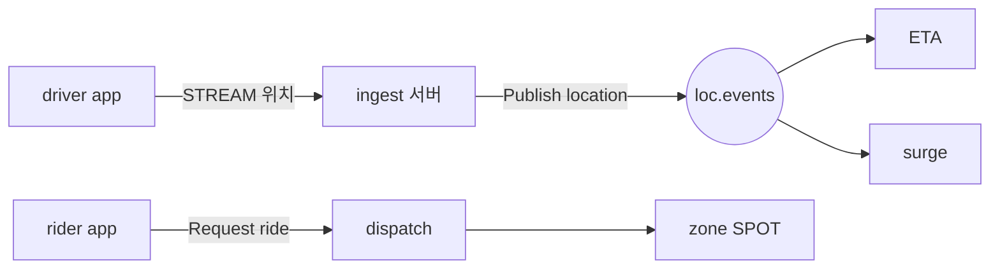

<!-- framework-adapter-nav:start -->
[문서 목록](../../../../doc/README.ko.md) | [이전: 케이스 — 실시간 멀티플레이 게임](./15-case-realtime-game.ko.md) | [다음: 케이스 — 채팅·메시징 플랫폼](./17-case-chat-messaging.ko.md)
<!-- framework-adapter-nav:end -->

# 케이스 — 라이드헤일링 실시간 디스패치

> [12-grpc-alternative](./12-grpc-alternative.ko.md)의 케이스 스터디 중 하나다.
> 대량 위치 fan-out + 지역(zone) 단위 매칭 상태를 한 framework 로 다루는 사례.

## 1. 시나리오와 기존 스택

운전자 앱이 4–5초마다 위치를 보내고(영속 연결), 다운스트림(ETA·surge·analytics)이 그
흐름을 구독하며, 호출 요청이 들어오면 가까운 운전자를 매칭한다.
([Uber-scale dispatch](https://dev.to/madhur_banger/architecting-an-uber-scale-real-time-tracking-dispatch-system-3a72))

**기존 스택.** 위치 ingestion 엔드포인트 → **Kafka** topic → 다운스트림 consumer,
**Redis geo-index** 로 근접 질의, dispatch service 가 ride 요청을 큐에서 소비. 연결은
WS/gRPC stream, 서비스 간은 mesh.

## 2. ZLink 구성

- 운전자/승객 연결 = **STREAM**([07](./07-stream.ko.md)).
- 위치 fan-out = **pub/sub**([04](./04-channel-messaging.ko.md)): 다운스트림이 topic
  구독. 라이브 전파에 별도 broker 한 겹이 빠진다.
- 지역 단위 매칭 상태 = **zone SPOT**([05](./05-spot.ko.md)): H3 셀/구역을 spot 으로
  두고 그 안에서 직렬 처리.
- 호출 매칭 = **request/response**.

## 3. 사라지는 인프라 / 경계

- **사라지는 것:** 라이브 fan-out transport 한 겹, 연결 수용용 WS gateway,
  discovery/mesh.
- **경계:** geo-index(Redis)와 **영속/replay 가 필요한 위치 이력은 Kafka 가 여전히
  맞다.** ZLink 가 접는 건 라이브 fan-out·연결 수용·discovery/mesh 다. 공통 경계는
  [12-grpc-alternative](./12-grpc-alternative.ko.md)의 "솔직한 경계" 절 참고.

## 4. 핵심 강점

대량 위치 fan-out(pub/sub)과 지역(zone) 단위 상태(SPOT)를 **한 framework** 로
표현한다. 위치 스트림은 STREAM 이 받고, 지역 매칭 상태는 spot 의 단일 실행 큐에서
lock 없이 갱신된다.

## 5. 더 보기

- 케이스 허브: [12-grpc-alternative](./12-grpc-alternative.ko.md)
- 사용법: [04-channel-messaging](./04-channel-messaging.ko.md), [05-spot](./05-spot.ko.md), [07-stream](./07-stream.ko.md)
- 다음 케이스: [17-case-chat-messaging](./17-case-chat-messaging.ko.md)
