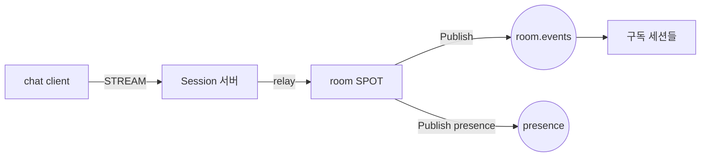

<!-- framework-adapter-nav:start -->
[문서 목록](../../../../doc/README.ko.md) | [이전: 케이스 — 라이드헤일링 실시간 디스패치](./16-case-ride-hailing.ko.md) | [다음: ZLink Framework .NET Interface Catalog (spec)](../spec/handler-interfaces.ko.md)
<!-- framework-adapter-nav:end -->

# 케이스 — 채팅·메시징 플랫폼

> [12-grpc-alternative](./12-grpc-alternative.ko.md)의 케이스 스터디 중 하나다.
> room 을 **주소 가능한 노드(SPOT)** 로 두어 fan-out·membership 을 별도 인프라 없이
> 표현하는 사례.

## 1. 시나리오와 기존 스택

수백만 동시 연결, room/그룹 fan-out, presence 전파, 메시지 전달.

**기존 스택.** **WebSocket gateway fleet** + **Redis 연결 레지스트리**(누가 어디
붙었나) + 메시지 영속 서비스 + **Redis pub/sub 라우팅** + group/fan-out 서비스 +
presence fan-out(한 사람 상태가 수백 구독자로).
([getstream](https://getstream.io/blog/chat-application-architecture/),
[Ably](https://ably.com/blog/scaling-pub-sub-with-websockets-and-redis))

## 2. ZLink 구성

- client 연결 = **STREAM**([07](./07-stream.ko.md)): 연결 레지스트리·재연결을
  framework 가 소유.
- room = **SPOT**([05](./05-spot.ko.md)): membership 과 room 상태를 spot 이 소유
  (별도 group service 불필요, 단일 실행 큐로 직렬 처리).
- room fan-out·presence = **pub/sub**([04](./04-channel-messaging.ko.md)).
- 연결 서버/로직 분리·재접속 = **session actor dispatch**([06](./06-actor-session.ko.md)).

## 3. 사라지는 인프라 / 경계

- **사라지는 것:** WS gateway fleet, 연결 레지스트리(Registry + spot routing 이 흡수),
  group/fan-out 서비스.
- **경계:** **메시지 durable 저장은 DB 가 여전히 맞다.** pub/sub 는 transport
  fan-out 이라 영속/replay/consumer offset 의미가 필요하면 broker 가 맞다. 공통 경계는
  [12-grpc-alternative](./12-grpc-alternative.ko.md)의 "솔직한 경계" 절 참고.

## 4. 핵심 강점

room 을 **주소 가능한 노드(SPOT)** 로 모델링해 membership·fan-out·presence 를 별도
연결 레지스트리/group service 없이 표현한다. 연결 수명과 재접속은 framework 가
가져간다.

## 5. 더 보기

- 케이스 허브: [12-grpc-alternative](./12-grpc-alternative.ko.md)
- 사용법: [04-channel-messaging](./04-channel-messaging.ko.md), [05-spot](./05-spot.ko.md), [06-actor-session](./06-actor-session.ko.md), [07-stream](./07-stream.ko.md)
- 전체 인터페이스 카탈로그(spec): [spec/handler-interfaces](../spec/handler-interfaces.ko.md)
