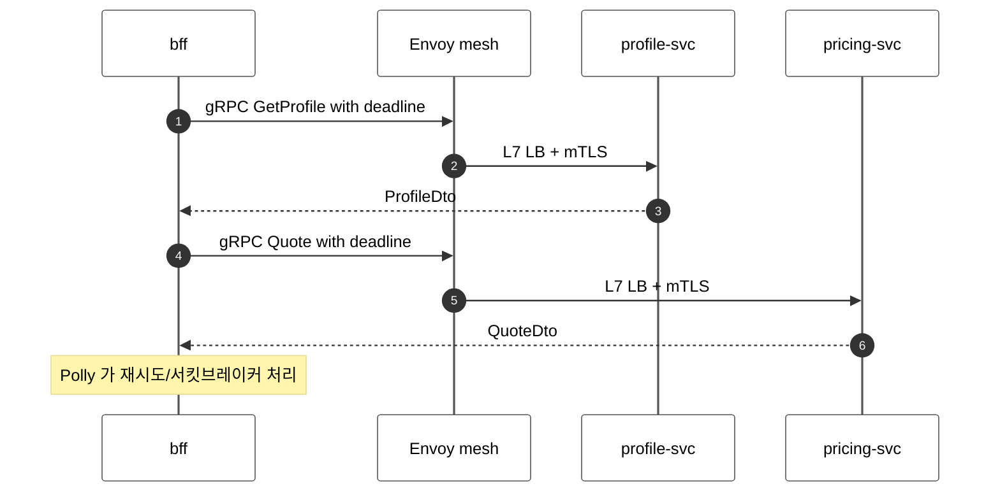
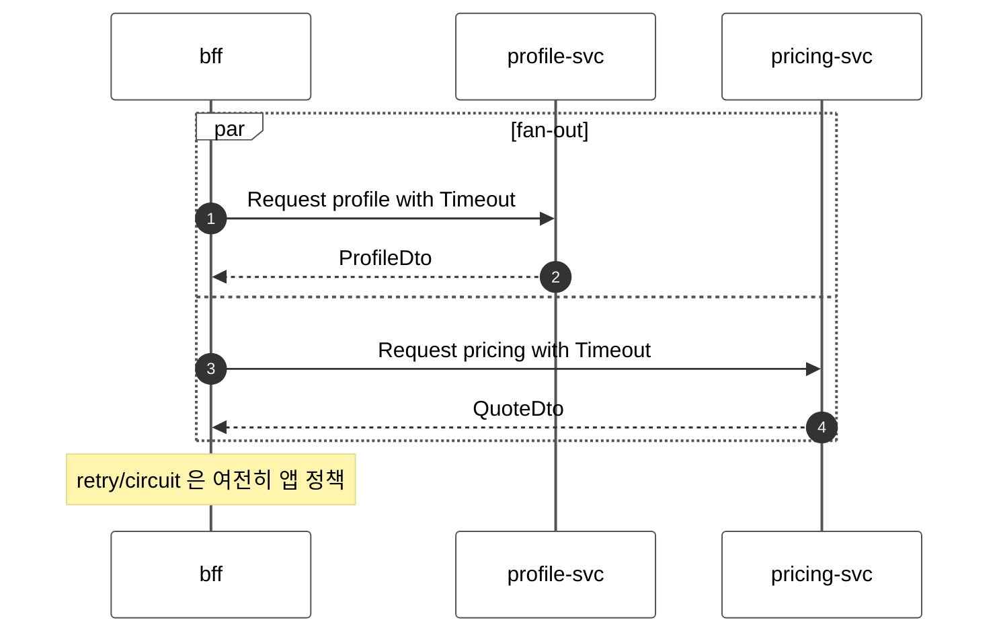

<!-- framework-adapter-nav:start -->
[문서 목록](../../../../../doc/README.ko.md) | [이전: 케이스 — 전자상거래 체크아웃](./13-case-ecommerce-checkout.ko.md) | [다음: 케이스 — 실시간 멀티플레이 게임](./15-case-realtime-game.ko.md)
<!-- framework-adapter-nav:end -->

# 케이스 — 내부 마이크로서비스 mesh + 운영

> [12-grpc-alternative](../12-grpc-alternative.ko.md)의 케이스 스터디 중 하나다.
> 다수 내부 서비스의 호출(BFF aggregation 포함)과 운영(topology·관측)을 다룬다.
> 실행 가능한 샘플이 아니라, ZLink 를 service mesh 대체/보완 위치에 둘지 판단하는
> 아키텍처 매핑 문서다.

> **이 케이스에서 ZLink 이 좋은 지점**
> - 다수 서비스 호출·BFF fan-out 을 channel name  + Registry 로 묶어 sidecar·별도 discovery 를 줄인다.
> - **그대로 남는 것**: retry·circuit-breaking·correlation 추적·외부 공개 API.
> - 즉 ZLink 은 호출 배선·위치 해결을 줄이고, 복원력 정책은 그대로 앱이 진다.

## 1. 도메인 — "서비스가 늘면 호출이 아니라 운영이 문제"

수십~수백 개 서비스가 서로 부르는 환경의 진짜 난제는 호출 자체가 아니다.

- **BFF fan-out 의 부분 실패와 지연 예산.** 한 화면 요청이 profile·pricing·
  inventory 등 N 개를 부른다. **가장 느린 호출이 전체 응답을 지배**하고, 한
  서비스가 죽으면 부분 응답·degrade 정책이 필요하다. 호출마다 deadline·retry·
  circuit-breaking 을 건다.
- **gRPC 의 L7 분배.** HTTP/2 long-lived 연결은 connection-level(L4) LB 로
  쏠린다 → Envoy/Istio 또는 client-side LB 가 필요하다([Kubernetes 블로그](https://kubernetes.io/blog/2018/11/07/grpc-load-balancing-on-kubernetes-without-tears/)).
- **"서비스는 다 healthy 한데 시스템이 실패"** — 각 서비스는 정상으로 보이는데
  전체 흐름이 깨지는 상황. 분산 추적(어느 호출이 어디서 느려졌나)·통합 메트릭
  없이는 디버깅이 안 된다. **correlation id**(한 요청에 같은 식별자를 붙여 서비스를
  건너가며 추적) 전파와 topology 가시성이 필수다.
  ([scaling microservices](https://www.netguru.com/blog/scaling-microservices))
- **서비스가 늘 때마다 같은 배선이 반복된다.** 새 서비스를 부를 때마다 `.proto`
  컴파일, stub 생성, channel factory, deadline 설정, discovery 등록, mTLS 구성이
  복붙된다. **서비스 수에 비례해 배선 코드와 mesh 설정이 늘어난다.**

이 중 **retry 정책·circuit breaking·correlation 전파·부분 실패 degrade(일부 실패해도
나머지로 응답) 는 도메인/정책 문제로 그대로 남는다.** ZLink 가 줄이는 건 위치
해결·L7 분배·sidecar 운영·서비스마다 반복되는 배선이다.

## 2. 기존 스택 — gRPC stub + mesh + discovery

### 2.1 컴포넌트와 그 이유

| 컴포넌트 | 왜 필요한가 |
|----------|-------------|
| `.proto` + 코드 생성 | 서비스마다 계약을 stub 으로 찍어냄. CI 에 proto 컴파일 단계 |
| gRPC stub/channel | 호출. channel 재사용·deadline 을 직접 관리 |
| Polly(또는 유사) | **retry**(재시도)·**circuit-breaker**(연속 실패 시 잠시 차단)·timeout 정책 |
| Envoy sidecar + mesh control plane | HTTP/2 의 **L7(요청 단위) 분배**·mTLS·재시도 |
| service discovery(Consul/xDS) | 어느 pod 이 떠 있는지 추적 |
| OpenTelemetry collector + tracing 백엔드 | correlation 전파·분산 추적 수집 |

### 2.2 계약과 서버 (gRPC)

```proto
// pricing.proto — 서비스마다 한 벌, CI 에서 stub 으로 컴파일된다
syntax = "proto3";
service Pricing { rpc Quote (QuoteRequest) returns (QuoteReply); }
message QuoteRequest { string user_id = 1; }
```

```csharp
// pricing 서버: 생성된 base 클래스를 구현(서비스마다)
public sealed class PricingService(IPriceStore store) : Pricing.PricingBase
{
    public override async Task<QuoteReply> Quote(QuoteRequest req, ServerCallContext ctx)
        => (await store.QuoteAsync(req.UserId, ctx.CancellationToken)).ToReply();
}
```

### 2.3 BFF fan-out (호출 측)

```csharp
// BFF: 서비스별 gRPC stub + per-call deadline + Polly retry/circuit-breaker
public sealed class DashboardBff(
    Profile.ProfileClient profile,
    Pricing.PricingClient pricing,
    IAsyncPolicy resilience)               // Polly: 재시도·서킷브레이커는 직접
{
    public async Task<Dashboard> LoadAsync(string userId, CancellationToken ct)
    {
        var p = resilience.ExecuteAsync(() => profile.GetAsync(
            new GetProfile { UserId = userId }, deadline: DateTime.UtcNow.AddMilliseconds(200)));
        var q = resilience.ExecuteAsync(() => pricing.QuoteAsync(
            new Quote { UserId = userId }, deadline: DateTime.UtcNow.AddMilliseconds(200)));
        await Task.WhenAll(p, q);          // fan-out, 가장 느린 호출이 지배
        return new Dashboard(p.Result, q.Result);
    }
}
```

### 2.4 분배·발견·추적 배선

```yaml
# Envoy L7 분배(서비스마다) — gRPC 는 연결이 1개라 요청 단위 분배가 필요
apiVersion: networking.istio.io/v1
kind: DestinationRule
metadata: { name: pricing }
spec: { host: pricing, trafficPolicy: { loadBalancer: { simple: ROUND_ROBIN } } }
```

```csharp
// correlation id 전파는 gRPC interceptor 로 (서비스마다 등록)
public sealed class CorrelationInterceptor : Interceptor
{
    public override AsyncUnaryCall<TRsp> AsyncUnaryCall<TReq, TRsp>(
        TReq req, ClientInterceptorContext<TReq, TRsp> ctx, AsyncUnaryCallContinuation<TReq, TRsp> next)
    {
        ctx.Options.Headers?.Add("x-correlation-id", Activity.Current?.Id ?? "");
        return next(req, ctx);
    }
}
```

서 있어야 하는 것: 서비스별 `.proto`·gRPC stub, Envoy sidecar(서비스마다), mesh
control plane, Consul/xDS, OpenTelemetry collector + tracing 백엔드, correlation
interceptor.

## 3. ZLink 스택 — channel 이름  + Registry

```csharp
// BFF: stub 없이 IZLinkChannelClient 하나로 channel 이름만 바꿔 fan-out
public sealed class DashboardBff(IZLinkChannelClient client)
{
    public async Task<Dashboard> LoadAsync(string userId, CancellationToken ct)
    {
        var p = client.RequestToChannel("profile", new GetProfile(userId))
            .Async<ProfileDto>(ct);
        var q = client.RequestToChannel("pricing", new Quote(userId))
            .Async<QuoteDto>(ct);
        await Task.WhenAll(p.AsTask(), q.AsTask());
        return new Dashboard(p.Result, q.Result);
    }
}
```

```csharp
// pricing 서버: 생성된 stub base 구현 대신 handler 하나 (.proto 불필요)
public sealed class QuoteHandler(IPriceStore store)
    : IZLinkRequestHandler<Quote, QuoteDto>
{
    public async ValueTask<QuoteDto> HandleAsync(
        Quote req, ZLinkRequestContext context, CancellationToken ct)
        => await store.QuoteAsync(req.UserId, ct);
}
```

```csharp
// 등록: 위치 해결은 Registry 하나. sidecar/Consul/xDS 없음
options.AddClientServerChannel("profile").EnableClient();
options.AddClientServerChannel("pricing").EnableClient();
options.UseDiscovery().AddRegistryEndpoint("tcp://registry1:5551");

// 운영: standalone Registry 를 다른 프로세스에서 조회
builder.Services.AddZLinkRegistryQueryClient(query =>
{
    query.Endpoint = "tcp://registry1:5551";
});

app.MapGet("/admin/topology", async (IZLinkRegistryQueryClient registry) =>
    Results.Ok(await registry.TopologyAsync()));

// correlation·로깅 같은 공통 처리는 filter 로 (gRPC interceptor 대체)
options.UseFilter<CorrelationFilter>();        // IZLinkHandlerFilter
```

```csharp
// 모든 서비스에서 한 번 등록하면 dispatch 마다 공통 실행(서비스마다 interceptor 등록 불필요)
public sealed class CorrelationFilter(ILogger<CorrelationFilter> log) : IZLinkHandlerFilter
{
    public ValueTask<object?> InvokeAsync(
        ZLinkHandlerInvocation invocation, ZLinkHandlerDelegate next, CancellationToken ct)
    {
        log.LogInformation("dispatch {Packet}", invocation.PacketName);  // 공통 로깅/추적 지점
        return next(ct);   // 호출하지 않으면 handler 미실행
    }
}
```

> retry·circuit-breaking 은 ZLink 가 자동으로 하지 않는다(`ZLinkFrameworkException.
> IsRetriable` 는 재시도 가능 여부 **힌트**일 뿐, 자동 재시도가 아니다). Polly 같은
> 정책 라이브러리를 호출 측에 그대로 두거나 `IZLinkHandlerFilter` 로 공통화한다 —
> 즉 **복원력 정책은 그대로 앱이 소유**한다.

## 4. 양쪽 코드 비교 — fan-out 한 번

| 축 | 기존(gRPC + mesh) | ZLink |
|----|-------------------|-------|
| 계약/호출 | 서비스별 생성 stub `profile.GetAsync(...)` | `client.RequestToChannel("profile", ...)` channel 이름 |
| 위치/분배 | Consul/xDS + Envoy `DestinationRule` | `UseDiscovery`  + Registry |
| deadline | `deadline:` 인자 | `.Timeout(...)` |
| retry/circuit | Polly(앱) | Polly/filter(앱) — 동일 |
| 관측 | Envoy telemetry + OTel collector | `IZLinkRegistryQueryClient` + `AddZLinkMonitoring` |

## 5. 아키텍처 비교 — 컴포넌트와 메시지 흐름

```text
[classic]  gRPC + service mesh + discovery + telemetry

  +--------+ +--------+ +--------+ +--------+
  | bff    | | profile| | pricing| |  ...   |   each pod = app + Envoy sidecar
  | +Envoy | | +Envoy | | +Envoy | | +Envoy |
  +---+----+ +---+----+ +---+----+ +---+----+
      |          |          |          |   xDS
      +----------+----+-----+----------+
              +--------v---------+
              | mesh control     |   L7 LB + mTLS
              | Consul / xDS     |   discovery
              +------------------+
  +-------------------------------+
  | OTel collector + tracing store|
  +-------------------------------+
```

```text
[ZLink]  ZLink Framework  + Registry

  +--------+ +--------+ +--------+ +--------+
  | bff    | | profile| | pricing| |  ...   |   each app + ZLink Framework
  | +ZLink | | +ZLink | | +ZLink | | +ZLink |
  +---+----+ +---+----+ +---+----+ +---+----+
      |          |          |          |   channel name
      +----------+----+-----+----------+
              +--------v---------+
              | Registry         |   discovery + topology
              +------------------+
  (tracing/metrics store stays; app feeds monitoring events into it)
```

- **빠지는 박스:** Envoy sidecar(서비스마다), mesh control plane, 별도 discovery.
- **그대로인 박스:** 추적·메트릭 백엔드(연동 지점만 monitoring 이벤트로 바뀜),
  retry/circuit 정책.

### 메시지 흐름 — 시퀀스 비교

BFF fan-out 한 번의 흐름이다.





sidecar hop 이 빠질 뿐, fan-out 의 부분 실패·retry 정책은 양쪽 모두 앱이 진다.

## 6. 줄어드는 것 / 그대로 남는 것

- **줄어드는 것:** Envoy sidecar·mesh control plane·별도 discovery·proto/stub 관리.
- **그대로 남는 것:** retry·circuit-breaking·degrade 정책, correlation/tracing
  전파(filter 로), 외부 공개 API(REST/gRPC), 영속 DB. 공통 경계는
  [12-grpc-alternative](../12-grpc-alternative.ko.md)의 §4 경계 절 참고.

## 7. 더 보기

- 케이스 허브: [12-grpc-alternative](../12-grpc-alternative.ko.md)
- 사용법: [04-channel-messaging](../04-channel-messaging.ko.md), [08-registry](../08-registry.ko.md), [09-monitoring](../09-monitoring.ko.md)
- 다음 케이스: [15-case-realtime-game](./15-case-realtime-game.ko.md)

---
<!-- framework-adapter-nav:bottom:start -->
[문서 목록](../../../../../doc/README.ko.md) | [이전: 케이스 — 전자상거래 체크아웃](./13-case-ecommerce-checkout.ko.md) | [다음: 케이스 — 실시간 멀티플레이 게임](./15-case-realtime-game.ko.md)
<!-- framework-adapter-nav:bottom:end -->
