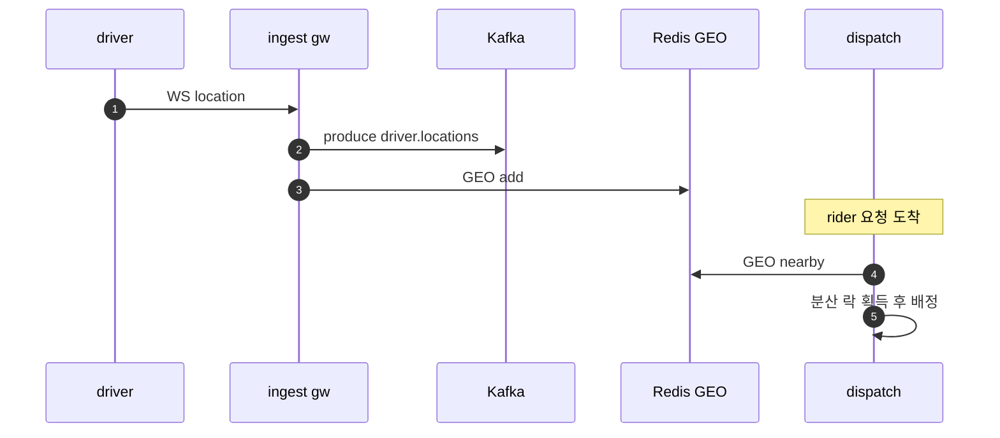
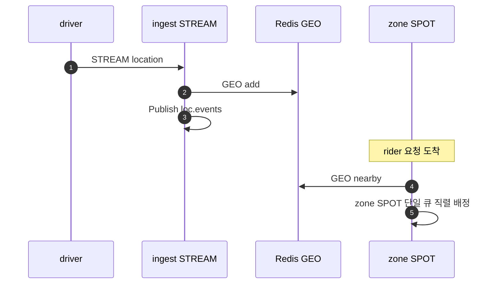

<!-- framework-adapter-nav:start -->
[문서 목록](../../../../../doc/README.ko.md) | [이전: 케이스 — 실시간 멀티플레이 게임](./15-case-realtime-game.ko.md) | [다음: 케이스 — 채팅·메시징 플랫폼](./17-case-chat-messaging.ko.md)
<!-- framework-adapter-nav:end -->

# 케이스 — 라이드헤일링 실시간 디스패치

> [12-grpc-alternative](../12-grpc-alternative.ko.md)의 케이스 스터디 중 하나다.
> 대량 위치 fan-out + 지역(zone) 단위 매칭을 다루며, **geo-index·영속 이력은
> 그대로 남고** 라이브 전파·연결·매칭 직렬화가 ZLink 로 들어오는 사례다. 이 문서는
> 실행 가능한 샘플이 아니라 도입 판단과 책임 경계 설명을 맡는다.

> **이 케이스에서 ZLink 이 좋은 지점**
> - STREAM 이 위치 연결을 받고, pub/sub 가 다운스트림 fan-out 을 한다.
> - zone SPOT 이 지역 단위 배정을 직렬 처리해 배정 분산 락을 없앤다.
> - **그대로 남는 것**: 근접 질의(Redis GEO)와 위치 이력 영속(Kafka)은 그대로다.

## 1. 도메인 — 실시간 디스패치의 진짜 난제

- **고처리량 위치 ingestion.** 운전자 앱이 4–5초마다 위치를 보낸다. 500만 운전자면
  분당 ~100만 업데이트가 영속 연결로 쏟아진다.
- **지리 근접 질의.** "반경 2km 가용 운전자" 를 밀리초에 찾아야 한다 — **Redis
  geospatial 인덱스/H3 셀** 로 푼다.
- **다운스트림 fan-out.** 위치 스트림을 ETA·surge·analytics 가 동시에 구독한다.
- **배정의 일관성.** 한 운전자가 두 호출에 동시에 배정되면 안 된다 — 지역 단위
  **직렬 결정**이 필요하다.
  ([Uber-scale dispatch](https://dev.to/madhur_banger/architecting-an-uber-scale-real-time-tracking-dispatch-system-3a72))

남는 난제: **geo-index(Redis/H3)** 와 **위치 이력의 영속/replay(Kafka)** 는 그대로
남는다. ZLink 가 줄이는 건 연결 수용·라이브 fan-out transport·discovery 다.

## 2. 기존 스택 — WS ingestion + Kafka + Redis GEO

### 2.1 컴포넌트와 그 이유

| 컴포넌트 | 왜 필요한가 |
|----------|-------------|
| WS ingestion gateway | 운전자 앱의 영속 연결 수용 + 초당 대량 위치 수신 |
| Kafka | 위치 스트림을 **다운스트림 fan-out**(ETA·surge·analytics) + 이력 영속 |
| Redis GEO / H3 | 반경 근접 질의("2km 내 가용 운전자")를 밀리초에 |
| 분산 락(Redis 등) | 같은 운전자가 두 호출에 **이중 배정**되는 것을 막음 |
| dispatch service | ride 요청을 소비해 후보 운전자와 매칭 |
| service mesh / discovery | dispatch↔다른 서비스 위치 해결·분배 |

### 2.2 위치 ingestion + 다운스트림

```csharp
// 위치 ingestion: WS 수신 → Kafka(다운스트림) + Redis GEO(근접 질의)
await foreach (var loc in ReadLocations(ws))
{
    await kafka.ProduceAsync("driver.locations", loc);                  // ETA/surge/analytics
    await redis.GeoAddAsync("drivers", loc.Lng, loc.Lat, loc.DriverId); // 근접 질의 인덱스
}
```

```csharp
// 다운스트림 consumer 예: ETA 서비스가 Kafka 토픽을 구독
await foreach (var loc in kafkaConsumer.Consume<DriverLocation>("driver.locations"))
    await etaIndex.UpdateAsync(loc);   // 도착 시간 추정 갱신
```

### 2.3 매칭(dispatch)

```csharp
// dispatch: ride 요청 → Redis GEO 근접 질의 → 후보 → 배정(분산 락으로 중복 방지)
var nearby = await redis.GeoSearchAsync("drivers",
    req.Lng, req.Lat, new GeoSearchCircle(2, GeoUnit.Kilometers));
await using var locked = await locker.AcquireAsync($"driver:{chosen}"); // 이중 배정 방지
await rideStore.AssignAsync(req.RiderId, chosen);
```

서 있어야 하는 것: WS ingestion gateway, Kafka, Redis GEO, 분산 락, dispatch
service, 다운스트림 consumer(서비스마다), service discovery/mesh.

## 3. ZLink 스택 — STREAM + pub/sub + zone SPOT

```csharp
// 운전자 STREAM session: 위치를 라이브 fan-out + geo-index 갱신(그대로)
public sealed class DriverSession(
    IZLinkSessionContext context,
    IZLinkFanoutPublisher feed,
    IGeoIndex geo) : IZLinkSession           // IGeoIndex = Redis GEO 래퍼(앱)
{
    public IZLinkSessionContext Context { get; } = context;

    public async ValueTask OnDispatchAsync(
        ZlinkStreamHeader header, Message payload, CancellationToken ct)
    {
        var loc = payload.Decode<DriverLocation>();
        await geo.UpdateAsync(loc, ct);                                   // Redis GEO — 유지
        await feed.Publish("loc.events", "driver.location", loc).Submit(ct); // 라이브 fan-out
    }

    public ValueTask OnConnectedAsync(CancellationToken ct) => ValueTask.CompletedTask;
    public ValueTask OnDisconnectedAsync(CancellationToken ct) => ValueTask.CompletedTask;
    public ValueTask OnErrorAsync(ZLinkStreamError error, CancellationToken ct) => ValueTask.CompletedTask;
}
```

```csharp
// 매칭: rider 요청 → geo 근접 질의 후보 → zone SPOT 에서 직렬 배정(분산 락 불필요)
public sealed class AssignRideHandler(IGeoIndex geo)
    : IZLinkSpotRequestHandler<ZoneSpot, AssignRide, RideAssigned>
{
    public async ValueTask<RideAssigned> HandleAsync(
        ZoneSpot spot, AssignRide req, CancellationToken ct)
    {
        var candidates = await geo.NearbyAsync(req.Lat, req.Lng, 2_000, ct);  // Redis GEO
        return spot.Assign(candidates, req.RiderId);   // 같은 zone spot 은 단일 큐 → 이중 배정 없음
    }
}
```

```csharp
// 다운스트림 구독: ETA 서비스가 fanout channel 을 구독(Kafka consumer 자리)
[ZLinkHandlerGroup("loc.events")]
public sealed class EtaProjector : IZLinkPublishHandler<DriverLocation>
{
    public ValueTask HandleAsync(
        DriverLocation loc, ZLinkPublishContext context, CancellationToken ct)
        => /* ETA 인덱스 갱신 */ ValueTask.CompletedTask;
}
```

```csharp
// 등록 골격(정식은 05·07): STREAM(위치 수신) + fanout(loc.events) + zone SpotMesh
options.AddStreamNode("ingest", s => s.RegisterSession<DriverSession>());
options.AddFanoutChannel("loc.events", c =>
    c.EnablePublisher(p => p.Bind("tcp://0.0.0.0:7600")));
options.AddSpotMesh("zones", mesh => mesh.AddNode("zone-node", n =>
{
    n.EnableRouter(r => r.SetRouterBind("tcp://0.0.0.0:7610"));
    n.AddSpotFactory<ZoneSpot>("zone");
}));
```

> **분산 락이 빠지는 이유.** 한 zone 의 배정 결정이 그 **zone SPOT 의 단일 실행
> 큐**에서 직렬로 돌기 때문에, 같은 운전자를 두 요청이 동시에 잡는 race 가 구조적으로
> 없다. 기존의 `driver:{id}` 분산 락이 사라진다(단, 운전자가 zone 경계를 넘나드는
> 설계는 spot 분할 정책으로 푼다).

## 4. 양쪽 코드 비교 — "위치 수신 + 배정"

| 축 | 기존(WS + Kafka + Redis) | ZLink |
|----|---------------------------|-------|
| 연결 수용 | WS ingestion gateway 직접 | STREAM `IZLinkSession` |
| 라이브 fan-out | Kafka produce/consume | `Publish("loc.events", ...)` |
| 근접 질의 | Redis GEO | Redis GEO(유지) |
| 이중 배정 방지 | 분산 락 | zone SPOT 단일 실행 큐 |
| 위치 이력 영속 | Kafka 유지 | Kafka 유지 |

## 5. 아키텍처 비교 — 컴포넌트와 메시지 흐름

```text
[classic]  WS ingestion + Kafka + Redis GEO + dispatch

  +--------------+   +--------------+   +--------------+
  | WS ingestion |   | Kafka        |   | Redis GEO    |
  | gateway      |-->| (locations)  |   | + dist. lock |
  +--------------+   +------+-------+   +------+-------+
                            |                  |
              +-------------+------+    +-------v------+
              v             v      v    | dispatch     |
            ETA          surge  analytics+--------------+
  + service discovery / mesh
```

```text
[ZLink]  STREAM + fanout channel + zone SPOT

  +--------------+                     +--------------+
  | ingest server|   Publish           | Redis GEO    |  (kept: geo query)
  | (STREAM)     |--> loc.events --+    +--------------+
  +--------------+                 |    +--------------+
                          +--------+-->| ETA/surge/.. |
                          v        v   +--------------+
                  +--------------+     +--------------+
                  | dispatch     |---->| zone SPOT    |  serial assign
                  +--------------+     +--------------+
  + Registry (location resolve)
  + Kafka (kept if location history needs persist)
```

- **빠지는 박스:** WS ingestion gateway, 라이브 fan-out용 Kafka 한 겹, 배정 분산 락,
  discovery/mesh.
- **그대로인 박스:** Redis GEO(근접 질의), Kafka(영속/replay 이력).

### 메시지 흐름 — 시퀀스 비교

위치 수신과 배정 흐름이다.





라이브 fan-out용 Kafka 한 겹과 배정 분산 락이 빠진다. 근접 질의 Redis GEO 는 양쪽
모두 그대로다.

## 6. 줄어드는 것 / 그대로 남는 것

- **줄어드는 것:** 라이브 fan-out transport, 연결 수용 gateway, 배정 분산 락,
  discovery/mesh.
- **그대로 남는 것:** **geo-index(Redis/H3)** 와 **위치 이력 영속/replay(Kafka)**.
  ZLink 는 geo 질의나 영속 큐를 대신하지 않는다. 공통 경계는
  [12-grpc-alternative](../12-grpc-alternative.ko.md)의 §4 경계 절 참고.

## 7. 더 보기

- 케이스 허브: [12-grpc-alternative](../12-grpc-alternative.ko.md)
- 사용법: [04-channel-messaging](../04-channel-messaging.ko.md), [05-spot](../05-spot.ko.md), [07-stream](../07-stream.ko.md)
- 다음 케이스: [17-case-chat-messaging](./17-case-chat-messaging.ko.md)
