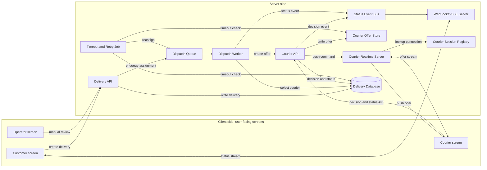
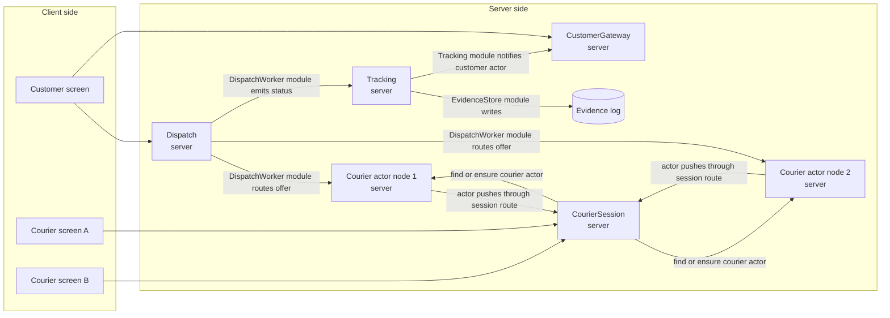
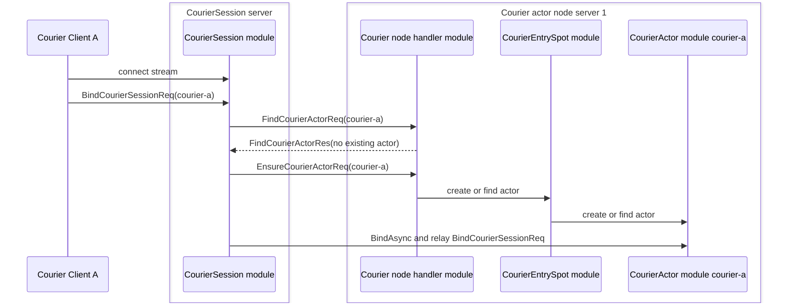
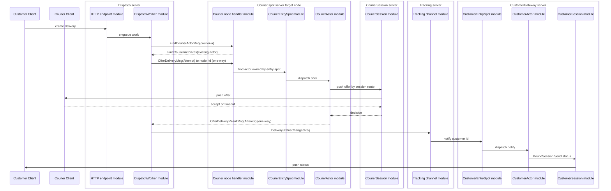

# DeliveryDispatch 샘플

`DeliveryDispatch`는 배송 배차와 배송 상태 추적을 보여주는 .NET Framework
샘플이다. 고객 앱은 HTTP로 배송을 만들고 WebSocket 또는 stream session으로 상태 변경을
기다린다. 내부 역할은 ZLink channel, entry spot, actor, stream session binding을
사용해서 배차 요청, 배송원 제안, timeout 재배정, 고객별 상태 push를 처리한다.

이 샘플은 실제 배송 플랫폼을 그대로 구현한 예제가 아니다. 실무에서 자주 나오는
"요청을 만들고, 수행자를 찾고, 특정 사용자 연결로 push하고, 응답이 없으면 재시도하는"
기능을 구현할 때 그 책임이 ZLink framework의 어떤 기능에 대응되는지 보여 주는 통합
샘플이다. 따라서 배송 도메인 자체보다 HTTP 경계, channel, entry spot, actor,
stream session binding이 한 업무 흐름 안에서 어떻게 이어지는지를 보는 것이 핵심이다.

공통 시나리오 기준은
[`framework/doc/framework/common/sample/deliverydispatch/README.ko.md`](../../../../doc/framework/common/sample/deliverydispatch/README.ko.md)에
있다. 이 README는 .NET 샘플의 실행 방법과 구성을 설명한다.

이 샘플의 직접 모델은 음식 배달, 퀵 배송, 택배 같은 배송 서비스다. 같은 구조는
택시 호출, 현장 출동, 방문 서비스처럼 “요청을 만들고 수행자를 배정한 뒤 상태를
실시간으로 고객에게 보여주는” 도메인에도 적용할 수 있다.

## 실행

```bash
./framework/languages/dotnet/samples/DeliveryDispatch/run_sample.sh
```

전체 .NET 샘플 러너에도 등록되어 있다.

```bash
./framework/languages/dotnet/samples/run_samples.sh
```

러너는 실행마다 전용 Redis 컨테이너를 location store로 시작하고
(`DELIVERYDISPATCH_REDIS_ENDPOINT`, `DELIVERYDISPATCH_REDIS_KEY_PREFIX`), 서버 역할을
별도 프로세스로 시작한 뒤 포트와 HTTP health를 확인하고 client scenario를 실행한다.
`run_sample.sh`와 `run_sample.ps1`은 외부 Redis endpoint를 재사용하지 않는다. 각 실행은
전용 Docker Redis 컨테이너를 만들고 종료할 때 컨테이너와 volume을 함께 제거한다. 서버들은
registry process 없이 공유 location store에 위치를 등록하고 자동 연결한다.

## 왜 실시간성이 중요한가

배송 배차에서 메시지 지연은 단순한 화면 갱신 지연이 아니다. 가까운 배송원이 다른
일을 잡기 전에 제안을 보내야 하고, 배송원이 응답하지 않으면 빠르게 다음 배송원에게
넘겨야 한다. 고객도 배정, 픽업, 배송 완료 상태가 늦게 보이면 문제가 생겼다고
느낀다.

| 늦게 전달된 메시지 | 생기는 문제 |
|--------------------|-------------|
| 배송 제안 | 가까운 배송원이 다른 일을 잡아 배차 기회를 놓친다. |
| 수락 또는 timeout | 재배정이 늦어져 고객 대기 시간이 늘어난다. |
| 픽업 완료 | 고객과 운영자가 아직 준비 중이라고 오해한다. |
| 배송 완료 | 정산, 리뷰 요청, 다음 작업 배정이 늦어진다. |

그래서 이 샘플은 CRUD보다 “중요한 상태가 역할 사이를 바로 이동하고 고객 session까지
도달하는가”를 검증한다.

## 기존 웹 방식

배송 시스템을 일반적인 웹 방식으로 만들면 client side와 server side를 나누어
구성한다. client side는 사용자가 직접 보는 화면이다. 아래의 customer, courier,
operator는 이 샘플에 들어 있는 실행 프로세스가 아니라, 실제 서비스에서 보통
분리되는 사용자 화면을 뜻한다. server side는 HTTP API, WebSocket/SSE 서버,
worker, 저장소처럼 client 요청을 받아 처리하는 서버 역할이다.



이 흐름을 배송 하나 기준으로 보면 다음과 같다.

1. 고객 화면이 `Delivery API`로 배송 생성 요청을 보낸다.
2. `Delivery API`는 배송 정보를 저장하고, 배차가 필요하다는 작업을 `Dispatch Queue`에
   넣는다.
3. `Dispatch Worker`는 queue에서 작업을 꺼내고, 데이터베이스를 참고해 제안할 배송원을
   고른다.
4. worker는 `Courier API`에 배송 제안을 만들라고 요청한다. `Courier API`는 offer를
   저장하고, `Courier Realtime Server`는 `Courier Session Registry`에서 배송원 연결을
   찾아 배송원 화면으로 offer를 push한다.
5. 배송원 화면은 offer stream으로 제안을 받고, 수락, 거절, 상태 변경은 `Courier API`로
   보낸다.
6. 배송원이 응답하지 않으면 `Timeout and Retry Job`이 배송 상태와 offer 상태를 확인하고
   다시 배차 queue에 넣어 다음 배송원에게 제안하게 한다.
7. 배정, 픽업, 배송 완료 같은 상태 변경은 `Status Event Bus`로 전달되고,
   `WebSocket/SSE Server`가 고객 화면에 상태를 push한다.

이 방식은 익숙하고 운영 도구가 많다. 다만 배차 결정, 배송원 응답, timeout 재시도,
고객 push가 서로 다른 계층에 흩어지면 한 배송의 흐름을 여러 로그와 저장소 상태로
따라가야 한다. 고객 WebSocket만 빠르게 만들어도 배차 worker가 수락 실패를 늦게
알거나 상태 이벤트가 WebSocket 서버까지 늦게 도달하면 실시간성 문제는 남는다.

## ZLink 샘플의 대체 지점

ZLink는 고객의 HTTP 요청이나 WebSocket 연결을 없애지 않는다. client side는 여전히
고객 화면이고, 외부 경계는 HTTP와 stream 연결을 사용한다. server side에서는
`Dispatch server`, `CustomerGateway server`, `CourierSession server`가 client 요청과 stream 연결을
받는 입구가 되고, 그 뒤의 배차 메시징과 고객별 상태 push, 배송원별 offer push를
ZLink 역할 메시지로 구성한다.

| 기존 웹 시스템 구성 | ZLink 샘플의 대응 | 설명 |
|--------------------|------------------|------|
| Delivery API + dispatch worker | `Dispatch server` | 고객 HTTP 요청을 받고, 같은 server 안의 worker가 후보 배송원을 고른 뒤 target courier actor node로 제안을 보낸다. |
| Courier API 또는 worker | `CourierSession server` + `Courier actor MeshNode server` | CourierSession이 배송원 stream을 받고 기존 actor 위치를 먼저 찾는다. actor가 없으면 배치 정책이 선택한 MeshNode의 entry Spot에 actor 생성을 요청하고, actor가 bound session으로 제안을 push한다. |
| Delivery event table | `Tracking` + `EvidenceStore` | 상태 이벤트를 기록하고 고객에게 보낼 알림을 만든다. |
| Session map 또는 socket registry | `CustomerActor` + bound session | 고객 actor와 현재 stream session을 연결해 특정 고객에게만 status를 push한다. |
| WebSocket/SSE server | `CustomerGateway server` | 고객 stream 연결을 받고, 기존 customer actor를 먼저 찾은 뒤 현재 session과 bind한다. 없을 때만 actor를 만든다. |
| Actor entry point | `CustomerEntrySpot`, `CourierEntrySpot` | 고객 actor와 배송원 actor가 들어오는 입구이며, server side에서 actor를 찾는 기준점이다. |
| Courier placement | `SampleTopology` + courier route handler | 배송원 id를 어느 MeshNode의 actor로 둘지 정한다. actor와 session binding은 framework actor/session public API가 맡는다. |

아래 문서에서 server는 샘플이 시작하는 실행 단위나 node를 뜻하고, 이름에 `server`를
사용한다. module은 그 server 안에 있는 handler, worker, directory 같은 코드 책임이며,
이름에는 `module`을 사용한다.



위 그림은 server 배치와 server 사이의 의존성 방향만 보여준다. 각 server 안의 module 구성은
아래 표와 sequence diagram에서 설명한다. 각 요청의 시간 순서와 응답 흐름은 아래의 흐름
설명과 sequence diagram에서 따로 설명한다.
`CourierEntrySpot`이라는 타입이 두 개인 것이
아니라, 같은 courier entry spot 역할을 두 MeshNode에 배치한 것이다. 샘플 검증은
`courier-a` actor가 node-1에, `courier-b` actor가 node-2에 있는 상황을 의도한다.
round-robin 배치에 우연히 맡기면 테스트가 실행 순서에 민감해지므로, `SampleTopology`가
배송원 id별 target node를 명시적으로 정한다.

`CourierSession server`는 배송원 client의 stream 연결을 받는 server다. `Courier spot
server node 1/2`는 실제 actor와 entry spot을 가진 node다. 두 역할은 한 프로세스에 함께
배치할 수도 있지만, 아키텍처 설명에서는 논리적으로 분리한다. 그래야 client 연결을 받는
책임과 actor placement, actor 메시지 진입점 책임이 섞이지 않는다.

배송원 actor를 어느 node에 둘지 정하는 책임은 샘플 topology에 있다. 선택된 node에서 actor를
만들고 actor 메시지 진입점을 제공하는 책임은 각 spot server의
`CourierEntrySpot module`과 `CourierActor module`에 있다. `CourierActor module`이 client로 push할 때는 직접 client
socket을 직접 소유하지 않고 bind 과정에서 연결된 session route를 통해
`CourierSession server`로 보낸다.

ZLink 샘플의 흐름을 같은 배송 하나 기준으로 보면 다음과 같다.

1. 고객 화면은 `Dispatch server`의 HTTP endpoint로 배송 생성 요청을 보낸다.
2. `Dispatch server`의 HTTP API module은 같은 server 안의 dispatch channel module로
   `AssignDeliveryMsg`를 넘긴다. 샘플에서는 HTTP edge와 배차 worker를 한 server에 둔다.
3. 배송원 앱이 stream으로 연결되면 `CourierSession module`은 선택된 courier actor node에서
   기존 actor 위치를 먼저 찾는다. 기존 actor가 없을 때만 `CourierEntrySpot module` 아래 actor
   준비를 요청한다. 배송원 A와 B는 별도 channel이 아니라 서로 다른 actor다.
4. `DispatchWorker module`은 먼저 courier id가 `courier-a`인 후보를 고르고, 기존 actor 위치를
   찾은 뒤 target MeshNode rid로 `OfferDeliveryMsg`를 **응답 없는 one-way로** 보낸다. 배송원의 결정은 `OfferDeliveryResultMsg`로 dispatch channel에 돌아온다(공통 sample spec §7.4).
5. target node의 `CourierEntrySpot module`은 자기 아래 actor를 찾고, `CourierActor module`은
   session route로 `CourierSession server`에 제안을 push하고, 배송원 앱의 응답을 배차 결과로
   돌려준다.
6. `courier-a`가 응답하지 않으면 `DispatchWorker module`은 timeout 뒤 courier id가
   `courier-b`인 후보로 같은 흐름을 다시 실행한다. 이때 `courier-b`는 node-2의 actor로
   검증된다.
7. 배정, 재배정, 수락, 픽업, 배송 완료 상태는 `DeliveryStatusChangedReq` 메시지로
   `Tracking`에 전달된다.
8. 고객 화면이 stream으로 연결되면 `CustomerSession module`은 `CustomerEntrySpot module`을 통해 고객
   actor를 준비하고, 그 actor와 현재 stream session을 bind한다.
9. `Tracking channel module`은 상태를 evidence log에 기록한 뒤 `DeliveryStatusUpdatedMsg`로
   `CustomerGateway`에 알린다. `CustomerGateway`는 customer actor registry에서 고객 actor를 찾고,
   고객 actor는 bound session으로 `DeliveryStatusNotify`를 보낸다. `CustomerSession module`은 그
   메시지를 고객 화면에 push한다.

### Courier actor bind 흐름

배송원 actor는 배송 제안이 온 뒤에 처음 찾는 것이 아니라, 배송원 stream이 연결될 때
먼저 session route와 묶인다. 이때 `CourierSession module`이 임의의 `CourierEntrySpot module`을 고르면
노드 배치 책임이 흐려진다. 그래서 샘플 topology가 courier id별 target node를 정하고,
`CourierSession module`은 선택한 node에서 기존 actor를 먼저 찾은 뒤 없을 때만 actor 준비를
요청한다. `CourierSession module`은 반환받은 actor ref로 `BindAsync`를 호출하고, 같은 bind request를 actor에 relay해서
actor node 쪽에서도 `BoundSession`으로 client에 push할 수 있게 한다.



`courier-b`도 같은 흐름으로 bind하지만, 샘플에서는 topology가 node-2를
선택하게 해서 node-2의 `CourierEntrySpot module`과 `CourierActor module`을 사용하게 한다. 배송원 stream은
여전히 `CourierSession server`에 연결되어 있고, actor는 session route를 통해 배송원 client로 push한다.
실제 서비스라면
이 결정은 현재 부하, 지역, 이미 연결된 session 위치 같은 기준을 볼 수 있지만, 샘플은
설명을 단순하게 유지하기 위해 courier id별 고정 배치를 사용한다.

### Delivery offer와 client push 흐름

배송 제안은 `DispatchWorker module`이 courier id의 target node에서 기존 actor 위치를 확인한 뒤
해당 node의 `CourierEntrySpot` 소유 actor로 보내는 흐름이다. `CourierEntrySpot`은 MeshNode마다
하나인 actor 진입점이므로 별도의 배송원별 channel이나 배송별 방이 필요 없다.



`courier-a`가 timeout이면 같은 sequence가 `courier-b`로 한 번 더 진행된다. 이때도
`DispatchWorker module`은 `courier-b`의 target node를 사용해 node-2의 `CourierEntrySpot module`
아래 actor로 전달한다.

### EntrySpot 메시징 주의점

`CustomerEntrySpot`과 `CourierEntrySpot`은 actor가 생성되고 들어오는 공용 입구다.
Entry spot으로 들어오는 메시지는 framework codec을 거쳐 직렬화되며, handler는
기본적으로 serial turn 안에서 실행된다. 따라서 entry spot handler에서 다른 channel,
spot, actor, session으로 request를 보낸 뒤 I/O 응답을 기다릴 때는 `.Async(...)`를
호출한다. framework는 응답을 기다리는 동안 현재 serial turn을 자동으로 반납하고,
완료 뒤 같은 실행 문맥에서 handler를 계속 실행한다. 따라서 다른 actor 생성이나 join
메시지도 대기 중에 처리될 수 있다.

`await` 전후로 같은 mutable state를 그대로 이어서 판단하면 안 된다. 대기 중에 다른
메시지가 먼저 처리될 수 있으므로, 완료 뒤에는 필요한 상태를 다시 확인하거나 대기 전에
상태 변경을 확정하지 않는 방식으로 작성한다. 이 샘플에서 entry spot은
배송 상태 저장소가 아니라 actor 위치와 session route처럼 push할 수 있는 연결을
관리하는 입구로만 사용한다.

## 사용하는 ZLink 요소

샘플의 실행 단위와 내부 module은 다음처럼 구분한다.

| server 또는 node | 내부 module 또는 ZLink 요소 | 설명 |
|------------------|-----------------------------|------|
| `Dispatch server` | ASP.NET HTTP API, tracking ChannelName client, courier Spot/Actor client, `DispatchWorker` module | 고객 HTTP 요청을 받고, courier 후보 선택과 timeout 재시도를 처리한다. |
| `CourierSession server` | `AddStreamNode`, courier route client, `CourierSession` | 배송원 stream 연결을 받고, 기존 courier actor를 찾은 뒤 현재 session을 bind한다. |
| `Courier actor node server 1/2` | `CourierEntrySpot`, `CourierActor` | 선택된 node에서 actor를 만들고 actor 메시지 진입점을 제공한다. |
| `Tracking server` | MeshNode의 tracking `ChannelName`, `EvidenceStore` module | 배송 상태 이벤트를 기록하고 고객 알림을 만든다. |
| `CustomerGateway server` | `AddStreamNode`, `CustomerSession`, `CustomerEntrySpot`, `CustomerActor` | 고객 stream 연결을 받고, 고객 actor와 session을 bind한다. |
| Client | HTTP client + stream connector typed wait | 샘플 검증 시나리오를 실행한다. |

역할 간 channel은 다음과 같다.

| 이름 | Framework 요소 | 연결 |
|------|----------------|------|
| `deliverydispatch.tracking` | `ChannelName` | `DispatchWorker module -> Tracking` select-one |
| `delivery-customers` | `ChannelName` + local Spot ownership | `CustomerEntrySpot`에서 customer actor 관리 |
| `delivery-couriers` | `ChannelName` + local Spot ownership | `CourierSession/DispatchWorker -> target MeshNode RID -> CourierEntrySpot -> CourierActor` |

`delivery-couriers`는 배송원마다 하나씩 늘어나는 channel이 아니다. 모든 배송원 actor가
같은 mesh 안에 있고, framework actor/session binding이 어떤 session route로 client에 push할지를
관리한다. `DispatchWorker module`은 courier id의 target node에서 기존 actor를 찾은 뒤 offer를
보낸다.

## 검증 시나리오

Client scenario는 customer stream session 하나와 courier stream session 두 개를 만든다.
`courier-a`와 `courier-b`는 같은 CourierSession server endpoint에 연결하지만 서로 다른
stream connector를 사용하므로 session도 분리된다. 각 배송원 client는 자기 courier id로
client는 `BindCourierSessionReq`을 한 번 보낸 뒤 배송 제안을 기다린다.
client가 처음 보낼 때는 courier id만 채우고, `CourierSession module`은 actor bind relay 때
actor 위치와 session route를 채워 actor node가 현재 session을 알 수 있게 한다.

그 뒤 두 배송을 만든다.

1. `delivery-success`: `courier-a` actor가 node-1에서 session route를 통해 제안을 받고
   바로 수락한다. 고객은 `Assigned`, `Accepted`, `PickedUp`, `Delivered`를 stream으로
   받는다.
2. `delivery-reassign`: `courier-a` actor는 session route로 제안을 보내지만 client 응답이 없어 timeout이
   난다. `DispatchWorker module`은 `courier-b`로 다시 제안하고, Courier channel handler가
   `courier-b` actor가 있는 node-2로 요청을 넘긴다. `courier-b` client가 stream으로
   받은 offer를 수락하면 고객은 `Assigned`, `Reassigned`, `Accepted`, `Delivered`를
   받는다.

마지막에는 `/self-check/assert`가 evidence log에 두 배송의 상태 순서가 누락 없이
남았는지 확인한다.
