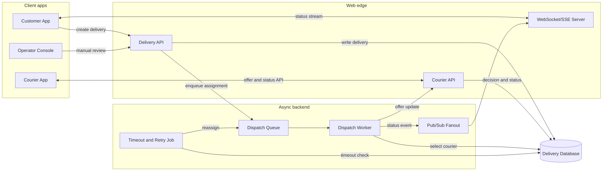
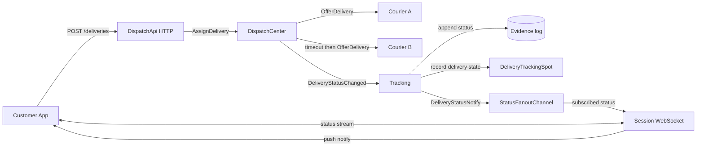

# DeliveryDispatch 샘플

`DeliveryDispatch`는 배송 배차와 배송 상태 추적을 보여주는 .NET Framework
샘플이다. 고객 앱은 HTTP로 배송을 만들고 WebSocket session으로 상태 변경을
기다린다. 내부 역할은 ZLink channel, fanout, spot, stream session을 사용해서
배차 요청, 배송원 제안, timeout 재배정, 상태 fanout을 처리한다.

이 샘플의 직접 모델은 음식 배달, 퀵 배송, 택배 같은 배송 서비스다. 같은 구조는
택시 호출, 현장 출동, 방문 서비스처럼 “요청을 만들고 수행자를 배정한 뒤 상태를
실시간으로 고객에게 보여주는” 도메인에도 적용할 수 있다.

## 실행

```bash
./framework/languages/dotnet/samples/DeliveryDispatch/run_sample.sh
```

전체 .NET 샘플 러너에도 등록되어 있다.

```bash
./framework/languages/dotnet/samples/run_samples.sh
```

러너는 서버 역할을 별도 프로세스로 시작하고, registry readiness와 Tracking channel
active probe를 확인한 뒤 client scenario를 실행한다.

## 왜 실시간성이 중요한가

배송 배차에서 메시지 지연은 단순한 화면 갱신 지연이 아니다. 가까운 배송원이 다른
일을 잡기 전에 제안을 보내야 하고, 배송원이 응답하지 않으면 빠르게 다음 배송원에게
넘겨야 한다. 고객도 배정, 픽업, 배송 완료 상태가 늦게 보이면 문제가 생겼다고
느낀다.

| 늦게 전달된 메시지 | 생기는 문제 |
|--------------------|-------------|
| 배송 제안 | 가까운 배송원이 다른 일을 잡아 배차 기회를 놓친다. |
| 수락 또는 timeout | 재배정이 늦어져 고객 대기 시간이 늘어난다. |
| 픽업 완료 | 고객과 운영자가 아직 준비 중이라고 오해한다. |
| 배송 완료 | 정산, 리뷰 요청, 다음 작업 배정이 늦어진다. |

그래서 이 샘플은 CRUD보다 “중요한 상태가 역할 사이를 바로 이동하고 고객 session까지
도달하는가”를 검증한다.

## 기존 웹 방식

배송 시스템을 일반적인 웹 방식으로 만들면 고객 앱, 배송원 앱, HTTP API, 데이터베이스,
배차 worker, WebSocket/SSE 서버, pub/sub fanout을 조합한다.



이 방식은 익숙하고 운영 도구가 많다. 다만 배차 결정, 배송원 응답, timeout 재시도,
고객 push가 서로 다른 계층에 흩어지면 한 배송의 흐름을 여러 로그와 저장소 상태로
따라가야 한다. 고객 WebSocket만 빠르게 만들어도 배차 worker가 수락 실패를 늦게
알거나 상태 이벤트가 fanout까지 늦게 도달하면 실시간성 문제는 남는다.

## ZLink 샘플의 대체 지점

ZLink는 고객의 HTTP 요청이나 WebSocket 연결을 없애지 않는다. 외부 경계는 그대로
웹 기술을 사용한다. 대신 내부 배차 메시징과 상태 fanout을 ZLink 역할 메시지로
구성한다.

| 기존 웹 시스템 구성 | ZLink 샘플의 대응 | 설명 |
|--------------------|------------------|------|
| Delivery API | `DispatchApi` | 고객 HTTP 요청을 받고 `AssignDelivery`를 ZLink channel로 보낸다. |
| Dispatch queue + worker | `DispatchCenter` + `DispatchWorker` | 요청을 접수한 뒤 worker가 배송원 선택, timeout, 재배정을 처리한다. |
| Courier API 또는 worker | `Courier` | 배송 제안을 받고 수락 또는 timeout을 만든다. |
| Delivery event table | `Tracking` + `EvidenceStore` | 상태 이벤트를 기록하고 고객에게 보낼 알림을 만든다. |
| Pub/sub fanout | `StatusFanoutChannel` | Tracking에서 Session으로 `DeliveryStatusNotify`를 publish한다. |
| WebSocket/SSE server | `Session` | 고객 WebSocket 연결과 delivery subscription을 유지하고 status를 push한다. |
| 상태별 delivery room | `DeliveryTrackingSpot` | 고객 actor가 관심 delivery에 join했다는 도메인 구조를 보여준다. |



## 사용하는 ZLink 요소

| 역할 | 사용하는 요소 |
|------|---------------|
| `Registry` | `AddZLinkRegistry`, discovery readiness 확인 |
| `DispatchApi` | ASP.NET HTTP API, `AddClientServerChannel` client |
| `DispatchCenter` | `AddClientServerChannel` server/client, background `DispatchWorker` |
| `Courier` | `AddClientServerChannel` server, `OfferDeliveryHandler` |
| `Tracking` | `AddClientServerChannel` server, `AddFanoutChannel` publisher, `AddSpotMesh`, `AddActorFactory<CustomerActor>` |
| `Session` | `AddStreamNode`, `IZLinkSession`, `AddFanoutChannel` subscriber |
| Client | HTTP client + stream connector typed wait |

역할 간 channel은 다음과 같다.

| 이름 | Framework 요소 | 연결 |
|------|----------------|------|
| `deliverydispatch.dispatch` | `AddClientServerChannel` | `DispatchApi -> DispatchCenter` |
| `deliverydispatch.courier.a` | `AddClientServerChannel` | `DispatchCenter -> Courier A` |
| `deliverydispatch.courier.b` | `AddClientServerChannel` | `DispatchCenter -> Courier B` |
| `deliverydispatch.tracking` | `AddClientServerChannel` | `Session/DispatchCenter -> Tracking` |
| `deliverydispatch.status` | `AddFanoutChannel` | `Tracking -> Session` |
| `delivery-spots` | `AddSpotMesh` | customer actor와 delivery spot join |

## 검증 시나리오

Client scenario는 두 배송을 만든다.

1. `delivery-success`: `courier-a`가 바로 수락한다. 고객은 `Assigned`, `Accepted`,
   `PickedUp`, `Delivered`를 WebSocket stream으로 받는다.
2. `delivery-reassign`: `courier-a`가 응답하지 않는다. `DispatchCenter`가 짧은
   timeout 뒤 `courier-b`로 재배정하고, 고객은 `Assigned`, `Reassigned`,
   `Accepted`, `Delivered`를 받는다.

마지막에는 `/self-check/assert`가 evidence log에 두 배송의 상태 순서가 누락 없이
남았는지 확인한다.
