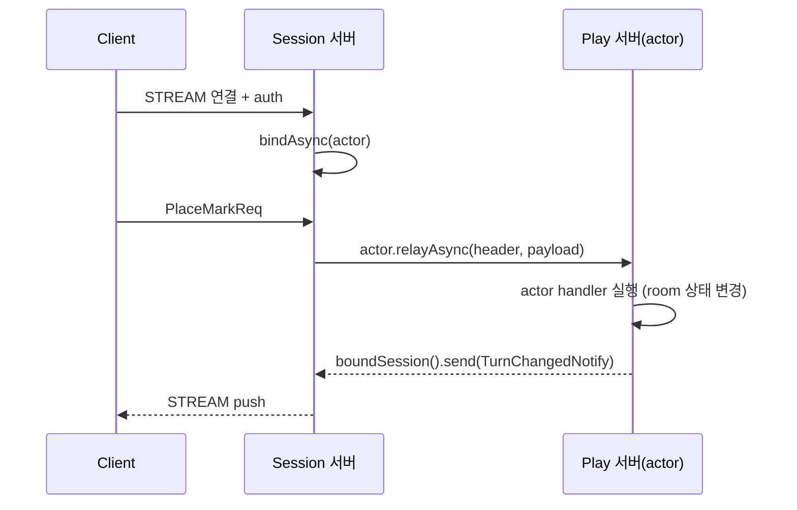

<!-- framework-adapter-nav:start -->
[문서 목록](../README.ko.md) | [이전: Spot](./06-spot.ko.md) | [다음: STREAM](./08-stream.ko.md)
<!-- framework-adapter-nav:end -->

# Java Actor/Session Guide

## 1. actor란

actor는 **ID로 식별되는 상태 보유 객체**다. 같은 `actorId`로 들어오는 메시지는
항상 같은 인스턴스가 처리한다(일반 handler는 stateless라 메시지마다 새로 resolve된다).
게임에서 한 플레이어, 한 세션의 진행 상태를 담기에 맞다.

호출자는 actor가 어느 노드/Spot에 있는지 몰라도 된다. `actorId`만으로 호출하면
라우팅은 framework가 등록된 resolver로 푼다.

actor의 상태는 서로 독립인 두 축으로 본다.

| 축 | 값 |
|----|------|
| 위치(location) | Entry Spot(생성 직후 기본) <-> user Spot(join 후) |
| binding | unbound <-> STREAM session에 bound |

위치 이동과 session binding은 독립이다. user Spot join에 session bind가 꼭
필요한 것은 아니다. session disconnect는 actor membership을 바꾸지 않는다.

## 2. actor 등록과 작성

actor는 factory로 만든다. factory는 `actorType` 짧은 문자열로 등록한다.

```java
@Override
public void configure(ZLinkFrameworkOptions framework) {
    options.addActorFactory("player", PlayerActorFactory.class);
    // Entry Spot / user Spot 등록은 SpotNode 쪽에서 (§3)
}

@Component
public final class PlayerActorFactory implements ZLinkActorFactory {
    @Override
    public CompletionStage<ZLinkActor> createAsync(
        String actorId,
        ZLinkActorContext context) {
        return CompletableFuture.completedFuture(new PlayerActor(actorId, context));
    }
}
```

actor 안에서의 Spot join과 현재 상태 조회는 주입된 `ZLinkActorContext`로 한다.
channel outbound는 actor context의 기능이 아니며, Entry Spot 또는 user Spot
handler에서 받은 spot context로 호출한다.

| `ZLinkActorContext` 멤버 | 용도 |
|--------------------------|------|
| `spotRid()`, `isJoined()` | 현재 Spot join 상태 조회 |
| `boundSession()` | 자기 client로 push (§4) |
| `joinSpot(spotRid, request)` | user Spot으로 join. `.submitAsync(...)`로 종결 |
| `joinEntrySpot(spotNodeRid)` | target SpotNode의 Entry Spot으로 이동 |

`joinSpot(...).submitAsync(replyType)`는 actor join 요청을 제출하고, join reply를
`replyType`으로 역직렬화한 뒤 `CompletionStage`로 반환한다. 성공하면 actor context의
`spotRid()`, `isJoined()`, `getSpot(Class)`가 join된 user Spot을 가리킨다. Java
framework는 이 호출에 blocking helper를 제공하지 않는다.

## 3. Entry Spot과 user Spot의 actor handler

actor handler와 lifecycle callback은 actor 클래스가 아니라 Entry Spot / user
Spot의 `configure()`에서 등록한다. Entry Spot과 user Spot은 등록 표면이 같지만
실행 정책이 다르다.

```java
public final class PlayerEntrySpot implements ZLinkEntrySpot {
    private final ZLinkEntrySpotContext context;

    public PlayerEntrySpot(ZLinkEntrySpotContext context) {
        this.context = context;
    }

    @Override
    public ZLinkEntrySpotContext context() {
        return context;
    }

    @Override
    public void configure() {
        context.handlers().addActorPacket(AuthenticateHandler.class);
        context.handlers().addActorPacket(JoinMatchHandler.class);
    }
}
```

실행 순서가 위치마다 다르다.

| 대상 | 실행 라인 |
|------|-----------|
| Entry Spot actor packet | actor별 mailbox(같은 actor 순서 보장, actor끼리 병렬) |
| user Spot actor packet / packet / timer / subscription | 그 user Spot의 단일 실행 큐(직렬) |

그래서 user Spot 안의 room 상태 같은 가변 상태는 lock 없이 만질 수 있다.

> **응답 body는 반환값으로.** actor request handler는 응답 body를 직접 보내지
> 않고 반환한 `TReply`로 정한다. `context`의 reply는 metadata/compression 같은
> 응답 frame 옵션만 기록한다.

## 4. session actor dispatch — 연결 서버와 로직 서버 분리

큰 게임 서버는 보통 두 역할로 나눈다.

- **Session 서버** — client STREAM 연결만 받는다(인증, actor binding, client 요청
  relay). 게임 로직은 돌리지 않는다.
- **Play(Actor) 서버** — actor, Entry Spot, user Spot을 호스팅하고 실제 로직을 돌린다.

client는 STREAM 하나만 유지하고, Play 서버가 보내는 메시지도 그 STREAM으로
되돌아간다. 재접속(다른 Session 서버일 수도 있음) 시 binding만 새 stream으로
교체되고 actor 인스턴스와 spot membership은 그대로 유지된다(actor id 기준 멱등).



### Session 서버: 인증과 relay

session 콜백에서 인증 후 `bindAsync(...)`로 actor handle을 잡고, 이후 packet은
`ZLinkSessionActor.relayAsync(...)`로 actor에 넘긴다. `payload`는 framework runtime이
callback 동안 빌려준 값이다. `relayAsync(...)`는 caller payload를 소비하지 않으므로
그대로 넘긴다. callback 뒤에도 payload를 보관해야 할 때만 별도 copy를 만든다.

```java
@Component
public final class TicTacToeSession implements ZLinkSession {
    private final ZLinkSessionContext context;
    private final ZLinkActorManager actors;

    public TicTacToeSession(
        ZLinkSessionContext context,
        ZLinkActorManager actors) {
        this.context = context;
        this.actors = actors;
    }

    @Override
    public ZLinkSessionContext context() {
        return context;
    }

    @Override
    public CompletionStage<Void> onDispatchAsync(
        ZLinkStreamHeader header,
        Message payload) {
        if ("auth".equals(header.name())) {
            AuthReq req = payload.decode(AuthReq.class);
            return actors.getOrCreateAsync(req.actorId(), "player")
                .thenCompose(actor -> context.actors().bindAsync(actor))
                .thenCompose(bound -> context.client().reply(new AuthRep(true)).submitAsync());
        }
        return context.actors().bound().stream().findFirst()
            .map(actor -> actor.relayAsync(header, payload))
            .orElseThrow(() -> new IllegalStateException("no actor bound to this packet"));
    }
}
```

### Play 서버: actor가 자기 client로 push

Spot actor handler는 stream을 직접 들지 않는다. 자기 client로 보내려면 handler가
받은 actor의 `context().boundSession()`을 쓴다.

```java
context.boundSession()
    .send(new MatchFound(roomId))
    .packetName("MatchFound")
    .submitAsync();
```

`ZLinkBoundSession`의 표면은 **`send(message)`** 와 **`disconnectAsync()`** 둘뿐이다.
client로의 push는 단방향이며 별도 request 표면은 없다. `send(...).submitAsync()`는
fire-and-forget(route 위임 완료이지 client app ack이 아님)이다. 다른 actor의
client로 보내야 하면 먼저 그 actor에게 메시지를 보낸 뒤, 해당 actor가 자기
`boundSession()`으로 push한다.

## 5. 등록 골격

session relay는 application route mesh channel로 흐르지 않는다. 같은 runtime 안에서
만든 local managed actor instance를 bind하는 direct stream 역할은 attach 없이
framework 내부 dispatch 경로를 사용한다. remote actor ref를 bind해야 하는 session
gateway 역할에서는 STREAM session이 쓸 local SpotNode를 `attachActorGateway(...)`로
지정하면, `bindAsync(...)`가 remote actor locator를 core ActorGateway 경로에 bind한다.

- **Session 서버**: `addSpotMesh`로 session-node(router)를 두고,
  `addStreamNode(...).attachActorGateway("session-node")`로 relay 대상을 지정한다.
- **Play 서버**: `addActorFactory(...)` + `addSpotMesh`로 play-node에
  `addEntrySpot(...)`, `addSpotFactory(...)`를 등록한다.

전체 등록 시그니처와 sample 흐름은
[spring-boot-actor-session](../spec/spring-boot-actor-session.ko.md)과
[stream 샘플](./samples/stream-samples.ko.md)이 소유한다.

## 6. Reconnect와 gotcha

- 같은 actor id가 새 session에 다시 bind되면 actor 인스턴스와 Spot membership은
  유지하고 binding token만 갱신한다.
- session disconnect는 bound actor 전체에 자동 전파되지 않는다. 필요한 actor에게만
  `ZLinkSessionActor.notifyDisconnectedAsync()`를 호출한다.
- actor 위치 조회용 public resolver는 없다. actor<->session binding은 framework
  내부 상태다. Spot owner 조회만 `useRegistrySpotRemoteAddresses(...)` 또는 custom
  `addSpotRemoteAddressResolver(...)`로 public이다.

## 7. 더 보기

- SPOT 기반: [06-spot](./06-spot.ko.md)
- STREAM session 작성: [08-stream](./08-stream.ko.md)
- actor 런타임 오류 관찰: [10-monitoring](./10-monitoring.ko.md)
- 전체 계약: [spring-boot-actor-session](../spec/spring-boot-actor-session.ko.md)
