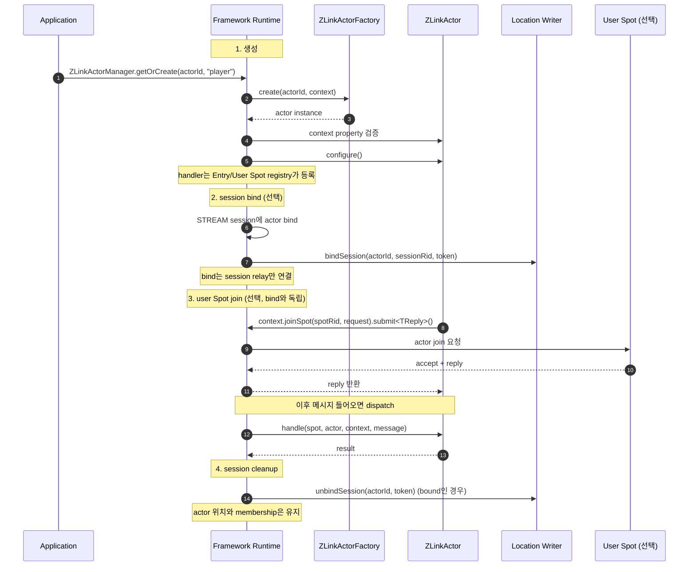
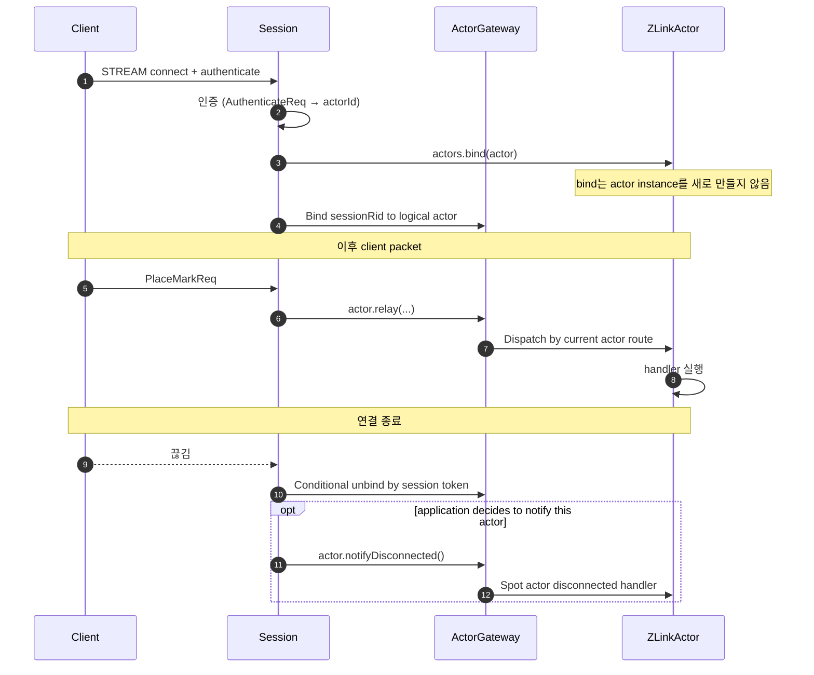
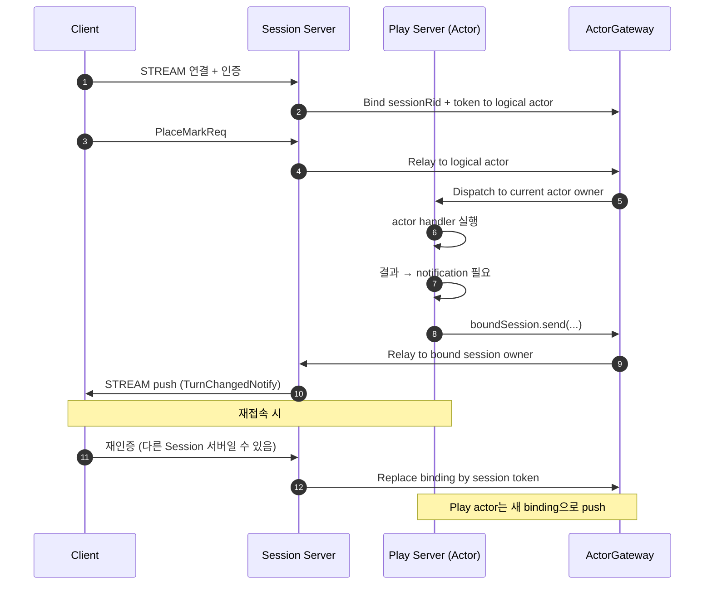

<!-- framework-adapter-nav:start -->
[문서 목록](../README.ko.md) | [이전: ZLink Framework NestJS SPOT](./nestjs-spot.ko.md) | [다음: ZLink Framework Session Actor Dispatch](./session-actor-dispatch.ko.md)
<!-- framework-adapter-nav:end -->

[스펙 목차](../README.ko.md)

[node 묶음](../README.ko.md) | [표면 매핑 정책](../internals/dotnet-to-node-surface-mapping.ko.md) | [channel](./nestjs-channel-messaging.ko.md) | [SPOT](./nestjs-spot.ko.md) | [STREAM](./nestjs-stream.ko.md) | [Registry](./nestjs-registry.ko.md)

> 이 문서는 `framework/languages/dotnet` 의 actor 계약을 NestJS / TypeScript
> 표면으로 옮긴 **정식 spec** 이다. 개념·의미론·동작은 dotnet 과 동일하고,
> 표면만 바꾼다. 번역 규칙은
> [.NET → Node.js 표면 매핑 정책](../internals/dotnet-to-node-surface-mapping.ko.md)
> 이 소유한다. 표기가 어긋나면 dotnet **코드**
> (`framework/languages/dotnet/src/Zlink.Framework/Contracts/Actors`,
> `Contracts/Spots`, `Contracts/Streams`)가 기능의 최종 기준이다.

# ZLink Framework NestJS Actor

## 1. 목적

이 절은 framework 가 actor 개념을 어떤 방향으로 노출하려고 하는지, 그 목표와
범위를 한 자리에 정리한다.

이 문서의 목표는 zlink core 가 정의한 **actor**[^actor] 개념을 `NestJS`
애플리케이션 위에서 `TypeScript` 다운 모양으로 노출하는 것이다.

zlink core 모델에서 actor 는 다음 성질을 가진다. 더 자세한 정의는 zlink core 의
[SPOT Actor Guide](../../../../../doc/guide/07-4-actor.md) 에서 다룬다.

- **`SpotNode`에 소속된다.** actor는 생성 직후 그 node의
  `Entry Spot`[^entryspot]에 위치한다.
- 선택적으로 **STREAM session에 binding**[^session-bind]할 수 있다. 한 session
  에는 여러 actor가 bind될 수 있지만, 하나의 actor는 한 번에 최대 한 session
  에만 bind된다. session binding은 client relay 경로일 뿐이고, actor가 실제로
  어디에 위치하는지를 결정하지는 않는다.
- 선택적으로 **user Spot에 join**[^user-spot-join]할 수 있다. 이 경우 Entry
  Spot에서 user Spot으로 이동한다. user Spot join은 STREAM session binding
  없이도 수행할 수 있다.
- user Spot에서 다시 Entry Spot으로 돌아오려면 **leave**, actor 자체를 완전히
  제거하려면 **destroy**를 수행한다. destroy는 actor가 Entry Spot에 있을 때만
  허용된다.

framework 는 위 모델 위에 `TypeScript` 다운 모양을 한 겹 더 얹어서 사용자에게
노출한다. 그 한 겹은 두 종류의 요소로 이루어진다.

- lifecycle 요소 -- constructor injection, NestJS provider
  scope[^di-scope]
- fluent 호출 표면 -- `ZLinkActorContext`, `ZLinkBoundSession`

책임은 두 갈래로 나눠서 본다.

- **framework가 자동으로 관리하는 영역**: Entry Spot 자체의 생성과 소멸, user
  Spot에서 Entry Spot으로 돌아오는 leave, actor destroy가 여기에 해당한다.
  즉 application 코드는 `zlink_spot_node_entry_spot()` /
  `zlink_spot_node_actor_leave_spot()` / `zlink_spot_node_actor_destroy()`
  같은 raw API[^raw-api]를 직접 호출하지 않는다.
- **application이 구현하는 Entry Spot 로직**: actor가 Entry Spot에 머무는 동안
  받는 packet의 handler는 application이 정한다. 이 handler는 actor 클래스에
  붙이는 것이 아니라 Entry Spot 전용 registry에 등록한다. 예를 들어 인증
  결과를 보고 target user Spot을 골라 `joinSpot(...)`을 호출하는 entry 단계
  로직이 여기에 들어간다. Entry Spot의 actor joined / actor left lifecycle
  callback handler 역시 일반 user Spot과 별도로 등록할 수 있어야 한다.

호출하는 쪽에서는 actor 가 어느 노드의 어느 spot 에 있는지 알 필요가 없다.
**`actorId`** 하나만 들고 부르면 된다. 실제 라우팅은 framework 가
application 이 등록한 resolver[^resolver] 에 위임한다.

이 문서가 다루는 범위는 다음과 같다.

- actor lifecycle (Entry Spot 머무름 → session bind → user Spot join → 명시적 disconnect notification)
- handler 모델 (typed actor handler / decorator actor handler)
- Entry Spot에서의 application 로직 (인증, target Spot 선택)
- STREAM session binding
- user Spot join (framework가 노출하는 표면)
- session actor dispatch[^session-actor-dispatch] (gateway[^gateway]) 패턴
- outbound `ZLinkBoundSession` 표면
- message metadata 정책
- 등록 API 정리

다음 항목은 이 문서가 다루지 않으므로 별도 문서에서 본다.

- channel messaging[^channel-messaging] 자체는
  [nestjs-channel-messaging.ko.md](./nestjs-channel-messaging.ko.md)
  에서 다룬다.
- SPOT 자체는 [nestjs-spot.ko.md](./nestjs-spot.ko.md)에서 다룬다.
- STREAM session 자체는 [nestjs-stream.ko.md](./nestjs-stream.ko.md)
  에서 다룬다.
- C API의 raw actor 표면(`zlink_spot_node_actor_recv_part`,
  `zlink_spot_node_actor_send_bound_session_msg` 등)은 core 가이드에서 다룬다.

## 2. Actor 개념

이 절은 framework 의 actor 가 core 의 actor 모델을 어떻게 그대로 가져오는지,
그리고 그것이 일반 handler 클래스와 어떻게 다른지를 비교해서 정리한다.

framework 의 **actor** 는 zlink core 가 정의한 actor 모델을 그대로 따른다. 즉
ID 로 식별되는 stateful object 이며, SpotNode 에 소속되고, 선택적으로 session
에 bind 할 수 있다. 그 위에 framework 가 application 코드에서 쓰기 편한
`TypeScript` 표면을 한 겹 더 얹는다.

일반 handler 클래스와 비교해 보면 actor 의 특징은 다음과 같다.

| 일반 handler | actor |
| --- | --- |
| 기본적으로 stateless | **stateful** -- 객체 자체가 상태를 보관한다 |
| 메시지마다 새 scope에서 resolve | 같은 actor id로 들어오는 메시지는 항상 **같은 인스턴스**가 받는다 |
| packet 등록은 채널 매핑이 담당 | actor packet 등록은 Entry Spot 또는 user Spot registry가 담당한다 |
| identity 없음 | `actorId`가 1급 identity (core의 `zlink_actor_ref_t`에 대응) |
| 메시지 한 건짜리 lifecycle | `configure` → 여러 메시지 처리. disconnect notification 은 Spot actor handler 로 처리 |

### 두 가지 직교 축

actor 의 상태는 서로 독립된 두 축으로 본다. 즉 위치 축과 binding 축은 서로
영향을 주지 않는다.

| 축 | 값 |
| --- | --- |
| **위치** (어느 Spot에 있는가) | Entry Spot (생성 직후의 default) ↔ user Spot (join 이후) |
| **binding** (어느 client에 묶였는가) | unbound ↔ bound to STREAM session |

application 입장에서 자주 마주치는 조합은 두 가지다.

- **standalone actor** -- session bind 없이, 다른 노드에서 routed[^routed]
  호출만 받는 형태다. Entry Spot 에 그대로 머문다. 단순 background worker 나
  scheduler 같은 패턴이 여기에 해당한다.
- **session-bound actor** -- 인증된 client stream 에 묶여 있는 형태다. 보통
  user Spot 에 join 해서 game room 이나 stage 같은 도메인 객체로 동작한다.
  대부분의 `NestJS` gateway 시나리오에서 기본형으로 쓰는 모양이다.

actor 인스턴스는 session bind 과정에서 임의로 만들어지지 않는다. application 이
actor 가 필요하다고 판단한 시점에 `ZLinkActorManager` 를 호출하고, framework 는
등록된 **factory**[^factory] 를 통해 actor 를 만든다.

## 3. Actor 라이프사이클

이 절은 actor 가 어떤 인터페이스를 구현하고, 어떻게 만들어지며, 어떤 단계로
이어지는지를 차례대로 정리한다.

### 3.1 `ZLinkActor`

모든 actor 클래스가 구현해야 하는 기본 인터페이스다.

```ts
export interface ZLinkActor {
  readonly actorId: string;

  readonly context: ZLinkActorContext;

  configure?(): void;
}
```

각 멤버의 의미는 다음과 같다.

- **`actorId`** -- actor 를 식별하는 고유 ID 다. 보통 인증 단계에서 결정되어,
  factory 의 생성자 인자로 전달된다.
- **`context`** -- framework 가 actor 생성 시점에 factory 로 넘기는 값이다.
  actor 가 메시지 dispatch 나 outbound 호출을 하려면 이 context 를 거친다.
  application 코드는 factory 에서 받은 context 를 actor 생성자에 넘기고,
  actor 는 readonly property 로 노출한다.
- **`configure()`** -- actor 생성 뒤 한 번 호출되는 초기화 지점이다 (선택).
  actor packet handler 는 여기서 등록하지 않는다. Entry Spot 또는 user Spot 의
  `configure()` 에서 `context.handlers.addHandler(...)` 로 등록한다.

actor 자체에는 disconnect callback 을 두지 않는다. actor 는 Entry Spot 또는
user Spot 문맥 안에서 동작하므로, session 끊김을 actor 에 알려야 하는 경우에도
application 이 session callback 에서 대상 actor 를 고른 뒤
`ZLinkSessionActor.notifyDisconnected(...)` 를 호출한다.
framework 는 그 actor 의 현재 Spot 실행 문맥에서 별도 actor disconnected handler 를
호출하며, actor 를 room 에서 자동으로 leave 시키지 않는다.

### 3.2 `ZLinkActorFactory`

application 은 `ZLinkActorManager` 로 actor 생성을 명시한다. `create(...)`
는 이미 같은 actor id가 있으면 `ActorAlreadyExists` 를 던진다. 같은 actor id를
다른 actor type으로 다시 사용하면 `ActorTypeMismatch` 를 던진다.
`getOrCreate(...)` 는 같은 actor type의 기존 actor 를 재사용하고, 없으면
factory 로 새 actor 를 만든다.

```ts
export interface ZLinkActorManager {
  create(
    actorId: string,
    actorType: string,
  ): Promise<ZLinkActor>;

  find(
    actorId: string,
  ): Promise<ZLinkActor | undefined>;

  getOrCreate(
    actorId: string,
    actorType: string,
  ): Promise<ZLinkActor>;
}
```

`ActorAlreadyExists` / `ActorTypeMismatch` 는 `ZLinkFrameworkError` 의
`kind` 값이다 (dotnet `ZLinkFrameworkErrorKind` 에 대응). actor type 충돌은
런타임 예외로 보고하며 결과 코드로 내려가지 않는다.

actor 인스턴스를 만들어 내는 application 객체다. 사용 흐름은 두 단계다. 먼저
NestJS provider 로 등록한다. 그 다음 module options 의 `actorFactories: [...]`
로 framework 에 매핑한다.

```ts
export interface ZLinkActorFactory {
  readonly actorType: string;

  create(
    actorId: string,
    context: ZLinkActorContext,
  ): Promise<ZLinkActor>;
}
```

`actorType` 은 사용자가 직접 정의하는 짧은 문자열 키다 (예: `"player"`). 한
앱에서 여러 종류의 actor 를 등록할 수 있고, 종류마다 별도 factory 를 둔다.
session actor dispatch 처럼 actor 종류를 메시지로 받아 처리하는 경우, framework
는 이 actorType 키로 어떤 factory 를 부를지 결정한다.

actor factory 는 NestJS provider 이므로 다른 service, repository, manager 를
생성자 주입으로 받을 수 있다. ActorManager 는 factory 자체를 직접 `new` 하지
않고 NestJS provider resolver 로 가져온다. 다만 factory 가 만드는 actor
인스턴스는 `actorId` 와 `ZLinkActorContext` 같은 런타임 값을 필요로 하므로 NestJS
provider 로 등록하지 않는다. actor 객체 생성은 DI 로 관리되는 factory 의
`create(...)` 안에 머문다.

> 매핑 규칙: dotnet 은 `AddActorFactory<TFactory>(actorType)` 처럼 등록 시점에
> 키를 넘긴다. node 는 module options 의 `actorFactories: [...]` 에 factory
> provider 클래스만 나열하고, actorType 키는 factory 클래스 자신이 `actorType`
> property 로 노출한다. 둘 다 "factory 1개 = actorType 1개" 매핑은 동일하다.

```ts
@Injectable()
export class PlayerActorFactory implements ZLinkActorFactory {
  readonly actorType = 'player';

  async create(
    actorId: string,
    context: ZLinkActorContext,
  ): Promise<ZLinkActor> {
    return new PlayerActor(actorId, context);
  }
}
```

등록 코드는 다음과 같다.

```ts
@Module({
  imports: [
    ZLinkModule.forRoot({
      actorFactories: [PlayerActorFactory],
    }),
  ],
providers: [PlayerActorFactory],
})
export class AppModule {}
```

actor 로 전달되는 packet handler 는 node/channel handler group 에 넣지 않는다.
Entry Spot 에 있는 actor packet 은 Entry Spot registry 에, user Spot 에 있는
actor packet 은 해당 user Spot registry 에 등록한다. handler 클래스 자체는
NestJS `providers` 에 등록하고, registry 에는 handler type 만 넘긴다. 이렇게 해야
handler 의 의존성은 NestJS DI 로 받고, 어떤 Spot 문맥에서 그 handler 를 사용할지는
Spot 이 결정한다.

### 3.3 라이프사이클 단계

이 소절은 core actor 가 어떤 상태들을 거쳐 가는지, 그리고 그 전이를 framework
가 어느 시점에 손대는지 정리한다.

core actor 의 상태 전이는 다음과 같이 이어진다.

```text
None
  +--(factory.create)-> Created (Entry Spot, unbound)
        +--(bind session)-> Entry Spot + bound to session
        |     +--(joinSpot)-> user Spot + bound to session
        |           +--(leave: framework)-> Entry Spot + bound
        +--(disconnect / unbind: framework)-> destroy -> None
```

framework가 처리하는 시퀀스는 다음과 같다.



core 모델에서 비롯된 핵심 제약은 다음과 같다.

- **user Spot join 은 bound session 을 요구하지 않는다.** actor 의 위치 이동과
  STREAM session binding 은 서로 독립된 상태 전이로 본다.
- **destroy 는 actor 가 Entry Spot 에 있을 때만 가능하다.** session disconnect 는
  destroy 나 user Spot leave 를 자동으로 만들지 않는다.
- **discovery[^discovery] actor remote address publish 는 user Spot join 성공 뒤에
  갱신된다.** actor 를 생성하기만 해서는 active route 가 공개되지 않는다.
  session bind / unbind 도 active route 를 새로 만들거나 지우지 않는다.

### 3.4 Entry Spot에서의 application 로직

이 소절은 Entry Spot 에서 어떤 로직이 흔히 실행되는지, 그리고 그 로직의 packet
실행 순서가 user Spot 과 어떻게 다른지를 정리한다.

actor 가 Entry Spot 에 머무는 동안 받는 packet 은 Entry Spot 전용 handler
registry 가 처리한다. framework 는 Entry Spot 자체의 생성과 소멸은 자동으로
관리한다. 다만 Entry Spot 의 message handler 와 actor joined / actor left
lifecycle callback handler 는 application 이 따로 등록할 수 있어야 한다.

Entry 단계와 user Spot 단계는 같은 actor 객체를 보더라도 의미가 다르다. 그래서
동일한 handler 묶음으로 합치지 않는다.

이 단계에서 자주 구현하는 로직은 다음과 같다.

- **인증 / 권한 확인** -- 인증 packet이 도착하면 actor가 검증한 뒤 결과를
  reply하거나, 실패한 경우 fail 응답을 보내고 disconnect한다.
- **target Spot 선택** -- 클라이언트의 요청 packet에서 어느 game room이나
  stage로 들어갈지 결정한 뒤 해당 user Spot 의 routing id(string)를 얻고
  `context.joinSpot(spotRid, request).submit<TReply>(...)`을 호출한다.
  `gameId`, `matchId`, `roomId` 같은 domain 값은 application 이 먼저
  routing id로 변환하거나 registry 에서 조회한다.
- **session 초기 상태 설정** -- session metadata, profile lookup 같은 초기
  작업이 여기 들어간다.

Entry Spot 의 actor packet 은 Entry Spot 전체 실행 줄에 세우지 않는다. 이렇게
둔 이유는 다음과 같다. Entry Spot 은 모든 actor 가 처음 거치는 공용 입구다.
여기서 actor packet 을 전역으로 직렬화하면, 서로 관계없는 actor 까지 같이
기다리게 된다. 따라서 Entry Spot actor packet 은 대상 actor 의
mailbox[^mailbox] 로 들어간다. 같은 actor 의 packet 끼리만 순서가 보장된다.

반면 Entry Spot 자체의 registry 나 lifecycle 상태를 다루는 작업은 Entry Spot
실행 문맥에서 직렬화해도 된다. 예를 들어 `onInitialize(...)`,
`onClosing(...)`, actor joined / left lifecycle callback 같은 작업이
여기에 해당한다.

즉 Entry Spot 은 lifecycle 을 보호하고, actor packet 의 처리 순서는 actor
mailbox 가 보호하는 구도다.

```ts
@Injectable()
export class PlayerActor implements ZLinkActor {
  constructor(
    readonly actorId: string,
    readonly context: ZLinkActorContext,
    private readonly auth: AuthService,
  ) {}
}

@Injectable()
export class PlayerEntrySpot implements ZLinkEntrySpot {
  constructor(readonly context: ZLinkEntrySpotContext) {}

  configure(): void {
    this.context.handlers.addHandler(AuthenticateRequestHandler);
    this.context.handlers.addHandler(JoinMatchRequestHandler);
    this.context.handlers.addHandler(PlayerEntryJoinedHandler);
    this.context.handlers.addHandler(PlayerEntryLeftHandler);
  }
}

@Injectable()
export class MatchSpot implements ZLinkSpot {
  constructor(readonly context: ZLinkSpotContext) {}

  configure(): void {
    this.context.handlers.addHandler(PlaceMarkRequestHandler);
    this.context.handlers.addHandler(PlayerMatchJoinedHandler);
    this.context.handlers.addHandler(PlayerMatchLeftHandler);
  }
}
```

즉 Entry Spot 전용 handler 등록 표면을 별도로 둔다. actor 객체는 상태를
보관하는 자리고, message 와 lifecycle callback 은 현재 actor 가 어느 실행
문맥에 있는지에 따라 Entry Spot registry 또는 user Spot registry 가 처리한다.

이 표면의 목적은 application handler 가 `context.isJoined` 같은 상태값으로
entry / user 단계를 직접 분기하지 않도록 막는 것이다. routing id 같은
transport 위치값도 handler 표면에 노출하지 않는다.

## 4. Handler 모델

이 절은 actor 의 packet handler 를 어디에 어떻게 등록하는지, 그리고 Entry Spot
과 user Spot 의 등록 표면을 어떻게 나누는지 정리한다.

actor 가 처리할 packet handler 는 **현재 실행 문맥의 registry 에 등록한다.**
즉 Entry Spot 은 Entry Spot 전용 registry 를 갖고, user Spot 은 각 Spot
타입마다 별도의 registry 를 갖는다.

일반 channel handler 처럼 decorator scan[^attribute-scan] 과 그룹 매핑으로
노출하는 모델이 아니다. 대신 각 Spot 의 `configure()` 안에서
`context.handlers.addHandler(THandler)` 로 등록한다. 이 메서드는 handler 가
구현한 actor handler interface 또는 method decorator 에서 actor 타입과
packet/lifecycle 종류를 추론한다. handler 가 여러 actor handler interface 를
구현해서 모호한 경우에는 `context.handlers.addActorPacket<THandler, TActor>()`
같은 명시 등록 메서드를 사용한다.

registry 표면은 다음과 같다 (Entry Spot 과 user Spot 공통 base).

```ts
export interface ZLinkActorHandlerRegistry {
  addHandler(handler: Type, packetName?: string): void;

  addActorPacket<TActor extends ZLinkActor>(
    handler: Type,
    actor: Type<TActor>,
    packetName?: string,
  ): void;

  addPostActorJoined<TActor extends ZLinkActor>(
    handler: Type,
    actor: Type<TActor>,
  ): void;

  addActorLeft<TActor extends ZLinkActor>(
    handler: Type,
    actor: Type<TActor>,
  ): void;

  addActorDisconnected<TActor extends ZLinkActor>(
    handler: Type,
    actor: Type<TActor>,
  ): void;
}

// user Spot registry는 packet/subscribe/actor-join 등록을 더 갖는다.
export interface ZLinkSpotHandlerRegistry extends ZLinkActorHandlerRegistry {
  addPacket(handler: Type): void;
  addSubscribe(handler: Type, topic: string): void;

  addActorJoin<TActor extends ZLinkActor>(
    handler: Type,
    actor: Type<TActor>,
    request: Type,
    reply: Type,
  ): void;
  addActorJoin(handler: Type): void;
}
```

이 모델의 의도는 다음과 같다.

- actor packet 묶음은 현재 실행 문맥인 Entry Spot 또는 user Spot 이 정한다.
- actor type 과 실행 문맥이 달라지면 packet 매핑도 다르게 가져갈 수 있다.
- 같은 handler 클래스를 여러 actor type 이 공유해도 된다.

### 4.1 Entry Spot actor handler

Entry Spot 에 있는 actor message 는 Entry Spot registry 에 등록한 handler 가
처리한다. 이 handler 는 Entry Spot 인스턴스, actor 인스턴스, dispatch context,
payload 를 함께 받는다 (인자 순서: entrySpot, actor, context, message). Entry
Spot 에도 입장 처리 상태나 helper 메서드가 있을 수 있으므로 handler 에서 현재
Entry Spot 인스턴스에 접근할 수 있어야 한다. `ZLinkSpotActorSendContext` /
`ZLinkSpotActorRequestContext` 는 session 에서 넘어온 packet 이름과 전달 허용된
metadata 를 제공한다. 현재 actor 에 묶인 client 로 push 해야 하면 handler 가
받은 actor 의 `context.boundSession` 을 사용한다. request context 의 `reply`
옵션은 handler 반환값으로 만들어지는 response frame 에 metadata 나 compression
을 적용할 때 사용한다.

```ts
export interface ZLinkEntrySpotActorSendHandler<
  TEntrySpot extends ZLinkEntrySpot,
  TActor extends ZLinkActor,
  TMessage,
> {
  handle(
    entrySpot: TEntrySpot,
    actor: TActor,
    context: ZLinkSpotActorSendContext,
    message: TMessage,
  ): Promise<void>;
}

export interface ZLinkEntrySpotActorRequestHandler<
  TEntrySpot extends ZLinkEntrySpot,
  TActor extends ZLinkActor,
  TRequest,
  TReply,
> {
  handle(
    entrySpot: TEntrySpot,
    actor: TActor,
    context: ZLinkSpotActorRequestContext,
    request: TRequest,
  ): Promise<TReply>;
}

export interface ZLinkEntrySpotActorDisconnectedHandler<
  TEntrySpot extends ZLinkEntrySpot,
  TActor extends ZLinkActor,
> {
  handle(entrySpot: TEntrySpot, actor: TActor): Promise<void>;
}
```

decorator 방식은 다음과 같다. `@ZLinkSpotActorRequest()` /
`@ZLinkSpotActorSend()` 는 선택적으로 `{ packetName }` 을 받는다.

```ts
@Injectable()
export class JoinMatchHandler {
  constructor(private readonly notifications: GameNotificationPublisher) {}

  @ZLinkSpotActorRequest()
  async handle(
    entrySpot: PlayerEntrySpot,
    actor: PlayerActor,
    context: ZLinkSpotActorRequestContext,
    request: JoinMatchReq,
  ): Promise<JoinMatchRes> {
    // request.matchId는 application domain id다.
    // application registry가 user Spot routing id로 변환하거나 조회한다.
    const matchSpotRid = routingIdFrom(request.matchId);
    const result = await actor.context
      .joinSpot(matchSpotRid, request)
      .timeout(2000)
      .submit<JoinMatchSpotResult>();

    await this.notifications.publish(result.reply.events);

    // result.resultCode === 0 이면 join 허용, 0이 아니면 application 거절 코드
    return new JoinMatchRes(result.reply.matchId, result.actor.actorId);
  }
}
```

### 4.2 user Spot actor handler

user Spot 에 join 된 actor 의 message 는 해당 Spot 타입의 registry 에 등록한
handler 가 처리한다. 이 handler 는 spot 객체, actor 객체, dispatch context,
payload 를 함께 받는다 (인자 순서: spot, actor, context, message). 즉 room 이나
stage 의 상태는 spot 에서 읽고, player 나 entity 의 상태는 actor 에서 읽는
구도다.

```ts
export interface ZLinkSpotActorSendHandler<
  TSpot,
  TActor extends ZLinkActor,
  TMessage,
> {
  handle(
    spot: TSpot,
    actor: TActor,
    context: ZLinkSpotActorSendContext,
    message: TMessage,
  ): Promise<void>;
}

export interface ZLinkSpotActorRequestHandler<
  TSpot,
  TActor extends ZLinkActor,
  TRequest,
  TReply,
> {
  handle(
    spot: TSpot,
    actor: TActor,
    context: ZLinkSpotActorRequestContext,
    request: TRequest,
  ): Promise<TReply>;
}
```

lifecycle callback handler 인터페이스는 다음과 같다. joined / left 는
`ZLinkSpotActorChangeResult` 를, disconnected 는 추가 인자 없이 받는다.

```ts
export interface ZLinkSpotPostActorJoinedHandler<TSpot, TActor extends ZLinkActor> {
  handle(spot: TSpot, actor: TActor, result: ZLinkSpotActorChangeResult): Promise<void>;
}

export interface ZLinkSpotActorLeftHandler<TSpot, TActor extends ZLinkActor> {
  handle(spot: TSpot, actor: TActor, result: ZLinkSpotActorChangeResult): Promise<void>;
}

export interface ZLinkSpotActorDisconnectedHandler<TSpot, TActor extends ZLinkActor> {
  handle(spot: TSpot, actor: TActor): Promise<void>;
}

export enum ZLinkSpotActorChangeKind {
  JoinSpot = 1,
  JoinEntrySpot = 2,
  LeaveSpot = 3,
}

export interface ZLinkSpotActorChangeResult {
  readonly kind: ZLinkSpotActorChangeKind;
}
```

decorator 방식은 method 에 다음을 붙인다 (인자 순서는 interface 와 동일).

- `@ZLinkSpotActorSend()` / `@ZLinkSpotActorRequest()` -- actor packet
- `@ZLinkSpotActorJoin()` -- spot join handler (§7.1)
- `@ZLinkSpotPostActorJoined()` -- join commit 직후 callback
- `@ZLinkSpotActorLeft()` -- leave commit 직후 callback
- `@ZLinkSpotActorDisconnected()` -- disconnect notification callback

Entry Spot 과 user Spot 어느 쪽이든 `addHandler(...)` 로 lifecycle callback
handler 를 등록할 수 있다. actor 타입을 호출 쪽에서 명시해야 하면
`addPostActorJoined(handler, Actor)` / `addActorLeft(handler, Actor)` /
`addActorDisconnected(handler, Actor)` 를 사용한다. 이 callback 은 join /
leave 가 commit 된 직후 같은 실행 문맥에서 호출된다.

### 4.3 등록 순서

handler 클래스는 Entry Spot 이나 user Spot 의 `configure()` 에서 타입으로
등록한다. framework 는 handler 실행 시 NestJS DI 에 등록된 의존성을 사용해
handler 인스턴스를 만든다.

```ts
ZLinkModule.forRoot({
  discover: { include: [JoinMatchHandler /* ... */] },
});
```

dotnet 의 `AddHandlersFromAssemblyOf<TMarker>()` 는 node 의
`discover`(NestJS `DiscoveryService`) 로 매핑한다. 이는 decorator scan 과 함께
typed actor handler 후보까지 한꺼번에 모은다. 다만 실제 actor 매핑은 Entry Spot
이나 user Spot 의 `configure()` 에서 일어난다는 점은 그대로 유지된다 (scan ≠
자동 노출).

## 5. Actor context

이 절은 actor 안에서 어떤 표면을 통해 spot join 과 현재 상태 조회를 하는지,
그리고 그 표면이 가진 멤버들이 무엇을 의미하는지 정리한다.

actor 가 다른 user Spot 으로 이동하려면 framework 가 attach 한
`ZLinkActorContext` 를 거쳐야 한다. channel outbound 는 actor context 의
기능이 아니다. Entry Spot 또는 user Spot 안에서 channel 로 메시지를 보내려면
해당 spot 의 `context.outbound.sendToChannel(...)` /
`context.outbound.requestToChannel(...)` 을 사용한다.

```ts
export interface ZLinkActorContext {
  readonly spotRid: string | undefined;
  readonly isJoined: boolean;

  readonly boundSession: ZLinkBoundSession;

  getSpot(): ZLinkSpot;
  getSpot<TSpot extends ZLinkSpot>(): TSpot;

  joinSpot<TRequest>(
    spotRid: string,
    request: TRequest,
  ): ZLinkActorJoinSpotCall;

  joinEntrySpot(spotNodeRid: string): ZLinkActorJoinEntrySpotCall;
}

export interface ZLinkActorJoinResult<TReply> {
  readonly resultCode: number;
  readonly actor: ActorRef;
  readonly reply: TReply;
}

export interface ZLinkActorJoinSpotCall {
  timeout(timeoutMs: number): ZLinkActorJoinSpotCall;
  submit<TReply>(): Promise<ZLinkActorJoinResult<TReply>>;
}

export interface ZLinkActorJoinEntrySpotCall {
  timeout(timeoutMs: number): ZLinkActorJoinEntrySpotCall;
  submit(): Promise<ActorRef>;
}
```

각 표면의 의미는 다음과 같다.

| 표면 | 의미 |
| --- | --- |
| `spotRid` / `isJoined` | user Spot에 join한 경우 그 spot의 routing id, join 상태. Entry Spot에 있을 때는 `isJoined`가 false이고 `spotRid`는 `undefined` |
| `boundSession` | actor 에 bind 된 STREAM session 으로 push 하거나 disconnect |
| `getSpot()` / `getSpot<TSpot>()` | 자기가 join한 user Spot 객체에 접근 |
| `joinSpot(spotRid, request).submit<TReply>()` | user Spot에 join 요청 (Entry → user Spot 또는 user Spot → user Spot 이동). STREAM session binding을 전제로 하지 않는다. `spotRid`은 user Spot routing id(string) |
| `joinEntrySpot(spotNodeRid).submit()` | target SpotNode 의 Entry Spot 으로 이동. message payload와 join reply payload는 없다 |

actor request 에 대한 reply 는 actor context 의 별도 `reply(...)` 호출이 아니라
request handler 의 반환값으로 처리한다. actor, Entry Spot actor, user Spot actor
request handler 는 모두 `TReply` 를 반환하고, framework 가 원래 request 의
sequence 로 response 를 작성한다. request packet 은 send handler 로 fallback
dispatch 되지 않는다.

## 6. Actor Route Resolution

session 이 actor 로 packet 을 relay 할 때는 `ZLinkSession.onDispatch(...)`
에서 actor handle 을 만들거나 찾은 뒤 `ZLinkSessionActor.relay(...)` 를 호출한다.
application 이 actor runtime 을 직접 호출하는 별도 public client 는 두지 않는다.
이때 session callback 으로 받은 payload 는 framework runtime 이 callback 동안
빌려준 값이다. session 은 이를 직접 해제하거나 `move()` 로 소비하지 않고,
`ZLinkSessionActor.relay(...)` 에 그대로 넘긴다. remote ActorGateway 로 보내기
위해 필요한 내부 frame 은 framework 가 별도로 만든다.

remote actor 위치 해석은 public resolver 가 아니라 core ActorGateway 경로가
맡는다. session 은 local actor 를 actor id/type 으로 bind 하거나, Play 서버가
join 결과에서 받은 `ActorRef` 로 remote actor handle 을 bind 한다. 이 구조에서는
session packet 마다 application 저장소를 조회하지 않으며, application route mesh
channel 을 직접 고르지도 않는다.

## 7. SPOT에 actor 붙이기

이 절은 SPOT 안의 객체로 actor 를 쓰는 패턴을 정리한다. 즉 어떤 spot 에
누가 들어올 수 있는지, 그리고 들어온 actor 가 request / send 를 어떻게
처리하는지를 차례로 본다.

SPOT 안의 객체로 actor 를 쓰고 싶을 때 적용하는 패턴이다. room 의 player,
stage 의 character, zone 의 entity 같은 경우가 여기에 해당한다.

### 7.1 spot 안에서 actor join handler 등록

SPOT spec ([nestjs-spot.ko.md](./nestjs-spot.ko.md)) 의
`ZLinkSpotHandlerRegistry` 에는 `addActorJoin(...)` 표면이 있다. 이 표면을 써서
다음 두 가지를 매핑한다.

- spot 에 합류 요청이 들어오면 어느 handler 를 부를지
- 합류에 성공하면 어떤 actor type 을 생성할지

```ts
@Injectable()
export class TicTacToeGameSpot implements ZLinkSpot {
  constructor(readonly context: ZLinkSpotContext) {}

  // packet/subscribe/timer/actor-join 등록은 configure()에서 한다.
  configure(): void {
    this.context.handlers.addActorJoin(TicTacToeGameJoinHandler);
    // ...
  }

  // 비동기 초기화가 필요하면 onInitialize를 쓴다.
  async onInitialize(): Promise<void> {}
}
```

join handler 의 interface 시그니처는 다음과 같다 (인자 순서: spot, actor,
request). `@ZLinkSpotActorJoin()` decorator 방식으로도 선언할 수 있고, method
시그니처 검증은 startup validation[^startup-validation] 단계에서 이루어진다.

```ts
export interface ZLinkSpotActorJoinHandler<
  TSpot,
  TActor extends ZLinkActor,
  TRequest,
  TReply,
> {
  handle(spot: TSpot, actor: TActor, request: TRequest): Promise<TReply>;
}
```

자세한 시그니처는 [handler-interfaces.ko.md](./handler-interfaces.ko.md) §5.7
에서 다룬다.

### 7.2 actor가 spot에 합류하기

다른 곳에 사는 actor (예: session-attached actor) 가 어떤 spot 에 합류하려면
자기 context 의 `joinSpot(spotRid, request)` 를 호출한다. 여기서 `spotRid`
은 user Spot routing id(string) 이다. domain id 에서 routing id 로의 변환이나
조회는 application registry 가 처리한다.

```ts
const matchSpotRid = routingIdFrom(matchId);
const result = await actor.context
  .joinSpot(matchSpotRid, new JoinMatchReq(/* ... */))
  .timeout(2000)
  .submit<JoinMatchSpotResult>();
```

이 호출은 spot 쪽 join handler 의 결과를 `reply` 로 돌려주고, application join
결정은 `resultCode` 로 표현한다. `resultCode === 0` 은 join 허용, 0 이 아닌 값은
room full, match closed 같은 application 정의 거절 코드다. transport, timeout,
protocol failure 는 결과값이 아니라 예외로 처리한다. 성공 시 actor 쪽 상태가
다음과 같이 갱신된다.

- `context.isJoined` 가 `true` 가 된다.
- `context.spotRid` 가 채워진다.

이후부터 spot 은 actor 객체에 직접 접근할 수 있다 (spot handler 에서 `actor`
인자로 받게 된다).

### 7.3 client stream push

session-bound actor 에서 client stream 으로 push 해야 하는 경우에는
`ZLinkBoundSession` 를 사용한다. actor request 에 대한 응답은 별도 push 로
쓰지 않고 request handler 반환값으로 보낸다.

## 8. STREAM session에 actor 붙이기

이 절은 STREAM session 위에서 actor 를 어떻게 만들고 attach 하는지, 그리고
그 흐름이 client 연결과 어떻게 함께 움직이는지를 정리한다.

session-attached actor 는 client stream 연결과 함께 사용할 수 있지만,
session 종료가 곧 actor leave 나 actor destroy 를 뜻하지 않는다. client 가
인증을 마치고 session 이 열리면 그 session 안에서 actor handle 을 bind 할 수
있다. session 이 닫혔을 때 어떤 actor 에게 disconnect 를 알릴지는
application 이 결정한다.

이 패턴은 보통 **gateway / playhouse[^playhouse]** 같은 서버에서 사용한다.
즉 client 는 stream 으로 들어오고, server 는 그 client 를 actor 로 다룬다.
모든 routing 을 actor id 기준으로 통일하는 모양이다.

### 8.1 session-actor binding 표면

session binding 표면은 `ZLinkSessionContext.actors` (`ZLinkSessionActors`) 가
노출한다.

```ts
export interface ZLinkSessionActors {
  readonly bound: ReadonlyArray<ZLinkSessionActor>;

  bind(actor: ZLinkActor): Promise<ZLinkSessionActor>;

  bind(actor: ActorRef): Promise<ZLinkSessionActor>;

  find(actorId: string): ZLinkSessionActor | undefined;
}
```

`ZLinkSessionActor` 는 session 에 bind 된 actor handle 이며, handle 자체가
stream packet relay 와 disconnect notification 을 수행한다.

```ts
export interface ZLinkSessionActor {
  readonly actorId: string; // = ref.actorId
  readonly ref: ActorRef;

  relay(
    header: ZlinkStreamHeader,
    payload: Message,
  ): Promise<void>;

  notifyDisconnected(): Promise<void>;
}
```

- `bind(actor)` -- local `ZLinkActor` instance 를 session 에 bind 한다. actor 를
  새로 만들지 않고, runtime 에 이미 생성된 actor instance 여야 한다.
- `bind(actorRef)` -- `joinSpot(...)` / `joinEntrySpot(...)` 결과가 돌려준
  최종 `ActorRef` 로 session binding 을 만든다.
- `bound` -- 현재 session 에 bind 된 actor handle snapshot 이다.
- `actor.notifyDisconnected()` -- session application 이 선택한 actor 하나에
  disconnect notification 을 전달한다. 이 호출은 actor membership 을 변경하지
  않는다.
- `find(actorId)` -- 현재 session 에 이미 bind 된 actor handle 을 actor id 로
  찾는다. 한 session 이 여러 actor 를 bind 할 수 있으므로 framework 의 session
  binding 을 조회하고, application 이 actor handle 목록을 따로 복제하지 않게
  한다.
- `actor.relay(...)` -- 들어온 packet 을 actor 에게 dispatch 한다. 보통
  framework 가 자동으로 처리한다.
- session disconnect 는 actor 에게 자동 전파되지 않는다. 알림이 필요하면 session
  code 가 대상 actor 를 고른 뒤 `actor.notifyDisconnected()` 를 호출한다.

session callback 에서 unbound standalone actor 를 만드는 표면은 두지 않는다.
standalone actor 가 필요하다면 actor node 측에서 별도의 등록 표면을 쓴다 (예:
actor factory 와 actor node 가 직접 호출하는 create helper). 정책 기준은
[공통 actor 모델](../../../../doc/spec/actor-model.ko.md) §4 lifecycle 표를
참고한다.

### 8.2 session 안에서의 흐름



## 9. Session actor dispatch (gateway 패턴)

이 절은 이 문서에서 다루는 가장 큰 use case 를 정리한다. 서버 역할을 두 종류로
나누고, 각 역할이 어떤 ActorGateway binding 위에서 동작하는지 본다.

서버를 여러 대 두는 구성을 가정해 보자. 이 구성에서 **Session 서버** 는
client 연결만 받는다. 실제 gameplay 로직은 **Play 서버** 의 actor 가 처리한다.

그러면서 client 입장에서는 stream 을 하나만 유지한다. Play 서버가 client 에게
message 를 보낼 때도, 그 stream 을 그대로 타고 push 되어야 한다.

이 구조의 핵심 표면은 다음과 같다.

- **actor handle** -- Session 서버가 actor id/type 으로 만드는 handle 이다.
  local actor 는 process 안의 native actor ref 로 bind 하고, remote actor 는 actor 생성 또는
  join 결과의 `ActorRef` 로 ActorGateway remote actor ref 를 얻어 bind 한다.
- **STREAM ActorGateway attach** -- Session 서버의 STREAM node 가 어느 SpotNode 를
  session owner gateway 로 사용할지 지정하는 등록이다 (`attachActorGateway`). 이
  등록이 있어야 session 에서 actor 로 가는 relay 와 actor 에서 bound session
  으로 돌아오는 push 가 같은 gateway 상태를 사용한다.
- **`ZLinkSpotRemoteAddressResolver`** -- "spot rid → user Spot routing id" 를
  푼다. actor 가 `joinSpot(spotRid, ...)` 로 node 경계를 넘을 수 있다면 이
  resolver 를 등록한다.
- **`ZLinkBoundSession`** -- Play 서버 actor 가 자기 client 에게 push 를 보낼
  때 쓰는 표면이다. 현재 actor id 는 framework 가 알고 있으므로 호출자가 다시
  넘기지 않는다.

### 9.1 전체 흐름



핵심은 다음과 같다. Play 서버의 actor 는 stream 을 직접 들고 있지 않다. 대신
actor handler 는 **`ZLinkBoundSession`** 에 "현재 actor 의 client 로 message
를 보내라" 고만 부탁한다. 다른 actor 의 client 로 보내야 하는 service 는 먼저
그 actor 에 메시지를 보내고, 대상 actor handler 가 자기 `ZLinkBoundSession` 를
사용한다.

이 부탁을 받은 framework 는 다음 순서로 일을 처리한다.

1. actor handler 의 현재 actor id/type 으로 bound session binding 을 찾는다.
2. core ActorGateway actor-to-session API 로 payload 를 내려보낸다.
3. bound session owner 가 local 이면 해당 STREAM session 으로 바로 보내고, remote 이면
   owner gateway 로 내부 relay 를 보낸다.

ActorGateway 내부 relay packet 은 application route mesh channel handler group 으로
노출되지 않는다. application route mesh channel 은 일반 routed messaging 용도로 남고,
session actor relay 의 public 설정 조건이 아니다.

client 와 Session 서버 사이의 STREAM packet 은 그대로 단일 stream packet
frame 으로 처리한다. 따라서 actor dispatch payload 를 내부 DTO[^dto] 의 byte
필드에 담아 다시 JSON envelope[^json-envelope] 로 감싸 보내는 방식은 이
초안의 목표가 아니다.

### 9.2 `ZLinkBoundSession`

```ts
export interface ZLinkBoundSession {
  send<TMessage>(message: TMessage): ZLinkBoundSessionSendCall;
  disconnect(): Promise<void>;
}

export interface ZLinkBoundSessionSendCall {
  packetName(packetName: string): ZLinkBoundSessionSendCall;
  metadata(key: string, value: string): ZLinkBoundSessionSendCall;
  submit(): Promise<void>;
}
```

`ZLinkBoundSession` 은 server-to-client request API 를 제공하지 않는다.
client request 에 대한 응답은 actor request handler 의 반환값으로 처리한다.

actor handler 에서 받아 쓰는 모습은 다음과 같다.

```ts
@Injectable()
export class JoinMatchHandler
  implements ZLinkSpotActorRequestHandler<GameSpot, PlayerActor, JoinMatchReq, JoinMatchRes>
{
  async handle(
    spot: GameSpot,
    actor: PlayerActor,
    context: ZLinkSpotActorRequestContext,
    request: JoinMatchReq,
  ): Promise<JoinMatchRes> {
    await actor.context.boundSession
      .send(new OpponentJoinedNotify(/* ... */))
      .submit();

    context.reply
      .metadata('trace-id', 'reply-trace')
      .compress();

    return new JoinMatchRes(/* ... */);
  }
}
```

`context.reply` 는 응답을 직접 보내지 않는다. actor request handler 의 응답은
항상 반환값으로 정하고, `reply` 는 그 응답 frame 의 metadata/compression 옵션만
기록한다. request context 표면은 다음과 같다.

```ts
export class ZLinkSpotActorRequestContext {
  readonly metadata: ZLinkMessageMetadata;
  readonly reply: ZLinkSpotActorReplyOptions;
}

export class ZLinkSpotActorSendContext {
  readonly metadata: ZLinkMessageMetadata;
}

export interface ZLinkSpotActorReplyOptions {
  metadata(key: string, value: string): ZLinkSpotActorReplyOptions;
  compress(enabled?: boolean): ZLinkSpotActorReplyOptions;
}
```

같은 user Spot 안에서 다른 actor 의 client session 으로 push 가 필요하면 대상 actor 로
메시지를 보내고, 대상 actor handler 가 actor context 의 `ZLinkBoundSession` 를 사용한다.
actor message handler 는 transport raw header 나 session rid 를 직접 받지 않는다.

actor 가 client 연결을 끊어야 한다고 판단한 경우에는
`ZLinkBoundSession.disconnect()` 를 호출한다. 이 동작은
application 이 시작한 close 이므로 session 의 `onDisconnected(...)` 를
다시 호출하지 않는다.

### 9.3 라우팅 상태

session relay 는 application route mesh resolver 를 사용하지 않는다. session 이 actor id/type 으로
local actor handle 을 만들거나 Play 서버가 돌려준 `ActorRef` 로 remote actor
handle 을 만들면, core ActorGateway 가 해당 actor ref 를 기준으로 relay 한다.

actor-session binding 은 public route resolver 결과가 아니다. 이전 stream
의 뒤늦은 close 가 새 binding 을 지우지 못하도록, 내부에서 binding token
으로 조건부 갱신을 수행한다.

### 9.4 등록 패턴

Session 서버는 다음과 같이 등록한다.

```ts
ZLinkModule.forRoot({
  discovery: { registries: ['tcp://registry1:5551'] },
  spotNodes: {
    'session-node': {
      router: { bind: 'tcp://0.0.0.0:7201' },
    },
  },
  streams: {
    'client-stream': {
      bind: 'tcp://0.0.0.0:7101',
      attachActorGateway: 'session-node',
      session: ClientHeaderSession,
    },
  },
});
```

Play 서버는 다음과 같이 등록한다.

```ts
ZLinkModule.forRoot({
  actorFactories: [PlayerActorFactory],
  discovery: { registries: ['tcp://registry1:5551'] },
  registrySpotRemoteAddresses: { namespace: 'game' },
  spotNodes: {
    'play-node': {
      router: { bind: 'tcp://0.0.0.0:9000' },
      entrySpotType: PlayerEntrySpot,
      spotFactories: [MatchSpot],
    },
  },

  // routed channel 등록은 별도 문서 참고
});
```

actor remote address resolver 는 session relay 의 등록 요소가 아니다.
session 서버는 client packet 마다 application route lookup 을 수행하지 않고,
framework 가 만든 actor handle 과 ActorGateway 경로를 사용한다.

actor-session binding 은 framework / core runtime 내부에서 관리한다. 각 서버의
역할을 나누어 보면 다음과 같다.

- Session 서버는 인증 후 Play 서버의 ensure actor 응답이나 `joinEntrySpot(...)` 결과에서
  ActorRef 를 받고, `actors.bind(actorRef)` 로
  actor handle 과 session binding 을 얻는다.
- Play 서버는 `ZLinkActorManager.getOrCreate(...)` 로 actor 를 준비한 뒤
  필요한 Entry Spot/User Spot join 을 수행하고, join 결과의 ActorRef 를 응답에 싣는다.
- Play actor 는 `ZLinkBoundSession` 로 자기 client binding 을 사용한다. application
  service 가 다른 actor 의 client 로 보내야 하면 대상 actor 로 메시지를 보내서 처리한다.

이 동작을 위해 별도의 public session route API 나 기록 API 를 등록할 필요는
없다.

## 10. Message metadata

이 절은 actor relay / push 경로에서 metadata 가 어떻게 전달되고, 어떤 키가
forward 되는지를 정리한다.

session 에서 actor 로 들어온 packet 의 metadata 는 actor handler 의 dispatch
context (`context.metadata`) 로 노출된다. `ZLinkMessageMetadata` 는 읽기 전용
key/value snapshot 이다.

```ts
export class ZLinkMessageMetadata {
  static readonly empty: ZLinkMessageMetadata;

  readonly values: ReadonlyMap<string, string>;

  find(key: string): string | undefined;
}

export interface ZLinkMessageMetadataPolicy {
  canForward(key: string): boolean;
}
```

어떤 metadata 키를 actor 경계 너머로 forward 할지는 module options 의
`metadata` 정책으로 정한다. dotnet 의 `ConfigureMetadata(b => b.AddForwardedMetadataKey(key))`
는 node 의 `metadata: { forward: [...] }` 로 매핑한다.

```ts
ZLinkModule.forRoot({
  metadata: { forward: ['trace-id', 'tenant-id'] },
});
```

`forward` 목록에 없는 키는 `canForward` 가 false 가 되어 actor 경계를 넘지
않는다. push 경로의 `boundSession.send(...).metadata(...)` 와 reply 경로의
`context.reply.metadata(...)` 는 이 정책과 무관하게 명시적으로 실어 보내는
값이다.

## 11. 등록 표면 종합

이 절은 앞서 본 표면들을 module options 한 자리에 모아 다시 본다.

actor 관련 module options 키는 다음과 같다 (dotnet `IZLinkFrameworkOptions`
대응).

```ts
export interface ZLinkModuleOptions {
  // ... (clientServerChannels / routerMeshes / spotNodes / streams 등 다른 키 생략)

  actorFactories?: Type<ZLinkActorFactory>[];

  spotRemoteAddressResolver?: Type<ZLinkSpotRemoteAddressResolver>;

  registrySpotRemoteAddresses?: { namespace: string };

  metadata?: { forward: string[] };
}
```

각 키의 용도를 정리하면 다음과 같다.

| 키 / 표면 | 누가 필요한가 | 무엇을 하는가 |
| --- | --- | --- |
| `actorFactories: [...]` | actor를 만들어 attach하는 서버 (Play 서버 / SPOT 호스트) | factory 의 `actorType` 키로 factory를 매핑 |
| `spotRemoteAddressResolver` / `registrySpotRemoteAddresses` | actor가 spot rid로 user Spot에 join하거나 spot outbound를 쓰는 서버 | spot rid → spot routing |
| `spotNodes[...].entrySpotType` | actor runtime을 가진 SPOT host | 자동 Entry Spot에 붙일 actor packet/lifecycle registry 등록 |
| `spotNodes[...].spotFactories` | user Spot을 만드는 SPOT host | Spot 타입 기준 factory 매핑 |
| `streams[...].attachActorGateway` | client stream을 받는 Session 서버 | STREAM node를 session owner gateway에 attach |
| `metadata: { forward }` | metadata forward가 필요한 서버 | actor 경계 너머로 forward할 키 |

## 12. 다른 문서와의 관계

- 인터페이스 전체 정의:
  [handler-interfaces.ko.md](./handler-interfaces.ko.md) §5 (`ZLinkActor`,
  `ZLinkActorContext`, `ZLinkActorFactory`, actor handler 인터페이스,
  routing record 등)
- SPOT에 actor가 합류하는 표면(`addActorJoin`):
  [nestjs-spot.ko.md](./nestjs-spot.ko.md)
- STREAM session lifecycle과 `ZLinkSession` 표면:
  [nestjs-stream.ko.md](./nestjs-stream.ko.md)
- session actor dispatch 정책 문서:
  [session-actor-dispatch.ko.md](./session-actor-dispatch.ko.md)
- TicTacToe sample에서 모든 표면이 함께 쓰이는 예시:
  [tictactoe-game-sample.ko.md](../../../dotnet/doc/guide/samples/tictactoe-game-sample.ko.md)

## 13. 결정된 기준

- actor 의 packet handler 와 lifecycle callback handler 는 Entry Spot 또는
  user Spot registry 에서 등록한다. `zlinkHandlerGroup(...)` provider group 매핑은
  일반 channel handler 전용이며, SPOT 으로 들어오는 actor packet 에는 사용하지 않는다.
- actor 의 위치는 application 의 resolver 가 결정한다. framework 는 그
  정보의 저장소를 소유하지 않는다.
- actor id 는 application identity[^identity] 다. 보통 인증 단계에서
  결정된다. framework 는 actor id 발급에 관여하지 않는다.
- Play 서버의 actor 가 자기 client 에 push 를 보낼 때는 **반드시 actor
  context 의 `ZLinkBoundSession`** 를 거친다. 특정 actor id 의 client 로
  보내야 하는 application service 는 먼저 해당 actor 에 메시지를 보내고,
  그 actor handler 가 자기 `ZLinkBoundSession` 을 사용한다. actor 가 stream
  socket 을 직접 들고 있는 구조가 아니다.

## 14. 회귀 테스트

이 절은 actor 문서가 다룬 항목들을 어떤 테스트로 검증하는지 한 자리에 모아
본다. 케이스 이름은 dotnet 회귀 테스트와 동일한 의미를 node 테스트로 옮긴
것이다 (정식 정의는
[regression-test-matrix](../internals/regression-test-matrix.ko.md) 가 소유).

Actor 문서의 회귀 테스트 항목은 다음 흐름이 같은 public 표면 위에서 일관되게
이어지는지를 확인한다.

- actor factory
- Entry Spot
- user Spot join
- session bind
- session actor dispatch

이때 actor 가 어느 spot 에 붙어 있는지는 framework 가 관리한다. 사용자는 현재
context 만 다룬다는 원칙을 함께 검증한다.

| 테스트 케이스 | 확인 기준 |
| --- | --- |
| `actorFactoryNameIsDuplicated` | actor factory 이름(actorType)이 중복되면 startup validation에서 예외로 막는다. |
| `entrySpotAndUserSpotActorPacketRegistriesDispatch` | Entry Spot과 user Spot에 등록한 actor packet/lifecycle handler가 정상적으로 dispatch된다. |
| `entrySpotActorPacketsSerializedPerActorAndParallelAcrossActors` | Entry Spot에서 같은 actor의 packet은 순서대로 실행되고, 서로 다른 actor의 packet은 병렬로 진행된다. |
| `entrySpotNativeActorReadableBatchDispatchesActorsInParallel` | native Entry Spot dispatch batch가 actor별 순서를 보존하면서도 다른 actor를 전역으로 막지 않는다. |
| `spotActorJoinMoveAndSubmitRunThroughSpotExecutionContext` | actor가 spot을 옮긴 뒤 stale spot 문맥으로 dispatch되지 않는다. |
| `sessionActorDispatchRelaysStreamRequestAndRoutesBySequence` | stream session에서 bound actor로 request가 전달되고, sequence별 reply 순서가 맞는다. |
| `localSessionActorDispatchRepliesFromRequestHandler` | local actor relay 도 request handler 반환값으로 stream response 를 작성한다. |
| `spotActorRegistryDoesNotResolveRequestToSendHandler` | Entry Spot/user Spot actor request packet 이 send handler 로 fallback dispatch 되지 않고, send/request 밖 stream kind 도 actor packet 으로 처리되지 않는다. |
| `publicSurfaceRemovesActorReplyAndStreamClientContracts` | actor context reply 와 actor stream client 계약이 public surface 에 다시 노출되지 않는다. |

---

### 각주 모음

[^actor]: **actor**는 ID로 식별되는 stateful application 객체다. 같은 actor id
    로 들어오는 메시지는 같은 인스턴스가 받는다. framework는 actor를
    라이프사이클 관리, 메시지 dispatch, 라우팅 식별의 단위로 본다.

[^entryspot]: **Entry Spot**은 SpotNode가 자동으로 갖는 입구 spot이다. actor는
    생성 직후 항상 Entry Spot에 위치하며, user Spot으로 옮기기 전까지의 인증
    이나 분기 같은 초기 로직을 여기서 처리한다.

[^session-bind]: **session bind**는 actor를 특정 STREAM session에 연결해서,
    그 session으로 들어오고 나가는 client relay 경로를 actor와 묶는 동작이다.
    actor의 물리적 위치를 결정하지는 않는다.

[^user-spot-join]: **user Spot join**은 actor를 Entry Spot에서 application
    정의 user Spot(room, stage 등)으로 이동시키는 동작이다. session binding과는
    독립적으로 일어난다.

[^di-scope]: DI scope는 NestJS 의존성 주입 컨테이너에서 객체의 lifetime을
    묶는 단위(`DEFAULT`(singleton), `REQUEST`, `TRANSIENT`)를 가리킨다. provider
    인스턴스 생성과 소멸은 보통 이 scope를 기준으로 결정된다.

[^raw-api]: raw API는 framework 추상화를 거치지 않고 Node 바인딩이 노출하는
    저수준 함수를 직접 부르는 호출을 뜻한다.

[^resolver]: resolver는 식별자(예: actor id, spot rid)를 받아 그 식별자가
    가리키는 실제 위치(routing id 등)를 돌려주는 application 컴포넌트다.
    framework는 위치 정보를 직접 소유하지 않고 resolver에게 위임한다.

[^session-actor-dispatch]: session actor dispatch는 클라이언트 session에서 들어
    온 요청을 그 session과 묶여 있는 actor 쪽으로 자동 전달하는 패턴이다.

[^gateway]: gateway는 외부 client 연결을 받아 인증한 뒤 내부 서비스로 라우팅
    하는 입구 서버를 가리킨다. 이 문서에서는 STREAM session을 받아 actor 호출
    로 변환하는 Session 서버 역할을 가리킨다.

[^channel-messaging]: channel messaging은 채널 이름을 키로 삼아 메시지를
    주고받는 방식이다. request / send는 요청-응답과 단방향 전달을, event
    messaging은 publish / subscribe 형태의 이벤트 전달을 가리킨다.

[^routed]: **routed channel**은 `routerMeshes[name] = {...}`로 선언하는 양방향 채널이다. 일반 client-server
    채널과 달리 호출 시점에 목적지 노드의 routing id를 직접 지정한다. 자세한
    내용은
    [nestjs-channel-messaging.ko.md](./nestjs-channel-messaging.ko.md)
    참고.

[^factory]: **factory**는 `ZLinkActorFactory`를 구현한 application 클래스다.
    `actorType` 키와 함께 등록해 두면, framework가 해당 type의 actor를 만들 때
    이 factory를 호출한다.

[^discovery]: discovery는 등록된 노드(channel, spot 등)의 위치 정보를 Registry
    같은 외부 저장소에서 자동으로 조회하고 갱신해 주는 메커니즘이다. application
    이 IP/port를 직접 박지 않아도 노드 위치를 찾을 수 있다.

[^mailbox]: mailbox는 같은 actor에게 들어오는 메시지를 한 줄로 세워 순차
    처리하는 큐다. actor 단위로 순서를 보장하면서도 서로 다른 actor 사이의
    병렬성은 유지한다.

[^attribute-scan]: decorator scan은 module 안의 provider와 method를 훑으면서
    특정 decorator가 붙은 항목을 찾아 자동으로 모으는 방식이다 (NestJS
    `DiscoveryService` + `reflect-metadata`).

[^startup-validation]: startup validation은 framework가 호스트 시작 시점에
    등록 상태를 점검해서, 누락된 의존성이나 잘못된 조합을 즉시 예외로 보고하는
    단계다. 잘못된 설정이 런타임으로 흘러가는 것을 막는다.

[^playhouse]: playhouse는 게임 서비스에서 STREAM client를 받아 actor / room /
    stage 위에서 처리하는 서버를 가리키는 사내 용어다. 여기서는 session 서버 +
    play 서버 조합의 한 형태로 본다.

[^dto]: DTO(Data Transfer Object)는 시스템 사이에서 데이터를 옮기기 위한
    데이터 전용 클래스/interface를 가리킨다.

[^json-envelope]: JSON envelope는 실제 payload를 또 다른 JSON 객체 안의 필드로
    감싸 보내는 방식을 가리킨다. 보통 metadata를 함께 싣기 위해 쓰지만, 본문이
    이미 multipart로 나뉘는 경우에는 불필요한 wrapping이 된다.

[^identity]: identity는 객체가 누구인지를 식별하는 1급 값이다. actor의 경우
    `actorId`가 identity로, application이 정한 도메인 단위를 그대로 따라간다.
