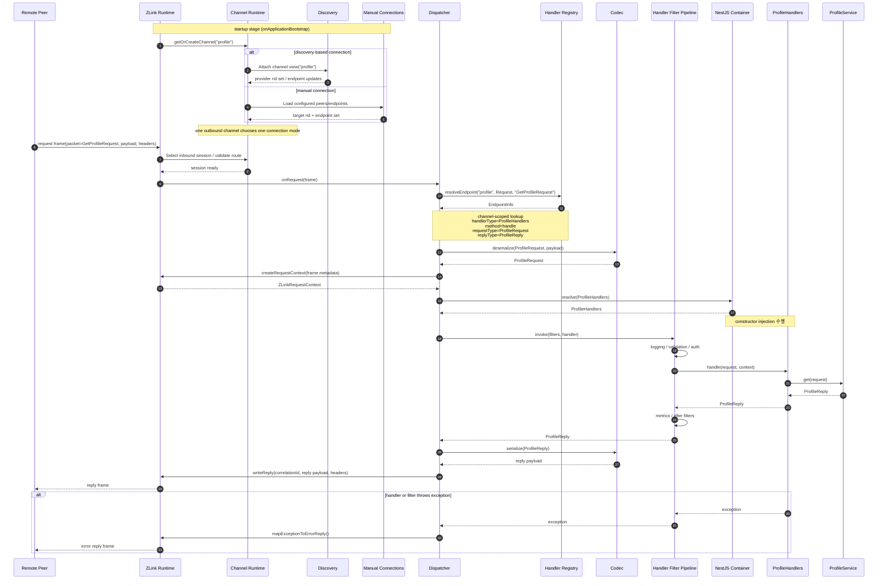

<!-- framework-adapter-nav:start -->
[문서 목록](../../../../doc/README.ko.md) | [이전: ZLink Framework Node.js Interface Catalog](./handler-interfaces.ko.md) | [다음: ZLink Framework NestJS SPOT Integration](./nestjs-spot.ko.md)
<!-- framework-adapter-nav:end -->

[스펙 목차](../README.ko.md)

[Node.js 묶음](../README.ko.md) | [인터페이스](./handler-interfaces.ko.md) | [샘플 계획](../sample-implementation-plan.ko.md) | [SPOT](./nestjs-spot.ko.md) | [STREAM](./nestjs-stream.ko.md) | [Registry](./nestjs-registry.ko.md)

# ZLink Framework NestJS Channel Messaging

> 이 문서는 dotnet `aspnet-core-channel-messaging.ko.md` 를 `NestJS` 표면으로 옮긴
> **이식 스펙**이다. 개념·의미론·동작은 dotnet 과 동일하고, 호스트 표면(ASP.NET
> Core → NestJS)과 언어 표면(C# → TypeScript)만 바꾼다. 번역 규칙은
> [dotnet-to-node-surface-mapping.ko.md](../internals/dotnet-to-node-surface-mapping.ko.md)
> 가 소유한다. 두 표기가 어긋나면 dotnet **코드**가 최종 기준이다.

## 1. 목표

이 절에서는 사용자가 channel messaging 표면에서 어떤 경험을 갖길 바라는지, 그리고 그
경험을 어떤 식으로 단순하게 만들지를 짧게 정리한다.

`NestJS` 앱이 다음과 같은 경험을 갖도록 만드는 것이 이 문서의 목표다.

- **channel 이름**[^channel]만 알면 다른 서비스를 호출할 수 있어야 한다.
- 공용 outbound client[^outbound]를 DI[^di]로 받아서 그대로 쓸 수 있어야 한다.
- event를 publish[^pubsub]할 수 있어야 한다.
- channel 단위로 Discovery[^discovery] 기반 자동 연결을 켤 수 있어야 한다.
- handler[^handler]를 등록하면 NestJS provider 컨테이너와 자연스럽게 맞물려야 한다.

여기서 outbound client 는 두 곳에서 같은 모양으로 쓸 수 있어야 한다.

- ZLink 메시지 handler 안.
- 기존 `NestJS` HTTP controller 또는 route handler 안.

즉 사용자가 `DealerSocket`[^dealer], `RouterSocket`[^router], `Discovery` 를 직접 조립할
필요는 없다. 한 단계 위에 있는 표면만 다루도록 만들겠다는 뜻이다. 구체적으로는
`ZLinkModule.forRoot(...)`, `ZLinkChannelClient`, handler 등록 정도가 그 표면이다.

등록부터 handler, HTTP endpoint, outbound 호출까지 흐름을 한 번에 보고 싶다면,
[sample-implementation-plan.ko.md](../sample-implementation-plan.ko.md) 를 참고한다.

## 2. 기반이 되는 Node 바인딩

이 절에서는 channel messaging 표면이 어떤 Node 바인딩(`@zlink-systems/zlink`) 기능 위에
올라가는지 정리한다.

이 문서는 아래 Node 바인딩 기능을 토대로 본다.

- `Discovery`
- `DealerSocket`
- `RouterSocket`
- request-reply helper
- `PubSocket` / `SubSocket`

`ZLink Framework` 는 위 표면을 감추지 않는다. 그 위에 통합 API 한 층을 얹을 뿐이다.
그 통합 층의 역할은 한 줄로 다음과 같다.

> "channel 별로 outbound 경로를 미리 만들어 두고, 호출자가 channel 이름만으로 부르도록
> 돕는다."

## 3. NestJS에서 기대하는 등록 방식

이 절에서는 channel 과 handler 를 module 등록 단계에서 어떻게 선언하는지, 그리고 자동
연결과 수동 연결을 어떻게 골라 두는지를 정리한다.

dotnet 의 `AddZLinkFramework(options => ...)` 빌더 람다는, node 에서
`ZLinkModule.forRoot(options)`(동기) / `ZLinkModule.forRootAsync(...)`(비동기, 설정 주입)
가 반환하는 `DynamicModule` 로 매핑한다. dotnet builder 메서드 한 개 = node options 의
키 한 개로 1:1 대응시키는 것을 기본으로 한다.

| dotnet builder 호출 | node options 키 |
| --- | --- |
| `AddClientServerChannel(name, ch => ...)` | `channels[name] = { server, client, requestHandlers, sendHandlers, handlerGroups }` |
| `AddFanoutChannel(name, ch => ...)` | `channels[name] = { publisher, subscriber, publishHandlers, handlerGroups }` |
| `AddDealerMeshChannel(name, ch => ...)` | `channels[name] = { dealerMesh: { bind?, client, requestHandlers, sendHandlers, handlerGroups } }` |
| `AddRouteMeshChannel(name, ch => ...)` | `channels[name] = { routeMesh: { bind, manualConnections?, requestHandlers, sendHandlers, handlerGroups } }` |
| `channel.EnableServer(s => s.Bind(...))` | `server: { bind: '...' }` |
| `channel.EnableClient()` | `client: {}` |
| `channel.EnableClient(c => c.UseManualConnections(...))` | `client: { manualConnections: [...] }` |
| `channel.EnablePublisher(p => p.Bind(...))` | `publisher: { bind: '...' }` |
| `channel.EnableSubscriber()` | `subscriber: {}` |
| `channel.EnableSubscriber(s => s.UseManualConnections(...))` | `subscriber: { manualConnections: [...] }` |
| `channel.AddHandlerGroup("api")` | `handlerGroups: ['api']` |
| `channel.AddRequestHandler<H, TReq, TRep>()` | `requestHandlers: [H]` |
| `channel.AddSendHandler<H, TMsg>()` | `sendHandlers: [H]` |
| `channel.AddPublishHandler<H, TMsg>()` | `publishHandlers: [H]` |
| `options.UseDiscovery(...)` | `discovery: { registries: [...] }` |
| `options.DefaultTimeout = ...` | `defaultTimeoutMs: number` |
| `options.Codecs.AddProtobuf()` | `codecs: [...]` |
| `options.AddHandlersFromAssemblyOf<T>()` | `discover: { modules / include }` (NestJS DiscoveryService) |

### 3.1 channel 등록

먼저 각 channel 이 어떤 역할을 열지 선언한다. client 역할은 자동 연결과 수동 연결을 둘
다 지원한다. 다만 한 가지 규칙이 있다.

> **같은 channel 의 같은 client capability 안에서 두 방식을 섞지는 않는다.** 둘 중
> 하나만 고른다.

여기서 "channel 을 등록한다" 는 말이 곧 "소켓 한 쌍을 만든다" 는 뜻은 아니다. 사용자
입장에서는 capability[^capability], 즉 역할 단위로 읽는 편이 자연스럽다.

- `server: { bind }` -- 이 channel 로 들어오는 request / send 를 local handler 가 받게
  한다. 서버 역할이므로 `bind` 로 자기 endpoint 를 함께 정한다.
  (dotnet `EnableServer(s => s.Bind(...))` 대응.)
- `client: {}` -- 이 channel 쪽으로 request / send 호출을 내보낸다.
  (dotnet `EnableClient()` 대응.)
- `publisher: { bind }` -- 이 channel 로 event 를 publish 한다. 마찬가지로 `bind` 로 자기
  endpoint 를 정한다. (dotnet `EnablePublisher(p => p.Bind(...))` 대응.)
- `subscriber: {}` -- 이 channel 의 event 를 받는다. (dotnet `EnableSubscriber()` 대응.)

> 현재 초안에서는 capability 값을 `boolean` 과 object 로 섞지 않고 항상 object 로
> 둔다. 즉 `client: {}` 는 client capability 만 켠다는 뜻이고,
> `client: { manualConnections: [...] }` 는 같은 capability 의 manual 연결까지 같이
> 준다는 뜻이다.

따라서 inbound handler 없이 outbound 호출만 하는 앱이라면 어떨까. server 역할은 두지
않고, `client: {}` 만 선언한 channel 만 두고 시작해도 된다.

#### 자동 연결 예시

```ts
@Module({
  imports: [
    ZLinkModule.forRoot({
      channels: {
        api: {
          server: { bind: 'tcp://0.0.0.0:7101' },
          handlerGroups: ['api'],
        },
        profile: {
          client: {},
        },
        account: {
          client: {},
        },
      },
      discovery: {
        registries: ['tcp://registry1:5551', 'tcp://registry2:5551'],
      },
    }),
  ],
})
export class AppModule {}
```

이 한 번의 호출이 다음 세 가지를 한꺼번에 셋업한다.

- framework 전역 runtime
- channel 별 runtime
- codec[^codec] 레지스트리

`profile: { client: {} }` 한 줄을 풀어 읽으면 다음과 같다.

> "이 앱은 `profile` channel 의 client 로 동작한다. 그쪽으로 보내는 outbound 경로와
> DEALER 소켓은 framework 가 알아서 만들어 관리한다."

이 예시는 다음과 같은 앱을 가정한다.

- `api` channel 에서는 서버 역할을 한다.
- `profile` 과 `account` channel 에서는 client 역할만 한다.

##### 자동 연결을 켜는 방법

자동 연결은 `discovery: { registries: [...] }` 를 **한 번** 두면 켜진다(dotnet
`options.UseDiscovery(...)` 대응). 그 뒤에 등록되는 모든 client / subscriber capability
는, 별도 신호 없이도 이 전역 Discovery 를 기본 연결 방식으로 쓴다. 즉 `client: {}` 만
선언해도, 그 channel 은 자동으로 Discovery 기반 연결로 동작한다.

> 현재 단계에서는 Discovery registry endpoint 를 channel 별로 다르게 두는 표면을
> 두지 않는다. registry 목록은 앱 전체에서 한 벌만 관리한다.

#### 수동 연결 예시

```ts
ZLinkModule.forRoot({
  channels: {
    api: {
      server: { bind: 'tcp://0.0.0.0:7101' },
    },
    profile: {
      client: {
        manualConnections: ['tcp://10.0.10.15:7101'],
      },
    },
  },
});
```

이 경우 framework 는 해당 channel 에 Discovery 를 강제하지 않는다. 그 channel 의
client capability 는 사용자가 직접 적어 준 peer 목록만 보고 연결을 관리한다.

이 초안에서 수동 연결은 remote `RoutingId`[^rid] 를 받지 않는다. 이유는 다음과 같다.
바인딩 하부 모델이 "이미 connect 된 DEALER 를 attach 한다" 는 방식이라, framework
표면도 endpoint 집합만 다루는 편이 자연스럽기 때문이다.

#### 두 방식을 한 앱에서 섞기

한 앱 안에 두 방식을 함께 둘 수도 있다. 다만 그 의미를 정확히 짚어 두어야 한다.

- "같은 channel 의 같은 client 에서 두 방식을 섞는다" 는 말이 **아니다**.
- **서로 다른 channel 끼리**, 다른 방식을 골라 쓸 수 있다는 뜻이다.

예를 들면 `profile` channel 은 Discovery 자동 연결로 두고, `account` channel 은 수동
연결로 둘 수 있다.

channel 별 연결 방식은, 해당 capability 의 options 가 `manualConnections` 를 줬는지
여부로 정해진다.

| 전역 `discovery` | capability `manualConnections` | 그 capability의 연결 방식 |
| --- | --- | --- |
| 있음 | 없음 | Discovery 자동 연결 |
| 있음 | 있음 | 수동 연결 (수동 우선) |
| 없음 | 있음 | 수동 연결 |
| 없음 | 없음 | startup validation[^startupvalidation] 오류 |

정리하면 다음과 같다.

- `discovery: { registries: [...] }` 는 모든 client / subscriber capability 의 **기본값**이다.
- 특정 channel 만 수동으로 바꾸고 싶을 때는, 그 channel 안에서
  `client: { manualConnections: [...] }` 또는
  `subscriber: { manualConnections: [...] }` 를 명시한다.
- 이때 명시한 capability 만 수동으로 분류되고, 나머지는 그대로 전역 Discovery 를 쓴다.

이렇게 나눠 두는 이유는 zlink core 의 동작 때문이다. Discovery 가 붙은 DEALER 는,
수동 `connect`, `disconnect`, `unbind`, `close` 를 받지 않는다. 따라서 framework 역시
같은 channel runtime 안에서 두 방식을 섞는 모델로 설명할 수 없다.

> route channel (`routeMesh`) 은 일반 channel 과 정책이 다르다. 같은 routed channel 안에서
> 전역 Discovery 와 수동 연결이 동시에 있으면, startup validation 단계에서 차단된다.
> 일반 client / subscriber 는 "수동이 있으면 수동 우선" 정책으로 둘이 공존해도
> 받아들인다.

#### SPOT route 수신과 router-capable channel

SPOT으로 들어오는 routed 메시지는 `ROUTER` capability가 필요하다. 따라서
`SpotNode`가 특정 channel에서 오는 SPOT route를 받으려면 SPOT 쪽 설정에서
`acceptSpotRoutesFrom: [channelName]` 을 사용한다(dotnet `AcceptSpotRoutesFromChannel`
대응). 또한 이 channel 쪽에서는 `server.spotRouteEgress` / `routeMesh.spotRouteEgress`
로 대상 SPOT node channel 을 지정한다(dotnet `EnableSpotRouteEgress(...)` 대응).

대상 channel은 두 종류다.

- `channels[name].server` 의 client-server `ROUTER`
- `channels[name].routeMesh` 의 route mesh `ROUTER`

`publisher`/`subscriber`(fanout)와 `dealerMesh` 는 router capability가 없으므로
SPOT route 수신 대상이 아니다. client-server channel 의 server `ROUTER`에서도
SPOT으로 보낼 수 있으므로, 이 기능은 route mesh 전용으로 제한하지 않는다.

#### 수동 연결은 channel이 아니라 capability 단위다

또 하나 짚어 둘 점이 있다. 수동 연결은 **channel 전체 설정이 아니라 capability 별
설정** 이라는 점이다. 같은 `profile` channel 이라도, 다음 두 가지는 서로 다른 연결
집합으로 관리된다.

- `profile.client`
- `profile.subscriber`

그래서 수동 연결 옵션도 channel 전체에 두지 않는다. `channels.profile.manualConnections`
같은 형태는 사용하지 않고, 대신 역할별 options 안에 둔다. 즉
`client: { manualConnections }`, `subscriber: { manualConnections }` 안쪽이다.

수동 연결을 쓰는 capability 에 대해서는, 런타임에서 다음 동작을 호출할 수 있는 연결
집합 표면을 둔다.

- `connect(endpoint)`
- `disconnect(endpoint)`
- `listConnections()`

자세한 표면(`ChannelClientConnections`, `ChannelSubscriberConnections`)은
[handler-interfaces.ko.md](./handler-interfaces.ko.md) 를 참고한다.

### 3.1.1 outbound-only 앱 예시

local handler 없이 `ZLinkChannelClient` 만 쓰는 앱도 똑같이 가능하다. 이 경우 framework 의
동작은 다음과 같다.

- server 역할은 열지 않는다.
- client 역할을 선언한 remote channel 에 대해서만, outbound DEALER 를 만든다.

```ts
ZLinkModule.forRoot({
  // 예제용 짧은 값. defaultTimeoutMs의 실제 기본은 30000(30초)다.
  defaultTimeoutMs: 1000,
  codecs: [ProtobufCodec],
  channels: {
    profile: {
      client: {},
    },
  },
  discovery: {
    registries: ['tcp://registry1:5551', 'tcp://registry2:5551'],
  },
});
```

### 3.2 outbound client 등록

```ts
ZLinkModule.forRoot({
  // 예제용 짧은 값. defaultTimeoutMs의 실제 기본은 30000(30초)다.
  defaultTimeoutMs: 1000,
  codecs: [ProtobufCodec],
});
```

핵심은 네 가지로 정리된다.

- `ZLinkChannelClient` 는 provider token 으로 주입받는다.
- 호출 대상은 gateway 주소가 아니라 **channel 이름**이다.
- runtime 은 등록된 channel capability 를 보고, 필요한 만큼만 runtime 을 만든다.
- client capability 가 있는 channel 은, 그 channel 전용 Discovery 뷰와 outbound DEALER
  를 하나씩 가진다.

여기서 outbound DEALER 는 framework 입장에서 주로 한 가지 역할을 맡는다. 바로
"request 의 reply 를 받아 오는 경로" 다. 일반 request / send handler dispatch[^dispatch]
는 local ROUTER (server) 가 받은 메시지를 기준으로 동작한다.

### 3.3 handler 등록

dotnet 은 assembly scan(`AddHandlersFromAssemblyOf<T>`) + attribute / interface 로
handler 를 **찾고**, 실제 노출은 명시적 등록이 정한다. node 는 NestJS `DiscoveryService`
로 provider 를 훑어 후보를 모은다.

```ts
ZLinkModule.forRoot({
  discover: {
    // NestJS DiscoveryService 가 훑을 모듈/범위 (구현 가이드가 확정)
  },
});
```

이 호출이 두 가지 일을 한꺼번에 한다.

1. handler provider 들을 NestJS DI 컨테이너 후보로 본다.
2. decorator/interface 메타데이터(`reflect-metadata`)로 request / send / publish handler
   후보를 찾아 둔다.

여기서 발견된 handler 가 곧장 **모든** channel 에 노출되는 것은 아니다. 실제로 어느
channel 에서 동작할지는, 별도로 묶어서 알려 주어야 한다.

#### handler group[^handlergroup]으로 묶기

먼저 handler 클래스에 `@ZLinkHandlerGroup("...")` decorator 를 달아, **논리 그룹
이름** 을 붙인다. 이 그룹 이름의 성격은 다음과 같다.

- 사용자가 임의로 정하는 문자열이다.
- 실제 channel 이름과는 완전히 분리된 namespace 다.

```ts
@Injectable()
@ZLinkHandlerGroup('api')
export class AuthenticatePlayerHandler {
  @ZLinkRequest()
  authenticate(
    request: AuthenticatePlayerReq,
    context: ZLinkRequestContext,
  ): AuthenticatePlayerRes {
    // ...
  }
}

@Injectable()
@ZLinkHandlerGroup('admin')
export class AdminCommandHandler {
  @ZLinkSend()
  async handle(
    command: RebootCommand,
    context: ZLinkSendContext,
  ): Promise<void> {
    // ...
  }
}
```

그리고 channel 등록 쪽에서, 그 그룹을 **channel 에 끌어다 붙인다**. 이때 두 축이 서로
분리된다.

- channel 이름은 `tictactoe.api` 처럼 실제 배포 식별자다.
- 그룹 이름은 `api` 처럼 코드 안의 논리 묶음 이름이다.

```ts
ZLinkModule.forRoot({
  channels: {
    'tictactoe.api': {
      server: { bind: 'tcp://0.0.0.0:7101' },
      handlerGroups: ['api'],
    },
    'tictactoe.admin': {
      server: { bind: 'tcp://0.0.0.0:7102' },
      handlerGroups: ['admin'],
    },
  },
});
```

`handlerGroups: ['api']` 를 풀어 읽으면 다음과 같다.

> "이 channel 로 들어온 메시지는, `@ZLinkHandlerGroup('api')` 가 붙은 모든 handler
> 클래스의 메서드 중에서, packet kind / packet name 이 맞는 것을 호출한다."

이렇게 두면 다음 장점이 생긴다.

- 그룹 이름은 **논리 묶음**이고, channel 이름은 **실제 배포 식별자**다. 둘이 분리되어
  있다. 그래서 같은 `api` 그룹을, `tictactoe.api` 와 `chess.api` 두 channel 에 동시에
  매핑할 수 있다.
- 한 channel 에 여러 그룹을 함께 매핑할 수도 있다.
  예: `handlerGroups: ['api', 'debug']`.
- handler 코드는 어느 물리 channel 로 매핑될지 신경 쓸 필요가 없다. 그룹 이름만 알면
  된다. 배포 시점에 channel topology 가 바뀌어도, handler 코드는 그대로 유지된다.

event handler 도 같은 규칙을 따른다. fanout channel 이라면, subscriber capability 쪽에서
같은 방식으로 그룹을 끌어 붙인다.

```ts
ZLinkModule.forRoot({
  channels: {
    'api.events': {
      subscriber: {},
      handlerGroups: ['api.events'],
    },
  },
});
```

같은 channel 안에서 같은 `kind + packet name`[^packetname] 조합이 둘 이상으로 매핑되면,
이는 startup validation 오류로 처리한다. 충돌의 두 가지 형태를 모두 포함한다.

- 같은 그룹 안에서의 충돌
- 서로 다른 그룹의 충돌이 한 channel 에 같이 붙은 경우

> 그룹 decorator 를 안 달면 어떻게 되는가. 그 handler 클래스는 어느 channel 에도 자동
> 매핑되지 않는다. 즉 `@ZLinkHandlerGroup("...")` 은 channel 에 노출하겠다는 의도를
> 명시하는 opt-in 표식이다.

#### decorator 표면 정리

decorator 표면은 다음과 같이 둔다.

```ts
@Injectable()
@ZLinkHandlerGroup('api')                 // 클래스 decorator. 논리 그룹 이름
export class ProfileHandler {
  @ZLinkRequest()                          // 메서드 decorator. request handler
  get(/* ... */): ProfileRes { /* ... */ }

  @ZLinkSend()                             // 메서드 decorator. one-way send handler
  notify(/* ... */): void { /* ... */ }

  @ZLinkPublish('profile.cache-invalidated')  // 메서드 decorator. publish 수신
  async onCacheInvalidated(/* ... */): Promise<void> { /* ... */ }
}
```

기본 packet key 는 payload 타입 이름이다(TypeScript 는 런타임 타입 소거가 있으므로
payload **클래스 생성자 이름** 또는 명시적 `@ZLinkPacket` / `packetName` 에 의존한다).
꼭 필요할 때만 packet name 을 override 한다.

handler 인스턴스 생성도 framework 가 직접 `new` 하지 않는다. 대신 NestJS DI 에 맡긴다.
구체적으로는 다음과 같이 동작한다.

- framework 는 그룹 매핑만 잡아 둔다.
- 실제 handler 객체는 NestJS provider 컨테이너로 resolve 한다.
- 따라서 일반 `NestJS` provider 와 마찬가지로, constructor injection 이 그대로 동작한다.

한 가지 더 짚자면, handler 가 매핑되는 channel 은 단순한 라우트 prefix 같은 것이
아니다. "이 앱이 그 channel 에서 서버 역할을 한다" 는 의미다.

그래서 decorator 의 책임도 다음과 같이 명확히 갈라 둔다.

- 메서드 decorator 는 packet kind 와 packet name override 만 담당한다.
- 클래스 decorator (`@ZLinkHandlerGroup`) 는 논리 그룹 소속만 담당한다.
- "어느 channel 에 그 그룹을 노출할지" 는 channel 등록 쪽이 정한다.

따라서 channel 이름은 메서드 decorator 의 기본 속성으로 두지 않는다. 반대로
outbound-only 앱이라면, server capability 가 있는 channel 자체를 두지 않을 수도 있어야
한다.

### 3.3.1 handler scope와 dispatch key

이 절에서는 같은 packet 이라도 어느 channel 로 들어왔는지에 따라 다른 handler 에 도착할
수 있다는 점, 그리고 dispatch key 가 어떻게 구성되는지를 정리한다.

일반 channel messaging 의 handler 레지스트리는 **전역 packet table 이 아니다**. 각
channel 은 자기에게 매핑된 handler group 또는 개별 typed handler registration 안에서만
packet 을 찾는다. `discover` scan 은 handler 후보를 찾는 단계이지, 그 handler 를 모든
channel 에 여는 단계가 아니다.

request / command dispatch key 는 다음 조합이다.

- inbound channel 이름
- message kind (`request`, `command`, `event` 중 하나). 단 response 는 client 측 reply
  correlation 전용이므로, dispatch key 어휘에 두지 않는다.
- packet name

내부 매핑 단계는 다음 순서로 진행된다.

1. channel 등록 시점에 `handlerGroups: ['api']` 또는 `requestHandlers: [...]` 같은 개별
   registration 으로 노출 대상을 고정한다.
2. group 에 속한 handler 와 개별 typed handler 를 packet kind / packet name 기준으로
   collect 한다. 둘 다 없으면 그 channel 의 application handler 후보는 0개다.
3. 메시지가 들어오면 그 channel의 후보 메서드 중 packet kind + packet name이 맞는
   하나를 골라 dispatch 한다.

event dispatch 도 같은 원칙을 쓴다. 다만 subscriber channel 에서는 약간 다르다.

- subscriber channel 에서는 `event + packet name` 조합으로 handler 를 찾는다.
- topic 은 publish fan-out[^fanout] 라우팅에 쓰는 값이다.
- 즉 typed event handler 를 고를 때 쓰는 기본 키는, topic 이 아니라 packet name 이다.

이렇게 두면 channel 별로 서로 다른 매핑이 가능해진다.

- 예 1. `tictactoe.api` channel 과 `chess.api` channel 이 같은 `api` 그룹을 공유한다면,
  둘 다 `AuthenticateReq` 를 같은 handler 로 받는다.
- 예 2. 반면 `tictactoe.api` 에 `api` 그룹을 붙이고, `tictactoe.admin` 에 `admin`
  그룹을 붙이면, 같은 `AuthenticateReq` packet 이라도 서로 다른 handler 가 받게 된다.

핵심은 중복 검사의 범위다. 중복 검사 범위는 channel 안으로 제한된다. 즉 다음 규칙이
나온다.

- 같은 channel 안에서 같은 `kind + packet name` 이 둘 이상이면, 이는 startup
  validation 오류다.
- 그러나 다른 channel 에서 같은 packet name 을 다시 쓰는 것은 허용한다.

## 4. 서버 쪽 프로그래밍 모델 초안

이 절에서는 inbound handler 가 어떤 모양으로 생기는지, 그리고 일반 channel messaging 의
성능 문맥이 SPOT hot path 와 어떻게 다른지를 정리한다.

handler 인터페이스 정의는 [handler-interfaces.ko.md](./handler-interfaces.ko.md) 를
기준으로 한다. 여기서는 그 인터페이스가 `NestJS` 위에서 어떻게 쓰이는지에 초점을
맞춘다. handler 메서드 시그니처는 dotnet `HandleAsync(request, context, ct)` 를 node
`handle(request, context)` 로 옮긴다. `CancellationToken` 은 필요할 때만 `signal?:
AbortSignal` 로 받고, 기본은 시그니처를 짧게 유지한다.

이 계층의 handler 는 SPOT room hot path[^hotpath] 와 똑같은 성능 문맥을 전제하지 않는다.
그렇다고 성능을 포기해도 된다는 뜻은 아니다.

성능 정책은 다음과 같다.

- 일반 channel messaging 도, reflection 과 할당을 가능한 한 줄이는 방향을 기본으로 잡는다.
- 다만 SPOT packet 처리처럼 "FPS room hot path" 를 전제로 한, 가장 강한 최적화를
  우선하지는 않는다.
- 그래서 일반 channel 쪽은, 편의 기능을 조금 더 허용할 여지가 있는 정도의 위치다.

### 4.1 request handler

```ts
@Injectable()
@ZLinkHandlerGroup('user')
export class UserHandlers {
  constructor(private readonly client: ZLinkChannelClient) {}

  @ZLinkRequest()
  async getUser(
    request: UserRequest,
    context: ZLinkRequestContext,
  ): Promise<UserReply> {
    const account = await this.client.request<GetAccountReply>(
      'account',
      new GetAccountRequest(request.accountId),
    );

    return {
      accountId: request.accountId,
      nickname: account.nickname,
    };
  }
}
```

이 모델에서 기대하는 동작은 다음과 같다.

- payload 는 typed 객체로 역직렬화된다.
- `ZLinkRequestContext` 에서 packet 이름, content type, 연결 취소 신호를 읽는다.
- `signal?: AbortSignal` 로 timeout / cancel 을 그대로 이어 준다.
- handler 클래스는 `UserHandlers`, `ItemHandlers` 처럼 주제별로 묶어도 된다.
- 반대로 packet 하나당 클래스 하나로 쪼개도 된다.
- 기본 dispatch key 는 request payload 타입(클래스 생성자) 이름이다. 예를 들어
  `UserRequest` 클래스는 기본적으로 `UserRequest` packet 으로 매핑된다.
- 이름 충돌이 있거나, 외부 계약 때문에 다른 키가 필요한 경우에만 packet name 을
  명시적으로 override 한다.
- dispatch lookup 은 전역이 아니라, **수신한 channel 의 namespace 안에서만** 수행된다.

interface 방식도 그대로 지원한다. 컴파일 타임에 시그니처를 강하게 확인하고 싶으면
다음처럼 쓴다.

```ts
@Injectable()
export class GetUserHandler implements ZLinkRequestHandler<UserRequest, UserReply> {
  async handle(request: UserRequest, context: ZLinkRequestContext): Promise<UserReply> {
    return { accountId: request.accountId, nickname: '...' };
  }
}
```

그리고 channel 등록 쪽에서 `requestHandlers: [GetUserHandler]` 로 개별 등록한다.

### 4.2 event handler

```ts
@Injectable()
@ZLinkHandlerGroup('cache.events')
export class CacheEventHandlers {
  @ZLinkPublish('cache.invalidate')
  async handle(
    message: CacheInvalidateEvent,
    context: ZLinkPublishContext,
  ): Promise<void> {
    return;
  }
}
```

request-response 와 event 는, 서로 별도 표면으로 보이는 편이 자연스럽다.

### 4.3 inbound dispatch 시퀀스

이 절에서는 들어온 packet 한 개가, handler 가 응답을 돌려줄 때까지 어떤 단계를 거치는지를
시퀀스 다이어그램으로 정리한다.

아래 시퀀스는 `GetProfileRequest` packet 이 local ROUTER 로 들어왔을 때의 흐름을
보여 준다. runtime 이 handler 를 찾고, DI 로 객체를 만들고, 응답을 돌려보내는 과정이다.

한 가지 주의할 점이 있다. outbound channel runtime 은 startup 시점에, Discovery 자동
연결과 수동 연결 중 **하나만** 골라 둔다.



이 흐름에서 짚어 둘 부분은 다음과 같다.

- outbound channel runtime 은, Discovery 자동 연결과 수동 연결 중 **하나만** 고른다.
- 한 앱 안에서 channel 마다 서로 다른 방식을 골라도 된다. 예를 들어 `profile` 은 자동
  연결로, `account` 는 수동 연결로 운영할 수 있다.
- 일반 request / send handler dispatch 는 local ROUTER (server) ingress 를 기준으로
  설명한다.
- handler lookup 은 수신한 channel 의 namespace 안에서,
  `channel name + kind + packet name` 조합으로 찾는다.
- outbound DEALER (client) 가 받는 메시지는, 일단 reply correlation 경로로만 본다.
  `ROUTER -> DEALER` 로 가는 임의 push 는, 현재 channel messaging 공용 계약에 넣지
  않는다.
- framework 는 handler 객체를 직접 `new` 하지 않는다. NestJS DI 로 resolve 한다.
- filter pipeline 이 있으면, handler 호출 전후를 감싼다.
- 예외는 framework 가 표준 오류 응답으로 매핑해, reply 로 돌려준다.

위 흐름에 등장하는 handler, client, filter 인터페이스 정의는,
[handler-interfaces.ko.md](./handler-interfaces.ko.md) 에 모여 있다. 주요 인터페이스만
추리면 다음과 같다.

- `ZLinkRequestHandler<TRequest, TResponse>` -- request-response handler
- `ZLinkSendHandler<TMessage>` -- 단방향 send handler
- `ZLinkChannelClient` -- outbound client (호출 단위는 `channelName`)
- `ZLinkHandlerFilter` -- handler 전후 공통 처리

node 표면의 기본 방향은 다음과 같이 정리된다.

> "interface 와 decorator 모두 가능하지만, 일반 사용자는 decorator 매핑과
> `ZLinkChannelClient` 를 함께 쓴다."

## 5. 클라이언트 쪽 프로그래밍 모델 초안

이 절에서는 channel 호출을 보내는 쪽 표면이 어떻게 생겼는지, 그리고 ZLink handler 와
HTTP handler 가 같은 표면을 어떻게 공유하는지 정리한다.

### 5.1 outbound client 표면 개요

channel 타입별로 별도의 client 인터페이스를 둔다. 한 앱에서 여러 종류의 channel 을 함께
쓰는 경우, 필요한 인터페이스를 각각 provider token 으로 받아서 쓰면 된다.

| 인터페이스 | 대응 channel 타입 | 호출 키 | 용도 |
| --- | --- | --- | --- |
| `ZLinkChannelClient` | `channels[name].server/client`, `channels[name].dealerMesh` | `channelName` | 1:1 request / send (DEALER 측) |
| `ZLinkFanoutClient` | `channels[name].publisher/subscriber` | `channelName + topic` | event publish (PUB 측) |

> **호출 표면(중요).** dotnet 의 fluent builder + terminator 결
> (`.RequestToChannel(...).SubmitAsync<T>(ct)`) 을 node 에서도 유지한다.
> 즉 `client.requestToChannel(...).timeout(...).submit<T>()`,
> `client.sendToChannel(...).packetName(...).submit()`,
> `publisher.publish(...).packetName(...).submit()` 형태다. `packetName` /
> `timeoutMs` 같은 변형은 마지막 options 인자가 아니라 builder chain 에 둔다.
> 그래야 send/request/publish 표면과 dotnet 표면이 같은 사용 흐름을 갖는다.

| dotnet (fluent) | node (fluent) |
| --- | --- |
| `client.RequestToChannel(ch, req).SubmitAsync<T>(ct)` | `await client.requestToChannel(ch, req).submit<T>()` |
| `client.RequestToChannel(ch, req).Timeout(t).SubmitAsync<T>(ct)` | `await client.requestToChannel(ch, req).timeout(timeoutMs).submit<T>()` |
| `client.SendToChannel(ch, msg).PacketName(n).Submit(ct)` | `await client.sendToChannel(ch, msg).packetName(n).submit()` |
| `publisher.Publish(ch, topic, evt).Submit(ct)` | `await publisher.publish(ch, topic, evt).submit()` |

### 5.2 ZLinkChannelClient

client-server channel(`server`/`client`)에 1:1 호출을 보낼 때 쓴다. dealer mesh
channel(`dealerMesh`) 도 같은 request/send 표면을 쓴다. 호출자는 **channel 이름** 만
넘기고, runtime 은 그 이름에 해당하는 등록과 runtime bundle 을 찾아 client-server DEALER
또는 dealer mesh DEALER 를 선택한다.

```ts
export interface ZLinkChannelClient {
  sendToChannel<TMessage>(
    channelName: string,
    message: TMessage,
  ): ZLinkSendCall;

  requestToChannel<TMessage>(
    channelName: string,
    request: TMessage,
  ): ZLinkRequestCall;
}
```

- 기본 packet key 는 request / message 타입(클래스 생성자) 이름이다.
- 특정 channel 의 ROUTER (server) 를 `rid` 로 직접 지정해서 호출하는 표면은 두지
  않는다. `rid` 로 곧장 보내는 경로는, framework backend 나 별도 adapter package 의
  internal route transport helper 에서만 다룬다(§5.4).
- `ZLinkChannelClient` 를 쓴다고 해서, local ROUTER (server) 가 반드시 있어야 하는 것은
  아니다. local handler 를 등록하지 않은 앱은, dealer-only outbound runtime 만으로도
  충분히 동작한다.
- 다만 그 경우에도 한 가지는 필요하다. **어떤** remote channel 에 접근할지를, startup
  단계에서 미리 한 번 선언해 두어야 한다.
- channel 이 없거나 client capability 가 없으면 runtime 은 socket 을 새로 만들지 않고
  `ZLinkConfigurationException` 으로 실패한다.

### 5.3 ZLinkFanoutClient

fanout channel(`publisher`/`subscriber`)에 event 를 publish 할 때 쓴다. 호출 키는
**`channelName + topic`** 두 축으로 구성된다.

```ts
export interface ZLinkFanoutClient {
  publish<TEvent>(
    channelName: string,
    topic: string,
    message: TEvent,
    options?: ZLinkSendOptions,    // { packetName? }
  ): Promise<void>;
}
```

규칙은 다음과 같다.

- 같은 channel 안에서도, topic 으로 fan-out scope 를 좁힐 수 있다.
- 기본 packet key 는 publish 인자 타입(클래스 생성자) 이름이다. decorator 나 `options`
  로 override 할 수 있다.
- subscriber 쪽 dispatch 는 packet name 을 기준으로 한다.
- topic 은 publisher 가 어느 fan-out 그룹으로 뿌릴지 결정하는 라우팅 값일 뿐이다.
  subscriber 는 그 channel 을 구독한 뒤, packet name 이 맞는 `@ZLinkPublish` handler
  를 호출한다.

```ts
@Controller('profiles')
export class ProfileRefreshController {
  constructor(private readonly publisher: ZLinkFanoutClient) {}

  @Post('refresh')
  async refresh(@Body() request: RefreshProfileHttpRequest) {
    await this.publisher.publish(
      'api.events',
      'profile.cache-refreshed',
      new ProfileCacheRefreshedEvent(request.accountId),
    );
    return; // 202 Accepted
  }
}
```

### 5.4 routed channel transport helper

route mesh channel(`channels[name].routeMesh`)의 위치는 actor, spot,
session actor dispatch[^session-actor-dispatch] 같은 framework 기능이 내부 transport 로
쓴다(dotnet `IZLinkRouteClient` 대응).

이 경로는 `routerChannelId + targetNodeRid` 를 알아야 동작한다. 따라서 application 의
public client 로 노출하지 않는다(dotnet 에서 `IZLinkRouteClient` 가 internal-only 인
것과 동일하다). application code 는 다른 표면을 통해 위치값을 안에서 숨긴다. 즉 다음과
같은 표면을 사용한다.

- `ZLinkSpotOutbound` (= dotnet `IZLinkSpotOutbound`)
- `ZLinkBoundSession` (= dotnet `IZLinkBoundSession`)

이들은 resolver 나 actor-session binding 이 위치값을 안에서 숨겨 주는 표면이다.

handler 쪽에서 source `RoutingId` 가 필요한 backend adapter 는, 다음 값을 직접 읽을 수
있다.

- `ZLinkRouteSendContext.sourceNodeRid`
- `ZLinkRouteRequestContext.sourceNodeRid`

다만 일반 application handler 의 기본 모델은, channel name, actor id, spot key 를
중심으로 둔다.

### 5.5 HTTP handler에서의 사용

§5.2 – 5.3 의 두 client 는, ZLink handler 안에서만 쓰는 것이 아니다. 기존 `NestJS`
HTTP controller 에서도 그대로 provider token 으로 주입받아 쓸 수 있어야 한다.

아래 예시는 `ZLinkChannelClient` 를 기준으로 한다. `ZLinkFanoutClient` 도 같은 방식으로
주입한다.

```ts
@Controller('profiles')
export class ProfileController {
  constructor(private readonly client: ZLinkChannelClient) {}

  @Post('get')
  async get(@Body() request: GetProfileHttpRequest): Promise<GetProfileReply> {
    return this.client
      .requestToChannel('profile', new GetProfileRequest(request.accountId))
      .submit<GetProfileReply>();
  }
}
```

이 표면은 다음과 같은 상황에서 쓸모가 있다.

- 기존 웹 요청을 처리하다가 내부의 다른 서비스를 호출해야 할 때.
- ZLink handler와 HTTP handler가 같은 outbound 호출 방식을 공유하고 싶을 때.
- framework 내부 공통 helper에서 호출해야 할 때.
- 특정 요청에만 별도 timeout이나 packet name override가 필요할 때.

이 정도 수준의 표면이 자연스럽다.

```ts
const reply = await client
  .requestToChannel('profile', new GetProfileRequest(accountId))
  .timeout(200)
  .submit<GetProfileReply>();

await client
  .sendToChannel('profile', new RefreshProfileCacheCommand(accountId))
  .packetName('profile.refresh-cache')
  .submit();
```

## 6. NestJS middleware, 서비스 AOP, handler pipeline

이 절에서는 ZLink handler 가 HTTP middleware, 서비스 AOP, handler filter 세 가지 횡단
관심사와 어떻게 맞물리는지를 정리한다.

### 6.1 HTTP middleware와의 관계

기존 `NestJS` 의 middleware[^middleware] / interceptor / guard 는 HTTP 파이프라인 전용이다.
따라서 ZLink 메시지 handler 에는 자동으로 적용되지 않는다.

```ts
export function authMiddleware(req: Request, res: Response, next: NextFunction) {
  next();
}
```

이 코드는 HTTP endpoint 에는 적용된다. 그러나 `@ZLinkRequest` handler 에는 직접 연결되지
않는다.

### 6.2 서비스 레이어 AOP

서비스 레이어 AOP[^aop] 는 지금 쓰고 있는 라이브러리 방식을 그대로 가져다 쓰면 된다.
중요한 점은 적용 위치다. AOP 는 **handler 메서드 자체가 아니라, handler 가 주입받는
서비스 계층에서** 동작한다.

```ts
@Injectable()
@ZLinkHandlerGroup('user')
export class UserHandlers {
  constructor(private readonly service: UserService) {}

  @ZLinkRequest()
  getUser(
    request: UserRequest,
    context: ZLinkRequestContext,
  ): Promise<UserReply> {
    return this.service.get(request);
  }
}
```

`UserService` 가 decorator, proxy, interceptor 같은 방식으로 감싸져 있다면, 그 AOP 가
그대로 적용된다. 어떤 방식을 쓸지는, 사용 중인 라이브러리의 규칙을 따른다.

### 6.3 ZLink handler filter

handler 단에서 공통 처리가 필요한 경우가 있다. logging, validation, authorization,
metrics, exception mapping 같은 항목이다. 이런 처리는 HTTP middleware 와는 별개로,
ZLink handler filter[^filter] 로 둔다(dotnet `UseFilter<TFilter>()` 대응 = node
`filters: [FilterClass]`).

`ZLinkHandlerFilter` 인터페이스 정의와 등록 방법은,
[handler-interfaces.ko.md](./handler-interfaces.ko.md) 를 참고한다.

## 7. Discovery와 channel runtime

이 절에서는 호출자가 channel 이름만 알아도 동작하도록 만드는 핵심 모델과, 그 모델이
왜 필요한지를 짧게 정리한다.

### 7.1 기본 방향

- 호출자는 **channel 이름** 만 지정한다.
- `ZLinkChannelClient` 는, 등록된 channel 이름마다 별도의 channel runtime 을 가진다.
- 각 channel 은 그 channel view 에 묶인 Discovery 와 outbound DEALER 소켓을 가진다.
- Discovery 가, 그 channel view 의 provider 목록을 유지한다.
- framework 는, 그 channel 의 rid 집합과 연결 상태를 보고 요청을 보낸다.
- 필요하면 운영 점검용으로, 별도 서비스가 `Registry`[^registry] 의 snapshot / query
  결과를 읽어 현재 topology[^topology] 를 노출할 수 있다.

### 7.2 왜 중요한가

이 모델의 핵심은 한 줄로 다음과 같다.

> **내부 서비스 호출에서 별도 gateway 나 load balancer 를 강제하지 않으면서도**, zlink
> core 의 fixed channel view 철학을 그대로 이어 간다는 점이다.

그래서 다음 방향을 기본으로 둔다.

- `ZLinkChannelClient` 는 gateway 주소가 아니라, channel 이름으로 요청한다.
- `ZLink Framework` 는, 그 channel 전용 outbound 경로로 직접 요청을 보낸다.
- 같은 channel 안의 여러 provider 는, 그 channel 안에서만 관리한다.

## 8. codec과 메시지 모델

이 절에서는 wire 위로 흐르는 메시지의 구성과, codec 을 어떻게 등록하는지를 정리한다.

현재 스펙은 다음 구성을 가정한다.

- 메시지 = `header + payload`
- payload codec = `protobuf` 또는 `json`

서버 간 channel message 는 공통
[message-model.ko.md](../../../../doc/spec/message-model.ko.md) 의 multipart 계약을 따른다. 즉
framework runtime 이 `DEALER/ROUTER` 또는 `PUB/SUB` 로 보내는 wire message 의 형태는
다음과 같다.

- `parts[0] = framework header`
- `parts[1] = payload`

이때 header 와 payload 를 하나의 JSON envelope 로 합쳐서, 단일 `Message` 로 보내지는
않는다.

이 규칙은 handler 표면을 복잡하게 만들기 위한 것이 아니다. application handler 는 여전히
typed request payload 와 context 를 받는다. multipart 구조는 adapter 내부의 transport
계약일 뿐이다. 이 계약의 목적은 route 와 dispatch 가 header 만 먼저 읽고, payload decode
는 handler 선택 이후로 늦출 수 있게 하는 것이다.

node 표면에서는 codec 등록과 serializer 선택을 다음과 같이 노출할 수 있다.

여기서 한 가지 짚어 둘 점이 있다. `codecs: [...]` 는 binding core 에 codec 구현을
직접 끼워 넣는다는 뜻이 아니다. 별도의 codec extension / provider 를 framework
registry 에 등록하는 흐름이라는 점에 유의한다.

```ts
ZLinkModule.forRoot({
  codecs: [ProtobufCodec, JsonCodec, MessagePackCodec],
});
```

## 9. lifecycle 초안

이 절에서는 channel runtime 이 host 의 어떤 lifecycle 단계와 맞물려야 하는지를 정리한다.

`NestJS` 에서는 다음 lifecycle[^lifecycle] 단계가 중요하다.

- 앱 시작 시, runtime 부팅
- Discovery 연결 수립
- handler dispatcher 시작
- 앱 종료 시, graceful shutdown

dotnet 은 이 단계를 `IHostedService`(`StartAsync`/`StopAsync`) 로 잡는다. node 는
NestJS provider lifecycle hook 으로 매핑한다.

| dotnet (`IHostedService`) | node (NestJS hook) | 시점 |
| --- | --- | --- |
| `StartAsync` | `onApplicationBootstrap()` | 모든 provider 준비 후 runtime 시동(bind/connect/discovery 시작) |
| `StopAsync` | `onApplicationShutdown(signal)` 또는 `onModuleDestroy()` | graceful close(linger, drain) |

runtime 시동에서 socket bind/connect 와 discovery 시작이 일어나므로, handler provider
들이 DI 에서 모두 resolvable 한 시점(`onApplicationBootstrap`) 에 시동을 건다.
lifecycle 의 정식 의미(시동 순서, 실패 처리, 종료 보장)는
[lifecycle-and-failure-semantics](../internals/lifecycle-and-failure-semantics.ko.md) 가
소유한다.

## 10. 결정된 기준

이 절에서는 설계상의 결정 사항을 짧게 정리해 둔다. 다른 절의 세부 내용은 모두 이 기준에
부합해야 한다.

- framework core 는, channel 별 typed wrapper 를 기본 표면으로 제공하지 않는다. 공용
  outbound 표면은 `ZLinkChannelClient` 하나로 유지한다.
- channel runtime 은 host startup 단계(`onApplicationBootstrap`)에서 등록된 capability
  를 보고 만든다. host shutdown 단계에서 정리한다. lazy first-call 생성으로 숨기지
  않는다. 즉 설정 오류는, startup 단계에서 미리 드러나도록 한다.
- topology query 는 운영용 HTTP endpoint 전용의 숨은 API 로 두지 않는다. 앱 내부에서도
  쓸 수 있는 일반 provider 로 열고, 운영 API 는 그 서비스를 얇게 감싸는 형태를 기본으로
  본다.

## 11. 회귀 테스트

이 절에서는 channel 문서가 다루는 항목이 함께 깨지지 않도록, 어떤 시나리오를 회귀
테스트로 묶어 두는지를 정리한다. dotnet 회귀 테스트와 1:1 로 대응한다.

channel 문서의 항목은 다음 흐름이 함께 깨지지 않아야 한다.

- 등록 검증
- 수동 / Discovery 연결
- handler group
- HTTP handler 사용

특히 다음 두 동작은 startup 에서 실패하거나, 독립 dispatch 로 동작해야 한다.

- capability 별 peer 획득 방식
- handler 매핑

그래서 아래 테스트를 유지한다.

| 테스트 케이스 | 확인 기준 |
|---------------|-----------|
| `Channels.forRoot_Throws_WhenChannelNameIsDuplicated` | 같은 channel 이름을 중복 등록하면 startup validation 예외가 난다. |
| `Channels.forRoot_Throws_WhenClientHasNoPeerAcquisitionPath` | client capability에 Discovery나 수동 연결이 없으면 시작 전에 실패한다. |
| `ClientServer.ManualClient_Request_And_Send_Work_Across_Hosts` | 수동 연결 client가 request와 send를 모두 처리한다. |
| `ClientServer.DiscoveryClient_Request_And_Send_Work_Across_Hosts` | Discovery 기반 client가 request와 send를 모두 처리한다. |
| `FiltersAndHttp.HttpHandler_Uses_SameContainer_ToResolve_ZLinkChannelClient` | HTTP controller가 같은 DI container에서 `ZLinkChannelClient`를 받아 호출한다. |
| `ZLinkAsyncSubmitter.SubmitAsync_DrainsPendingItemFromReadyCallback` | async submitter가 ready callback에서 pending item을 비우고 중복 전송하지 않는다. |

---

### 각주 모음

[^channel]: **channel** 은 zlink core의 논리적 통신 경로 단위다. 같은 channel 이름을 쓰는
    노드끼리만 메시지를 주고받는다. 물리 endpoint(IP:port)와는 분리된 개념이다.

[^outbound]: **outbound** 는 "내가 보내는 쪽" 방향을 뜻한다. 반대 방향은 inbound
    (받는 쪽). client 는 outbound, server 는 inbound 역할을 맡는다.

[^di]: **DI** = Dependency Injection. `NestJS` 가 기본으로 제공하는 의존성 주입
    컨테이너다. `providers: [...]` 로 등록하고 생성자 매개변수로 받아 쓴다.

[^pubsub]: **publish / subscribe** 는 1:N 이벤트 fan-out 패턴이다. publisher 가 토픽에
    이벤트를 보내면 그 토픽을 구독한 모든 subscriber 가 함께 받는다.

[^discovery]: **Discovery** 는 zlink core 의 자동 peer 발견 메커니즘이다. registry
    노드에 channel 의 provider 목록이 등록되어 있고, client 는 그 목록을 받아 자동으로
    연결한다. 수동 endpoint 관리가 필요 없다.

[^handler]: **handler** 는 들어온 메시지를 처리하는 사용자 코드다. request handler 는
    응답을 돌려주고, send handler 는 단방향으로 받기만 하며, event handler 는 publish 된
    이벤트를 받는다.

[^dealer]: **DEALER** 소켓은 ZeroMQ 계열의 비동기 양방향 소켓이다. 여기서는
    "outbound client 쪽 소켓" 정도로 이해하면 된다.

[^router]: **ROUTER** 소켓은 들어오는 요청에 routing id 를 붙여 식별해 주는 서버 쪽
    소켓이다. 응답은 그 routing id 를 보고 원래 발신자에게 다시 돌려보낸다.

[^capability]: **capability** 는 한 channel 안에서 이 앱이 맡는 역할이다. server,
    client, publisher, subscriber 네 가지가 있다. 한 channel 이 둘 이상의 capability 를
    동시에 가질 수도 있다(channel 타입에 따라).

[^codec]: **codec** 은 payload 를 바이트 배열과 객체 사이로 변환하는 직렬화기다. JSON,
    Protobuf, MessagePack 등이 여기에 해당한다.

[^rid]: **RoutingId** (rid) 는 zlink core 가 각 peer 에게 부여하는 식별자다. TypeScript
    표면에서는 branded `string` 으로 둔다. channel 안의 특정 노드를 가리킬 때 쓴다.

[^startupvalidation]: **startup validation** 은 앱이 뜨는 순간 설정을 검사해 오류가
    있으면 즉시 실패시키는 단계다. 런타임에서 늦게 드러나는 실패를 막는다.

[^packetname]: **packet name** 은 메시지 종류를 가리키는 문자열 키다. 기본값은 payload
    타입(클래스 생성자) 이름이고, `@ZLinkRequest('...')` / `options.packetName` 으로
    override 할 수 있다.

[^handlergroup]: **handler group** 은 handler 클래스에 `@ZLinkHandlerGroup("...")` 로
    붙이는 논리적 묶음 이름이다. 실제 channel 이름과는 분리된 별도 namespace 이며, channel
    등록 쪽에서 `handlerGroups: ['...']` 로 끌어다 붙여 어느 channel 에 노출할지
    결정한다.

[^dispatch]: **dispatch** 는 들어온 메시지를 packet kind 와 packet name 같은 키로 보고,
    실행할 handler 메서드를 골라 호출하는 단계를 가리킨다.

[^fanout]: **fan-out** 은 하나의 publish 가 여러 구독자에게 동시에 퍼져 나가는 흐름을
    가리킨다.

[^hotpath]: **hot path** 는 가장 자주, 가장 빠르게 도는 코드 경로다. SPOT 의 room
    hot path 는 게임 FPS 한 프레임 안에서 도는 코드라 가장 강한 최적화 대상이 된다.

[^session-actor-dispatch]: **session actor dispatch** 는 클라이언트 세션에서 들어온
    요청을, 그 세션과 묶인 actor 로 자동 전달하는 패턴이다.

[^middleware]: **middleware** 는 `NestJS` 의 HTTP 파이프라인에서 요청 전후를
    체인 형태로 가로채는 컴포넌트다. interceptor / guard 도 같은 HTTP 전용 계층이다.

[^aop]: **AOP** = Aspect-Oriented Programming. logging, transaction, security 같은
    공통 관심사를 메서드 호출 앞뒤에 끼워 넣는 패러다임이다. TypeScript 에서는 decorator,
    interceptor, proxy 같은 방식으로 구현한다.

[^filter]: **filter** 는 handler 호출 앞뒤를 둘러싸는 공통 처리 컴포넌트다. logging,
    validation, exception mapping 같은 cross-cutting 처리를 한 곳에 모을 때 쓴다.
    (NestJS 의 HTTP `ExceptionFilter` 와는 별개의 ZLink handler filter 다.)

[^registry]: **Registry** 는 zlink core 가 제공하는 topology 정보 저장소다. 어떤 channel
    에 어떤 provider 가 떠 있는지 같은 정보를 보관한다.

[^topology]: **topology** 는 어떤 노드(channel, spot, registry 등)가 어디에 있는지, 그리고
    서로 어떻게 연결되어 있는지를 나타내는 구성 정보다.

[^lifecycle]: **lifecycle** 은 컴포넌트가 시작·실행·종료를 거치는 단계 흐름을 가리킨다.
    NestJS 의 `onApplicationBootstrap` / `onApplicationShutdown` hook 으로 시작·종료
    시점을 잡아 둔다.
